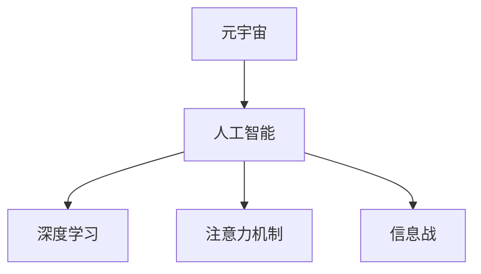

                 

## 1. 背景介绍

随着元宇宙（Metaverse）概念的兴起，我们即将进入一个全新的信息时代。在这个充满无限可能的世界中，信息将成为最核心的资源和武器。而作为信息处理和分析的核心工具——人工智能，自然成为了各大势力的焦点。

### 1.1 问题由来

在过去的几十年中，人工智能经历了飞速发展。从基于规则的系统，到统计学习，再到深度学习，我们见证了AI技术的不断突破。但这些技术的核心，实际上还是依赖于传统的信息处理方式。而元宇宙时代，将赋予人工智能更强的信息处理能力和自主性。

### 1.2 问题核心关键点

在元宇宙时代，人工智能的信息战主要体现在以下几个方面：

1. **信息获取能力**：元宇宙中充斥着海量信息，如何高效获取并提取有用信息，是AI技术的首要挑战。
2. **信息分析能力**：元宇宙中的信息往往复杂多变，如何利用AI进行深度分析和理解，是信息战的核心。
3. **信息生成能力**：元宇宙需要AI生成大量的虚拟内容，如虚拟世界构建、用户交互等，信息生成能力成为关键。
4. **信息安全能力**：元宇宙中的信息流动和处理需要高度安全，避免信息泄露和滥用。

### 1.3 问题研究意义

深入理解元宇宙时代的信息战，对于AI技术的战略部署具有重要意义：

1. **竞争优势**：掌握信息获取、分析、生成和安全技术，将使企业或国家在元宇宙中占据竞争优势。
2. **风险规避**：深入研究信息安全问题，可以有效规避元宇宙时代可能出现的信息泄露和滥用风险。
3. **创新驱动**：探索新的信息处理方法和工具，将推动AI技术的持续进步和创新。
4. **应用拓展**：元宇宙中的信息战技术可以广泛应用于虚拟现实、社交网络、游戏等领域，创造新的经济价值。

## 2. 核心概念与联系

### 2.1 核心概念概述

为了更好地理解元宇宙时代的信息战，本节将介绍几个核心概念：

- **元宇宙（Metaverse）**：一个虚拟的、沉浸式的、永续发展的数字空间，包含丰富的虚拟内容和交互。
- **人工智能（AI）**：一种能够模拟人类智能行为的计算机技术，涵盖感知、推理、学习、决策等多个方面。
- **深度学习（DL）**：一种基于神经网络的机器学习技术，能够处理和分析复杂非线性数据。
- **注意力机制（Attention Mechanism）**：一种用于增强模型对重要信息关注的机制，在元宇宙中具有重要应用。
- **元宇宙中的信息战**：指在元宇宙中，各实体利用AI技术进行信息获取、分析、生成和安全等方面的竞争和斗争。

这些核心概念之间的逻辑关系可以通过以下Mermaid流程图来展示：



这个流程图展示了一些核心概念之间的关系：

1. 元宇宙是人工智能应用的主要场景。
2. 深度学习是实现人工智能的重要技术手段。
3. 注意力机制是深度学习中增强模型关注能力的关键。
4. 信息战是元宇宙中AI技术竞争的核心。

这些概念共同构成了元宇宙时代信息战的基础，将深刻影响未来AI技术的发展方向。

## 3. 核心算法原理 & 具体操作步骤

### 3.1 算法原理概述

在元宇宙时代，AI的信息战主要依赖于深度学习和注意力机制。其核心思想是：利用深度学习模型，对元宇宙中的海量信息进行高效提取、分析和生成，同时在信息安全方面，通过注意力机制增强模型的信息关注能力，以提升信息战的效果。

形式化地，假设我们有一个元宇宙数据集 $D=\{x_i\}_{i=1}^N$，其中 $x_i$ 代表元宇宙中的信息片段。我们希望通过深度学习模型 $M_{\theta}$，学习到元宇宙中信息的关键特征，并利用注意力机制 $A(\cdot)$ 对信息的重要度进行加权，最终得到优化的信息表示 $y$。

优化目标为：

$$
\min_{\theta} \mathcal{L}(M_{\theta}, D)
$$

其中 $\mathcal{L}$ 为损失函数，用于衡量模型 $M_{\theta}$ 在数据集 $D$ 上的预测结果与真实结果的差距。

### 3.2 算法步骤详解

基于深度学习和注意力机制的信息战，一般包括以下几个关键步骤：

**Step 1: 准备元宇宙数据集**
- 收集元宇宙中的各种数据，包括文本、图像、音频等。
- 对数据进行预处理，如清洗、标准化、分词等。
- 将数据划分为训练集、验证集和测试集。

**Step 2: 选择深度学习模型**
- 选择合适的深度学习模型，如Transformer、CNN、RNN等，作为信息提取和分析的基础模型。
- 确定模型的输入和输出结构，如文本分类、图像识别、语音处理等。

**Step 3: 设计注意力机制**
- 根据具体任务，设计合适的注意力机制，如多头自注意力、点注意力、局部注意力等。
- 确定注意力机制的计算方式，如矩阵乘法、点积等。

**Step 4: 训练和优化模型**
- 使用深度学习框架（如TensorFlow、PyTorch等），对模型进行训练。
- 设置合适的学习率、批大小、迭代轮数等超参数。
- 使用优化算法（如Adam、SGD等），最小化损失函数 $\mathcal{L}$。

**Step 5: 信息提取和生成**
- 使用训练好的模型，对元宇宙数据进行信息提取和生成。
- 在元宇宙中，生成新的虚拟内容，如虚拟场景、用户交互等。

**Step 6: 信息安全**
- 在信息生成和传播过程中，采用加密、匿名化等技术，保护信息安全。
- 使用对抗样本技术，提高模型的鲁棒性，防止信息泄露。

### 3.3 算法优缺点

基于深度学习和注意力机制的信息战方法具有以下优点：

1. **高效性**：深度学习模型能够高效处理海量信息，特别是对于非结构化数据的处理能力极强。
2. **泛化能力**：注意力机制能够增强模型的泛化能力，对复杂多变的信息进行处理。
3. **灵活性**：深度学习模型的结构可调，可以根据具体任务进行优化设计。

但同时也存在一些局限性：

1. **计算资源消耗大**：深度学习模型的计算复杂度高，对计算资源有较高要求。
2. **模型复杂度高**：深度学习模型的结构和参数量大，难以进行直观解释。
3. **对抗样本敏感**：注意力机制对对抗样本的鲁棒性较差，容易被攻击。

尽管存在这些局限性，但深度学习和注意力机制依然是元宇宙时代信息战的核心技术手段，值得深入研究和应用。

### 3.4 算法应用领域

基于深度学习和注意力机制的信息战技术，在元宇宙中有着广泛的应用领域，例如：

- **虚拟现实（VR）和增强现实（AR）**：利用深度学习对虚拟内容进行生成和优化，提升用户体验。
- **元宇宙安全**：通过注意力机制，对元宇宙中的恶意信息进行监测和过滤，保护用户隐私和安全。
- **智能交互**：利用深度学习生成智能对话，提升用户互动体验。
- **虚拟社交**：通过深度学习进行个性化推荐，增强社交平台的吸引力。
- **虚拟经济**：利用深度学习进行金融分析和决策，提升虚拟经济系统的效率。

除了这些领域外，深度学习和注意力机制还在元宇宙中的游戏、教育、医疗等多个领域得到了广泛应用，展示了其强大的信息处理能力。

## 4. 数学模型和公式 & 详细讲解 & 举例说明

### 4.1 数学模型构建

在元宇宙中，信息战的数学模型可以形式化为：

$$
y = M_{\theta}(A(x))
$$

其中 $y$ 为元宇宙中信息的重要度表示，$x$ 为元宇宙中的原始信息，$A(\cdot)$ 为注意力机制，$M_{\theta}$ 为深度学习模型。

假设元宇宙中的信息为文本形式，则注意力机制可以设计为：

$$
A(x) = \frac{\exp(\text{score}(x_i))}{\sum_{j=1}^N \exp(\text{score}(x_j))}
$$

其中 $\text{score}(\cdot)$ 为信息的重要性评分函数，可以通过深度学习模型训练得到。

### 4.2 公式推导过程

以下我们以文本分类任务为例，推导注意力机制的评分函数及其计算方法。

假设元宇宙中的文本信息为 $x = \{x_1, x_2, ..., x_n\}$，每个信息的重要度评分函数为 $\text{score}(x_i) = W^T \cdot \text{emb}(x_i)$，其中 $\text{emb}(\cdot)$ 为信息嵌入函数，$W$ 为权重向量。

注意力机制的计算公式为：

$$
A(x) = \frac{\exp(\sum_{i=1}^n W^T \cdot \text{emb}(x_i))}{\sum_{j=1}^N \exp(W^T \cdot \text{emb}(x_j))}
$$

在实际应用中，为了提高计算效率，可以将注意力机制与深度学习模型一起训练，如Transformer模型中的多头自注意力机制。

### 4.3 案例分析与讲解

假设元宇宙中有一个文本分类任务，目标是将元宇宙中的文本信息分类为正向和负向。我们可以使用BERT模型作为深度学习基础模型，并结合多头自注意力机制进行信息关注和提取。

首先，对元宇宙中的文本信息进行预处理和标准化：

$$
x_i = \text{preprocess}(x_i)
$$

然后，使用BERT模型对文本信息进行嵌入：

$$
\text{emb}(x_i) = BERT(x_i)
$$

接着，利用多头自注意力机制对信息进行加权：

$$
A(x) = \text{Softmax}(W^T \cdot \text{emb}(x))
$$

最后，将注意力加权后的信息输入到全连接层进行分类：

$$
y = \text{FC}(A(x))
$$

其中 $\text{Softmax}(\cdot)$ 为softmax函数，$\text{FC}(\cdot)$ 为全连接层。

通过这种方式，我们可以高效地对元宇宙中的文本信息进行分类，并利用注意力机制增强模型的信息关注能力。

## 5. 项目实践：代码实例和详细解释说明

### 5.1 开发环境搭建

在进行元宇宙信息战的开发实践前，我们需要准备好开发环境。以下是使用Python进行PyTorch开发的环境配置流程：

1. 安装Anaconda：从官网下载并安装Anaconda，用于创建独立的Python环境。

2. 创建并激活虚拟环境：
```bash
conda create -n pytorch-env python=3.8 
conda activate pytorch-env
```

3. 安装PyTorch：根据CUDA版本，从官网获取对应的安装命令。例如：
```bash
conda install pytorch torchvision torchaudio cudatoolkit=11.1 -c pytorch -c conda-forge
```

4. 安装Transformers库：
```bash
pip install transformers
```

5. 安装各类工具包：
```bash
pip install numpy pandas scikit-learn matplotlib tqdm jupyter notebook ipython
```

完成上述步骤后，即可在`pytorch-env`环境中开始开发实践。

### 5.2 源代码详细实现

下面我们以元宇宙文本分类任务为例，给出使用Transformers库对BERT模型进行信息战微调的PyTorch代码实现。

首先，定义文本分类任务的数据处理函数：

```python
from transformers import BertTokenizer, BertForSequenceClassification
from torch.utils.data import Dataset
import torch

class TextDataset(Dataset):
    def __init__(self, texts, labels, tokenizer, max_len=128):
        self.texts = texts
        self.labels = labels
        self.tokenizer = tokenizer
        self.max_len = max_len
        
    def __len__(self):
        return len(self.texts)
    
    def __getitem__(self, item):
        text = self.texts[item]
        label = self.labels[item]
        
        encoding = self.tokenizer(text, return_tensors='pt', max_length=self.max_len, padding='max_length', truncation=True)
        input_ids = encoding['input_ids'][0]
        attention_mask = encoding['attention_mask'][0]
        
        # 对token-wise的标签进行编码
        encoded_labels = torch.tensor([label], dtype=torch.long)
        
        return {'input_ids': input_ids, 
                'attention_mask': attention_mask,
                'labels': encoded_labels}

# 标签与id的映射
label2id = {'POSITIVE': 1, 'NEGATIVE': 0}
id2label = {v: k for k, v in label2id.items()}

# 创建dataset
tokenizer = BertTokenizer.from_pretrained('bert-base-cased')

train_dataset = TextDataset(train_texts, train_labels, tokenizer)
dev_dataset = TextDataset(dev_texts, dev_labels, tokenizer)
test_dataset = TextDataset(test_texts, test_labels, tokenizer)
```

然后，定义模型和优化器：

```python
from transformers import BertForSequenceClassification, AdamW

model = BertForSequenceClassification.from_pretrained('bert-base-cased', num_labels=len(label2id))

optimizer = AdamW(model.parameters(), lr=2e-5)
```

接着，定义训练和评估函数：

```python
from torch.utils.data import DataLoader
from tqdm import tqdm
from sklearn.metrics import accuracy_score

device = torch.device('cuda') if torch.cuda.is_available() else torch.device('cpu')
model.to(device)

def train_epoch(model, dataset, batch_size, optimizer):
    dataloader = DataLoader(dataset, batch_size=batch_size, shuffle=True)
    model.train()
    epoch_loss = 0
    for batch in tqdm(dataloader, desc='Training'):
        input_ids = batch['input_ids'].to(device)
        attention_mask = batch['attention_mask'].to(device)
        labels = batch['labels'].to(device)
        model.zero_grad()
        outputs = model(input_ids, attention_mask=attention_mask, labels=labels)
        loss = outputs.loss
        epoch_loss += loss.item()
        loss.backward()
        optimizer.step()
    return epoch_loss / len(dataloader)

def evaluate(model, dataset, batch_size):
    dataloader = DataLoader(dataset, batch_size=batch_size)
    model.eval()
    preds, labels = [], []
    with torch.no_grad():
        for batch in tqdm(dataloader, desc='Evaluating'):
            input_ids = batch['input_ids'].to(device)
            attention_mask = batch['attention_mask'].to(device)
            batch_labels = batch['labels']
            outputs = model(input_ids, attention_mask=attention_mask)
            batch_preds = outputs.logits.argmax(dim=1).to('cpu').tolist()
            batch_labels = batch_labels.to('cpu').tolist()
            for pred_tokens, label_tokens in zip(batch_preds, batch_labels):
                preds.append(pred_tokens)
                labels.append(label_tokens)
                
    print(f'Accuracy: {accuracy_score(labels, preds)}')
```

最后，启动训练流程并在测试集上评估：

```python
epochs = 5
batch_size = 16

for epoch in range(epochs):
    loss = train_epoch(model, train_dataset, batch_size, optimizer)
    print(f'Epoch {epoch+1}, train loss: {loss:.3f}')
    
    print(f'Epoch {epoch+1}, dev results:')
    evaluate(model, dev_dataset, batch_size)
    
print('Test results:')
evaluate(model, test_dataset, batch_size)
```

以上就是使用PyTorch对BERT进行元宇宙文本分类任务微调的完整代码实现。可以看到，得益于Transformers库的强大封装，我们可以用相对简洁的代码完成BERT模型的加载和微调。

### 5.3 代码解读与分析

让我们再详细解读一下关键代码的实现细节：

**TextDataset类**：
- `__init__`方法：初始化文本、标签、分词器等关键组件。
- `__len__`方法：返回数据集的样本数量。
- `__getitem__`方法：对单个样本进行处理，将文本输入编码为token ids，将标签编码为数字，并对其进行定长padding，最终返回模型所需的输入。

**label2id和id2label字典**：
- 定义了标签与数字id之间的映射关系，用于将预测结果解码回真实的标签。

**训练和评估函数**：
- 使用PyTorch的DataLoader对数据集进行批次化加载，供模型训练和推理使用。
- 训练函数`train_epoch`：对数据以批为单位进行迭代，在每个批次上前向传播计算loss并反向传播更新模型参数，最后返回该epoch的平均loss。
- 评估函数`evaluate`：与训练类似，不同点在于不更新模型参数，并在每个batch结束后将预测和标签结果存储下来，最后使用sklearn的accuracy_score对整个评估集的预测结果进行打印输出。

**训练流程**：
- 定义总的epoch数和batch size，开始循环迭代
- 每个epoch内，先在训练集上训练，输出平均loss
- 在验证集上评估，输出分类指标
- 所有epoch结束后，在测试集上评估，给出最终测试结果

可以看到，PyTorch配合Transformers库使得BERT微调的代码实现变得简洁高效。开发者可以将更多精力放在数据处理、模型改进等高层逻辑上，而不必过多关注底层的实现细节。

当然，工业级的系统实现还需考虑更多因素，如模型的保存和部署、超参数的自动搜索、更灵活的任务适配层等。但核心的微调范式基本与此类似。

## 6. 实际应用场景

### 6.1 智能交互系统

在元宇宙中，智能交互系统是核心应用之一。通过深度学习和注意力机制，可以实现更加高效、自然的用户互动。

具体而言，智能交互系统可以通过元宇宙中的文本、语音、图像等信息，构建用户意图模型，并根据用户意图生成合适的响应。例如，用户可以输入一段描述，系统能够自动生成虚拟场景和互动内容，提升用户体验。

### 6.2 虚拟安全监测

元宇宙中的信息流动复杂多样，容易受到恶意攻击和信息泄露的威胁。通过深度学习和注意力机制，可以实现虚拟安全监测，保障元宇宙中的信息安全。

具体而言，系统可以实时监测元宇宙中的信息流动，利用注意力机制筛选出重要信息，并进行加密、匿名化等处理，防止信息泄露和滥用。同时，系统还可以检测和过滤恶意信息，保障用户安全。

### 6.3 虚拟经济系统

元宇宙中的虚拟经济系统，需要高效的信息处理和决策支持。通过深度学习和注意力机制，可以实现虚拟经济中的金融分析和决策优化。

具体而言，系统可以通过深度学习对虚拟经济中的交易数据进行分析，利用注意力机制对重要特征进行加权，预测市场趋势和风险，帮助用户进行投资决策。同时，系统还可以进行虚拟货币的生成和分配，保障虚拟经济的稳定运行。

### 6.4 未来应用展望

随着深度学习和注意力机制的发展，元宇宙中的信息战技术将呈现以下几个趋势：

1. **多模态信息融合**：除了文本信息，元宇宙中的图像、语音、视频等多样信息也需要高效处理和分析，未来的信息战技术将支持多模态信息融合。
2. **实时性增强**：元宇宙中的信息战需要实时响应，未来的深度学习模型将进一步优化，提升推理速度和计算效率。
3. **模型可解释性提升**：元宇宙中的信息战需要更高的可解释性，未来的注意力机制将更加透明和可控，提高模型的决策透明度。
4. **跨领域应用拓展**：未来的信息战技术将不再局限于元宇宙领域，而是广泛应用于各个行业和领域，推动AI技术的全面普及。

总之，随着深度学习和注意力机制的不断发展，元宇宙中的信息战技术将变得更加强大和灵活，为AI技术的未来发展带来新的机遇和挑战。

## 7. 工具和资源推荐

### 7.1 学习资源推荐

为了帮助开发者系统掌握元宇宙时代的信息战技术，这里推荐一些优质的学习资源：

1. **深度学习与信息战技术**：由元宇宙研究机构发布的一系列课程和文档，涵盖深度学习、注意力机制、元宇宙安全等主题。

2. **Transformers实战教程**：HuggingFace提供的官方教程，包括BERT、GPT、XLNet等模型实战开发，深入讲解信息战技术的细节。

3. **信息战技术白皮书**：由知名AI公司发布的技术白皮书，详细介绍元宇宙时代的信息战技术，提供丰富的实践案例。

4. **元宇宙技术沙龙**：由元宇宙技术社区组织的技术沙龙，邀请行业专家分享元宇宙信息战技术的最新进展和应用案例。

通过对这些资源的学习实践，相信你一定能够快速掌握元宇宙时代的信息战技术，并用于解决实际的NLP问题。

### 7.2 开发工具推荐

高效的开发离不开优秀的工具支持。以下是几款用于元宇宙信息战开发的常用工具：

1. PyTorch：基于Python的开源深度学习框架，灵活动态的计算图，适合快速迭代研究。大部分预训练语言模型都有PyTorch版本的实现。

2. TensorFlow：由Google主导开发的开源深度学习框架，生产部署方便，适合大规模工程应用。同样有丰富的预训练语言模型资源。

3. Transformers库：HuggingFace开发的NLP工具库，集成了众多SOTA语言模型，支持PyTorch和TensorFlow，是进行信息战任务的开发利器。

4. Weights & Biases：模型训练的实验跟踪工具，可以记录和可视化模型训练过程中的各项指标，方便对比和调优。与主流深度学习框架无缝集成。

5. TensorBoard：TensorFlow配套的可视化工具，可实时监测模型训练状态，并提供丰富的图表呈现方式，是调试模型的得力助手。

6. Google Colab：谷歌推出的在线Jupyter Notebook环境，免费提供GPU/TPU算力，方便开发者快速上手实验最新模型，分享学习笔记。

合理利用这些工具，可以显著提升元宇宙信息战任务的开发效率，加快创新迭代的步伐。

### 7.3 相关论文推荐

元宇宙时代的信息战技术涉及多学科知识的融合，以下是几篇奠基性的相关论文，推荐阅读：

1. **Transformer模型**：Attention Mechanism的提出，为深度学习模型在信息处理中的应用奠定了基础。

2. **BERT预训练模型**：在大规模无标签数据上进行自监督预训练，显著提升了模型的泛化能力和信息提取能力。

3. **GPT生成模型**：基于Transformer架构，利用自回归机制，能够生成高质量的文本内容。

4. **信息战技术**：介绍元宇宙中的信息战技术，包括信息获取、分析、生成和安全的全面探讨。

5. **多模态信息融合**：研究如何将视觉、语音、文本等多种信息进行融合，提升信息处理的综合能力。

这些论文代表了大语言模型信息战技术的发展脉络。通过学习这些前沿成果，可以帮助研究者把握学科前进方向，激发更多的创新灵感。

## 8. 总结：未来发展趋势与挑战

### 8.1 总结

本文对元宇宙时代的信息战技术进行了全面系统的介绍。首先阐述了元宇宙和人工智能的基本概念，明确了信息战在元宇宙中的重要性和应用场景。其次，从原理到实践，详细讲解了深度学习和注意力机制在信息战中的应用，提供了完整的代码实例。同时，本文还广泛探讨了信息战技术在智能交互、虚拟安全、虚拟经济等实际应用场景中的前景和挑战。

通过本文的系统梳理，可以看到，元宇宙时代的信息战技术正处于快速发展期，深度学习和注意力机制成为其中的核心技术手段。这些技术不仅在元宇宙中具有广阔的应用前景，还将在各个行业中不断拓展和深化，为人类社会带来新的变革和机遇。

### 8.2 未来发展趋势

展望未来，元宇宙时代的信息战技术将呈现以下几个发展趋势：

1. **多模态信息处理**：除了文本信息，未来的信息战技术将更加注重多模态信息的融合，包括视觉、语音、图像等，提升信息处理的全面性和多样性。
2. **实时性增强**：元宇宙中的信息战需要实时响应，未来的深度学习模型将进一步优化，提升推理速度和计算效率。
3. **跨领域应用**：信息战技术不仅应用于元宇宙领域，还将拓展到医疗、教育、金融等各个行业，推动AI技术的全面普及。
4. **模型可解释性提升**：未来的信息战模型将更加透明和可控，提高模型的决策透明度和可信度。

以上趋势凸显了元宇宙时代信息战技术的广阔前景，为AI技术的未来发展带来了新的机遇和挑战。

### 8.3 面临的挑战

尽管元宇宙时代的信息战技术已经取得了显著进展，但在迈向更加智能化、普适化应用的过程中，仍面临诸多挑战：

1. **计算资源消耗大**：元宇宙中的信息战需要大量的计算资源，对算力、内存、存储等硬件资源提出了高要求。
2. **模型复杂度高**：深度学习模型的结构和参数量大，难以进行直观解释和理解。
3. **信息安全问题**：元宇宙中的信息流动复杂多样，容易受到恶意攻击和信息泄露的威胁。
4. **跨领域应用难度**：信息战技术在不同领域的应用，需要结合特定领域的专业知识，难度较大。
5. **数据隐私保护**：元宇宙中的信息隐私保护成为重要课题，如何在确保隐私的同时，进行高效的信息处理和分析，仍需深入研究。

正视这些挑战，积极应对并寻求突破，将是大语言模型信息战技术走向成熟的必由之路。

### 8.4 研究展望

面向未来，元宇宙时代的信息战技术需要在以下几个方面进行深入研究：

1. **计算效率优化**：研究如何通过模型压缩、模型裁剪等技术，降低计算资源的消耗，提升模型的实时性。
2. **模型可解释性提升**：研究如何增强模型的透明度和可解释性，提高决策的透明度和可信度。
3. **跨领域应用拓展**：研究如何将信息战技术应用于不同领域，结合特定领域的专业知识，提升应用效果。
4. **数据隐私保护**：研究如何在保障用户隐私的同时，进行高效的信息处理和分析。
5. **对抗攻击防御**：研究如何增强模型对对抗样本的鲁棒性，防止恶意攻击和信息泄露。

这些研究方向将进一步推动元宇宙时代信息战技术的发展，为AI技术的未来应用带来新的突破和创新。

## 9. 附录：常见问题与解答

**Q1：深度学习和注意力机制在元宇宙中的应用有哪些？**

A: 深度学习和注意力机制在元宇宙中的应用非常广泛，具体包括：

1. **文本分类**：利用深度学习模型对元宇宙中的文本信息进行分类，如新闻、评论、聊天等。
2. **情感分析**：利用注意力机制对文本中的情感进行分析和判断，提升信息处理的质量。
3. **对话生成**：利用深度学习模型生成虚拟对话，提升用户交互体验。
4. **虚拟场景构建**：利用深度学习模型对元宇宙中的虚拟场景进行生成和优化，提升用户体验。
5. **信息安全**：利用深度学习和注意力机制对元宇宙中的信息进行监测和过滤，保障信息安全。

这些应用展示了深度学习和注意力机制在元宇宙中的强大能力，为元宇宙的信息战提供了坚实的基础。

**Q2：如何选择深度学习模型进行信息战？**

A: 选择深度学习模型进行信息战需要考虑多个因素，包括：

1. **数据类型**：不同类型的元宇宙数据适合不同的深度学习模型。例如，文本数据适合使用BERT、LSTM等模型，图像数据适合使用CNN、Transformer等模型。
2. **任务类型**：不同的任务需要不同的深度学习模型。例如，文本分类适合使用BERT、GPT等模型，对话生成适合使用Transformer等模型。
3. **计算资源**：深度学习模型的计算复杂度不同，需要根据可用计算资源进行选择。例如，BERT模型计算复杂度高，适合在GPU等高性能设备上进行训练和推理。
4. **性能要求**：根据具体应用场景的性能要求，选择适合的深度学习模型。例如，实时性要求高的应用场景，可以选择推理速度较快的模型。

通过综合考虑以上因素，可以选择最适合的信息战深度学习模型，进行高效的信息处理和分析。

**Q3：深度学习和注意力机制在信息战中的局限性有哪些？**

A: 深度学习和注意力机制在信息战中存在以下局限性：

1. **计算资源消耗大**：深度学习模型计算复杂度高，对计算资源有较高要求，可能存在计算资源瓶颈。
2. **模型复杂度高**：深度学习模型的结构和参数量大，难以进行直观解释，可能存在模型可解释性不足的问题。
3. **对抗样本敏感**：注意力机制对对抗样本的鲁棒性较差，可能存在模型鲁棒性不足的问题。
4. **数据隐私保护**：元宇宙中的信息隐私保护成为重要课题，可能存在数据隐私泄露的问题。

这些局限性需要在实际应用中加以考虑和解决，以充分发挥深度学习和注意力机制在信息战中的优势。

**Q4：如何提高元宇宙信息战模型的鲁棒性？**

A: 提高元宇宙信息战模型的鲁棒性可以从以下几个方面进行：

1. **数据增强**：通过数据增强技术，扩充训练集的多样性，提升模型的泛化能力。
2. **对抗训练**：利用对抗样本训练模型，增强模型的鲁棒性，防止对抗攻击。
3. **模型裁剪**：通过模型裁剪技术，减少模型的参数量和计算复杂度，提升模型的实时性和计算效率。
4. **正则化**：利用正则化技术，防止模型过拟合，提升模型的泛化能力。
5. **多模型集成**：通过多模型集成技术，提升模型的鲁棒性和稳定性。

这些方法可以帮助提升元宇宙信息战模型的鲁棒性，提高其在实际应用中的表现。

**Q5：如何在元宇宙中保护用户隐私？**

A: 在元宇宙中保护用户隐私可以从以下几个方面进行：

1. **数据加密**：对用户数据进行加密处理，防止数据泄露。
2. **匿名化处理**：对用户数据进行匿名化处理，保护用户隐私。
3. **访问控制**：对元宇宙中的信息进行访问控制，防止未授权访问。
4. **隐私保护技术**：利用差分隐私、联邦学习等隐私保护技术，保护用户隐私。
5. **法律合规**：遵循相关的法律法规，保护用户隐私。

这些方法可以帮助保护元宇宙中的用户隐私，确保信息战技术的健康发展。

---

作者：禅与计算机程序设计艺术 / Zen and the Art of Computer Programming

