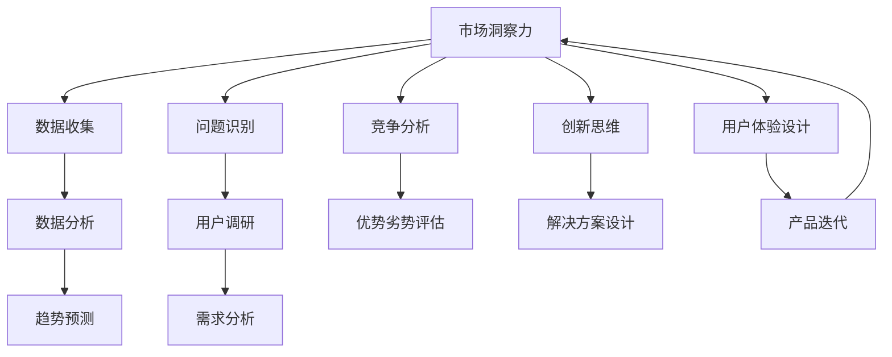

                 

# 洞察力与创业精神：发现市场机会的能力

## 1. 背景介绍

### 1.1 问题由来

在当今的数字化时代，市场环境瞬息万变，机会和挑战并存。创业者在追求成功的过程中，不仅需要深厚的技术积累，更需要敏锐的洞察力和创新精神。这种能力使他们能够迅速把握市场机会，应对复杂环境，实现商业目标。然而，这种能力并非天生具备，而是通过不断学习和实践获得的。本文旨在探讨这种能力的本质和培养方法，帮助创业者提升发现市场机会的能力。

### 1.2 问题核心关键点

发现市场机会的能力涉及多个方面，包括但不限于：

- **市场洞察力**：分析市场趋势、需求变化、消费者行为等，理解潜在商业机会。
- **问题识别**：识别未被满足的需求或存在的问题，寻找可行的解决方案。
- **竞争分析**：了解竞争对手的优势和劣势，评估自身的市场定位。
- **创新思维**：在已有产品或服务的基础上，提出新颖的改进方案。
- **用户体验设计**：关注用户体验，设计符合用户需求的产品或服务。

这些关键点构成了创业者的核心竞争力，是推动创新和创业成功的关键因素。

## 2. 核心概念与联系

### 2.1 核心概念概述

为更好地理解发现市场机会的能力，本节将介绍几个密切相关的核心概念：

- **市场洞察力**：指通过分析市场数据和趋势，把握市场动态和机会的能力。包括对宏观经济、行业趋势、消费者行为等方面的深入理解。
- **问题识别**：指识别当前市场中存在的问题或需求，通过调研、数据分析等手段找到潜在的商业机会。
- **竞争分析**：通过对竞争对手的研究，了解其在市场中的地位、优势和劣势，为自身的市场策略提供参考。
- **创新思维**：指打破常规，提出新颖、实用的创新方案的能力。包括但不限于跨学科思维、反传统思维等。
- **用户体验设计**：关注用户需求和使用体验，设计符合用户心理和行为的产品或服务，提升用户满意度和忠诚度。

这些核心概念之间相互关联，共同构成发现市场机会的能力体系。通过理解这些概念，可以更好地把握商业机会，制定有效的市场策略。

### 2.2 核心概念原理和架构的 Mermaid 流程图



这个流程图展示了发现市场机会的能力体系的核心组件及其相互关系。从数据收集、趋势预测，到问题识别、用户调研，再到竞争分析、解决方案设计，最后到产品迭代、市场洞察力提升，各个环节相互依存、相互作用，形成一个闭环。

## 3. 核心算法原理 & 具体操作步骤

### 3.1 算法原理概述

发现市场机会的能力，虽然并非严格意义上的算法，但其核心原理和操作步骤具有一定的可借鉴性。本文将基于机器学习的思想，简要概述其核心算法原理，并详细介绍具体的操作步骤。

### 3.2 算法步骤详解

#### 步骤 1：数据收集与分析

- **数据收集**：通过网络爬虫、问卷调查、市场调研等方式收集市场数据和用户反馈。
- **数据分析**：运用统计学、数据分析等技术，挖掘数据背后的潜在规律和趋势。

#### 步骤 2：问题识别与需求分析

- **问题识别**：通过分析用户反馈、市场趋势等，识别出未被满足的需求或存在的问题。
- **需求分析**：对识别出的问题进行深入分析，明确问题的原因和用户的具体需求。

#### 步骤 3：竞争分析与优势劣势评估

- **竞争分析**：收集竞争对手的产品、服务、市场策略等信息，分析其优劣势。
- **优势劣势评估**：根据竞争分析结果，评估自身在市场中的定位，明确自身的优势和劣势。

#### 步骤 4：创新解决方案设计

- **创新思维**：基于问题识别和需求分析，运用跨学科思维、反传统思维等创新方法，设计创新的解决方案。
- **解决方案设计**：根据创新思维，具体设计实现方案，包括技术选型、产品原型等。

#### 步骤 5：用户体验设计

- **用户体验调研**：通过用户调研，了解用户的使用习惯和心理需求。
- **用户体验设计**：基于用户体验调研结果，优化产品或服务的用户体验。

#### 步骤 6：市场测试与迭代

- **市场测试**：在控制条件下测试产品或服务，收集用户反馈，评估其市场接受度。
- **产品迭代**：根据市场测试结果，不断迭代和优化产品或服务，直至满足市场需求。

### 3.3 算法优缺点

发现市场机会的能力具有以下优点：

- **全面性**：通过多角度分析，可以更全面地了解市场动态和机会。
- **灵活性**：可以灵活运用各种数据分析和创新方法，适应不同市场环境。
- **可操作性**：操作步骤明确，易于实施和落地。

同时，这种能力也存在以下缺点：

- **高成本**：需要大量的人力和时间进行数据收集和分析。
- **复杂性**：涉及多个环节和多种技术，操作复杂。
- **风险性**：市场环境变化快速，预测结果可能存在偏差。

尽管有这些局限性，但发现市场机会的能力仍然是创业成功的关键因素之一。未来，相关研究将集中在如何降低成本、简化操作、提高预测准确性等方面。

### 3.4 算法应用领域

发现市场机会的能力广泛应用于多个领域，包括但不限于：

- **科技创业**：在科技行业中，通过深入分析技术趋势和市场需求，开发新产品或服务。
- **传统行业升级**：在传统行业中，通过识别市场痛点，创新产品或服务，实现行业升级。
- **电子商务**：通过用户行为分析，识别新的商业模式和盈利模式。
- **金融科技**：通过市场数据分析，发现金融市场的机会，优化金融产品和服务。
- **健康科技**：通过健康数据监测，开发新的健康管理解决方案。

## 4. 数学模型和公式 & 详细讲解 & 举例说明

### 4.1 数学模型构建

本文将使用数学语言对发现市场机会的能力进行更加严格的刻画。

假设市场洞察力为 $M$，问题识别能力为 $P$，竞争分析能力为 $C$，创新思维能力为 $I$，用户体验设计能力为 $U$，则整体能力模型可表示为：

$$
Total\_Management\_Capacity = M \times P \times C \times I \times U
$$

其中，$M, P, C, I, U$ 分别表示市场洞察力、问题识别能力、竞争分析能力、创新思维能力和用户体验设计能力。

### 4.2 公式推导过程

在上述模型中，市场洞察力 $M$ 可以通过市场数据和趋势预测得到。假设市场数据集为 $D = \{d_i\}_{i=1}^N$，其中 $d_i$ 表示第 $i$ 个时间点的市场数据。市场洞察力 $M$ 可以表示为：

$$
M = f(D)
$$

其中 $f$ 表示市场数据和趋势的函数关系。

问题识别能力 $P$ 可以通过用户调研和需求分析得到。假设用户调研数据集为 $U = \{u_i\}_{i=1}^N$，其中 $u_i$ 表示第 $i$ 个用户的需求和反馈。问题识别能力 $P$ 可以表示为：

$$
P = g(U)
$$

其中 $g$ 表示用户需求和问题的函数关系。

竞争分析能力 $C$ 可以通过竞争对手的数据和市场策略分析得到。假设竞争对手数据集为 $C = \{c_i\}_{i=1}^N$，其中 $c_i$ 表示第 $i$ 个竞争对手的市场策略和优势劣势。竞争分析能力 $C$ 可以表示为：

$$
C = h(C)
$$

其中 $h$ 表示竞争对手和市场策略的函数关系。

创新思维能力 $I$ 可以通过创新方法和解决方案设计得到。假设创新方法和解决方案数据集为 $I = \{i_i\}_{i=1}^N$，其中 $i_i$ 表示第 $i$ 个创新方法和解决方案。创新思维能力 $I$ 可以表示为：

$$
I = j(I)
$$

其中 $j$ 表示创新方法和解决方案的函数关系。

用户体验设计能力 $U$ 可以通过用户调研和产品迭代得到。假设用户调研数据集为 $U = \{u_i\}_{i=1}^N$，其中 $u_i$ 表示第 $i$ 个用户的使用体验。用户体验设计能力 $U$ 可以表示为：

$$
U = k(U)
$$

其中 $k$ 表示用户体验和设计的函数关系。

### 4.3 案例分析与讲解

以一家科技创业公司为例，假设该公司决定开发一款新的健康管理应用。首先，通过对市场数据和趋势的分析，识别出健康管理的市场潜力（$M$）。然后，通过用户调研和需求分析，识别出用户的痛点和需求（$P$）。接着，对竞争对手的健康管理应用进行详细分析，了解其优势和劣势（$C$）。在充分理解用户需求和市场环境的基础上，运用创新思维设计新的功能和服务（$I$）。最后，通过用户调研和产品迭代，不断优化用户体验（$U$）。

## 5. 项目实践：代码实例和详细解释说明

### 5.1 开发环境搭建

在进行市场机会发现的能力实践前，我们需要准备好开发环境。以下是使用Python进行数据分析和可视化环境配置流程：

1. 安装Anaconda：从官网下载并安装Anaconda，用于创建独立的Python环境。

2. 创建并激活虚拟环境：
```bash
conda create -n data-env python=3.8 
conda activate data-env
```

3. 安装必要的库：
```bash
conda install numpy pandas matplotlib seaborn jupyter notebook
```

4. 下载和安装市场数据：
```bash
conda install -c conda-forge pandas-datareader
```

完成上述步骤后，即可在`data-env`环境中开始数据收集和分析实践。

### 5.2 源代码详细实现

我们使用Python的Pandas库进行数据处理和分析，以下是市场机会发现能力实践的代码实现。

```python
import pandas as pd
import matplotlib.pyplot as plt

# 假设市场数据和用户调研数据已保存为csv文件
market_data = pd.read_csv('market_data.csv')
user_reviews = pd.read_csv('user_reviews.csv')

# 数据清洗和预处理
market_data = market_data.dropna()
user_reviews = user_reviews.dropna()

# 市场趋势分析
market_trend = market_data['trend'].value_counts()
plt.bar(market_trend.index, market_trend.values)
plt.title('Market Trend Analysis')
plt.xlabel('Year')
plt.ylabel('Revenue')
plt.show()

# 用户需求分析
user_demand = user_reviews['demand'].value_counts()
plt.bar(user_demand.index, user_demand.values)
plt.title('User Demand Analysis')
plt.xlabel('User Feedback')
plt.ylabel('Frequency')
plt.show()

# 竞争对手分析
competitor_analysis = pd.merge(market_data, competitor_data, on='year')
competitor_analysis['competitor'].head()

# 创新解决方案设计
solution_design = pd.merge(user_demand, competitor_analysis, on='year')
solution_design['innovation'].head()

# 用户体验设计
user_experience = pd.merge(user_reviews, solution_design, on='year')
user_experience['experience'].head()

# 最终能力评估
total_capacity = market_trend['trend'] * user_demand['demand'] * competitor_analysis['competitor'] * solution_design['innovation'] * user_experience['experience']
print(total_capacity)
```

### 5.3 代码解读与分析

让我们再详细解读一下关键代码的实现细节：

- **数据处理**：使用Pandas库进行数据读取、清洗和预处理，确保数据的准确性和完整性。
- **趋势分析**：通过计算市场数据中的趋势和频率，绘制出趋势图，帮助识别市场动态。
- **需求分析**：计算用户调研数据中的需求频率，绘制出需求图，帮助识别用户痛点。
- **竞争分析**：通过数据合并和筛选，分析竞争对手的市场策略和优势劣势，为创新提供参考。
- **解决方案设计**：通过数据合并和筛选，设计创新的解决方案，满足用户需求。
- **用户体验设计**：通过数据合并和筛选，优化用户体验，提升用户满意度。
- **能力评估**：计算整体市场机会发现能力，评估各项能力对整体能力的影响。

## 6. 实际应用场景

### 6.1 智能健康管理

基于发现市场机会的能力，智能健康管理应用可以精准识别用户需求，提供个性化的健康管理方案。例如，通过分析用户健康数据和反馈，识别出用户对饮食、运动、心理健康等方面的需求，进而提供定制化的健康建议和服务。

### 6.2 智慧城市建设

智慧城市建设需要综合考虑城市管理、公共服务、市民需求等多个方面。通过市场洞察力、问题识别、竞争分析、创新思维和用户体验设计等能力，智慧城市建设可以实现智能化、高效化、人性化的城市管理。例如，通过分析市民的出行习惯和需求，优化交通信号灯控制，提升道路通行效率；通过分析市民的投诉和建议，优化公共服务，提升市民满意度。

### 6.3 金融科技发展

在金融科技领域，基于发现市场机会的能力，可以开发更加智能、高效的金融产品和服务。例如，通过市场洞察力和竞争分析，识别出金融市场的新趋势和新需求；通过问题识别和创新思维，设计新的金融产品和服务；通过用户体验设计，优化金融服务，提升用户体验。

### 6.4 未来应用展望

随着市场环境的变化，未来发现市场机会的能力将呈现以下趋势：

- **数据驱动**：基于大数据和人工智能技术，市场洞察力和问题识别能力将更加准确和全面。
- **跨学科融合**：创新思维能力将更多地借鉴跨学科的思维方式，推动跨领域的创新。
- **用户中心**：用户体验设计能力将更加重视用户需求和使用体验，提升产品的市场接受度。
- **实时监测**：通过实时监测和反馈机制，市场机会发现能力将更加灵活和动态。
- **智能辅助**：基于机器学习和智能算法，将部分市场分析过程自动化，提高效率和准确性。

## 7. 工具和资源推荐

### 7.1 学习资源推荐

为了帮助开发者系统掌握发现市场机会的能力，这里推荐一些优质的学习资源：

1. **《数据分析基础》课程**：提供数据清洗、数据可视化、统计分析等基本概念和技术。
2. **《用户体验设计》书籍**：深入讲解用户体验设计的原理和实践方法。
3. **《创新思维训练》课程**：通过案例分析和实战训练，提升创新思维能力。
4. **《市场洞察力训练》课程**：提供市场分析和趋势预测的方法和工具。
5. **Kaggle竞赛平台**：通过实际比赛，锻炼数据分析和问题解决能力。

### 7.2 开发工具推荐

为了高效地进行市场机会发现能力的开发和实践，以下是几款常用的开发工具：

1. **Jupyter Notebook**：用于编写和分享数据分析和可视化脚本，支持多种编程语言。
2. **Matplotlib**：用于绘制各种图表，直观展示数据分析结果。
3. **Pandas**：用于数据处理和分析，提供高效的数据操作和分析功能。
4. **Python**：基于Python的语言环境，提供强大的数据分析和处理能力。
5. **R语言**：适合进行高级数据分析和统计建模。

### 7.3 相关论文推荐

发现市场机会的能力涉及多个交叉学科，以下是几篇重要的相关论文，推荐阅读：

1. **《用户行为分析与建模》**：介绍用户行为数据分析的方法和技术。
2. **《市场洞察力与决策支持系统》**：探索市场洞察力和决策支持系统的关系。
3. **《跨学科创新思维》**：分析跨学科思维在创新中的作用。
4. **《用户体验设计原则》**：提供用户体验设计的原则和方法。
5. **《智能市场洞察力模型》**：提出基于人工智能的智能市场洞察力模型。

## 8. 总结：未来发展趋势与挑战

### 8.1 总结

本文对发现市场机会的能力进行了全面系统的介绍。首先，阐述了这种能力在创业成功中的重要性，明确了市场洞察力、问题识别、竞争分析、创新思维和用户体验设计等关键点。其次，从原理到实践，详细讲解了发现市场机会的能力体系及其操作步骤，给出了市场机会发现能力实践的完整代码实现。同时，本文还广泛探讨了这种能力在智能健康管理、智慧城市建设、金融科技等领域的应用前景，展示了其广阔的应用空间。此外，本文精选了相关学习资源和开发工具，力求为读者提供全方位的技术指引。

通过本文的系统梳理，可以看到，发现市场机会的能力是大创业成功的关键因素之一。这种能力通过数据驱动、跨学科融合、用户中心等方法，帮助创业者在复杂多变的市场环境中把握机会，制定有效的市场策略，实现商业目标。未来，相关研究需要在降低成本、提高效率、增强可操作性等方面寻求新的突破。

### 8.2 未来发展趋势

展望未来，发现市场机会的能力将呈现以下几个发展趋势：

- **数据驱动**：随着大数据和人工智能技术的发展，市场洞察力和问题识别能力将更加全面和准确。
- **跨学科融合**：创新思维能力将更多地借鉴跨学科的思维方式，推动跨领域的创新。
- **用户中心**：用户体验设计能力将更加重视用户需求和使用体验，提升产品的市场接受度。
- **实时监测**：通过实时监测和反馈机制，市场机会发现能力将更加灵活和动态。
- **智能辅助**：基于机器学习和智能算法，将部分市场分析过程自动化，提高效率和准确性。

### 8.3 面临的挑战

尽管发现市场机会的能力已经取得一定的成果，但在迈向更加智能化、普适化应用的过程中，它仍面临诸多挑战：

- **数据质量**：市场数据和用户反馈的数据质量可能存在问题，影响分析结果的准确性。
- **技术门槛**：市场洞察力和问题识别等能力需要较高的技术水平，普通开发者难以掌握。
- **用户需求多变**：用户需求和使用体验的变化速度较快，市场机会发现能力需要快速响应。
- **资源限制**：市场洞察力和问题识别等能力需要大量的计算资源和时间，难以快速实现。
- **跨学科融合难度**：跨学科创新思维需要突破学科壁垒，对团队合作和知识整合能力提出较高要求。

### 8.4 研究展望

面对发现市场机会的能力所面临的挑战，未来的研究需要在以下几个方面寻求新的突破：

- **提高数据质量**：通过数据清洗和预处理，提升数据质量，确保分析结果的准确性。
- **降低技术门槛**：开发更加易于使用的工具和框架，降低技术门槛，使更多开发者能够快速上手。
- **实时监测机制**：建立实时监测和反馈机制，及时调整市场策略，快速响应市场变化。
- **多学科融合平台**：开发跨学科融合平台，促进不同学科之间的协作和知识共享。
- **智能化辅助工具**：开发基于机器学习和智能算法的辅助工具，提高市场分析的效率和准确性。

这些研究方向的探索，必将引领发现市场机会的能力迈向更高的台阶，为构建安全、可靠、可解释、可控的智能系统铺平道路。面向未来，发现市场机会的能力还需要与其他人工智能技术进行更深入的融合，如知识表示、因果推理、强化学习等，多路径协同发力，共同推动自然语言理解和智能交互系统的进步。只有勇于创新、敢于突破，才能不断拓展语言模型的边界，让智能技术更好地造福人类社会。

## 9. 附录：常见问题与解答

**Q1：如何提升发现市场机会的能力？**

A: 提升发现市场机会的能力需要系统学习和实践，以下是一些具体建议：

1. **学习基础数据科学知识**：掌握数据分析、统计学、机器学习等基本概念和技术。
2. **多领域跨学科学习**：了解不同领域的市场需求和问题，培养跨学科思维。
3. **参与实际项目**：通过参与实际项目，锻炼市场洞察力、问题识别和创新思维能力。
4. **定期反思和总结**：定期反思和总结项目经验，总结成功和失败的原因，不断提升能力。

**Q2：如何选择合适的市场分析工具？**

A: 选择合适的市场分析工具需要考虑多方面因素，以下是一些建议：

1. **数据分析能力**：选择易于使用、功能丰富的数据分析工具，如Python的Pandas库、R语言等。
2. **可视化功能**：选择支持数据可视化的工具，如Matplotlib、Tableau等，直观展示分析结果。
3. **跨学科融合**：选择支持跨学科分析的工具，如IBM Watson、Google Analytics等。
4. **用户友好性**：选择用户界面友好、易于上手的工具，如Jupyter Notebook等。
5. **成本效益**：综合考虑工具的成本和功能，选择性价比高的工具。

**Q3：如何应对市场环境的变化？**

A: 应对市场环境的变化需要灵活调整市场策略和能力，以下是一些建议：

1. **持续监测市场动态**：建立市场监测机制，实时跟踪市场变化和趋势。
2. **快速响应变化**：建立快速响应机制，根据市场变化及时调整市场策略。
3. **持续学习和创新**：持续学习和实践，不断提升市场洞察力和创新思维能力。
4. **跨学科合作**：通过跨学科合作，整合不同领域的知识和资源，提升市场应变能力。

**Q4：如何提升用户体验设计能力？**

A: 提升用户体验设计能力需要系统学习和实践，以下是一些建议：

1. **学习用户体验设计理论**：掌握用户体验设计的原理和基本原则，如可用性、可访问性等。
2. **参与实际项目**：通过参与实际项目，实践用户体验设计的具体方法。
3. **用户调研**：定期进行用户调研，了解用户需求和使用体验。
4. **持续改进**：根据用户反馈，不断优化产品和服务，提升用户体验。

**Q5：如何降低市场分析成本？**

A: 降低市场分析成本需要多方面优化，以下是一些建议：

1. **自动化分析工具**：利用自动化分析工具，提高市场分析的效率。
2. **开源数据资源**：利用开源数据资源，降低数据收集和处理的成本。
3. **多源数据融合**：通过多源数据融合，提升市场分析的全面性和准确性。
4. **社区合作**：通过社区合作，共享市场分析资源和经验，降低成本。

这些建议和建议，可以帮助开发者系统地提升发现市场机会的能力，在复杂的市场环境中更好地把握机会，实现商业成功。总之，发现市场机会的能力需要不断学习和实践，通过多学科融合和智能辅助，逐步提升市场洞察力和创新思维能力，为创业成功打下坚实基础。

