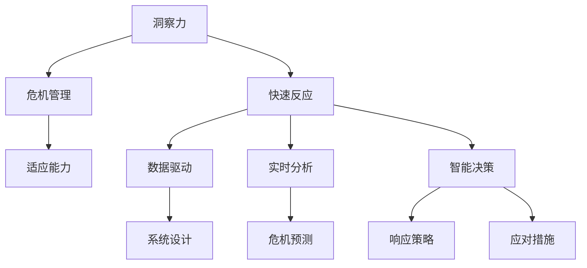

                 

# 洞察力与危机管理：快速反应与适应的能力

> 关键词：洞察力、危机管理、快速反应、适应能力、数据驱动、实时分析、智能决策、系统设计、危机预测、响应策略、应对措施

## 1. 背景介绍

### 1.1 问题由来

在当前复杂多变的全球环境中，企业和组织面临的挑战和风险日益增加。无论是自然灾害、公共卫生事件，还是市场波动、技术变革，都要求决策者具备快速反应和适应的能力。然而，传统的决策模式往往难以适应快速变化的形势，决策过程容易受到人为偏见、经验局限和信息不全的影响。如何通过技术手段，提升决策者的洞察力和应对能力，成为现代社会亟需解决的重要问题。

### 1.2 问题核心关键点

危机管理的关键在于快速、准确地识别风险、预测趋势、制定应对方案，并动态调整应对策略。而提升决策者的洞察力和适应能力，则是实现这一目标的重要途径。大数据、人工智能和自动化技术的快速发展，为这一目标的实现提供了新的可能性。

## 2. 核心概念与联系

### 2.1 核心概念概述

为更好地理解洞察力与危机管理的结合，本节将介绍几个关键概念及其相互关系：

- **洞察力(Insight)**：指通过观察和分析发现事物内在规律和关联的能力。在决策中，洞察力表现为对信息背后深层逻辑的捕捉和把握。
- **危机管理(Crisis Management)**：指在危机发生时，通过识别、评估和响应来最小化损失和恢复秩序的管理过程。
- **快速反应(Fast Response)**：指在危机发生时迅速、有效地采取行动，以控制局面、减少影响。
- **适应能力(Adaptability)**：指在环境变化时，调整策略、资源和过程以保持有效性和可持续性的能力。
- **数据驱动(Data-Driven)**：指以数据为基础进行决策，减少主观偏见，提高决策科学性和准确性。
- **实时分析(Real-time Analytics)**：指对实时数据进行分析，及时发现问题和预测趋势，支持快速响应和决策。
- **智能决策(Intelligent Decision Making)**：指通过算法和模型，辅助决策者进行复杂判断和优化的决策过程。
- **系统设计(System Design)**：指构建能够高效运作的框架和流程，以支持洞察力和危机管理的实践。
- **危机预测(Prediction)**：指通过模型和算法，预测潜在危机的发生和影响，为预防和应对提供依据。
- **响应策略(Response Strategies)**：指针对不同危机类型和规模，制定相应的应对措施和策略。
- **应对措施(Mitigation Measures)**：指为缓解危机影响而采取的具体行动和干预手段。

这些概念之间的联系可以通过以下Mermaid流程图来展示：



这个流程图展示了一系列概念之间的逻辑关系：

1. 洞察力通过数据驱动和实时分析提升，支持智能决策。
2. 危机管理通过智能决策和响应策略，实现快速反应和适应。
3. 系统设计提供框架和工具，支持整个流程的高效运作。
4. 危机预测通过数据驱动和智能决策，提前识别和预警潜在危机。
5. 响应策略和应对措施基于智能决策，确保有效的危机管理。

## 3. 核心算法原理 & 具体操作步骤
### 3.1 算法原理概述

基于洞察力和危机管理的算法原理，主要包括以下几个方面：

- **数据预处理**：从原始数据中提取有用信息，如清洗、归一化、特征工程等。
- **数据分析与建模**：应用统计学、机器学习等技术，构建模型分析数据，预测趋势，识别异常。
- **实时监控与预警**：利用实时数据流，通过自动化系统持续监控环境变化，触发预警机制。
- **智能决策支持**：构建智能决策系统，辅助决策者快速分析问题，制定策略。
- **响应策略优化**：通过模拟和优化算法，优化危机应对策略，提高效果和效率。
- **效果评估与迭代**：对危机响应效果进行评估，不断迭代和改进应对策略。

### 3.2 算法步骤详解

基于上述原理，具体的算法步骤可以分为以下几步：

1. **数据采集与清洗**：
   - 收集和整理原始数据，如日志、传感器数据、社交媒体等。
   - 进行数据清洗和预处理，如去除噪声、填补缺失值、标准化等。

2. **特征提取与选择**：
   - 提取与危机相关的特征，如时间序列、文本情感、社交媒体情绪等。
   - 使用特征选择算法，挑选对模型预测有用的特征。

3. **模型构建与训练**：
   - 构建用于预测和分析的模型，如时间序列预测模型、情感分析模型等。
   - 使用历史数据训练模型，优化模型参数，提高预测准确性。

4. **实时监控与预警**：
   - 部署实时监控系统，持续采集和处理数据。
   - 设置预警阈值和条件，一旦触发，自动发出预警。

5. **智能决策支持**：
   - 构建智能决策系统，如基于规则的专家系统、基于模型的推荐系统等。
   - 集成各类模型和算法，提供多角度的决策支持。

6. **响应策略优化**：
   - 通过模拟和优化算法，如遗传算法、强化学习等，优化应对策略。
   - 通过实验验证和反馈机制，不断改进和优化策略。

7. **效果评估与迭代**：
   - 对危机响应效果进行评估，如通过A/B测试、效果指标等。
   - 根据评估结果，迭代和改进应对策略，提升效果。

### 3.3 算法优缺点

基于洞察力和危机管理的算法具有以下优点：

- **数据驱动**：以客观数据为基础，减少主观偏见，提高决策的科学性和准确性。
- **实时响应**：通过实时数据分析和预警，支持快速反应和决策。
- **系统化管理**：通过系统设计和流程优化，实现高效、规范的危机管理。
- **智能决策**：利用先进算法和模型，辅助决策者进行复杂判断和优化。
- **预测预警**：通过建模和预测，提前识别和预警潜在危机，减少损失。

但同时，也存在一些局限性：

- **数据质量**：数据采集和处理过程中，噪声和误差可能会影响模型准确性。
- **模型复杂性**：构建和优化复杂模型需要较高的技术水平和计算资源。
- **实时性要求**：实时数据分析和响应需要高性能的计算平台和网络环境。
- **策略适应性**：应对策略需动态调整，以适应快速变化的环境。

### 3.4 算法应用领域

基于洞察力和危机管理的算法在多个领域有着广泛的应用，具体包括：

- **金融风险管理**：通过数据分析和模型预测，识别金融市场的异常波动，及时调整投资策略，防范风险。
- **公共卫生应急响应**：通过实时监测和预测，识别疫情爆发趋势，优化资源配置，制定应急响应措施。
- **环境保护监测**：通过传感器数据和模型预测，识别环境污染源，制定治理措施，减少环境损害。
- **城市交通管理**：通过实时数据分析，预测交通流量变化，优化信号灯控制，缓解交通拥堵。
- **工业生产调度**：通过预测设备故障和生产异常，提前采取维护措施，减少生产停机时间。
- **供应链管理**：通过实时监控和预测，识别供应链中断风险，优化库存管理和物流调度。

此外，在更多领域如智能制造、能源管理、社会安全等，基于洞察力和危机管理的算法也有着广泛的应用前景。

## 4. 数学模型和公式 & 详细讲解 & 举例说明

### 4.1 数学模型构建

本节将使用数学语言对基于洞察力和危机管理的算法进行更严格的刻画。

假设危机管理的数据集为 $D=\{(x_i,y_i)\}_{i=1}^N, x_i \in \mathcal{X}, y_i \in \mathcal{Y}$，其中 $\mathcal{X}$ 为输入空间，$\mathcal{Y}$ 为输出空间。

定义模型 $M_{\theta}$ 在输入 $x$ 上的输出为 $y = M_{\theta}(x)$，其中 $\theta$ 为模型参数。假设模型采用多分类模型，则输出的概率分布为 $P(y|x) = \text{softmax}(M_{\theta}(x))$。

### 4.2 公式推导过程

以金融市场异常波动预测为例，假设 $x$ 为历史股价数据，$y$ 为是否存在异常波动（1为异常，0为正常）。

模型 $M_{\theta}$ 的输出为预测异常波动的概率 $P(y|x)$，可以使用以下公式进行建模：

$$
P(y|x) = \frac{\exp(M_{\theta}(x))}{\sum_{j=1}^K \exp(M_{\theta}(x_j))}
$$

其中 $M_{\theta}(x)$ 为模型的预测函数，$K$ 为类别数（此处为2类）。

为了构建模型，一般需要先进行特征提取和选择，如PCA降维、LSTM时间序列预测等。设 $x$ 经过处理后的特征向量为 $z$，则模型可以表示为：

$$
P(y|z) = \frac{\exp(z \cdot w_y + b_y)}{\sum_{j=1}^K \exp(z \cdot w_j + b_j)}
$$

其中 $w_y, b_y$ 为异常波动的权重和截距，$w_j, b_j$ 为其他类别的权重和截距。

模型的损失函数为交叉熵损失：

$$
\mathcal{L}(\theta) = -\frac{1}{N}\sum_{i=1}^N \log P(y_i|z_i)
$$

通过最小化损失函数 $\mathcal{L}$，训练模型 $M_{\theta}$ 进行异常波动的预测。

### 4.3 案例分析与讲解

**金融市场异常波动预测案例**：

假设有一家金融公司，需要预测股票市场的异常波动情况，以制定合理的投资策略。通过历史股价数据，构建LSTM模型，将股价序列作为输入 $x$，输出概率 $P(y|x)$。模型参数 $\theta$ 通过最小化交叉熵损失进行训练。

具体步骤如下：

1. 数据预处理：对历史股价数据进行清洗和标准化，提取时间序列特征。
2. 特征选择：使用PCA降维，选择对模型预测有用的特征。
3. 模型构建：构建LSTM模型，训练模型参数 $\theta$。
4. 实时监控：部署实时监控系统，持续采集和处理股价数据。
5. 预警与响应：设置预警阈值，一旦模型预测到异常波动，自动触发预警，制定应急响应策略。

**公共卫生应急响应案例**：

假设某城市需要应对公共卫生突发事件，通过社交媒体和医疗数据，构建情感分析模型，识别公众情绪和疫情动态。模型输出概率 $P(y|x)$，其中 $y$ 表示疫情爆发概率，$x$ 表示社交媒体情绪。

具体步骤如下：

1. 数据采集：收集社交媒体和医疗数据，清洗和标准化数据。
2. 特征提取：提取文本情感特征，如情绪极性、情绪强度等。
3. 模型构建：构建情感分析模型，训练模型参数 $\theta$。
4. 实时监控：部署实时监控系统，持续采集和处理社交媒体数据。
5. 预警与响应：设置预警阈值，一旦模型预测到疫情爆发风险，自动触发预警，优化资源配置，制定应急响应策略。

## 5. 项目实践：代码实例和详细解释说明

### 5.1 开发环境搭建

在进行基于洞察力和危机管理的算法开发前，我们需要准备好开发环境。以下是使用Python进行TensorFlow开发的环境配置流程：

1. 安装Anaconda：从官网下载并安装Anaconda，用于创建独立的Python环境。

2. 创建并激活虚拟环境：
```bash
conda create -n tf-env python=3.8 
conda activate tf-env
```

3. 安装TensorFlow：根据CUDA版本，从官网获取对应的安装命令。例如：
```bash
conda install tensorflow -c pytorch -c conda-forge
```

4. 安装各类工具包：
```bash
pip install numpy pandas scikit-learn matplotlib tqdm jupyter notebook ipython
```

完成上述步骤后，即可在`tf-env`环境中开始算法开发实践。

### 5.2 源代码详细实现

这里我们以金融市场异常波动预测为例，给出使用TensorFlow进行LSTM模型训练的代码实现。

首先，定义数据预处理和特征选择函数：

```python
import tensorflow as tf
import numpy as np
from sklearn.preprocessing import MinMaxScaler

def preprocess_data(data, lookback=10, step=1):
    x = []
    y = []
    for i in range(len(data)-lookback):
        x.append(data[i:i+lookback, 0])
        y.append(data[i+lookback, 0])
    return np.array(x), np.array(y)

def select_features(data):
    scaler = MinMaxScaler(feature_range=(0, 1))
    return scaler.fit_transform(data)

# 加载数据
data = pd.read_csv('stock_prices.csv')
# 预处理和特征选择
x, y = preprocess_data(data, lookback=10, step=1)
x = select_features(x)
```

然后，定义LSTM模型和训练函数：

```python
from tensorflow.keras.models import Sequential
from tensorflow.keras.layers import LSTM, Dense

model = Sequential()
model.add(LSTM(64, input_shape=(x.shape[1], x.shape[2])))
model.add(Dense(1, activation='sigmoid'))

model.compile(optimizer='adam', loss='binary_crossentropy', metrics=['accuracy'])

def train_model(model, x, y, epochs=100, batch_size=32):
    model.fit(x, y, epochs=epochs, batch_size=batch_size, verbose=1)
    return model

# 训练模型
trained_model = train_model(model, x, y, epochs=100, batch_size=32)
```

最后，定义实时监控与预警函数：

```python
def monitor_and预警(model, x_new, threshold=0.5):
    predictions = model.predict(x_new)
    if predictions[0] > threshold:
        print('Alert: Potential market anomaly detected.')
        # 触发预警和响应策略
    else:
        print('Normal market activity.')
```

### 5.3 代码解读与分析

让我们再详细解读一下关键代码的实现细节：

**数据预处理和特征选择函数**：
- `preprocess_data`函数：从历史股价数据中提取时间序列特征，构建输入 $x$ 和输出 $y$。
- `select_features`函数：对提取的时间序列特征进行标准化处理。

**模型构建与训练函数**：
- `LSTM模型`：使用TensorFlow的Sequential模型构建LSTM网络，设置64个隐藏层单元，最后一层为sigmoid激活函数。
- `compile`方法：配置模型的优化器、损失函数和评估指标。
- `train_model`函数：使用历史数据训练模型，设置迭代轮数和批大小。

**实时监控与预警函数**：
- `monitor_and预警`函数：使用训练好的模型对新的输入数据进行预测，判断是否触发预警。
- 触发预警时，可以进一步调用应急响应策略，如通知决策者、调整投资组合等。

通过这些关键函数的组合，可以构建一个完整的基于洞察力和危机管理的算法系统，实现对金融市场异常波动的预测和预警。

### 5.4 运行结果展示

运行上述代码，可以得到训练好的LSTM模型，以及用于实时监控和预警的函数。通过不断迭代训练和优化，模型的预测精度和响应速度将逐步提升，实现对金融市场异常波动的快速识别和预警。

## 6. 实际应用场景

### 6.1 金融风险管理

基于洞察力和危机管理的算法，金融机构可以构建实时监控系统，预测市场波动和风险事件。通过分析股票、债券、商品等金融资产的价格趋势，识别异常波动，制定相应的投资策略和风险管理措施。

在具体实践中，金融机构可以利用该算法预测股市崩盘、债市违约等风险事件，提前采取应对措施，如分散投资、调整仓位等，以降低潜在损失。同时，算法还可以应用于市场情绪分析，识别恐慌情绪和市场恐慌点，提前预警和干预，保障金融稳定。

### 6.2 公共卫生应急响应

公共卫生突发事件对社会稳定和经济活动影响巨大。通过洞察力和危机管理算法，政府和医疗机构可以构建应急响应系统，实时监测和预警疫情动态，优化资源配置，制定科学的防控措施。

具体应用场景包括：
- 通过社交媒体和新闻报道，构建情感分析模型，识别公众情绪和疫情传播趋势。
- 利用实时医疗数据，构建流行病预测模型，预测疫情爆发风险，提前预警和干预。
- 优化医疗资源配置，如医院的床位、医护人员、医疗设备等，确保高效应对突发事件。

### 6.3 环境保护监测

环境保护是全球共同面临的重要课题。基于洞察力和危机管理算法，可以构建实时监测系统，预测环境污染和自然灾害，制定科学的治理措施，保护生态环境。

具体应用场景包括：
- 通过卫星遥感数据和传感器数据，构建环境污染预测模型，识别污染源和污染趋势。
- 实时监测自然灾害如洪涝、干旱、火灾等，预测灾害风险，提前预警和干预。
- 优化环境治理措施，如水污染治理、空气质量控制等，提升环境质量。

## 7. 工具和资源推荐

### 7.1 学习资源推荐

为了帮助开发者系统掌握洞察力和危机管理的算法理论基础和实践技巧，这里推荐一些优质的学习资源：

1. **《深度学习基础》系列课程**：由斯坦福大学等名校开设的在线课程，涵盖深度学习的基础概念和应用。
2. **《TensorFlow官方文档》**：TensorFlow的官方文档，提供了详细的API接口和示例代码，是学习和开发的重要参考资料。
3. **《Python深度学习》书籍**：涵盖深度学习模型的构建、训练和应用，适合初学者入门。
4. **Kaggle竞赛平台**：提供大量数据集和竞赛任务，可以通过实践提升算法设计和数据处理能力。
5. **GitHub开源项目**：查找和参考开源项目的代码实现，学习他人的实践经验。

通过这些资源的学习实践，相信你一定能够快速掌握洞察力和危机管理的算法，并用于解决实际的危机管理问题。

### 7.2 开发工具推荐

高效的开发离不开优秀的工具支持。以下是几款用于洞察力和危机管理算法开发的常用工具：

1. **Jupyter Notebook**：支持代码编写和数据可视化，适合进行算法开发和实验验证。
2. **TensorFlow**：基于数据流图和自动微分，支持高效构建和训练复杂模型。
3. **Scikit-Learn**：提供简单易用的机器学习库，适合快速搭建和评估模型。
4. **Matplotlib**：用于绘制各类图表，支持数据可视化。
5. **Pandas**：数据处理和分析库，支持高效的数据清洗和特征工程。

合理利用这些工具，可以显著提升洞察力和危机管理算法的开发效率，加快创新迭代的步伐。

### 7.3 相关论文推荐

洞察力和危机管理算法的不断发展得益于学界的持续研究。以下是几篇奠基性的相关论文，推荐阅读：

1. **《LSTM：长短期记忆网络》**：提出LSTM模型，解决长序列的预测问题。
2. **《异常检测：基于机器学习的异常检测方法》**：综述各类异常检测算法，包括基于统计学、基于机器学习和基于深度学习的方法。
3. **《基于深度学习的金融风险管理》**：介绍深度学习在金融风险管理中的应用，包括信用风险、市场风险等。
4. **《公共卫生事件的实时监测与预警》**：提出基于深度学习的公共卫生事件监测系统，实现实时预警和应急响应。
5. **《环境污染预测与治理》**：研究基于深度学习的环境污染预测模型，应用在空气质量、水质监测等场景。

这些论文代表了大数据和机器学习在危机管理领域的发展脉络。通过学习这些前沿成果，可以帮助研究者把握学科前进方向，激发更多的创新灵感。

## 8. 总结：未来发展趋势与挑战

### 8.1 总结

本文对基于洞察力和危机管理的算法进行了全面系统的介绍。首先阐述了算法在数据驱动决策和实时响应中的重要作用，明确了其在金融、公共卫生、环境保护等领域的潜在应用价值。其次，从原理到实践，详细讲解了算法的数学模型和关键步骤，给出了算法开发和应用的完整代码实例。

通过本文的系统梳理，可以看到，基于洞察力和危机管理的算法正在成为现代决策支持的重要工具，极大地提升了数据驱动决策的科学性和准确性，为危机管理提供了新的解决方案。未来，伴随技术的不断进步，算法将在更多领域得到应用，为社会稳定和经济繁荣做出更大贡献。

### 8.2 未来发展趋势

展望未来，洞察力和危机管理算法将呈现以下几个发展趋势：

1. **自动化和智能化**：通过机器学习、深度学习等技术，实现自动化的数据分析和决策。
2. **实时性和动态性**：利用实时数据流和动态模型，支持快速响应和适应环境变化。
3. **多模态融合**：结合文本、图像、视频等多模态数据，提升决策的全面性和准确性。
4. **跨领域应用**：在更多领域如城市治理、医疗健康、交通管理等实现智能决策和预警。
5. **模型优化与解释**：通过优化算法和可解释性模型，提升模型性能和决策的可解释性。
6. **伦理与安全**：引入伦理导向和安全性评估，确保算法的公平性、透明性和可信度。

以上趋势凸显了洞察力和危机管理算法的前景。这些方向的探索发展，必将进一步提升算法在社会管理和决策支持中的作用，为人类社会带来新的发展机遇。

### 8.3 面临的挑战

尽管基于洞察力和危机管理的算法已经取得了显著进展，但在迈向更加智能化、普适化应用的过程中，仍面临诸多挑战：

1. **数据质量与隐私**：数据的噪声、偏差和不完整性可能会影响算法的准确性和公正性。同时，如何保护隐私和数据安全，也是重要的研究方向。
2. **模型复杂性与解释性**：复杂模型和高维数据增加了算法的解释难度，需要引入可解释性模型和解释工具。
3. **计算资源与成本**：算法的计算复杂度较高，需要高性能计算平台和资源。同时，模型的训练和维护成本也较高。
4. **跨领域知识整合**：不同领域的专业知识需要与算法进行有效整合，以提高决策的全面性和准确性。
5. **系统集成与协同**：将算法与其他系统进行集成，需要考虑系统的兼容性、接口设计等。
6. **伦理与安全约束**：算法的决策过程需要考虑伦理和安全问题，确保决策的公平性和透明性。

这些挑战需要研究者不断探索和解决，以推动算法的广泛应用和落地。

### 8.4 研究展望

面对洞察力和危机管理算法所面临的挑战，未来的研究需要在以下几个方面寻求新的突破：

1. **数据质量提升**：通过数据清洗、数据增强等技术，提升数据的准确性和完整性。
2. **模型解释性增强**：开发可解释性模型和解释工具，提升算法的透明性和可信度。
3. **跨领域知识融合**：引入符号化的先验知识，与算法进行有效整合，提升决策的全面性和准确性。
4. **系统集成与协同**：构建多模态数据融合框架，支持算法的系统化部署和应用。
5. **伦理与安全保障**：引入伦理导向和安全性评估，确保算法的公平性和透明性。

这些研究方向将引领洞察力和危机管理算法走向更高的台阶，为构建智能、安全、公平的社会决策系统铺平道路。面向未来，算法的研究与应用需要结合更多的技术手段和跨学科知识，共同推动智能决策和危机管理的发展。

## 9. 附录：常见问题与解答

**Q1：如何构建有效的洞察力和危机管理算法？**

A: 构建有效的洞察力和危机管理算法需要综合考虑数据采集、预处理、特征工程、模型选择和优化等环节。以下是一般步骤：

1. **数据采集**：收集相关领域的原始数据，如股票价格、社交媒体评论、环境监测数据等。
2. **数据预处理**：进行数据清洗、归一化、特征提取等处理，确保数据质量。
3. **特征选择**：通过统计学、机器学习等方法，挑选对预测有用的特征。
4. **模型构建**：选择合适的算法和模型，如LSTM、随机森林、SVM等。
5. **模型训练**：利用历史数据训练模型，优化模型参数。
6. **模型验证**：通过交叉验证等方法评估模型性能，调整模型参数。
7. **实时监控**：部署实时监控系统，持续采集和处理数据。
8. **预警与响应**：设置预警阈值和条件，触发预警后制定应急响应策略。

**Q2：在实际应用中，如何评估洞察力和危机管理算法的性能？**

A: 在实际应用中，可以通过以下指标评估算法的性能：

1. **准确率与召回率**：评估模型在分类任务中的准确性和召回率。
2. **F1分数**：综合考虑准确率和召回率，评估模型的总体表现。
3. **ROC曲线与AUC值**：评估模型的分类性能和预测能力。
4. **实时响应时间**：评估算法在实时环境中的响应速度。
5. **鲁棒性与稳定性**：评估算法在不同数据和环境下的鲁棒性和稳定性。

通过这些指标，可以全面了解算法的性能和应用效果，不断优化和改进算法。

**Q3：在实际应用中，如何处理数据质量问题？**

A: 数据质量问题可以通过以下方法处理：

1. **数据清洗**：去除噪声、处理缺失值、异常值等。
2. **数据增强**：通过数据合成、回译等方法，扩充训练集，提升模型泛化能力。
3. **数据标准化**：对数据进行标准化处理，确保数据的一致性和可比性。
4. **特征选择**：通过特征选择算法，挑选对预测有用的特征。
5. **数据验证**：通过数据验证和交叉验证等方法，评估和调整数据处理策略。

通过这些方法，可以有效提升数据的准确性和完整性，提高算法的性能和可靠性。

**Q4：在实际应用中，如何处理模型的解释性问题？**

A: 处理模型的解释性问题可以通过以下方法：

1. **可解释性模型**：选择可解释性强的模型，如决策树、线性回归等。
2. **特征重要性分析**：通过特征重要性分析，评估和解释模型的预测过程。
3. **模型可视化**：使用可视化工具，展示模型的决策路径和预测结果。
4. **规则与模板**：引入规则和模板，辅助模型的解释和理解。

通过这些方法，可以提升算法的透明性和可信度，确保决策过程的公平性和透明性。

**Q5：在实际应用中，如何处理跨领域知识整合问题？**

A: 处理跨领域知识整合问题可以通过以下方法：

1. **领域知识融合**：引入领域专家的知识，与算法进行有效整合。
2. **多模态融合**：结合文本、图像、视频等多模态数据，提升决策的全面性和准确性。
3. **知识图谱构建**：构建知识图谱，整合和组织各类领域知识。
4. **跨领域学习**：通过跨领域学习，提升模型的泛化能力和适应性。

通过这些方法，可以有效整合跨领域知识，提升算法的决策全面性和准确性。

---

作者：禅与计算机程序设计艺术 / Zen and the Art of Computer Programming

