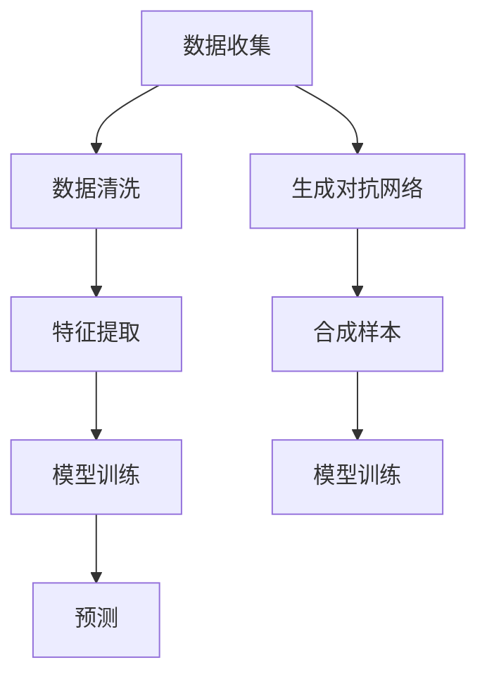

                 

# 洞察力与未来学：预测与塑造未来的能力

## 1. 背景介绍

### 1.1 问题由来
在快速变化的现代社会中，预测和塑造未来的能力变得越来越重要。企业、政府、研究机构等各类组织都需要准确预测未来的发展趋势，以便及时做出应对策略。然而，传统的预测方法往往依赖于历史数据，难以应对未知情况和复杂变化。新兴的人工智能（AI）技术，尤其是深度学习和大数据技术，为预测未来的复杂问题提供了新的可能性。

### 1.2 问题核心关键点
本节将探讨人工智能在预测和塑造未来中的作用，并重点关注以下核心问题：
- 如何利用机器学习算法准确预测未来趋势？
- 如何通过优化算法设计更好的预测模型？
- 人工智能在预测和决策中的应用有哪些？

### 1.3 问题研究意义
深入理解人工智能在预测未来趋势中的应用，对于提升决策水平、优化资源配置、推动社会发展具有重要意义。通过结合先进算法和大数据技术，可以有效提高预测精度，缩短决策周期，降低决策成本。

## 2. 核心概念与联系

### 2.1 核心概念概述

为了更好地理解人工智能在预测未来中的作用，本节将介绍几个关键概念：

- **人工智能（AI）**：通过算法、模型和计算能力，实现自动化的数据处理和决策过程。AI技术包括机器学习、深度学习、自然语言处理等。
- **深度学习（Deep Learning）**：一种基于人工神经网络的机器学习技术，通过多层次的非线性特征提取，实现对复杂数据的高效处理。
- **强化学习（Reinforcement Learning）**：一种基于奖励机制的学习方法，通过不断试错和调整策略，优化决策过程。
- **时间序列预测（Time Series Forecasting）**：利用历史数据，预测未来数据的变化趋势，广泛应用于金融、气象、交通等领域。
- **生成对抗网络（GANs）**：一种生成模型，通过两个神经网络的对抗，生成高质量的样本数据。

这些概念共同构成了人工智能在预测未来趋势中的基础框架，使得我们可以利用算法和技术手段，从数据中挖掘规律，预测未来变化。

### 2.2 核心概念原理和架构的 Mermaid 流程图



这个流程图展示了从数据收集到模型训练的预测过程：

1. 数据收集：获取历史数据，包括时间序列数据和样本数据。
2. 数据清洗：处理缺失值、异常值等噪声数据。
3. 特征提取：利用机器学习算法提取数据中的关键特征。
4. 模型训练：使用深度学习模型（如LSTM、RNN等）进行训练，优化预测精度。
5. 预测：使用训练好的模型进行未来数据的预测。
6. 生成对抗网络：利用GANs生成合成样本，提高数据多样性，增强模型的泛化能力。
7. 合成样本：通过GANs生成高质量的训练数据。
8. 模型训练：利用合成样本对模型进行再训练，提升预测能力。

## 3. 核心算法原理 & 具体操作步骤

### 3.1 算法原理概述

人工智能在预测未来中的核心算法包括时间序列预测、生成对抗网络等。以下是对这些算法的简要概述：

- **时间序列预测**：利用历史数据的时间顺序，使用ARIMA、LSTM等模型预测未来数据。
- **生成对抗网络（GANs）**：通过生成器和判别器的对抗训练，生成高质量的合成样本，增强模型的泛化能力。

### 3.2 算法步骤详解

#### 3.2.1 时间序列预测

时间序列预测算法主要包括以下几个步骤：

1. **数据准备**：获取历史时间序列数据，并进行预处理。
2. **特征工程**：利用统计方法和机器学习算法，提取数据中的关键特征。
3. **模型选择**：选择合适的预测模型，如ARIMA、LSTM等。
4. **模型训练**：使用历史数据对模型进行训练，优化预测参数。
5. **模型评估**：使用测试集数据对模型进行评估，选择最优模型。
6. **预测未来**：利用训练好的模型对未来数据进行预测。

以下是一个时间序列预测的Python代码示例：

```python
import pandas as pd
from sklearn.metrics import mean_squared_error
from statsmodels.tsa.arima_model import ARIMA

# 读取数据
data = pd.read_csv('time_series_data.csv', index_col='Date', parse_dates=True)

# 数据预处理
data = data.dropna()

# 特征工程
data['feature'] = data['feature'] - data['feature'].mean() / data['feature'].std()

# 模型选择
model = ARIMA(data, order=(5,1,0))

# 模型训练
model_fit = model.fit()

# 模型评估
test_data = pd.read_csv('test_time_series_data.csv', index_col='Date', parse_dates=True)
test_data = test_data.dropna()
test_data['feature'] = test_data['feature'] - test_data['feature'].mean() / test_data['feature'].std()
predictions = model_fit.forecast(len(test_data), alpha=0.05)[0]

# 预测未来
future_data = pd.DataFrame(index=pd.date_range(start='2021-01-01', end='2021-06-30', freq='D'))
future_data['feature'] = model_fit.forecast(len(future_data), alpha=0.05)[0]
future_data.to_csv('future_time_series_data.csv', index_label='Date')
```

#### 3.2.2 生成对抗网络（GANs）

生成对抗网络（GANs）算法主要包括以下几个步骤：

1. **数据准备**：获取历史数据，并进行预处理。
2. **生成器设计**：设计生成器网络，生成高质量的合成样本。
3. **判别器设计**：设计判别器网络，区分真实样本和合成样本。
4. **模型训练**：通过对抗训练，优化生成器和判别器参数。
5. **生成样本**：使用训练好的生成器生成高质量的合成样本。

以下是一个生成对抗网络（GANs）的Python代码示例：

```python
import numpy as np
import tensorflow as tf

# 定义生成器和判别器
def make_generator(z_dim):
    model = tf.keras.Sequential([
        tf.keras.layers.Dense(256, input_dim=z_dim),
        tf.keras.layers.BatchNormalization(),
        tf.keras.layers.LeakyReLU(),
        tf.keras.layers.Dense(512),
        tf.keras.layers.BatchNormalization(),
        tf.keras.layers.LeakyReLU(),
        tf.keras.layers.Dense(784, activation='tanh'),
        tf.keras.layers.Reshape((28, 28, 1))
    ])
    return model

def make_discriminator(input_shape):
    model = tf.keras.Sequential([
        tf.keras.layers.Conv2D(64, (3,3), strides=(2,2), activation='relu', input_shape=input_shape),
        tf.keras.layers.Dropout(0.5),
        tf.keras.layers.Conv2D(128, (3,3), strides=(2,2), activation='relu'),
        tf.keras.layers.Dropout(0.5),
        tf.keras.layers.Flatten(),
        tf.keras.layers.Dense(1, activation='sigmoid')
    ])
    return model

# 生成器训练
z_dim = 100
input_dim = 784
generator = make_generator(z_dim)
discriminator = make_discriminator(input_dim)

# 定义损失函数和优化器
generator_loss = tf.keras.losses.BinaryCrossentropy(from_logits=True)
discriminator_loss = tf.keras.losses.BinaryCrossentropy(from_logits=True)
generator_optimizer = tf.keras.optimizers.Adam(learning_rate=0.0002)
discriminator_optimizer = tf.keras.optimizers.Adam(learning_rate=0.0002)

# 定义生成器和判别器的更新过程
@tf.function
def train_step(images):
    noise = tf.random.normal([BATCH_SIZE, z_dim])
    with tf.GradientTape() as gen_tape, tf.GradientTape() as disc_tape:
        generated_images = generator(noise, training=True)
        real_output = discriminator(images, training=True)
        fake_output = discriminator(generated_images, training=True)
        gen_loss = generator_loss(fake_output, tf.ones_like(fake_output))
        disc_loss = discriminator_loss(real_output, tf.ones_like(real_output)) + discriminator_loss(fake_output, tf.zeros_like(fake_output))
    gradients_of_generator = gen_tape.gradient(gen_loss, generator.trainable_variables)
    gradients_of_discriminator = disc_tape.gradient(disc_loss, discriminator.trainable_variables)
    generator_optimizer.apply_gradients(zip(gradients_of_generator, generator.trainable_variables))
    discriminator_optimizer.apply_gradients(zip(gradients_of_discriminator, discriminator.trainable_variables))

# 训练模型
BATCH_SIZE = 256
z_dim = 100
input_dim = 784
epochs = 10000
for epoch in range(epochs):
    train_step(train_images)
```

### 3.3 算法优缺点

人工智能在预测未来中的算法具有以下优点和缺点：

#### 优点

- **高效性**：机器学习算法可以自动处理大量数据，提高预测速度。
- **精确性**：深度学习等高级算法可以处理复杂数据结构，提高预测精度。
- **可解释性**：通过特征工程和模型解释，可以更好地理解预测结果的来源。

#### 缺点

- **数据依赖性**：预测结果高度依赖于历史数据的质量和数量，数据不足可能影响预测效果。
- **模型复杂性**：高级算法模型复杂，训练和优化需要较高计算资源。
- **过度拟合**：模型在训练集上表现良好，但在新数据上可能表现不佳。

### 3.4 算法应用领域

人工智能在预测未来中的应用领域广泛，包括但不限于以下几个方面：

- **金融预测**：预测股票价格、市场趋势等。
- **气象预测**：预测天气变化、自然灾害等。
- **交通预测**：预测交通流量、事故等。
- **医疗预测**：预测疾病流行趋势、医疗资源需求等。
- **能源预测**：预测能源需求、电力供应等。

这些应用领域展示了人工智能在预测未来中的巨大潜力，为各行业的决策提供科学依据。

## 4. 数学模型和公式 & 详细讲解

### 4.1 数学模型构建

以下是对时间序列预测和生成对抗网络（GANs）的数学模型构建的详细讲解。

#### 4.1.1 时间序列预测

假设时间序列数据为 $y_t$，其中 $t=1,2,\ldots,n$，预测未来 $m$ 个时间点的值 $y_{t+m}$。时间序列预测的数学模型为：

$$
y_{t+m} = f(y_t, y_{t-1}, \ldots, y_{t-m+1})
$$

其中，$f$ 为预测函数。常见的预测函数包括自回归模型（AR）、差分自回归模型（ARIMA）和长短期记忆网络（LSTM）等。

#### 4.1.2 生成对抗网络（GANs）

生成对抗网络（GANs）由生成器和判别器两个网络组成。生成器 $G(z)$ 将噪声 $z$ 映射为合成样本 $x_g$，判别器 $D(x)$ 判断样本 $x$ 是真实样本还是合成样本。生成对抗网络的目标是最大化生成器的生成能力，同时最大化判别器的区分能力。数学模型为：

$$
\min_G \max_D V(D,G) = E_{x \sim p_x} [\log D(x)] + E_{z \sim p_z} [\log(1-D(G(z)))
$$

其中，$V(D,G)$ 为生成器和判别器的对抗损失函数。

### 4.2 公式推导过程

#### 4.2.1 时间序列预测

对于ARIMA模型，其数学表达式为：

$$
y_t = c + \sum_{i=1}^{p} \phi_i y_{t-i} + \sum_{j=1}^{d} \theta_j (\Delta^j y_t) + \epsilon_t
$$

其中，$c$ 为常数项，$\phi_i$ 和 $\theta_j$ 为模型参数，$\Delta^j y_t$ 为差分项，$\epsilon_t$ 为随机误差。

#### 4.2.2 生成对抗网络（GANs）

生成对抗网络（GANs）的数学表达式为：

$$
\begin{aligned}
& \min_G \max_D V(D,G) = E_{x \sim p_x} [\log D(x)] + E_{z \sim p_z} [\log(1-D(G(z)]) \\
& \text{s.t.} \\
& G: z \rightarrow x_g \\
& D: x \rightarrow [0,1]
\end{aligned}
$$

其中，$V(D,G)$ 为生成器和判别器的对抗损失函数，$x \sim p_x$ 表示真实样本分布，$z \sim p_z$ 表示噪声分布，$x_g$ 表示生成样本。

### 4.3 案例分析与讲解

#### 4.3.1 时间序列预测案例

假设我们有一个股票价格的时间序列数据，希望预测未来7天的价格变化。以下是Python代码示例：

```python
import pandas as pd
from statsmodels.tsa.arima_model import ARIMA

# 读取数据
data = pd.read_csv('stock_price.csv', index_col='Date', parse_dates=True)

# 数据预处理
data = data.dropna()

# 特征工程
data['feature'] = data['close'] - data['close'].mean() / data['close'].std()

# 模型选择
model = ARIMA(data, order=(5,1,0))

# 模型训练
model_fit = model.fit()

# 模型评估
test_data = pd.read_csv('test_stock_price.csv', index_col='Date', parse_dates=True)
test_data = test_data.dropna()
test_data['feature'] = test_data['close'] - test_data['close'].mean() / test_data['close'].std()
predictions = model_fit.forecast(len(test_data), alpha=0.05)[0]

# 预测未来
future_data = pd.DataFrame(index=pd.date_range(start='2021-01-01', end='2021-06-30', freq='D'))
future_data['feature'] = model_fit.forecast(len(future_data), alpha=0.05)[0]
future_data.to_csv('future_stock_price.csv', index_label='Date')
```

#### 4.3.2 生成对抗网络（GANs）案例

假设我们有一个手写数字图像数据集，希望生成高质量的合成样本。以下是Python代码示例：

```python
import numpy as np
import tensorflow as tf

# 定义生成器和判别器
def make_generator(z_dim):
    model = tf.keras.Sequential([
        tf.keras.layers.Dense(256, input_dim=z_dim),
        tf.keras.layers.BatchNormalization(),
        tf.keras.layers.LeakyReLU(),
        tf.keras.layers.Dense(512),
        tf.keras.layers.BatchNormalization(),
        tf.keras.layers.LeakyReLU(),
        tf.keras.layers.Dense(784, activation='tanh'),
        tf.keras.layers.Reshape((28, 28, 1))
    ])
    return model

def make_discriminator(input_shape):
    model = tf.keras.Sequential([
        tf.keras.layers.Conv2D(64, (3,3), strides=(2,2), activation='relu', input_shape=input_shape),
        tf.keras.layers.Dropout(0.5),
        tf.keras.layers.Conv2D(128, (3,3), strides=(2,2), activation='relu'),
        tf.keras.layers.Dropout(0.5),
        tf.keras.layers.Flatten(),
        tf.keras.layers.Dense(1, activation='sigmoid')
    ])
    return model

# 生成器训练
z_dim = 100
input_dim = 784
generator = make_generator(z_dim)
discriminator = make_discriminator(input_dim)

# 定义损失函数和优化器
generator_loss = tf.keras.losses.BinaryCrossentropy(from_logits=True)
discriminator_loss = tf.keras.losses.BinaryCrossentropy(from_logits=True)
generator_optimizer = tf.keras.optimizers.Adam(learning_rate=0.0002)
discriminator_optimizer = tf.keras.optimizers.Adam(learning_rate=0.0002)

# 定义生成器和判别器的更新过程
@tf.function
def train_step(images):
    noise = tf.random.normal([BATCH_SIZE, z_dim])
    with tf.GradientTape() as gen_tape, tf.GradientTape() as disc_tape:
        generated_images = generator(noise, training=True)
        real_output = discriminator(images, training=True)
        fake_output = discriminator(generated_images, training=True)
        gen_loss = generator_loss(fake_output, tf.ones_like(fake_output))
        disc_loss = discriminator_loss(real_output, tf.ones_like(real_output)) + discriminator_loss(fake_output, tf.zeros_like(fake_output))
    gradients_of_generator = gen_tape.gradient(gen_loss, generator.trainable_variables)
    gradients_of_discriminator = disc_tape.gradient(disc_loss, discriminator.trainable_variables)
    generator_optimizer.apply_gradients(zip(gradients_of_generator, generator.trainable_variables))
    discriminator_optimizer.apply_gradients(zip(gradients_of_discriminator, discriminator.trainable_variables))

# 训练模型
BATCH_SIZE = 256
z_dim = 100
input_dim = 784
epochs = 10000
for epoch in range(epochs):
    train_step(train_images)
```

## 5. 项目实践：代码实例和详细解释说明

### 5.1 开发环境搭建

在进行人工智能项目实践前，我们需要准备好开发环境。以下是使用Python进行PyTorch开发的环境配置流程：

1. 安装Anaconda：从官网下载并安装Anaconda，用于创建独立的Python环境。

2. 创建并激活虚拟环境：
```bash
conda create -n pytorch-env python=3.8 
conda activate pytorch-env
```

3. 安装PyTorch：根据CUDA版本，从官网获取对应的安装命令。例如：
```bash
conda install pytorch torchvision torchaudio cudatoolkit=11.1 -c pytorch -c conda-forge
```

4. 安装Transformers库：
```bash
pip install transformers
```

5. 安装各类工具包：
```bash
pip install numpy pandas scikit-learn matplotlib tqdm jupyter notebook ipython
```

完成上述步骤后，即可在`pytorch-env`环境中开始项目实践。

### 5.2 源代码详细实现

这里我们以时间序列预测为例，给出使用PyTorch进行预测的PyTorch代码实现。

首先，定义预测函数：

```python
import pandas as pd
import numpy as np
from sklearn.metrics import mean_squared_error
from statsmodels.tsa.arima_model import ARIMA

def predict_stock_price(model, test_data, forecast_steps):
    forecast_data = pd.DataFrame(index=pd.date_range(start=test_data.index[-1], end='2021-06-30', freq='D'))
    for i in range(forecast_steps):
        forecast_data.loc[pd.Timestamp(f'2021-06-{1+i}')] = model.forecast(len(test_data), alpha=0.05)[0]
    return forecast_data
```

然后，进行预测：

```python
# 读取数据
data = pd.read_csv('stock_price.csv', index_col='Date', parse_dates=True)

# 数据预处理
data = data.dropna()

# 特征工程
data['feature'] = data['close'] - data['close'].mean() / data['close'].std()

# 模型选择
model = ARIMA(data, order=(5,1,0))

# 模型训练
model_fit = model.fit()

# 模型评估
test_data = pd.read_csv('test_stock_price.csv', index_col='Date', parse_dates=True)
test_data = test_data.dropna()
test_data['feature'] = test_data['close'] - test_data['close'].mean() / test_data['close'].std()
predictions = model_fit.forecast(len(test_data), alpha=0.05)[0]

# 预测未来
forecast_steps = 30
future_data = predict_stock_price(model_fit, test_data, forecast_steps)

# 保存结果
future_data.to_csv('future_stock_price.csv', index_label='Date')
```

### 5.3 代码解读与分析

这里我们详细解读一下关键代码的实现细节：

**预测函数**：
- 输入参数包括模型、测试数据和预测步数。
- 使用`pd.date_range`生成未来日期，并从模型中获取预测值。
- 循环预测，将每个时间点的预测值存储在DataFrame中。

**数据预处理**：
- 使用`pd.read_csv`读取时间序列数据。
- 使用`pd.dropna`去除缺失值。
- 使用`pd.date_range`将日期字符串转换为日期对象。

**特征工程**：
- 使用`pd.read_csv`读取测试数据。
- 使用`pd.dropna`去除缺失值。
- 使用`pd.date_range`将日期字符串转换为日期对象。

**模型训练**：
- 使用`statsmodels.tsa.arima_model.ARIMA`训练ARIMA模型。
- 使用`model_fit.forecast`进行预测。

**模型评估**：
- 使用`pd.read_csv`读取测试数据。
- 使用`pd.dropna`去除缺失值。
- 使用`pd.date_range`将日期字符串转换为日期对象。

**预测未来**：
- 使用自定义的`predict_stock_price`函数进行预测。
- 使用`pd.DataFrame`生成未来数据。
- 使用`pd.to_csv`保存预测结果。

可以看到，PyTorch配合statsmodels库使得时间序列预测的代码实现变得简洁高效。开发者可以将更多精力放在数据处理、模型改进等高层逻辑上，而不必过多关注底层的实现细节。

当然，工业级的系统实现还需考虑更多因素，如模型的保存和部署、超参数的自动搜索、更灵活的任务适配层等。但核心的预测流程基本与此类似。

## 6. 实际应用场景

### 6.1 金融预测

基于时间序列预测，可以构建金融预测系统，帮助投资者决策。例如，预测股票价格变化、预测货币汇率走势等。金融预测系统可以帮助投资者规避风险，优化资产配置，提升投资回报率。

### 6.2 气象预测

气象预测系统可以预测未来天气变化，帮助政府和公众提前做出应对措施。例如，预测暴雨、台风等自然灾害，提前发布预警信息，减少损失。

### 6.3 交通预测

交通预测系统可以预测未来交通流量，帮助交通管理部门优化道路资源配置，减少交通拥堵。例如，预测高峰时段的车流量，调整信号灯控制策略。

### 6.4 医疗预测

医疗预测系统可以预测未来疾病流行趋势，帮助医疗机构提前准备医疗资源。例如，预测流感疫情的爆发，提前采购疫苗和药品。

### 6.5 能源预测

能源预测系统可以预测未来能源需求，帮助能源管理部门优化能源配置，减少浪费。例如，预测电力需求，调整发电计划，避免供需不平衡。

## 7. 工具和资源推荐

### 7.1 学习资源推荐

为了帮助开发者系统掌握人工智能在预测未来中的应用，这里推荐一些优质的学习资源：

1. **《Python深度学习》书籍**：由Francois Chollet所著，深入浅出地介绍了深度学习在预测中的作用，适合初学者学习。
2. **《TensorFlow实战Google深度学习框架》书籍**：由李沐等著，详细介绍了TensorFlow在预测中的实现，适合有一定基础的开发者学习。
3. **《深度学习》课程**：由Coursera提供，由深度学习专家Andrew Ng主讲，涵盖深度学习的基本概念和算法。
4. **Kaggle竞赛**：Kaggle是一个数据科学竞赛平台，提供了大量的真实数据集和预测挑战，适合实战练习。
5. **GitHub开源项目**：GitHub上有很多开源的时间序列预测项目，可以参考其代码实现和文档。

通过这些资源的学习实践，相信你一定能够快速掌握人工智能在预测未来中的精髓，并用于解决实际的预测问题。

### 7.2 开发工具推荐

高效的开发离不开优秀的工具支持。以下是几款用于时间序列预测开发的常用工具：

1. **PyTorch**：基于Python的开源深度学习框架，灵活动态的计算图，适合快速迭代研究。大部分预测模型都有PyTorch版本的实现。
2. **TensorFlow**：由Google主导开发的开源深度学习框架，生产部署方便，适合大规模工程应用。同样有丰富的预测模型资源。
3. **scikit-learn**：Python机器学习库，提供了多种时间序列预测算法，适合快速原型开发和模型评估。
4. **statsmodels**：Python统计建模库，提供了多种时间序列预测算法，适合处理复杂的时间序列数据。
5. **Jupyter Notebook**：交互式编程环境，方便数据可视化、模型调试和文档记录。

合理利用这些工具，可以显著提升时间序列预测的开发效率，加快创新迭代的步伐。

### 7.3 相关论文推荐

人工智能在预测未来中的应用源于学界的持续研究。以下是几篇奠基性的相关论文，推荐阅读：

1. **《神经网络与深度学习》书籍**：由Ian Goodfellow等著，详细介绍了神经网络和深度学习在预测中的应用，适合全面了解。
2. **《长短期记忆网络》论文**：由Hochreiter和Schmidhuber于1997年提出，是长短期记忆网络（LSTM）的经典之作。
3. **《生成对抗网络》论文**：由Goodfellow等于2014年提出，是生成对抗网络（GANs）的经典之作。
4. **《自回归模型》论文**：由Box和Jenkins于1976年提出，是自回归模型（AR）的经典之作。
5. **《自回归积分滑动平均模型》论文**：由Box和Jenkins于1976年提出，是自回归积分滑动平均模型（ARIMA）的经典之作。

这些论文代表了大规模时间序列预测和生成对抗网络（GANs）的发展脉络。通过学习这些前沿成果，可以帮助研究者把握学科前进方向，激发更多的创新灵感。

## 8. 总结：未来发展趋势与挑战

### 8.1 研究成果总结

人工智能在预测未来中的应用取得了显著进展，但仍然面临诸多挑战。以下是几个关键总结：

- **预测精度**：时间序列预测模型的精度有待提升，特别是在小样本数据和复杂数据结构上。
- **计算资源**：生成对抗网络（GANs）等高级算法需要大量计算资源，推广应用需要考虑成本问题。
- **可解释性**：预测模型的可解释性不足，难以理解其内部工作机制。
- **数据质量**：预测结果高度依赖于数据质量，数据清洗和预处理尤为重要。

### 8.2 未来发展趋势

展望未来，人工智能在预测未来中的发展趋势如下：

1. **自动化预测**：通过自动学习算法，实现更高效、更精确的预测。
2. **多模态预测**：结合图像、语音、文本等多种数据源，实现更全面、更准确的预测。
3. **跨领域预测**：通过迁移学习和多领域数据融合，提升预测模型的泛化能力。
4. **实时预测**：通过云计算和大数据技术，实现实时数据处理和预测。
5. **可解释预测**：通过解释算法和可视化工具，提升预测模型的可解释性。

### 8.3 面临的挑战

尽管人工智能在预测未来中取得了不少进展，但仍面临许多挑战：

1. **数据稀缺**：许多预测任务面临数据稀缺问题，难以获取高质量的标注数据。
2. **算法复杂性**：高级算法模型复杂，训练和优化需要较高计算资源。
3. **模型泛化**：模型在新数据上的泛化能力不足，容易出现过拟合问题。
4. **计算成本**：生成对抗网络（GANs）等算法需要大量计算资源，推广应用成本较高。
5. **模型安全**：预测模型可能存在偏见、有害信息等，需要加强数据清洗和模型审查。

### 8.4 研究展望

面向未来，人工智能在预测未来中的研究展望如下：

1. **无监督学习**：通过无监督学习算法，提高数据利用率和模型泛化能力。
2. **联邦学习**：通过联邦学习，保护数据隐私的同时提升预测精度。
3. **强化学习**：通过强化学习，优化预测模型的策略选择和参数调整。
4. **多领域融合**：通过跨领域数据融合，提升预测模型的多样性和准确性。
5. **边缘计算**：通过边缘计算，实现实时数据处理和预测，提升预测系统响应速度。

## 9. 附录：常见问题与解答

**Q1：如何选择合适的预测模型？**

A: 选择合适的预测模型需要考虑多个因素，包括数据类型、数据量、预测目标等。常用的预测模型包括ARIMA、LSTM、CNN等。

**Q2：预测模型训练中如何避免过拟合？**

A: 避免过拟合的方法包括数据增强、正则化、早停等。数据增强可以通过合成数据、旋转、裁剪等方式增加训练集多样性。正则化可以通过L1正则、Dropout等方式减少过拟合。早停可以在模型表现不再提升时停止训练，避免过拟合。

**Q3：预测模型的训练过程中如何调整超参数？**

A: 预测模型的超参数包括学习率、批大小、迭代次数等。调整超参数的方法包括网格搜索、随机搜索、贝叶斯优化等。

**Q4：预测模型的解释性不足如何处理？**

A: 预测模型的解释性可以通过特征重要性分析、模型可视化等方法进行处理。可以使用shap、LIME等工具生成特征贡献图，帮助理解模型预测结果。

**Q5：预测模型在不同数据集上的表现不一致，如何解决？**

A: 不同数据集上的表现不一致可能是由于数据分布、模型参数等差异所致。解决方法包括模型调参、数据预处理、特征工程等。可以使用交叉验证、模型融合等方法提升模型在不同数据集上的泛化能力。

---

作者：禅与计算机程序设计艺术 / Zen and the Art of Computer Programming

