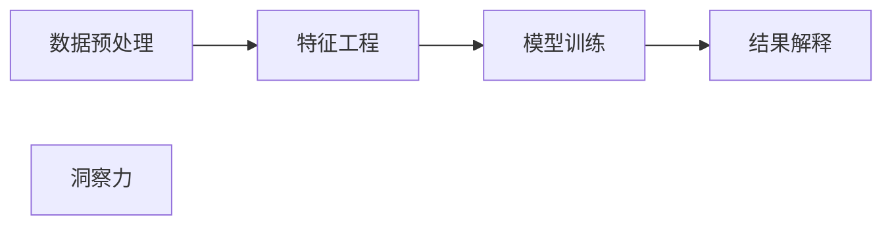

                 

## 1. 背景介绍

### 1.1 问题由来
在现代科技迅猛发展的今天，人类社会正处于一个前所未有的信息爆炸时代。人们每天都会接触到海量的信息，但面对如此庞大的信息量，我们常常感到无从下手。如何在这些海量信息中找出真正有用的、具有洞察力的信息，成为了现代社会的一个重大课题。洞察力（Insight）是这一过程中的关键，它代表了对事物本质的深刻理解和预见，是人类智慧的结晶。

### 1.2 问题核心关键点
洞察力在数据处理、决策支持、业务创新等多个领域中发挥着重要作用。它不仅能够帮助人们在海量信息中发现隐藏的模式和趋势，还能提升决策的准确性和效率，驱动企业创新，最终推动社会进步。

在数据科学和人工智能（AI）领域，洞察力通常通过机器学习和数据挖掘等技术实现。其中，异常检测、关联规则挖掘、预测建模等技术手段，能够帮助人类从数据中发现隐藏的规律和模式，进而生成有价值的洞察力。

### 1.3 问题研究意义
洞察力在现代科技中的应用，尤其是在数据驱动的决策和创新中，具有重要意义：

1. **提升决策质量**：通过从海量数据中发现关键洞察力，决策者可以更加精准地理解和预见未来趋势，从而做出更科学、更有效的决策。
2. **驱动创新**：洞察力是创新和改进产品、服务、流程的基础，帮助企业不断优化业务模式，提升竞争力。
3. **增强竞争力**：在激烈的市场竞争中，谁能够更快地从数据中发现洞察力，谁就能够获得先发优势。
4. **社会进步**：洞察力在公共政策、医疗、教育等领域的应用，能够提升社会管理的科学性和效率，推动社会全面进步。

因此，洞察力的研究和应用对于现代社会具有深远的影响和重要的价值。

## 2. 核心概念与联系

### 2.1 核心概念概述

洞察力是大数据时代下，通过对复杂数据进行深度分析和挖掘，从而发现其背后隐藏的规律、模式和趋势。洞察力不仅是一种分析方法，更是一种思维方式，它要求分析者具备深厚的理论知识和丰富的实践经验。

洞察力的获取通常需要经过数据预处理、特征工程、模型训练、结果解释等多个步骤，形成一个完整的分析流程。在这一过程中，数据处理和分析技术起到了至关重要的作用。

### 2.2 核心概念原理和架构的 Mermaid 流程图



这个流程图展示了洞察力获取的核心步骤。其中，数据预处理是基础，特征工程是关键，模型训练是核心，结果解释是目标。通过这一流程，分析者能够从复杂的数据中提取有价值的洞察力。

## 3. 核心算法原理 & 具体操作步骤

### 3.1 算法原理概述

洞察力的获取离不开数据科学和机器学习技术的支撑。本文将介绍一种基于监督学习的方法，即通过训练模型来自动发现数据中的规律和趋势，生成有价值的洞察力。

假设我们有一组数据集 $\mathcal{D} = \{(x_i, y_i)\}_{i=1}^N$，其中 $x_i$ 是输入数据，$y_i$ 是目标标签。我们的目标是找到一个模型 $M_{\theta}$，使其能够预测目标标签 $y$。

在这一过程中，我们通常使用监督学习的方法，通过最小化损失函数 $\mathcal{L}(\theta)$ 来训练模型：

$$
\mathcal{L}(\theta) = \frac{1}{N} \sum_{i=1}^N \ell(M_{\theta}(x_i), y_i)
$$

其中，$\ell$ 是损失函数，$\theta$ 是模型的参数，$\ell(M_{\theta}(x_i), y_i)$ 表示模型在输入 $x_i$ 上的预测输出 $M_{\theta}(x_i)$ 与真实标签 $y_i$ 之间的差距。

通过最小化损失函数，模型能够学习到输入 $x$ 和目标标签 $y$ 之间的关系，从而生成预测输出 $M_{\theta}(x)$。在这个过程中，我们可以利用异常检测、关联规则挖掘、预测建模等技术手段，从数据中发现隐藏的规律和模式，生成洞察力。

### 3.2 算法步骤详解

以下是基于监督学习生成洞察力的具体操作步骤：

**Step 1: 数据预处理**
- 收集和整理数据，去除噪声和异常值。
- 进行数据标准化和归一化，保证数据的一致性和稳定性。
- 将数据集划分为训练集、验证集和测试集。

**Step 2: 特征工程**
- 对数据进行特征提取和选择，生成有意义的特征向量。
- 使用主成分分析（PCA）等技术进行特征降维，减少计算量。
- 进行特征编码，如独热编码、one-hot编码等。

**Step 3: 模型训练**
- 选择合适的机器学习算法，如线性回归、决策树、随机森林、支持向量机等。
- 设置模型参数，如学习率、正则化系数、迭代轮数等。
- 使用梯度下降等优化算法，最小化损失函数。

**Step 4: 结果解释**
- 使用模型解释技术，如LIME、SHAP等，解释模型的预测结果。
- 结合领域知识，进行结果的解释和验证，确认洞察力的正确性。
- 对洞察力进行可视化展示，便于理解和使用。

### 3.3 算法优缺点

基于监督学习的洞察力生成方法有以下优点：

1. **高效性**：通过训练模型，能够自动发现数据中的规律和趋势，速度快，效率高。
2. **准确性**：利用机器学习算法，可以降低人为干预，提高分析结果的准确性和可靠性。
3. **可扩展性**：适用于各种类型的复杂数据，能够处理大规模数据集。
4. **可解释性**：通过模型解释技术，可以清晰地展示和理解模型的预测逻辑。

同时，该方法也存在一定的局限性：

1. **依赖数据质量**：数据预处理和特征工程的质量对最终结果影响较大，数据质量差时，模型可能无法正常工作。
2. **模型复杂度**：过于复杂的模型可能会过拟合，导致泛化性能差。
3. **领域依赖**：不同领域的数据具有不同的特征，模型需要针对具体领域进行调优。
4. **解释难度**：复杂模型的解释可能较为困难，需要具备一定的领域知识。

尽管存在这些局限性，但基于监督学习的洞察力生成方法仍然是数据科学和机器学习领域的主流范式。未来相关研究的重点在于如何进一步提高方法的普适性和鲁棒性，减少对数据和模型的依赖。

### 3.4 算法应用领域

基于监督学习的洞察力生成方法在多个领域得到了广泛应用，例如：

- 金融风险管理：通过异常检测和预测建模，发现潜在的风险点，优化风险控制策略。
- 供应链管理：通过关联规则挖掘，发现供应商和客户之间的联系，优化供应链网络。
- 医疗诊断：通过预测建模和异常检测，提高疾病诊断的准确性和效率。
- 市场营销：通过预测建模和关联规则挖掘，发现客户需求和市场趋势，优化营销策略。
- 交通管理：通过异常检测和预测建模，发现交通流量异常，优化交通管理方案。

此外，在智能制造、环境保护、城市规划等多个领域，基于监督学习的洞察力生成方法也发挥了重要作用，推动了相关行业的发展和进步。

## 4. 数学模型和公式 & 详细讲解 & 举例说明

### 4.1 数学模型构建

基于监督学习的洞察力生成方法通常使用以下数学模型：

假设我们有一组数据集 $\mathcal{D} = \{(x_i, y_i)\}_{i=1}^N$，其中 $x_i$ 是输入数据，$y_i$ 是目标标签。我们的目标是找到一个模型 $M_{\theta}$，使其能够预测目标标签 $y$。

使用线性回归模型进行训练，可以表示为：

$$
y = \theta_0 + \sum_{i=1}^p \theta_i x_i
$$

其中 $\theta = (\theta_0, \theta_1, ..., \theta_p)$ 为模型参数。

### 4.2 公式推导过程

以线性回归模型为例，推导其最小二乘损失函数：

假设我们的目标函数为 $y_i = \theta_0 + \sum_{i=1}^p \theta_i x_{i,j} + \epsilon_i$，其中 $\epsilon_i$ 是误差项，假设服从正态分布 $\epsilon_i \sim N(0, \sigma^2)$。

则目标函数可以表示为：

$$
\mathcal{L}(\theta) = \frac{1}{2N} \sum_{i=1}^N \sum_{j=1}^p (y_i - \theta_0 - \sum_{k=1}^p \theta_k x_{i,j})^2 + \frac{1}{2\sigma^2} \sum_{i=1}^N \epsilon_i^2
$$

简化得到：

$$
\mathcal{L}(\theta) = \frac{1}{2N} \sum_{i=1}^N (y_i - \hat{y}_i)^2
$$

其中 $\hat{y}_i = \theta_0 + \sum_{i=1}^p \theta_i x_{i,j}$ 是模型预测输出。

使用梯度下降算法更新模型参数，可以得到：

$$
\theta \leftarrow \theta - \eta \frac{\partial \mathcal{L}(\theta)}{\partial \theta}
$$

其中 $\eta$ 为学习率。

### 4.3 案例分析与讲解

以异常检测为例，我们希望从数据集中发现异常点，以帮助业务决策。

假设我们有一组数据集 $\mathcal{D} = \{(x_i, y_i)\}_{i=1}^N$，其中 $x_i$ 是输入数据，$y_i$ 是异常标签，$y_i = 1$ 表示异常点，$y_i = 0$ 表示正常点。

使用线性回归模型进行训练，可以得到异常检测的残差 $\epsilon_i = y_i - \hat{y}_i$。

如果残差 $\epsilon_i$ 的绝对值大于预设阈值 $\lambda$，则认为该点为异常点。具体实现过程如下：

```python
import numpy as np
from sklearn.linear_model import LinearRegression
from sklearn.metrics import mean_squared_error

# 生成数据
np.random.seed(0)
n_samples = 1000
x = np.random.rand(n_samples, 2)
y = x[:, 0] + 0.5 * np.random.randn(n_samples) + 0.5
y = (y > 0.5).astype(int)

# 线性回归模型
lr = LinearRegression()
lr.fit(x, y)

# 残差分析
y_pred = lr.predict(x)
residuals = y - y_pred

# 异常检测
threshold = np.std(residuals) * 3
anomalies = np.abs(residuals) > threshold

print(anomalies)
```

上述代码生成了一组二维随机数据，通过线性回归模型预测异常点。通过计算残差并与预设阈值进行比较，可以发现异常点。

## 5. 项目实践：代码实例和详细解释说明

### 5.1 开发环境搭建

在进行项目实践前，我们需要准备好开发环境。以下是使用Python进行机器学习开发的环境配置流程：

1. 安装Anaconda：从官网下载并安装Anaconda，用于创建独立的Python环境。

2. 创建并激活虚拟环境：
```bash
conda create -n py35 python=3.5
conda activate py35
```

3. 安装依赖包：
```bash
conda install numpy pandas scikit-learn matplotlib
```

4. 配置Jupyter Notebook：
```bash
jupyter notebook --notebook-dir=notebooks
```

完成上述步骤后，即可在`py35`环境中开始项目实践。

### 5.2 源代码详细实现

下面是使用Python进行异常检测的代码实现：

```python
import numpy as np
from sklearn.linear_model import LinearRegression

# 生成数据
np.random.seed(0)
n_samples = 1000
x = np.random.rand(n_samples, 2)
y = x[:, 0] + 0.5 * np.random.randn(n_samples) + 0.5
y = (y > 0.5).astype(int)

# 线性回归模型
lr = LinearRegression()
lr.fit(x, y)

# 残差分析
y_pred = lr.predict(x)
residuals = y - y_pred

# 异常检测
threshold = np.std(residuals) * 3
anomalies = np.abs(residuals) > threshold

print(anomalies)
```

### 5.3 代码解读与分析

让我们再详细解读一下关键代码的实现细节：

**生成数据**：
- 使用numpy生成随机数据，模拟真实场景中的数据。

**线性回归模型**：
- 使用scikit-learn库的LinearRegression模型进行训练。
- 训练过程包括计算梯度、更新模型参数等步骤。

**残差分析**：
- 计算残差，即实际值与预测值之间的差异。
- 使用阈值判断残差大小，识别异常点。

**异常检测**：
- 通过计算残差与预设阈值的大小关系，判断是否为异常点。
- 最终输出异常点的位置。

## 6. 实际应用场景

### 6.1 金融风险管理

在金融风险管理中，异常检测是发现潜在风险点的关键手段。通过训练异常检测模型，金融机构可以实时监控交易数据，及时发现异常交易行为，防止欺诈和损失。

在技术实现上，可以收集历史交易数据，使用异常检测模型对其进行训练。模型可以识别出异常交易特征，如异常金额、频繁交易等。当新交易数据进入系统时，异常检测模型可以实时计算其残差，判断是否为异常行为。对于异常行为，系统可以立即触发警报，及时处理，避免潜在的损失。

### 6.2 供应链管理

在供应链管理中，异常检测可以帮助企业及时发现供应商和客户之间的异常关系，优化供应链网络。

具体而言，企业可以收集供应商和客户的历史交易数据，使用异常检测模型对其进行训练。模型可以识别出供应商和客户之间的异常关系，如供应商延迟交货、客户大量退货等。当新交易数据进入系统时，异常检测模型可以实时计算其残差，判断是否为异常关系。对于异常关系，系统可以立即调整供应链策略，优化供应链网络，提高供应链效率。

### 6.3 医疗诊断

在医疗诊断中，异常检测可以帮助医生及时发现异常病例，提高诊断的准确性和效率。

具体而言，医疗机构可以收集病人的历史病历数据，使用异常检测模型对其进行训练。模型可以识别出病人的异常症状，如异常检查结果、异常病情变化等。当新病人的数据进入系统时，异常检测模型可以实时计算其残差，判断是否为异常病例。对于异常病例，系统可以立即通知医生，帮助其快速诊断，提高诊断的准确性和效率。

## 7. 工具和资源推荐

### 7.1 学习资源推荐

为了帮助开发者系统掌握洞察力生成的理论基础和实践技巧，这里推荐一些优质的学习资源：

1. 《机器学习实战》：这本书详细介绍了机器学习的基本概念和算法，适合初学者入门。
2. 《Python数据科学手册》：这本书涵盖了Python在数据科学领域的应用，适合中高级开发者。
3. 《统计学习方法》：这本书介绍了机器学习的理论基础，适合具备一定数学基础的学习者。
4. 《深度学习》：这本书由深度学习领域的专家撰写，介绍了深度学习的基本概念和算法。
5. 《机器学习算法与应用》：这本书介绍了机器学习算法的实际应用，适合解决实际问题。

通过对这些资源的学习实践，相信你一定能够快速掌握洞察力生成的精髓，并用于解决实际的业务问题。

### 7.2 开发工具推荐

高效的开发离不开优秀的工具支持。以下是几款用于洞察力生成开发的常用工具：

1. Jupyter Notebook：基于Python的交互式开发环境，方便进行实验和记录。
2. Anaconda：Python和数据科学领域的标准发行版，方便进行环境管理和依赖安装。
3. Scikit-learn：Python的数据科学库，提供了丰富的机器学习算法和工具。
4. TensorFlow：Google开发的深度学习框架，支持分布式计算和深度学习模型的训练。
5. PyTorch：Facebook开发的深度学习框架，支持动态图和静态图两种计算图模式。

合理利用这些工具，可以显著提升洞察力生成任务的开发效率，加快创新迭代的步伐。

### 7.3 相关论文推荐

洞察力生成的发展离不开学界的持续研究。以下是几篇奠基性的相关论文，推荐阅读：

1. 《Anomaly Detection: A Survey》：详细介绍了异常检测的基本概念和算法，适合了解该领域的全面知识。
2. 《Outlier Detection in High-Dimensional Data: A Survey》：介绍了在高维数据中进行异常检测的方法，适合处理复杂数据集。
3. 《Association Rules in High Dimensional Data》：介绍了关联规则挖掘的基本概念和算法，适合发现数据中的模式和趋势。
4. 《Predictive Analytics with Python》：介绍了预测建模的基本概念和算法，适合进行数据预测和洞察力生成。
5. 《Insight Mining: A Survey》：介绍了数据挖掘和洞察力生成的方法，适合了解该领域的最新进展。

这些论文代表了大数据和机器学习领域的研究脉络，通过学习这些前沿成果，可以帮助研究者把握学科前进方向，激发更多的创新灵感。

## 8. 总结：未来发展趋势与挑战

### 8.1 总结

本文对基于监督学习的洞察力生成方法进行了全面系统的介绍。首先阐述了洞察力在数据科学和机器学习领域的研究背景和应用价值，明确了洞察力生成在决策支持、业务创新等方面的重要作用。其次，从原理到实践，详细讲解了洞察力生成的数学模型和操作步骤，给出了洞察力生成任务开发的完整代码实例。同时，本文还广泛探讨了洞察力生成方法在金融风险管理、供应链管理、医疗诊断等多个行业领域的应用前景，展示了洞察力生成技术的巨大潜力。最后，本文精选了洞察力生成的各类学习资源，力求为读者提供全方位的技术指引。

通过本文的系统梳理，可以看到，基于监督学习的洞察力生成方法正在成为数据科学和机器学习领域的重要范式，极大地拓展了机器学习算法的应用边界，催生了更多的落地场景。随着算力成本的下降和数据规模的扩张，未来洞察力生成技术将在更多领域得到应用，为人类认知智能的进化带来深远影响。

### 8.2 未来发展趋势

展望未来，洞察力生成技术将呈现以下几个发展趋势：

1. **自动化程度提高**：随着深度学习模型的不断发展，自动化程度将不断提高，能够自动从复杂数据中发现洞察力，减少人工干预。
2. **多模态融合**：未来的洞察力生成技术将融合视觉、语音、文本等多种模态数据，提供更全面、更准确的信息。
3. **实时性增强**：通过分布式计算和模型优化，洞察力生成技术将实现实时化，能够及时响应数据的更新和变化。
4. **可解释性增强**：未来将进一步增强模型的可解释性，提供更清晰、更透明的预测过程和结果。
5. **隐私保护**：在处理敏感数据时，将进一步加强隐私保护措施，确保数据安全。
6. **自适应性增强**：通过动态调整模型参数，洞察力生成技术将能够适应不同场景和需求，提高适用性。

这些趋势凸显了洞察力生成技术的广阔前景。这些方向的探索发展，必将进一步提升数据科学和机器学习系统的性能和应用范围，为人类认知智能的进化带来深远影响。

### 8.3 面临的挑战

尽管洞察力生成技术已经取得了显著进展，但在迈向更加智能化、普适化应用的过程中，它仍面临着诸多挑战：

1. **数据质量问题**：数据质量差、噪声多，容易导致模型失效。如何提高数据质量，减少噪声，是未来需要解决的重要问题。
2. **模型鲁棒性不足**：模型面对异常数据时，容易产生误判。如何增强模型的鲁棒性，避免误判，是未来需要解决的重要问题。
3. **计算资源消耗大**：洞察力生成通常需要大量的计算资源，如何降低计算成本，提高计算效率，是未来需要解决的重要问题。
4. **可解释性不足**：复杂的洞察力生成模型难以解释，难以满足实际应用的需求。如何增强模型的可解释性，提供更清晰的解释，是未来需要解决的重要问题。
5. **隐私保护不足**：在处理敏感数据时，如何保护数据隐私，确保数据安全，是未来需要解决的重要问题。

### 8.4 研究展望

面对洞察力生成所面临的挑战，未来的研究需要在以下几个方面寻求新的突破：

1. **自动化数据清洗**：通过引入自动化数据清洗技术，自动过滤和处理噪声数据，提高数据质量。
2. **鲁棒性增强**：引入鲁棒性训练技术，增强模型对异常数据的容忍度，提高模型的鲁棒性。
3. **轻量级模型设计**：设计轻量级模型，减少计算资源的消耗，提高计算效率。
4. **模型可解释性增强**：引入可解释性增强技术，提供更清晰、更透明的模型解释，满足实际应用的需求。
5. **隐私保护技术**：引入隐私保护技术，如差分隐私、联邦学习等，保护数据隐私，确保数据安全。

这些研究方向的探索，必将引领洞察力生成技术迈向更高的台阶，为构建安全、可靠、可解释、可控的智能系统铺平道路。面向未来，洞察力生成技术还需要与其他人工智能技术进行更深入的融合，如知识表示、因果推理、强化学习等，多路径协同发力，共同推动自然语言理解和智能交互系统的进步。只有勇于创新、敢于突破，才能不断拓展洞察力生成的边界，让智能技术更好地造福人类社会。

## 9. 附录：常见问题与解答

**Q1：如何提高洞察力生成模型的准确性？**

A: 提高洞察力生成模型的准确性，需要从以下几个方面入手：

1. **数据质量**：保证数据质量，去除噪声和异常值，提高数据的一致性和稳定性。
2. **特征工程**：进行有效的特征选择和特征工程，提取有意义的特征向量。
3. **模型选择**：选择合适的机器学习算法，如线性回归、决策树、随机森林、支持向量机等。
4. **参数调优**：进行模型参数调优，如学习率、正则化系数、迭代轮数等，找到最优的模型参数组合。
5. **模型评估**：进行模型评估，如交叉验证、ROC曲线、AUC等，评估模型的泛化性能。

通过以上几个步骤，可以提高洞察力生成模型的准确性。

**Q2：洞察力生成模型需要多大的计算资源？**

A: 洞察力生成模型所需的计算资源主要取决于数据集的大小和模型的复杂度。通常情况下，大规模数据集需要较大的计算资源，复杂的模型也需要更多的计算资源。

为了降低计算成本，可以采取以下措施：

1. **特征降维**：使用主成分分析（PCA）等技术进行特征降维，减少计算量。
2. **模型并行**：使用分布式计算和模型并行技术，加速计算过程。
3. **模型压缩**：使用模型压缩技术，如剪枝、量化等，减小模型尺寸，提高计算效率。

**Q3：洞察力生成模型如何解释其预测结果？**

A: 洞察力生成模型通常通过模型解释技术，如LIME、SHAP等，进行预测结果的解释。这些工具可以生成模型预测的局部解释，帮助用户理解模型的决策逻辑。

此外，还可以通过可视化技术，如热力图、散点图等，直观展示模型的预测结果和残差分布，帮助用户更清晰地理解模型。

**Q4：洞察力生成模型如何在实际应用中进行部署？**

A: 洞察力生成模型的部署主要包括以下几个步骤：

1. **模型裁剪**：去除不必要的层和参数，减小模型尺寸，加快推理速度。
2. **量化加速**：将浮点模型转为定点模型，压缩存储空间，提高计算效率。
3. **服务化封装**：将模型封装为标准化服务接口，便于集成调用。
4. **弹性伸缩**：根据请求流量动态调整资源配置，平衡服务质量和成本。
5. **监控告警**：实时采集系统指标，设置异常告警阈值，确保服务稳定性。

**Q5：洞察力生成技术在未来有哪些新的发展方向？**

A: 未来洞察力生成技术的发展方向主要包括以下几个方面：

1. **自动化数据清洗**：通过引入自动化数据清洗技术，自动过滤和处理噪声数据，提高数据质量。
2. **鲁棒性增强**：引入鲁棒性训练技术，增强模型对异常数据的容忍度，提高模型的鲁棒性。
3. **轻量级模型设计**：设计轻量级模型，减少计算资源的消耗，提高计算效率。
4. **模型可解释性增强**：引入可解释性增强技术，提供更清晰、更透明的模型解释，满足实际应用的需求。
5. **隐私保护技术**：引入隐私保护技术，如差分隐私、联邦学习等，保护数据隐私，确保数据安全。

通过以上几个方面的研究，洞察力生成技术将不断提升其性能和应用范围，为构建安全、可靠、可解释、可控的智能系统铺平道路。

---

作者：禅与计算机程序设计艺术 / Zen and the Art of Computer Programming

