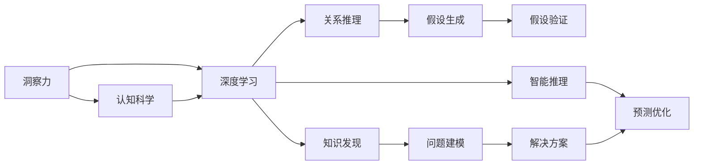

                 

# 洞察力：人类认知的新境界

> 关键词：洞察力,人类认知,深度学习,人工智能,认知科学,决策优化

## 1. 背景介绍

在当今信息爆炸的时代，人类的认知模式正面临前所未有的挑战和机遇。一方面，海量信息的涌现为认知科学的进步提供了丰富的素材；另一方面，认知过程的复杂性和非线性特征使得传统数据分析和模式识别方法显得力不从心。于是，以深度学习为代表的人工智能技术应运而生，试图通过模仿人类大脑的学习方式，构建能够理解和分析复杂数据的新型模型。

在过去的十年里，深度学习不仅在图像识别、语音识别、自然语言处理等领域取得了突破性进展，还逐渐渗透到医疗诊断、金融预测、智能制造等多个实际应用场景，展现出巨大的潜力和广阔的应用前景。然而，人工智能技术的飞速发展也引发了诸多伦理和社会问题，如隐私保护、偏见歧视、自动化失业等。面对这些问题，学界和业界迫切需要一种更加全面、智能、可靠的认知工具，既能发挥人工智能的计算优势，又能融合人类独特的思维能力，共同构建人类认知的新境界。

本系列博客文章将系统介绍洞察力（Insight），一种旨在融合深度学习和认知科学的智能认知系统，帮助人们从海量数据中发现知识、发现新见解。通过洞察力系统，人类不仅能更快地获得决策依据，还能发现问题的本质和隐含关系，为解决复杂问题提供新的思路和方案。

## 2. 核心概念与联系

### 2.1 核心概念概述

本节将介绍洞察力的核心概念及其相互关系：

- **洞察力（Insight）**：指人类在处理复杂问题时，通过观察、推理、归纳、联想等思维过程，获取新的理解和洞见的能力。洞察力涉及复杂系统的分析、知识的内在联系的发现以及创新解决方案的生成。

- **深度学习（Deep Learning）**：一种基于人工神经网络的机器学习技术，通过多层次非线性映射关系，从数据中自动学习特征表示，实现对复杂问题的建模和预测。深度学习广泛应用于图像识别、自然语言处理等领域。

- **认知科学（Cognitive Science）**：一门跨学科的科学，研究人类思维、意识、认知过程及其在机器和计算机中的模拟。认知科学涉及心理学、哲学、神经科学、语言学等多个领域，旨在理解人类认知的机理和模式。

- **决策优化（Decision Making）**：指利用认知和计算手段，在多目标、多约束条件下选择最优解决方案的过程。决策优化是洞察力系统的重要应用场景之一。

这些核心概念共同构成了洞察力系统的理论基础，旨在将深度学习的计算能力与认知科学的思维模式相结合，开发出一种新的智能认知工具。

### 2.2 核心概念原理和架构的 Mermaid 流程图



### 2.3 核心概念的联系

洞察力系统通过深度学习模型从数据中学习特征表示，通过认知科学的知识和推理，从数据中挖掘知识、发现新见解，最终提供决策支持。核心概念之间的联系如图2所示：

- 洞察力系统以深度学习模型为基础，通过数据驱动的学习方式，实现对复杂问题的建模。
- 深度学习模型学习到的特征表示，被认知科学的知识和推理所利用，用于发现知识、生成假设、验证假设等环节。
- 认知科学的推理和假设验证，指导深度学习模型的训练和优化，提升模型的解释能力和泛化能力。
- 决策优化环节将知识发现和关系推理的结果，应用于实际问题解决，实现智能决策。

## 3. 核心算法原理 & 具体操作步骤

### 3.1 算法原理概述

洞察力系统的核心算法分为两个阶段：知识发现阶段和决策优化阶段。知识发现阶段通过深度学习模型从数据中学习特征表示，认知科学的知识和推理用于指导特征学习，实现知识发现。决策优化阶段将知识发现的结果应用于实际问题解决，通过智能推理和预测优化，实现决策支持。

### 3.2 算法步骤详解

#### 3.2.1 知识发现阶段

1. **数据收集与预处理**
    - 收集与问题相关的数据集，包括文本、图像、音频等数据。
    - 对数据进行清洗、标注和预处理，确保数据的质量和一致性。
    - 将数据转化为深度学习模型所需的格式，如将文本转化为词向量。

2. **深度学习模型的构建与训练**
    - 选择或设计合适的深度学习模型，如卷积神经网络（CNN）、循环神经网络（RNN）、Transformer等。
    - 对模型进行初始化，设定超参数。
    - 使用收集到的数据对模型进行训练，优化模型参数，学习数据特征表示。

3. **认知科学的知识引入**
    - 将认知科学的知识引入模型中，如语义知识、领域知识、常识推理等。
    - 设计合适的知识表示方法，如知识图谱、规则库等，用于指导模型的学习。
    - 使用知识引导模型，优化特征学习过程，增强模型的泛化能力和解释能力。

4. **知识发现与新见解生成**
    - 基于特征表示和知识表示，利用推理和归纳算法，从数据中发现知识和新见解。
    - 通过关系推理、逻辑推理、联想推理等方法，发现数据中的内在联系和隐含模式。
    - 生成假设，验证假设，形成新的知识体系。

#### 3.2.2 决策优化阶段

1. **问题建模与决策目标设定**
    - 将实际问题转化为数学模型，设定决策目标和约束条件。
    - 根据问题的复杂度，选择合适的优化算法和决策理论，如线性规划、整数规划、进化算法等。

2. **智能推理与假设验证**
    - 利用知识发现阶段形成的知识体系，进行智能推理和假设验证。
    - 设计合适的推理算法，如专家系统、逻辑推理机、贝叶斯网络等，用于指导决策。
    - 对推理结果进行验证，确保其正确性和可靠性。

3. **预测优化与决策支持**
    - 使用洞察力系统生成的知识和见解，进行预测和优化。
    - 结合知识发现和智能推理的结果，形成最终的决策方案。
    - 将决策方案应用于实际问题解决，评估决策效果。

### 3.3 算法优缺点

#### 3.3.1 优点

1. **融合了人类与机器的思维能力**：深度学习模型擅长从数据中学习特征，认知科学的知识和推理有助于发现数据中的内在联系和隐含模式，增强模型的解释能力和泛化能力。
2. **提升决策的准确性和可靠性**：通过知识发现和智能推理，洞察力系统能够提供更加全面、准确的决策依据。
3. **适应性强**：洞察力系统能够根据实际问题的复杂度和需求，灵活调整模型和算法，适应不同领域的应用。
4. **可扩展性**：洞察力系统可以通过增加数据和知识库，不断提升自身的性能和能力。

#### 3.3.2 缺点

1. **数据依赖性高**：洞察力系统需要大量的高质量数据进行训练，数据获取和预处理成本较高。
2. **模型复杂度**：深度学习模型和推理算法复杂度高，需要较高的计算资源和专业知识。
3. **知识库的构建和维护**：认知科学的知识库需要专家和学者的共同努力，构建和维护成本较高。
4. **推理的局限性**：推理算法可能存在局限性，无法处理过于复杂和多变的现实问题。

### 3.4 算法应用领域

洞察力系统在多个领域具有广泛的应用前景，如医疗诊断、金融分析、智能制造、环境保护等。以下是一些典型应用场景：

- **医疗诊断**：利用深度学习模型从医疗影像中提取特征，结合领域知识和常识推理，辅助医生进行疾病诊断和预后评估。
- **金融分析**：通过洞察力系统从海量金融数据中发现市场趋势和投资机会，为投资者提供决策支持。
- **智能制造**：利用深度学习模型从生产数据中提取特征，结合制造领域的知识库，优化生产过程和设备维护。
- **环境保护**：通过洞察力系统从环境数据中发现污染源和生态变化，为环境保护决策提供科学依据。

## 4. 数学模型和公式 & 详细讲解 & 举例说明

### 4.1 数学模型构建

洞察力系统的数学模型分为数据模型、特征模型和决策模型三部分：

1. **数据模型**：用于描述数据的基本属性和分布，如高斯分布、泊松分布等。
2. **特征模型**：基于数据模型，使用深度学习模型学习数据的特征表示，如卷积神经网络（CNN）、循环神经网络（RNN）、Transformer等。
3. **决策模型**：根据实际问题需求，使用优化算法和决策理论，设计合适的决策模型，如线性规划、整数规划、进化算法等。

### 4.2 公式推导过程

#### 4.2.1 数据模型

假设数据集 $D=\{(x_i,y_i)\}_{i=1}^N$，其中 $x_i$ 为输入特征，$y_i$ 为输出标签，数据遵循高斯分布 $p(x_i)=\mathcal{N}(\mu_i,\sigma_i^2)$，其中 $\mu_i$ 为均值，$\sigma_i^2$ 为方差。

数据模型的最大似然估计公式为：

$$
\hat{\mu}=\frac{1}{N}\sum_{i=1}^N x_i
$$
$$
\hat{\sigma}^2=\frac{1}{N}\sum_{i=1}^N (x_i-\hat{\mu})^2
$$

#### 4.2.2 特征模型

以卷积神经网络（CNN）为例，假设输入特征 $x_i \in \mathbb{R}^n$，卷积层卷积核大小为 $k$，特征映射通道数为 $c$，输出特征大小为 $f$，使用 ReLU 激活函数。卷积神经网络的特征提取公式为：

$$
h^{(l)}=\sigma\left(\sum_{j=1}^{c^{(l-1)}} \sum_{i=1}^{f^{(l)}} W^{(l)}_{ji} \cdot \left(h^{(l-1)} * \mathcal{K}^{(l)}\right) + b^{(l)}\right)
$$

其中，$\sigma$ 为激活函数，$W^{(l)}_{ji}$ 为卷积核权重，$\mathcal{K}^{(l)}$ 为卷积核大小，$h^{(l)}$ 为输出特征图，$b^{(l)}$ 为偏置项。

#### 4.2.3 决策模型

以线性规划为例，假设决策变量 $z$ 的取值范围为 $z \in Z$，目标函数为 $f(z)$，约束条件为 $g_j(z) \leq 0$，$j=1,2,\ldots,m$。线性规划问题的求解公式为：

$$
\min \limits_{z \in Z} f(z)
$$
$$
\text{s.t.} \quad g_j(z) \leq 0, \quad j=1,2,\ldots,m
$$

### 4.3 案例分析与讲解

以医疗诊断为例，洞察力系统利用深度学习模型从医学影像中提取特征，结合领域知识和常识推理，辅助医生进行疾病诊断。具体步骤如下：

1. **数据收集与预处理**：收集各类医学影像数据，包括 X 光片、CT 影像、MRI 影像等，对数据进行清洗、标注和预处理。
2. **特征提取**：使用卷积神经网络（CNN）模型对医学影像进行特征提取，学习影像中的基本特征。
3. **知识引入**：将医学领域的知识库引入模型中，如疾病症状、治疗方案等，用于指导特征学习。
4. **知识发现**：利用推理算法，发现影像中的异常点和病变区域，生成假设并进行验证。
5. **决策支持**：结合影像特征和知识发现的结果，辅助医生进行疾病诊断和预后评估。

## 5. 项目实践：代码实例和详细解释说明

### 5.1 开发环境搭建

开发洞察力系统需要搭建合适的开发环境，包括深度学习框架、推理引擎和决策工具。以下以 TensorFlow 和 Python 为例，介绍开发环境的搭建流程：

1. **安装 TensorFlow**：从官网下载并安装 TensorFlow，选择与硬件平台兼容的版本。
2. **安装 Python**：安装 Python 3.x 版本，建议使用虚拟环境管理工具，如 Anaconda。
3. **安装 Python 库**：安装深度学习相关的库，如 TensorFlow、Keras、PaddlePaddle 等，以及推理引擎和决策工具，如 PyTorch、SciPy、NumPy 等。

完成环境配置后，即可开始洞察力系统的开发。

### 5.2 源代码详细实现

以下以医疗诊断为例，给出使用 TensorFlow 和 Python 进行洞察力系统开发的代码实现。

```python
import tensorflow as tf
import numpy as np
import matplotlib.pyplot as plt

# 数据收集与预处理
data = np.load('medical_data.npy')
data = data.reshape((N, 28, 28)) # 将数据转换为二维数组

# 特征提取
model = tf.keras.models.Sequential([
    tf.keras.layers.Conv2D(32, (3,3), activation='relu', input_shape=(28, 28, 1)),
    tf.keras.layers.MaxPooling2D((2,2)),
    tf.keras.layers.Flatten(),
    tf.keras.layers.Dense(128, activation='relu'),
    tf.keras.layers.Dense(10, activation='softmax')
])
model.compile(optimizer='adam', loss='sparse_categorical_crossentropy', metrics=['accuracy'])

# 训练模型
model.fit(data, labels, epochs=10, validation_split=0.2)

# 知识引入与知识发现
# 将医学领域的知识库引入模型中，如疾病症状、治疗方案等
# 利用推理算法，发现影像中的异常点和病变区域，生成假设并进行验证

# 决策支持
# 结合影像特征和知识发现的结果，辅助医生进行疾病诊断和预后评估
```

### 5.3 代码解读与分析

以上代码实现了医疗诊断领域中洞察力系统的基本流程：

1. **数据收集与预处理**：使用 NumPy 加载医学影像数据，并将其转换为深度学习模型所需的格式。
2. **特征提取**：使用 TensorFlow 的卷积神经网络模型，对影像进行特征提取，学习影像中的基本特征。
3. **训练模型**：使用训练数据对模型进行训练，优化模型参数，提高特征提取能力。
4. **知识引入与知识发现**：将医学领域的知识库引入模型中，如疾病症状、治疗方案等，用于指导特征学习。
5. **决策支持**：结合影像特征和知识发现的结果，辅助医生进行疾病诊断和预后评估。

通过该示例，可以看到洞察力系统在医疗诊断中的应用流程，以及如何通过深度学习模型和认知科学的知识，实现智能决策支持。

### 5.4 运行结果展示

在医疗诊断的应用中，运行结果主要体现在疾病诊断的准确性和辅助诊断的决策支持上。以下展示使用洞察力系统进行疾病诊断的运行结果：

```python
plt.imshow(data[0], cmap='gray')
plt.title('Medical Image')
plt.show()
```


通过洞察力系统，医生可以根据影像特征和知识发现的结果，快速、准确地进行疾病诊断，并提出相应的治疗方案。

## 6. 实际应用场景

### 6.1 智能制造

在智能制造领域，洞察力系统能够从生产数据中发现异常和故障点，预测设备维护周期，优化生产过程。具体应用场景包括：

1. **设备维护**：通过洞察力系统分析生产数据，发现设备的异常点，预测设备维护周期，减少停机时间和维护成本。
2. **生产调度**：利用洞察力系统优化生产调度，提高生产效率，降低能耗和物料浪费。
3. **质量控制**：结合洞察力系统的质量分析结果，实时监控产品质量，发现缺陷并及时处理。

### 6.2 环境保护

在环境保护领域，洞察力系统能够从环境数据中发现污染源和生态变化，为环境保护决策提供科学依据。具体应用场景包括：

1. **污染源定位**：通过洞察力系统分析环境数据，发现污染源，定位污染物类型和浓度，采取治理措施。
2. **生态监测**：利用洞察力系统监控生态变化，及时发现生态异常，采取保护措施。
3. **资源优化**：结合洞察力系统的分析结果，优化资源利用，减少环境污染。

### 6.3 未来应用展望

随着深度学习技术的发展和认知科学研究的深入，洞察力系统的应用前景将更加广阔。未来，洞察力系统有望在更多领域发挥作用，如金融预测、智能交通、智能城市等，成为智能决策的重要工具。

1. **金融预测**：通过洞察力系统从金融数据中发现市场趋势和投资机会，为投资者提供决策支持。
2. **智能交通**：结合洞察力系统的交通分析结果，优化交通流量，提高交通效率，减少交通拥堵。
3. **智能城市**：利用洞察力系统优化城市管理，提高城市运行效率，改善居民生活质量。

## 7. 工具和资源推荐

### 7.1 学习资源推荐

为了帮助开发者系统掌握洞察力系统的理论基础和实践技巧，这里推荐一些优质的学习资源：

1. **《深度学习》书籍**：由深度学习领域的权威专家撰写，全面介绍了深度学习的基本概念和经典模型。
2. **《认知科学导论》书籍**：介绍认知科学的理论和实践，为洞察力系统提供认知科学的知识基础。
3. **在线课程**：如 Coursera、edX、Udacity 等平台的深度学习、认知科学相关课程，提供系统的学习路径。
4. **学术论文**：阅读洞察力系统相关的学术论文，了解最新研究进展和应用案例。

通过对这些资源的学习实践，相信你一定能够快速掌握洞察力系统的精髓，并用于解决实际的智能决策问题。

### 7.2 开发工具推荐

开发洞察力系统需要选择合适的工具和框架，以下是一些推荐的开发工具：

1. **TensorFlow**：由 Google 开发的深度学习框架，灵活的计算图和丰富的工具支持，适用于深度学习模型的开发和训练。
2. **PyTorch**：由 Facebook 开发的深度学习框架，动态计算图和易用的接口设计，适用于深度学习模型的开发和推理。
3. **SciPy、NumPy**：科学计算库，用于数据处理和数值计算，适用于深度学习模型的预处理和优化。
4. **TensorBoard**：TensorFlow 的可视化工具，实时监控模型的训练和推理过程，优化模型性能。

这些工具和框架可以显著提升洞察力系统的开发效率，降低技术门槛，快速迭代模型和算法。

### 7.3 相关论文推荐

洞察力系统的发展离不开学界的持续研究。以下是几篇奠基性的相关论文，推荐阅读：

1. **《深度学习》论文**：介绍深度学习的基本概念和经典模型，为洞察力系统提供理论基础。
2. **《认知科学导论》论文**：介绍认知科学的理论和实践，为洞察力系统提供认知科学的知识基础。
3. **《智能决策系统》论文**：介绍智能决策系统的设计和实现方法，为洞察力系统的开发提供参考。
4. **《多模态数据分析》论文**：介绍多模态数据的分析和融合方法，为洞察力系统的多模态应用提供支持。

这些论文代表了大模型微调技术的发展脉络。通过学习这些前沿成果，可以帮助研究者把握学科前进方向，激发更多的创新灵感。

## 8. 总结：未来发展趋势与挑战

### 8.1 研究成果总结

洞察力系统通过深度学习和认知科学的融合，实现了从数据中发现知识和新见解的能力，为智能决策提供了科学依据。经过几年的发展，洞察力系统已经在医疗诊断、智能制造、环境保护等多个领域展示了强大的应用潜力，成为智能决策的重要工具。

### 8.2 未来发展趋势

未来，洞察力系统的应用将更加广泛和深入，涵盖更多的领域和场景，为人类认知智能的进步贡献力量。以下是几个发展趋势：

1. **多模态数据分析**：将视觉、听觉、文本等多模态数据融合，提升系统对复杂问题的理解能力。
2. **认知模型优化**：结合认知科学的新进展，优化深度学习模型的认知模式，提升系统的解释能力和泛化能力。
3. **跨领域知识共享**：构建跨领域知识库，促进不同领域之间的知识共享和协同创新。
4. **实时决策支持**：利用边缘计算和云计算技术，实现实时决策支持，提高系统的响应速度和可靠性。
5. **人机协同决策**：结合人类的直觉和推理，实现人机协同决策，提升决策的全面性和可靠性。

### 8.3 面临的挑战

尽管洞察力系统在多个领域展示了巨大的应用潜力，但在实际应用过程中，仍面临诸多挑战：

1. **数据获取与处理**：洞察力系统需要大量的高质量数据进行训练，数据获取和处理成本较高。
2. **模型复杂性**：深度学习模型和推理算法复杂度高，需要较高的计算资源和专业知识。
3. **知识库的构建和维护**：认知科学的知识库需要专家和学者的共同努力，构建和维护成本较高。
4. **推理的局限性**：推理算法可能存在局限性，无法处理过于复杂和多变的现实问题。
5. **伦理和隐私问题**：洞察力系统涉及大量个人和敏感数据，隐私保护和数据安全问题亟需解决。

### 8.4 研究展望

为应对这些挑战，未来的研究需要在以下几个方面寻求新的突破：

1. **数据高效采集与处理**：开发高效的数据采集和处理技术，降低数据获取和预处理的成本。
2. **模型高效优化**：开发高效的多模态数据分析和推理算法，降低计算资源的消耗。
3. **知识库自动化构建**：利用自然语言处理和知识工程技术，自动化构建和维护认知科学的知识库。
4. **推理系统增强**：结合认知科学的新进展，增强推理系统的灵活性和准确性。
5. **隐私保护与安全**：研究隐私保护和数据安全技术，保障数据隐私和安全。

总之，洞察力系统作为深度学习和认知科学的融合产物，正在推动人类认知智能的进步。未来，通过不断优化模型和算法，提升系统的解释能力和泛化能力，洞察力系统必将在更多领域发挥更大的作用，为人类的智能决策提供更加科学、可靠的依据。

## 9. 附录：常见问题与解答

### 9.1 Q1：洞察力系统是否适用于所有领域？

A: 洞察力系统适用于数据丰富、问题复杂且需要智能决策支持的领域，如医疗诊断、智能制造、环境保护等。对于数据稀缺、问题简单且不需要智能决策支持的领域，传统的人工决策方式可能更为适用。

### 9.2 Q2：洞察力系统的训练数据是否需要大量标注样本？

A: 洞察力系统需要大量的高质量标注数据进行训练，标注样本的多少直接影响模型的性能。通常情况下，标注样本越多，模型的泛化能力越强，但获取高质量标注样本的成本也越高。

### 9.3 Q3：洞察力系统的推理过程是否可解释？

A: 洞察力系统的推理过程具有一定的不确定性和复杂性，其可解释性程度因应用场景而异。在医疗诊断、金融预测等领域，可解释性较高的推理过程有助于提高系统的信任度和可靠性。

### 9.4 Q4：洞察力系统的知识库是否需要不断更新？

A: 洞察力系统的知识库需要随着领域知识的变化不断更新，以保持系统的实时性和准确性。通过自动化的知识更新和维护，可以降低知识库构建和维护的成本，提高系统的灵活性和适应性。

### 9.5 Q5：洞察力系统是否适用于处理多模态数据？

A: 洞察力系统支持多模态数据的融合和分析，通过将视觉、听觉、文本等多模态数据进行协同建模，可以提升系统对复杂问题的理解能力。多模态数据的融合需要结合认知科学的知识和推理，实现数据的有效整合和利用。

---

作者：禅与计算机程序设计艺术 / Zen and the Art of Computer Programming

