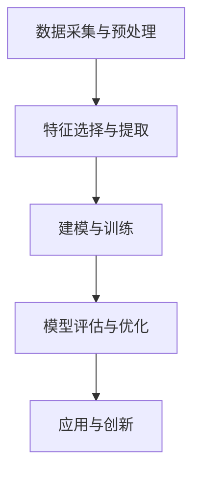

                 

# 洞察力：知识创新的核心要素

> 关键词：知识发现，数据挖掘，机器学习，深度学习，神经网络

## 1. 背景介绍

### 1.1 问题由来
在快速发展的科技时代，数据呈爆炸性增长。大数据、人工智能、机器学习等技术日益成熟，这些技术在金融、医疗、交通、教育等领域的应用日益广泛。然而，在信息丰富的同时，数据中隐藏着大量未被挖掘的知识和洞察力。如何从海量数据中提取有价值的信息，并进行知识创新，成为了当前科研和商业界的一个重要课题。

### 1.2 问题核心关键点
数据挖掘和大数据分析的目标在于从数据中发现未知知识，从而支持决策、优化过程、创新产品等。这些核心关键点包括：

- **数据采集与预处理**：收集多样、高质量的数据，并对其进行清洗和处理，确保数据的质量和可用性。
- **特征选择与提取**：从原始数据中提取有意义、高相关性的特征，以便后续的建模和分析。
- **建模与训练**：选择合适算法，对数据进行建模和训练，以提取潜在的知识模式。
- **模型评估与优化**：评估模型效果，进行参数调优，确保模型具有较高的泛化能力。
- **应用与创新**：将模型应用于实际场景，推动知识创新和业务决策。

### 1.3 问题研究意义
洞察力在知识创新中扮演着至关重要的角色。通过对数据的深入分析，可以从数据中挖掘出有价值的知识，从而支持决策、优化流程、创新产品等。这些数据驱动的洞察力，可以提升企业的竞争力和市场响应速度，推动社会经济的发展。

## 2. 核心概念与联系

### 2.1 核心概念概述

为更好地理解洞察力的挖掘和应用，本节将介绍几个密切相关的核心概念：

- **数据挖掘(Data Mining)**：从数据中自动发现有用的信息和知识的过程。
- **知识发现(Knowledge Discovery)**：将数据挖掘的结果进行提炼、分析和验证，以产生新的、有价值的知识。
- **机器学习(Machine Learning)**：让机器通过数据学习规律，从而进行预测、分类等任务。
- **深度学习(Deep Learning)**：一种基于神经网络的学习方法，适用于大规模数据和大规模问题。
- **神经网络(Neural Network)**：由大量神经元组成的网络结构，用于逼近复杂的函数关系。
- **数据预处理(Data Preprocessing)**：对原始数据进行清洗、转换、归一化等处理，以提高数据质量。
- **特征选择(Feature Selection)**：从原始数据中选择最具代表性、最相关的特征。
- **模型评估(Model Evaluation)**：通过验证集等手段评估模型的性能，调整模型参数。

这些核心概念之间的逻辑关系可以通过以下Mermaid流程图来展示：



这个流程图展示了数据挖掘和知识发现的一般流程：

1. 通过数据采集与预处理获得高质量的数据。
2. 选择特征，从数据中提取有价值的特征信息。
3. 使用机器学习或深度学习等方法，对数据进行建模和训练。
4. 评估模型效果，并进行优化。
5. 将模型应用于实际场景，推动知识创新。

## 3. 核心算法原理 & 具体操作步骤

### 3.1 算法原理概述

知识发现和洞察力的挖掘，本质上是一个数据分析和建模的过程。其核心思想是：通过选择和提取关键特征，构建合适的模型，对数据进行分析和预测，从而发现潜在的知识模式和洞察力。

形式化地，假设数据集为 $D=\{(x_i, y_i)\}_{i=1}^N$，其中 $x_i$ 为输入特征，$y_i$ 为标签。目标是找到一个函数 $f$，使得 $f(x_i) \approx y_i$。知识发现的过程可以表示为：

$$
f = \mathop{\arg\min}_{f} \frac{1}{N} \sum_{i=1}^N L(f(x_i), y_i)
$$

其中 $L$ 为损失函数，通常为均方误差、交叉熵等。知识发现的最终目标是找到最佳的 $f$，使得模型具有较高的准确性和泛化能力。

### 3.2 算法步骤详解

知识发现的算法通常包括以下关键步骤：

**Step 1: 数据采集与预处理**
- 收集与问题相关的原始数据。
- 对数据进行清洗、去重、缺失值处理等预处理步骤，确保数据质量。
- 对文本、图像等非结构化数据进行结构化处理，便于后续分析。

**Step 2: 特征选择与提取**
- 从原始数据中选择最具代表性和相关性的特征。
- 使用统计、降维等方法，提取有意义的特征表示。
- 对文本数据进行向量化处理，如TF-IDF、Word2Vec等。

**Step 3: 建模与训练**
- 选择合适的机器学习或深度学习算法，对数据进行建模和训练。
- 使用交叉验证等技术，评估模型性能，选择最佳模型。
- 对模型进行调参，优化模型效果。

**Step 4: 模型评估与优化**
- 在验证集上评估模型性能，计算准确率、召回率等指标。
- 使用网格搜索、贝叶斯优化等方法，进行模型参数优化。
- 进行模型融合、集成，提升模型效果。

**Step 5: 应用与创新**
- 将训练好的模型应用于实际问题，进行预测、分类等任务。
- 结合领域知识，解释和应用模型的输出结果。
- 推动创新产品、服务等的开发和部署。

### 3.3 算法优缺点

知识发现和洞察力的挖掘，具有以下优点：

1. **数据驱动**：基于大规模数据进行建模和分析，具有较高的准确性和可靠性。
2. **泛化能力强**：训练好的模型能够适应新的数据和场景，具有较好的泛化能力。
3. **高效自动化**：利用算法自动进行特征选择、模型训练和评估，降低人工干预。
4. **创新潜力大**：可以从数据中发现新的知识模式和洞察力，推动业务创新。

同时，这些方法也存在一些局限性：

1. **数据质量依赖**：数据质量直接影响模型的效果，低质量数据可能导致误导性的结果。
2. **模型复杂度高**：复杂的深度学习模型需要大量计算资源，训练时间较长。
3. **解释性不足**：复杂模型难以解释其内部工作机制，缺乏透明度。
4. **过拟合风险**：复杂模型容易过拟合，泛化能力差。
5. **资源消耗大**：高维数据的处理和存储消耗大量计算和存储资源。

尽管存在这些局限性，但知识发现和洞察力挖掘仍然是当前数据科学和人工智能的重要研究方向，具有广阔的应用前景。

### 3.4 算法应用领域

知识发现和洞察力挖掘，在多个领域得到了广泛应用，例如：

- **金融风险管理**：通过分析交易数据，发现潜在的金融风险和欺诈行为。
- **医疗健康监测**：通过分析患者数据，发现疾病模式，推动个性化医疗。
- **零售销售分析**：通过分析销售数据，优化商品推荐，提升客户满意度。
- **社交媒体分析**：通过分析用户行为数据，发现舆情趋势，提高品牌营销效果。
- **环境监测**：通过分析气象数据，预测气候变化，提供决策支持。

这些应用展示了知识发现和洞察力挖掘的强大潜力和广泛适用性，为各行各业带来了新的突破和机遇。

## 4. 数学模型和公式 & 详细讲解 & 举例说明

### 4.1 数学模型构建

本节将使用数学语言对知识发现和洞察力挖掘的过程进行更加严格的刻画。

假设数据集为 $D=\{(x_i, y_i)\}_{i=1}^N$，其中 $x_i$ 为输入特征，$y_i$ 为标签。定义模型 $f$ 为线性回归模型，其形式为 $f(x_i) = \theta_0 + \sum_{j=1}^d \theta_j x_{ij}$，其中 $\theta = (\theta_0, \theta_1, ..., \theta_d)$。模型的损失函数为均方误差：

$$
L(f) = \frac{1}{N} \sum_{i=1}^N (y_i - f(x_i))^2
$$

知识发现的目标是找到最优参数 $\theta$，使得损失函数最小化：

$$
\theta^* = \mathop{\arg\min}_{\theta} L(f)
$$

通过梯度下降等优化算法，模型不断更新参数 $\theta$，最小化损失函数，直至收敛。

### 4.2 公式推导过程

以线性回归为例，推导最小二乘法求解线性回归模型的过程：

假设 $f(x_i) = \theta_0 + \sum_{j=1}^d \theta_j x_{ij}$，损失函数为 $L(f) = \frac{1}{N} \sum_{i=1}^N (y_i - f(x_i))^2$。根据梯度下降算法，每次迭代更新参数 $\theta$ 的公式为：

$$
\theta_{j+1} = \theta_j - \eta \frac{\partial L(f)}{\partial \theta_j}
$$

其中 $\eta$ 为学习率。将 $L(f)$ 对 $\theta_j$ 求导，得到：

$$
\frac{\partial L(f)}{\partial \theta_j} = -\frac{2}{N} \sum_{i=1}^N (y_i - f(x_i))x_{ij}
$$

代入更新公式，得到：

$$
\theta_{j+1} = \theta_j - \eta \left(-\frac{2}{N} \sum_{i=1}^N (y_i - f(x_i))x_{ij}\right)
$$

整理得到：

$$
\theta_{j+1} = \theta_j + \frac{\eta}{N} \sum_{i=1}^N (y_i - f(x_i))x_{ij}
$$

通过迭代更新 $\theta$，即可求得最优参数 $\theta^*$，从而得到最佳回归模型 $f^*$。

### 4.3 案例分析与讲解

以房价预测为例，分析知识发现的过程：

假设有一组房屋销售数据，包括房屋面积、房间数、位置等特征，以及相应的房价。可以将这些数据作为训练集，进行房价预测。

1. **数据预处理**：对数据进行清洗、去重、缺失值处理等操作，确保数据质量。
2. **特征选择**：选择与房价相关的特征，如房屋面积、房间数等。
3. **建模与训练**：使用线性回归模型，对数据进行建模和训练，得到预测模型。
4. **模型评估**：在验证集上评估模型效果，计算准确率和均方误差。
5. **应用与创新**：利用训练好的模型，进行房价预测，推动房价评估和市场分析等创新应用。

## 5. 项目实践：代码实例和详细解释说明

### 5.1 开发环境搭建

在进行知识发现和洞察力挖掘的实践前，我们需要准备好开发环境。以下是使用Python进行Scikit-learn和TensorFlow开发的环境配置流程：

1. 安装Anaconda：从官网下载并安装Anaconda，用于创建独立的Python环境。

2. 创建并激活虚拟环境：
```bash
conda create -n sklearn-env python=3.8 
conda activate sklearn-env
```

3. 安装Scikit-learn：
```bash
pip install scikit-learn
```

4. 安装TensorFlow：
```bash
pip install tensorflow
```

5. 安装各类工具包：
```bash
pip install numpy pandas matplotlib seaborn scikit-learn scikit-image jupyter notebook ipython
```

完成上述步骤后，即可在`sklearn-env`环境中开始项目实践。

### 5.2 源代码详细实现

下面我们以房价预测为例，给出使用Scikit-learn和TensorFlow对线性回归模型进行训练和评估的PyTorch代码实现。

首先，定义数据预处理和特征提取函数：

```python
import pandas as pd
from sklearn.model_selection import train_test_split
from sklearn.preprocessing import StandardScaler
from sklearn.linear_model import LinearRegression

def load_data(file_path):
    data = pd.read_csv(file_path)
    return data

def preprocess_data(data):
    features = data[['area', 'rooms', 'location']]
    labels = data['price']
    features = StandardScaler().fit_transform(features)
    features_train, features_test, labels_train, labels_test = train_test_split(features, labels, test_size=0.2)
    return features_train, features_test, labels_train, labels_test

def feature_extractor(data):
    features = pd.DataFrame(data)
    features = features.apply(lambda x: x if x.name != 'price' else x.values.reshape(-1))
    features = features.apply(lambda x: x.values.reshape(-1))
    return features

# 加载数据
data = load_data('house_data.csv')

# 数据预处理
features_train, features_test, labels_train, labels_test = preprocess_data(data)
```

然后，定义模型和评估函数：

```python
from sklearn.linear_model import LinearRegression
from sklearn.metrics import mean_squared_error

model = LinearRegression()

def train_model(model, features_train, labels_train, features_test, labels_test):
    model.fit(features_train, labels_train)
    train_preds = model.predict(features_train)
    test_preds = model.predict(features_test)
    train_rmse = np.sqrt(mean_squared_error(labels_train, train_preds))
    test_rmse = np.sqrt(mean_squared_error(labels_test, test_preds))
    return train_rmse, test_rmse

# 模型训练和评估
train_rmse, test_rmse = train_model(model, features_train, labels_train, features_test, labels_test)
print(f'Train RMSE: {train_rmse:.2f}, Test RMSE: {test_rmse:.2f}')
```

以上就是使用Scikit-learn和TensorFlow对线性回归模型进行训练和评估的完整代码实现。可以看到，利用Scikit-learn等Python库，可以轻松实现数据预处理、特征提取和模型训练等功能。

### 5.3 代码解读与分析

让我们再详细解读一下关键代码的实现细节：

**load_data函数**：
- 加载数据集，并返回数据集对象。
- 数据集应包含多列特征和标签。

**preprocess_data函数**：
- 选择与标签相关的特征。
- 对特征进行标准化处理，确保数据质量。
- 使用train_test_split方法将数据集划分为训练集和测试集。

**feature_extractor函数**：
- 对数据集进行特征提取，去除无用列，保留数值列。
- 对数值列进行向量化处理，便于后续的模型训练。

**train_model函数**：
- 使用LinearRegression模型进行训练。
- 在训练集和测试集上进行预测，计算均方误差。
- 返回训练集和测试集的RMSE值。

**主程序**：
- 加载数据集。
- 对数据进行预处理和特征提取。
- 使用LinearRegression模型进行训练和评估。
- 输出训练集和测试集的RMSE值。

通过这些代码，读者可以初步理解数据预处理、特征提取和模型训练等基本步骤，并进一步探索如何利用Scikit-learn等工具进行更高级的建模和分析。

## 6. 实际应用场景

### 6.1 金融风险管理

金融风险管理是知识发现和洞察力挖掘的重要应用领域之一。通过对交易数据、市场数据、客户行为等进行深度分析，可以发现潜在的风险点和欺诈行为，提高风险控制和欺诈检测能力。

例如，可以通过分析交易数据中的异常行为，发现潜在欺诈行为。通过挖掘客户行为数据，预测客户流失风险，并采取措施挽留客户。这些应用将金融风险管理提升到一个新的高度，为金融机构提供了更加精准和高效的风险控制手段。

### 6.2 医疗健康监测

在医疗健康领域，知识发现和洞察力挖掘也有广泛的应用。通过对患者数据、医疗记录等进行分析，可以发现疾病模式，推动个性化医疗和健康管理。

例如，可以通过分析患者数据，发现潜在的疾病风险，制定个性化的治疗方案。通过挖掘医疗记录，发现新的疾病模式和治疗方法，推动医疗研究的创新。这些应用将医疗健康监测提升到一个新的高度，为医疗健康行业提供了更加科学和精准的决策支持。

### 6.3 零售销售分析

零售销售分析是知识发现和洞察力挖掘的重要应用领域之一。通过对销售数据、客户行为等进行深度分析，可以优化商品推荐、提升客户满意度、提高销售业绩。

例如，可以通过分析销售数据，发现销售趋势和季节性变化，优化库存管理和销售策略。通过挖掘客户行为数据，进行个性化推荐，提高客户购买意愿。这些应用将零售销售分析提升到一个新的高度，为零售行业提供了更加精准和高效的决策支持。

### 6.4 未来应用展望

随着知识发现和洞察力挖掘技术的不断发展，未来的应用前景将更加广阔。以下是一些未来的应用展望：

1. **智能决策支持系统**：基于知识发现和洞察力挖掘，构建智能决策支持系统，为各行各业提供科学、精准的决策支持。
2. **个性化推荐系统**：通过分析用户行为数据，实现个性化推荐，提升用户体验和满意度。
3. **市场预测与趋势分析**：通过对市场数据和客户行为进行分析，预测市场趋势和变化，为企业提供精准的市场预测和分析。
4. **智能投研平台**：利用知识发现和洞察力挖掘技术，构建智能投研平台，提升投资研究和风险管理能力。
5. **智慧城市治理**：通过对城市数据进行深度分析，提升城市治理水平，推动智慧城市建设。

## 7. 工具和资源推荐

### 7.1 学习资源推荐

为了帮助开发者系统掌握知识发现和洞察力挖掘的理论基础和实践技巧，这里推荐一些优质的学习资源：

1. 《Python数据科学手册》：全面介绍了Python在数据科学中的应用，包括数据预处理、特征工程、模型训练等。
2. 《机器学习实战》：通过实际案例，介绍了机器学习的基本原理和实现方法，适合初学者入门。
3. 《深度学习入门》：介绍深度学习的基本原理和应用，适合对深度学习感兴趣的读者。
4. Kaggle平台：全球最大的数据科学竞赛平台，提供了丰富的数据集和模型训练样例，适合进行实战练习。
5. Coursera、edX等在线课程平台：提供系统化的数据科学课程，涵盖数据挖掘、机器学习、深度学习等诸多领域。

通过对这些资源的学习实践，相信你一定能够快速掌握知识发现和洞察力挖掘的精髓，并用于解决实际的业务问题。

### 7.2 开发工具推荐

高效的开发离不开优秀的工具支持。以下是几款用于知识发现和洞察力挖掘开发的常用工具：

1. Python：作为数据科学的主流语言，Python具有丰富的库和框架，适合进行数据处理和建模。
2. R语言：也是数据科学的主流语言之一，提供了丰富的统计分析和可视化工具。
3. Jupyter Notebook：支持Python、R等多种语言，提供了便捷的交互式编程环境，适合进行模型训练和调试。
4. SQL：用于数据查询和分析，适合进行大规模数据处理。
5. TensorFlow、PyTorch：深度学习的主流框架，提供了丰富的算法和模型，适合进行复杂的建模和训练。

合理利用这些工具，可以显著提升知识发现和洞察力挖掘的开发效率，加快创新迭代的步伐。

### 7.3 相关论文推荐

知识发现和洞察力挖掘的研究源于学界的持续研究。以下是几篇奠基性的相关论文，推荐阅读：

1. "The Elements of Statistical Learning"：介绍了统计学习方法的基本原理和应用，是数据科学领域的经典教材。
2. "Pattern Recognition and Machine Learning"：由Christopher Bishop所著，介绍了机器学习的基本原理和算法，适合深入学习。
3. "Deep Learning"：由Ian Goodfellow、Yoshua Bengio和Aaron Courville所著，介绍了深度学习的基本原理和应用，适合对深度学习感兴趣的读者。
4. "Learning with Local and Global Consistency"：提出了一种基于局部和全局一致性的学习算法，提升了模型的泛化能力。
5. "Scalable Task-Agnostic Neural Collaborative Filtering"：提出了一种基于神经网络的协同过滤算法，适用于大规模推荐系统。

这些论文代表了大数据、机器学习和深度学习等领域的最新进展，通过学习这些前沿成果，可以帮助研究者把握学科前进方向，激发更多的创新灵感。

## 8. 总结：未来发展趋势与挑战

### 8.1 总结

本文对知识发现和洞察力挖掘的过程进行了全面系统的介绍。首先阐述了知识发现和洞察力挖掘的研究背景和意义，明确了数据驱动的决策和优化过程的重要性。其次，从原理到实践，详细讲解了知识发现和洞察力挖掘的数学原理和关键步骤，给出了知识发现任务开发的完整代码实例。同时，本文还广泛探讨了知识发现和洞察力挖掘在金融、医疗、零售等多个行业领域的应用前景，展示了其广阔的应用潜力。

通过本文的系统梳理，可以看到，知识发现和洞察力挖掘在数据科学和人工智能领域中扮演着至关重要的角色，为各行各业提供了科学、精准的决策支持。未来，伴随数据科学和人工智能技术的不断发展，知识发现和洞察力挖掘必将在更多的应用场景中大放异彩。

### 8.2 未来发展趋势

展望未来，知识发现和洞察力挖掘技术将呈现以下几个发展趋势：

1. **大数据分析**：随着数据规模的不断扩大，大数据分析技术将更加成熟，能够处理更加复杂的数据类型和结构。
2. **深度学习**：深度学习在知识发现和洞察力挖掘中的应用将更加广泛，能够处理更加复杂的数据模式和关系。
3. **自动化和智能化**：自动化的数据分析和建模技术将更加成熟，能够实现自动化的特征选择、模型训练和评估。
4. **跨领域融合**：知识发现和洞察力挖掘技术将与其他领域的技术进行更加紧密的融合，如自然语言处理、计算机视觉等，实现多模态数据协同建模。
5. **实时性和交互性**：实时分析和交互式探索将成为未来知识发现和洞察力挖掘的重要方向，能够实时响应用户需求和反馈。

以上趋势凸显了知识发现和洞察力挖掘技术的广阔前景。这些方向的探索发展，必将进一步提升知识发现和洞察力挖掘的能力，为各行业提供更加科学、精准的决策支持。

### 8.3 面临的挑战

尽管知识发现和洞察力挖掘技术已经取得了显著进展，但在迈向更加智能化、普适化应用的过程中，仍面临诸多挑战：

1. **数据质量和多样性**：数据质量和多样性直接影响模型的效果，低质量数据可能导致误导性的结果。
2. **模型复杂度和计算资源**：复杂的深度学习模型需要大量计算资源，训练时间较长。
3. **模型解释性和透明性**：复杂模型难以解释其内部工作机制，缺乏透明度。
4. **过拟合风险**：复杂模型容易过拟合，泛化能力差。
5. **资源消耗**：高维数据的处理和存储消耗大量计算和存储资源。
6. **数据隐私和安全**：数据隐私和安全问题日益突出，需要在数据使用和共享过程中加以保护。

尽管存在这些挑战，但随着学界和产业界的共同努力，这些挑战终将逐步克服，知识发现和洞察力挖掘技术必将在更多的应用场景中大放异彩。

### 8.4 研究展望

面对知识发现和洞察力挖掘面临的种种挑战，未来的研究需要在以下几个方面寻求新的突破：

1. **自动化数据预处理**：开发更加智能的数据预处理工具，自动识别和处理数据中的噪声和异常值。
2. **高效模型训练**：开发高效的模型训练算法，如加速梯度下降、分布式训练等，提升模型的训练速度。
3. **模型解释性和透明性**：引入模型解释技术，如特征重要性分析、模型可视化等，提高模型的透明性和可解释性。
4. **跨领域知识融合**：将多领域知识进行整合，构建更加全面、准确的知识模型。
5. **隐私保护技术**：开发隐私保护算法，确保数据使用的安全性，保护用户隐私。

这些研究方向的探索，必将引领知识发现和洞察力挖掘技术迈向更高的台阶，为各行业提供更加科学、精准的决策支持。面向未来，知识发现和洞察力挖掘技术还需要与其他人工智能技术进行更深入的融合，如自然语言处理、计算机视觉等，多路径协同发力，共同推动知识发现和洞察力挖掘技术的进步。只有勇于创新、敢于突破，才能不断拓展知识发现和洞察力挖掘的边界，让数据驱动的决策支持体系更加科学、高效。

## 9. 附录：常见问题与解答

**Q1：知识发现和洞察力挖掘的主要步骤是什么？**

A: 知识发现和洞察力挖掘的主要步骤包括数据预处理、特征选择、建模训练、模型评估和应用创新等。具体步骤如下：
1. 数据预处理：对原始数据进行清洗、去重、缺失值处理等操作，确保数据质量。
2. 特征选择：从原始数据中选择最具代表性和相关性的特征。
3. 建模训练：选择合适的机器学习或深度学习算法，对数据进行建模和训练，得到预测模型。
4. 模型评估：在验证集上评估模型效果，计算准确率、均方误差等指标。
5. 应用创新：利用训练好的模型，进行预测、分类等任务，推动业务创新。

**Q2：知识发现和洞察力挖掘常用的算法有哪些？**

A: 知识发现和洞察力挖掘常用的算法包括线性回归、逻辑回归、支持向量机、决策树、随机森林、神经网络等。具体选择哪些算法，取决于数据类型和应用需求。

**Q3：如何在知识发现和洞察力挖掘过程中避免过拟合？**

A: 避免过拟合的方法包括：
1. 数据增强：通过增加噪声、回译等方式扩充训练集。
2. 正则化：使用L2正则、Dropout等方法防止模型过拟合。
3. 模型融合：通过集成多个模型，降低过拟合风险。
4. 交叉验证：使用交叉验证技术评估模型效果，选择最佳模型。
5. 早期停止：在验证集上监测模型性能，及时停止训练，防止过拟合。

**Q4：如何进行知识发现和洞察力挖掘的模型优化？**

A: 模型优化的方法包括：
1. 参数调优：通过网格搜索、贝叶斯优化等方法，调整模型参数，优化模型效果。
2. 特征工程：通过特征选择、特征构造等方法，提升模型特征质量。
3. 模型集成：通过集成多个模型，提升模型效果和泛化能力。
4. 模型融合：通过加权平均、堆叠等方法，提升模型效果。

**Q5：知识发现和洞察力挖掘有哪些实际应用？**

A: 知识发现和洞察力挖掘在多个领域得到了广泛应用，例如：
1. 金融风险管理：通过分析交易数据，发现潜在欺诈行为，提高风险控制能力。
2. 医疗健康监测：通过分析患者数据，发现疾病模式，推动个性化医疗和健康管理。
3. 零售销售分析：通过分析销售数据，优化商品推荐，提升客户满意度。
4. 市场预测与趋势分析：通过对市场数据和客户行为进行分析，预测市场趋势和变化。

通过本文的系统梳理，可以看到，知识发现和洞察力挖掘在数据科学和人工智能领域中扮演着至关重要的角色，为各行各业提供了科学、精准的决策支持。未来，伴随数据科学和人工智能技术的不断发展，知识发现和洞察力挖掘必将在更多的应用场景中大放异彩，推动社会经济的发展和进步。

---

作者：禅与计算机程序设计艺术 / Zen and the Art of Computer Programming

