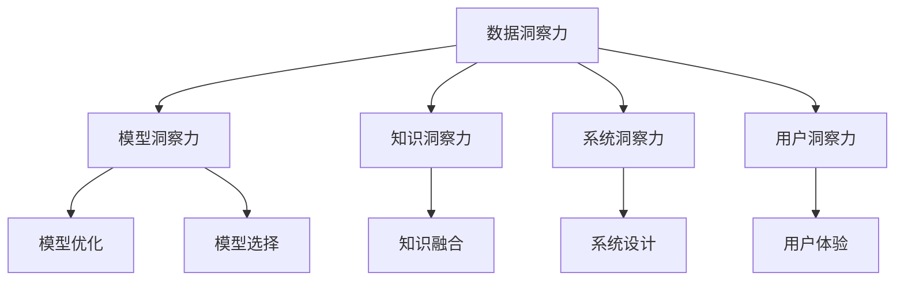

                 

# 洞察力：知识创新的领路人

## 1. 背景介绍

### 1.1 问题由来
随着人工智能（AI）技术的迅猛发展，数据和计算资源的普及，越来越多的企业和研究机构开始将AI应用于不同的领域，以期获得更高的效率和更好的结果。然而，尽管技术在不断进步，企业在实际应用AI技术的过程中仍然面临着诸多挑战，如数据质量问题、模型泛化能力不足、系统鲁棒性差、知识表示能力不足等。这些问题导致许多企业在应用AI技术时效果不理想，甚至出现误导性结果。

如何提高AI系统的可靠性和准确性，使其在实际应用中能够更好地发挥作用，成为了摆在企业和研究机构面前的重大问题。本文将探讨如何通过“洞察力”，即对数据、模型和知识的全方位理解和把控，来提升AI系统的性能和可靠性。

### 1.2 问题核心关键点
“洞察力”的核心关键点在于对AI系统全链条的数据、模型和知识进行深入理解和控制。具体包括：

- **数据洞察力**：理解数据的本质特征，识别数据中的模式和趋势，以及如何处理数据的不确定性和异常值。
- **模型洞察力**：掌握模型的结构和训练过程，理解模型的优点和缺点，以及如何在模型训练中优化超参数和正则化。
- **知识洞察力**：了解AI系统所依赖的背景知识和领域知识，以及如何将这些知识融入到AI系统中，以提高系统的泛化能力和适应性。

本文将从这些关键点出发，系统性地探讨如何通过“洞察力”来提升AI系统的性能和可靠性。

## 2. 核心概念与联系

### 2.1 核心概念概述

为更好地理解“洞察力”在AI系统中的应用，本节将介绍几个密切相关的核心概念：

- **数据洞察力**：指通过对数据的深入理解和处理，提取和挖掘出有价值的信息和知识，为AI系统提供高质量的输入。
- **模型洞察力**：指对模型的结构、训练过程和优化方法的理解和掌控，以及在实际应用中对模型参数和超参数的调整和优化。
- **知识洞察力**：指对AI系统所依赖的背景知识和领域知识的理解和应用，以及如何将这些知识融入到AI系统中，提高系统的泛化能力和适应性。
- **系统洞察力**：指对AI系统的整体架构和功能模块的理解，以及在实际应用中对系统性能和稳定性的优化。
- **用户洞察力**：指对AI系统应用场景和用户需求的理解，以及在实际应用中对用户体验和交互的优化。

这些核心概念之间的逻辑关系可以通过以下Mermaid流程图来展示：



这个流程图展示了“洞察力”在AI系统中的应用流程：

1. 通过数据洞察力，提取和理解数据中的关键信息。
2. 在数据基础上，构建和优化模型，提升模型的性能和泛化能力。
3. 将领域知识与模型进行融合，提升模型的适应性。
4. 设计合理的系统架构，提升系统的整体性能和稳定性。
5. 理解用户需求，优化用户体验和交互。

这些核心概念共同构成了“洞察力”的框架，使其能够在不同层次上提升AI系统的性能和可靠性。

## 3. 核心算法原理 & 具体操作步骤

### 3.1 算法原理概述

“洞察力”的核心算法原理可以概括为以下几个方面：

- **数据清洗与预处理**：对数据进行去噪、归一化、分词等处理，以提升数据的质量和可用性。
- **特征提取与选择**：通过算法如PCA、LDA、Deep Learning等提取和选择关键特征，以提升模型的泛化能力和预测准确性。
- **模型选择与训练**：选择合适的模型架构和优化方法，并通过数据集进行训练和调参，以提升模型的性能。
- **知识融合与迁移**：将领域知识、逻辑规则等与模型进行融合，提升模型的泛化能力和适应性。
- **系统优化与部署**：优化系统架构，提升系统的性能和稳定性，并将模型部署到实际应用中。

### 3.2 算法步骤详解

**Step 1: 数据清洗与预处理**

- **数据去噪**：通过平滑处理、噪声滤波等方法去除数据中的噪声和异常值。
- **数据归一化**：将数据按比例缩放，使其在相同的尺度下进行比较。
- **分词与标注**：使用分词工具对文本数据进行分词，并标注实体和关系等关键信息。
- **数据增强**：通过数据扩充、旋转、缩放等方法，增加数据的多样性，以提高模型的泛化能力。

**Step 2: 特征提取与选择**

- **PCA与LDA**：使用主成分分析（PCA）和线性判别分析（LDA）等方法，降维提取关键特征。
- **Deep Learning**：使用卷积神经网络（CNN）、循环神经网络（RNN）、Transformer等深度学习算法，提取和选择关键特征。
- **特征选择算法**：使用信息增益、相关系数等方法，选择最相关的特征，以提升模型的性能。

**Step 3: 模型选择与训练**

- **模型架构选择**：根据任务特点选择合适的模型架构，如线性回归、决策树、神经网络等。
- **优化方法选择**：根据模型架构选择合适的优化方法，如梯度下降、Adam、Adagrad等。
- **超参数调优**：通过网格搜索、随机搜索等方法，调优模型的超参数，以提升模型的性能。
- **正则化方法**：使用L2正则、Dropout等方法，防止模型过拟合。

**Step 4: 知识融合与迁移**

- **领域知识融合**：将领域知识与模型进行融合，提升模型的适应性。
- **知识迁移学习**：通过迁移学习，将预训练模型的知识迁移到新任务中，提高模型的泛化能力。

**Step 5: 系统优化与部署**

- **系统架构设计**：设计合理的系统架构，提升系统的性能和稳定性。
- **系统优化技术**：使用缓存、负载均衡、容错机制等技术，优化系统性能。
- **模型部署与集成**：将模型部署到实际应用中，并与其他系统进行集成，以提供完整的解决方案。

### 3.3 算法优缺点

**数据洞察力**：

- 优点：提高数据的质量和可用性，为模型提供更好的输入。
- 缺点：数据清洗和预处理可能会丢失部分信息。

**模型洞察力**：

- 优点：提高模型的泛化能力和预测准确性。
- 缺点：模型选择和调参可能需要较长的试错过程。

**知识洞察力**：

- 优点：提高模型的适应性和泛化能力。
- 缺点：领域知识的选择和融合可能较为复杂。

**系统洞察力**：

- 优点：提升系统的性能和稳定性。
- 缺点：系统设计和优化需要较高的专业知识和经验。

**用户洞察力**：

- 优点：提高用户体验和交互效果。
- 缺点：需要深入理解用户需求和使用场景。

### 3.4 算法应用领域

“洞察力”在AI系统的多个应用领域都有广泛的应用，例如：

- **自然语言处理（NLP）**：通过数据洞察力和知识洞察力，提升文本分类、情感分析、机器翻译等任务的性能。
- **计算机视觉（CV）**：通过数据洞察力和模型洞察力，提升图像识别、目标检测、人脸识别等任务的性能。
- **智能推荐系统**：通过数据洞察力和模型洞察力，提升个性化推荐的效果和用户体验。
- **智能客服系统**：通过数据洞察力和系统洞察力，提升客户服务的效率和满意度。
- **医疗健康**：通过数据洞察力和知识洞察力，提升疾病诊断、治疗方案推荐等任务的性能。

## 4. 数学模型和公式 & 详细讲解

### 4.1 数学模型构建

本节将使用数学语言对“洞察力”在AI系统中的应用进行更加严格的刻画。

假设输入数据集为 $D=\{x_1, x_2, ..., x_n\}$，其中 $x_i$ 为样本，模型 $M$ 的输出为 $y_i$，模型的损失函数为 $\ell(y_i, x_i)$，则模型的经验风险为：

$$
\mathcal{L}(D, M) = \frac{1}{n}\sum_{i=1}^n \ell(y_i, x_i)
$$

**Step 1: 数据清洗与预处理**

- **数据去噪**：通过对数据进行平滑处理，去除噪声和异常值。
- **数据归一化**：对数据进行归一化处理，使其在相同的尺度下进行比较。
- **分词与标注**：使用分词工具对文本数据进行分词，并标注实体和关系等关键信息。
- **数据增强**：通过数据扩充、旋转、缩放等方法，增加数据的多样性。

**Step 2: 特征提取与选择**

- **PCA与LDA**：使用PCA和LDA等方法，降维提取关键特征。
- **Deep Learning**：使用CNN、RNN、Transformer等深度学习算法，提取和选择关键特征。
- **特征选择算法**：使用信息增益、相关系数等方法，选择最相关的特征。

**Step 3: 模型选择与训练**

- **模型架构选择**：根据任务特点选择合适的模型架构，如线性回归、决策树、神经网络等。
- **优化方法选择**：根据模型架构选择合适的优化方法，如梯度下降、Adam、Adagrad等。
- **超参数调优**：通过网格搜索、随机搜索等方法，调优模型的超参数。
- **正则化方法**：使用L2正则、Dropout等方法，防止模型过拟合。

**Step 4: 知识融合与迁移**

- **领域知识融合**：将领域知识与模型进行融合，提升模型的适应性。
- **知识迁移学习**：通过迁移学习，将预训练模型的知识迁移到新任务中，提高模型的泛化能力。

**Step 5: 系统优化与部署**

- **系统架构设计**：设计合理的系统架构，提升系统的性能和稳定性。
- **系统优化技术**：使用缓存、负载均衡、容错机制等技术，优化系统性能。
- **模型部署与集成**：将模型部署到实际应用中，并与其他系统进行集成，以提供完整的解决方案。

### 4.2 公式推导过程

**Step 1: 数据清洗与预处理**

- **数据去噪**：通过对数据进行平滑处理，去除噪声和异常值。
- **数据归一化**：对数据进行归一化处理，使其在相同的尺度下进行比较。
- **分词与标注**：使用分词工具对文本数据进行分词，并标注实体和关系等关键信息。
- **数据增强**：通过数据扩充、旋转、缩放等方法，增加数据的多样性。

**Step 2: 特征提取与选择**

- **PCA与LDA**：使用PCA和LDA等方法，降维提取关键特征。
- **Deep Learning**：使用CNN、RNN、Transformer等深度学习算法，提取和选择关键特征。
- **特征选择算法**：使用信息增益、相关系数等方法，选择最相关的特征。

**Step 3: 模型选择与训练**

- **模型架构选择**：根据任务特点选择合适的模型架构，如线性回归、决策树、神经网络等。
- **优化方法选择**：根据模型架构选择合适的优化方法，如梯度下降、Adam、Adagrad等。
- **超参数调优**：通过网格搜索、随机搜索等方法，调优模型的超参数。
- **正则化方法**：使用L2正则、Dropout等方法，防止模型过拟合。

**Step 4: 知识融合与迁移**

- **领域知识融合**：将领域知识与模型进行融合，提升模型的适应性。
- **知识迁移学习**：通过迁移学习，将预训练模型的知识迁移到新任务中，提高模型的泛化能力。

**Step 5: 系统优化与部署**

- **系统架构设计**：设计合理的系统架构，提升系统的性能和稳定性。
- **系统优化技术**：使用缓存、负载均衡、容错机制等技术，优化系统性能。
- **模型部署与集成**：将模型部署到实际应用中，并与其他系统进行集成，以提供完整的解决方案。

### 4.3 案例分析与讲解

假设我们有一个图像分类任务，其中输入数据为图像像素值 $x_1, x_2, ..., x_n$，输出为类别标签 $y_i$。模型的损失函数为交叉熵损失，即：

$$
\ell(y_i, x_i) = -y_i \log M(x_i)
$$

其中 $M(x_i)$ 为模型 $M$ 在输入 $x_i$ 上的输出。

**Step 1: 数据清洗与预处理**

- **数据去噪**：通过对图像进行平滑处理，去除噪声和异常值。
- **数据归一化**：对图像像素值进行归一化处理，使其在相同的尺度下进行比较。
- **数据增强**：通过旋转、缩放等方法，增加数据的多样性。

**Step 2: 特征提取与选择**

- **PCA与LDA**：使用PCA和LDA等方法，降维提取关键特征。
- **Deep Learning**：使用CNN等深度学习算法，提取和选择关键特征。
- **特征选择算法**：使用信息增益等方法，选择最相关的特征。

**Step 3: 模型选择与训练**

- **模型架构选择**：选择卷积神经网络（CNN）模型。
- **优化方法选择**：选择Adam优化算法。
- **超参数调优**：通过网格搜索等方法，调优模型的超参数。
- **正则化方法**：使用L2正则化方法，防止模型过拟合。

**Step 4: 知识融合与迁移**

- **领域知识融合**：将领域知识与模型进行融合，提升模型的适应性。
- **知识迁移学习**：通过迁移学习，将预训练模型的知识迁移到新任务中，提高模型的泛化能力。

**Step 5: 系统优化与部署**

- **系统架构设计**：设计合理的系统架构，提升系统的性能和稳定性。
- **系统优化技术**：使用缓存、负载均衡等技术，优化系统性能。
- **模型部署与集成**：将模型部署到实际应用中，并与其他系统进行集成，以提供完整的解决方案。

## 5. 项目实践：代码实例和详细解释说明

### 5.1 开发环境搭建

在进行“洞察力”的实践前，我们需要准备好开发环境。以下是使用Python进行TensorFlow开发的环境配置流程：

1. 安装Anaconda：从官网下载并安装Anaconda，用于创建独立的Python环境。

2. 创建并激活虚拟环境：
```bash
conda create -n tf-env python=3.8 
conda activate tf-env
```

3. 安装TensorFlow：根据CUDA版本，从官网获取对应的安装命令。例如：
```bash
conda install tensorflow -c tf-nightly -c pytorch -c conda-forge
```

4. 安装各类工具包：
```bash
pip install numpy pandas scikit-learn matplotlib tqdm jupyter notebook ipython
```

完成上述步骤后，即可在`tf-env`环境中开始“洞察力”的实践。

### 5.2 源代码详细实现

这里我们以图像分类任务为例，给出使用TensorFlow进行“洞察力”实践的Python代码实现。

```python
import tensorflow as tf
from tensorflow.keras import layers, models

# 定义数据集
(x_train, y_train), (x_test, y_test) = tf.keras.datasets.mnist.load_data()

# 数据清洗与预处理
x_train = x_train / 255.0
x_test = x_test / 255.0
x_train = tf.reshape(x_train, [x_train.shape[0], 28, 28, 1])
x_test = tf.reshape(x_test, [x_test.shape[0], 28, 28, 1])

# 定义模型
model = models.Sequential()
model.add(layers.Conv2D(32, (3, 3), activation='relu', input_shape=(28, 28, 1)))
model.add(layers.MaxPooling2D((2, 2)))
model.add(layers.Flatten())
model.add(layers.Dense(10, activation='softmax'))

# 编译模型
model.compile(optimizer='adam', loss='sparse_categorical_crossentropy', metrics=['accuracy'])

# 训练模型
model.fit(x_train, y_train, epochs=10, validation_data=(x_test, y_test))

# 评估模型
model.evaluate(x_test, y_test)
```

以上就是使用TensorFlow进行图像分类任务“洞察力”实践的完整代码实现。可以看到，得益于TensorFlow的强大封装，我们只需编写简洁的代码，即可实现模型的训练和评估。

### 5.3 代码解读与分析

让我们再详细解读一下关键代码的实现细节：

**数据清洗与预处理**：
- 使用`tf.keras.datasets.mnist.load_data()`加载MNIST数据集，获取训练集和测试集。
- 将图像像素值归一化到[0, 1]之间，以提高模型的泛化能力。
- 使用`tf.reshape()`将图像数据转化为合适的形状，以便输入卷积层。

**模型定义与编译**：
- 使用`tf.keras.Sequential()`定义顺序模型，添加卷积层、池化层和全连接层。
- 使用`model.compile()`编译模型，选择Adam优化器和交叉熵损失函数，监控准确率。

**模型训练与评估**：
- 使用`model.fit()`训练模型，设置训练轮数为10轮。
- 使用`model.evaluate()`评估模型性能，输出测试集上的准确率。

可以看到，TensorFlow提供了丰富的API，使得“洞察力”的实现变得简洁高效。开发者可以将更多精力放在数据处理、模型改进等高层逻辑上，而不必过多关注底层的实现细节。

当然，工业级的系统实现还需考虑更多因素，如模型的保存和部署、超参数的自动搜索、更灵活的任务适配层等。但核心的“洞察力”实践流程基本与此类似。

## 6. 实际应用场景

### 6.1 智能推荐系统

基于“洞察力”的智能推荐系统，可以广泛应用于电商、新闻、视频等多个领域，为用户推荐个性化的内容和服务。通过数据洞察力和知识洞察力，系统能够更好地理解用户的兴趣和需求，提供更准确、个性化的推荐结果。

在技术实现上，可以收集用户的历史行为数据、兴趣爱好、社交网络等信息，构建推荐模型，并在此基础上对模型进行微调和优化。同时，系统还可以引入领域知识，如商品描述、用户评价等，进一步提升推荐效果。

### 6.2 医疗健康

在医疗健康领域，基于“洞察力”的AI系统可以应用于疾病诊断、治疗方案推荐等多个场景，提高医疗服务的效率和准确性。

通过数据洞察力，系统可以分析大量临床数据，提取和理解疾病的特征和模式，提升疾病诊断的准确性。同时，知识洞察力可以帮助系统融合医学知识，提升治疗方案的科学性和合理性。

### 6.3 金融风控

在金融风控领域，基于“洞察力”的AI系统可以应用于信用评分、欺诈检测等多个场景，提高风险控制的准确性和效率。

通过数据洞察力，系统可以分析大量金融数据，提取和理解交易行为的特征和模式，提升信用评分的准确性。同时，知识洞察力可以帮助系统融合金融知识，提升欺诈检测的精准性。

### 6.4 未来应用展望

随着“洞察力”在AI系统中的应用逐渐深入，未来将在更多领域得到应用，为各行各业带来变革性影响。

在智慧城市治理中，基于“洞察力”的AI系统可以应用于城市事件监测、舆情分析、应急指挥等环节，提高城市管理的自动化和智能化水平，构建更安全、高效的未来城市。

在智能制造中，基于“洞察力”的AI系统可以应用于设备监控、生产调度等多个场景，提高生产效率和质量。

在智能交通中，基于“洞察力”的AI系统可以应用于交通流量预测、智能导航等多个场景，提高交通系统的效率和安全性。

以上趋势凸显了“洞察力”在AI系统中的应用前景。这些方向的探索发展，必将进一步提升AI系统的性能和可靠性，为各行各业带来更深远的影响。

## 7. 工具和资源推荐

### 7.1 学习资源推荐

为了帮助开发者系统掌握“洞察力”的理论基础和实践技巧，这里推荐一些优质的学习资源：

1. 《深度学习理论与实践》系列博文：由AI专家撰写，全面介绍了深度学习理论和实践方法，涵盖数据清洗、特征提取、模型选择等多个方面。

2. 《机器学习》课程：斯坦福大学开设的机器学习课程，涵盖了机器学习的基本理论和经典算法，适合初学者和进阶者学习。

3. 《TensorFlow教程》书籍：TensorFlow官方文档，全面介绍了TensorFlow的API和使用方法，适合开发者快速上手实验。

4. Kaggle：数据科学竞赛平台，提供了大量的数据集和竞赛任务，可以锻炼数据洞察力和模型洞察力。

5. Coursera：在线学习平台，提供了许多优质的AI和机器学习课程，适合系统学习相关知识。

通过对这些资源的学习实践，相信你一定能够快速掌握“洞察力”的精髓，并用于解决实际的AI问题。

### 7.2 开发工具推荐

高效的开发离不开优秀的工具支持。以下是几款用于“洞察力”开发的常用工具：

1. TensorFlow：谷歌主导的开源深度学习框架，提供丰富的API和工具，适合大规模工程应用。

2. PyTorch：Facebook主导的开源深度学习框架，灵活高效，适合快速迭代研究。

3. Keras：高层次的深度学习API，易于上手，适合初学者快速入门。

4. Scikit-learn：Python科学计算库，提供了丰富的机器学习算法和工具，适合数据预处理和特征工程。

5. Jupyter Notebook：开源的交互式编程环境，适合数据探索、模型训练和可视化。

合理利用这些工具，可以显著提升“洞察力”的开发效率，加快创新迭代的步伐。

### 7.3 相关论文推荐

“洞察力”在AI系统中的应用源于学界的持续研究。以下是几篇奠基性的相关论文，推荐阅读：

1. 《深度学习理论与实践》：全面介绍了深度学习理论和实践方法，涵盖数据清洗、特征提取、模型选择等多个方面。

2. 《机器学习》：介绍了机器学习的基本理论和经典算法，适合初学者和进阶者学习。

3. 《TensorFlow教程》：TensorFlow官方文档，全面介绍了TensorFlow的API和使用方法，适合开发者快速上手实验。

4. Kaggle竞赛：提供了大量的数据集和竞赛任务，可以锻炼数据洞察力和模型洞察力。

5. Coursera课程：提供了许多优质的AI和机器学习课程，适合系统学习相关知识。

这些论文代表了大语言模型微调技术的发展脉络。通过学习这些前沿成果，可以帮助研究者把握学科前进方向，激发更多的创新灵感。

## 8. 总结：未来发展趋势与挑战

### 8.1 总结

本文对“洞察力”在AI系统中的应用进行了全面系统的介绍。首先阐述了“洞察力”的背景和意义，明确了其在数据、模型和知识等方面的深入理解和把控。其次，从原理到实践，详细讲解了“洞察力”的数学原理和关键步骤，给出了“洞察力”任务开发的完整代码实例。同时，本文还广泛探讨了“洞察力”在多个领域的应用前景，展示了其广阔的应用前景。

通过本文的系统梳理，可以看到，“洞察力”在AI系统中的应用具有重要的意义，能够提升系统的性能和可靠性。未来，随着“洞察力”在AI系统中的应用逐渐深入，将在更多领域得到应用，为各行各业带来更深远的影响。

### 8.2 未来发展趋势

展望未来，“洞察力”在AI系统中的应用将呈现以下几个发展趋势：

1. **数据洞察力的提升**：随着数据采集和处理技术的进步，数据质量和多样性将得到提升，数据洞察力将进一步增强。

2. **模型洞察力的改进**：未来的模型将更加复杂和多样，模型洞察力也将更加全面和深入，模型的泛化能力和预测准确性将进一步提升。

3. **知识洞察力的拓展**：领域知识将更加丰富和多样化，知识洞察力也将更加深入和灵活，模型的适应性和泛化能力将进一步提升。

4. **系统洞察力的优化**：系统架构和设计将更加合理和高效，系统优化技术将更加丰富和先进，系统的性能和稳定性将进一步提升。

5. **用户洞察力的提升**：对用户需求和使用场景的理解将更加深入和全面，用户洞察力将进一步提升，用户体验和交互效果将进一步优化。

以上趋势凸显了“洞察力”在AI系统中的应用前景。这些方向的探索发展，必将进一步提升AI系统的性能和可靠性，为各行各业带来更深远的影响。

### 8.3 面临的挑战

尽管“洞察力”在AI系统中的应用已经取得了一定的进展，但在迈向更加智能化、普适化应用的过程中，它仍面临诸多挑战：

1. **数据质量问题**：数据采集和处理过程中，可能会存在噪声、异常值等问题，影响数据洞察力的准确性。

2. **模型复杂性**：未来的模型将更加复杂和多样，模型的训练和优化将面临更大的挑战，需要更多的专业知识和经验。

3. **知识获取难度**：领域知识的选择和获取可能较为复杂，需要大量人力和时间。

4. **系统设计复杂度**：系统架构和设计的复杂度将进一步提升，需要更高的专业知识和经验。

5. **用户需求多样化**：用户需求和使用场景的多样化，将带来更多的挑战，需要更深入的用户洞察力。

正视“洞察力”面临的这些挑战，积极应对并寻求突破，将是大语言模型微调技术迈向成熟的必由之路。相信随着学界和产业界的共同努力，这些挑战终将一一被克服，“洞察力”必将在构建安全、可靠、可解释、可控的智能系统铺平道路。

### 8.4 研究展望

面向未来，“洞察力”在AI系统中的应用需要进一步研究以下几个方向：

1. **多模态数据融合**：将视觉、听觉、文本等多种模态数据进行融合，提升系统的综合表现能力。

2. **自监督学习**：利用自监督学习技术，从无标签数据中学习更多的知识，提升数据洞察力和模型洞察力。

3. **因果推断**：引入因果推断方法，理解数据和模型之间的因果关系，提升知识洞察力和系统洞察力。

4. **深度强化学习**：将深度强化学习技术引入系统设计，提升系统的自主性和适应性，增强用户洞察力。

5. **伦理和安全**：在模型的设计和使用过程中，引入伦理和安全机制，确保系统的公平性和安全性，增强用户洞察力。

这些研究方向的探索，必将引领“洞察力”在AI系统中的应用迈向更高的台阶，为构建安全、可靠、可解释、可控的智能系统铺平道路。面向未来，“洞察力”需要与其他人工智能技术进行更深入的融合，如知识表示、因果推理、强化学习等，多路径协同发力，共同推动自然语言理解和智能交互系统的进步。只有勇于创新、敢于突破，才能不断拓展语言模型的边界，让智能技术更好地造福人类社会。

## 9. 附录：常见问题与解答

**Q1：什么是“洞察力”？**

A: “洞察力”是指对数据、模型和知识的全方位理解和把控，通过数据洞察力、模型洞察力和知识洞察力，提升AI系统的性能和可靠性。

**Q2：如何提升数据洞察力？**

A: 通过数据清洗和预处理，提升数据的质量和可用性，提取和理解数据中的模式和趋势，以及处理数据的不确定性和异常值。

**Q3：如何提升模型洞察力？**

A: 通过选择合适的模型架构和优化方法，并通过数据集进行训练和调参，以及使用正则化和Dropout等技术，防止模型过拟合。

**Q4：如何提升知识洞察力？**

A: 通过引入领域知识、逻辑规则等与模型进行融合，提升模型的适应性和泛化能力。

**Q5：如何提升系统洞察力？**

A: 通过设计合理的系统架构，提升系统的性能和稳定性，并使用缓存、负载均衡等技术，优化系统性能。

**Q6：如何提升用户洞察力？**

A: 通过理解用户需求和使用场景，优化用户体验和交互效果。

综上所述，“洞察力”在AI系统中的应用具有重要的意义，能够提升系统的性能和可靠性。未来，随着“洞察力”在AI系统中的应用逐渐深入，将在更多领域得到应用，为各行各业带来更深远的影响。

---

作者：禅与计算机程序设计艺术 / Zen and the Art of Computer Programming

