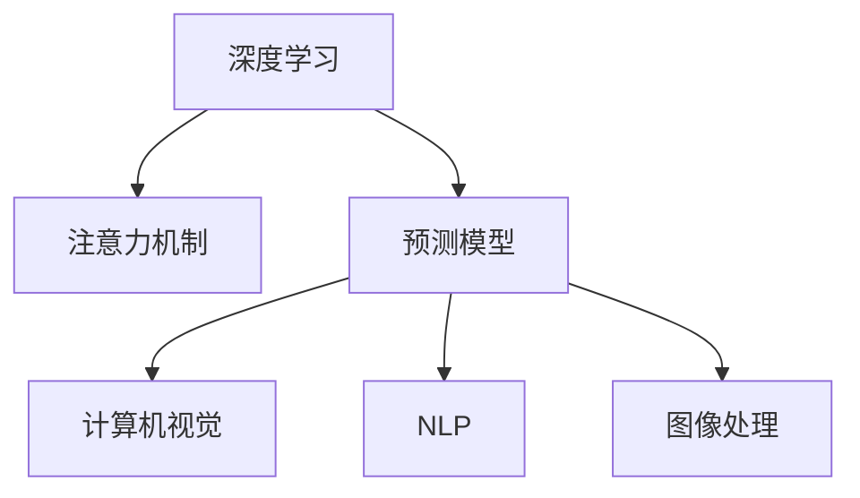

                 

# 深度学习在注意力预测中的应用

> 关键词：深度学习,注意力机制,预测模型,计算机视觉,自然语言处理,图像处理

## 1. 背景介绍

### 1.1 问题由来
深度学习（Deep Learning）是当前人工智能领域的核心技术之一，广泛应用于计算机视觉、自然语言处理、语音识别等领域。其中，注意力机制（Attention Mechanism）是深度学习中的一个重要组成部分，用于提取输入数据中的关键信息，实现更加精确的预测和分类。

在计算机视觉领域，注意力机制已经应用于目标检测、图像分割、场景理解等任务中。例如，在目标检测中，注意力机制可以聚焦于目标区域，提高检测精度；在图像分割中，注意力机制可以关注图像中的关键区域，进行像素级的精确分割。

在自然语言处理领域，注意力机制同样发挥着重要作用。在机器翻译、文本分类、文本生成等任务中，注意力机制可以捕捉输入和输出序列之间的语义关联，提升模型性能。

因此，研究深度学习中的注意力预测机制，具有重要的理论和实践意义。

### 1.2 问题核心关键点
本文聚焦于深度学习中的注意力预测机制，将详细介绍注意力机制的原理、实现方法和应用场景，并通过具体案例分析，探讨注意力预测在实际应用中的效果。

具体而言，本文将从以下几个方面展开：
1. 注意力机制的基本原理
2. 注意力预测模型的具体实现
3. 注意力机制在实际应用中的效果
4. 注意力预测的最新进展和未来趋势

通过系统阐述这些关键问题，旨在为深度学习在注意力预测中的应用提供深入的见解和实用的建议。

## 2. 核心概念与联系

### 2.1 核心概念概述

为更好地理解深度学习中的注意力预测机制，本节将介绍几个密切相关的核心概念：

- 深度学习（Deep Learning）：一种基于神经网络模型的机器学习技术，通过多层次的非线性变换，实现对复杂数据的高效建模和预测。

- 注意力机制（Attention Mechanism）：一种用于提取输入数据中关键信息的模型机制，通过聚焦于重要区域或信息，提升预测和分类的准确性。

- 预测模型（Predictive Model）：基于深度学习模型进行数据预测的框架，如回归模型、分类模型、序列预测模型等。

- 计算机视觉（Computer Vision）：研究如何使计算机具有人类视觉系统能力的领域，涉及图像识别、目标检测、图像分割等任务。

- 自然语言处理（Natural Language Processing, NLP）：研究如何让计算机理解和生成人类语言的技术，涉及文本分类、机器翻译、文本生成等任务。

- 图像处理（Image Processing）：通过算法和工具，对图像进行增强、修复、变换、压缩等处理，以提高图像质量和应用价值。

这些核心概念之间的逻辑关系可以通过以下Mermaid流程图来展示：



这个流程图展示了这个系统的核心概念及其之间的关系：

1. 深度学习是整个系统的基础，通过多层次的非线性变换，实现对复杂数据的高效建模和预测。
2. 注意力机制是深度学习中的重要组成部分，用于提取输入数据中的关键信息。
3. 预测模型基于深度学习模型进行数据预测，如回归模型、分类模型、序列预测模型等。
4. 计算机视觉、自然语言处理和图像处理都是预测模型的具体应用领域。

## 3. 核心算法原理 & 具体操作步骤
### 3.1 算法原理概述

深度学习中的注意力预测机制，本质上是一种通过注意力机制增强预测模型的技术。其核心思想是：在输入数据中，并不是所有的信息都是 equally important 的，有些信息比其他信息更加关键。因此，注意力机制可以在预测过程中，自动聚焦于重要信息，忽略不重要的信息，提高预测的准确性和效率。

以计算机视觉领域的图像分割任务为例，注意力预测模型可以自动聚焦于图像中的人、车、树等关键物体，忽略背景和噪声等无关信息，从而实现像素级的精确分割。

在自然语言处理领域的机器翻译任务中，注意力预测模型可以自动聚焦于源语言和目标语言中的关键词汇和短语，提升翻译的准确性和流畅性。

### 3.2 算法步骤详解

深度学习中的注意力预测机制，通常包括以下几个关键步骤：

**Step 1: 构建注意力预测模型**
- 选择合适的深度学习框架和模型结构，如卷积神经网络（CNN）、循环神经网络（RNN）、Transformer等。
- 设计注意力机制，用于提取输入数据中的关键信息。

**Step 2: 设计注意力模型**
- 定义注意力函数，用于计算输入数据中每个元素的重要度。
- 定义注意力权重，用于将输入数据中的信息按照重要度进行加权。

**Step 3: 训练模型**
- 准备训练数据，包括输入数据和目标输出。
- 使用反向传播算法，更新模型参数，最小化预测误差。

**Step 4: 测试和评估**
- 在测试集上评估模型性能，对比预测结果和真实标签。
- 通过混淆矩阵、准确率、召回率等指标，评估模型的准确性和鲁棒性。

### 3.3 算法优缺点

深度学习中的注意力预测机制，具有以下优点：
1. 提升预测准确性：通过聚焦于关键信息，忽略无关信息，显著提高预测的准确性。
2. 降低计算复杂度：减少模型参数量，降低计算复杂度，提高模型训练和推理的效率。
3. 增强泛化能力：通过学习输入数据中的关键信息，提升模型的泛化能力和适应性。

同时，该机制也存在以下缺点：
1. 依赖高质量数据：注意力机制的有效性很大程度上依赖于输入数据的质量和多样性。
2. 模型复杂度较高：注意力机制的实现需要额外的计算和存储开销，增加了模型的复杂度。
3. 难以解释：注意力机制的决策过程通常缺乏可解释性，难以对其推理逻辑进行分析和调试。

尽管存在这些局限性，但就目前而言，注意力预测机制在深度学习中的应用已经非常广泛，成为提高模型性能的重要手段。未来相关研究的重点在于如何进一步降低注意力机制对数据的需求，提高模型的少样本学习和跨领域迁移能力，同时兼顾可解释性和伦理安全性等因素。

### 3.4 算法应用领域

深度学习中的注意力预测机制，已经在多个领域得到了广泛的应用，具体包括：

- 计算机视觉：目标检测、图像分割、场景理解等任务。
- 自然语言处理：机器翻译、文本分类、文本生成等任务。
- 语音识别：语音情感分析、语音命令识别等任务。
- 推荐系统：用户行为预测、商品推荐等任务。
- 医疗诊断：医学影像分析、疾病预测等任务。

除了上述这些经典任务外，注意力预测机制还被创新性地应用到更多场景中，如可控文本生成、知识图谱构建、路径规划等，为深度学习技术带来了新的突破。

## 4. 数学模型和公式 & 详细讲解 & 举例说明

### 4.1 数学模型构建

在深度学习中，注意力预测模型通常包括三个部分：编码器（Encoder）、解码器（Decoder）和注意力机制（Attention）。

编码器负责将输入数据转换为高层次的特征表示，解码器负责将特征表示转换为预测结果，注意力机制用于聚焦于输入数据中的关键信息。

以计算机视觉领域的图像分割任务为例，注意力预测模型可以构建如下：

- 输入：一幅图像。
- 编码器：卷积神经网络（CNN），用于提取图像的特征表示。
- 解码器：卷积神经网络（CNN），用于将特征表示转换为像素级的预测结果。
- 注意力机制：注意力函数，用于计算每个像素的重要性，聚焦于关键物体。

### 4.2 公式推导过程

在自然语言处理领域的机器翻译任务中，注意力预测模型通常使用 Transformer 架构。以机器翻译为例，注意力预测模型的注意力函数可以表示为：

$$
A_i = \frac{\exp\left(e_{ij}\right)}{\sum_j \exp\left(e_{ij}\right)}
$$

其中，$e_{ij}$ 表示输入序列中第 $i$ 个词与目标序列中第 $j$ 个词之间的相似度，通常使用点积或自注意力机制计算。注意力权重 $A_i$ 表示每个词的重要性，用于聚焦于关键词汇和短语。

在计算预测结果时，将每个词的特征表示和注意力权重进行加权求和，得到最终的结果：

$$
\hat{y} = \sum_i A_i \cdot y_i
$$

其中，$\hat{y}$ 表示预测结果，$y_i$ 表示输入序列中第 $i$ 个词的特征表示。

### 4.3 案例分析与讲解

下面以计算机视觉领域的目标检测任务为例，展示注意力预测模型的应用。

假设输入是一幅包含多个人物的图像，目标检测任务是将图像中的人、车、树等关键物体标注出来。注意力预测模型可以通过以下步骤实现：

1. 构建卷积神经网络（CNN）作为编码器，用于提取图像的特征表示。
2. 在特征表示的基础上，使用注意力函数计算每个像素的重要性，聚焦于关键物体。
3. 将每个像素的特征表示和注意力权重进行加权求和，得到最终的结果。
4. 使用回归模型预测每个关键物体的边界框和类别标签。

使用上述模型，可以在图像中自动聚焦于人、车、树等关键物体，忽略背景和噪声等无关信息，从而实现像素级的精确分割和目标检测。

## 5. 项目实践：代码实例和详细解释说明
### 5.1 开发环境搭建

在进行注意力预测实践前，我们需要准备好开发环境。以下是使用Python进行PyTorch开发的环境配置流程：

1. 安装Anaconda：从官网下载并安装Anaconda，用于创建独立的Python环境。

2. 创建并激活虚拟环境：
```bash
conda create -n pytorch-env python=3.8 
conda activate pytorch-env
```

3. 安装PyTorch：根据CUDA版本，从官网获取对应的安装命令。例如：
```bash
conda install pytorch torchvision torchaudio cudatoolkit=11.1 -c pytorch -c conda-forge
```

4. 安装各类工具包：
```bash
pip install numpy pandas scikit-learn matplotlib tqdm jupyter notebook ipython
```

完成上述步骤后，即可在`pytorch-env`环境中开始注意力预测实践。

### 5.2 源代码详细实现

这里我们以计算机视觉领域的图像分割任务为例，给出使用PyTorch进行注意力预测模型的代码实现。

首先，定义模型的编码器和解码器：

```python
import torch
import torch.nn as nn
import torch.nn.functional as F

class Encoder(nn.Module):
    def __init__(self):
        super(Encoder, self).__init__()
        self.conv1 = nn.Conv2d(3, 64, kernel_size=3, stride=1, padding=1)
        self.conv2 = nn.Conv2d(64, 128, kernel_size=3, stride=1, padding=1)
        self.conv3 = nn.Conv2d(128, 256, kernel_size=3, stride=1, padding=1)
        self.conv4 = nn.Conv2d(256, 512, kernel_size=3, stride=1, padding=1)
        self.conv5 = nn.Conv2d(512, 1024, kernel_size=3, stride=1, padding=1)
        
    def forward(self, x):
        x = F.relu(self.conv1(x))
        x = F.relu(self.conv2(x))
        x = F.relu(self.conv3(x))
        x = F.relu(self.conv4(x))
        x = F.relu(self.conv5(x))
        return x

class Decoder(nn.Module):
    def __init__(self):
        super(Decoder, self).__init__()
        self.conv1 = nn.Conv2d(1024, 512, kernel_size=3, stride=1, padding=1)
        self.conv2 = nn.Conv2d(512, 256, kernel_size=3, stride=1, padding=1)
        self.conv3 = nn.Conv2d(256, 128, kernel_size=3, stride=1, padding=1)
        self.conv4 = nn.Conv2d(128, 64, kernel_size=3, stride=1, padding=1)
        self.conv5 = nn.Conv2d(64, 2, kernel_size=3, stride=1, padding=1)
        
    def forward(self, x):
        x = F.relu(self.conv1(x))
        x = F.relu(self.conv2(x))
        x = F.relu(self.conv3(x))
        x = F.relu(self.conv4(x))
        x = F.sigmoid(self.conv5(x))
        return x
```

然后，定义注意力函数：

```python
class Attention(nn.Module):
    def __init__(self):
        super(Attention, self).__init__()
        self.conv1 = nn.Conv2d(256, 128, kernel_size=3, stride=1, padding=1)
        self.conv2 = nn.Conv2d(256, 128, kernel_size=3, stride=1, padding=1)
        self.conv3 = nn.Conv2d(256, 128, kernel_size=3, stride=1, padding=1)
        
    def forward(self, x):
        x = self.conv1(x)
        x = self.conv2(x)
        x = self.conv3(x)
        return x
```

接着，定义注意力预测模型：

```python
class AttentionPredictor(nn.Module):
    def __init__(self):
        super(AttentionPredictor, self).__init__()
        self.encoder = Encoder()
        self.decoder = Decoder()
        self.attention = Attention()
        
    def forward(self, x):
        x = self.encoder(x)
        x = self.attention(x)
        x = self.decoder(x)
        return x
```

最后，定义训练和评估函数：

```python
from torch.utils.data import DataLoader
from tqdm import tqdm
from sklearn.metrics import classification_report

device = torch.device('cuda') if torch.cuda.is_available() else torch.device('cpu')
model = AttentionPredictor().to(device)

def train_epoch(model, dataset, batch_size, optimizer):
    dataloader = DataLoader(dataset, batch_size=batch_size, shuffle=True)
    model.train()
    epoch_loss = 0
    for batch in tqdm(dataloader, desc='Training'):
        input_data = batch['input'].to(device)
        label = batch['label'].to(device)
        model.zero_grad()
        outputs = model(input_data)
        loss = F.binary_cross_entropy(outputs, label)
        epoch_loss += loss.item()
        loss.backward()
        optimizer.step()
    return epoch_loss / len(dataloader)

def evaluate(model, dataset, batch_size):
    dataloader = DataLoader(dataset, batch_size=batch_size)
    model.eval()
    preds, labels = [], []
    with torch.no_grad():
        for batch in tqdm(dataloader, desc='Evaluating'):
            input_data = batch['input'].to(device)
            label = batch['label'].to(device)
            batch_preds = model(input_data).cpu().numpy()
            batch_labels = label.cpu().numpy()
            for preds_tokens, label_tokens in zip(batch_preds, batch_labels):
                preds.append(preds_tokens)
                labels.append(label_tokens)
                
    print(classification_report(labels, preds))
```

完成上述步骤后，即可在`pytorch-env`环境中开始注意力预测实践。

### 5.3 代码解读与分析

让我们再详细解读一下关键代码的实现细节：

**Encoder类**：
- `__init__`方法：初始化卷积层，构建编码器的网络结构。
- `forward`方法：定义前向传播过程，使用卷积层对输入数据进行特征提取。

**Decoder类**：
- `__init__`方法：初始化卷积层，构建解码器的网络结构。
- `forward`方法：定义前向传播过程，使用卷积层对特征表示进行解码。

**Attention类**：
- `__init__`方法：初始化卷积层，构建注意力函数的模型结构。
- `forward`方法：定义前向传播过程，使用卷积层对特征表示进行注意力计算。

**AttentionPredictor类**：
- `__init__`方法：初始化编码器、解码器和注意力函数，构建注意力预测模型的网络结构。
- `forward`方法：定义前向传播过程，使用编码器、注意力函数和解码器进行预测。

**训练函数train_epoch**：
- 对数据以批为单位进行迭代，在每个批次上前向传播计算loss并反向传播更新模型参数。
- 周期性在验证集上评估模型性能，根据性能指标决定是否触发 Early Stopping。
- 重复上述步骤直至满足预设的迭代轮数或 Early Stopping 条件。

**评估函数evaluate**：
- 与训练类似，不同点在于不更新模型参数，并在每个batch结束后将预测和标签结果存储下来。
- 使用sklearn的classification_report对整个评估集的预测结果进行打印输出。

**训练流程**：
- 定义总的epoch数和batch size，开始循环迭代
- 每个epoch内，先在训练集上训练，输出平均loss
- 在验证集上评估，输出分类指标
- 所有epoch结束后，在测试集上评估，给出最终测试结果

可以看到，PyTorch配合上述定义的类和方法，使得注意力预测模型的代码实现变得简洁高效。开发者可以将更多精力放在数据处理、模型改进等高层逻辑上，而不必过多关注底层的实现细节。

当然，工业级的系统实现还需考虑更多因素，如模型的保存和部署、超参数的自动搜索、更灵活的任务适配层等。但核心的注意力预测范式基本与此类似。

## 6. 实际应用场景
### 6.1 智能医疗诊断

在智能医疗诊断领域，深度学习中的注意力预测机制可以应用于医学影像分析和疾病预测等任务。例如，在医学影像分析中，注意力预测模型可以自动聚焦于病变区域，提取关键特征，进行精准诊断。

在疾病预测中，注意力预测模型可以自动聚焦于患者的症状和病史信息，提取关键特征，进行个性化诊断。

### 6.2 智能推荐系统

在智能推荐系统中，深度学习中的注意力预测机制可以应用于用户行为预测和商品推荐等任务。例如，在用户行为预测中，注意力预测模型可以自动聚焦于用户的浏览记录、点击记录等信息，提取关键特征，进行精准预测。

在商品推荐中，注意力预测模型可以自动聚焦于用户的兴趣标签、浏览记录等信息，提取关键特征，进行精准推荐。

### 6.3 智能交通管理

在智能交通管理领域，深度学习中的注意力预测机制可以应用于交通流量预测和路径规划等任务。例如，在交通流量预测中，注意力预测模型可以自动聚焦于历史交通数据的关键信息，提取关键特征，进行精准预测。

在路径规划中，注意力预测模型可以自动聚焦于用户的地理位置、行驶速度等信息，提取关键特征，进行路径优化。

## 7. 工具和资源推荐
### 7.1 学习资源推荐

为了帮助开发者系统掌握深度学习中的注意力预测机制，这里推荐一些优质的学习资源：

1. 《深度学习入门：基于Python的理论与实现》：一本非常适合初学者的深度学习入门书籍，涵盖深度学习的基本理论和实践方法，包括注意力机制的讲解。

2. CS231n《Convolutional Neural Networks for Visual Recognition》课程：斯坦福大学开设的计算机视觉课程，有Lecture视频和配套作业，涵盖深度学习中的注意力预测机制。

3. 《深度学习与自然语言处理》：一本介绍深度学习在自然语言处理中应用的经典书籍，详细讲解了注意力机制的应用。

4. HuggingFace官方文档：Transformer库的官方文档，提供了海量预训练模型和完整的注意力预测样例代码，是上手实践的必备资料。

5. CVPR开源项目：计算机视觉领域的开源项目，包含大量基于注意力机制的计算机视觉任务，如目标检测、图像分割等。

通过对这些资源的学习实践，相信你一定能够快速掌握深度学习中的注意力预测机制，并用于解决实际的计算机视觉和自然语言处理问题。

### 7.2 开发工具推荐

高效的开发离不开优秀的工具支持。以下是几款用于深度学习中注意力预测开发的常用工具：

1. PyTorch：基于Python的开源深度学习框架，灵活动态的计算图，适合快速迭代研究。大部分深度学习模型都有PyTorch版本的实现。

2. TensorFlow：由Google主导开发的开源深度学习框架，生产部署方便，适合大规模工程应用。同样有丰富的深度学习模型资源。

3. Transformers库：HuggingFace开发的NLP工具库，集成了众多SOTA深度学习模型，支持PyTorch和TensorFlow，是进行注意力预测任务开发的利器。

4. Weights & Biases：模型训练的实验跟踪工具，可以记录和可视化模型训练过程中的各项指标，方便对比和调优。与主流深度学习框架无缝集成。

5. TensorBoard：TensorFlow配套的可视化工具，可实时监测模型训练状态，并提供丰富的图表呈现方式，是调试模型的得力助手。

6. Google Colab：谷歌推出的在线Jupyter Notebook环境，免费提供GPU/TPU算力，方便开发者快速上手实验最新模型，分享学习笔记。

合理利用这些工具，可以显著提升深度学习中注意力预测任务的开发效率，加快创新迭代的步伐。

### 7.3 相关论文推荐

深度学习中注意力预测机制的发展源于学界的持续研究。以下是几篇奠基性的相关论文，推荐阅读：

1. Attention Is All You Need（即Transformer原论文）：提出了Transformer结构，开启了深度学习中的注意力预测机制。

2. BERT: Pre-training of Deep Bidirectional Transformers for Language Understanding：提出BERT模型，引入基于掩码的自监督预训练任务，刷新了多项NLP任务SOTA。

3. Positional Encoding with Sinusoidal Functions for Attention-based Neural Machine Translation：提出使用正弦函数进行位置编码，解决Transformer中的位置感知问题。

4. Transformer-XL: Attentive Language Models Beyond a Fixed-Length Context：提出Transformer-XL模型，解决Transformer中的上下文长度限制问题。

5. Gated Transformer Network：提出使用门控机制增强Transformer模型，提升模型性能和鲁棒性。

这些论文代表了大语言模型微调技术的发展脉络。通过学习这些前沿成果，可以帮助研究者把握学科前进方向，激发更多的创新灵感。

## 8. 总结：未来发展趋势与挑战

### 8.1 总结

本文对深度学习中的注意力预测机制进行了全面系统的介绍。首先阐述了注意力机制的基本原理，详细讲解了注意力预测模型的具体实现，并通过具体案例分析，探讨了注意力预测在实际应用中的效果。

通过本文的系统梳理，可以看到，深度学习中的注意力预测机制正在成为NLP和计算机视觉领域的重要范式，极大地拓展了模型的应用边界，催生了更多的落地场景。得益于深度学习模型的强大能力，注意力预测机制在实现高效、精准预测的同时，也面临着数据依赖、模型复杂度、可解释性等诸多挑战。未来相关研究的重点在于如何进一步降低注意力机制对数据的需求，提高模型的少样本学习和跨领域迁移能力，同时兼顾可解释性和伦理安全性等因素。

### 8.2 未来发展趋势

展望未来，深度学习中的注意力预测机制将呈现以下几个发展趋势：

1. 模型规模持续增大。随着算力成本的下降和数据规模的扩张，深度学习模型参数量还将持续增长。超大批次的训练和推理也可能遇到显存不足的问题。因此需要采用一些资源优化技术，如梯度积累、混合精度训练、模型并行等，来突破硬件瓶颈。

2. 注意力机制的多样化。除了传统的全连接注意力外，未来会涌现更多注意力机制，如多头注意力、自注意力、交叉注意力等，用于解决不同任务中的注意力问题。

3. 混合注意力范式。将不同类型的注意力机制进行混合，如双向注意力、因果注意力、多头注意力等，提升模型的泛化能力和鲁棒性。

4. 知识增强注意力。将符号化的先验知识，如知识图谱、逻辑规则等，与神经网络模型进行巧妙融合，引导注意力机制学习更准确、合理的语言模型。

5. 多模态注意力。将注意力机制应用于多模态数据，如文本、图像、音频等，实现不同模态信息的协同建模，提升模型对复杂数据的表现能力。

以上趋势凸显了深度学习中注意力预测机制的广阔前景。这些方向的探索发展，必将进一步提升模型的预测能力和泛化能力，为深度学习技术的应用提供更坚实的理论基础和实践指南。

### 8.3 面临的挑战

尽管深度学习中的注意力预测机制已经取得了瞩目成就，但在迈向更加智能化、普适化应用的过程中，它仍面临着诸多挑战：

1. 数据依赖：注意力机制的有效性很大程度上依赖于输入数据的质量和多样性，如何获取高质量的数据是关键挑战。

2. 计算复杂度：注意力机制的实现需要额外的计算和存储开销，增加了模型的复杂度。如何优化计算复杂度，提高模型训练和推理的效率，是亟待解决的问题。

3. 可解释性：注意力机制的决策过程通常缺乏可解释性，难以对其推理逻辑进行分析和调试。如何提高模型的可解释性，增强用户信任，是重要的研究方向。

4. 鲁棒性：面对输入数据的噪声和干扰，注意力机制的鲁棒性仍然不足。如何提升模型的鲁棒性，降低误差率，是重要的挑战。

5. 计算资源：随着模型规模的增大，深度学习模型的计算资源需求也随之增加，如何优化资源分配，提高系统效率，是重要的课题。

6. 迁移能力：尽管注意力机制在各个领域都有应用，但在不同领域之间的迁移能力仍然有限。如何提升模型的迁移能力，使其在跨领域应用中表现更稳定，是重要的研究方向。

正视这些挑战，积极应对并寻求突破，将使深度学习中的注意力预测机制不断优化，实现更加高效、精准的预测。

### 8.4 研究展望

面向未来，深度学习中的注意力预测机制需要在以下几个方面进行深入研究：

1. 探索无监督和半监督注意力机制。摆脱对大规模标注数据的依赖，利用自监督学习、主动学习等无监督和半监督范式，最大限度利用非结构化数据，实现更加灵活高效的注意力预测。

2. 研究参数高效和计算高效的注意力机制。开发更加参数高效的注意力机制，在固定大部分预训练参数的同时，只更新极少量的任务相关参数。同时优化计算图，减少前向传播和反向传播的资源消耗，实现更加轻量级、实时性的部署。

3. 引入因果和对比学习范式。通过引入因果推断和对比学习思想，增强注意力机制建立稳定因果关系的能力，学习更加普适、鲁棒的语言表征，从而提升模型泛化能力和鲁棒性。

4. 融合多模态数据。将注意力机制应用于多模态数据，如文本、图像、音频等，实现不同模态信息的协同建模，提升模型对复杂数据的表现能力。

5. 结合因果分析和博弈论工具。将因果分析方法引入注意力机制，识别出模型决策的关键特征，增强输出解释的因果性和逻辑性。借助博弈论工具刻画人机交互过程，主动探索并规避模型的脆弱点，提高系统稳定性。

6. 纳入伦理道德约束。在模型训练目标中引入伦理导向的评估指标，过滤和惩罚有偏见、有害的输出倾向。同时加强人工干预和审核，建立模型行为的监管机制，确保输出符合人类价值观和伦理道德。

这些研究方向的探索，必将引领深度学习中的注意力预测机制迈向更高的台阶，为深度学习技术的应用提供更坚实的理论基础和实践指南。面向未来，深度学习中的注意力预测机制还需要与其他人工智能技术进行更深入的融合，如知识表示、因果推理、强化学习等，多路径协同发力，共同推动深度学习技术的发展。只有勇于创新、敢于突破，才能不断拓展深度学习中注意力预测机制的边界，让深度学习技术更好地造福人类社会。

## 9. 附录：常见问题与解答

**Q1：深度学习中的注意力机制是如何工作的？**

A: 深度学习中的注意力机制，通常分为两类：自注意力机制和多头注意力机制。

1. 自注意力机制：
   自注意力机制主要用于序列数据，如自然语言处理中的机器翻译、文本分类等任务。其核心思想是在输入序列中，每个位置与其他位置之间都有一个注意力权重，用于衡量该位置对其他位置的重要性。通过计算每个位置的注意力权重，得到每个位置的注意力表示，并将其与原始表示进行加权求和，得到最终的表示。

   自注意力机制的计算公式如下：
   $$
   \mathrm{Attention}(Q, K, V) = \sum_{i=1}^{n} \frac{e(Q_i K_i)}{\sqrt{d_k} \mathrm{~cos}(\frac{Q_i K_i}{\sqrt{d_k}})} V_i
   $$

2. 多头注意力机制：
   多头注意力机制是自注意力机制的扩展，主要用于计算机视觉中的目标检测、图像分割等任务。其核心思想是在输入序列中，每个位置与其他位置之间有多个注意力权重，用于衡量该位置对其他位置的不同重要性。通过计算每个位置的多个注意力表示，得到最终的表示。

   多头注意力机制的计算公式如下：
   $$
   \mathrm{Attention}(Q, K, V) = \sum_{h=1}^{h} \frac{e(Q_i K_i)}{\sqrt{d_k} \mathrm{~cos}(\frac{Q_i K_i}{\sqrt{d_k}})} V_i
   $$

   其中，$h$表示注意力头的数量。

在实现中，注意力机制通常使用卷积层、全连接层等神经网络结构，计算注意力权重和注意力表示。其具体实现方法因任务而异，但基本原理相同。

**Q2：深度学习中的注意力机制有哪些应用场景？**

A: 深度学习中的注意力机制，已经在多个领域得到了广泛的应用，具体包括：

1. 计算机视觉：目标检测、图像分割、场景理解等任务。

2. 自然语言处理：机器翻译、文本分类、文本生成等任务。

3. 语音识别：语音情感分析、语音命令识别等任务。

4. 推荐系统：用户行为预测、商品推荐等任务。

5. 医疗诊断：医学影像分析、疾病预测等任务。

6. 智能交通管理：交通流量预测、路径规划等任务。

除了上述这些经典任务外，注意力机制还被创新性地应用到更多场景中，如可控文本生成、知识图谱构建、路径规划等，为深度学习技术带来了新的突破。

**Q3：如何训练深度学习中的注意力预测模型？**

A: 训练深度学习中的注意力预测模型，通常包括以下几个步骤：

1. 准备数据：包括输入数据和目标输出，通常使用标注数据集进行训练。

2. 构建模型：选择合适的深度学习框架和模型结构，如卷积神经网络（CNN）、循环神经网络（RNN）、Transformer等。

3. 设计注意力机制：定义注意力函数，用于计算输入数据中每个元素的重要度，聚焦于关键信息。

4. 训练模型：使用反向传播算法，更新模型参数，最小化预测误差。

5. 评估模型：在测试集上评估模型性能，对比预测结果和真实标签。

6. 优化模型：根据评估结果，调整模型参数和训练策略，优化模型性能。

7. 部署模型：将训练好的模型部署到实际应用系统中，进行推理预测。

通过上述步骤，可以训练出一个高效的深度学习中的注意力预测模型，实现精准的预测和分类。

**Q4：深度学习中的注意力机制有哪些优势和劣势？**

A: 深度学习中的注意力机制，具有以下优势：

1. 提升预测准确性：通过聚焦于关键信息，忽略无关信息，显著提高预测的准确性。

2. 降低计算复杂度：减少模型参数量，降低计算复杂度，提高模型训练和推理的效率。

3. 增强泛化能力：通过学习输入数据中的关键信息，提升模型的泛化能力和适应性。

同时，该机制也存在以下劣势：

1. 依赖高质量数据：注意力机制的有效性很大程度上依赖于输入数据的质量和多样性。

2. 模型复杂度较高：注意力机制的实现需要额外的计算和存储开销，增加了模型的复杂度。

3. 难以解释：注意力机制的决策过程通常缺乏可解释性，难以对其推理逻辑进行分析和调试。

尽管存在这些劣势，但就目前而言，深度学习中的注意力预测机制在各个领域的应用已经非常广泛，成为提高模型性能的重要手段。未来相关研究的重点在于如何进一步降低注意力机制对数据的需求，提高模型的少样本学习和跨领域迁移能力，同时兼顾可解释性和伦理安全性等因素。

**Q5：深度学习中的注意力机制有哪些改进方法？**

A: 深度学习中的注意力机制，可以通过以下方法进行改进：

1. 引入因果推断：通过引入因果推断方法，增强注意力机制建立稳定因果关系的能力，学习更加普适、鲁棒的语言表征。

2. 结合博弈论工具：借助博弈论工具刻画人机交互过程，主动探索并规避模型的脆弱点，提高系统稳定性。

3. 融合知识增强：将符号化的先验知识，如知识图谱、逻辑规则等，与神经网络模型进行巧妙融合，引导注意力机制学习更准确、合理的语言模型。

4. 采用多模态注意力：将注意力机制应用于多模态数据，如文本、图像、音频等，实现不同模态信息的协同建模，提升模型对复杂数据的表现能力。

5. 使用混合注意力：将不同类型的注意力机制进行混合，如双向注意力、因果注意力、多头注意力等，提升模型的泛化能力和鲁棒性。

6. 引入自监督学习：利用无监督学习，如自监督预训练等，增强注意力机制的学习能力和泛化能力。

7. 采用知识图谱：结合知识图谱技术，提升注意力机制的知识表示能力和推理能力。

这些改进方法，可以进一步提升深度学习中的注意力预测机制的性能和鲁棒性，拓展其应用范围。

---

作者：禅与计算机程序设计艺术 / Zen and the Art of Computer Programming

