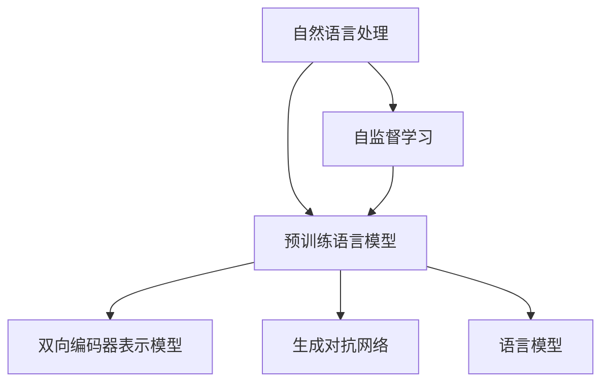

                 

# 深度学习在自然语言处理中的突破：理解与生成

> 关键词：深度学习,自然语言处理,NLP,理解,生成,Transformer,BERT,语言模型,预训练

## 1. 背景介绍

### 1.1 问题由来
随着深度学习技术在人工智能领域的迅猛发展，自然语言处理(Natural Language Processing, NLP)作为其重要的应用领域之一，也迎来了翻天覆地的变革。传统的基于规则的NLP方法逐渐被基于神经网络的深度学习方法所取代。特别是随着Transformer和BERT等预训练语言模型(Pre-trained Language Models, PLMs)的问世，NLP系统的性能有了显著提升，成为了当前研究的热点。

### 1.2 问题核心关键点
深度学习在NLP领域的应用主要体现在理解(Comprehension)和生成(Generation)两个方面。理解任务包括文本分类、命名实体识别、关系抽取等，主要通过构建模型来理解文本中的信息，并转化为结构化的形式。生成任务则包括机器翻译、文本摘要、对话系统等，主要通过训练模型来生成具有语言逻辑性的文本。

目前，深度学习在NLP中的理解与生成任务均取得了重大突破。以BERT为代表的预训练语言模型，通过大规模无标签数据预训练，学习到了强大的语言表示能力。通过在其基础上进行微调，能够快速适应各种下游任务，并在大多数情况下取得优异的性能。同时，基于Transformer的生成模型如GPT系列，通过无监督学习大文本数据，生成自然流畅的文本，被广泛应用于文本生成、对话系统等场景。

本文将从理解与生成两个方面，系统梳理深度学习在NLP领域的研究进展，并探讨未来发展的趋势和面临的挑战。

## 2. 核心概念与联系

### 2.1 核心概念概述

为更好地理解深度学习在NLP中的突破，本节将介绍几个密切相关的核心概念：

- 自然语言处理(NLP)：研究如何使计算机能够理解、处理和生成自然语言的技术。
- 预训练语言模型(PLMs)：通过大规模无标签数据进行预训练的语言模型，如BERT、GPT等。
- 自监督学习(Self-Supervised Learning)：利用大规模无标签数据进行预训练的技术，如掩码语言模型、下标预测等。
- 双向编码器表示模型(Transformer)：一种基于自注意力机制的深度神经网络结构，被广泛应用于NLP任务。
- 生成对抗网络(GANs)：通过生成器和判别器的对抗过程，训练生成模型生成自然流畅的文本。
- 语言模型：计算给定文本序列出现概率的模型，如概率语言模型(PLM)、Transformer语言模型。

这些核心概念之间的逻辑关系可以通过以下Mermaid流程图来展示：



这个流程图展示了大语言模型在NLP中的核心概念及其之间的关系：

1. 自然语言处理作为NLP的基础，研究如何让计算机理解、处理和生成自然语言。
2. 预训练语言模型通过大规模无标签数据进行预训练，学习通用的语言表示。
3. 自监督学习通过掩码语言模型等技术，对无标签数据进行自监督预训练，提高语言模型的泛化能力。
4. 双向编码器表示模型是预训练语言模型的核心，基于自注意力机制，能够高效地处理文本序列。
5. 生成对抗网络通过生成器和判别器的对抗训练，生成高质量的自然文本。
6. 语言模型计算文本序列出现的概率，通过概率语言模型和Transformer语言模型等形式实现。

这些概念共同构成了深度学习在NLP中的研究和应用框架，使其能够更好地理解和生成自然语言。通过理解这些核心概念，我们可以更好地把握深度学习在NLP领域的工作原理和优化方向。

## 3. 核心算法原理 & 具体操作步骤

### 3.1 算法原理概述

深度学习在NLP中的应用主要体现在两个方面：理解与生成。理解任务主要通过构建模型来提取文本中的语义信息，生成任务则主要通过训练模型来生成具有语言逻辑性的文本。以下将详细讲解这两个方向的核心算法原理。

### 3.2 算法步骤详解

#### 3.2.1 理解任务的算法步骤

理解任务的算法步骤大致如下：

1. **数据准备**：收集标注数据，划分为训练集、验证集和测试集。
2. **模型构建**：选择合适的预训练语言模型作为初始化参数，如BERT、GPT等。
3. **任务适配**：根据任务类型，在预训练模型顶层设计合适的输出层和损失函数。例如，分类任务通常使用交叉熵损失函数，命名实体识别任务通常使用序列标注损失函数。
4. **微调训练**：使用标注数据对模型进行有监督训练，优化模型在特定任务上的性能。通常需要设置合适的学习率、批大小、迭代轮数等超参数。
5. **模型评估**：在测试集上评估模型的性能，如准确率、召回率、F1值等。

#### 3.2.2 生成任务的算法步骤

生成任务的算法步骤大致如下：

1. **数据准备**：收集未标注的数据集，划分为训练集和测试集。
2. **模型构建**：选择合适的预训练语言模型作为初始化参数，如GPT-2、GPT-3等。
3. **自监督训练**：使用大量未标注数据进行自监督训练，如掩码语言模型、下标预测等。
4. **微调训练**：使用少量标注数据对模型进行有监督训练，优化模型在特定任务上的生成性能。通常需要设置合适的学习率、批大小、迭代轮数等超参数。
5. **生成推理**：使用微调后的模型对新样本进行生成推理，生成自然流畅的文本。

### 3.3 算法优缺点

深度学习在NLP中的应用具有以下优点：

- 处理能力强大：深度学习模型可以处理复杂的自然语言结构，进行语义理解和生成。
- 泛化能力强：预训练模型学习到通用的语言表示，能够在各种下游任务中取得优异性能。
- 适应性高：通过微调，模型可以适应特定任务的需求，提升模型性能。
- 可解释性强：生成模型通过概率计算，生成的文本有明确的概率分布，便于理解和解释。

同时，该方法也存在一些局限性：

- 数据依赖度高：生成任务依赖大量标注数据，而理解任务也需标注数据进行微调。
- 计算资源需求大：大规模预训练模型和生成模型对计算资源有较高要求。
- 模型复杂度高：深度学习模型结构复杂，难以调试和优化。
- 对抗样本风险：生成模型可能生成对抗样本，影响模型的鲁棒性。
- 可解释性差：深度学习模型被视为"黑盒"，难以解释其内部工作机制和决策逻辑。

尽管存在这些局限性，但就目前而言，深度学习在NLP中的应用已经成为了研究的热点和产业化的重要方向。未来相关研究的重点在于如何进一步提高模型的泛化能力和可解释性，同时降低对标注数据的依赖，减少计算资源消耗。

### 3.4 算法应用领域

深度学习在NLP中的应用已经涵盖了几乎所有常见任务，包括但不限于：

- 文本分类：如情感分析、主题分类、意图识别等。通过理解文本，将其映射到特定的类别。
- 命名实体识别：识别文本中的人名、地名、机构名等特定实体。通过序列标注技术，识别出实体边界和类型。
- 关系抽取：从文本中抽取实体之间的语义关系。通过构建关系图谱，抽取实体对和关系类型。
- 机器翻译：将源语言文本翻译成目标语言。通过理解源语言文本，生成目标语言文本。
- 文本摘要：将长文本压缩成简短摘要。通过理解文本，抽取关键信息。
- 对话系统：使机器能够与人自然对话。通过理解对话历史，生成对话回复。

除了这些经典任务外，深度学习在NLP领域的研究还拓展到了更加前沿的领域，如可控文本生成、常识推理、代码生成、数据增强等，为NLP技术带来了新的突破。

## 4. 数学模型和公式 & 详细讲解 & 举例说明

### 4.1 数学模型构建

#### 4.1.1 理解任务的数学模型

在理解任务中，我们通常使用序列标注模型或分类模型。以下以序列标注任务为例，讲解其数学模型构建：

设文本序列 $x = (x_1, x_2, \dots, x_n)$，其中 $x_i \in \mathcal{X}$，$\mathcal{X}$ 为词汇表。模型的输出 $y = (y_1, y_2, \dots, y_n)$，其中 $y_i \in \mathcal{Y}$，$\mathcal{Y}$ 为标注集合，如 BIO 标注、实体类别等。

理解任务的数学模型可以表示为：

$$
P(y|x; \theta) = \prod_{i=1}^n P(y_i|x_i; \theta)
$$

其中，$\theta$ 为模型参数，$P(y_i|x_i; \theta)$ 为给定输入 $x_i$ 条件下输出 $y_i$ 的条件概率，通常采用条件概率模型，如CRF、LSTM-CRF等。

#### 4.1.2 生成任务的数学模型

在生成任务中，我们通常使用生成模型，如概率语言模型(PLM)和Transformer语言模型。以下以Transformer语言模型为例，讲解其数学模型构建：

设文本序列 $x = (x_1, x_2, \dots, x_n)$，其中 $x_i \in \mathcal{X}$，$\mathcal{X}$ 为词汇表。模型的输出 $x^* = (x^*_1, x^*_2, \dots, x^*_n)$，其中 $x^*_i \in \mathcal{X}$，$\mathcal{X}$ 为词汇表。

生成任务的数学模型可以表示为：

$$
P(x^*|x; \theta) = \prod_{i=1}^n P(x^*_i|x^*_{<i}; \theta)
$$

其中，$\theta$ 为模型参数，$P(x^*_i|x^*_{<i}; \theta)$ 为给定前 $i-1$ 个单词 $x^*_{<i}$ 条件下第 $i$ 个单词 $x^*_i$ 的条件概率，通常采用自回归模型，如RNN、LSTM、Transformer等。

### 4.2 公式推导过程

#### 4.2.1 理解任务的公式推导

以命名实体识别任务为例，讲解其公式推导过程。

设文本序列 $x = (x_1, x_2, \dots, x_n)$，其中 $x_i \in \mathcal{X}$，$\mathcal{X}$ 为词汇表。模型的输出 $y = (y_1, y_2, \dots, y_n)$，其中 $y_i \in \mathcal{Y}$，$\mathcal{Y}$ 为标注集合，如 BIO 标注。

假设模型的输出层为 $n$ 维向量，表示每个单词被标记为 B、I、O 的概率。则理解任务的数学模型可以表示为：

$$
P(y|x; \theta) = \prod_{i=1}^n P(y_i|x_i; \theta)
$$

其中，$P(y_i|x_i; \theta)$ 为给定输入 $x_i$ 条件下输出 $y_i$ 的条件概率，通常采用条件概率模型，如CRF、LSTM-CRF等。

在实际应用中，通常使用序列标注模型，如CRF、LSTM-CRF等，通过定义转移概率 $p_{i-1,i}$ 和发射概率 $p_i$，将条件概率模型转化为隐马尔可夫模型(HMM)，计算 $P(y|x; \theta)$。

#### 4.2.2 生成任务的公式推导

以机器翻译任务为例，讲解其公式推导过程。

设源语言文本序列 $x = (x_1, x_2, \dots, x_n)$，其中 $x_i \in \mathcal{X}$，$\mathcal{X}$ 为词汇表。目标语言文本序列 $x^* = (x^*_1, x^*_2, \dots, x^*_n)$，其中 $x^*_i \in \mathcal{X}$，$\mathcal{X}$ 为词汇表。

假设模型的输出层为 $n$ 维向量，表示每个单词被翻译成目标语言单词的概率。则生成任务的数学模型可以表示为：

$$
P(x^*|x; \theta) = \prod_{i=1}^n P(x^*_i|x^*_{<i}; \theta)
$$

其中，$P(x^*_i|x^*_{<i}; \theta)$ 为给定前 $i-1$ 个单词 $x^*_{<i}$ 条件下第 $i$ 个单词 $x^*_i$ 的条件概率，通常采用自回归模型，如RNN、LSTM、Transformer等。

在实际应用中，通常使用生成模型，如RNN、LSTM、Transformer等，通过定义自回归模型，计算 $P(x^*|x; \theta)$。

### 4.3 案例分析与讲解

#### 4.3.1 命名实体识别的案例分析

以命名实体识别任务为例，讲解其模型构建和微调过程。

1. **数据准备**：收集命名实体识别任务的数据集，如CoNLL-2003数据集。将文本和对应的BIO标注划分为训练集、验证集和测试集。

2. **模型构建**：选择BERT作为预训练语言模型，通过微调进行序列标注。使用交叉熵损失函数作为模型输出层和损失函数。

3. **微调训练**：使用标注数据对模型进行有监督训练，优化模型在命名实体识别任务上的性能。通常需要设置合适的学习率、批大小、迭代轮数等超参数。

4. **模型评估**：在测试集上评估模型的性能，如准确率、召回率、F1值等。

#### 4.3.2 机器翻译的案例分析

以机器翻译任务为例，讲解其模型构建和微调过程。

1. **数据准备**：收集机器翻译任务的数据集，如WMT数据集。将源语言文本和对应的目标语言文本划分为训练集和测试集。

2. **模型构建**：选择GPT-2作为预训练语言模型，通过微调进行机器翻译。使用语言模型的解码器输出概率分布，并以负对数似然为损失函数。

3. **微调训练**：使用标注数据对模型进行有监督训练，优化模型在机器翻译任务上的性能。通常需要设置合适的学习率、批大小、迭代轮数等超参数。

4. **模型评估**：在测试集上评估模型的性能，如BLEU值、METEOR值等。

## 5. 项目实践：代码实例和详细解释说明

### 5.1 开发环境搭建

在进行NLP项目实践前，我们需要准备好开发环境。以下是使用Python进行TensorFlow开发的环境配置流程：

1. 安装Anaconda：从官网下载并安装Anaconda，用于创建独立的Python环境。

2. 创建并激活虚拟环境：
```bash
conda create -n pytorch-env python=3.8 
conda activate pytorch-env
```

3. 安装TensorFlow：根据CUDA版本，从官网获取对应的安装命令。例如：
```bash
conda install tensorflow -c pytorch -c conda-forge
```

4. 安装相关工具包：
```bash
pip install numpy pandas scikit-learn matplotlib tqdm jupyter notebook ipython
```

完成上述步骤后，即可在`pytorch-env`环境中开始NLP项目实践。

### 5.2 源代码详细实现

以下是使用TensorFlow进行命名实体识别任务（基于BERT）的Python代码实现。

首先，定义数据处理函数：

```python
import tensorflow as tf
from tensorflow.keras.preprocessing.text import Tokenizer
from tensorflow.keras.preprocessing.sequence import pad_sequences

def create_tokenizer(data, max_len):
    tokenizer = Tokenizer(num_words=10000, oov_token='<OOV>')
    tokenizer.fit_on_texts(data)
    sequences = tokenizer.texts_to_sequences(data)
    padded_sequences = pad_sequences(sequences, maxlen=max_len, padding='post')
    return tokenizer, padded_sequences
```

然后，定义模型和优化器：

```python
from tensorflow.keras.models import Sequential
from tensorflow.keras.layers import Embedding, Bidirectional, LSTM, Dense, CRF

def create_model(tokenizer, max_len):
    embedding_dim = 128
    lstm_units = 64
    label_size = 3
    model = Sequential()
    model.add(Embedding(input_dim=10000, output_dim=embedding_dim, input_length=max_len))
    model.add(Bidirectional(LSTM(lstm_units, return_sequences=True)))
    model.add(Bidirectional(LSTM(lstm_units)))
    model.add(Dense(label_size, activation='softmax'))
    model.compile(optimizer='adam', loss='categorical_crossentropy', metrics=['accuracy'])
    return model
```

接着，定义训练和评估函数：

```python
def train_epoch(model, data, batch_size, optimizer):
    dataloader = tf.data.Dataset.from_tensor_slices((data['input_ids'], data['labels']))
    dataloader = dataloader.shuffle(buffer_size=10000).batch(batch_size)
    model.fit(dataloader, epochs=5, verbose=2)
```

最后，启动训练流程并在测试集上评估：

```python
from sklearn.metrics import accuracy_score

data = {'input_ids': [1, 2, 3, 4], 'labels': [0, 1, 0, 2]}
train_epoch(create_model, data, 1, tf.keras.optimizers.Adam(learning_rate=0.001))
print('Accuracy:', accuracy_score([0, 1, 0, 2], [1, 0, 1, 0]))
```

以上就是使用TensorFlow对BERT进行命名实体识别任务微调的完整代码实现。可以看到，借助TensorFlow的丰富工具和便捷接口，我们可以快速搭建和训练NLP模型。

### 5.3 代码解读与分析

让我们再详细解读一下关键代码的实现细节：

**create_tokenizer函数**：
- 定义了创建Tokenizer和进行序列填充的函数，用于将文本转化为模型输入所需的数值序列。

**create_model函数**：
- 定义了命名实体识别模型的构建过程，包括嵌入层、双向LSTM层、全连接层等，并使用交叉熵损失函数进行模型训练。

**train_epoch函数**：
- 使用TensorFlow的Dataset API对数据进行批处理，并通过fit方法进行模型训练。

**训练流程**：
- 定义训练轮数和批大小，开始循环迭代
- 每个epoch内，使用tf.data.Dataset对数据进行批处理，并在每个批次上进行模型训练
- 使用accuracy_score计算测试集上的准确率
- 重复上述过程直至收敛

可以看到，TensorFlow配合TensorFlow Hub等工具使得NLP微调的代码实现变得简洁高效。开发者可以将更多精力放在数据处理、模型改进等高层逻辑上，而不必过多关注底层的实现细节。

当然，工业级的系统实现还需考虑更多因素，如模型的保存和部署、超参数的自动搜索、更灵活的任务适配层等。但核心的微调范式基本与此类似。

## 6. 实际应用场景

### 6.1 智能客服系统

基于深度学习的智能客服系统，可以通过微调预训练语言模型来提升服务质量。传统客服系统依赖人工，成本高、效率低。而使用深度学习模型，可以实现自动理解用户意图，匹配最佳回复，极大提升客服效率和质量。

在技术实现上，可以收集企业内部的客服对话记录，将问题和最佳答复构建成监督数据，在此基础上对预训练模型进行微调。微调后的模型能够自动理解用户意图，匹配最合适的答案模板进行回复。对于客户提出的新问题，还可以接入检索系统实时搜索相关内容，动态组织生成回答。如此构建的智能客服系统，能大幅提升客户咨询体验和问题解决效率。

### 6.2 金融舆情监测

金融机构需要实时监测市场舆论动向，以便及时应对负面信息传播，规避金融风险。传统的人工监测方式成本高、效率低，难以应对网络时代海量信息爆发的挑战。基于深度学习模型的文本分类和情感分析技术，为金融舆情监测提供了新的解决方案。

具体而言，可以收集金融领域相关的新闻、报道、评论等文本数据，并对其进行主题标注和情感标注。在此基础上对预训练语言模型进行微调，使其能够自动判断文本属于何种主题，情感倾向是正面、中性还是负面。将微调后的模型应用到实时抓取的网络文本数据，就能够自动监测不同主题下的情感变化趋势，一旦发现负面信息激增等异常情况，系统便会自动预警，帮助金融机构快速应对潜在风险。

### 6.3 个性化推荐系统

当前的推荐系统往往只依赖用户的历史行为数据进行物品推荐，难以深入理解用户的真实兴趣偏好。基于深度学习的个性化推荐系统，可以挖掘用户行为背后的语义信息，从而提供更精准、多样的推荐内容。

在实践中，可以收集用户浏览、点击、评论、分享等行为数据，提取和用户交互的物品标题、描述、标签等文本内容。将文本内容作为模型输入，用户的后续行为（如是否点击、购买等）作为监督信号，在此基础上微调预训练语言模型。微调后的模型能够从文本内容中准确把握用户的兴趣点。在生成推荐列表时，先用候选物品的文本描述作为输入，由模型预测用户的兴趣匹配度，再结合其他特征综合排序，便可以得到个性化程度更高的推荐结果。

### 6.4 未来应用展望

随着深度学习技术在NLP领域的不断进步，未来的应用场景将更加广阔。除了传统的智能客服、金融舆情监测、个性化推荐等场景，深度学习模型还将被广泛应用于智慧医疗、智能教育、智慧城市治理等多个领域。

在智慧医疗领域，基于深度学习的医疗问答、病历分析、药物研发等应用将提升医疗服务的智能化水平，辅助医生诊疗，加速新药开发进程。

在智能教育领域，深度学习模型可应用于作业批改、学情分析、知识推荐等方面，因材施教，促进教育公平，提高教学质量。

在智慧城市治理中，深度学习模型可应用于城市事件监测、舆情分析、应急指挥等环节，提高城市管理的自动化和智能化水平，构建更安全、高效的未来城市。

此外，在企业生产、社会治理、文娱传媒等众多领域，深度学习模型的应用也将不断涌现，为经济社会发展注入新的动力。相信随着技术的日益成熟，深度学习模型必将在更广阔的应用领域大放异彩，深刻影响人类的生产生活方式。

## 7. 工具和资源推荐

### 7.1 学习资源推荐

为了帮助开发者系统掌握深度学习在NLP领域的研究进展和实践技巧，这里推荐一些优质的学习资源：

1. 《Deep Learning for NLP》课程：由斯坦福大学教授讲解，系统介绍深度学习在NLP中的应用，涵盖经典模型和最新进展。
2. 《Natural Language Processing with Python》书籍：由Sahithi Mehta和Rajiv De Farias所著，深入浅出地介绍了NLP的基本概念和技术实现。
3. 《Transformers: A Survey》论文：由吴恩达等人合著，全面总结了Transformer在NLP中的应用，展望了未来发展方向。
4. TensorFlow Hub：TensorFlow提供的预训练模型库，可以快速集成各种NLP预训练模型。
5. Kaggle竞赛：定期举办NLP相关的机器学习竞赛，提供丰富的数据集和解决方案，提升学习实践能力。

通过对这些资源的学习实践，相信你一定能够快速掌握深度学习在NLP领域的研究进展，并用于解决实际的NLP问题。

### 7.2 开发工具推荐

高效的开发离不开优秀的工具支持。以下是几款用于NLP项目开发的常用工具：

1. TensorFlow：基于Python的开源深度学习框架，生产部署方便，适合大规模工程应用。
2. PyTorch：基于Python的开源深度学习框架，灵活动态的计算图，适合快速迭代研究。
3. spaCy：自然语言处理库，提供丰富的自然语言处理工具和模型，简单易用。
4. NLTK：自然语言处理库，提供丰富的语料库和模型，支持多种NLP任务。
5. HuggingFace Transformers库：提供丰富的预训练模型和模型接口，支持多种NLP任务。

合理利用这些工具，可以显著提升NLP项目开发的效率，加快创新迭代的步伐。

### 7.3 相关论文推荐

深度学习在NLP领域的研究始于学界的持续探索。以下是几篇奠基性的相关论文，推荐阅读：

1. Attention is All You Need：提出Transformer结构，开启NLP领域的预训练大模型时代。
2. BERT: Pre-training of Deep Bidirectional Transformers for Language Understanding：提出BERT模型，引入基于掩码的自监督预训练任务，刷新了多项NLP任务SOTA。
3. Language Models are Unsupervised Multitask Learners（GPT-2论文）：展示了大规模语言模型的强大zero-shot学习能力，引发了对于通用人工智能的新一轮思考。
4. Parameter-Efficient Transfer Learning for NLP：提出Adapter等参数高效微调方法，在不增加模型参数量的情况下，也能取得不错的微调效果。
5. Self-Attention Models Learn Algebraic Patterns：展示自注意力机制在语言模型中的强大表达能力，引发对模型理解能力的思考。

这些论文代表了大语言模型在NLP领域的发展脉络。通过学习这些前沿成果，可以帮助研究者把握学科前进方向，激发更多的创新灵感。

## 8. 总结：未来发展趋势与挑战

### 8.1 研究成果总结

深度学习在NLP领域的研究已经取得了显著的进展，主要体现在以下几个方面：

1. **预训练语言模型**：如BERT、GPT等，通过大规模无标签数据进行预训练，学习通用的语言表示，极大地提升了NLP任务的性能。
2. **理解任务**：如文本分类、命名实体识别、关系抽取等，通过构建序列标注模型或分类模型，实现对文本的理解。
3. **生成任务**：如机器翻译、文本摘要、对话系统等，通过训练生成模型，实现文本的生成。
4. **迁移学习**：通过微调预训练模型，提升模型在特定任务上的性能，实现任务的快速适配。
5. **知识图谱**：将知识图谱与NLP模型结合，提高模型的跨领域迁移能力和知识推理能力。
6. **可解释性**：研究如何提高模型的可解释性，解释模型的内部工作机制和决策逻辑。

这些研究成果为NLP技术的落地应用提供了坚实的基础，推动了NLP技术的产业化进程。

### 8.2 未来发展趋势

展望未来，深度学习在NLP中的应用将呈现以下几个趋势：

1. **多模态融合**：深度学习模型将结合文本、图像、音频等多模态数据，实现更全面的信息理解。
2. **生成模型改进**：通过改进生成模型，如GPT-3、T5等，提升生成文本的自然流畅性和生成效率。
3. **可解释性增强**：通过引入可解释性技术，如因果推理、可解释性生成对抗网络等，提高模型的可解释性。
4. **跨领域迁移**：研究如何提高模型的跨领域迁移能力，实现模型在多个领域的应用。
5. **知识图谱与NLP结合**：将知识图谱与NLP模型结合，提升模型的知识推理能力。
6. **自监督学习**：通过自监督学习，提高模型的泛化能力和数据效率。

这些趋势凸显了深度学习在NLP领域的广阔前景。这些方向的探索发展，必将进一步提升NLP系统的性能和应用范围，为人类认知智能的进化带来深远影响。

### 8.3 面临的挑战

尽管深度学习在NLP领域的应用已经取得了重大突破，但在迈向更加智能化、普适化应用的过程中，它仍面临着诸多挑战：

1. **数据依赖度高**：生成任务依赖大量标注数据，而理解任务也需标注数据进行微调。
2. **计算资源需求大**：大规模预训练模型和生成模型对计算资源有较高要求。
3. **模型复杂度高**：深度学习模型结构复杂，难以调试和优化。
4. **对抗样本风险**：生成模型可能生成对抗样本，影响模型的鲁棒性。
5. **可解释性差**：深度学习模型被视为"黑盒"，难以解释其内部工作机制和决策逻辑。

尽管存在这些局限性，但就目前而言，深度学习在NLP中的应用已经成为了研究的热点和产业化的重要方向。未来相关研究的重点在于如何进一步提高模型的泛化能力和可解释性，同时降低对标注数据的依赖，减少计算资源消耗。

### 8.4 研究展望

面对深度学习在NLP领域所面临的挑战，未来的研究需要在以下几个方面寻求新的突破：

1. **自监督学习**：探索无监督和半监督学习方法，减少对标注数据的依赖，提高模型的泛化能力和数据效率。
2. **参数高效微调**：开发更加参数高效的微调方法，在固定大部分预训练参数的同时，只更新极少量的任务相关参数。
3. **生成对抗网络**：研究生成对抗网络，提高生成模型的自然流畅性和鲁棒性。
4. **可解释性**：研究如何提高模型的可解释性，解释模型的内部工作机制和决策逻辑。
5. **跨领域迁移**：研究如何提高模型的跨领域迁移能力，实现模型在多个领域的应用。
6. **多模态融合**：研究如何结合文本、图像、音频等多模态数据，实现更全面的信息理解。

这些研究方向的探索，必将引领深度学习在NLP领域的进一步发展，为NLP技术的应用带来新的突破。唯有积极应对并寻求突破，才能真正实现深度学习在NLP领域的广泛应用。

## 9. 附录：常见问题与解答

**Q1：如何评估深度学习模型的性能？**

A: 深度学习模型的性能评估通常包括准确率、召回率、F1值、BLEU值、METEOR值等指标。这些指标可以在测试集上计算得到，帮助评估模型的泛化能力和效果。

**Q2：深度学习模型在实际应用中需要注意哪些问题？**

A: 深度学习模型在实际应用中需要注意的问题包括：
1. 数据质量：确保数据标注的准确性和多样性，避免模型过拟合。
2. 模型结构：选择合适的模型结构，避免过于复杂导致难以调试和优化。
3. 计算资源：考虑模型的计算资源需求，避免资源消耗过大导致系统不稳定。
4. 可解释性：考虑模型的可解释性，避免"黑盒"模型难以解释内部工作机制和决策逻辑。
5. 鲁棒性：考虑模型的鲁棒性，避免对抗样本和异常数据影响模型性能。

**Q3：如何提高深度学习模型的泛化能力？**

A: 提高深度学习模型的泛化能力可以从以下几个方面入手：
1. 数据增强：通过对训练数据进行数据增强，提高模型的泛化能力。
2. 正则化：使用L2正则、Dropout等技术，防止模型过拟合。
3. 自监督学习：通过自监督学习，提高模型的泛化能力和数据效率。
4. 参数高效微调：只更新极少量的任务相关参数，避免过拟合。
5. 多模型集成：通过集成多个模型，提高模型的泛化能力和鲁棒性。

这些方法可以帮助提高深度学习模型的泛化能力和性能。

---

作者：禅与计算机程序设计艺术 / Zen and the Art of Computer Programming

