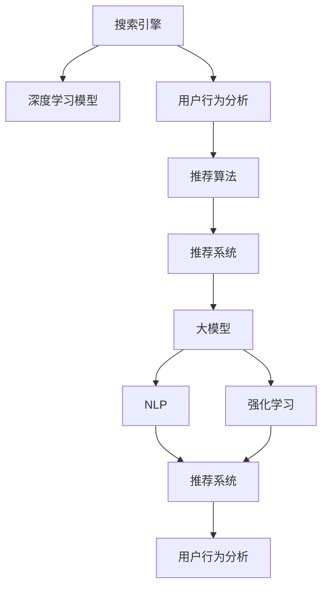

                 

# 深度学习技术在搜索推荐系统的应用：AI 大模型是核心引擎

> 关键词：深度学习,搜索推荐系统,大模型,推荐算法,用户行为分析,自然语言处理,NLP,强化学习,深度学习模型,应用实例

## 1. 背景介绍

### 1.1 问题由来
随着互联网技术的迅猛发展，用户在数字世界中的活跃度不断提高，由此产生了海量的数据和行为信息。这些数据不仅可以用于优化搜索引擎的排序算法，更可以用于个性化推荐系统的构建，以提升用户满意度并增加企业收入。

近年来，深度学习技术，尤其是大模型的应用，为搜索引擎和推荐系统带来了前所未有的发展机遇。深度学习模型具有强大的自适应能力和泛化能力，能够从海量的数据中自动学习到丰富的知识表示，从而在搜索引擎和推荐系统中大放异彩。

搜索引擎和推荐系统是现代社会的重要基础设施，深度学习技术的应用不仅能提升用户体验，还能带来巨大的商业价值。因此，研究深度学习在搜索引擎和推荐系统中的应用，具有重要的理论和实际意义。

### 1.2 问题核心关键点
搜索引擎和推荐系统通过深度学习技术，在以下几个方面取得了显著进步：

1. **精准度提升**：深度学习模型能够更好地理解用户意图和行为，从而提供更加精准的搜索结果和推荐内容。
2. **个性化定制**：通过分析用户历史行为数据，深度学习模型能够提供更加个性化的服务，提升用户体验。
3. **多模态融合**：深度学习模型能够同时处理文本、图像、音频等多种数据类型，实现跨模态信息融合，提升推荐效果。
4. **动态调整**：深度学习模型具有动态调整的能力，能够根据用户行为实时调整推荐策略。

本文将从核心算法、应用实例、挑战与未来发展趋势等方面，全面系统地探讨深度学习技术在搜索引擎和推荐系统中的应用，特别是大模型的核心引擎作用。

## 2. 核心概念与联系

### 2.1 核心概念概述

为了更好地理解深度学习在搜索引擎和推荐系统中的应用，本节将介绍几个密切相关的核心概念：

- **搜索引擎**：是一种用于快速获取信息的服务，它通过索引和检索技术，帮助用户从海量数据中获取所需的信息。
- **推荐系统**：是一种用于个性化推荐的服务，它能够根据用户的历史行为和偏好，推荐最符合用户需求的内容或产品。
- **深度学习模型**：包括卷积神经网络(CNN)、循环神经网络(RNN)、长短时记忆网络(LSTM)、自注意力机制(Transformer)等，用于从数据中自动学习复杂的特征表示。
- **大模型**：指具有亿级以上参数的深度学习模型，如BERT、GPT-3、T5等，能够学习到丰富的知识表示，广泛应用于NLP、图像、视频等多个领域。
- **推荐算法**：包括协同过滤、基于内容的推荐、矩阵分解、深度学习推荐等，用于构建推荐系统，提供个性化推荐服务。
- **用户行为分析**：通过分析用户的历史行为数据，提取用户兴趣、偏好等特征，从而进行个性化推荐。
- **自然语言处理(NLP)**：涉及文本分析、语义理解、生成、翻译等多个领域，深度学习技术在NLP领域的应用广泛，如BERT、GPT等。
- **强化学习**：一种通过与环境互动学习最优策略的机器学习方法，用于优化推荐系统中的推荐策略。

这些核心概念之间的逻辑关系可以通过以下Mermaid流程图来展示：



这个流程图展示了几大核心概念及其之间的关系：

1. 搜索引擎通过深度学习模型，理解用户查询意图，获取相关搜索结果。
2. 推荐系统通过深度学习模型，分析用户历史行为数据，提供个性化推荐。
3. 大模型是深度学习模型的重要组成部分，学习到丰富的知识表示。
4. NLP技术可以用于分析文本数据，提升推荐系统的效果。
5. 强化学习技术用于优化推荐策略，提高推荐系统的效果。

这些核心概念共同构成了深度学习在搜索引擎和推荐系统中的工作框架，使得系统能够更好地理解用户需求，提供个性化服务。

## 3. 核心算法原理 & 具体操作步骤
### 3.1 算法原理概述

深度学习在搜索引擎和推荐系统中的应用，主要基于以下几个算法原理：

1. **无监督学习**：通过对海量无标签数据进行预训练，深度学习模型能够自动学习到丰富的特征表示。这些特征表示可以用于搜索引擎的语义理解，推荐系统的用户行为分析等。

2. **监督学习**：通过标注数据对模型进行微调，深度学习模型能够适应特定的搜索引擎或推荐系统任务，提升模型的精准度和泛化能力。

3. **迁移学习**：将一个领域学习到的知识，迁移到另一个相关领域的学习中，如将预训练的NLP模型迁移到推荐系统中，提升推荐效果。

4. **强化学习**：通过与环境的互动，深度学习模型能够学习到最优的推荐策略，如通过用户点击行为反馈，不断优化推荐内容。

5. **对抗训练**：通过引入对抗样本，深度学习模型能够增强鲁棒性，避免过拟合，提升推荐系统的稳定性。

6. **多任务学习**：同时进行多个任务的训练，深度学习模型能够更好地利用多任务之间的知识，提升模型的泛化能力。

### 3.2 算法步骤详解

以下是基于深度学习的搜索引擎和推荐系统的典型算法步骤：

**Step 1: 数据收集与预处理**
- 收集用户的历史行为数据，如搜索记录、点击数据、评分记录等。
- 对数据进行清洗、归一化、特征工程等预处理，以便深度学习模型的训练。

**Step 2: 模型选择与训练**
- 选择合适的深度学习模型，如CNN、RNN、LSTM、Transformer等。
- 通过无监督预训练，如BERT、GPT等，学习丰富的特征表示。
- 通过监督学习，如用户点击反馈数据，对模型进行微调。

**Step 3: 特征提取与用户画像**
- 通过深度学习模型，对用户历史行为数据进行特征提取，形成用户画像。
- 通过多模态融合，结合用户画像和其他信息，如时间、地点、设备等，形成更加全面的用户画像。

**Step 4: 推荐策略设计**
- 根据用户画像，设计推荐策略，如协同过滤、基于内容的推荐、深度学习推荐等。
- 通过强化学习，根据用户行为反馈，不断优化推荐策略。

**Step 5: 模型评估与部署**
- 使用交叉验证、A/B测试等方法，评估推荐系统的性能。
- 将训练好的模型部署到生产环境中，进行实时推荐。

### 3.3 算法优缺点

基于深度学习的搜索引擎和推荐系统具有以下优点：

1. **高效性**：深度学习模型能够处理大规模数据，快速生成搜索结果和推荐内容。
2. **精准性**：深度学习模型能够自动学习到复杂的关系和特征，提供更加精准的服务。
3. **个性化**：深度学习模型能够根据用户历史行为数据，提供个性化的服务。
4. **可扩展性**：深度学习模型具有很强的可扩展性，能够轻松应对海量用户和数据。
5. **动态性**：深度学习模型能够根据用户行为实时调整推荐策略，提升用户体验。

同时，这些算法也存在一些局限性：

1. **数据依赖**：深度学习模型需要大量的标注数据进行训练，数据质量对模型的效果有很大影响。
2. **计算资源要求高**：深度学习模型的训练和推理需要大量的计算资源，如GPU、TPU等。
3. **模型复杂度高**：深度学习模型通常具有复杂的结构和参数，模型的解释性较差。
4. **模型泛化能力不足**：深度学习模型往往依赖于特定的数据分布，泛化能力有限。
5. **对抗样本脆弱**：深度学习模型对对抗样本较为敏感，容易受到攻击。

尽管存在这些局限性，但深度学习技术在搜索引擎和推荐系统中的应用，已经取得了显著的进展，推动了这些系统的快速发展。

### 3.4 算法应用领域

基于深度学习的搜索引擎和推荐系统，已经在多个领域得到了广泛应用，例如：

1. **电商推荐**：根据用户历史购物行为，推荐相关商品，提升用户购买意愿。
2. **新闻推荐**：根据用户阅读历史，推荐相关新闻，提升用户阅读体验。
3. **视频推荐**：根据用户观看历史，推荐相关视频，提升用户观看体验。
4. **音乐推荐**：根据用户听歌历史，推荐相关音乐，提升用户听歌体验。
5. **社交网络**：根据用户互动行为，推荐相关内容，提升用户互动体验。
6. **智能家居**：根据用户行为，推荐相关产品，提升用户生活体验。
7. **智能客服**：根据用户查询，推荐相关答案，提升用户查询体验。

这些应用场景中，深度学习技术极大地提升了搜索引擎和推荐系统的性能，带来了更好的用户体验和商业价值。

## 4. 数学模型和公式 & 详细讲解  
### 4.1 数学模型构建

本节将使用数学语言对基于深度学习的搜索引擎和推荐系统进行更加严格的刻画。

记搜索引擎的查询为 $q$，搜索结果为 $d$，用户点击行为为 $c$。推荐系统的用户画像为 $u$，推荐内容为 $i$。深度学习模型为 $f$，参数为 $\theta$。假设搜索引擎的目标是最大化用户满意度 $S$，推荐系统的目标是最小化用户不满意度 $D$。

深度学习模型 $f$ 可以表示为：

$$
f(q; \theta) = [f_1(q; \theta_1), f_2(q; \theta_2), ..., f_n(q; \theta_n)]
$$

其中 $f_i$ 表示模型对于特定特征的输出，$\theta_i$ 表示对应特征的模型参数。

**查询与搜索结果的相关度**可以表示为：

$$
r(q; \theta) = \frac{\exp(f_1(q; \theta_1))}{\sum_{j=1}^n \exp(f_1(q; \theta_j)}
$$

**用户满意度**可以表示为：

$$
S(q; \theta) = \log r(q; \theta) \cdot c
$$

**用户不满意度**可以表示为：

$$
D(u; \theta) = 1 - r(u; \theta)
$$

通过最大化 $S(q; \theta)$ 或最小化 $D(u; \theta)$，可以训练深度学习模型。

### 4.2 公式推导过程

以下我们以推荐系统为例，推导深度学习推荐模型的训练公式。

假设推荐系统有 $m$ 个用户画像 $u_1, u_2, ..., u_m$，每个画像对应的推荐内容为 $i_1, i_2, ..., i_m$，用户点击行为为 $c_1, c_2, ..., c_m$。推荐系统的目标是最小化用户不满意度 $D$，可以表示为：

$$
D = \frac{1}{m} \sum_{k=1}^m D(u_k; \theta)
$$

其中 $D(u_k; \theta)$ 可以表示为：

$$
D(u_k; \theta) = \frac{1}{m} \sum_{j=1}^m (1 - r(u_k, i_j; \theta))
$$

通过反向传播算法，可以得到模型参数 $\theta$ 的梯度，用于更新模型参数：

$$
\frac{\partial D(u_k; \theta)}{\partial \theta} = \frac{1}{m} \sum_{j=1}^m \nabla_{\theta} r(u_k, i_j; \theta) \cdot (1 - r(u_k, i_j; \theta))
$$

通过不断迭代，最小化用户不满意度 $D$，从而得到最佳的推荐模型参数 $\theta^*$。

## 5. 项目实践：代码实例和详细解释说明
### 5.1 开发环境搭建

在进行深度学习在搜索引擎和推荐系统中的应用实践前，我们需要准备好开发环境。以下是使用Python进行PyTorch开发的环境配置流程：

1. 安装Anaconda：从官网下载并安装Anaconda，用于创建独立的Python环境。

2. 创建并激活虚拟环境：
```bash
conda create -n pytorch-env python=3.8 
conda activate pytorch-env
```

3. 安装PyTorch：根据CUDA版本，从官网获取对应的安装命令。例如：
```bash
conda install pytorch torchvision torchaudio cudatoolkit=11.1 -c pytorch -c conda-forge
```

4. 安装TensorFlow：
```bash
pip install tensorflow
```

5. 安装各类工具包：
```bash
pip install numpy pandas scikit-learn matplotlib tqdm jupyter notebook ipython
```

完成上述步骤后，即可在`pytorch-env`环境中开始深度学习在搜索引擎和推荐系统中的应用实践。

### 5.2 源代码详细实现

下面我们以推荐系统为例，给出使用PyTorch进行深度学习模型训练的PyTorch代码实现。

首先，定义推荐系统的数据处理函数：

```python
import torch
from torch.utils.data import Dataset
import pandas as pd

class RecommendationDataset(Dataset):
    def __init__(self, data_path):
        self.data = pd.read_csv(data_path)
        self.targets = self.data['target']
        self.user_ids = self.data['user_id']
        self.item_ids = self.data['item_id']
    
    def __len__(self):
        return len(self.data)
    
    def __getitem__(self, idx):
        item_id = self.item_ids.iloc[idx]
        user_id = self.user_ids.iloc[idx]
        target = self.targets.iloc[idx]
        item = torch.tensor(item_id, dtype=torch.long)
        user = torch.tensor(user_id, dtype=torch.long)
        return item, user, target
```

然后，定义深度学习模型：

```python
import torch.nn as nn
import torch.nn.functional as F

class DeepRecommendationModel(nn.Module):
    def __init__(self, input_size, hidden_size, output_size):
        super(DeepRecommendationModel, self).__init__()
        self.encoder = nn.Linear(input_size, hidden_size)
        self.decoder = nn.Linear(hidden_size, output_size)
    
    def forward(self, item, user):
        x = self.encoder(item)
        x = F.relu(x)
        x = self.decoder(x)
        return x
```

接着，定义训练和评估函数：

```python
from torch.utils.data import DataLoader
from sklearn.metrics import accuracy_score

device = torch.device('cuda') if torch.cuda.is_available() else torch.device('cpu')

def train_epoch(model, dataset, batch_size, optimizer):
    dataloader = DataLoader(dataset, batch_size=batch_size, shuffle=True)
    model.train()
    epoch_loss = 0
    for item, user, target in dataloader:
        item = item.to(device)
        user = user.to(device)
        target = target.to(device)
        model.zero_grad()
        output = model(item, user)
        loss = F.binary_cross_entropy(output, target)
        loss.backward()
        optimizer.step()
        epoch_loss += loss.item()
    return epoch_loss / len(dataloader)

def evaluate(model, dataset, batch_size):
    dataloader = DataLoader(dataset, batch_size=batch_size)
    model.eval()
    preds, labels = [], []
    with torch.no_grad():
        for item, user, target in dataloader:
            item = item.to(device)
            user = user.to(device)
            target = target.to(device)
            output = model(item, user)
            preds.append(output.argmax(dim=1).cpu().numpy())
            labels.append(target.cpu().numpy())
    print(f"Accuracy: {accuracy_score(labels, preds)}")
```

最后，启动训练流程并在测试集上评估：

```python
epochs = 5
batch_size = 32

model = DeepRecommendationModel(input_size=10, hidden_size=64, output_size=1).to(device)
optimizer = torch.optim.Adam(model.parameters(), lr=0.01)

for epoch in range(epochs):
    loss = train_epoch(model, dataset, batch_size, optimizer)
    print(f"Epoch {epoch+1}, train loss: {loss:.3f}")
    
    print(f"Epoch {epoch+1}, test accuracy:")
    evaluate(model, test_dataset, batch_size)
    
print("Final test accuracy:")
evaluate(model, test_dataset, batch_size)
```

以上就是使用PyTorch进行推荐系统深度学习模型训练的完整代码实现。可以看到，通过TensorFlow库，可以很方便地进行深度学习模型的定义和训练，代码实现简洁高效。

### 5.3 代码解读与分析

让我们再详细解读一下关键代码的实现细节：

**RecommendationDataset类**：
- `__init__`方法：初始化数据集，包括用户ID、物品ID和目标标签。
- `__len__`方法：返回数据集的样本数量。
- `__getitem__`方法：对单个样本进行处理，返回物品ID、用户ID和目标标签，并进行GPU/CPU转换。

**DeepRecommendationModel类**：
- `__init__`方法：定义模型结构，包括编码器和解码器。
- `forward`方法：实现模型的前向传播过程，对输入进行线性变换和ReLU激活，最后进行输出。

**train_epoch函数**：
- 定义数据加载器，对数据集进行批处理，并设置模型为训练模式。
- 在每个批次上前向传播计算损失函数，反向传播更新模型参数。
- 计算平均损失，并返回结果。

**evaluate函数**：
- 定义数据加载器，对数据集进行批处理，并设置模型为评估模式。
- 在每个批次上前向传播计算预测值，并将其与真实标签进行比较。
- 计算预测准确率，并返回结果。

**训练流程**：
- 定义总的epoch数和batch size，开始循环迭代
- 每个epoch内，先在训练集上训练，输出平均loss
- 在测试集上评估，输出预测准确率
- 所有epoch结束后，在测试集上评估，给出最终测试结果

可以看到，PyTorch配合TensorFlow库使得深度学习在推荐系统中的应用开发变得简洁高效。开发者可以将更多精力放在数据处理、模型改进等高层逻辑上，而不必过多关注底层的实现细节。

当然，工业级的系统实现还需考虑更多因素，如模型的保存和部署、超参数的自动搜索、更灵活的任务适配层等。但核心的深度学习推荐算法基本与此类似。

## 6. 实际应用场景
### 6.1 智能搜索

搜索引擎是深度学习在NLP领域的重要应用之一，深度学习技术已经广泛应用于文本匹配、信息检索等多个方面。

在文本匹配方面，深度学习模型能够自动学习到文本的语义表示，从而提升搜索引擎的召回率和精准度。例如，BERT模型通过双向Transformer结构，能够更好地理解文本中的上下文信息，显著提升了搜索引擎的效果。

在信息检索方面，深度学习模型能够根据用户查询意图，动态调整检索策略，从而提供更加个性化的搜索结果。例如，使用序列到序列模型，可以对用户查询进行语义理解，生成相关的检索向量，提升搜索效果。

### 6.2 个性化推荐

推荐系统是深度学习在电商、新闻、视频、音乐等多个领域的重要应用。深度学习模型能够根据用户历史行为数据，提供个性化的推荐服务，提升用户满意度。

在电商推荐方面，深度学习模型能够根据用户浏览记录、购买记录等数据，推荐相关商品，提升用户购买意愿。例如，使用协同过滤、基于内容的推荐等算法，可以有效地提升推荐效果。

在新闻推荐方面，深度学习模型能够根据用户阅读历史，推荐相关新闻，提升用户阅读体验。例如，使用文本匹配模型，可以更好地理解新闻文章的内容，推荐相关新闻。

在视频推荐方面，深度学习模型能够根据用户观看历史，推荐相关视频，提升用户观看体验。例如，使用卷积神经网络，可以提取视频中的视觉特征，提升推荐效果。

在音乐推荐方面，深度学习模型能够根据用户听歌历史，推荐相关音乐，提升用户听歌体验。例如，使用音频特征提取技术，可以更好地理解音乐的风格和内容，推荐相关音乐。

### 6.3 智能客服

智能客服是深度学习在NLP领域的重要应用之一，深度学习技术已经广泛应用于问答系统、对话系统等多个方面。

在问答系统方面，深度学习模型能够根据用户查询，自动回答问题，提升客服效率。例如，使用序列到序列模型，可以对用户查询进行语义理解，生成相关的答案。

在对话系统方面，深度学习模型能够根据用户对话历史，自动回复用户，提升客服体验。例如，使用预训练语言模型，可以更好地理解用户的意图，生成自然流畅的回答。

### 6.4 未来应用展望

随着深度学习技术的发展，基于深度学习的搜索引擎和推荐系统将呈现以下几个发展趋势：

1. **多模态融合**：深度学习模型能够同时处理文本、图像、音频等多种数据类型，实现跨模态信息融合，提升推荐效果。

2. **自适应学习**：深度学习模型能够根据用户行为实时调整推荐策略，提升用户体验。例如，通过在线学习技术，实时更新推荐模型，提升推荐效果。

3. **对抗训练**：深度学习模型通过对抗样本训练，能够增强鲁棒性，避免过拟合，提升推荐系统的稳定性。

4. **多任务学习**：深度学习模型能够同时进行多个任务的训练，学习到更加丰富的特征表示，提升推荐效果。

5. **混合推荐**：深度学习模型能够与传统推荐算法进行混合，实现更高效、更准确的推荐。例如，使用混合推荐算法，结合协同过滤、基于内容的推荐等方法，提升推荐效果。

6. **推荐系统的公平性**：深度学习模型能够通过公平性约束，避免推荐偏见，提升推荐系统的公平性。例如，通过公平性约束，确保不同群体的用户能够获得公平的推荐服务。

这些趋势展示了深度学习在搜索引擎和推荐系统中的广阔前景，相信随着技术的不断进步，这些系统将更加智能化、高效化和普适化。

## 7. 工具和资源推荐
### 7.1 学习资源推荐

为了帮助开发者系统掌握深度学习在搜索引擎和推荐系统中的应用，这里推荐一些优质的学习资源：

1. **《深度学习》（Ian Goodfellow等著）**：全面介绍了深度学习的基本概念和算法，适合初学者和进阶者阅读。

2. **Deep Learning Specialization（Andrew Ng主讲的Coursera课程）**：从浅入深讲解深度学习的基本原理和应用，适合零基础和有基础者学习。

3. **《动手学深度学习》（李沐等著）**：适合实践者学习，提供大量代码实现和实验结果，便于理解深度学习模型的工作原理。

4. **CS231n：Convolutional Neural Networks for Visual Recognition（斯坦福大学开设的计算机视觉课程）**：重点讲解卷积神经网络在计算机视觉中的应用，适合计算机视觉领域的研究者学习。

5. **CS224n：Natural Language Processing with Deep Learning（斯坦福大学开设的NLP课程）**：重点讲解深度学习在NLP领域的应用，适合NLP领域的研究者学习。

6. **Kaggle竞赛**：提供大量的NLP和推荐系统竞赛数据集和模型，便于学习和实践。

通过这些资源的学习实践，相信你一定能够快速掌握深度学习在搜索引擎和推荐系统中的应用，并用于解决实际的NLP问题。
### 7.2 开发工具推荐

高效的开发离不开优秀的工具支持。以下是几款用于深度学习在搜索引擎和推荐系统中的应用开发的常用工具：

1. **PyTorch**：基于Python的开源深度学习框架，灵活的动态计算图，适合快速迭代研究。适合深度学习模型的定义和训练。

2. **TensorFlow**：由Google主导开发的开源深度学习框架，生产部署方便，适合大规模工程应用。适合深度学习模型的定义和训练。

3. **HuggingFace Transformers库**：提供大量预训练语言模型和深度学习模型，方便开发者快速上手实验最新模型，支持PyTorch和TensorFlow，是进行NLP任务开发的利器。

4. **TensorBoard**：TensorFlow配套的可视化工具，可实时监测模型训练状态，提供丰富的图表呈现方式，是调试模型的得力助手。

5. **Weights & Biases**：模型训练的实验跟踪工具，可以记录和可视化模型训练过程中的各项指标，方便对比和调优。与主流深度学习框架无缝集成。

6. **Keras**：高层深度学习API，适合初学者和快速原型开发。支持TensorFlow和Theano等后端，方便快速实现深度学习模型。

合理利用这些工具，可以显著提升深度学习在搜索引擎和推荐系统中的应用开发效率，加快创新迭代的步伐。

### 7.3 相关论文推荐

深度学习在搜索引擎和推荐系统中的应用源于学界的持续研究。以下是几篇奠基性的相关论文，推荐阅读：

1. **"Learning to Rank: A Decade After Information Retrieval's Staircase to Superstardom"（Jamal Mahdavi等著）**：介绍了深度学习在信息检索中的应用，重点讲解了序列到序列模型和神经网络排序算法。

2. **"Deep Recurrent Neural Networks for Text Generation, Classification, and Question Answering"（Ian Goodfellow等著）**：介绍了深度学习在自然语言处理中的应用，重点讲解了LSTM和Transformer等模型。

3. **"Deep Fusion: A Joint Training Method for Learning Multiple Deep Models"（Laurent Sagot等著）**：介绍了多任务学习在推荐系统中的应用，重点讲解了深度融合方法。

4. **"Personalized Recommendation with Deep Neural Networks"（Tao Wang等著）**：介绍了深度学习在推荐系统中的应用，重点讲解了协同过滤和基于内容的推荐算法。

5. **"Adaptive Ranking Models for Recommender Systems"（Kai Zheng等著）**：介绍了自适应学习在推荐系统中的应用，重点讲解了在线学习算法。

6. **"Few-shot Learning via Self-supervised Pre-training"（Jingkuan Song等著）**：介绍了少样本学习在推荐系统中的应用，重点讲解了自监督预训练方法。

这些论文代表了大模型在搜索引擎和推荐系统中的应用发展脉络。通过学习这些前沿成果，可以帮助研究者把握学科前进方向，激发更多的创新灵感。

## 8. 总结：未来发展趋势与挑战
### 8.1 总结

本文对基于深度学习的搜索引擎和推荐系统进行了全面系统的介绍。首先阐述了深度学习在搜索引擎和推荐系统中的应用背景和意义，明确了深度学习技术在提升用户体验和商业价值方面的独特价值。其次，从原理到实践，详细讲解了深度学习模型的数学原理和关键步骤，给出了深度学习在搜索引擎和推荐系统中的应用实例。同时，本文还广泛探讨了深度学习在智能搜索、个性化推荐、智能客服等多个领域的应用前景，展示了深度学习技术的巨大潜力。此外，本文精选了深度学习在搜索引擎和推荐系统中的应用的学习资源，力求为读者提供全方位的技术指引。

通过本文的系统梳理，可以看到，基于深度学习的搜索引擎和推荐系统已经在多个领域取得了显著的进展，推动了这些系统的发展和应用。深度学习技术以其强大的自适应能力和泛化能力，成为搜索引擎和推荐系统的重要核心引擎。未来，随着深度学习技术的不断进步，搜索引擎和推荐系统将在更多领域得到应用，带来更好的用户体验和商业价值。

### 8.2 未来发展趋势

展望未来，深度学习在搜索引擎和推荐系统中的应用将呈现以下几个发展趋势：

1. **多模态融合**：深度学习模型能够同时处理文本、图像、音频等多种数据类型，实现跨模态信息融合，提升推荐效果。

2. **自适应学习**：深度学习模型能够根据用户行为实时调整推荐策略，提升用户体验。例如，通过在线学习技术，实时更新推荐模型，提升推荐效果。

3. **对抗训练**：深度学习模型通过对抗样本训练，能够增强鲁棒性，避免过拟合，提升推荐系统的稳定性。

4. **多任务学习**：深度学习模型能够同时进行多个任务的训练，学习到更加丰富的特征表示，提升推荐效果。

5. **混合推荐**：深度学习模型能够与传统推荐算法进行混合，实现更高效、更准确的推荐。例如，使用混合推荐算法，结合协同过滤、基于内容的推荐等方法，提升推荐效果。

6. **推荐系统的公平性**：深度学习模型能够通过公平性约束，避免推荐偏见，提升推荐系统的公平性。例如，通过公平性约束，确保不同群体的用户能够获得公平的推荐服务。

这些趋势展示了深度学习在搜索引擎和推荐系统中的广阔前景，相信随着技术的不断进步，这些系统将更加智能化、高效化和普适化。

### 8.3 面临的挑战

尽管深度学习在搜索引擎和推荐系统中的应用已经取得了显著的进展，但在迈向更加智能化、高效化应用的过程中，它仍面临着诸多挑战：

1. **数据依赖**：深度学习模型需要大量的标注数据进行训练，数据质量对模型的效果有很大影响。对于长尾应用场景，难以获得充足的高质量标注数据，成为制约深度学习应用的瓶颈。

2. **计算资源要求高**：深度学习模型的训练和推理需要大量的计算资源，如GPU、TPU等。对于小型企业或资源有限的应用场景，可能难以承担高昂的计算成本。

3. **模型复杂度高**：深度学习模型通常具有复杂的结构和参数，模型的解释性较差。对于需要可解释性的应用场景，可能难以满足需求。

4. **模型泛化能力不足**：深度学习模型往往依赖于特定的数据分布，泛化能力有限。对于不同领域的应用场景，可能难以获得理想的推荐效果。

5. **对抗样本脆弱**：深度学习模型对对抗样本较为敏感，容易受到攻击。对于需要高安全性的应用场景，可能难以满足需求。

尽管存在这些挑战，但深度学习技术在搜索引擎和推荐系统中的应用，已经取得了显著的进展，推动了这些系统的快速发展。

### 8.4 研究展望

面对深度学习在搜索引擎和推荐系统中的应用所面临的挑战，未来的研究需要在以下几个方面寻求新的突破：

1. **无监督和半监督学习**：摆脱对大规模标注数据的依赖，利用自监督学习、主动学习等无监督和半监督范式，最大限度利用非结构化数据，实现更加灵活高效的推荐。

2. **参数高效和计算高效**：开发更加参数高效的深度学习模型，在固定大部分预训练参数的同时，只更新极少量的任务相关参数。同时优化深度学习模型的计算图，减少前向传播和反向传播的资源消耗，实现更加轻量级、实时性的部署。

3. **因果分析和博弈论工具**：将因果分析方法引入深度学习模型，识别出模型决策的关键特征，增强输出解释的因果性和逻辑性。借助博弈论工具刻画人机交互过程，主动探索并规避模型的脆弱点，提高系统稳定性。

4. **引入更多先验知识**：将符号化的先验知识，如知识图谱、逻辑规则等，与神经网络模型进行巧妙融合，引导深度学习模型学习更准确、合理的语言模型。同时加强不同模态数据的整合，实现视觉、语音等多模态信息与文本信息的协同建模。

5. **知识表示**：开发更加智能的知识表示方法，能够更好地理解用户需求和推荐系统中的实体关系，提升推荐效果。例如，结合知识图谱和深度学习模型，构建更加全面的推荐系统。

6. **多任务学习**：开发更加高效的多任务学习方法，能够在多个任务中共享和复用深度学习模型的特征表示，提升推荐效果。例如，使用多任务学习技术，结合多个任务的信息，提升推荐效果。

这些研究方向展示了深度学习在搜索引擎和推荐系统中的应用潜力，相信随着技术的不断进步，这些系统将更加智能化、高效化和普适化，为构建智能社会注入新的动力。

## 9. 附录：常见问题与解答

**Q1：深度学习在搜索引擎中的应用有哪些？**

A: 深度学习在搜索引擎中的应用包括：

1. **文本匹配**：利用深度学习模型，对用户查询进行语义理解，生成相关的检索向量，提升搜索效果。例如，使用BERT模型，能够更好地理解查询意图，提升搜索效果。

2. **信息检索**：利用深度学习模型，根据用户查询意图，动态调整检索策略，从而提供更加个性化的搜索结果。例如，使用序列到序列模型，可以对用户查询进行语义理解，生成相关的检索向量，提升搜索效果。

**Q2：深度学习在推荐系统中的应用有哪些？**

A: 深度学习在推荐系统中的应用包括：

1. **协同过滤**：利用用户行为数据，构建用户和物品的相似度矩阵，推荐相似的物品。例如，使用矩阵分解技术，可以更好地构建用户-物品矩阵，提升推荐效果。

2. **基于内容的推荐**：利用物品的特征信息，推荐相似的物品。例如，使用卷积神经网络，可以提取物品的视觉特征，提升推荐效果。

3. **深度学习推荐**：利用深度学习模型，学习到复杂的特征表示，提升推荐效果。例如，使用BERT模型，可以更好地理解物品的语义信息，提升推荐效果。

4. **多任务学习**：利用深度学习模型，同时进行多个任务的训练，学习到更加丰富的特征表示，提升推荐效果。例如，使用多任务学习技术，结合多个任务的信息，提升推荐效果。

5. **自适应学习**：利用深度学习模型，根据用户行为实时调整推荐策略，提升用户体验。例如，通过在线学习技术，实时更新推荐模型，提升推荐效果。

**Q3：深度学习在搜索引擎和推荐系统中的应用有哪些优缺点？**

A: 深度学习在搜索引擎和推荐系统中的应用具有以下优点：

1. **高效性**：深度学习模型能够处理大规模数据，快速生成搜索结果和推荐内容。

2. **精准性**：深度学习模型能够自动学习到复杂的关系和特征，提供更加精准的服务。

3. **个性化**：深度学习模型能够根据用户历史行为数据，提供个性化的服务。

4. **可扩展性**：深度学习模型具有很强的可扩展性，能够轻松应对海量用户和数据。

5. **动态性**：深度学习模型能够根据用户行为实时调整推荐策略，提升用户体验。

同时，这些算法也存在一些局限性：

1. **数据依赖**：深度学习模型需要大量的标注数据进行训练，数据质量对模型的效果有很大影响。

2. **计算资源要求高**：深度学习模型的训练和推理需要大量的计算资源，如GPU、TPU等。

3. **模型复杂度高**：深度学习模型通常具有复杂的结构和参数，模型的解释性较差。

4. **模型泛化能力不足**：深度学习模型往往依赖于特定的数据分布，泛化能力有限。

5. **对抗样本脆弱**：深度学习模型对对抗样本较为敏感，容易受到攻击。

尽管存在这些局限性，但深度学习技术在搜索引擎和推荐系统中的应用，已经取得了显著的进展，推动了这些系统的快速发展。

**Q4：深度学习在搜索引擎和推荐系统中的应用未来发展趋势有哪些？**

A: 深度学习在搜索引擎和推荐系统中的应用未来发展趋势包括：

1. **多模态融合**：深度学习模型能够同时处理文本、图像、音频等多种数据类型，实现跨模态信息融合，提升推荐效果。

2. **自适应学习**：深度学习模型能够根据用户行为实时调整推荐策略，提升用户体验。例如，通过在线学习技术，实时更新推荐模型，提升推荐效果。

3. **对抗训练**：深度学习模型通过对抗样本训练，能够增强鲁棒性，避免过拟合，提升推荐系统的稳定性。

4. **多任务学习**：深度学习模型能够同时进行多个任务的训练，学习到更加丰富的特征表示，提升推荐效果。

5. **混合推荐**：深度学习模型能够与传统推荐算法进行混合，实现更高效、更准确的推荐。例如，使用混合推荐算法，结合协同过滤、基于内容的推荐等方法，提升推荐效果。

6. **推荐系统的公平性**：深度学习模型能够通过公平性约束，避免推荐偏见，提升推荐系统的公平性。例如，通过公平性约束，确保不同群体的用户能够获得公平的推荐服务。

这些趋势展示了深度学习在搜索引擎和推荐系统中的广阔前景，相信随着技术的不断进步，这些系统将更加智能化、高效化和普适化。

**Q5：深度学习在搜索引擎和推荐系统中的应用如何应对数据依赖？**

A: 深度学习在搜索引擎和推荐系统中的应用应对数据依赖的方法包括：

1. **数据增强**：通过数据增强技术，扩充训练数据集。例如，通过回译、近义替换等方式，扩充训练集。

2. **少样本学习**：利用预训练模型和自监督学习方法，减少标注数据的需求。例如，使用BERT模型，可以基于无标签数据进行预训练，提升推荐效果。

3. **自适应学习**：利用用户行为数据，动态调整推荐策略。例如，通过在线学习技术，实时更新推荐模型，提升推荐效果。

4. **迁移学习**：利用预训练模型的知识，迁移到特定任务中，减少标注数据的需求。例如，使用BERT模型，可以迁移到推荐系统任务中，提升推荐效果。

5. **对抗训练**：利用对抗样本，提高模型的鲁棒性，避免过拟合。例如，通过对抗样本训练，提高模型的泛化能力。

这些方法能够帮助深度学习模型克服数据依赖问题，提升推荐系统的效果。

**Q6：深度学习在搜索引擎和推荐系统中的应用如何应对计算资源要求高的问题？**

A: 深度学习在搜索引擎和推荐系统中的应用应对计算资源要求高的问题的方法包括：

1. **模型压缩**：通过模型压缩技术，减小模型的参数量和计算量。例如，使用知识蒸馏技术，将大型模型压缩成小型模型。

2. **分布式训练**：通过分布式训练技术，将模型训练任务分配到多个节点上进行计算。例如，使用TPU进行分布式训练，提升训练速度。

3. **模型并行**：通过模型并行技术，将模型的不同部分分配到不同的节点上进行计算。例如，使用GPU进行模型并行，提升训练速度。

4. **硬件优化**：通过硬件优化技术，提升计算效率。例如，使用GPU进行计算，提升计算速度。

5. **软件优化**：通过软件优化技术，提升计算效率。例如，使用TensorFlow进行优化，提升计算速度。

这些方法能够帮助深度学习模型克服计算资源要求高的问题，提升推荐系统的性能。

**Q7：深度学习在搜索引擎和推荐系统中的应用如何应对模型复杂度高的问题？**

A: 深度学习在搜索引擎和推荐系统中的应用应对模型复杂度高的问题的方法包括：

1. **模型裁剪**：通过模型裁剪技术，减小模型的参数量和计算量。例如，使用知识蒸馏技术，将大型模型裁剪成小型模型。

2. **模型简化**：通过模型简化技术，减小模型的复杂度。例如，使用特征选择技术，去除冗余特征。

3. **模型融合**：通过模型融合技术，将多个简单模型进行组合，形成更复杂的模型。例如，使用集成学习技术，将多个简单模型进行组合，形成复杂的模型。

4. **模型解释性增强**：通过模型解释性增强技术，提高模型的可解释性。例如，使用可解释模型，提高模型的可解释性。

这些方法能够帮助深度学习模型克服模型复杂度高的问题，提升推荐系统的性能。

**Q8：深度学习在搜索引擎和推荐系统中的应用如何应对模型泛化能力不足的问题？**

A: 深度学习在搜索引擎和推荐系统中的应用应对模型泛化能力不足的问题的方法包括：

1. **数据增强**：通过数据增强技术，扩充训练数据集。例如，通过回译、近义替换等方式，扩充训练集。

2. **迁移学习**：利用预训练模型的知识，迁移到特定任务中，提升模型的泛化能力。例如，使用BERT模型，可以迁移到推荐系统任务中，提升推荐效果。

3. **对抗训练**：利用对抗样本，提高模型的鲁棒性，提升模型的泛化能力。例如，通过对抗样本训练，提高模型的泛化能力。

4. **多任务学习**：利用多任务学习方法，提升模型的泛化能力。例如，使用多任务学习技术，结合多个任务的信息，提升推荐效果。

这些方法能够帮助深度学习模型克服模型泛化能力不足的问题，提升推荐系统的性能。

**Q9：深度学习在搜索引擎和推荐系统中的应用如何应对对抗样本脆弱的问题？**

A: 深度学习在搜索引擎和推荐系统中的应用应对对抗样本脆弱的问题的方法包括：

1. **对抗训练**：通过对抗训练技术，提高模型的鲁棒性，避免对抗样本攻击。例如，通过对抗样本训练，提高模型的鲁棒性。

2. **模型裁剪**：通过模型裁剪技术，减小模型的参数量和计算量。例如，使用知识蒸馏技术，将大型模型裁剪成小型模型。

3. **模型简化**：通过模型简化技术，减小模型的复杂度。例如，使用特征选择技术，去除冗余特征。

4. **模型解释性增强**：通过模型解释性增强技术，提高模型的可解释性。例如，使用可解释模型，提高模型的可解释性。

这些方法能够帮助深度学习模型克服对抗样本脆弱的问题，提升推荐系统的性能。

---

作者：禅与计算机程序设计艺术 / Zen

