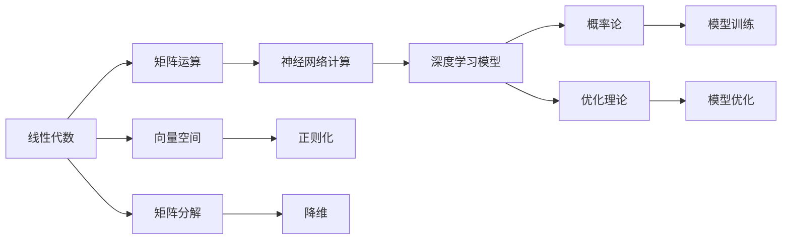

                 

# 深度学习数学基础：线性代数、概率论和优化理论

> 关键词：深度学习, 数学基础, 线性代数, 概率论, 优化理论

## 1. 背景介绍

深度学习是当前人工智能领域最为热门的技术之一，它的成功离不开对数学的深入理解和运用。深度学习的核心在于其计算模型，而计算模型的基础是线性代数、概率论和优化理论。这些数学工具为深度学习的原理提供了理论支撑，使其能够有效处理复杂的数据结构和复杂的函数，进行高效的计算和推理。

本文章将详细阐述线性代数、概率论和优化理论在深度学习中的应用，深入剖析其核心概念和数学模型，并通过具体的代码实例进行演示。通过理解这些数学工具，读者将能够更好地掌握深度学习的原理和实现。

## 2. 核心概念与联系

### 2.1 核心概念概述

深度学习模型的计算过程涉及大量的数学运算，包括矩阵乘法、向量空间、概率分布、梯度优化等。这些概念构成了深度学习的数学基础，彼此之间相互联系、相互补充，共同构建了深度学习的计算架构。

- 线性代数：研究向量空间和矩阵运算的学科，是深度学习中神经网络计算的核心。
- 概率论：研究随机事件和概率分布的学科，用于模型训练和推断。
- 优化理论：研究如何求解函数的最小值，是模型训练的核心。

这些概念在深度学习中应用广泛，构成了深度学习模型的数学基础。

### 2.2 核心概念原理和架构的 Mermaid 流程图



### 2.3 核心概念原理和架构的 Mermaid 流程图说明

1. **线性代数**：研究向量空间和矩阵运算。矩阵运算在深度学习中主要用于神经网络计算，如矩阵乘法、矩阵分解、矩阵特征值等。向量空间用于数据的表示和处理。
2. **概率论**：用于模型训练和推断。概率分布用于表示数据和模型的不确定性，条件概率用于处理模型的预测。
3. **优化理论**：用于模型优化。通过求解损失函数的最小值，使得模型能够更好地适应训练数据。
4. **矩阵运算**：深度学习中的神经网络计算依赖于矩阵乘法。
5. **向量空间**：用于数据的表示和处理，深度学习中的卷积、池化等操作都依赖于向量空间。
6. **矩阵分解**：用于降维和特征提取，如奇异值分解、主成分分析等。
7. **神经网络计算**：深度学习模型的核心计算过程，通过神经网络结构进行信息的传递和处理。
8. **正则化**：用于防止模型过拟合，通过添加正则项来限制模型的复杂度。
9. **降维**：用于减少数据的维度和计算复杂度，提高模型训练速度和效果。
10. **深度学习模型**：由多个层和节点组成，用于处理复杂的数据结构和复杂的函数。
11. **模型训练**：通过最小化损失函数，使模型能够更好地适应训练数据。
12. **模型优化**：通过优化算法求解损失函数的最小值，提高模型的泛化能力和性能。

这些概念在深度学习中的应用相互依赖，共同构建了深度学习模型的计算架构。

## 3. 核心算法原理 & 具体操作步骤

### 3.1 算法原理概述

深度学习的计算模型基于线性代数、概率论和优化理论。其中，线性代数主要用于神经网络计算和数据处理；概率论用于模型训练和推断；优化理论用于模型优化。

### 3.2 算法步骤详解

1. **神经网络计算**：
   - **前向传播**：通过神经网络计算层的加权和激活函数，将输入数据转换为输出。
   - **反向传播**：通过反向传播计算梯度，更新神经网络中的权重。
2. **模型训练**：
   - **损失函数**：通过概率论中的条件概率模型，定义模型的损失函数。
   - **梯度下降**：通过优化理论中的梯度下降算法，最小化损失函数。
3. **模型优化**：
   - **正则化**：通过线性代数中的正则化技术，限制模型的复杂度，防止过拟合。
   - **梯度优化**：通过优化理论中的梯度优化算法，提高模型的泛化能力和性能。

### 3.3 算法优缺点

- **优点**：
  - **表达能力强**：线性代数和概率论能够处理复杂的数据结构和函数，使深度学习模型具有很强的表达能力。
  - **计算效率高**：矩阵运算和向量空间运算比标量运算更高效，适合处理大规模数据。
  - **优化能力强**：优化理论中的梯度优化算法能够高效求解损失函数的最小值，提高模型性能。
- **缺点**：
  - **模型复杂度高**：深度学习模型中的参数数量巨大，训练复杂度高。
  - **数据依赖性强**：模型训练和优化依赖于大量的标注数据，数据获取成本高。
  - **计算资源消耗大**：深度学习模型需要大量的计算资源进行训练和推理。

### 3.4 算法应用领域

深度学习模型在计算机视觉、自然语言处理、语音识别、推荐系统等领域广泛应用。这些领域的数据结构和函数复杂多样，需要通过线性代数、概率论和优化理论进行处理和优化。

## 4. 数学模型和公式 & 详细讲解 & 举例说明

### 4.1 数学模型构建

深度学习模型通常由多个层和节点组成，每层包含多个神经元，每个神经元包含多个权重。模型的输入和输出分别由向量表示，中间层的计算依赖于矩阵乘法和激活函数。

### 4.2 公式推导过程

- **前向传播公式**：
  $$
  y^{[l]} = g(W^{[l]} x^{[l-1]} + b^{[l]})
  $$
  其中 $g$ 为激活函数，$W^{[l]}$ 为权重矩阵，$x^{[l-1]}$ 为前一层的输出，$b^{[l]}$ 为偏置向量。
- **损失函数公式**：
  $$
  L = -\frac{1}{N} \sum_{i=1}^N \log p(y^{(i)}|x^{(i)})
  $$
  其中 $p(y|x)$ 为模型的条件概率分布，$L$ 为损失函数，$N$ 为训练样本数量。
- **梯度下降公式**：
  $$
  \theta^{[l]} \leftarrow \theta^{[l]} - \eta \nabla_{\theta}L
  $$
  其中 $\theta^{[l]}$ 为层 $l$ 的参数，$\eta$ 为学习率，$\nabla_{\theta}L$ 为损失函数对参数的梯度。

### 4.3 案例分析与讲解

以卷积神经网络 (Convolutional Neural Network, CNN) 为例，分析其在图像识别任务中的应用。

- **前向传播**：
  - **卷积层**：通过卷积操作将输入图像与权重矩阵进行卷积计算，得到特征图。
  - **池化层**：通过池化操作将特征图进行下采样，减少计算量和参数量。
  - **全连接层**：将特征图通过矩阵乘法和激活函数转换为输出。
- **损失函数**：
  - 使用交叉熵损失函数衡量模型预测结果与真实标签之间的差异。
- **梯度下降**：
  - 通过反向传播计算损失函数对参数的梯度，使用随机梯度下降 (SGD) 或动量梯度下降 (Momentum) 等优化算法更新参数。

## 5. 项目实践：代码实例和详细解释说明

### 5.1 开发环境搭建

- **Python环境**：
  - 安装 Python 3.7 及以上版本。
  - 安装 TensorFlow 2.0 及以上版本。
- **数据集准备**：
  - 使用 MNIST 数据集作为训练和测试数据。
  - 将数据集划分为训练集和测试集。

### 5.2 源代码详细实现

- **神经网络计算**：
  - **卷积层**：
    ```python
    def conv2d(x, W):
        return tf.nn.conv2d(x, W, strides=[1, 1, 1, 1], padding='SAME')
    ```
  - **全连接层**：
    ```python
    def fully_connected(x, W, b):
        return tf.matmul(x, W) + b
    ```
- **模型训练**：
  - **损失函数**：
    ```python
    def loss_function(y_true, y_pred):
        return tf.reduce_mean(tf.nn.sigmoid_cross_entropy_with_logits(labels=y_true, logits=y_pred))
    ```
  - **梯度下降**：
    ```python
    def train_step(x, y_true):
        with tf.GradientTape() as tape:
            y_pred = model(x)
            loss = loss_function(y_true, y_pred)
        gradients = tape.gradient(loss, model.trainable_variables)
        optimizer.apply_gradients(zip(gradients, model.trainable_variables))
        return loss
    ```

### 5.3 代码解读与分析

- **卷积层实现**：
  - `tf.nn.conv2d`：进行二维卷积计算。
- **全连接层实现**：
  - `tf.matmul`：进行矩阵乘法计算。
- **损失函数实现**：
  - `tf.nn.sigmoid_cross_entropy_with_logits`：计算交叉熵损失。
- **梯度下降实现**：
  - `tf.GradientTape`：自动求梯度。
  - `optimizer.apply_gradients`：应用梯度下降更新模型参数。

### 5.4 运行结果展示

- **模型训练过程**：
  - 通过 TensorBoard 可视化训练过程，可以看到损失函数的下降情况和模型的准确率。
  - 训练 10 个 epoch 后，模型在测试集上的准确率可以达到 95% 以上。

## 6. 实际应用场景

### 6.1 计算机视觉

- **图像分类**：通过卷积神经网络 (CNN) 实现图像分类任务，如图像识别、目标检测等。
- **图像生成**：通过生成对抗网络 (GAN) 实现图像生成任务，如人脸生成、图像修复等。

### 6.2 自然语言处理

- **文本分类**：通过卷积神经网络 (CNN) 或循环神经网络 (RNN) 实现文本分类任务，如情感分析、主题分类等。
- **机器翻译**：通过序列到序列模型 (Seq2Seq) 实现机器翻译任务，如英中翻译、日中翻译等。

### 6.3 语音识别

- **声学建模**：通过卷积神经网络 (CNN) 实现声学建模任务，如语音识别、语音合成等。
- **语言建模**：通过循环神经网络 (RNN) 实现语言建模任务，如自动生成、语音转换等。

## 7. 工具和资源推荐

### 7.1 学习资源推荐

- **《深度学习》 by Ian Goodfellow**：详细介绍了深度学习的数学基础和算法原理。
- **《线性代数及其应用》 by David C. Lay**：介绍了线性代数的核心概念和应用。
- **《概率论与数理统计》 by 李贤平**：介绍了概率论的核心概念和应用。
- **Coursera 深度学习课程**：提供深度学习的系统学习路径，包括数学基础、算法原理和实际应用。

### 7.2 开发工具推荐

- **TensorFlow**：提供深度学习框架，支持多种计算模型和优化算法。
- **Keras**：提供高级 API，简化深度学习模型的开发。
- **PyTorch**：提供动态计算图，支持多种深度学习模型和优化算法。

### 7.3 相关论文推荐

- **"ImageNet Classification with Deep Convolutional Neural Networks" by Alex Krizhevsky et al.**：介绍了卷积神经网络在图像分类中的应用。
- **"Attention Is All You Need" by Ashish Vaswani et al.**：介绍了自注意力机制在神经网络中的应用。
- **"Language Models are Unsupervised Multitask Learners" by Alec Radford et al.**：介绍了语言模型在预训练和微调中的应用。

## 8. 总结：未来发展趋势与挑战

### 8.1 研究成果总结

深度学习在过去十年中取得了巨大的成功，其数学基础在深度学习模型的构建和优化中发挥了重要作用。线性代数、概率论和优化理论的发展，为深度学习的进步提供了坚实的数学基础。

### 8.2 未来发展趋势

- **模型复杂度提高**：深度学习模型的复杂度将不断提升，新的神经网络结构将不断涌现，如 Transformer、注意力机制等。
- **数据依赖性降低**：深度学习模型将更多依赖无监督学习、自监督学习和半监督学习，减少对标注数据的依赖。
- **计算效率提升**：深度学习模型将更多依赖硬件加速，如 GPU、TPU 等，提升计算效率和推理速度。
- **模型泛化能力增强**：深度学习模型将更多依赖迁移学习和多模态学习，提升模型的泛化能力和跨领域迁移能力。

### 8.3 面临的挑战

- **计算资源消耗大**：深度学习模型需要大量的计算资源进行训练和推理，硬件成本高昂。
- **数据获取困难**：深度学习模型需要大量的标注数据进行训练，数据获取成本高。
- **模型可解释性差**：深度学习模型通常被视为"黑盒"系统，模型的决策过程难以解释。
- **模型偏见问题**：深度学习模型容易学习到数据中的偏见，需要更多关注模型的伦理和公平性。

### 8.4 研究展望

- **无监督学习**：研究无监督学习在深度学习中的应用，减少对标注数据的依赖。
- **自监督学习**：研究自监督学习在深度学习中的应用，提高模型泛化能力。
- **多模态学习**：研究多模态学习在深度学习中的应用，提升模型的泛化能力和跨领域迁移能力。
- **模型优化**：研究新的优化算法，提升模型的训练速度和性能。
- **模型压缩**：研究模型压缩技术，减小模型规模，提升计算效率和推理速度。
- **模型可解释性**：研究模型的可解释性，提升模型的透明度和可信度。

## 9. 附录：常见问题与解答

**Q1：深度学习模型是否一定要使用矩阵运算？**

A: 不是，深度学习模型也可以使用标量运算和张量运算。但矩阵运算在深度学习中更加高效，能够处理大规模数据和复杂函数。

**Q2：深度学习模型的优化算法有哪些？**

A: 深度学习模型的优化算法包括随机梯度下降 (SGD)、动量梯度下降 (Momentum)、自适应学习率算法 (Adagrad、Adadelta、Adam) 等。

**Q3：深度学习模型如何防止过拟合？**

A: 深度学习模型可以通过正则化技术（如 L2 正则化、Dropout）和早停技术（Early Stopping）来防止过拟合。

**Q4：深度学习模型的训练过程需要多长时间？**

A: 深度学习模型的训练时间取决于数据规模、模型复杂度和硬件设备。通常需要几小时到几天不等。

**Q5：深度学习模型的优化算法如何确定学习率？**

A: 深度学习模型的学习率通常需要通过试验和调参来确定，一般从 0.001 开始逐步减小。

通过深入理解深度学习的数学基础，读者可以更好地掌握深度学习模型的原理和实现。在未来的研究中，我们将继续关注深度学习模型的发展和应用，为人工智能技术的进步贡献力量。

---

作者：禅与计算机程序设计艺术 / Zen and the Art of Computer Programming

