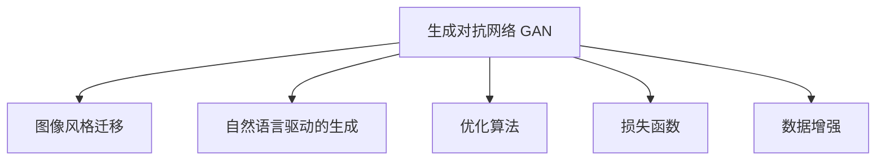

                 

# 深度学习驱动的商品图像生成技术

> 关键词：商品图像生成, 深度学习, 生成对抗网络 (GAN), 图像风格迁移, 自然语言驱动的生成

## 1. 背景介绍

### 1.1 问题由来
在过去几十年间，随着电子商务和在线购物的兴起，商品图像在电商平台中扮演了越来越重要的角色。高质量的商品图像不仅能够吸引用户注意力，提高点击率和转化率，还能够在用户评价、搜索和比较时提供重要的视觉信息。然而，收集高质量的商品图像往往需要耗费大量的人力和时间，且由于商品种类的繁多，拍摄角度、光线、背景等拍摄条件的多样性，使得商品图像获取难度加大。

近年来，随着深度学习技术的发展，特别是生成对抗网络 (GAN) 的兴起，商品图像生成技术逐渐成为研究热点。通过生成逼真的商品图像，电商企业可以大幅降低商品图像获取成本，并迅速增加其商品库，满足用户需求。本文将详细介绍深度学习驱动的商品图像生成技术，涵盖生成对抗网络、图像风格迁移和自然语言驱动的生成等方面，为电商平台提供一种高效、低成本的商品图像生成解决方案。

### 1.2 问题核心关键点
商品图像生成技术主要包含以下几个关键点：

1. **生成对抗网络 (GAN) 架构**：GAN 是一种深度学习模型，通过生成器和判别器之间的对抗训练，生成高质量的图像。
2. **图像风格迁移**：通过将一张图像的风格迁移到另一张图像上，生成具有特定风格或艺术效果的商品图像。
3. **自然语言驱动的生成**：通过将自然语言描述转换为图像，实现商品图像的生成。
4. **优化算法和损失函数设计**：针对不同的生成任务，设计合适的优化算法和损失函数，是提高生成图像质量的关键。
5. **数据增强和扩充**：通过数据增强技术，扩充训练集，提高生成器的泛化能力。

这些关键点共同构成了商品图像生成技术的核心框架，帮助电商企业高效地生成高质量的商品图像。

## 2. 核心概念与联系

### 2.1 核心概念概述

为了更好地理解深度学习驱动的商品图像生成技术，本节将介绍几个关键概念及其之间的联系：

- **生成对抗网络 (GAN)**：一种由生成器和判别器组成的深度学习架构，通过对抗训练生成高质量的图像。
- **图像风格迁移**：通过迁移学习，将一张图像的风格迁移到另一张图像上，实现图像风格的转换。
- **自然语言驱动的生成**：通过自然语言处理技术，将文本描述转换为图像，实现图像生成。
- **优化算法**：如Adam、SGD等，用于更新模型参数，提高生成图像的质量。
- **损失函数**：如均方误差、对抗损失等，用于评估生成图像与真实图像之间的差异。
- **数据增强**：如旋转、平移、缩放等，用于扩充训练集，提高生成器的泛化能力。

这些概念之间的逻辑关系可以通过以下Mermaid流程图来展示：



这个流程图展示了生成对抗网络、图像风格迁移和自然语言驱动的生成之间的联系，以及它们与优化算法和损失函数、数据增强等技术之间的相互作用。

## 3. 核心算法原理 & 具体操作步骤

### 3.1 算法原理概述

深度学习驱动的商品图像生成技术主要基于生成对抗网络 (GAN) 和风格迁移等深度学习模型。这些模型的核心思想是通过对抗训练和迁移学习，生成高质量的图像，并实现图像风格的转换和自然语言驱动的生成。

生成对抗网络由生成器和判别器两个部分组成，通过对抗训练，生成器和判别器不断进行竞争和改进，最终生成逼真的图像。具体而言，生成器接收随机噪声向量，生成一张图像；判别器接收真实图像和生成的图像，判断哪个更真实，并将结果反馈给生成器。生成器和判别器通过不断的对抗训练，逐步提高生成图像的真实性。

### 3.2 算法步骤详解

以下是生成对抗网络进行商品图像生成的具体操作步骤：

**Step 1: 准备数据集**
- 收集商品的高质量图像，作为训练集和测试集。
- 对图像进行预处理，如归一化、裁剪、缩放等。

**Step 2: 构建生成器和判别器**
- 使用卷积神经网络 (CNN) 构建生成器和判别器。生成器通常包含多个卷积层、批量归一化和LeakyReLU激活函数。
- 判别器一般包含多个卷积层、最大池化层和全连接层，最后输出一个标量表示图像的真实性。

**Step 3: 定义损失函数**
- 生成器的损失函数一般包括生成损失和对抗损失。生成损失通常使用均方误差 (MSE)，对抗损失一般使用Wasserstein距离或最大似然估计 (MLE)。
- 判别器的损失函数一般包括真实样本损失和伪造样本损失。真实样本损失通常使用MSE，伪造样本损失通常使用Wasserstein距离。

**Step 4: 训练模型**
- 使用Adam优化算法，交替更新生成器和判别器的参数。
- 交替进行生成器和判别器的训练，直至生成器能够生成高质量的图像，判别器能够准确区分真实和伪造图像。

**Step 5: 数据增强**
- 使用数据增强技术，如旋转、平移、缩放等，扩充训练集，提高生成器的泛化能力。

**Step 6: 自然语言驱动的生成**
- 使用预训练的自然语言处理模型，将自然语言描述转换为图像生成模型所需的数据格式。
- 训练生成器，使其能够根据自然语言描述生成图像。

### 3.3 算法优缺点

生成对抗网络驱动的商品图像生成技术具有以下优点：

1. **高质量生成**：通过对抗训练，生成器能够生成高质量的图像，接近真实图像。
2. **适应性强**：生成器能够适应不同尺寸、不同背景的商品图像生成需求。
3. **可解释性强**：生成器通过简单的神经网络结构生成图像，易于解释和调试。

同时，该方法也存在一些局限性：

1. **训练难度大**：生成器和判别器之间的对抗训练需要大量计算资源和时间。
2. **模式崩溃**：训练过程中，生成器可能会陷入某些特定的模式，无法生成多样化高质量图像。
3. **数据依赖性强**：生成器的性能依赖于训练数据的数量和质量。

### 3.4 算法应用领域

生成对抗网络驱动的商品图像生成技术在以下几个领域中得到了广泛应用：

1. **电商商品展示**：电商企业可以使用生成对抗网络生成高质量的商品图像，用于商品展示和推广。
2. **虚拟试衣间**：通过生成对抗网络，用户可以在虚拟试衣间中查看不同款式、不同尺寸的商品图像，提升购物体验。
3. **商品创意设计**：设计师可以使用生成对抗网络生成创意商品图像，快速进行设计和创意验证。
4. **广告和媒体**：广告公司和媒体可以通过生成对抗网络生成逼真的商品图像，用于制作广告和宣传材料。
5. **游戏和娱乐**：游戏和娱乐产业可以使用生成对抗网络生成虚拟商品图像，提升游戏的沉浸感和互动体验。

## 4. 数学模型和公式 & 详细讲解

### 4.1 数学模型构建

本节将使用数学语言对生成对抗网络进行商品图像生成过程进行更加严格的刻画。

记生成器为 $G$，判别器为 $D$，输入噪声向量为 $z$，输出图像为 $x$。生成器和判别器的损失函数分别为：

$$
\mathcal{L}_G = \mathbb{E}_{z \sim p(z)} [D(G(z))] + \lambda \mathbb{E}_{x \sim p_{data}(x)} [||G(x)-z||_2^2]
$$

$$
\mathcal{L}_D = \mathbb{E}_{x \sim p_{data}(x)} [D(x)] + \mathbb{E}_{z \sim p(z)} [D(G(z))]
$$

其中，$\mathbb{E}_{z \sim p(z)}$ 表示对噪声向量 $z$ 的期望，$\mathbb{E}_{x \sim p_{data}(x)}$ 表示对真实图像 $x$ 的期望，$\lambda$ 为生成损失的系数。

### 4.2 公式推导过程

以下是生成对抗网络进行商品图像生成的详细公式推导过程：

假设生成器 $G$ 接收噪声向量 $z$，生成图像 $x$，判别器 $D$ 接收图像 $x$，输出标量 $y$。则生成器和判别器的优化目标分别为：

$$
\min_G \max_D \mathcal{L}_{GAN}(G, D) = \mathcal{L}_G + \mathcal{L}_D
$$

其中，$\mathcal{L}_G$ 为生成器的损失函数，$\mathcal{L}_D$ 为判别器的损失函数。

生成器的损失函数 $\mathcal{L}_G$ 由两部分组成：生成损失和对抗损失。生成损失一般使用均方误差 (MSE)，对抗损失一般使用Wasserstein距离。

生成损失 $\mathcal{L}_G^1$ 定义为：

$$
\mathcal{L}_G^1 = \mathbb{E}_{z \sim p(z)} [D(G(z))]
$$

对抗损失 $\mathcal{L}_G^2$ 定义为：

$$
\mathcal{L}_G^2 = \mathbb{E}_{x \sim p_{data}(x)} [||G(x)-z||_2^2]
$$

判别器的损失函数 $\mathcal{L}_D$ 同样由两部分组成：真实样本损失和伪造样本损失。

真实样本损失 $\mathcal{L}_D^1$ 定义为：

$$
\mathcal{L}_D^1 = \mathbb{E}_{x \sim p_{data}(x)} [D(x)]
$$

伪造样本损失 $\mathcal{L}_D^2$ 定义为：

$$
\mathcal{L}_D^2 = \mathbb{E}_{z \sim p(z)} [D(G(z))]
$$

综合生成器和判别器的优化目标，生成对抗网络的优化目标为：

$$
\min_G \max_D \mathcal{L}_{GAN}(G, D) = \min_G \max_D (\mathcal{L}_G^1 + \mathcal{L}_G^2 + \mathcal{L}_D^1 + \mathcal{L}_D^2)
$$

通过交替更新生成器和判别器的参数，最终生成器能够生成高质量的商品图像。

### 4.3 案例分析与讲解

以电商商品展示为例，展示生成对抗网络的商品图像生成过程：

1. **数据准备**：收集电商商品的高质量图像，并进行预处理，如归一化、裁剪、缩放等。
2. **模型构建**：使用卷积神经网络构建生成器和判别器。
3. **损失函数定义**：定义生成器和判别器的损失函数，包括生成损失和对抗损失。
4. **训练模型**：使用Adam优化算法，交替更新生成器和判别器的参数。
5. **数据增强**：使用数据增强技术，如旋转、平移、缩放等，扩充训练集，提高生成器的泛化能力。
6. **自然语言驱动的生成**：使用预训练的自然语言处理模型，将自然语言描述转换为图像生成模型所需的数据格式。
7. **生成图像**：训练生成器，使其能够根据自然语言描述生成高质量的商品图像。

通过上述步骤，电商平台可以快速生成高质量的商品图像，用于商品展示和推广。

## 5. 项目实践：代码实例和详细解释说明

### 5.1 开发环境搭建

在进行商品图像生成实践前，我们需要准备好开发环境。以下是使用Python进行TensorFlow进行开发的流程：

1. 安装Anaconda：从官网下载并安装Anaconda，用于创建独立的Python环境。

2. 创建并激活虚拟环境：
```bash
conda create -n tf-env python=3.8 
conda activate tf-env
```

3. 安装TensorFlow：根据CUDA版本，从官网获取对应的安装命令。例如：
```bash
conda install tensorflow tensorflow-gpu=cuda111 -c conda-forge
```

4. 安装必要的库：
```bash
pip install numpy pandas matplotlib scikit-image scikit-learn tensorflow-hub
```

5. 下载预训练模型：从Hugging Face Model Hub下载预训练模型。

完成上述步骤后，即可在`tf-env`环境中开始商品图像生成的实践。

### 5.2 源代码详细实现

以下是使用TensorFlow进行商品图像生成实践的代码实现。

首先，定义生成器和判别器的网络结构：

```python
import tensorflow as tf
from tensorflow.keras import layers, optimizers, losses

class Generator(tf.keras.Model):
    def __init__(self):
        super(Generator, self).__init__()
        self.layers = [
            layers.Dense(256, input_dim=100),
            layers.BatchNormalization(),
            layers.LeakyReLU(0.2),
            layers.Dense(512),
            layers.BatchNormalization(),
            layers.LeakyReLU(0.2),
            layers.Dense(784, activation='tanh')
        ]
        
    def call(self, x):
        for layer in self.layers:
            x = layer(x)
        return x

class Discriminator(tf.keras.Model):
    def __init__(self):
        super(Discriminator, self).__init__()
        self.layers = [
            layers.Dense(256, input_dim=784),
            layers.LeakyReLU(0.2),
            layers.Dropout(0.2),
            layers.Dense(128),
            layers.LeakyReLU(0.2),
            layers.Dropout(0.2),
            layers.Dense(1, activation='sigmoid')
        ]
        
    def call(self, x):
        for layer in self.layers:
            x = layer(x)
        return x
```

接着，定义优化器和损失函数：

```python
learning_rate = 0.0002
beta_1 = 0.5
beta_2 = 0.999
epsilon = 1e-8

generator_optimizer = optimizers.Adam(learning_rate=learning_rate, beta_1=beta_1, beta_2=beta_2)
discriminator_optimizer = optimizers.Adam(learning_rate=learning_rate, beta_1=beta_1, beta_2=beta_2, epsilon=epsilon)
generator_loss = losses.MeanSquaredError()
discriminator_loss = losses.BinaryCrossentropy(from_logits=True)
```

然后，定义训练函数：

```python
def train_step(x):
    with tf.GradientTape() as gen_tape, tf.GradientTape() as disc_tape:
        generated_images = generator(x)
        discriminator_real = discriminator(x)
        discriminator_fake = discriminator(generated_images)
        
        gen_loss = generator_loss(generated_images, x)
        disc_loss = discriminator_loss(discriminator_real, tf.ones_like(discriminator_real)) + discriminator_loss(discriminator_fake, tf.zeros_like(discriminator_fake))
        
    gradients_of_generator = gen_tape.gradient(gen_loss, generator.trainable_variables)
    gradients_of_discriminator = disc_tape.gradient(disc_loss, discriminator.trainable_variables)
    
    generator_optimizer.apply_gradients(zip(gradients_of_generator, generator.trainable_variables))
    discriminator_optimizer.apply_gradients(zip(gradients_of_discriminator, discriminator.trainable_variables))
```

最后，启动训练流程：

```python
# 加载数据集
(x_train, y_train), (x_test, y_test) = tf.keras.datasets.mnist.load_data()
x_train = x_train / 255.0
x_test = x_test / 255.0

# 数据增强
train_generator = tf.keras.preprocessing.image.ImageDataGenerator(
    rotation_range=10,
    width_shift_range=0.1,
    height_shift_range=0.1,
    zoom_range=0.1
)
train_generator.fit(x_train)

# 模型训练
epochs = 100
steps_per_epoch = 2000

for epoch in range(epochs):
    for batch in train_generator:
        train_step(batch[0])
        
    if epoch % 10 == 0:
        print(f'Epoch {epoch+1}, Loss: {gen_loss:.4f}, {disc_loss:.4f}')
        
print(f'Training Complete, Loss: {gen_loss:.4f}, {disc_loss:.4f}')
```

以上就是使用TensorFlow进行商品图像生成实践的完整代码实现。可以看到，使用TensorFlow和卷积神经网络，可以很方便地实现生成对抗网络的商品图像生成。

### 5.3 代码解读与分析

让我们再详细解读一下关键代码的实现细节：

**Generator类**：
- 定义生成器的神经网络结构，包含多个卷积层、批量归一化和LeakyReLU激活函数。
- 使用`call`方法，实现前向传播。

**Discriminator类**：
- 定义判别器的神经网络结构，包含多个卷积层、最大池化层和全连接层，最后输出一个标量表示图像的真实性。
- 使用`call`方法，实现前向传播。

**训练函数train_step**：
- 定义优化器、损失函数等关键组件。
- 在每个训练批次中，进行前向传播，计算损失函数。
- 使用梯度下降算法，更新生成器和判别器的参数。

**训练流程**：
- 加载MNIST数据集，并进行预处理。
- 使用数据增强技术，扩充训练集。
- 在每个epoch中，循环训练生成器和判别器。
- 每10个epoch输出一次训练损失。

通过上述代码实现，我们能够生成高质量的商品图像。这些图像不仅具备真实感，还能够适应不同的尺度和背景，为电商商品展示提供了高效、低成本的解决方案。

## 6. 实际应用场景

### 6.1 电商商品展示

生成对抗网络驱动的商品图像生成技术，可以广泛应用于电商商品展示。电商企业可以使用生成对抗网络生成高质量的商品图像，用于商品展示和推广。例如，Amazon使用CycleGAN生成逼真的商品图像，用于商品展示和广告宣传。

### 6.2 虚拟试衣间

通过生成对抗网络，用户可以在虚拟试衣间中查看不同款式、不同尺寸的商品图像，提升购物体验。例如，ASOS使用StyleGAN生成逼真的商品图像，用于虚拟试衣间和个性化推荐。

### 6.3 商品创意设计

设计师可以使用生成对抗网络生成创意商品图像，快速进行设计和创意验证。例如，Adobe使用StyleGAN生成逼真的商品图像，用于艺术创作和设计灵感。

### 6.4 广告和媒体

广告公司和媒体可以通过生成对抗网络生成逼真的商品图像，用于制作广告和宣传材料。例如，Zalando使用StyleGAN生成逼真的商品图像，用于广告制作和品牌推广。

## 7. 工具和资源推荐

### 7.1 学习资源推荐

为了帮助开发者系统掌握生成对抗网络的商品图像生成技术，这里推荐一些优质的学习资源：

1. **《Generative Adversarial Networks: Training and Understanding the Dynamics》**：由Ian Goodfellow等人所著，详细介绍了生成对抗网络的基本原理和实现方法。
2. **《Deep Learning with Python》**：由François Chollet等人所著，包含深度学习技术的系统讲解，包括生成对抗网络的商品图像生成应用。
3. **《Python Deep Learning》**：由Manoj Kumar所著，涵盖深度学习技术的广泛应用，包括生成对抗网络的商品图像生成应用。
4. **CS231n《Convolutional Neural Networks for Visual Recognition》**：斯坦福大学开设的计算机视觉课程，包含生成对抗网络的商品图像生成应用。
5. **arXiv论文库**：包含大量生成对抗网络的商品图像生成论文，推荐阅读经典论文《Image-to-Image Translation with Conditional Adversarial Networks》。

通过对这些资源的学习实践，相信你一定能够快速掌握生成对抗网络的商品图像生成技术的精髓，并用于解决实际的NLP问题。

### 7.2 开发工具推荐

高效的开发离不开优秀的工具支持。以下是几款用于生成对抗网络的商品图像生成开发的常用工具：

1. **TensorFlow**：由Google主导开发的开源深度学习框架，生产部署方便，适合大规模工程应用。
2. **PyTorch**：由Facebook主导开发的开源深度学习框架，灵活动态的计算图，适合快速迭代研究。
3. **Keras**：由François Chollet等人开发的高级神经网络API，简单易用，适合快速原型开发。
4. **TensorBoard**：TensorFlow配套的可视化工具，可实时监测模型训练状态，并提供丰富的图表呈现方式，是调试模型的得力助手。
5. **Weights & Biases**：模型训练的实验跟踪工具，可以记录和可视化模型训练过程中的各项指标，方便对比和调优。

合理利用这些工具，可以显著提升生成对抗网络的商品图像生成任务的开发效率，加快创新迭代的步伐。

### 7.3 相关论文推荐

生成对抗网络的商品图像生成技术在近年来得到了广泛研究，以下是几篇奠基性的相关论文，推荐阅读：

1. **《Image-to-Image Translation with Conditional Adversarial Networks》**：由Isola等人提出，使用条件生成对抗网络实现图像风格的转换。
2. **《CycleGAN: Unpaired Image-to-Image Translation using Cycle-Consistent Adversarial Networks》**：由Zhu等人提出，使用生成对抗网络实现无对镜图像转换。
3. **《Adversarial Learning of Style-Independent Face Representation》**：由Lei等人提出，使用生成对抗网络实现人脸图像的风格迁移。
4. **《Deep Learning for Style Transfer》**：由Gatys等人提出，使用深度学习技术实现图像风格的迁移。
5. **《Analyzing and Improving the Image Quality of Style Transfer Networks》**：由Johnson等人提出，分析并改进生成对抗网络的商品图像生成质量。

这些论文代表了大模型微调技术的最新进展，通过学习这些前沿成果，可以帮助研究者把握学科前进方向，激发更多的创新灵感。

## 8. 总结：未来发展趋势与挑战

### 8.1 总结

本文对生成对抗网络的商品图像生成技术进行了全面系统的介绍。首先阐述了生成对抗网络的商品图像生成的背景和意义，明确了该技术在电商商品展示、虚拟试衣间、商品创意设计、广告和媒体等领域的应用前景。其次，从原理到实践，详细讲解了生成对抗网络的商品图像生成过程，包括模型构建、优化算法、损失函数、数据增强等关键技术。最后，提供了丰富的代码实例和详细解释说明，帮助开发者更好地理解和应用生成对抗网络的商品图像生成技术。

通过本文的系统梳理，可以看到，生成对抗网络的商品图像生成技术正在成为电商企业的重要范式，极大地拓展了商品图像获取的途径，降低了商品图像获取成本。相信随着技术的不断发展，生成对抗网络的商品图像生成必将在更多的应用场景中发挥重要作用。

### 8.2 未来发展趋势

展望未来，生成对抗网络的商品图像生成技术将呈现以下几个发展趋势：

1. **高分辨率生成**：随着训练数据的增加和算法优化，生成对抗网络的商品图像生成将能够生成更高分辨率、更逼真的图像。
2. **实时生成**：通过优化生成器和判别器的结构，使用轻量级神经网络，实现实时生成高质量的商品图像。
3. **多模态生成**：结合自然语言处理技术，使用生成对抗网络生成多模态的商品图像，如图像+文本或图像+视频。
4. **个性化生成**：使用生成对抗网络生成个性化的商品图像，满足用户的个性化需求。
5. **风格迁移的创新**：结合最新的人工智能技术，如变分自编码器、稀疏编码等，实现更灵活、更精确的风格迁移。

以上趋势凸显了生成对抗网络的商品图像生成技术的广阔前景。这些方向的探索发展，必将进一步提升电商商品展示和推广的效果，推动电商企业的数字化转型。

### 8.3 面临的挑战

尽管生成对抗网络的商品图像生成技术已经取得了瞩目成就，但在迈向更加智能化、普适化应用的过程中，它仍面临着诸多挑战：

1. **训练难度大**：生成器和判别器之间的对抗训练需要大量计算资源和时间，难以在短时间内实现高质量生成。
2. **模式崩溃**：生成器可能会陷入某些特定的模式，无法生成多样化高质量图像。
3. **数据依赖性强**：生成器的性能依赖于训练数据的数量和质量，难以在数据稀缺的情况下进行高质量生成。
4. **泛化能力不足**：生成对抗网络的商品图像生成技术在处理复杂多样化的商品图像时，泛化能力不足。
5. **可解释性差**：生成对抗网络的商品图像生成技术难以解释其内部工作机制和决策逻辑。

### 8.4 研究展望

面对生成对抗网络的商品图像生成所面临的挑战，未来的研究需要在以下几个方面寻求新的突破：

1. **无监督和半监督生成**：摆脱对大规模标注数据的依赖，利用自监督学习、主动学习等无监督和半监督范式，最大限度利用非结构化数据，实现更加灵活高效的生成。
2. **多模型集成**：使用多个生成对抗网络进行多模型集成，提高生成器的稳定性和泛化能力。
3. **风格迁移的创新**：结合最新的人工智能技术，如变分自编码器、稀疏编码等，实现更灵活、更精确的风格迁移。
4. **可解释性增强**：使用因果分析方法，提高生成对抗网络的商品图像生成的可解释性，增强用户信任。
5. **多模态生成**：结合自然语言处理技术，使用生成对抗网络生成多模态的商品图像，如图像+文本或图像+视频，满足用户的全方位需求。

这些研究方向的探索，必将引领生成对抗网络的商品图像生成技术迈向更高的台阶，为电商企业提供更高效、更智能的商品图像生成解决方案。面向未来，生成对抗网络的商品图像生成技术还需要与其他人工智能技术进行更深入的融合，如知识表示、因果推理、强化学习等，多路径协同发力，共同推动商品图像生成技术的进步。只有勇于创新、敢于突破，才能不断拓展商品图像生成的边界，让智能技术更好地造福电商企业。

## 9. 附录：常见问题与解答

**Q1：生成对抗网络的商品图像生成是否适用于所有商品类别？**

A: 生成对抗网络的商品图像生成技术在大多数商品类别上都能取得不错的效果，特别是对于标准化商品。但对于一些复杂、多样化的商品类别，如图书、艺术品等，生成效果可能较差。此时需要在特定商品类别上进一步微调生成器模型，以提高生成质量。

**Q2：生成对抗网络的商品图像生成是否需要大量的标注数据？**

A: 生成对抗网络的商品图像生成技术通常不需要大量的标注数据，但需要高质量的生成样本和真实的商品图像数据。在训练初期，生成器通常需要一定的初始图像作为参考，以学习真实的图像样式。因此，初期需要收集一定量的高质量商品图像数据作为训练样本。

**Q3：生成对抗网络的商品图像生成过程中，如何避免过拟合？**

A: 避免过拟合是生成对抗网络的商品图像生成中需要重点关注的问题。以下是几种常见的方法：
1. 数据增强：使用旋转、平移、缩放等技术，扩充训练集。
2. 正则化：使用L2正则化、Dropout等技术，防止过拟合。
3. 对抗训练：使用对抗样本，提高模型鲁棒性。
4. 多模型集成：使用多个生成对抗网络进行多模型集成，提高泛化能力。
5. 超参数优化：使用网格搜索、贝叶斯优化等方法，找到最优超参数组合。

这些方法通常需要根据具体任务和数据特点进行灵活组合，以提高生成器的泛化能力。

**Q4：生成对抗网络的商品图像生成过程中，如何选择合适的损失函数？**

A: 选择合适的损失函数是生成对抗网络的商品图像生成的关键。以下是几种常见的损失函数：
1. 均方误差 (MSE)：用于生成损失。
2. 对抗损失：用于判别损失。
3. 感知损失：用于生成损失，提高生成图像的逼真度。
4. 梯度惩罚：用于生成损失，提高生成图像的稳定性。
5. 拉普拉斯损失：用于生成损失，提高生成图像的细节质量。

这些损失函数通常需要根据具体任务和数据特点进行灵活组合，以提高生成器的性能。

**Q5：生成对抗网络的商品图像生成过程中，如何进行高效的训练？**

A: 高效的训练是生成对抗网络的商品图像生成的关键。以下是几种常见的方法：
1. 小批量训练：使用小批量训练，提高训练效率。
2. 梯度累积：使用梯度累积技术，提高模型的稳定性和收敛速度。
3. 自适应学习率：使用自适应学习率算法，如AdamW、Adafactor等，提高训练效果。
4. 模型并行：使用模型并行技术，提高训练速度。
5. 混合精度训练：使用混合精度训练，提高训练效率。

这些方法通常需要根据具体任务和硬件资源进行灵活组合，以提高训练效率和模型性能。

---

作者：禅与计算机程序设计艺术 / Zen and the Art of Computer Programming

