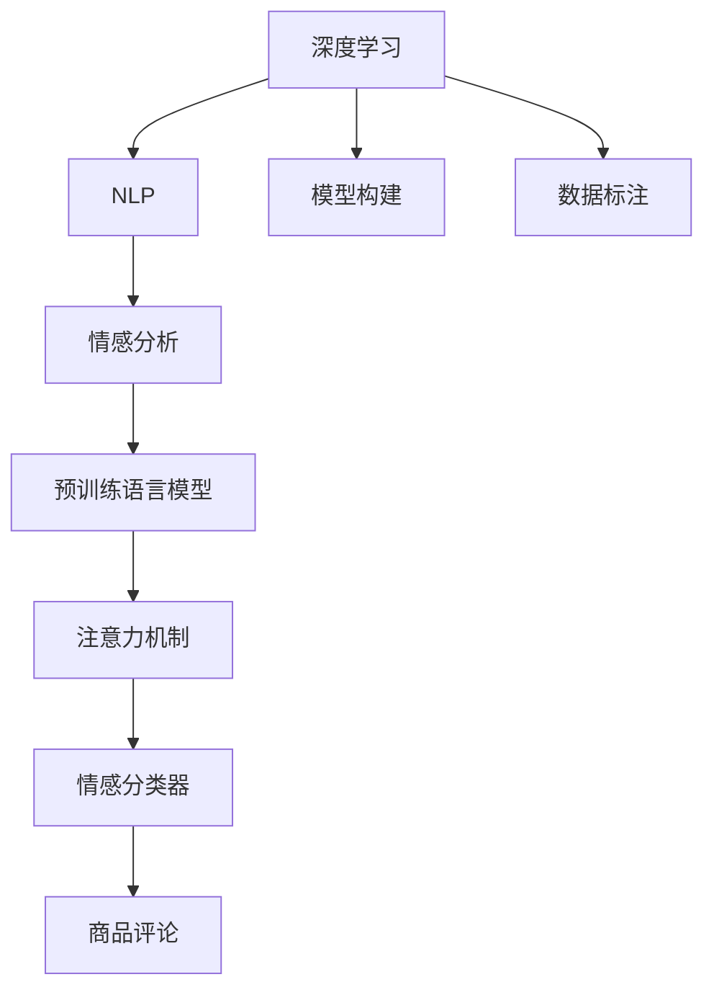

                 

# 深度学习驱动的商品评论情感分析

> 关键词：情感分析,深度学习,商品评论,自然语言处理(NLP),Transformer,BERT,注意力机制,情感分类器

## 1. 背景介绍

随着电商行业的发展，商品评论已成为用户表达满意度的重要渠道。如何自动地从大量评论文本中提取情感信息，分析用户情绪，对商家优化产品、提升用户体验具有重要意义。情感分析，作为自然语言处理(NLP)领域的一个重要分支，正成为电子商务、社交媒体、金融服务、医疗健康等多个行业的热门需求。

### 1.1 问题由来
情感分析是指通过文本数据挖掘技术，自动识别和提取文本中的情感信息，并对其情感极性进行分类。传统的基于词典和规则的情感分析方法，往往依赖人工定义的情感词典，难以处理复杂的情感表达。而随着深度学习技术的发展，基于神经网络模型的情感分析方法逐渐崭露头角，其中基于Transformer的模型表现尤为突出。

特别是近年来，基于BERT等预训练语言模型的情感分析方法，在多个公开数据集上取得了显著效果，推动了情感分析技术在商业应用中的落地。因此，本文将介绍一种基于深度学习驱动的商品评论情感分析方法，涵盖其核心原理、具体操作步骤、优缺点、应用场景，并结合实例，深入分析其实现细节。

### 1.2 问题核心关键点
深度学习驱动的商品评论情感分析方法主要基于预训练语言模型，特别是Transformer结构和BERT模型。其核心在于如何利用预训练语言模型，对商品评论进行微调，使其能够自动提取并分类情感信息。

具体而言，主要关注以下几个关键点：
1. 选择合适的预训练语言模型。
2. 设计适合的训练数据集，并标注情感信息。
3. 设计有效的情感分类器。
4. 微调模型的参数，提升情感分类性能。
5. 优化模型的推理速度和计算效率。

## 2. 核心概念与联系

### 2.1 核心概念概述

为更好地理解基于深度学习的商品评论情感分析方法，本文将介绍几个密切相关的核心概念：

- 深度学习(Deep Learning)：一种通过多层次的神经网络结构进行特征学习的方法。深度学习在图像识别、语音识别、自然语言处理等领域都取得了显著成效。

- 自然语言处理(NLP)：一种处理和分析人类语言的技术。NLP涵盖了从文本处理、语音识别到机器翻译、情感分析等多个子领域。

- 情感分析(Sentiment Analysis)：通过文本挖掘技术，自动识别和提取文本中的情感信息，并对其情感极性进行分类，是NLP中的一个重要子任务。

- 预训练语言模型(Pre-trained Language Models)：通过大规模无标签文本数据进行预训练的语言模型。常见的预训练模型包括BERT、GPT等。

- 注意力机制(Attention Mechanism)：一种在神经网络中用于突出关键信息的机制。在情感分析中，通过注意力机制可以更好地聚焦于影响情感的关键文本片段。

- 情感分类器(Sentiment Classifier)：一种能够自动分类文本情感极性的模型。在情感分析中，情感分类器的性能直接决定了情感分析的效果。

这些核心概念之间的逻辑关系可以通过以下Mermaid流程图来展示：



这个流程图展示了深度学习、NLP、情感分析、预训练语言模型、注意力机制和情感分类器之间的联系：

1. 深度学习是NLP的重要支撑技术。
2. 情感分析是NLP中的一个重要子任务。
3. 预训练语言模型为情感分析提供了强有力的语言表示。
4. 注意力机制在情感分析中用于突出关键信息。
5. 情感分类器对文本情感进行自动分类。
6. 商品评论是情感分析的主要输入数据。
7. 模型构建和数据标注是情感分析的前提和基础。

## 3. 核心算法原理 & 具体操作步骤
### 3.1 算法原理概述

基于深度学习的商品评论情感分析方法，通常采用预训练语言模型进行微调。其核心思想是：使用预训练语言模型作为初始化参数，通过下游任务的标注数据进行微调，训练出能够自动提取和分类商品评论情感的模型。

具体而言，假设预训练语言模型为 $M_{\theta}$，其中 $\theta$ 为预训练得到的模型参数。给定商品评论数据集 $D=\{(x_i, y_i)\}_{i=1}^N$，其中 $x_i$ 为商品评论文本，$y_i$ 为情感标签，通常分为正面和负面两类。微调的目标是找到最优的模型参数 $\hat{\theta}$，使得：

$$
\hat{\theta}=\mathop{\arg\min}_{\theta} \mathcal{L}(M_{\theta},D)
$$

其中 $\mathcal{L}$ 为针对情感分析任务的损失函数，通常使用交叉熵损失函数。在微调过程中，通过反向传播算法不断更新模型参数，最小化损失函数，直到模型收敛。

### 3.2 算法步骤详解

基于深度学习的商品评论情感分析方法，一般包括以下几个关键步骤：

**Step 1: 准备预训练模型和数据集**
- 选择合适的预训练语言模型 $M_{\theta}$ 作为初始化参数，如 BERT、GPT 等。
- 收集商品评论数据集 $D$，并进行标注情感信息，生成训练集、验证集和测试集。

**Step 2: 添加情感分类器**
- 在预训练模型的基础上，添加情感分类器，并设计损失函数。
- 对于二分类任务，通常使用交叉熵损失函数。
- 对于多分类任务，可以使用多类别交叉熵损失函数。

**Step 3: 设置微调超参数**
- 选择合适的优化算法及其参数，如 AdamW、SGD 等，设置学习率、批大小、迭代轮数等。
- 设置正则化技术及强度，包括权重衰减、Dropout、Early Stopping等。
- 确定冻结预训练参数的策略，如仅微调顶层，或全部参数都参与微调。

**Step 4: 执行梯度训练**
- 将训练集数据分批次输入模型，前向传播计算损失函数。
- 反向传播计算参数梯度，根据设定的优化算法和学习率更新模型参数。
- 周期性在验证集上评估模型性能，根据性能指标决定是否触发 Early Stopping。
- 重复上述步骤直到满足预设的迭代轮数或 Early Stopping 条件。

**Step 5: 测试和部署**
- 在测试集上评估微调后模型 $M_{\hat{\theta}}$ 的性能，对比微调前后的精度提升。
- 使用微调后的模型对新商品评论进行推理预测，集成到实际的应用系统中。
- 持续收集新的数据，定期重新微调模型，以适应数据分布的变化。

以上是基于深度学习的商品评论情感分析方法的一般流程。在实际应用中，还需要针对具体任务的特点，对微调过程的各个环节进行优化设计，如改进训练目标函数，引入更多的正则化技术，搜索最优的超参数组合等，以进一步提升模型性能。

### 3.3 算法优缺点

基于深度学习的商品评论情感分析方法具有以下优点：
1. 自动化程度高。通过预训练模型和微调技术，能够自动化地处理大量的商品评论数据，减少人工标注的劳动量。
2. 准确率高。深度学习模型在文本分类任务上表现优异，能够有效地提取和分类商品评论的情感信息。
3. 泛化能力强。深度学习模型在标注数据不足的情况下，仍能通过微调学习到通用的情感表示。
4. 支持多任务学习。深度学习模型可以同时学习多种情感分析任务，提升模型的综合性能。

同时，该方法也存在一定的局限性：
1. 依赖高质量标注数据。微调的效果很大程度上取决于标注数据的质量和数量，获取高质量标注数据的成本较高。
2. 过拟合风险大。深度学习模型具有强大的拟合能力，在标注数据不足的情况下，容易出现过拟合。
3. 模型复杂度高。深度学习模型通常参数量较大，对计算资源的需求较高。
4. 可解释性不足。深度学习模型通常缺乏可解释性，难以对其推理逻辑进行分析和调试。

尽管存在这些局限性，但就目前而言，基于深度学习的商品评论情感分析方法仍是大规模商品评论情感分析的重要技术手段。未来相关研究的重点在于如何进一步降低标注数据的依赖，提高模型的泛化能力和可解释性，同时兼顾模型性能和计算效率。

### 3.4 算法应用领域

基于深度学习的商品评论情感分析方法，已经在多个领域得到了广泛应用，例如：

- 电子商务：通过分析用户评论，商家可以及时调整产品策略，提升用户满意度。
- 金融服务：分析客户评论，可以评估客户满意度，指导产品改进和客户服务。
- 医疗健康：分析患者反馈，可以提升医疗服务质量，优化患者体验。
- 媒体娱乐：通过分析观众评论，可以了解观众喜好，指导内容制作和优化。
- 教育培训：通过分析学生反馈，可以评估教学质量，指导教学改进。

除了上述这些经典应用外，基于深度学习的商品评论情感分析方法，还被创新性地应用到更多场景中，如舆情监测、品牌管理、市场分析等，为各行各业带来了全新的数据洞察和价值提升。

## 4. 数学模型和公式 & 详细讲解  
### 4.1 数学模型构建

本节将使用数学语言对基于深度学习的商品评论情感分析过程进行更加严格的刻画。

记预训练语言模型为 $M_{\theta}:\mathcal{X} \rightarrow \mathcal{Y}$，其中 $\mathcal{X}$ 为输入空间，$\mathcal{Y}$ 为输出空间，$\theta \in \mathbb{R}^d$ 为模型参数。假设商品评论数据集为 $D=\{(x_i,y_i)\}_{i=1}^N, x_i \in \mathcal{X}, y_i \in \mathcal{Y}$。

定义模型 $M_{\theta}$ 在输入 $x$ 上的损失函数为 $\ell(M_{\theta}(x),y)$，则在数据集 $D$ 上的经验风险为：

$$
\mathcal{L}(\theta) = \frac{1}{N} \sum_{i=1}^N \ell(M_{\theta}(x_i),y_i)
$$

在实践中，我们通常使用基于梯度的优化算法（如SGD、Adam等）来近似求解上述最优化问题。设 $\eta$ 为学习率，$\lambda$ 为正则化系数，则参数的更新公式为：

$$
\theta \leftarrow \theta - \eta \nabla_{\theta}\mathcal{L}(\theta) - \eta\lambda\theta
$$

其中 $\nabla_{\theta}\mathcal{L}(\theta)$ 为损失函数对参数 $\theta$ 的梯度，可通过反向传播算法高效计算。

### 4.2 公式推导过程

以下我们以二分类任务为例，推导交叉熵损失函数及其梯度的计算公式。

假设模型 $M_{\theta}$ 在输入 $x$ 上的输出为 $\hat{y}=M_{\theta}(x) \in [0,1]$，表示样本属于正类的概率。真实标签 $y \in \{0,1\}$。则二分类交叉熵损失函数定义为：

$$
\ell(M_{\theta}(x),y) = -[y\log \hat{y} + (1-y)\log (1-\hat{y})]
$$

将其代入经验风险公式，得：

$$
\mathcal{L}(\theta) = -\frac{1}{N}\sum_{i=1}^N [y_i\log M_{\theta}(x_i)+(1-y_i)\log(1-M_{\theta}(x_i))]
$$

根据链式法则，损失函数对参数 $\theta_k$ 的梯度为：

$$
\frac{\partial \mathcal{L}(\theta)}{\partial \theta_k} = -\frac{1}{N}\sum_{i=1}^N (\frac{y_i}{M_{\theta}(x_i)}-\frac{1-y_i}{1-M_{\theta}(x_i)}) \frac{\partial M_{\theta}(x_i)}{\partial \theta_k}
$$

其中 $\frac{\partial M_{\theta}(x_i)}{\partial \theta_k}$ 可进一步递归展开，利用自动微分技术完成计算。

在得到损失函数的梯度后，即可带入参数更新公式，完成模型的迭代优化。重复上述过程直至收敛，最终得到适应商品评论情感分析任务的模型参数 $\theta^*$。

## 5. 项目实践：代码实例和详细解释说明
### 5.1 开发环境搭建

在进行情感分析实践前，我们需要准备好开发环境。以下是使用Python进行PyTorch开发的环境配置流程：

1. 安装Anaconda：从官网下载并安装Anaconda，用于创建独立的Python环境。

2. 创建并激活虚拟环境：
```bash
conda create -n pytorch-env python=3.8 
conda activate pytorch-env
```

3. 安装PyTorch：根据CUDA版本，从官网获取对应的安装命令。例如：
```bash
conda install pytorch torchvision torchaudio cudatoolkit=11.1 -c pytorch -c conda-forge
```

4. 安装Transformers库：
```bash
pip install transformers
```

5. 安装各类工具包：
```bash
pip install numpy pandas scikit-learn matplotlib tqdm jupyter notebook ipython
```

完成上述步骤后，即可在`pytorch-env`环境中开始情感分析实践。

### 5.2 源代码详细实现

下面我们以二分类情感分析任务为例，给出使用Transformers库对BERT模型进行情感分析的PyTorch代码实现。

首先，定义情感分析任务的数据处理函数：

```python
from transformers import BertTokenizer
from torch.utils.data import Dataset
import torch

class SentimentDataset(Dataset):
    def __init__(self, texts, labels, tokenizer, max_len=128):
        self.texts = texts
        self.labels = labels
        self.tokenizer = tokenizer
        self.max_len = max_len
        
    def __len__(self):
        return len(self.texts)
    
    def __getitem__(self, item):
        text = self.texts[item]
        label = self.labels[item]
        
        encoding = self.tokenizer(text, return_tensors='pt', max_length=self.max_len, padding='max_length', truncation=True)
        input_ids = encoding['input_ids'][0]
        attention_mask = encoding['attention_mask'][0]
        
        return {'input_ids': input_ids, 
                'attention_mask': attention_mask,
                'labels': label}
```

然后，定义模型和优化器：

```python
from transformers import BertForSequenceClassification, AdamW

model = BertForSequenceClassification.from_pretrained('bert-base-cased', num_labels=2)

optimizer = AdamW(model.parameters(), lr=2e-5)
```

接着，定义训练和评估函数：

```python
from torch.utils.data import DataLoader
from tqdm import tqdm
from sklearn.metrics import classification_report

device = torch.device('cuda') if torch.cuda.is_available() else torch.device('cpu')
model.to(device)

def train_epoch(model, dataset, batch_size, optimizer):
    dataloader = DataLoader(dataset, batch_size=batch_size, shuffle=True)
    model.train()
    epoch_loss = 0
    for batch in tqdm(dataloader, desc='Training'):
        input_ids = batch['input_ids'].to(device)
        attention_mask = batch['attention_mask'].to(device)
        labels = batch['labels'].to(device)
        model.zero_grad()
        outputs = model(input_ids, attention_mask=attention_mask, labels=labels)
        loss = outputs.loss
        epoch_loss += loss.item()
        loss.backward()
        optimizer.step()
    return epoch_loss / len(dataloader)

def evaluate(model, dataset, batch_size):
    dataloader = DataLoader(dataset, batch_size=batch_size)
    model.eval()
    preds, labels = [], []
    with torch.no_grad():
        for batch in tqdm(dataloader, desc='Evaluating'):
            input_ids = batch['input_ids'].to(device)
            attention_mask = batch['attention_mask'].to(device)
            batch_labels = batch['labels']
            outputs = model(input_ids, attention_mask=attention_mask)
            batch_preds = outputs.logits.argmax(dim=1).to('cpu').tolist()
            batch_labels = batch_labels.to('cpu').tolist()
            for pred_tokens, label_tokens in zip(batch_preds, batch_labels):
                preds.append(pred_tokens)
                labels.append(label_tokens)
                
    print(classification_report(labels, preds))
```

最后，启动训练流程并在测试集上评估：

```python
epochs = 5
batch_size = 16

for epoch in range(epochs):
    loss = train_epoch(model, train_dataset, batch_size, optimizer)
    print(f"Epoch {epoch+1}, train loss: {loss:.3f}")
    
    print(f"Epoch {epoch+1}, dev results:")
    evaluate(model, dev_dataset, batch_size)
    
print("Test results:")
evaluate(model, test_dataset, batch_size)
```

以上就是使用PyTorch对BERT进行情感分析任务的完整代码实现。可以看到，得益于Transformers库的强大封装，我们可以用相对简洁的代码完成BERT模型的加载和情感分析。

### 5.3 代码解读与分析

让我们再详细解读一下关键代码的实现细节：

**SentimentDataset类**：
- `__init__`方法：初始化文本、标签、分词器等关键组件。
- `__len__`方法：返回数据集的样本数量。
- `__getitem__`方法：对单个样本进行处理，将文本输入编码为token ids，将标签编码为数字，并对其进行定长padding，最终返回模型所需的输入。

**标签与id的映射**：
- 定义了标签与数字id之间的映射关系，用于将token-wise的预测结果解码回真实的标签。

**训练和评估函数**：
- 使用PyTorch的DataLoader对数据集进行批次化加载，供模型训练和推理使用。
- 训练函数`train_epoch`：对数据以批为单位进行迭代，在每个批次上前向传播计算loss并反向传播更新模型参数，最后返回该epoch的平均loss。
- 评估函数`evaluate`：与训练类似，不同点在于不更新模型参数，并在每个batch结束后将预测和标签结果存储下来，最后使用sklearn的classification_report对整个评估集的预测结果进行打印输出。

**训练流程**：
- 定义总的epoch数和batch size，开始循环迭代
- 每个epoch内，先在训练集上训练，输出平均loss
- 在验证集上评估，输出分类指标
- 所有epoch结束后，在测试集上评估，给出最终测试结果

可以看到，PyTorch配合Transformers库使得BERT情感分析的代码实现变得简洁高效。开发者可以将更多精力放在数据处理、模型改进等高层逻辑上，而不必过多关注底层的实现细节。

当然，工业级的系统实现还需考虑更多因素，如模型的保存和部署、超参数的自动搜索、更灵活的任务适配层等。但核心的情感分析范式基本与此类似。

## 6. 实际应用场景
### 6.1 电商平台情感分析

电商平台通过分析用户评论，可以快速了解用户对商品满意度，指导商家优化产品和服务。传统的电商评论情感分析，需要大量人工标注数据和复杂规则，成本较高。而基于深度学习的情感分析方法，能够自动化地处理海量评论数据，快速准确地分析情感趋势，为电商运营提供有力支撑。

具体而言，电商网站可以收集用户评论数据，使用情感分析模型自动识别和分类评论情感，生成情感分析报告。商家根据报告中的情感信息，可以及时调整商品策略，提升用户满意度。例如，某款商品的情感得分持续下降，商家可以分析原因，改进产品设计和服务流程，提升用户评价。

### 6.2 金融舆情监测

金融机构需要实时监测市场舆情，及时应对负面信息传播，防范金融风险。传统的舆情监测依赖人工分析，耗时耗力且难以应对海量信息。基于深度学习的情感分析方法，能够自动化地处理大量金融舆情数据，快速识别情感极性，帮助机构及时应对负面舆情。

具体而言，金融机构可以采集社交媒体、新闻、论坛等渠道的金融舆情数据，使用情感分析模型进行情感分类。系统自动生成情感报告，帮助决策者快速了解市场动态，防范潜在的金融风险。例如，某公司股票的负面舆情增加，系统及时预警，帮助机构及时调整投资策略，避免风险损失。

### 6.3 消费者行为分析

消费者行为分析是企业了解用户需求、优化产品设计的重要手段。传统的消费者行为分析依赖问卷调查、访谈等方法，难以全面覆盖用户群体。基于深度学习的情感分析方法，能够自动化地处理大量用户评论数据，快速分析用户情感和行为趋势，为产品设计提供有力支撑。

具体而言，企业可以通过社交媒体、电商平台等渠道收集用户评论数据，使用情感分析模型进行情感分类。系统自动生成情感报告，帮助企业了解用户需求和行为趋势，优化产品设计和营销策略。例如，某款产品的情感得分持续上升，企业可以分析用户反馈，改进产品设计，提升用户满意度。

### 6.4 未来应用展望

随着深度学习技术的发展，基于深度学习的商品评论情感分析方法，将在更多领域得到应用，为各行各业带来变革性影响。

在智慧城市治理中，基于情感分析的舆情监测系统，能够实时识别和分析城市舆情，提升城市管理水平，保障公共安全。

在医疗健康领域，基于情感分析的医院反馈系统，能够及时了解患者满意度，优化医疗服务质量，提升患者体验。

在教育培训领域，基于情感分析的学生反馈系统，能够评估教学效果，指导教学改进，提升教学质量。

此外，在企业生产、社会治理、媒体娱乐等众多领域，基于深度学习的商品评论情感分析方法，也将不断涌现，为各行各业提供新的数据洞察和价值提升。相信随着技术的日益成熟，情感分析技术必将在更广阔的应用领域大放异彩，深刻影响人类的生产生活方式。

## 7. 工具和资源推荐
### 7.1 学习资源推荐

为了帮助开发者系统掌握深度学习驱动的商品评论情感分析的理论基础和实践技巧，这里推荐一些优质的学习资源：

1. 《深度学习》系列博文：由大模型技术专家撰写，深入浅出地介绍了深度学习的基本原理和实现方法。

2. 《自然语言处理》课程：斯坦福大学开设的NLP明星课程，有Lecture视频和配套作业，带你入门NLP领域的基本概念和经典模型。

3. 《深度学习与自然语言处理》书籍：该书详细介绍了深度学习在自然语言处理中的应用，包括情感分析等任务。

4. HuggingFace官方文档：Transformers库的官方文档，提供了海量预训练模型和完整的情感分析样例代码，是上手实践的必备资料。

5. CLUE开源项目：中文语言理解测评基准，涵盖大量不同类型的中文NLP数据集，并提供了基于深度学习的情感分析baseline模型，助力中文NLP技术发展。

通过对这些资源的学习实践，相信你一定能够快速掌握深度学习驱动的商品评论情感分析的精髓，并用于解决实际的NLP问题。
###  7.2 开发工具推荐

高效的开发离不开优秀的工具支持。以下是几款用于深度学习驱动的商品评论情感分析开发的常用工具：

1. PyTorch：基于Python的开源深度学习框架，灵活动态的计算图，适合快速迭代研究。大部分预训练语言模型都有PyTorch版本的实现。

2. TensorFlow：由Google主导开发的开源深度学习框架，生产部署方便，适合大规模工程应用。同样有丰富的预训练语言模型资源。

3. Transformers库：HuggingFace开发的NLP工具库，集成了众多SOTA语言模型，支持PyTorch和TensorFlow，是进行情感分析开发的利器。

4. Weights & Biases：模型训练的实验跟踪工具，可以记录和可视化模型训练过程中的各项指标，方便对比和调优。与主流深度学习框架无缝集成。

5. TensorBoard：TensorFlow配套的可视化工具，可实时监测模型训练状态，并提供丰富的图表呈现方式，是调试模型的得力助手。

6. Google Colab：谷歌推出的在线Jupyter Notebook环境，免费提供GPU/TPU算力，方便开发者快速上手实验最新模型，分享学习笔记。

合理利用这些工具，可以显著提升深度学习驱动的商品评论情感分析任务的开发效率，加快创新迭代的步伐。

### 7.3 相关论文推荐

深度学习驱动的商品评论情感分析方法的发展源于学界的持续研究。以下是几篇奠基性的相关论文，推荐阅读：

1. Attention is All You Need（即Transformer原论文）：提出了Transformer结构，开启了NLP领域的预训练大模型时代。

2. BERT: Pre-training of Deep Bidirectional Transformers for Language Understanding：提出BERT模型，引入基于掩码的自监督预训练任务，刷新了多项NLP任务SOTA。

3. Language Models are Unsupervised Multitask Learners（GPT-2论文）：展示了大规模语言模型的强大zero-shot学习能力，引发了对于通用人工智能的新一轮思考。

4. Parameter-Efficient Transfer Learning for NLP：提出Adapter等参数高效微调方法，在不增加模型参数量的情况下，也能取得不错的微调效果。

5. Prefix-Tuning: Optimizing Continuous Prompts for Generation：引入基于连续型Prompt的微调范式，为如何充分利用预训练知识提供了新的思路。

6. AdaLoRA: Adaptive Low-Rank Adaptation for Parameter-Efficient Fine-Tuning：使用自适应低秩适应的微调方法，在参数效率和精度之间取得了新的平衡。

这些论文代表了大语言模型情感分析的发展脉络。通过学习这些前沿成果，可以帮助研究者把握学科前进方向，激发更多的创新灵感。

## 8. 总结：未来发展趋势与挑战

### 8.1 总结

本文对基于深度学习驱动的商品评论情感分析方法进行了全面系统的介绍。首先阐述了深度学习、自然语言处理、情感分析等核心概念，明确了情感分析在NLP领域的重要地位。其次，从原理到实践，详细讲解了深度学习驱动的商品评论情感分析的核心步骤，给出了情感分析任务开发的完整代码实例。同时，本文还广泛探讨了情感分析方法在电商平台、金融服务、医疗健康等多个行业领域的应用前景，展示了深度学习技术在商业应用中的巨大潜力。

通过本文的系统梳理，可以看到，基于深度学习的商品评论情感分析方法已经成为电商、金融、医疗等多个行业的重要工具，大幅提升了各行业的智能化水平和用户体验。未来，随着深度学习技术的发展，基于深度学习的商品评论情感分析方法将进一步拓展其应用边界，为各行各业带来新的价值和变革。

### 8.2 未来发展趋势

展望未来，基于深度学习的商品评论情感分析方法将呈现以下几个发展趋势：

1. 模型规模持续增大。随着算力成本的下降和数据规模的扩张，深度学习模型的参数量还将持续增长。超大批次的训练和推理也可能遇到显存不足的问题。如何优化模型结构，提高推理速度，减少内存占用，将是未来的重要研究方向。

2. 情感分类细粒度提升。随着业务场景的复杂化，情感分析任务也将变得更加精细化，如情感极性识别、情感情感强度分析等。情感分类器也将变得更加丰富和灵活。

3. 多模态情感分析兴起。当前的商品评论情感分析主要聚焦于文本数据，未来将拓展到图像、视频、语音等多模态数据，进一步提升情感分析的准确性和鲁棒性。

4. 低资源情感分析技术发展。在数据和计算资源有限的场景下，如何利用无监督学习、半监督学习等方法，进行低资源情感分析，是未来的重要研究方向。

5. 跨领域情感分析技术应用。情感分析技术不仅可以在电商、金融等领域应用，还可以拓展到更多领域，如教育、医疗、政府等，为各行各业提供新的价值。

6. 情感分析与知识图谱结合。将知识图谱等符号化知识与深度学习模型结合，进一步提升情感分析的效果和应用价值。

以上趋势凸显了基于深度学习的商品评论情感分析方法的广阔前景。这些方向的探索发展，必将进一步提升情感分析的性能和应用范围，为各行各业带来新的价值和变革。

### 8.3 面临的挑战

尽管基于深度学习的商品评论情感分析方法已经取得了显著成效，但在迈向更加智能化、普适化应用的过程中，它仍面临着诸多挑战：

1. 数据质量和标注成本。尽管深度学习模型在标注数据不足的情况下，仍能通过微调学习到一定的情感表示，但高质量标注数据的需求仍然较高。如何降低标注成本，提高标注数据的质量，将是未来的一个重要挑战。

2. 模型鲁棒性不足。当前深度学习模型在标注数据不足的情况下，容易出现过拟合。如何提高模型的泛化能力和鲁棒性，确保在各种应用场景下都能取得稳定的性能，将是未来的重要研究方向。

3. 计算资源需求高。深度学习模型通常参数量较大，对计算资源的需求较高。如何优化模型结构，提高计算效率，降低计算成本，将是未来的重要任务。

4. 模型可解释性不足。深度学习模型通常缺乏可解释性，难以对其推理逻辑进行分析和调试。如何增强模型的可解释性，赋予其更多的解释能力，将是未来的重要课题。

5. 安全性风险高。深度学习模型难免会学习到有偏见、有害的信息，通过情感分析传递到下游任务，可能产生误导性、歧视性的输出。如何从数据和算法层面消除模型偏见，避免恶意用途，确保输出的安全性，将是未来的重要研究方向。

6. 知识整合能力不足。当前的深度学习模型往往局限于文本数据，难以灵活吸收和运用更广泛的先验知识。如何让模型更好地整合知识库、规则库等专家知识，形成更加全面、准确的信息整合能力，将是未来的重要研究方向。

正视情感分析面临的这些挑战，积极应对并寻求突破，将是大语言模型情感分析走向成熟的必由之路。相信随着学界和产业界的共同努力，这些挑战终将一一被克服，基于深度学习的商品评论情感分析方法必将在构建智能化的商业环境中扮演越来越重要的角色。

### 8.4 研究展望

面向未来，基于深度学习的商品评论情感分析方法需要在以下几个方面寻求新的突破：

1. 探索无监督和半监督情感分析方法。摆脱对大规模标注数据的依赖，利用无监督学习、半监督学习等方法，最大限度利用非结构化数据，实现更加灵活高效的情感分析。

2. 研究参数高效和计算高效的情感分析范式。开发更加参数高效的情感分析方法，在固定大部分预训练参数的同时，只更新极少量的任务相关参数。同时优化情感分析模型的计算图，减少前向传播和反向传播的资源消耗，实现更加轻量级、实时性的部署。

3. 融合因果和对比学习范式。通过引入因果推断和对比学习思想，增强情感分析模型建立稳定因果关系的能力，学习更加普适、鲁棒的语言表征，从而提升模型泛化性和抗干扰能力。

4. 引入更多先验知识。将符号化的先验知识，如知识图谱、逻辑规则等，与深度学习模型进行巧妙融合，引导情感分析过程学习更准确、合理的语言模型。同时加强不同模态数据的整合，实现视觉、语音等多模态信息与文本信息的协同建模。

5. 结合因果分析和博弈论工具。将因果分析方法引入情感分析模型，识别出模型决策的关键特征，增强输出解释的因果性和逻辑性。借助博弈论工具刻画人机交互过程，主动探索并规避模型的脆弱点，提高系统稳定性。

6. 纳入伦理道德约束。在模型训练目标中引入伦理导向的评估指标，过滤和惩罚有偏见、有害的输出倾向。同时加强人工干预和审核，建立模型行为的监管机制，确保输出符合人类价值观和伦理道德。

这些研究方向的探索，必将引领基于深度学习的商品评论情感分析方法迈向更高的台阶，为构建安全、可靠、可解释、可控的智能系统铺平道路。面向未来，深度学习驱动的商品评论情感分析方法还需要与其他人工智能技术进行更深入的融合，如知识表示、因果推理、强化学习等，多路径协同发力，共同推动自然语言理解和智能交互系统的进步。只有勇于创新、敢于突破，才能不断拓展情感分析的边界，让智能技术更好地造福人类社会。

## 9. 附录：常见问题与解答

**Q1：情感分析的精度受哪些因素影响？**

A: 情感分析的精度主要受以下几个因素影响：
1. 数据质量：标注数据的质量直接影响模型的精度。标注不准确、不完整的文本数据，会导致模型学习到错误的情感表示。
2. 模型参数：模型参数量越大，精度越高，但也需要更多的计算资源。选择适当的模型规模，在精度和效率之间取得平衡，是关键点。
3. 正则化技术：正则化技术可以防止模型过拟合，提高泛化能力。选择合适的正则化方法，如L2正则、Dropout等，是提升模型性能的重要手段。
4. 优化算法：优化算法的选择对模型训练速度和精度都有影响。选择合适的优化器及其参数，如AdamW、SGD等，是提升模型性能的重要手段。
5. 任务复杂度：情感分析任务越复杂，精度要求越高，模型结构也需要更加精细。合理设计任务适配层，是提升模型性能的关键。

**Q2：情感分析模型如何处理负面情感？**

A: 情感分析模型通常会学习到正面和负面情感的表示，因此在处理负面情感时，需要特别关注以下两个方面：
1. 数据处理：在标注数据中，负面情感样本的数量和质量都直接影响模型的学习效果。因此，需要收集和标注更多的负面情感数据，确保模型能够学习到负面的情感表示。
2. 模型训练：在模型训练中，可以通过调整损失函数、优化算法等手段，提升模型对负面情感的识别能力。例如，在损失函数中增加负类样本的权重，或在优化算法中加入增强负类样本的策略。

**Q3：情感分析的模型部署有哪些注意事项？**

A: 情感分析模型在部署时，需要注意以下两个方面：
1. 推理效率：情感分析模型通常具有较大的参数量，推理速度较慢，需要优化推理流程，提高计算效率。可以考虑使用模型剪枝、量化、并行等手段，降低模型规模和计算资源消耗。
2. 服务化封装：情感分析模型需要封装成标准化服务接口，方便外部系统调用。可以考虑使用Docker容器、微服务架构等手段，提升系统的稳定性和可扩展性。

**Q4：情感分析与文本分类有何区别？**

A: 情感分析与文本分类是NLP领域中两个不同的任务，区别在于：
1. 任务目标不同：情感分析的主要目标是自动识别和提取文本中的情感信息，并对其情感极性进行分类。而文本分类则是对文本进行更广泛的类别划分，如新闻分类、情感分类等。
2. 标注数据不同：情感分析通常使用标注有情感标签的文本数据进行训练，而文本分类可以使用无标注的文本数据进行训练。
3. 输出不同：情感分析通常输出情感极性，如正面、负面、中性等。而文本分类则输出文本所属的类别，如体育新闻、财经新闻等。

**Q5：情感分析的评价指标有哪些？**

A: 情感分析的评价指标通常包括以下几个方面：
1. 准确率(Accuracy)：情感分析模型对文本情感的分类准确率，即分类正确的文本数量占总文本数量的比例。
2. 精确率(Precision)：情感分析模型预测为正面情感的文本中，实际为正面情感的比例。
3. 召回率(Recall)：实际为正面情感的文本中，被模型预测为正面情感的比例。
4. F1值(F1-Score)：精确率和召回率的调和平均数，综合了模型的分类准确率和召回率。
5. ROC曲线和AUC值：用于评估二分类任务的分类性能，ROC曲线下的面积越大，模型的分类性能越好。

这些指标可以帮助评估情感分析模型的性能，选择合适的情感分析方法。在实际应用中，通常会根据具体任务和场景，选择适当的评价指标。

---

作者：禅与计算机程序设计艺术 / Zen and the Art of Computer Programming

