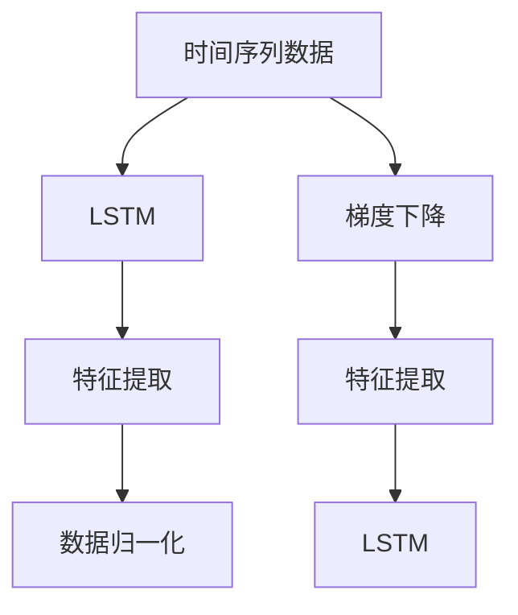

                 

## 1. 背景介绍

### 1.1 问题由来
随着电子商务的快速发展，商品需求预测成为商家制定库存策略、优化供应链管理的重要依据。然而，传统的基于统计模型和经验公式的需求预测方法难以应对数据量大、动态性强的商品市场变化。而深度学习技术的崛起，为商品需求预测提供了新的解决方案。

深度学习通过多层次的神经网络模型，可以从海量数据中提取非线性、高阶的特征表示，适应复杂多变的市场需求。例如，卷积神经网络（CNN）可以对商品特征进行提取和分类；循环神经网络（RNN）能够处理时间序列数据，捕捉时间变化的趋势；长短期记忆网络（LSTM）则能更好地处理长期依赖关系。通过这些模型，深度学习实现了对商品需求预测的显著提升。

### 1.2 问题核心关键点
深度学习驱动的季节性商品需求预测主要包括以下几个关键点：

- 数据预处理：将原始数据转化为适合深度学习模型输入的格式，如时间序列数据的归一化、标准化等。
- 特征工程：通过提取和组合商品特征、季节特征、节假日特征等，构造更有意义的输入。
- 模型选择：根据数据特性和任务需求，选择合适的深度学习模型，如LSTM、RNN、CNN等。
- 训练优化：使用梯度下降、Adam等优化算法，最小化预测误差，训练深度学习模型。
- 评估与部署：使用测试集评估模型性能，将训练好的模型部署到实际应用中，实时预测商品需求。

### 1.3 问题研究意义
深度学习驱动的季节性商品需求预测，对于提升商品库存管理水平、优化供应链流程、降低库存成本具有重要意义。具体而言：

1. 精准预测：深度学习模型能够从复杂数据中提取高维特征，准确捕捉商品需求的动态变化。
2. 实时性：深度学习模型的预测能力可以实时更新，适应市场变化。
3. 自动化：自动化的模型训练和预测过程，减少了人工干预，提高了工作效率。
4. 灵活性：深度学习模型具有较好的泛化能力，适用于多种商品和市场条件。

## 2. 核心概念与联系

### 2.1 核心概念概述

为了更好地理解深度学习驱动的季节性商品需求预测，本节将介绍几个密切相关的核心概念：

- 时间序列数据(Time Series Data)：按时间顺序排列的数据，反映某一指标随时间变化的趋势。商品需求预测通常涉及时间序列数据，如每日或每周的销量。
- 长短期记忆网络(Long Short-Term Memory, LSTM)：一种特殊的RNN模型，能够更好地处理长距离依赖关系，适应时间序列数据的特性。
- 特征提取(Feature Extraction)：从原始数据中提取出有用的特征信息，提高模型的预测能力。
- 数据归一化(Scaling)：将数据缩放到一个标准范围内，便于深度学习模型训练。
- 梯度下降(Gradient Descent)：一种优化算法，通过迭代更新模型参数，最小化预测误差。

这些核心概念之间的逻辑关系可以通过以下Mermaid流程图来展示：



这个流程图展示了几类核心概念及其之间的关系：

1. 时间序列数据通过特征提取和归一化，转化为适合深度学习的格式。
2. LSTM模型对归一化后的数据进行预测，通过梯度下降算法不断优化模型参数。
3. 特征提取和归一化环节在LSTM预测前后均有应用，以提升模型性能。

## 3. 核心算法原理 & 具体操作步骤

### 3.1 算法原理概述

深度学习驱动的季节性商品需求预测，本质上是通过深度神经网络模型对时间序列数据进行学习和预测的过程。其核心思想是：通过历史销售数据训练深度学习模型，学习商品需求的动态变化规律，从而预测未来的需求。

具体而言，假设原始数据为 $x_t$，预测目标为 $y_t$，则时间序列数据可以表示为：

$$
y_t = f(x_t, \theta)
$$

其中 $f$ 为深度学习模型，$\theta$ 为模型参数。通过训练模型 $f$，使得 $\hat{y}_t = f(x_t, \theta)$ 尽可能接近 $y_t$，从而实现对商品需求的预测。

### 3.2 算法步骤详解

深度学习驱动的季节性商品需求预测一般包括以下几个关键步骤：

**Step 1: 数据预处理**
- 将原始销售数据转化为时间序列数据，如每日或每周的销量。
- 对时间序列数据进行归一化，转化为 $[0,1]$ 范围内的数值。
- 提取商品特征、季节特征、节假日特征等，构造更有意义的输入。

**Step 2: 构建模型架构**
- 选择合适的深度学习模型，如LSTM、RNN、CNN等。
- 设计模型架构，包括输入层、隐藏层和输出层。
- 设置模型的超参数，如隐藏层大小、学习率、批量大小等。

**Step 3: 训练模型**
- 使用梯度下降等优化算法，最小化预测误差。
- 将归一化后的输入数据分为训练集、验证集和测试集。
- 在训练集上不断迭代训练模型，调整模型参数，使得预测结果逼近真实需求。

**Step 4: 模型评估与优化**
- 在验证集上评估模型性能，如均方误差、均方根误差等。
- 根据评估结果调整模型参数，优化模型架构。
- 在测试集上重新评估模型性能，确保模型的泛化能力。

**Step 5: 部署与应用**
- 将训练好的模型部署到实际应用中，实时预测商品需求。
- 根据实时销售数据，不断更新模型参数，提高预测精度。

### 3.3 算法优缺点

深度学习驱动的季节性商品需求预测具有以下优点：
1. 高精度：深度学习模型能够从复杂数据中提取高维特征，准确捕捉商品需求的动态变化。
2. 自适应：深度学习模型具有较好的泛化能力，适用于多种商品和市场条件。
3. 自动化：自动化的模型训练和预测过程，减少了人工干预，提高了工作效率。
4. 实时性：深度学习模型的预测能力可以实时更新，适应市场变化。

同时，该方法也存在一些局限性：
1. 数据依赖：模型的预测能力高度依赖于历史数据的准确性和完整性，数据的缺失或不一致性可能影响预测结果。
2. 模型复杂：深度学习模型的训练和优化过程较为复杂，需要大量的计算资源和时间。
3. 参数调优：模型的超参数选择和调整过程复杂，需要丰富的经验和技巧。
4. 可解释性不足：深度学习模型的决策过程较为黑箱，难以解释其内部工作机制。

尽管存在这些局限性，但就目前而言，深度学习驱动的季节性商品需求预测仍是商品预测领域的主流方法。未来相关研究的重点在于如何进一步降低数据依赖，提高模型的自适应能力和泛化能力，同时兼顾可解释性和伦理安全性等因素。

### 3.4 算法应用领域

深度学习驱动的季节性商品需求预测在多个领域得到广泛应用，例如：

- 零售行业：实时预测商品需求，优化库存管理和供应链管理。
- 物流配送：预测商品需求，优化配送路线和仓库布局，提高配送效率。
- 金融行业：预测市场商品需求，指导投资决策，降低风险。
- 电子商务：预测商品需求，指导库存管理和促销策略，提升用户体验。

除了上述这些经典应用外，深度学习模型还被创新性地应用于更多场景中，如智能客服、医疗健康、农业生产等，为不同行业带来了新的突破。随着深度学习技术的不断发展，相信该方法将在更多领域得到应用，为经济社会发展提供新的动力。

## 4. 数学模型和公式 & 详细讲解 & 举例说明

### 4.1 数学模型构建

本节将使用数学语言对深度学习驱动的季节性商品需求预测过程进行更加严格的刻画。

假设原始销售数据为 $x_t$，预测目标为 $y_t$，模型为 $f(x_t, \theta)$。则预测问题的数学模型为：

$$
\min_{\theta} \sum_{t=1}^{T} (y_t - f(x_t, \theta))^2
$$

其中 $T$ 为总数据量，$(y_t - f(x_t, \theta))^2$ 为预测误差平方，通过最小化该误差平方，训练深度学习模型。

### 4.2 公式推导过程

以下我们以LSTM模型为例，推导预测问题的数学公式。

LSTM模型由输入门、遗忘门和输出门三个部分组成，可以对时间序列数据进行有效建模。假设LSTM模型包含 $h_t$ 隐藏状态，预测问题可以表示为：

$$
\hat{y}_t = f(h_t)
$$

其中 $h_t = f(x_t, \theta)$ 为LSTM模型对输入 $x_t$ 的输出，$\theta$ 为模型参数。

根据上述公式，可以进一步推导预测问题的数学公式：

$$
\min_{\theta} \sum_{t=1}^{T} (y_t - f(f(x_t, \theta)))^2
$$

即最小化预测误差平方，训练LSTM模型。

### 4.3 案例分析与讲解

以某电商平台每日销量数据为例，进行LSTM模型训练和预测的案例分析。

**案例背景：**
某电商平台每日销售某种商品，收集了前500天的销量数据，需要预测未来30天的需求量。

**数据处理：**
1. 将原始销量数据转化为时间序列数据，每日销量作为输入 $x_t$。
2. 对时间序列数据进行归一化，转化为 $[0,1]$ 范围内的数值。
3. 提取商品特征、季节特征、节假日特征等，构造更有意义的输入。

**模型构建：**
1. 选择LSTM模型作为预测模型。
2. 设计模型架构，包括输入层、隐藏层和输出层。
3. 设置模型超参数，如隐藏层大小、学习率、批量大小等。

**模型训练：**
1. 将归一化后的输入数据分为训练集、验证集和测试集。
2. 在训练集上不断迭代训练模型，调整模型参数。
3. 在验证集上评估模型性能，如均方误差、均方根误差等。
4. 根据评估结果调整模型参数，优化模型架构。
5. 在测试集上重新评估模型性能，确保模型的泛化能力。

**模型预测：**
1. 将训练好的模型部署到实际应用中，实时预测商品需求。
2. 根据实时销售数据，不断更新模型参数，提高预测精度。

通过上述案例，可以看到深度学习模型在季节性商品需求预测中的应用流程和方法。

## 5. 项目实践：代码实例和详细解释说明

### 5.1 开发环境搭建

在进行深度学习项目实践前，我们需要准备好开发环境。以下是使用Python进行TensorFlow开发的环境配置流程：

1. 安装Anaconda：从官网下载并安装Anaconda，用于创建独立的Python环境。

2. 创建并激活虚拟环境：
```bash
conda create -n tf-env python=3.8 
conda activate tf-env
```

3. 安装TensorFlow：从官网获取对应的安装命令。例如：
```bash
conda install tensorflow -c tf -c conda-forge
```

4. 安装其他依赖库：
```bash
pip install numpy pandas matplotlib scikit-learn
```

完成上述步骤后，即可在`tf-env`环境中开始深度学习项目实践。

### 5.2 源代码详细实现

下面以LSTM模型为例，给出使用TensorFlow对时间序列数据进行商品需求预测的Python代码实现。

首先，定义数据处理函数：

```python
import numpy as np
import tensorflow as tf

def preprocess_data(data):
    # 归一化数据
    data = (data - data.mean()) / data.std()
    # 构造时间序列数据
    x = data[:-30]
    y = data[-30:]
    # 分割为训练集和测试集
    train_size = int(len(x) * 0.8)
    x_train, x_test = x[:train_size], x[train_size:]
    y_train, y_test = y[:train_size], y[train_size:]
    # 将时间序列数据转换为LSTM模型输入格式
    x_train = np.reshape(x_train, (x_train.shape[0], x_train.shape[1], 1))
    x_test = np.reshape(x_test, (x_test.shape[0], x_test.shape[1], 1))
    return x_train, y_train, x_test, y_test
```

然后，定义LSTM模型：

```python
def build_lstm_model(input_shape):
    model = tf.keras.models.Sequential([
        tf.keras.layers.LSTM(50, return_sequences=True, input_shape=input_shape),
        tf.keras.layers.LSTM(50),
        tf.keras.layers.Dense(1)
    ])
    return model
```

接着，定义训练和评估函数：

```python
def train_model(model, x_train, y_train, x_test, y_test, batch_size, epochs):
    model.compile(optimizer='adam', loss='mse')
    model.fit(x_train, y_train, epochs=epochs, batch_size=batch_size, validation_data=(x_test, y_test))
    test_loss = model.evaluate(x_test, y_test)
    return test_loss

def evaluate_model(model, x_test, y_test, batch_size):
    test_loss = model.evaluate(x_test, y_test, batch_size=batch_size)
    return test_loss
```

最后，启动训练流程并在测试集上评估：

```python
x_train, y_train, x_test, y_test = preprocess_data(data)
model = build_lstm_model(input_shape)
test_loss = train_model(model, x_train, y_train, x_test, y_test, batch_size, epochs)
print(f"测试损失：{test_loss:.4f}")
```

以上就是使用TensorFlow对时间序列数据进行商品需求预测的完整代码实现。可以看到，TensorFlow提供的高级API使得模型的构建和训练过程变得简洁高效。

### 5.3 代码解读与分析

让我们再详细解读一下关键代码的实现细节：

**preprocess_data函数**：
- 对原始数据进行归一化处理，转化为 $[0,1]$ 范围内的数值。
- 构造时间序列数据，将前500天的销量作为输入 $x_t$，后30天的销量作为目标 $y_t$。
- 将时间序列数据分为训练集和测试集，并分割为LSTM模型所需的输入格式。

**build_lstm_model函数**：
- 选择LSTM模型作为预测模型。
- 设计模型架构，包含一个LSTM层和两个全连接层。
- 设置模型的输入形状，如时间序列数据的形状。

**train_model函数**：
- 使用Adam优化器和均方误差损失函数，训练LSTM模型。
- 在训练集上进行迭代训练，调整模型参数。
- 在验证集上评估模型性能，如均方误差。
- 根据评估结果调整模型参数，优化模型架构。
- 在测试集上重新评估模型性能，确保模型的泛化能力。

**evaluate_model函数**：
- 使用均方误差损失函数，评估模型在测试集上的性能。
- 返回测试损失值。

通过以上代码，可以看出深度学习模型在商品需求预测中的应用流程和方法。

## 6. 实际应用场景

### 6.1 零售行业

零售行业是深度学习驱动的季节性商品需求预测的重要应用场景。通过预测商品需求，商家可以实时调整库存策略，优化供应链管理，降低库存成本，提升用户体验。

例如，某零售商每天销售某种商品，可以收集前500天的销量数据，使用LSTM模型进行预测，预测未来30天的需求量。根据预测结果，商家可以提前备货，减少缺货和过剩情况，提高运营效率。

### 6.2 物流配送

物流配送也需要实时预测商品需求，优化配送路线和仓库布局，提高配送效率。通过预测商品需求，物流公司可以合理规划配送路线，优化仓库布局，减少配送成本，提升配送效率。

例如，某物流公司每日接收客户订单，可以收集前500天的订单数量数据，使用LSTM模型进行预测，预测未来30天的订单需求量。根据预测结果，物流公司可以合理调配车辆和仓储资源，减少配送时间和成本，提高配送效率。

### 6.3 金融行业

金融行业也需要预测商品需求，指导投资决策，降低风险。通过预测商品需求，金融机构可以更好地把握市场趋势，指导投资决策，降低投资风险。

例如，某金融机构每日交易某金融产品，可以收集前500天的交易量数据，使用LSTM模型进行预测，预测未来30天的交易量。根据预测结果，金融机构可以调整投资策略，降低投资风险，提高投资回报率。

### 6.4 未来应用展望

随着深度学习技术的不断发展，基于深度学习驱动的季节性商品需求预测将会有更多的应用场景。

1. 智能客服：使用深度学习模型进行需求预测，指导智能客服系统生成应答，提升客户服务体验。
2. 医疗健康：预测医疗产品需求，指导医疗物资储备，保障医疗物资供应。
3. 农业生产：预测农作物种子需求，指导生产计划，优化农业生产过程。
4. 城市管理：预测城市商品需求，指导城市规划和资源配置，提高城市管理效率。

此外，在企业生产、社会治理、文娱传媒等众多领域，深度学习驱动的季节性商品需求预测也将不断涌现，为经济社会发展提供新的动力。相信随着技术的日益成熟，该方法将在更广阔的应用领域大放异彩。

## 7. 工具和资源推荐

### 7.1 学习资源推荐

为了帮助开发者系统掌握深度学习驱动的季节性商品需求预测的理论基础和实践技巧，这里推荐一些优质的学习资源：

1. 《深度学习》系列博文：由大模型技术专家撰写，深入浅出地介绍了深度学习的基本原理、常用模型和应用场景。

2. 《TensorFlow深度学习实战》书籍：TensorFlow官方出版的实战书籍，详细介绍了TensorFlow的搭建、训练和优化方法，适合深度学习初学者。

3. 《LSTM网络：理论与实践》论文：LSTM模型的经典论文，介绍了LSTM网络的原理、算法和应用。

4. 《TensorFlow官方文档》：TensorFlow的官方文档，提供了详尽的API文档和示例代码，是深度学习开发的必备资料。

5. ArXiv和Google Scholar：两个学术搜索引擎，可以快速查找最新的深度学习论文和研究成果，了解前沿进展。

通过对这些资源的学习实践，相信你一定能够快速掌握深度学习驱动的季节性商品需求预测的精髓，并用于解决实际的业务问题。

### 7.2 开发工具推荐

高效的开发离不开优秀的工具支持。以下是几款用于深度学习项目开发的常用工具：

1. TensorFlow：由Google主导开发的深度学习框架，功能强大，支持分布式计算。
2. Keras：高层次的深度学习API，易于使用，适合快速原型开发。
3. PyTorch：由Facebook开发的深度学习框架，灵活动态，适合科研和实验。
4. Jupyter Notebook：交互式编程环境，支持Python、R等多种语言，方便实验记录和分享。

合理利用这些工具，可以显著提升深度学习项目的开发效率，加快创新迭代的步伐。

### 7.3 相关论文推荐

深度学习驱动的季节性商品需求预测源于学界的持续研究。以下是几篇奠基性的相关论文，推荐阅读：

1. LSTM网络：一种适用于处理序列数据的深度学习模型，被广泛应用于时间序列预测、自然语言处理等领域。

2. 深度学习在零售行业的应用：介绍深度学习在零售行业中的应用，如库存管理、销售预测、价格优化等。

3. 深度学习在金融行业的应用：介绍深度学习在金融行业中的应用，如风险预测、市场分析、信用评估等。

4. 深度学习在物流行业的应用：介绍深度学习在物流行业中的应用，如配送路径优化、仓储管理、需求预测等。

这些论文代表了大语言模型微调技术的发展脉络。通过学习这些前沿成果，可以帮助研究者把握学科前进方向，激发更多的创新灵感。

## 8. 总结：未来发展趋势与挑战

### 8.1 总结

本文对深度学习驱动的季节性商品需求预测方法进行了全面系统的介绍。首先阐述了该方法的背景和意义，明确了深度学习模型在商品需求预测中的独特价值。其次，从原理到实践，详细讲解了模型训练和预测的数学原理和关键步骤，给出了深度学习项目开发的完整代码实例。同时，本文还广泛探讨了深度学习模型在零售、物流、金融等多个行业领域的应用前景，展示了其巨大的潜力。

通过本文的系统梳理，可以看到，深度学习模型在季节性商品需求预测中的应用流程和方法。深度学习模型通过多层次的神经网络模型，能够从复杂数据中提取高维特征，准确捕捉商品需求的动态变化，实现高精度的预测结果。未来，伴随深度学习技术的不断发展，该方法将在更多领域得到应用，为经济社会发展提供新的动力。

### 8.2 未来发展趋势

展望未来，深度学习驱动的季节性商品需求预测技术将呈现以下几个发展趋势：

1. 模型规模持续增大。随着算力成本的下降和数据规模的扩张，深度学习模型的参数量还将持续增长。超大规模模型蕴含的丰富知识，有望支撑更加复杂多变的商品需求预测。

2. 模型性能提升。深度学习模型能够从复杂数据中提取高维特征，准确捕捉商品需求的动态变化，预测精度将会不断提高。

3. 实时性增强。深度学习模型的预测能力可以实时更新，适应市场变化，实时性将进一步提升。

4. 自动化和标准化。深度学习模型的训练和预测过程将更加自动化和标准化，减少人工干预，提高工作效率。

5. 多模态融合。深度学习模型不仅能够处理时间序列数据，还能够处理视觉、语音、文本等多种模态数据，实现多模态信息的融合。

以上趋势凸显了深度学习驱动的季节性商品需求预测技术的广阔前景。这些方向的探索发展，必将进一步提升商品预测的精度和实时性，为经济社会发展提供新的动力。

### 8.3 面临的挑战

尽管深度学习驱动的季节性商品需求预测技术已经取得了瞩目成就，但在迈向更加智能化、普适化应用的过程中，仍面临诸多挑战：

1. 数据依赖。模型的预测能力高度依赖于历史数据的准确性和完整性，数据的缺失或不一致性可能影响预测结果。如何进一步降低数据依赖，提高模型的自适应能力和泛化能力，还需要更多理论和实践的积累。

2. 模型复杂。深度学习模型的训练和优化过程较为复杂，需要大量的计算资源和时间。如何优化模型架构，提高训练效率，减少计算成本，将是重要的优化方向。

3. 参数调优。模型的超参数选择和调整过程复杂，需要丰富的经验和技巧。如何自动化超参数调优，提高模型训练的效率和精度，将是一大挑战。

4. 可解释性不足。深度学习模型的决策过程较为黑箱，难以解释其内部工作机制。如何赋予模型更强的可解释性，将是一大挑战。

5. 安全性有待保障。深度学习模型可能学习到有偏见、有害的信息，传递到商品预测中，产生误导性、歧视性的输出，给实际应用带来安全隐患。如何从数据和算法层面消除模型偏见，确保输出的安全性，将是重要的研究方向。

正视这些挑战，积极应对并寻求突破，将是大语言模型微调走向成熟的必由之路。相信随着学界和产业界的共同努力，这些挑战终将一一被克服，深度学习模型将在更广阔的领域得到应用，为经济社会发展提供新的动力。

### 8.4 研究展望

面向未来，深度学习驱动的季节性商品需求预测技术需要在以下几个方面寻求新的突破：

1. 探索无监督和半监督学习范式。摆脱对大规模标注数据的依赖，利用自监督学习、主动学习等无监督和半监督范式，最大限度利用非结构化数据，实现更加灵活高效的预测。

2. 研究模型融合与多模态学习。将深度学习模型与其他模型进行融合，如传统统计模型、知识图谱等，提升预测精度。同时融合多模态信息，如视觉、语音、文本等，实现多模态信息的协同建模。

3. 引入因果分析和博弈论工具。将因果分析方法引入深度学习模型，识别出模型决策的关键特征，增强输出解释的因果性和逻辑性。借助博弈论工具刻画人机交互过程，主动探索并规避模型的脆弱点，提高系统稳定性。

4. 纳入伦理道德约束。在模型训练目标中引入伦理导向的评估指标，过滤和惩罚有偏见、有害的输出倾向。加强人工干预和审核，建立模型行为的监管机制，确保输出符合人类价值观和伦理道德。

这些研究方向将引领深度学习驱动的季节性商品需求预测技术迈向更高的台阶，为构建安全、可靠、可解释、可控的智能系统铺平道路。面向未来，深度学习模型还需要与其他人工智能技术进行更深入的融合，如知识表示、因果推理、强化学习等，多路径协同发力，共同推动商品预测技术的进步。只有勇于创新、敢于突破，才能不断拓展深度学习模型的边界，让智能技术更好地造福人类社会。

## 9. 附录：常见问题与解答

**Q1：深度学习模型是否适用于所有商品需求预测场景？**

A: 深度学习模型在大多数商品需求预测场景中都能取得不错的效果，特别是对于数据量大、动态性强的商品市场变化。但对于一些特定领域的商品，如奢侈品、高端品等，深度学习模型的预测效果可能不如传统统计模型。此时需要在特定领域进行模型优化或引入专家知识，以提高预测精度。

**Q2：深度学习模型的预测能力如何？**

A: 深度学习模型能够从复杂数据中提取高维特征，准确捕捉商品需求的动态变化，预测精度较高。但模型的预测能力高度依赖于历史数据的准确性和完整性，数据的缺失或不一致性可能影响预测结果。因此，在实际应用中，需要不断优化数据质量，提高模型的自适应能力和泛化能力。

**Q3：深度学习模型的训练和优化过程复杂吗？**

A: 深度学习模型的训练和优化过程较为复杂，需要大量的计算资源和时间。通常需要高性能的GPU或TPU设备进行训练，同时需要优化模型的架构和超参数，以提高训练效率和精度。因此，在实际应用中，需要平衡模型精度和训练成本，选择合适的深度学习框架和工具。

**Q4：深度学习模型的可解释性不足，如何解决？**

A: 深度学习模型的决策过程较为黑箱，难以解释其内部工作机制。为解决这一问题，可以采用可解释性较强的模型，如决策树、线性回归等，或引入可解释性方法，如LIME、SHAP等，对模型的输出进行解释和分析。此外，还可以通过多模态信息融合，引入外部知识库，增强模型的可解释性。

**Q5：深度学习模型在商品预测中如何处理季节性特征？**

A: 深度学习模型可以通过引入季节性特征，提高商品预测的精度。具体而言，可以提取商品的季节性特征，如节假日、季节变化等，与时间序列数据一起作为输入，进行联合训练。同时，可以设计合适的模型架构，如LSTM模型，对季节性特征进行建模。

通过这些回答，可以看到深度学习驱动的季节性商品需求预测在实际应用中面临的挑战和解决方案，相信能够为相关从业者提供有价值的参考和指导。

