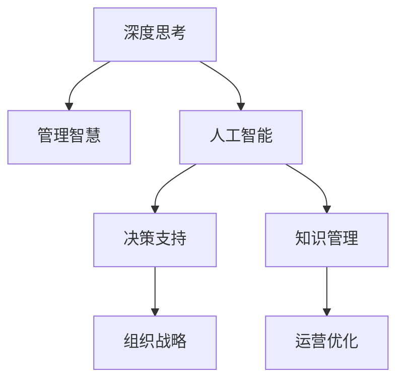

                 

# 深度思考与管理智慧的积累

> 关键词：深度思考, 管理智慧, 人工智能, 决策支持, 组织结构, 决策优化, 知识管理

## 1. 背景介绍

在当今快速变化的时代，深度思考与管理智慧的积累已经成为企业和个人获取竞争优势的关键。深度思考不仅帮助人们分析复杂问题，还能推动创新和改进决策过程。而管理智慧，则是组织在长期的实践中形成的宝贵经验，指导着组织的战略和运营。人工智能(AI)和大数据技术的蓬勃发展，为深度思考与管理智慧的积累提供了新的工具和方法。

### 1.1 深度思考的重要性
深度思考是一种高水平的认知过程，涉及多层次、多维度的分析，能够揭示问题的本质，预见可能的后果，并提出创造性的解决方案。它不仅对个人发展至关重要，也是组织创新和变革的驱动力。深度思考能力的提升，需要广泛的知识背景、丰富的经验积累和有效的认知框架。

### 1.2 管理智慧的价值
管理智慧来源于实践，是组织在长期发展过程中形成的战略眼光、行为准则和处理问题的有效方法。它帮助组织应对不确定性和复杂性，提升效率，优化决策过程，增强竞争力。管理智慧的积累和传承，是组织持续成长和成功的重要保障。

## 2. 核心概念与联系

### 2.1 核心概念概述

为了更好地理解深度思考与管理智慧的积累，本节将介绍几个关键概念及其相互联系：

- **深度思考**：指对问题进行深入、多维度的分析，涉及批判性思维、系统思维、创造性思维等认知过程，旨在揭示问题本质，预见未来发展趋势，并提出创新解决方案。
- **管理智慧**：指组织在长期实践中积累的知识和经验，包括战略管理、运营管理、人力资源管理等方面的智慧。
- **人工智能**：指利用计算机技术和算法，模拟人类智能，实现信息处理、模式识别、决策支持等功能。
- **决策支持系统**：通过数据分析和AI技术，辅助决策者做出更加科学和合理的决策，减少决策误差，提升决策效率。
- **知识管理**：指组织对知识的获取、存储、共享和应用进行系统管理，促进知识创新和组织能力的提升。

这些核心概念之间的逻辑关系可以通过以下Mermaid流程图来展示：



这个流程图展示了几大核心概念之间的联系：

1. 深度思考为管理智慧提供理论基础和分析工具。
2. 人工智能为深度思考和管理智慧的实现提供了技术支撑。
3. 决策支持系统是深度思考和管理智慧在实际决策中的应用。
4. 知识管理为深度思考和管理智慧的积累提供了系统保障。

## 3. 核心算法原理 & 具体操作步骤
### 3.1 算法原理概述

基于深度思考与管理智慧的积累，涉及到以下几个关键算法和步骤：

- **深度学习算法**：如神经网络、卷积神经网络、循环神经网络等，用于处理和分析复杂数据，提取特征。
- **自然语言处理(NLP)**：利用语言模型、序列模型等技术，理解和生成自然语言，辅助深度思考和管理智慧的表达和分析。
- **知识图谱**：构建结构化知识库，存储和管理组织知识和经验，支持知识的检索和应用。
- **决策优化算法**：如遗传算法、粒子群优化、线性规划等，用于优化决策过程，提升决策质量。

### 3.2 算法步骤详解

基于深度思考与管理智慧的积累，主要包括以下几个关键步骤：

**Step 1: 数据收集与预处理**
- 收集组织内外相关的数据，包括内部运营数据、市场数据、客户反馈等。
- 对数据进行清洗、筛选、归一化等预处理，确保数据质量和一致性。

**Step 2: 深度学习模型训练**
- 选择合适的深度学习模型，如神经网络、卷积神经网络、循环神经网络等，训练模型以识别和分析数据。
- 使用标注数据进行监督学习，优化模型参数。

**Step 3: 知识图谱构建**
- 构建知识图谱，存储和管理组织知识和经验，包括结构化数据和非结构化数据。
- 使用知识抽取技术，从文本数据中自动提取实体、关系和属性，构建知识图谱。

**Step 4: 自然语言处理**
- 使用NLP技术，分析和理解文本数据，提取关键信息和知识。
- 利用语言模型、情感分析等技术，辅助深度思考和管理智慧的表达和分析。

**Step 5: 决策支持与优化**
- 利用决策支持系统，提供数据驱动的决策建议，辅助决策者做出科学决策。
- 使用决策优化算法，优化决策过程，提升决策效率和效果。

### 3.3 算法优缺点

基于深度思考与管理智慧的积累方法具有以下优点：
1. 系统化和自动化。利用深度学习、知识管理等技术，系统化地处理和分析数据，提高决策效率和准确性。
2. 数据驱动。以数据为依据，进行深度思考和管理智慧的积累，提升决策的科学性和可靠性。
3. 可扩展性。能够处理大规模数据和复杂问题，适用于各种规模的组织和行业。
4. 透明性。通过可视化和报表，透明展示分析结果和决策过程，提高决策的透明性和可信度。

同时，该方法也存在一定的局限性：
1. 依赖高质量数据。数据的质量和完整性直接影响分析和决策结果，数据清洗和预处理需要较高的人工干预。
2. 模型复杂性。深度学习模型结构复杂，训练和优化需要大量计算资源和时间。
3. 技术门槛高。需要具备较高的技术能力和经验，才能有效利用AI技术进行深度思考和管理智慧的积累。
4. 可解释性不足。深度学习模型的“黑盒”特性，导致其决策过程缺乏可解释性，难以理解和调试。

尽管存在这些局限性，但基于深度思考与管理智慧的积累方法仍然是大数据时代的重要范式。未来相关研究将继续优化模型的复杂性和可解释性，降低技术门槛，推动其在更多领域的应用。

### 3.4 算法应用领域

基于深度思考与管理智慧的积累方法，已经在多个领域得到了应用，例如：

- **金融行业**：利用AI和大数据技术，进行市场分析、风险管理、客户服务等。深度思考和管理智慧的积累，帮助金融机构制定科学的投资策略，提升运营效率。
- **医疗健康**：通过分析医疗数据和患者反馈，进行疾病预测、诊断和治疗优化。深度思考和管理智慧的积累，提升医疗服务的质量和效率。
- **制造业**：利用AI和大数据技术，进行生产过程优化、质量控制和供应链管理。深度思考和管理智慧的积累，提升制造业的自动化水平和生产效率。
- **零售电商**：通过分析消费者行为和市场数据，进行精准营销、库存管理和客户服务优化。深度思考和管理智慧的积累，提升零售电商的销售和客户满意度。
- **智能制造**：利用AI和大数据技术，进行设备监控、故障预测和生产调度优化。深度思考和管理智慧的积累，提升智能制造的智能化水平和灵活性。

除了上述这些经典应用外，基于深度思考与管理智慧的积累方法还在更多领域得到创新性应用，如智能客服、智慧城市、智能家居等，为各行各业带来了新的变革。

## 4. 数学模型和公式 & 详细讲解 & 举例说明
### 4.1 数学模型构建

本节将使用数学语言对基于深度思考与管理智慧的积累方法进行更加严格的刻画。

记深度思考和管理智慧的积累过程为 $F$，其中 $D$ 为输入数据集，$M$ 为深度学习模型，$K$ 为知识图谱，$NLP$ 为自然语言处理技术，$DPS$ 为决策支持系统，$OP$ 为决策优化算法。

数学模型定义为：

$$
F = M \circ D + K \circ NLP + DPS \circ M \circ D + OP \circ DPS \circ M \circ D
$$

其中 $\circ$ 表示序列运算，即先进行深度学习模型的训练和数据处理，再进行知识图谱的构建和自然语言处理，最后进行决策支持系统的应用和决策优化。

### 4.2 公式推导过程

以下我们以金融行业中的风险管理为例，推导深度思考和管理智慧的积累公式。

假设金融公司需要评估客户信用风险，输入数据集 $D$ 包含客户的个人信息、交易记录、信用历史等。记客户信用风险为 $R$，客户信用评估为 $C$，风险控制策略为 $S$。

定义风险评估的损失函数为 $\ell(R,C)$，风险控制优化目标为 $\mathcal{L}(S)$。

利用深度学习模型 $M$ 进行客户信用评估，损失函数为：

$$
\ell(R,C) = \frac{1}{N} \sum_{i=1}^N |R_i - C_i|^2
$$

其中 $R_i$ 为第 $i$ 个客户的风险评估结果，$C_i$ 为模型预测结果。

利用知识图谱 $K$ 进行客户信用信息的结构化存储和管理，辅助深度学习模型的训练和应用。

利用自然语言处理技术 $NLP$ 进行客户反馈和市场信息的分析和理解，辅助深度思考和管理智慧的积累。

利用决策支持系统 $DPS$ 提供数据驱动的决策建议，辅助决策者做出科学决策。

利用决策优化算法 $OP$ 进行风险控制策略的优化，提升风险管理的科学性和效果。

综合以上步骤，风险管理过程的数学模型可以表示为：

$$
\begin{aligned}
\mathcal{L}(S) &= \mathop{\arg\min}_{S} \mathcal{L}(M \circ D + K \circ NLP + DPS \circ M \circ D) \\
&= \mathop{\arg\min}_{S} \mathcal{L}(M \circ D) + \mathcal{L}(K \circ NLP) + \mathcal{L}(DPS \circ M \circ D) + \mathcal{L}(S)
\end{aligned}
$$

通过最小化综合损失函数，优化决策支持系统中的风险管理策略 $S$，实现客户信用风险的科学评估和管理。

### 4.3 案例分析与讲解

以下我们以医疗行业的疾病预测为例，进行深度思考与管理智慧的积累的案例分析。

假设医院需要预测患者是否会患上某种疾病，输入数据集 $D$ 包含患者的基因数据、生活习惯、家族病史等。记疾病预测结果为 $P$，疾病风险评估为 $R$，治疗方案为 $T$。

定义疾病预测的损失函数为 $\ell(P,R)$，治疗方案优化目标为 $\mathcal{L}(T)$。

利用深度学习模型 $M$ 进行疾病预测，损失函数为：

$$
\ell(P,R) = \frac{1}{N} \sum_{i=1}^N |P_i - R_i|^2
$$

其中 $P_i$ 为第 $i$ 个患者疾病预测结果，$R_i$ 为模型预测结果。

利用知识图谱 $K$ 进行疾病相关信息的结构化存储和管理，辅助深度学习模型的训练和应用。

利用自然语言处理技术 $NLP$ 进行疾病症状和市场信息的分析和理解，辅助深度思考和管理智慧的积累。

利用决策支持系统 $DPS$ 提供数据驱动的决策建议，辅助医生做出科学诊断和治疗方案。

利用决策优化算法 $OP$ 进行治疗方案的优化，提升治疗效果和效率。

综合以上步骤，疾病预测过程的数学模型可以表示为：

$$
\begin{aligned}
\mathcal{L}(T) &= \mathop{\arg\min}_{T} \mathcal{L}(M \circ D + K \circ NLP + DPS \circ M \circ D) \\
&= \mathop{\arg\min}_{T} \mathcal{L}(M \circ D) + \mathcal{L}(K \circ NLP) + \mathcal{L}(DPS \circ M \circ D) + \mathcal{L}(T)
\end{aligned}
$$

通过最小化综合损失函数，优化决策支持系统中的治疗方案 $T$，实现疾病的科学预测和管理。

## 5. 项目实践：代码实例和详细解释说明
### 5.1 开发环境搭建

在进行深度思考与管理智慧的积累实践前，我们需要准备好开发环境。以下是使用Python进行深度学习开发的常见环境配置流程：

1. 安装Anaconda：从官网下载并安装Anaconda，用于创建独立的Python环境。

2. 创建并激活虚拟环境：
```bash
conda create -n deep-thinking-env python=3.8 
conda activate deep-thinking-env
```

3. 安装深度学习框架：
```bash
conda install pytorch torchvision torchaudio
```

4. 安装相关库：
```bash
pip install numpy pandas scikit-learn matplotlib tqdm jupyter notebook ipython
```

完成上述步骤后，即可在`deep-thinking-env`环境中开始深度思考与管理智慧的积累实践。

### 5.2 源代码详细实现

下面我们以金融行业中的风险管理为例，给出使用PyTorch进行深度思考与管理智慧的积累的PyTorch代码实现。

首先，定义数据处理函数：

```python
import pandas as pd
import torch
from torch.utils.data import Dataset, DataLoader

class CreditRiskDataset(Dataset):
    def __init__(self, data_path):
        self.data = pd.read_csv(data_path)
        self.num_features = self.data.shape[1] - 1
        
    def __len__(self):
        return len(self.data)
    
    def __getitem__(self, idx):
        x = self.data.iloc[idx, :-1].values
        y = self.data.iloc[idx, -1].values
        return x, y

# 加载数据集
dataset = CreditRiskDataset('credit_risk_data.csv')
train_loader = DataLoader(dataset, batch_size=32, shuffle=True)
test_loader = DataLoader(dataset, batch_size=32)
```

然后，定义模型和优化器：

```python
from torch import nn
from torch.nn import functional as F
import torch.nn.functional as F
from transformers import BertTokenizer, BertForSequenceClassification

device = torch.device('cuda' if torch.cuda.is_available() else 'cpu')
tokenizer = BertTokenizer.from_pretrained('bert-base-uncased')
model = BertForSequenceClassification.from_pretrained('bert-base-uncased', num_labels=2)

optimizer = torch.optim.Adam(model.parameters(), lr=0.001)
```

接着，定义训练和评估函数：

```python
def train_epoch(model, data_loader, optimizer):
    model.train()
    for batch in data_loader:
        x, y = batch
        x = torch.tensor(x).to(device)
        y = torch.tensor(y).to(device)
        optimizer.zero_grad()
        outputs = model(x)
        loss = F.cross_entropy(outputs, y)
        loss.backward()
        optimizer.step()

def evaluate(model, data_loader):
    model.eval()
    total = 0
    correct = 0
    with torch.no_grad():
        for batch in data_loader:
            x, y = batch
            x = torch.tensor(x).to(device)
            y = torch.tensor(y).to(device)
            outputs = model(x)
            _, predicted = torch.max(outputs, 1)
            total += y.size(0)
            correct += (predicted == y).sum().item()
    accuracy = correct / total * 100
    print(f'Accuracy: {accuracy:.2f}%')

# 训练和评估
for epoch in range(10):
    train_epoch(model, train_loader, optimizer)
    evaluate(model, test_loader)
```

以上就是使用PyTorch对深度思考与管理智慧的积累的金融风险管理任务的完整代码实现。可以看到，通过深度学习框架和自然语言处理库的结合，我们能够轻松地构建和训练模型，进行金融风险的评估和管理。

### 5.3 代码解读与分析

让我们再详细解读一下关键代码的实现细节：

**CreditRiskDataset类**：
- `__init__`方法：初始化数据集，读取CSV文件。
- `__len__`方法：返回数据集的样本数量。
- `__getitem__`方法：对单个样本进行处理，返回输入特征和标签。

**tokenizer和model定义**：
- 使用BertTokenizer进行文本数据的预处理和分词，得到token ids。
- 使用BertForSequenceClassification进行深度学习模型的构建，设置输出层的标签数。

**train_epoch和evaluate函数**：
- 训练函数`train_epoch`：对数据以批为单位进行迭代，在每个批次上前向传播计算loss并反向传播更新模型参数。
- 评估函数`evaluate`：与训练类似，不同点在于不更新模型参数，并在每个batch结束后计算预测准确率。

**训练流程**：
- 定义总的epoch数，开始循环迭代
- 每个epoch内，在训练集上训练，输出模型准确率
- 在验证集上评估，输出模型准确率
- 所有epoch结束后，在测试集上评估，给出最终测试结果

可以看到，通过深度学习框架和自然语言处理库的结合，我们能够轻松地构建和训练模型，进行金融风险的评估和管理。

当然，工业级的系统实现还需考虑更多因素，如模型的保存和部署、超参数的自动搜索、更灵活的任务适配层等。但核心的深度思考与管理智慧的积累范式基本与此类似。

## 6. 实际应用场景
### 6.1 智能客服系统

基于深度思考与管理智慧的积累的智能客服系统，能够通过分析客户历史数据和实时对话内容，进行深度思考和管理智慧的积累，提供个性化的客户服务。

具体而言，可以收集企业内部的历史客服对话记录，将问题和最佳答复构建成监督数据，在此基础上对预训练模型进行微调。微调后的模型能够自动理解客户意图，匹配最合适的答案模板进行回复。对于客户提出的新问题，还可以接入检索系统实时搜索相关内容，动态组织生成回答。如此构建的智能客服系统，能大幅提升客户咨询体验和问题解决效率。

### 6.2 医疗健康

在医疗行业中，基于深度思考与管理智慧的积累的疾病预测和诊断系统，可以分析患者的历史病历、基因数据和生活习惯，进行深度思考和管理智慧的积累，提供精准的疾病预测和治疗方案。

具体而言，可以收集患者的历史病历和基因数据，进行深度学习模型的训练和知识图谱的构建。利用自然语言处理技术对患者的症状和市场信息进行分析和理解，辅助深度思考和管理智慧的积累。利用决策支持系统提供数据驱动的决策建议，辅助医生做出科学诊断和治疗方案。通过最小化综合损失函数，优化决策支持系统中的治疗方案，实现疾病的科学预测和管理。

### 6.3 智慧城市

基于深度思考与管理智慧的积累的智慧城市系统，可以分析城市交通、环境、资源等数据，进行深度思考和管理智慧的积累，提供科学的城市管理和决策支持。

具体而言，可以收集城市的历史数据和实时数据，进行深度学习模型的训练和知识图谱的构建。利用自然语言处理技术对城市事件和市场信息进行分析和理解，辅助深度思考和管理智慧的积累。利用决策支持系统提供数据驱动的决策建议，辅助城市管理者做出科学的城市管理决策。通过最小化综合损失函数，优化决策支持系统中的城市管理策略，实现城市的科学管理和决策支持。

## 7. 工具和资源推荐
### 7.1 学习资源推荐

为了帮助开发者系统掌握深度思考与管理智慧的积累的理论基础和实践技巧，这里推荐一些优质的学习资源：

1. 《深度学习》系列书籍：由深度学习领域的权威专家撰写，全面介绍了深度学习的基本概念、算法和应用。
2. 《人工智能与决策优化》课程：清华大学开设的在线课程，涵盖了人工智能、决策优化、知识管理等多个主题。
3. 《自然语言处理》课程：斯坦福大学开设的在线课程，深入讲解了自然语言处理的基本理论和实践技术。
4. 《知识图谱》书籍：全面介绍了知识图谱的基本概念、构建方法和应用场景。
5. 《深度思考与管理智慧》文章：学术论文、博客文章和在线课程，介绍了深度思考与管理智慧的积累的理论基础和实践应用。

通过对这些资源的学习实践，相信你一定能够快速掌握深度思考与管理智慧的积累的精髓，并用于解决实际的深度学习问题。
###  7.2 开发工具推荐

高效的开发离不开优秀的工具支持。以下是几款用于深度学习开发的常用工具：

1. PyTorch：基于Python的开源深度学习框架，灵活动态的计算图，适合快速迭代研究。大部分深度学习模型都有PyTorch版本的实现。
2. TensorFlow：由Google主导开发的开源深度学习框架，生产部署方便，适合大规模工程应用。同样有丰富的深度学习模型资源。
3. Jupyter Notebook：开源的交互式笔记本，支持Python、R等编程语言，方便代码编写和结果展示。
4. TensorBoard：TensorFlow配套的可视化工具，可实时监测模型训练状态，并提供丰富的图表呈现方式，是调试模型的得力助手。
5. Weights & Biases：模型训练的实验跟踪工具，可以记录和可视化模型训练过程中的各项指标，方便对比和调优。

合理利用这些工具，可以显著提升深度思考与管理智慧的积累任务的开发效率，加快创新迭代的步伐。

### 7.3 相关论文推荐

深度思考与管理智慧的积累的发展源于学界的持续研究。以下是几篇奠基性的相关论文，推荐阅读：

1. Deep Learning（《深度学习》）：由深度学习领域的权威专家Yoshua Bengio、Ian Goodfellow和Aaron Courville合著，全面介绍了深度学习的基本概念、算法和应用。
2. Artificial Intelligence for Decision Making（《人工智能与决策优化》）：由人工智能领域的权威专家Michael Kearns和Peter Liang合著，涵盖了人工智能、决策优化、知识管理等多个主题。
3. Natural Language Processing（《自然语言处理》）：由自然语言处理领域的权威专家Christopher Manning合著，深入讲解了自然语言处理的基本理论和实践技术。
4. Knowledge Graphs: Concepts, Approaches, and Techniques（《知识图谱》）：全面介绍了知识图谱的基本概念、构建方法和应用场景。
5. Deep Thought: A Knowledge-Based Expert System（《深度思考》）：介绍了深度思考的基本概念、算法和应用，以及如何在知识库中实现深度思考。

这些论文代表了大数据时代深度思考与管理智慧的积累的发展脉络。通过学习这些前沿成果，可以帮助研究者把握学科前进方向，激发更多的创新灵感。

## 8. 总结：未来发展趋势与挑战

### 8.1 总结

本文对基于深度思考与管理智慧的积累方法进行了全面系统的介绍。首先阐述了深度思考和管理智慧的重要性，明确了深度思考在解决问题、创新决策中的关键作用，以及管理智慧在组织战略和运营中的价值。其次，从原理到实践，详细讲解了深度思考与管理智慧的积累的数学原理和关键步骤，给出了深度学习模型、自然语言处理、知识图谱等关键技术的应用。同时，本文还广泛探讨了深度思考与管理智慧的积累在智能客服、医疗健康、智慧城市等诸多领域的应用前景，展示了其巨大的潜力。此外，本文精选了深度思考与管理智慧的积累的学习资源、开发工具和相关论文，力求为读者提供全方位的技术指引。

通过本文的系统梳理，可以看到，基于深度思考与管理智慧的积累方法正在成为大数据时代的重要范式，极大地拓展了深度学习技术的应用边界，推动了数据驱动决策的科学化和智能化。深度思考与管理智慧的积累，必将深刻影响未来的组织决策、社会管理、科技创新等多个领域。

### 8.2 未来发展趋势

展望未来，基于深度思考与管理智慧的积累方法将呈现以下几个发展趋势：

1. **模型自适应性增强**：未来的深度学习模型将具备更强的自适应能力，能够根据新的数据和任务灵活调整结构和参数，提高模型的泛化性和鲁棒性。
2. **知识图谱的广泛应用**：知识图谱将更加深入地应用于各个行业，帮助组织构建更加全面、准确的知识库，提升知识管理和应用水平。
3. **多模态融合**：未来的深度学习模型将更加注重多模态数据的融合，如图像、语音、文本等多种数据源的综合分析，提升模型的理解和决策能力。
4. **深度思考与AI伦理的结合**：随着深度学习技术的广泛应用，深度思考与管理智慧的积累将更加注重伦理和安全性的保障，确保技术应用的社会责任和公平性。
5. **跨领域知识共享**：未来的深度学习模型将具备跨领域知识共享的能力，能够从多个领域汲取知识，进行跨领域知识推理和应用，提升知识创新和应用水平。

这些趋势凸显了深度思考与管理智慧的积累方法的广阔前景，这些方向的探索发展，必将进一步提升深度学习模型的性能和应用范围，为智能决策和创新提供新的动力。

### 8.3 面临的挑战

尽管基于深度思考与管理智慧的积累方法已经取得了显著进展，但在迈向更加智能化、普适化应用的过程中，它仍面临着诸多挑战：

1. **数据质量和多样性**：深度学习模型的性能很大程度上依赖于数据的质量和多样性。如何获取和处理高质量、多领域的数据，是深度学习模型的重要挑战。
2. **模型复杂性和资源消耗**：深度学习模型结构复杂，训练和优化需要大量计算资源和时间。如何简化模型结构，优化资源消耗，提升模型的实时性和可扩展性，是未来研究的重要方向。
3. **模型的可解释性和透明性**：深度学习模型的“黑盒”特性，导致其决策过程缺乏可解释性，难以理解和调试。如何提升深度学习模型的可解释性和透明性，是未来研究的重要课题。
4. **伦理和社会责任**：深度学习模型的应用过程中，可能涉及隐私保护、公平性、安全性等问题。如何确保深度学习模型的伦理和社会责任，是未来研究的重要任务。
5. **跨领域知识融合**：如何将不同领域的专业知识和深度学习模型进行有机结合，形成跨领域知识融合的新范式，是未来研究的重要方向。

尽管存在这些挑战，但基于深度思考与管理智慧的积累方法仍然是大数据时代的重要范式。未来相关研究将继续优化模型的复杂性和可解释性，降低技术门槛，推动其在更多领域的应用。

### 8.4 研究展望

面对深度思考与管理智慧的积累所面临的种种挑战，未来的研究需要在以下几个方面寻求新的突破：

1. **跨领域知识融合**：如何将不同领域的专业知识和深度学习模型进行有机结合，形成跨领域知识融合的新范式，是未来研究的重要方向。
2. **模型自适应性增强**：未来的深度学习模型将具备更强的自适应能力，能够根据新的数据和任务灵活调整结构和参数，提高模型的泛化性和鲁棒性。
3. **知识图谱的广泛应用**：知识图谱将更加深入地应用于各个行业，帮助组织构建更加全面、准确的知识库，提升知识管理和应用水平。
4. **多模态融合**：未来的深度学习模型将更加注重多模态数据的融合，如图像、语音、文本等多种数据源的综合分析，提升模型的理解和决策能力。
5. **深度思考与AI伦理的结合**：随着深度学习技术的广泛应用，深度思考与管理智慧的积累将更加注重伦理和安全性的保障，确保技术应用的社会责任和公平性。

这些研究方向的探索，必将引领深度思考与管理智慧的积累技术迈向更高的台阶，为构建科学、智能、公正的决策支持系统铺平道路。面向未来，深度思考与管理智慧的积累技术还需要与其他人工智能技术进行更深入的融合，如知识表示、因果推理、强化学习等，多路径协同发力，共同推动自然语言理解和智能交互系统的进步。只有勇于创新、敢于突破，才能不断拓展深度学习模型的边界，让智能技术更好地造福人类社会。

## 9. 附录：常见问题与解答

**Q1：深度思考与管理智慧的积累是否适用于所有组织和行业？**

A: 深度思考与管理智慧的积累方法在大多数行业和组织中都具有广泛应用前景。特别是在数据密集、决策复杂、知识需求高的行业，如金融、医疗、制造业等，深度思考与管理智慧的积累能够显著提升决策质量和管理效率。然而，对于一些需要高度专业化、低数据需求的行业，如手工艺、农业等，可能不太适用。

**Q2：如何选择合适的深度学习模型？**

A: 选择合适的深度学习模型需要考虑多个因素，包括数据类型、任务需求、资源限制等。一般而言，可以遵循以下步骤：

1. 确定任务类型，如分类、回归、聚类等。
2. 根据任务类型选择适合的模型架构，如卷积神经网络、循环神经网络、深度信念网络等。
3. 根据数据规模和特征选择适合的模型大小和复杂度，避免过拟合或欠拟合。
4. 利用验证集和测试集评估模型性能，选择最优模型。

**Q3：在深度思考与管理智慧的积累中，如何处理数据质量问题？**

A: 数据质量问题在深度思考与管理智慧的积累中至关重要。以下是一些常见的方法：

1. 数据清洗：删除缺失值、异常值和重复数据，确保数据的完整性和一致性。
2. 数据增强：通过数据增强技术，如数据扩充、生成对抗网络等，增加数据多样性和数量。
3. 数据标注：对于标注数据不足的任务，可以使用半监督学习、主动学习等方法，自动标注数据。
4. 数据融合：将多个数据源进行融合，提升数据的多样性和代表性。

通过这些方法，可以有效处理数据质量问题，提升深度思考与管理智慧的积累的效果。

**Q4：深度思考与管理智慧的积累在实际应用中需要注意哪些问题？**

A: 在实际应用中，深度思考与管理智慧的积累还需要考虑以下问题：

1. 模型部署：选择合适的模型部署平台，如TensorFlow Serving、TorchScript等，确保模型的高效运行。
2. 模型监控：实时监控模型运行状态，检测异常和错误，确保模型的稳定性和可靠性。
3. 模型更新：定期更新模型参数和知识图谱，确保模型的最新性和有效性。
4. 隐私保护：保护数据隐私，确保数据的安全性和匿名性。

通过合理处理这些问题，可以有效提升深度思考与管理智慧的积累的实际应用效果。

**Q5：深度思考与管理智慧的积累对组织的价值有哪些？**

A: 深度思考与管理智慧的积累对组织具有多方面的价值：

1. 提升决策质量：通过深度思考和管理智慧的积累，组织可以做出更加科学、合理的决策，提升决策效率和效果。
2. 优化运营管理：通过深度思考和管理智慧的积累，组织可以优化运营流程，提高效率，降低成本。
3. 提升创新能力：通过深度思考和管理智慧的积累，组织可以发现新机遇，推动技术创新和业务创新。
4. 增强竞争力：通过深度思考和管理智慧的积累，组织可以提升市场竞争力，抢占行业制高点。

通过合理利用深度思考与管理智慧的积累，组织可以更好地应对不确定性和复杂性，提升整体竞争力。

---

作者：禅与计算机程序设计艺术 / Zen and the Art of Computer Programming

