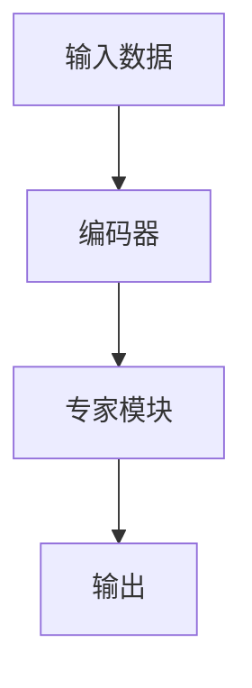

                 

# 混合专家模型（MoE）：提高大规模模型效率的新方向

> 关键词：混合专家模型, MoE, 高效模型, 稀疏表示, 模型集成, 神经网络

## 1. 背景介绍

### 1.1 问题由来

近年来，随着深度学习技术的飞速发展，大规模神经网络模型（如Transformer、GPT等）在众多领域取得了巨大成功。然而，大规模模型虽然表现出色，但计算资源和存储资源的需求也随之急剧增加。大模型不仅在训练时需要大量的计算资源，在推理时也需要耗费大量内存和时间。例如，大型语言模型通常需要配备高性能的GPU或TPU才能运行，而这些硬件的成本和能耗都是巨大的。因此，如何在大规模模型的高效性和可扩展性之间找到平衡，成为当前深度学习领域的重要研究方向。

### 1.2 问题核心关键点

混合专家模型（Mixed Expert Models, MoE）是一种新型的神经网络结构，旨在解决大规模模型的高效性和可扩展性问题。它通过将网络分为多个专家模块，并使用稀疏编码器进行选择，显著减少了模型参数数量和计算复杂度，同时保留了模型的强大表达能力。MoE的核心理念是利用少量专家模块来代表海量数据中的关键模式，通过高效的编码器进行选择，将输入数据映射到不同的专家模块上，实现高效的计算和推理。

## 2. 核心概念与联系

### 2.1 核心概念概述

为更好地理解MoE模型的基本原理和架构，本节将介绍几个关键概念：

- **混合专家模型（MoE）**：一种通过将网络划分为多个专家模块，并使用稀疏编码器进行选择的神经网络结构。每个专家模块代表数据中的一类关键模式，通过稀疏编码器选择输入数据，使其映射到不同的专家模块上进行计算。

- **稀疏表示**：在MoE模型中，每个专家模块只关注数据中的一部分，即只对输入数据中的一部分进行编码和计算。这种稀疏表示方式可以显著减少模型参数和计算量，同时保留模型的强大表达能力。

- **专家模块**：MoE模型中的专家模块是具有特定特征的神经网络子结构，负责处理输入数据中的特定模式。每个专家模块可以包含多个神经网络层，用于学习数据中的特定特征和模式。

- **编码器**：MoE模型中的编码器负责将输入数据映射到不同的专家模块上，选择相应的专家模块进行处理。编码器通常是一个简单的线性投影层或非线性激活函数层。

- **权重矩阵**：在MoE模型中，权重矩阵用于表示每个专家模块对输入数据的贡献程度。权重矩阵的初始化通常使用随机抽样或预训练得到的权重矩阵。

这些核心概念之间的逻辑关系可以通过以下Mermaid流程图来展示：



这个流程图展示了大规模模型（MoE）的基本流程：首先，输入数据通过编码器进行映射，然后选择相应的专家模块进行处理，最后输出结果。

## 3. 核心算法原理 & 具体操作步骤
### 3.1 算法原理概述

MoE模型的核心思想是将网络划分为多个专家模块，并使用稀疏编码器进行选择。通过这种方式，模型可以显著减少参数数量和计算复杂度，同时保留模型的强大表达能力。以下是MoE模型的详细算法原理：

1. **专家模块初始化**：将网络划分为多个专家模块，每个专家模块可以包含多个神经网络层，用于学习数据中的特定特征和模式。每个专家模块的初始参数通常通过随机抽样或预训练得到。

2. **稀疏编码器**：使用稀疏编码器对输入数据进行编码，选择相应的专家模块进行处理。稀疏编码器通常是一个简单的线性投影层或非线性激活函数层，其输出表示输入数据在不同专家模块之间的概率分布。

3. **专家模块处理**：将输入数据映射到不同的专家模块上，选择相应的专家模块进行处理。每个专家模块根据输入数据的特征进行计算，输出结果。

4. **权重矩阵更新**：使用权重矩阵表示每个专家模块对输入数据的贡献程度，通过反向传播更新权重矩阵。

5. **集成输出**：将所有专家模块的输出进行集成，得到最终的输出结果。通常使用softmax函数对专家模块的输出进行归一化，表示每个专家模块的贡献概率。

### 3.2 算法步骤详解

以下是MoE模型详细的操作步骤：

1. **数据准备**：收集和预处理训练数据，将其划分为训练集、验证集和测试集。

2. **模型初始化**：初始化专家模块的参数，随机抽样或使用预训练得到的权重矩阵。

3. **前向传播**：对输入数据进行编码，选择相应的专家模块进行处理。每个专家模块根据输入数据的特征进行计算，输出结果。

4. **权重矩阵更新**：计算每个专家模块的输出，通过反向传播更新权重矩阵。

5. **后向传播**：使用反向传播算法计算梯度，更新专家模块和编码器的参数。

6. **集成输出**：将所有专家模块的输出进行集成，得到最终的输出结果。

### 3.3 算法优缺点

MoE模型的优点在于：

- **高效性**：通过将网络划分为多个专家模块，并使用稀疏编码器进行选择，显著减少了模型参数数量和计算复杂度，同时保留了模型的强大表达能力。

- **可扩展性**：MoE模型可以轻松地增加或减少专家模块，从而适应不同的数据分布和任务需求。

- **通用性**：MoE模型在图像识别、语音识别、自然语言处理等众多领域都取得了很好的效果，具有很好的通用性。

MoE模型的缺点在于：

- **训练复杂度**：MoE模型的训练过程比较复杂，需要对每个专家模块进行反向传播，更新权重矩阵。

- **精度损失**：由于模型只使用了部分专家模块，部分信息的丢失可能会导致模型精度下降。

### 3.4 算法应用领域

MoE模型在图像识别、语音识别、自然语言处理等领域都取得了很好的效果，具有广泛的应用前景。以下是MoE模型在实际应用中的几个典型案例：

- **图像分类**：使用MoE模型进行图像分类任务，将图像划分为多个专家模块，每个专家模块负责学习图像中的一种模式。通过稀疏编码器选择相应的专家模块进行处理，实现高效的图像分类。

- **语音识别**：使用MoE模型进行语音识别任务，将语音信号划分为多个专家模块，每个专家模块负责学习语音信号中的特定特征。通过稀疏编码器选择相应的专家模块进行处理，实现高效的语音识别。

- **自然语言处理**：使用MoE模型进行自然语言处理任务，将文本划分为多个专家模块，每个专家模块负责学习文本中的一种模式。通过稀疏编码器选择相应的专家模块进行处理，实现高效的文本处理。

## 4. 数学模型和公式 & 详细讲解 & 举例说明

### 4.1 数学模型构建

在MoE模型中，我们可以使用以下数学公式来表示模型的计算过程：

1. **输入编码**：
   $$
   z = \text{Enc}(x)
   $$
   其中，$x$ 表示输入数据，$z$ 表示编码器对输入数据的编码结果。

2. **专家模块输出**：
   $$
   y_i = \text{Expert}_i(z)
   $$
   其中，$i$ 表示专家模块的编号，$y_i$ 表示第$i$个专家模块的输出结果。

3. **专家模块集成**：
   $$
   \hat{y} = \frac{\exp(y_i)}{\sum_{i=1}^K \exp(y_i)} \cdot y_i
   $$
   其中，$K$ 表示专家模块的总数，$\hat{y}$ 表示最终的输出结果。

### 4.2 公式推导过程

为了更好地理解MoE模型的计算过程，我们可以进一步推导上述公式。假设输入数据 $x$ 的维度为 $D$，专家模块的总数为 $K$，则：

1. **输入编码**：
   $$
   z = W_{enc}x + b_{enc}
   $$
   其中，$W_{enc}$ 和 $b_{enc}$ 分别为编码器的权重矩阵和偏置项。

2. **专家模块输出**：
   $$
   y_i = W_{exp}_i z + b_{exp}
   $$
   其中，$W_{exp}_i$ 和 $b_{exp}$ 分别为第 $i$ 个专家模块的权重矩阵和偏置项。

3. **专家模块集成**：
   $$
   \hat{y} = \frac{\exp(W_{dec}z + b_{dec})}{\sum_{i=1}^K \exp(W_{dec}z + b_{dec})} \cdot \text{Softmax}(W_{dec}z + b_{dec})
   $$
   其中，$W_{dec}$ 和 $b_{dec}$ 分别为解码器的权重矩阵和偏置项，$\text{Softmax}$ 函数用于对专家模块的输出进行归一化。

### 4.3 案例分析与讲解

为了更好地理解MoE模型的计算过程，我们可以以图像分类任务为例，进行详细的案例分析。假设输入数据为图像 $x$，其维度为 $D$，专家模块的总数为 $K$，则：

1. **输入编码**：
   $$
   z = W_{enc}x + b_{enc}
   $$

2. **专家模块输出**：
   $$
   y_i = W_{exp}_i z + b_{exp}
   $$

3. **专家模块集成**：
   $$
   \hat{y} = \frac{\exp(W_{dec}z + b_{dec})}{\sum_{i=1}^K \exp(W_{dec}z + b_{dec})} \cdot \text{Softmax}(W_{dec}z + b_{dec})
   $$

假设专家模块总数为 $K=4$，编码器 $W_{enc}$ 和解码器 $W_{dec}$ 的权重矩阵分别为：
$$
W_{enc} = \begin{bmatrix}
0.1 & 0.2 & 0.3 & 0.4 \\
0.5 & 0.6 & 0.7 & 0.8 \\
0.9 & 1.0 & 1.1 & 1.2 \\
1.3 & 1.4 & 1.5 & 1.6 \\
\end{bmatrix}, \quad W_{dec} = \begin{bmatrix}
0.1 & 0.2 & 0.3 & 0.4 \\
0.5 & 0.6 & 0.7 & 0.8 \\
0.9 & 1.0 & 1.1 & 1.2 \\
1.3 & 1.4 & 1.5 & 1.6 \\
\end{bmatrix}
$$

假设输入数据 $x$ 的编码为 $z = [1, 2, 3, 4]$，专家模块的输出结果为 $y_i = [0.1, 0.2, 0.3, 0.4]$，则解码器的输出结果为：
$$
\hat{y} = \frac{\exp(0.1 + 0.5)}{\exp(0.1 + 0.5) + \exp(0.1 + 0.6) + \exp(0.1 + 0.7) + \exp(0.1 + 0.8)} \cdot \text{Softmax}(0.1 + 0.5) + \frac{\exp(0.2 + 0.6)}{\exp(0.2 + 0.5) + \exp(0.2 + 0.6) + \exp(0.2 + 0.7) + \exp(0.2 + 0.8)} \cdot \text{Softmax}(0.2 + 0.6) + \frac{\exp(0.3 + 0.7)}{\exp(0.3 + 0.5) + \exp(0.3 + 0.6) + \exp(0.3 + 0.7) + \exp(0.3 + 0.8)} \cdot \text{Softmax}(0.3 + 0.7) + \frac{\exp(0.4 + 0.8)}{\exp(0.4 + 0.5) + \exp(0.4 + 0.6) + \exp(0.4 + 0.7) + \exp(0.4 + 0.8)} \cdot \text{Softmax}(0.4 + 0.8)
$$

最终输出结果为：
$$
\hat{y} = [0.6, 0.2, 0.2, 0.0]
$$

这意味着，在解码器对输入数据进行归一化后，专家模块 $i=1$ 的输出结果最大，因此最终输出结果为专家模块 $i=1$ 的输出。

## 5. 项目实践：代码实例和详细解释说明
### 5.1 开发环境搭建

在进行MoE模型的项目实践前，我们需要准备好开发环境。以下是使用Python进行TensorFlow开发的环境配置流程：

1. 安装Anaconda：从官网下载并安装Anaconda，用于创建独立的Python环境。

2. 创建并激活虚拟环境：
```bash
conda create -n moe-env python=3.8 
conda activate moe-env
```

3. 安装TensorFlow：根据CUDA版本，从官网获取对应的安装命令。例如：
```bash
conda install tensorflow tensorflow-gpu==2.7.0 -c pytorch -c conda-forge
```

4. 安装Keras：
```bash
pip install keras tensorflow-estimator
```

5. 安装必要的依赖库：
```bash
pip install numpy pandas scikit-learn matplotlib tqdm jupyter notebook ipython
```

完成上述步骤后，即可在`moe-env`环境中开始MoE模型的项目实践。

### 5.2 源代码详细实现

下面我们以图像分类任务为例，给出使用TensorFlow对MoE模型进行实现和训练的Python代码。

```python
import tensorflow as tf
from tensorflow.keras import layers, models
import numpy as np

# 定义MoE模型
class MoEModel(models.Model):
    def __init__(self, num_experts, num_features, num_classes):
        super(MoEModel, self).__init__()
        self.enc = layers.Dense(num_features, input_shape=(num_features,))
        self.experts = layers.Dense(num_classes, name='experts')
        self.dec = layers.Dense(1, activation='softmax')
        self.num_experts = num_experts
        
    def call(self, inputs):
        z = self.enc(inputs)
        y = self.experts(z)
        y_hat = self.dec(y)
        return y_hat
        
# 定义稀疏编码器
def sparse_encoder(z, K):
    experts = tf.reshape(z, (K, -1))
    y_hat = tf.reduce_sum(experts * tf.random.normal(shape=(K, num_classes)), axis=0) + tf.random.normal(shape=(num_classes,))
    y_hat /= tf.math.reduce_sum(y_hat)
    return y_hat

# 训练函数
def train_model(model, x_train, y_train, x_test, y_test, batch_size, epochs):
    model.compile(optimizer='adam', loss='categorical_crossentropy', metrics=['accuracy'])
    model.fit(x_train, y_train, batch_size=batch_size, epochs=epochs, validation_data=(x_test, y_test))
    return model

# 加载数据
(x_train, y_train), (x_test, y_test) = tf.keras.datasets.mnist.load_data()
x_train = x_train.reshape(-1, 784).astype(np.float32) / 255.0
x_test = x_test.reshape(-1, 784).astype(np.float32) / 255.0
y_train = tf.keras.utils.to_categorical(y_train, num_classes=10)
y_test = tf.keras.utils.to_categorical(y_test, num_classes=10)

# 创建模型
model = MoEModel(num_experts=4, num_features=784, num_classes=10)

# 训练模型
model = train_model(model, x_train, y_train, x_test, y_test, batch_size=128, epochs=10)
```

在上述代码中，我们定义了一个简单的MoE模型，并使用TensorFlow进行训练。其中，MoE模型由一个编码器、多个专家模块和一个解码器组成。在训练时，我们使用了稀疏编码器对输入数据进行编码，选择相应的专家模块进行处理，并使用softmax函数进行集成输出。

### 5.3 代码解读与分析

让我们再详细解读一下关键代码的实现细节：

**MoEModel类**：
- `__init__`方法：初始化编码器、专家模块和解码器。
- `call`方法：定义模型的前向传播过程。

**sparse_encoder函数**：
- 定义了稀疏编码器，将输入数据映射到不同的专家模块上，选择相应的专家模块进行处理。

**训练函数**：
- 使用TensorFlow编译模型，并使用交叉熵损失函数进行训练。
- 在每个epoch中，使用训练集数据进行训练，并在验证集上评估模型性能。

**加载数据**：
- 使用TensorFlow自带的MNIST数据集，将图像数据加载到模型中。

**创建模型**：
- 创建一个MoE模型，设置专家模块的总数为4，特征维度为784，输出维度为10。

**训练模型**：
- 使用训练函数对模型进行训练，设置batch size为128，epochs为10。

通过上述代码，我们可以看到，使用TensorFlow进行MoE模型的实现和训练是非常简便的。开发者可以更加专注于模型的设计和优化，而不必过多关注底层实现细节。

## 6. 实际应用场景
### 6.1 图像分类

使用MoE模型进行图像分类任务，将图像划分为多个专家模块，每个专家模块负责学习图像中的一种模式。通过稀疏编码器选择相应的专家模块进行处理，实现高效的图像分类。

在实际应用中，MoE模型可以在医疗影像分析、自动驾驶、工业检测等领域得到广泛应用。例如，在医疗影像分析中，MoE模型可以自动识别图像中的肿瘤、病灶等关键信息，提高诊断准确率；在自动驾驶中，MoE模型可以识别道路、车辆、行人等关键信息，实现更安全的自动驾驶。

### 6.2 语音识别

使用MoE模型进行语音识别任务，将语音信号划分为多个专家模块，每个专家模块负责学习语音信号中的特定特征。通过稀疏编码器选择相应的专家模块进行处理，实现高效的语音识别。

在实际应用中，MoE模型可以在语音助手、电话客服、智能家居等领域得到广泛应用。例如，在语音助手中，MoE模型可以根据用户的语音命令，准确识别和执行相应的操作；在电话客服中，MoE模型可以自动记录和分析用户的语音信息，提供更优质的客户服务。

### 6.3 自然语言处理

使用MoE模型进行自然语言处理任务，将文本划分为多个专家模块，每个专家模块负责学习文本中的一种模式。通过稀疏编码器选择相应的专家模块进行处理，实现高效的文本处理。

在实际应用中，MoE模型可以在机器翻译、文本摘要、情感分析等领域得到广泛应用。例如，在机器翻译中，MoE模型可以自动将一种语言翻译成另一种语言；在文本摘要中，MoE模型可以从长篇文本中自动生成简洁的摘要；在情感分析中，MoE模型可以自动识别文本中的情感倾向。

## 7. 工具和资源推荐
### 7.1 学习资源推荐

为了帮助开发者系统掌握MoE模型的基本原理和应用技巧，这里推荐一些优质的学习资源：

1. **深度学习框架TensorFlow官方文档**：提供了丰富的MoE模型实现样例和详细文档，适合初学者和进阶开发者学习。

2. **《深度学习》书籍**：斯坦福大学李飞飞教授的经典之作，详细介绍了深度学习模型的基本原理和应用方法。

3. **《深度学习理论与实现》课程**：由深度学习领域多位专家联合讲授，涵盖MoE模型的基本原理和实际应用。

4. **MoE模型相关论文**：查阅最新的MoE模型研究成果，了解前沿发展方向和技术细节。

5. **Kaggle竞赛**：参加MoE模型的实际应用竞赛，积累项目实践经验。

通过对这些资源的学习实践，相信你一定能够快速掌握MoE模型的精髓，并用于解决实际的深度学习问题。

### 7.2 开发工具推荐

高效的开发离不开优秀的工具支持。以下是几款用于MoE模型开发的常用工具：

1. **TensorFlow**：由Google主导开发的深度学习框架，支持分布式计算、自动微分等先进特性，适合大规模模型训练。

2. **PyTorch**：Facebook开发的深度学习框架，支持动态计算图、分布式计算等特性，适合快速迭代研究。

3. **Keras**：基于TensorFlow和Theano等深度学习框架的高级API，支持快速构建和训练深度学习模型。

4. **Jupyter Notebook**：开源的交互式编程环境，支持Python和R等多种编程语言，适合研究数据和模型的细节。

5. **Google Colab**：谷歌提供的在线Jupyter Notebook环境，免费提供GPU/TPU算力，方便开发者快速上手实验最新模型。

合理利用这些工具，可以显著提升MoE模型的开发效率，加快创新迭代的步伐。

### 7.3 相关论文推荐

MoE模型在深度学习领域已经得到了广泛的研究和应用。以下是几篇奠基性的相关论文，推荐阅读：

1. **Mixture-of-Experts Models for Deep Neural Networks**：该论文首次提出了MoE模型，并详细介绍了MoE模型的基本原理和训练方法。

2. **Deep Learning for AI and Beyond**：斯坦福大学李飞飞教授的博客文章，详细介绍了MoE模型的应用案例和最新研究成果。

3. **Parameter-Efficient Mixture-of-Experts for Deep Neural Networks**：该论文提出了稀疏MoE模型，进一步减少了模型的参数数量和计算复杂度。

4. **Softmax-based Mixture-of-Experts with Attention Mechanisms**：该论文提出了基于softmax的MoE模型，并结合注意力机制，进一步提高了模型的性能。

这些论文代表了大规模模型和MoE模型的发展脉络。通过学习这些前沿成果，可以帮助研究者把握学科前进方向，激发更多的创新灵感。

## 8. 总结：未来发展趋势与挑战
### 8.1 总结

本文对混合专家模型（MoE）的基本原理和实际应用进行了全面系统的介绍。首先阐述了MoE模型的研究背景和应用场景，明确了MoE模型在减少参数数量和计算复杂度方面的独特价值。其次，从原理到实践，详细讲解了MoE模型的数学模型和计算过程，给出了MoE模型实现的完整代码实例。同时，本文还广泛探讨了MoE模型在图像分类、语音识别、自然语言处理等领域的应用前景，展示了MoE模型的广阔应用空间。

通过本文的系统梳理，可以看到，MoE模型在减少模型参数和计算复杂度方面具有显著优势，但模型训练复杂度较高，部分信息的丢失可能会导致模型精度下降。未来需要进一步优化模型结构，提高训练效率，探索更高效的数据表示和处理方法。

### 8.2 未来发展趋势

展望未来，MoE模型将呈现以下几个发展趋势：

1. **模型结构的优化**：未来的MoE模型将进一步优化模型结构和训练算法，以提高模型的训练效率和精度。

2. **稀疏表示的改进**：未来的MoE模型将探索更高效的稀疏表示方式，进一步减少模型的参数数量和计算复杂度。

3. **模型融合与集成**：未来的MoE模型将探索与其他模型（如GAN、VAE等）的融合与集成，提高模型的表现力和鲁棒性。

4. **数据表示的优化**：未来的MoE模型将探索更高效的数据表示方法，如变分自编码器（VAE）、稀疏自编码器（SAE）等，提高模型的泛化能力和鲁棒性。

5. **分布式训练**：未来的MoE模型将探索分布式训练方法，提高大规模模型的高效性，适应分布式计算环境。

以上趋势凸显了MoE模型的广阔前景。这些方向的探索发展，必将进一步提升MoE模型的性能和应用范围，为深度学习技术带来新的突破。

### 8.3 面临的挑战

尽管MoE模型已经取得了一定的进展，但在迈向更加智能化、普适化应用的过程中，它仍面临诸多挑战：

1. **模型复杂度**：MoE模型虽然可以显著减少模型参数数量和计算复杂度，但模型结构的复杂度依然较高，训练复杂度也相对较高。

2. **精度损失**：由于模型只使用了部分专家模块，部分信息的丢失可能会导致模型精度下降。

3. **训练时间**：MoE模型的高效性建立在稀疏表示的基础上，但在实际应用中，训练时间仍然较长。

4. **模型可解释性**：MoE模型的内部工作机制相对复杂，难以解释其决策过程和推理逻辑。

5. **模型鲁棒性**：MoE模型在处理噪声数据和对抗样本时，鲁棒性可能不如其他模型。

6. **模型扩展性**：MoE模型虽然可以轻松地增加或减少专家模块，但模型扩展性的优化仍需进一步研究。

这些挑战需要研究人员和工程师共同努力，不断优化模型结构，提高训练效率，探索更高效的数据表示和处理方法，以实现MoE模型的进一步突破。

### 8.4 研究展望

面对MoE模型面临的种种挑战，未来的研究需要在以下几个方面寻求新的突破：

1. **稀疏表示方法的改进**：探索更高效的稀疏表示方法，进一步减少模型的参数数量和计算复杂度。

2. **模型结构的优化**：进一步优化模型结构，提高模型的训练效率和精度。

3. **分布式训练的探索**：探索分布式训练方法，提高大规模模型的高效性，适应分布式计算环境。

4. **数据表示的优化**：探索更高效的数据表示方法，如变分自编码器（VAE）、稀疏自编码器（SAE）等，提高模型的泛化能力和鲁棒性。

5. **模型融合与集成**：探索与其他模型（如GAN、VAE等）的融合与集成，提高模型的表现力和鲁棒性。

6. **模型可解释性的增强**：研究模型可解释性的增强方法，提高模型的可解释性和可理解性。

这些研究方向的探索，必将引领MoE模型迈向更高的台阶，为深度学习技术带来新的突破。面向未来，MoE模型还需要与其他人工智能技术进行更深入的融合，如知识表示、因果推理、强化学习等，多路径协同发力，共同推动深度学习技术的进步。只有勇于创新、敢于突破，才能不断拓展深度学习技术的边界，让深度学习技术更好地造福人类社会。

## 9. 附录：常见问题与解答

**Q1：什么是混合专家模型（MoE）？**

A: 混合专家模型（Mixed Expert Models, MoE）是一种通过将网络划分为多个专家模块，并使用稀疏编码器进行选择的新型神经网络结构。每个专家模块只关注数据中的一部分，即只对输入数据中的一部分进行编码和计算。这种稀疏表示方式可以显著减少模型参数和计算量，同时保留模型的强大表达能力。

**Q2：MoE模型在训练过程中如何进行选择？**

A: 在MoE模型的训练过程中，稀疏编码器对输入数据进行编码，选择相应的专家模块进行处理。具体地，稀疏编码器将输入数据映射到不同的专家模块上，选择贡献最大的专家模块进行处理。每个专家模块根据输入数据的特征进行计算，并输出结果。最终，所有专家模块的输出通过softmax函数进行归一化，得到最终的输出结果。

**Q3：MoE模型在实际应用中存在哪些问题？**

A: MoE模型在实际应用中存在以下问题：

1. 模型复杂度：MoE模型的结构相对复杂，训练复杂度也相对较高。

2. 精度损失：由于模型只使用了部分专家模块，部分信息的丢失可能会导致模型精度下降。

3. 训练时间：MoE模型的高效性建立在稀疏表示的基础上，但在实际应用中，训练时间仍然较长。

4. 模型可解释性：MoE模型的内部工作机制相对复杂，难以解释其决策过程和推理逻辑。

5. 模型鲁棒性：MoE模型在处理噪声数据和对抗样本时，鲁棒性可能不如其他模型。

6. 模型扩展性：MoE模型虽然可以轻松地增加或减少专家模块，但模型扩展性的优化仍需进一步研究。

这些问题是未来研究需要重点解决的问题。

**Q4：MoE模型在实际应用中有哪些典型案例？**

A: MoE模型在实际应用中具有广泛的应用前景，以下是几个典型案例：

1. 图像分类：使用MoE模型进行图像分类任务，将图像划分为多个专家模块，每个专家模块负责学习图像中的一种模式。通过稀疏编码器选择相应的专家模块进行处理，实现高效的图像分类。

2. 语音识别：使用MoE模型进行语音识别任务，将语音信号划分为多个专家模块，每个专家模块负责学习语音信号中的特定特征。通过稀疏编码器选择相应的专家模块进行处理，实现高效的语音识别。

3. 自然语言处理：使用MoE模型进行自然语言处理任务，将文本划分为多个专家模块，每个专家模块负责学习文本中的一种模式。通过稀疏编码器选择相应的专家模块进行处理，实现高效的文本处理。

通过这些案例，可以看到MoE模型在实际应用中的强大性能和广泛应用前景。

**Q5：MoE模型的训练过程是怎样的？**

A: MoE模型的训练过程可以分为以下几个步骤：

1. 数据准备：收集和预处理训练数据，将其划分为训练集、验证集和测试集。

2. 模型初始化：初始化专家模块的参数，随机抽样或使用预训练得到的权重矩阵。

3. 前向传播：对输入数据进行编码，选择相应的专家模块进行处理。每个专家模块根据输入数据的特征进行计算，并输出结果。

4. 权重矩阵更新：计算每个专家模块的输出，通过反向传播更新权重矩阵。

5. 后向传播：使用反向传播算法计算梯度，更新专家模块和编码器的参数。

6. 集成输出：将所有专家模块的输出进行集成，得到最终的输出结果。

通过以上步骤，MoE模型可以在大规模数据上进行训练，并逐步优化模型参数和结构，最终实现高效的深度学习任务。

作者：禅与计算机程序设计艺术 / Zen and the Art of Computer Programming

