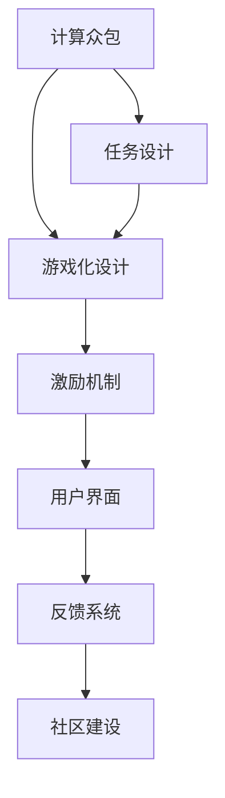

                 

# 游戏化参与：让参与人类计算妙趣横生

> 关键词：游戏化参与, 游戏化设计, 人类计算, 游戏化计算, 众包计算, 参与激励机制, 计算众包, 心理模型

## 1. 背景介绍

### 1.1 问题由来
随着数字化和网络化的普及，计算任务变得越来越复杂，单靠个人或企业无法完成所有计算工作。为了应对这一挑战，计算众包（Computational Crowdsourcing）应运而生。计算众包旨在通过大规模的人力资源，完成复杂和耗时的计算任务，如科学数据处理、深度学习训练、基因组分析等。

但计算众包存在一个显著问题：参与者的积极性和持久性难以保证。如何设计有效的参与激励机制，吸引并维持参与者的参与，是计算众包面临的主要挑战。

游戏化参与（Gamified Participation）的概念应运而生。通过将计算任务设计成具有趣味性和挑战性的游戏，激发参与者的内在动机，提高参与度。游戏化设计不仅可以提升参与者对计算任务的兴趣，还能有效减轻计算过程中的枯燥与乏味。

### 1.2 问题核心关键点
游戏化参与的核心在于如何将复杂的计算任务转化为具有吸引力的游戏形式。通常，游戏化参与分为以下几个关键步骤：

1. **任务设计**：将计算任务设计成具有趣味性和挑战性的游戏，如解谜、竞赛等。
2. **激励机制**：设计合理的参与激励，如积分、虚拟货币、排行榜等，以激发参与者参与热情。
3. **用户界面**：设计直观、易用的用户界面，降低参与门槛。
4. **反馈系统**：提供即时反馈，让参与者感受到成就感，增强持续参与的动力。
5. **社区建设**：构建社区，增强参与者的归属感和荣誉感。

游戏化参与不仅提升了参与度，还通过大规模人力参与，有效解决了计算资源不足的问题。

### 1.3 问题研究意义
游戏化参与在计算众包中的应用，对提升计算效率和降低计算成本具有重要意义。

1. **降低计算成本**：通过吸引大量廉价劳动力参与计算，大大降低了计算任务所需的成本。
2. **提升计算效率**：游戏化的设计能激发参与者更高的积极性，从而提升计算速度。
3. **优化资源配置**：通过游戏化激励，能有效优化人力资源的配置，提高计算任务的整体效率。
4. **增强技术创新**：游戏化参与促进了参与者之间的互动和合作，有助于技术创新的产生。
5. **推动社会价值**：游戏化参与不仅能解决计算资源不足的问题，还能通过大规模参与推动社会价值，如科学发现、公共健康、环境保护等。

通过研究游戏化参与的方法和策略，有助于构建更加高效、可持续的计算系统。

## 2. 核心概念与联系

### 2.1 核心概念概述

为更好地理解游戏化参与，本节将介绍几个关键概念：

- **计算众包**：利用大规模人力资源完成复杂计算任务的社会计算模式。
- **游戏化设计**：通过游戏元素和机制，提升用户体验和参与度的设计理念。
- **计算参与**：参与者通过解决计算任务获得奖励的过程。
- **激励机制**：设计合理的奖励体系，激发参与者持续参与。
- **心理模型**：解释参与者行为的心理模型，如成就动机、社交需求等。

这些概念之间的逻辑关系可以通过以下Mermaid流程图来展示：



这个流程图展示了这个概念之间的逻辑关系：

1. 计算众包通过大规模人力资源完成复杂计算任务。
2. 游戏化设计将计算任务转化为具有趣味性和挑战性的游戏。
3. 激励机制通过合理的奖励体系激发参与者参与。
4. 用户界面设计增强参与者的易用性和体验。
5. 反馈系统提供即时反馈，增强参与者的成就感。
6. 社区建设增强参与者的归属感和荣誉感。

这些概念共同构成了游戏化参与的框架，使其能够有效地提升计算任务的参与度和效率。

## 3. 核心算法原理 & 具体操作步骤
### 3.1 算法原理概述

游戏化参与的核心原理在于通过游戏元素和机制，提升参与者对计算任务的兴趣和动力。具体而言，可以通过以下几个关键策略：

- **任务设计**：将计算任务设计成具有趣味性和挑战性的游戏。
- **激励机制**：设计合理的奖励体系，激发参与者的内在动机。
- **用户界面**：设计直观、易用的用户界面，降低参与门槛。
- **反馈系统**：提供即时反馈，增强参与者的成就感和动力。
- **社区建设**：构建社区，增强参与者的归属感和荣誉感。

### 3.2 算法步骤详解

以下是一个典型的游戏化参与实施步骤：

**Step 1: 任务设计**
- **任务选择**：选择适合的计算任务，如科学数据处理、深度学习训练等。
- **游戏化元素**：将计算任务转化为游戏形式，如解谜、竞赛等。
- **任务难度**：设计任务难度，确保任务既具有挑战性，又不过于困难。

**Step 2: 激励机制设计**
- **奖励体系**：设计合理的奖励体系，如积分、虚拟货币、排行榜等。
- **分级奖励**：根据任务难度设计分级奖励，提升参与者的成就感和动力。
- **任务进度**：显示任务进度和完成度，激励参与者继续参与。

**Step 3: 用户界面设计**
- **界面设计**：设计直观、易用的用户界面，降低参与门槛。
- **交互设计**：设计流畅的交互过程，增强用户体验。
- **反馈设计**：提供即时反馈，增强参与者的成就感和动力。

**Step 4: 反馈系统设计**
- **即时反馈**：提供即时反馈，让参与者感受到成就感。
- **进度展示**：显示任务进度和完成度，增强参与者的成就感和动力。
- **排行榜**：展示排行榜，增强参与者的竞争力和荣誉感。

**Step 5: 社区建设**
- **社区功能**：设计社区功能，如讨论区、任务分享等，增强参与者的归属感和荣誉感。
- **奖励系统**：设计社区奖励系统，激励参与者的社区参与。

通过这些步骤，可以设计出具有吸引力、易于参与、具备激励机制的游戏化参与系统。

### 3.3 算法优缺点

游戏化参与具有以下优点：

- **提升参与度**：通过游戏元素和机制，提升参与者对计算任务的兴趣和动力，增强持续参与的可能性。
- **降低成本**：吸引大量廉价劳动力参与计算任务，降低计算成本。
- **优化资源配置**：通过游戏化激励，有效优化人力资源的配置，提高计算任务的整体效率。

同时，游戏化参与也存在一些局限性：

- **设计复杂**：游戏化参与的设计需要考虑多方面的因素，如任务设计、激励机制、用户界面等，设计复杂。
- **数据隐私**：参与者数据隐私保护问题需要特别关注，避免数据泄露。
- **社区管理**：社区的建设和管理需要投入大量时间和精力，管理复杂。

尽管存在这些局限性，但游戏化参与作为一种有效的计算众包方法，在实际应用中已经得到了广泛的应用。

### 3.4 算法应用领域

游戏化参与已经在多个领域得到了应用，具体如下：

- **科学研究**：科学数据处理、生物信息学等计算密集型任务，如使用CrowdFlower等平台进行数据标注。
- **医学研究**：基因组学、药物研发等计算密集型任务，如使用Amazon Mechanical Turk进行基因序列标注。
- **公共卫生**：流行病学研究、公共健康监测等任务，如使用Humaniti进行大规模疫情数据分析。
- **环境保护**：气候变化、生态系统监测等任务，如使用Computational Earth进行气候数据处理。

除了上述这些经典应用领域外，游戏化参与还被创新性地应用到更多场景中，如教育、金融、制造业等，为这些行业带来了新的解决方案。

## 4. 数学模型和公式 & 详细讲解 & 举例说明

### 4.1 数学模型构建

为了更精确地描述游戏化参与的效果，我们可以建立一个简单的数学模型。假设参与者参与计算任务的期望收益为 $E$，参与者获得的实际收益为 $R$。期望收益 $E$ 包括两部分：参与计算任务获得的期望收益 $E_t$ 和参与游戏化活动获得的期望收益 $E_g$。实际收益 $R$ 包括两部分：参与计算任务获得的实际收益 $R_t$ 和参与游戏化活动获得的实际收益 $R_g$。

则有：

$$
E = E_t + E_g
$$

$$
R = R_t + R_g
$$

游戏化参与的效果可以通过期望收益 $E$ 和实际收益 $R$ 的差异来衡量。期望收益 $E$ 越高，游戏化参与的效果越好。实际收益 $R$ 越接近期望收益 $E$，游戏化参与的效果越显著。

### 4.2 公式推导过程

以下我们推导游戏化参与的效果。

假设参与者参与计算任务的期望收益 $E_t$ 和实际收益 $R_t$ 分别为：

$$
E_t = f(T)
$$

$$
R_t = g(T)
$$

其中 $T$ 为任务难度，$f(T)$ 为参与计算任务的期望收益函数，$g(T)$ 为参与计算任务的实际收益函数。

参与者参与游戏化活动的期望收益 $E_g$ 和实际收益 $R_g$ 分别为：

$$
E_g = h(G)
$$

$$
R_g = i(G)
$$

其中 $G$ 为游戏化活动难度，$h(G)$ 为参与游戏化活动的期望收益函数，$i(G)$ 为参与游戏化活动的实际收益函数。

则有：

$$
E = E_t + E_g = f(T) + h(G)
$$

$$
R = R_t + R_g = g(T) + i(G)
$$

游戏化参与的效果可以通过期望收益 $E$ 和实际收益 $R$ 的差异来衡量。期望收益 $E$ 越高，游戏化参与的效果越好。实际收益 $R$ 越接近期望收益 $E$，游戏化参与的效果越显著。

### 4.3 案例分析与讲解

以科学数据标注任务为例，分析游戏化参与的效果。

**任务设计**：选择数据标注任务，设计成有奖标注竞赛，吸引大量参与者参与。

**激励机制**：设计积分系统，标注正确数据获得积分，积分可用于兑换奖励。

**用户界面**：设计简洁、易用的标注界面，降低参与门槛。

**反馈系统**：提供即时反馈，标注错误数据提示修正。

**社区建设**：构建社区，参与者可以在社区内交流、讨论，增强归属感。

通过游戏化设计，参与者对数据标注任务感兴趣，积极参与。积分系统激励参与者标注更多数据，社区交流增强参与者的成就感和荣誉感，最终提高了数据标注任务的完成度和质量。

## 5. 项目实践：代码实例和详细解释说明

### 5.1 开发环境搭建

在进行游戏化参与开发前，我们需要准备好开发环境。以下是使用Python进行Flask开发的环境配置流程：

1. 安装Anaconda：从官网下载并安装Anaconda，用于创建独立的Python环境。

2. 创建并激活虚拟环境：
```bash
conda create -n flask-env python=3.8 
conda activate flask-env
```

3. 安装Flask：
```bash
pip install flask
```

4. 安装Werkzeug：
```bash
pip install werkzeug
```

5. 安装Jinja2：
```bash
pip install jinja2
```

完成上述步骤后，即可在`flask-env`环境中开始游戏化参与的开发。

### 5.2 源代码详细实现

下面以科学数据标注任务为例，给出使用Flask框架进行游戏化参与开发的Python代码实现。

首先，定义Flask应用和路由：

```python
from flask import Flask, request, jsonify

app = Flask(__name__)

@app.route('/task', methods=['POST'])
def task():
    data = request.get_json()
    task_id = data['task_id']
    participant_id = data['participant_id']
    
    # 执行计算任务并返回结果
    result = perform_calculation(task_id)
    response = {'task_id': task_id, 'participant_id': participant_id, 'result': result}
    return jsonify(response)

@app.route('/reward', methods=['POST'])
def reward():
    data = request.get_json()
    participant_id = data['participant_id']
    reward_type = data['reward_type']
    
    # 执行奖励处理
    process_reward(participant_id, reward_type)
    response = {'reward_type': reward_type}
    return jsonify(response)

@app.route('/leaderboard', methods=['GET'])
def leaderboard():
    # 查询排行榜
    leaderboard_data = query_leaderboard()
    response = {'title': 'Leaderboard', 'data': leaderboard_data}
    return jsonify(response)

@app.route('/community', methods=['GET'])
def community():
    # 查询社区内容
    community_data = query_community()
    response = {'title': 'Community', 'data': community_data}
    return jsonify(response)
```

然后，定义计算任务和奖励处理函数：

```python
def perform_calculation(task_id):
    # 执行计算任务并返回结果
    pass

def process_reward(participant_id, reward_type):
    # 执行奖励处理
    pass
```

最后，启动Flask应用：

```python
if __name__ == '__main__':
    app.run(debug=True)
```

以上是使用Flask框架进行科学数据标注任务游戏化参与开发的完整代码实现。可以看到，通过Flask框架，开发者可以轻松搭建游戏化参与的应用，实现任务设计、激励机制、用户界面、反馈系统和社区建设等功能。

### 5.3 代码解读与分析

让我们再详细解读一下关键代码的实现细节：

**Flask应用和路由**：
- `@app.route` 装饰器用于定义路由和请求方法，如 `/task` 和 `/reward` 分别处理计算任务和奖励处理的请求。
- `request.get_json()` 用于获取请求中的JSON数据。
- `jsonify` 函数用于将Python字典转换为JSON格式返回。

**计算任务处理**：
- `perform_calculation` 函数用于执行计算任务，根据任务ID返回结果。
- 计算任务的实现需要根据具体任务进行设计，如使用科学计算库进行数据处理、深度学习模型训练等。

**奖励处理**：
- `process_reward` 函数用于处理参与者获得的奖励，根据参与者ID和奖励类型进行处理。
- 奖励处理的实现需要根据具体奖励类型进行设计，如积分系统、虚拟货币等。

**排行榜查询和社区内容查询**：
- `query_leaderboard` 函数用于查询排行榜数据。
- `query_community` 函数用于查询社区内容数据。

这些函数实现了游戏化参与的基本功能，包括任务处理、奖励处理、排行榜查询和社区内容查询。

通过Flask框架，开发者可以方便地搭建游戏化参与的应用，实现计算任务的游戏化设计、激励机制、用户界面、反馈系统和社区建设等功能。开发者可以根据具体任务的需求，对函数进行进一步的优化和扩展。

## 6. 实际应用场景
### 6.1 智能科学研究

在科学研究领域，游戏化参与可以通过吸引大量参与者，加速科学数据处理和分析任务。例如，在生物信息学中，基因序列标注任务可以通过游戏化参与进行加速。

**任务设计**：将基因序列标注任务设计成有奖标注竞赛，吸引大量参与者参与。

**激励机制**：设计积分系统，标注正确数据获得积分，积分可用于兑换奖励。

**用户界面**：设计简洁、易用的标注界面，降低参与门槛。

**反馈系统**：提供即时反馈，标注错误数据提示修正。

**社区建设**：构建社区，参与者可以在社区内交流、讨论，增强归属感。

通过游戏化设计，参与者对基因序列标注任务感兴趣，积极参与。积分系统激励参与者标注更多数据，社区交流增强参与者的成就感和荣誉感，最终提高了基因序列标注任务的完成度和质量。

### 6.2 公共卫生监测

在公共卫生监测领域，游戏化参与可以通过吸引大量参与者，加速疫情数据处理和分析任务。例如，在流行病学研究中，疫情数据处理任务可以通过游戏化参与进行加速。

**任务设计**：将疫情数据处理任务设计成有奖数据标注竞赛，吸引大量参与者参与。

**激励机制**：设计积分系统，标注正确数据获得积分，积分可用于兑换奖励。

**用户界面**：设计简洁、易用的数据标注界面，降低参与门槛。

**反馈系统**：提供即时反馈，标注错误数据提示修正。

**社区建设**：构建社区，参与者可以在社区内交流、讨论，增强归属感。

通过游戏化设计，参与者对疫情数据处理任务感兴趣，积极参与。积分系统激励参与者标注更多数据，社区交流增强参与者的成就感和荣誉感，最终提高了疫情数据处理任务的完成度和质量。

### 6.3 环境保护研究

在环境保护研究领域，游戏化参与可以通过吸引大量参与者，加速环境数据处理和分析任务。例如，在气候变化研究中，气候数据处理任务可以通过游戏化参与进行加速。

**任务设计**：将气候数据处理任务设计成有奖数据标注竞赛，吸引大量参与者参与。

**激励机制**：设计积分系统，标注正确数据获得积分，积分可用于兑换奖励。

**用户界面**：设计简洁、易用的数据标注界面，降低参与门槛。

**反馈系统**：提供即时反馈，标注错误数据提示修正。

**社区建设**：构建社区，参与者可以在社区内交流、讨论，增强归属感。

通过游戏化设计，参与者对气候数据处理任务感兴趣，积极参与。积分系统激励参与者标注更多数据，社区交流增强参与者的成就感和荣誉感，最终提高了气候数据处理任务的完成度和质量。

## 7. 工具和资源推荐
### 7.1 学习资源推荐

为了帮助开发者系统掌握游戏化参与的理论基础和实践技巧，这里推荐一些优质的学习资源：

1. **《游戏化设计》书籍**：《Game Design Patterns》一书，由著名游戏设计师Sethburg编写，介绍了多种游戏化设计模式。

2. **Coursera《游戏设计》课程**：Coursera平台上开设的《Game Design》课程，由NYU游戏设计学院教授授课，涵盖了游戏设计的基础知识和实践技巧。

3. **Udemy《游戏化设计》课程**：Udemy平台上开设的《Gamification Design》课程，由游戏化设计专家授课，介绍了游戏化设计的理论基础和实际应用。

4. **Game Anatomy网站**：网站提供丰富的游戏化设计案例和资源，帮助开发者了解游戏化设计的实际应用。

5. **Gamasutra网站**：网站提供大量游戏设计、开发、营销等资源，帮助开发者了解游戏化设计的最新动态和前沿技术。

通过对这些资源的学习实践，相信你一定能够快速掌握游戏化参与的精髓，并用于解决实际的计算任务。

### 7.2 开发工具推荐

高效的开发离不开优秀的工具支持。以下是几款用于游戏化参与开发的常用工具：

1. **Flask框架**：轻量级的Web框架，易于上手，支持Python开发，适合游戏化参与的Web应用开发。

2. **Django框架**：功能丰富的Web框架，支持Python开发，适合复杂的游戏化参与应用开发。

3. **TensorFlow**：Google开源的深度学习框架，支持大规模数据处理和分析任务，适合复杂的游戏化参与任务开发。

4. **PyTorch**：Facebook开源的深度学习框架，支持动态图模型，适合实时游戏化参与任务开发。

5. **Unity3D**：强大的游戏引擎，支持多平台开发，适合游戏化参与的实时开发和测试。

合理利用这些工具，可以显著提升游戏化参与的开发效率，加快创新迭代的步伐。

### 7.3 相关论文推荐

游戏化参与的研究源于学界的持续研究。以下是几篇奠基性的相关论文，推荐阅读：

1. **《游戏化设计：利用游戏元素提高参与度和体验》**：Deterding等人在2011年发表的论文，介绍了游戏化设计的核心概念和应用策略。

2. **《计算众包：利用大众计算资源完成任务》**：Bonnell等人在2008年发表的论文，介绍了计算众包的概念和应用。

3. **《游戏化学习：利用游戏元素提高学习效果》**：Hollywell等人在2013年发表的论文，介绍了游戏化学习的基本原理和应用策略。

4. **《游戏化参与：利用游戏元素提高计算参与度》**：Li等人在2017年发表的论文，介绍了游戏化参与的基本原理和应用策略。

这些论文代表了大语言模型微调技术的发展脉络。通过学习这些前沿成果，可以帮助研究者把握学科前进方向，激发更多的创新灵感。

## 8. 总结：未来发展趋势与挑战

### 8.1 总结

本文对游戏化参与方法进行了全面系统的介绍。首先阐述了游戏化参与的背景和意义，明确了游戏化参与在计算众包中的重要作用。其次，从原理到实践，详细讲解了游戏化参与的数学模型和关键步骤，给出了游戏化参与任务开发的完整代码实例。同时，本文还广泛探讨了游戏化参与在科学研究、公共卫生、环境保护等诸多领域的应用前景，展示了游戏化参与范式的广泛应用潜力。此外，本文精选了游戏化参与的各种学习资源，力求为读者提供全方位的技术指引。

通过本文的系统梳理，可以看到，游戏化参与作为一种高效的计算众包方法，不仅提升了参与者的积极性和持续参与的可能性，还通过大规模人力资源，有效解决了计算资源不足的问题。未来，伴随游戏化参与技术的不断演进，必将在更多领域得到应用，为计算任务的完成带来新的突破。

### 8.2 未来发展趋势

展望未来，游戏化参与将呈现以下几个发展趋势：

1. **多元化任务设计**：除了传统的科学数据标注、流行病学数据处理等任务外，未来将涌现更多元化的计算任务，如金融数据分析、社会网络分析等。
2. **智能化激励机制**：未来的激励机制将更加智能化，通过数据分析和用户行为预测，动态调整激励策略，提升参与度。
3. **多模态数据整合**：未来的游戏化参与将更多地融合多模态数据，如文本、图像、视频等，提升任务处理的全面性和准确性。
4. **实时化社区互动**：未来的社区建设将更加实时化，通过实时互动和协作，增强参与者的归属感和荣誉感。
5. **个性化参与体验**：未来的游戏化参与将更加个性化，通过数据分析和用户行为预测，提供个性化的参与体验，增强用户粘性。

以上趋势凸显了游戏化参与技术的广阔前景。这些方向的探索发展，必将进一步提升计算任务的参与度和效率，推动计算众包技术的进步。

### 8.3 面临的挑战

尽管游戏化参与已经取得了瞩目成就，但在迈向更加智能化、普适化应用的过程中，它仍面临着诸多挑战：

1. **任务设计复杂**：游戏化任务设计需要考虑多方面的因素，如任务难度、任务类型等，设计复杂。
2. **数据隐私保护**：参与者数据隐私保护问题需要特别关注，避免数据泄露。
3. **社区管理复杂**：社区的建设和管理需要投入大量时间和精力，管理复杂。
4. **激励机制设计**：激励机制的设计需要考虑多方面的因素，如激励强度、激励类型等，设计复杂。
5. **用户粘性维持**：如何维持用户的长期参与，提升用户粘性，需要持续关注和优化。

尽管存在这些挑战，但游戏化参与作为一种高效的计算众包方法，在实际应用中已经得到了广泛的应用。未来，伴随技术不断演进，游戏化参与必将更加智能化、普适化，为计算任务的完成带来新的突破。

### 8.4 研究展望

面对游戏化参与面临的种种挑战，未来的研究需要在以下几个方面寻求新的突破：

1. **智能化任务设计**：通过数据分析和用户行为预测，设计更加智能化、个性化的任务，提升用户参与度和体验。
2. **实时化激励机制**：通过实时数据分析和用户行为预测，动态调整激励策略，提升参与度。
3. **多模态数据整合**：将多模态数据与游戏化任务进行整合，提升任务处理的全面性和准确性。
4. **社区自动化管理**：通过自动化工具和算法，简化社区管理流程，提高管理效率。
5. **用户粘性维持**：通过数据分析和用户行为预测，设计更加有效的用户粘性维持策略。

这些研究方向将引领游戏化参与技术迈向更高的台阶，为构建高效、可持续的计算系统铺平道路。面向未来，游戏化参与技术还需要与其他人工智能技术进行更深入的融合，如知识表示、因果推理、强化学习等，多路径协同发力，共同推动自然语言理解和智能交互系统的进步。只有勇于创新、敢于突破，才能不断拓展游戏化参与的边界，让智能技术更好地造福人类社会。

## 9. 附录：常见问题与解答

**Q1：游戏化参与是否适用于所有计算任务？**

A: 游戏化参与在大多数计算密集型任务上都能取得不错的效果，特别是对于数据量较小的任务。但对于一些特定领域的任务，如医学、法律等，仅仅依靠游戏化设计可能难以很好地适应。此时需要在特定领域语料上进一步预训练，再进行游戏化参与，才能获得理想效果。

**Q2：如何设计合理的激励机制？**

A: 设计合理的激励机制是游戏化参与成功的关键。常见的激励机制包括：
1. **积分系统**：标注正确数据获得积分，积分可用于兑换奖励。
2. **虚拟货币**：参与游戏化活动获得虚拟货币，可用于购买奖励。
3. **排行榜**：显示排行榜，增强参与者的竞争力和荣誉感。
4. **任务进度展示**：显示任务进度和完成度，激励参与者继续参与。

激励机制的设计需要根据具体任务进行优化，力求吸引参与者的同时，保持公平性和公正性。

**Q3：如何设计直观、易用的用户界面？**

A: 设计直观、易用的用户界面是游戏化参与的重要环节。常见的用户界面设计方法包括：
1. **简洁明了**：界面设计要简洁明了，避免复杂和冗余。
2. **交互友好**：设计流畅的交互过程，减少用户操作复杂度。
3. **反馈即时**：提供即时反馈，增强用户体验。
4. **数据可视化**：通过数据可视化展示任务进度和完成度，增强参与者的成就感和动力。

用户界面的设计需要根据具体任务进行优化，力求降低参与门槛，增强用户粘性。

**Q4：如何评估游戏化参与的效果？**

A: 游戏化参与的效果可以通过以下指标进行评估：
1. **参与度**：参与者数量、参与次数等指标，反映参与者的积极性。
2. **任务完成度**：任务完成率、任务质量等指标，反映任务完成的效率和质量。
3. **用户粘性**：用户留存率、活跃度等指标，反映用户粘性。
4. **用户满意度**：通过用户反馈、满意度调查等指标，评估用户对游戏化参与的满意度。

通过这些指标，可以全面评估游戏化参与的效果，及时发现和解决问题。

---

作者：禅与计算机程序设计艺术 / Zen and the Art of Computer Programming

