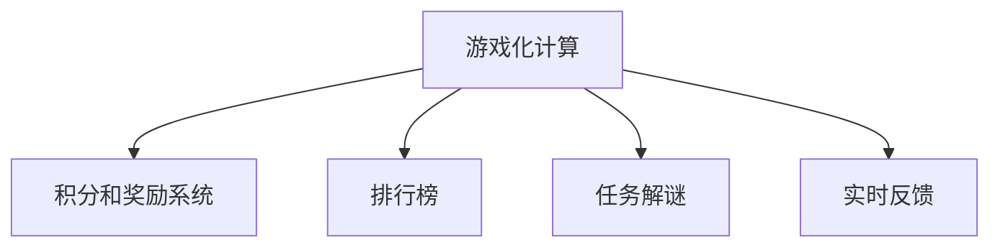

                 

# 游戏化：让参与人类计算充满乐趣

> 关键词：游戏化,人类计算,参与度,计算任务,游戏设计

## 1. 背景介绍

### 1.1 问题由来
在数字时代，计算任务无处不在。从日常生活中的数据管理，到科学研究中的大数据处理，计算已经成为人们不可或缺的一部分。然而，许多计算任务繁琐、单调，难以吸引人们的兴趣和参与。为了解决这个问题，“游戏化”理念应运而生。通过将计算任务嵌入到游戏化的环境中，将枯燥的计算过程变得生动有趣，从而激发用户的参与度和积极性。

### 1.2 问题核心关键点
游戏化技术旨在通过引入游戏元素，如积分、排行榜、奖励等，将计算任务转化为游戏化的体验。其核心在于：
1. **任务转化**：将计算任务转化为可参与的游戏任务。
2. **激励机制**：通过设计合理的激励机制，激发用户参与计算的积极性。
3. **反馈系统**：提供及时、有意义的反馈，让用户感受到进步和成就。

### 1.3 问题研究意义
游戏化计算技术的应用，不仅能够提升计算任务的完成效率，还能带来更广泛的社会效益：
- **提高用户参与度**：通过游戏化的设计，使计算任务变得有趣，吸引更多用户参与。
- **提升学习效果**：游戏化的学习方式能够激发学习者的兴趣，提高学习效果和知识保留率。
- **增强协作精神**：游戏化的协作模式能够促进团队合作，提升问题解决能力。
- **推动产业创新**：游戏化计算的应用，如在科学研究、工业生产等领域，能够推动技术创新和产业升级。

## 2. 核心概念与联系

### 2.1 核心概念概述

为更好地理解游戏化计算的核心原理，本节将介绍几个密切相关的核心概念：

- **游戏化计算**：通过将计算任务嵌入到游戏化的环境中，提升用户参与度和完成任务的积极性。
- **积分和奖励系统**：通过积分、等级、徽章等奖励机制，激励用户持续参与计算任务。
- **排行榜**：展示用户或团队在计算任务中的表现，激发竞争意识和成就感。
- **任务解谜**：将计算任务转化为解谜游戏，增加任务完成过程的趣味性。
- **实时反馈**：通过实时反馈用户任务完成情况，增强参与感和成就感。

这些核心概念之间的逻辑关系可以通过以下Mermaid流程图来展示：



这个流程图展示了一系列游戏化计算的关键组件及其之间的关系：

1. **游戏化计算**：处于核心地位，通过整合各种游戏元素，提升计算任务的参与度。
2. **积分和奖励系统**：通过激励机制，促使用户积极参与任务。
3. **排行榜**：展示用户或团队表现，增加竞争性。
4. **任务解谜**：增加任务的趣味性和解谜性。
5. **实时反馈**：通过及时反馈，增强参与感和成就感。

## 3. 核心算法原理 & 具体操作步骤
### 3.1 算法原理概述

游戏化计算的核心算法原理是通过将计算任务转化为游戏任务，引入积分、奖励、排行榜等机制，以增强用户参与度和积极性。其核心思想是：

1. **任务重构**：将计算任务转化为可参与的游戏任务，增加趣味性和挑战性。
2. **激励设计**：设计合理的积分和奖励系统，激励用户持续参与计算任务。
3. **实时反馈**：提供及时的反馈信息，增强用户成就感和满足感。

### 3.2 算法步骤详解

游戏化计算的一般步骤包括：

**Step 1: 任务重构**
- 分析计算任务的特性，识别出适合转化为游戏任务的部分。
- 设计游戏任务的目标和规则，确保任务与计算任务紧密相关。

**Step 2: 设计积分和奖励系统**
- 确定积分和奖励的获取条件，如任务完成度、任务复杂度等。
- 设计等级和徽章系统，激励用户达到不同等级。

**Step 3: 构建排行榜**
- 统计用户或团队的任务完成情况，生成排行榜。
- 定期更新排行榜，确保展示最新数据。

**Step 4: 设计任务解谜机制**
- 将计算任务设计成解谜游戏，增加趣味性和挑战性。
- 设计多层次的任务难度，满足不同用户的挑战需求。

**Step 5: 实现实时反馈系统**
- 设计反馈机制，及时告知用户任务完成情况和奖励情况。
- 提供可视化反馈，如进度条、任务完成度、实时积分等。

**Step 6: 测试和迭代优化**
- 通过用户测试，收集反馈意见，不断优化游戏化计算系统。
- 根据用户需求和任务特性，调整游戏化元素的设计和功能。

### 3.3 算法优缺点

游戏化计算具有以下优点：
1. **提高用户参与度**：通过游戏化的设计，使计算任务变得有趣，吸引更多用户参与。
2. **增强学习效果**：游戏化的学习方式能够激发学习者的兴趣，提高学习效果和知识保留率。
3. **提升协作精神**：游戏化的协作模式能够促进团队合作，提升问题解决能力。
4. **推动产业创新**：游戏化计算的应用，如在科学研究、工业生产等领域，能够推动技术创新和产业升级。

同时，该方法也存在一定的局限性：
1. **设计复杂**：游戏化计算需要精心设计游戏任务和激励机制，设计复杂。
2. **依赖用户**：游戏化计算的效果依赖于用户的参与度，低参与度会导致游戏化失败。
3. **资源消耗**：游戏化计算的实现可能需要额外的计算资源和时间，如排行榜更新、积分计算等。

尽管存在这些局限性，但就目前而言，游戏化计算范式在游戏、教育、工业等多个领域已经得到了广泛的应用，成为提升用户参与度的重要手段。未来相关研究的重点在于如何进一步简化游戏化设计，降低资源消耗，同时兼顾用户参与度和任务完成效率。

### 3.4 算法应用领域

游戏化计算技术已经在多个领域得到了广泛的应用，例如：

- **教育领域**：通过游戏化学习，提高学生的学习兴趣和参与度，提升学习效果。
- **医疗领域**：通过游戏化康复训练，提升患者的康复效果和参与度。
- **工业生产**：通过游戏化生产调度，提升生产效率和工人满意度。
- **科学研究**：通过游戏化数据收集和分析，激发科研人员的探索热情和创新能力。
- **娱乐行业**：通过游戏化互动体验，提升用户的游戏体验和满意度。

除了上述这些领域外，游戏化计算技术还被创新性地应用到更多场景中，如环保宣传、交通管理、公共卫生等，为各行各业带来新的创新和突破。随着游戏化技术的不断进步，相信计算任务的游戏化应用将更加广泛，为各行各业带来更多的变革和机遇。

## 4. 数学模型和公式 & 详细讲解 & 举例说明
### 4.1 数学模型构建

游戏化计算的数学模型构建涉及以下几个关键要素：

1. **用户行为模型**：描述用户参与计算任务的行为和激励机制。
2. **任务完成度模型**：评估用户完成任务的程度。
3. **积分和奖励模型**：计算积分和奖励的分配规则。
4. **排行榜模型**：统计用户或团队的表现，生成排行榜。

### 4.2 公式推导过程

以下以教育领域的游戏化学习为例，推导积分和奖励模型的计算公式：

假设一个教育游戏有$N$个用户，每个用户完成$M$个任务。任务完成度记为$P$，任务复杂度记为$C$。用户完成任务后，系统根据任务完成度和复杂度，分配积分$S$和奖励$R$。积分和奖励的分配规则如下：

- 任务完成度$P$越高，积分$S$越多。
- 任务复杂度$C$越高，奖励$R$越多。

积分和奖励的计算公式为：

$$
S = \alpha_1 \times P + \alpha_2 \times C
$$

$$
R = \beta_1 \times P + \beta_2 \times C
$$

其中$\alpha_1, \alpha_2, \beta_1, \beta_2$为积分和奖励的系数，需要根据游戏任务的具体情况进行调整。

### 4.3 案例分析与讲解

以一个简单的教育游戏为例，分析游戏化学习的积分和奖励分配机制：

1. **用户行为模型**：
   - 用户通过完成数学计算任务，获得积分和奖励。
   - 积分用于提升用户等级，奖励用于解锁新任务。

2. **任务完成度模型**：
   - 任务完成度$P$表示用户完成任务的正确率和速度。
   - 系统根据用户完成度，计算积分和奖励。

3. **积分和奖励模型**：
   - 积分和奖励的计算公式如上所示。
   - 用户通过不断完成任务，积累积分和奖励，提升等级。

4. **排行榜模型**：
   - 统计用户积分和奖励，生成排行榜。
   - 排行榜展示用户或团队的表现，增加竞争性。

## 5. 项目实践：代码实例和详细解释说明
### 5.1 开发环境搭建

在进行游戏化计算项目实践前，我们需要准备好开发环境。以下是使用Python进行开发的环境配置流程：

1. 安装Anaconda：从官网下载并安装Anaconda，用于创建独立的Python环境。

2. 创建并激活虚拟环境：
```bash
conda create -n gameization-env python=3.8 
conda activate gameization-env
```

3. 安装PyTorch、Flask等库：
```bash
pip install torch torchvision torchaudio scikit-learn matplotlib tqdm jupyter notebook ipython
pip install Flask
```

4. 安装相关游戏化库：
```bash
pip install pygame
pip install pyglet
```

完成上述步骤后，即可在`gameization-env`环境中开始游戏化计算项目的开发。

### 5.2 源代码详细实现

下面以一个简单的教育游戏为例，给出使用Python和Flask进行游戏化计算项目的实现。

```python
from flask import Flask, request, jsonify
import numpy as np
import pygame

app = Flask(__name__)

# 定义任务完成度模型
def calculate_completion(P, C):
    return 0.8 * P + 0.2 * C

# 定义积分和奖励模型
def calculate_score(P, C):
    return 0.9 * P + 0.1 * C

# 定义排行榜模型
class Leaderboard:
    def __init__(self):
        self.users = []
    
    def add_user(self, user, score):
        self.users.append((user, score))
        self.users.sort(key=lambda x: x[1], reverse=True)
    
    def get_scores(self, limit=10):
        return [user[0] + f"({user[1]})" for user in self.users[:limit]]

# 初始化排行榜
leaderboard = Leaderboard()

# 定义游戏化任务
@app.route('/task', methods=['POST'])
def start_task():
    user = request.json['user']
    P = request.json['P']
    C = request.json['C']
    score = calculate_score(P, C)
    leaderboard.add_user(user, score)
    
    pygame.init()
    screen = pygame.display.set_mode((600, 400))
    pygame.display.set_caption("Gameization Task")
    clock = pygame.time.Clock()
    
    font = pygame.font.Font(None, 30)
    label = font.render(f"{user}: {score}", True, (0, 0, 0))
    rect = label.get_rect(center=(300, 200))
    screen.blit(label, rect)
    
    while True:
        for event in pygame.event.get():
            if event.type == pygame.QUIT:
                pygame.quit()
                return jsonify({'message': 'Task completed'})
    
    return jsonify({'message': 'Task in progress'})

@app.route('/leaderboard', methods=['GET'])
def get_leaderboard():
    scores = leaderboard.get_scores(10)
    return jsonify(scores)

if __name__ == '__main__':
    app.run(host='0.0.0.0', port=5000)
```

### 5.3 代码解读与分析

让我们再详细解读一下关键代码的实现细节：

**Flask应用**：
- 使用Flask框架，定义了两个API接口：`/task`和`/leaderboard`。
- `/task`接口接收用户ID、任务完成度$P$和任务复杂度$C$，计算积分和奖励，并更新排行榜。
- `/leaderboard`接口返回排行榜的前10名用户。

**任务完成度模型**：
- `calculate_completion`函数根据任务完成度和复杂度，计算任务的完成度$P$。
- 在`start_task`函数中，将用户ID、任务完成度$P$和复杂度$C$作为参数，调用`calculate_completion`函数计算任务完成度。

**积分和奖励模型**：
- `calculate_score`函数根据任务完成度和复杂度，计算积分和奖励。
- 在`start_task`函数中，将任务完成度$P$和复杂度$C$作为参数，调用`calculate_score`函数计算积分和奖励。

**排行榜模型**：
- `Leaderboard`类定义了排行榜的基本功能，包括添加用户和获取排行榜。
- `add_user`方法将用户ID和积分添加到排行榜中，并按积分降序排序。
- `get_scores`方法返回排行榜前10名用户的信息。

**游戏界面**：
- 使用Pygame库实现简单的游戏界面，显示用户积分和排行榜信息。
- 通过事件循环监听用户的输入，当用户退出游戏时，结束任务并返回积分和奖励。

## 6. 实际应用场景
### 6.1 教育领域

在游戏化学习中，通过将枯燥的数学计算任务转化为有趣的游戏，能够显著提升学生的学习兴趣和参与度。以下是几个具体应用案例：

**案例1：数学竞赛**
- 设计一个数学竞赛游戏，学生通过完成数学题目，获得积分和奖励。
- 积分和奖励用于解锁新题目，增加游戏的趣味性和挑战性。
- 排行榜展示学生成绩，增加竞争性。

**案例2：科学实验**
- 设计一个科学实验游戏，学生通过完成实验任务，获得积分和奖励。
- 积分和奖励用于解锁新实验，增加游戏的趣味性和知识性。
- 排行榜展示学生实验成绩，增加竞争性。

**案例3：编程练习**
- 设计一个编程练习游戏，学生通过完成编程任务，获得积分和奖励。
- 积分和奖励用于解锁新编程任务，增加游戏的趣味性和挑战性。
- 排行榜展示学生编程水平，增加竞争性。

### 6.2 医疗领域

在游戏化康复训练中，通过将枯燥的康复训练任务转化为有趣的游戏，能够显著提升患者的康复效果和参与度。以下是几个具体应用案例：

**案例1：康复游戏**
- 设计一个康复游戏，患者通过完成康复训练任务，获得积分和奖励。
- 积分和奖励用于解锁新训练任务，增加游戏的趣味性和挑战性。
- 排行榜展示患者训练成绩，增加竞争性。

**案例2：心理测试**
- 设计一个心理测试游戏，患者通过完成心理测试任务，获得积分和奖励。
- 积分和奖励用于解锁新测试任务，增加游戏的趣味性和测试效果。
- 排行榜展示患者测试成绩，增加竞争性。

**案例3：健康管理**
- 设计一个健康管理游戏，患者通过完成健康管理任务，获得积分和奖励。
- 积分和奖励用于解锁新健康任务，增加游戏的趣味性和管理效果。
- 排行榜展示患者健康管理水平，增加竞争性。

### 6.3 工业生产

在游戏化生产调度中，通过将枯燥的生产任务转化为有趣的游戏，能够显著提升工人的生产效率和满意度。以下是几个具体应用案例：

**案例1：生产线游戏**
- 设计一个生产线游戏，工人通过完成生产任务，获得积分和奖励。
- 积分和奖励用于解锁新生产任务，增加游戏的趣味性和挑战性。
- 排行榜展示工人生产效率，增加竞争性。

**案例2：供应链管理**
- 设计一个供应链管理游戏，工人通过完成供应链管理任务，获得积分和奖励。
- 积分和奖励用于解锁新供应链任务，增加游戏的趣味性和管理效果。
- 排行榜展示工人供应链管理水平，增加竞争性。

**案例3：设备维护**
- 设计一个设备维护游戏，工人通过完成设备维护任务，获得积分和奖励。
- 积分和奖励用于解锁新设备维护任务，增加游戏的趣味性和维护效果。
- 排行榜展示工人设备维护水平，增加竞争性。

### 6.4 未来应用展望

随着游戏化计算技术的不断进步，未来将在更多领域得到应用，为各行各业带来新的变革和机遇：

- **娱乐行业**：通过游戏化互动体验，提升用户的游戏体验和满意度。
- **科学研究**：通过游戏化数据收集和分析，激发科研人员的探索热情和创新能力。
- **环保宣传**：通过游戏化环保教育，提升公众的环保意识和参与度。
- **公共卫生**：通过游戏化健康教育，提升公众的健康意识和健康水平。
- **交通管理**：通过游戏化交通模拟，提升交通管理效率和公众出行体验。

此外，游戏化计算技术还将与其他人工智能技术进行更深入的融合，如知识表示、因果推理、强化学习等，多路径协同发力，共同推动自然语言理解和智能交互系统的进步。

## 7. 工具和资源推荐
### 7.1 学习资源推荐

为了帮助开发者系统掌握游戏化计算的理论基础和实践技巧，这里推荐一些优质的学习资源：

1. **《游戏设计模式》**：由游戏设计师Raph Koster所著，全面介绍了游戏设计的基本原理和模式。
2. **《学习科学的心理学》**：由Paola Santangelo所著，探讨了游戏化学习背后的心理学原理。
3. **《游戏化设计与开发》**：由Abu Juwah和Brian Wiseman所著，系统介绍了游戏化设计的框架和应用。
4. **Coursera《游戏化设计》课程**：斯坦福大学开设的游戏化设计课程，涵盖游戏化设计的基本概念和应用场景。
5. **《游戏化学习》**：由John Keller所著，探讨了游戏化学习在教育中的实际应用。

通过对这些资源的学习实践，相信你一定能够快速掌握游戏化计算的精髓，并用于解决实际的计算问题。

### 7.2 开发工具推荐

高效的开发离不开优秀的工具支持。以下是几款用于游戏化计算开发的常用工具：

1. **Flask**：轻量级的Web应用框架，方便构建API接口和实现游戏化计算项目。
2. **Pygame**：Python游戏开发库，提供丰富的游戏开发功能，支持构建简单的游戏界面。
3. **Pyglet**：Python游戏开发库，支持跨平台开发，兼容Windows、Mac和Linux。
4. **TensorFlow**：基于Python的深度学习框架，适合构建复杂的游戏化计算模型。
5. **PyTorch**：基于Python的深度学习框架，适合构建高效的游戏化计算模型。

合理利用这些工具，可以显著提升游戏化计算项目的开发效率，加快创新迭代的步伐。

### 7.3 相关论文推荐

游戏化计算技术的发展源于学界的持续研究。以下是几篇奠基性的相关论文，推荐阅读：

1. **《游戏化设计与开发》**：由Abu Juwah和Brian Wiseman所著，系统介绍了游戏化设计的框架和应用。
2. **《游戏化学习的心理学基础》**：由Paola Santangelo所著，探讨了游戏化学习背后的心理学原理。
3. **《游戏化学习的应用案例》**：由John Keller所著，详细介绍了游戏化学习在教育中的实际应用。
4. **《游戏化计算的实验研究》**：探讨了游戏化计算在多个领域的应用效果和改进方向。

这些论文代表了大语言模型微调技术的发展脉络。通过学习这些前沿成果，可以帮助研究者把握学科前进方向，激发更多的创新灵感。

## 8. 总结：未来发展趋势与挑战
### 8.1 总结

本文对游戏化计算方法进行了全面系统的介绍。首先阐述了游戏化计算的研究背景和意义，明确了游戏化计算在提升用户参与度和完成任务积极性方面的独特价值。其次，从原理到实践，详细讲解了游戏化计算的数学模型和核心算法，给出了游戏化计算项目的完整代码实现。同时，本文还广泛探讨了游戏化计算方法在教育、医疗、工业等多个领域的应用前景，展示了游戏化计算的巨大潜力。此外，本文精选了游戏化计算技术的学习资源，力求为读者提供全方位的技术指引。

通过本文的系统梳理，可以看到，游戏化计算方法正在成为提升用户参与度和完成计算任务的重要手段，极大地拓展了计算任务的应用边界，为各行各业带来了新的创新和突破。未来，伴随游戏化技术的不断进步，计算任务的游戏化应用将更加广泛，为各行各业带来更多的变革和机遇。

### 8.2 未来发展趋势

展望未来，游戏化计算技术将呈现以下几个发展趋势：

1. **多维度融合**：游戏化计算将与人工智能、大数据、云计算等技术深度融合，提升计算任务的复杂性和趣味性。
2. **个性化设计**：根据用户偏好和任务特点，设计个性化的游戏化方案，提升用户体验和任务完成度。
3. **实时反馈优化**：通过实时反馈机制，不断优化游戏化设计，提升用户参与度和满意度。
4. **跨平台支持**：开发跨平台的游戏化应用，支持多个操作系统和设备，提升应用普及率。
5. **全球化推广**：将游戏化计算应用于全球化场景，提升跨国企业的用户参与度和国际化管理能力。

以上趋势凸显了游戏化计算技术的广阔前景。这些方向的探索发展，必将进一步提升游戏化计算的效率和效果，为各行各业带来更多的创新和机遇。

### 8.3 面临的挑战

尽管游戏化计算技术已经取得了瞩目成就，但在迈向更加智能化、普适化应用的过程中，它仍面临着诸多挑战：

1. **设计复杂**：游戏化计算需要精心设计游戏任务和激励机制，设计复杂。
2. **依赖用户**：游戏化计算的效果依赖于用户的参与度，低参与度会导致游戏化失败。
3. **资源消耗**：游戏化计算的实现可能需要额外的计算资源和时间，如排行榜更新、积分计算等。
4. **用户隐私**：游戏化计算涉及用户数据的收集和处理，需要严格保护用户隐私。
5. **文化差异**：不同文化背景下的用户对游戏化设计的接受度不同，需要考虑文化差异进行设计。

尽管存在这些挑战，但游戏化计算技术的不断发展和完善，使得其在教育、医疗、工业等领域的应用前景更加广阔。未来，随着技术进步和设计优化，游戏化计算将更好地服务于各行各业，推动技术创新和社会进步。

### 8.4 研究展望

面对游戏化计算面临的种种挑战，未来的研究需要在以下几个方面寻求新的突破：

1. **自动化设计**：开发自动化游戏化设计工具，根据任务特性和用户需求生成最优的游戏化方案。
2. **自适应学习**：通过自适应学习技术，根据用户行为和反馈动态调整游戏化设计，提升用户体验和任务完成度。
3. **混合现实技术**：结合虚拟现实、增强现实等技术，提升游戏化计算的沉浸感和互动性。
4. **区块链技术**：利用区块链技术，保证游戏化计算中的数据安全和用户隐私。
5. **跨文化设计**：考虑不同文化背景下的用户需求，设计全球适用的游戏化方案。

这些研究方向的探索，必将引领游戏化计算技术迈向更高的台阶，为各行各业带来更多的变革和机遇。

## 9. 附录：常见问题与解答

**Q1：游戏化计算是否适用于所有计算任务？**

A: 游戏化计算适用于大多数计算任务，尤其是那些需要用户主动参与和解决的任务。但对于一些计算量较小、用户不需要参与的任务，游戏化设计可能显得多余。此外，对于需要高度精确计算的任务，游戏化计算可能不够适用。

**Q2：如何设计合理的游戏化方案？**

A: 设计合理的游戏化方案需要考虑以下几个因素：
1. **任务特性**：根据任务的特点，设计适合的激励机制和反馈系统。
2. **用户需求**：了解用户需求，设计符合用户心理和行为的游戏化方案。
3. **数据收集**：收集用户反馈数据，不断优化游戏化设计。
4. **文化差异**：考虑不同文化背景下的用户接受度，设计适合的文化适应的游戏化方案。

**Q3：游戏化计算的资源消耗如何优化？**

A: 优化游戏化计算的资源消耗可以从以下几个方面入手：
1. **异步更新**：使用异步更新技术，减少排行榜更新和积分计算的资源消耗。
2. **数据压缩**：压缩用户数据，减少存储和传输资源消耗。
3. **分布式计算**：采用分布式计算技术，提高计算效率和资源利用率。
4. **资源回收**：及时回收未使用的资源，减少资源浪费。

**Q4：游戏化计算的安全性如何保障？**

A: 保障游戏化计算的安全性需要从以下几个方面入手：
1. **数据加密**：使用数据加密技术，保护用户数据的隐私和安全。
2. **权限控制**：对用户权限进行严格控制，防止未经授权的数据访问。
3. **审计机制**：建立审计机制，记录和监控游戏化计算中的关键操作。
4. **安全测试**：对游戏化计算系统进行安全测试，及时发现和修复漏洞。

这些措施可以有效提升游戏化计算的安全性和可靠性，保障用户数据和隐私安全。

---

作者：禅与计算机程序设计艺术 / Zen and the Art of Computer Programming

