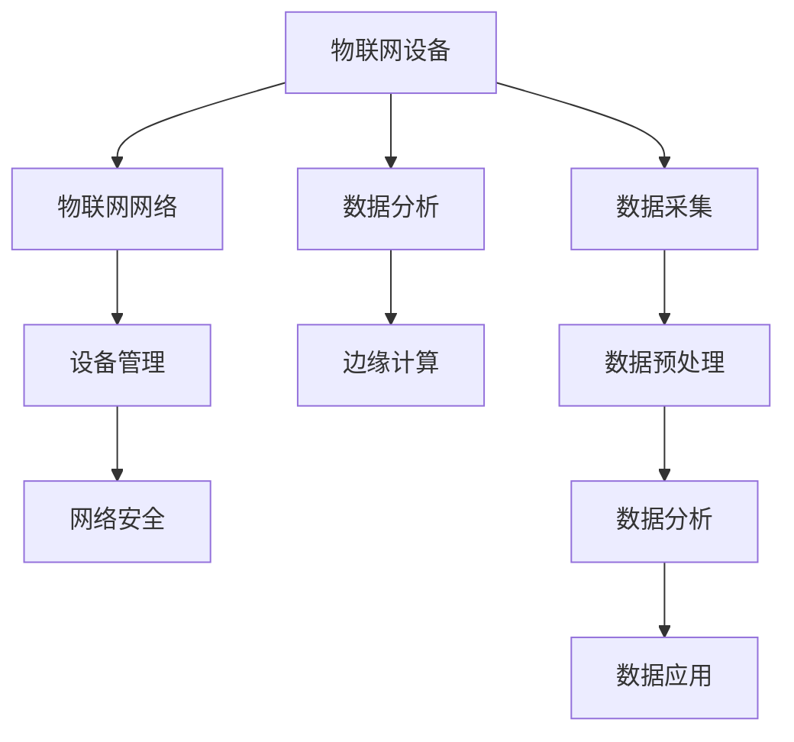

                 

# 物联网生态系统：设备、网络和数据分析的整合

> 关键词：物联网(IoT),设备管理,网络安全,数据分析,边缘计算

## 1. 背景介绍

### 1.1 问题由来

随着物联网(IoT)技术的飞速发展，越来越多的设备被连接到互联网，产生了海量数据。如何高效管理这些设备，保障数据传输的安全性，并从数据中提取有价值的信息，成为了当下物联网领域的一大难题。

物联网设备种类繁多，涵盖智能家居、工业控制、可穿戴设备、智能交通等多个领域，且每个设备的功能和数据格式各异。设备与设备之间的通信也存在多样性，有线通信、无线网络、蓝牙、ZigBee等不同的通信方式并存。同时，数据体量巨大且实时性强，数据传输和处理需要高效的机制来支撑。

### 1.2 问题核心关键点

物联网生态系统的核心挑战在于设备管理、网络安全、数据分析三个方面：

- **设备管理**：如何高效地部署、监控和管理海量物联网设备，保障设备的正常运行和数据的及时传输。
- **网络安全**：如何保障物联网设备的数据传输安全，防止数据被窃取、篡改和攻击。
- **数据分析**：如何从设备产生的海量数据中提取有用的信息，为决策支持、业务优化提供依据。

通过整合设备、网络和数据分析，可以实现对物联网生态系统的全面管理，保障数据的安全性，提升数据的价值，为业务应用提供有力支撑。

## 2. 核心概念与联系

### 2.1 核心概念概述

为更好地理解物联网生态系统的整合，本节将介绍几个关键概念及其联系：

- **物联网设备(IoT Devices)**：包括各种能够感知、测量、计算、通信的物理实体，如传感器、智能设备、工业控制设备等。
- **物联网网络(IoT Network)**：指连接设备的网络基础设施，包括广域网、局域网、无线网、蓝牙、ZigBee等通信协议。
- **数据分析(Analytics)**：指从设备产生的数据中提取有用的信息，包括数据收集、存储、处理、分析和应用。
- **边缘计算(Edge Computing)**：指在设备端进行数据处理和计算，而非全部集中在云端，提升数据处理效率，降低网络延迟。
- **设备管理(Device Management)**：指对物联网设备的部署、监控、配置和维护的管理手段。
- **网络安全(Network Security)**：指保障物联网设备间通信安全的技术措施，包括数据加密、身份认证、访问控制等。

这些概念之间的逻辑关系可以通过以下Mermaid流程图来展示：



这个流程图展示了物联网生态系统的主要组成部分及其关系：

1. 设备通过网络进行数据采集和传输。
2. 设备管理负责设备的部署和维护。
3. 数据分析过程包括数据收集、预处理、分析和应用。
4. 边缘计算提升了数据处理效率。
5. 网络安全保障了设备间的通信安全。

## 3. 核心算法原理 & 具体操作步骤
### 3.1 算法原理概述

物联网生态系统的整合，涉及到设备管理、数据分析、网络安全等多方面的算法原理和操作步骤。核心思想是通过集成设备、网络和数据分析技术，实现对物联网设备的全面管理，保障数据的安全性，并从数据中提取有用信息，支撑业务决策和优化。

### 3.2 算法步骤详解

#### 3.2.1 设备管理

**步骤1：设备部署与配置**

- 通过物联网平台，将设备部署到指定位置，并进行配置。
- 设定设备的参数，如IP地址、端口、认证信息等。

**步骤2：设备监控与诊断**

- 通过平台监控设备状态，检测设备是否运行正常。
- 采集设备产生的运行日志和诊断信息。

**步骤3：设备维护与升级**

- 定期对设备进行维护，如固件更新、参数调整等。
- 根据诊断信息，及时修复设备故障。

#### 3.2.2 数据分析

**步骤1：数据采集**

- 通过传感器、智能设备等采集设备运行状态数据。
- 将数据转化为标准格式，便于后续处理。

**步骤2：数据预处理**

- 对数据进行清洗、去重、填充等预处理操作。
- 进行特征提取，将数据转化为模型可用的输入格式。

**步骤3：数据分析**

- 使用统计分析、机器学习、深度学习等方法，从数据中提取有用信息。
- 使用数据可视化工具，直观展示分析结果。

**步骤4：数据应用**

- 根据分析结果，生成决策支持报告，供业务决策使用。
- 对业务流程进行优化，提升业务效率。

#### 3.2.3 网络安全

**步骤1：数据加密**

- 使用AES、RSA等加密算法，对数据进行加密。
- 传输数据时使用HTTPS协议，确保数据传输的安全性。

**步骤2：身份认证**

- 使用数字证书、双因素认证等方式，确保设备间的身份验证。
- 对用户进行身份认证，防止未经授权的访问。

**步骤3：访问控制**

- 设定访问权限，限制设备间的访问。
- 对敏感数据进行权限控制，防止数据泄露。

### 3.3 算法优缺点

物联网生态系统的整合具有以下优点：

1. **高效性**：通过设备管理、边缘计算等技术，提升了数据处理效率，降低了网络延迟。
2. **安全性**：通过数据加密、身份认证等措施，保障了数据传输的安全性。
3. **实时性**：通过分布式数据处理和网络优化，实现了数据的实时分析和应用。

同时，也存在一些缺点：

1. **复杂性高**：物联网设备种类繁多，网络协议多样，管理复杂。
2. **数据量大**：设备产生的数据量巨大，需要高效的存储和处理手段。
3. **成本高**：物联网设备的部署、维护、安全防护等成本较高。

### 3.4 算法应用领域

物联网生态系统的整合，已在多个领域得到广泛应用，如智能家居、工业自动化、智慧城市、智能交通等。以下是几个典型应用场景：

#### 3.4.1 智能家居

通过物联网平台，实现对智能家电设备的集中管理和控制。例如，用户可以通过手机App远程控制家中的灯光、空调、摄像头等设备，实现家庭自动化。同时，设备产生的数据被收集和分析，用于智能家居的优化和决策支持。

#### 3.4.2 工业自动化

在工业生产中，通过物联网设备采集生产设备的运行状态数据，实时监控生产线的健康状况，预测设备故障。通过数据分析，优化生产流程，提升生产效率和产品质量。

#### 3.4.3 智慧城市

智慧城市通过物联网设备采集城市运行数据，如交通流量、环境监测数据、公共设施运行状态等。通过数据分析，提升城市管理和决策水平，优化城市资源配置，提升城市居民的生活质量。

## 4. 数学模型和公式 & 详细讲解 & 举例说明

### 4.1 数学模型构建

假设物联网设备 $D_i$ 产生的数据为 $X_i = (x_{i1}, x_{i2}, \ldots, x_{in})$，其中 $x_{ij}$ 为第 $j$ 个传感器采集的信号值。通过物联网平台，数据被采集并发送到云端进行分析。

**设备管理模型**：
- 设备状态 $S_i = (s_{i1}, s_{i2}, \ldots, s_{im})$，其中 $s_{ik}$ 为设备的第 $k$ 种状态。
- 设备状态变化的概率模型 $P(S_i|X_i)$，表示在输入数据 $X_i$ 的情况下，设备状态 $S_i$ 的分布。

**数据分析模型**：
- 设备数据 $X_i$ 的统计特征 $F_i = (f_{i1}, f_{i2}, \ldots, f_{il})$，其中 $f_{ik}$ 为第 $k$ 个统计特征。
- 设备数据 $X_i$ 与业务指标 $Y_i$ 的关系模型 $P(Y_i|X_i)$，表示在输入数据 $X_i$ 的情况下，业务指标 $Y_i$ 的分布。

**网络安全模型**：
- 数据加密强度 $E_i$，表示数据传输的加密等级。
- 身份认证强度 $A_i$，表示设备间的身份认证机制。
- 访问控制强度 $C_i$，表示对数据的访问权限控制。

### 4.2 公式推导过程

以设备状态变化的概率模型为例，其推导过程如下：

**假设**：设备状态变化服从马尔可夫链，即当前状态仅依赖于前一状态。

**状态转移矩阵**：$P(S_i|X_i) = P(S_i|S_{i-1}, X_{i-1})$

**数据驱动状态转移**：$P(S_i|X_i) = \prod_{j=1}^{n}P(s_{ij}|x_{ij})$

其中，$P(s_{ij}|x_{ij})$ 表示在输入信号 $x_{ij}$ 下，设备状态 $s_{ij}$ 发生的概率。

在实际应用中，可以使用贝叶斯网络、隐马尔可夫模型等方法，对设备状态变化的概率进行建模和预测。

### 4.3 案例分析与讲解

**案例1：智能家居设备管理**

在智能家居中，设备状态监控和维护尤为重要。例如，某智能门锁设备采集到的状态数据如下：

| 传感器编号 | 信号值 |
| ---------- | ------ |
| 1          | 90     |
| 2          | 50     |
| 3          | 85     |

通过设备状态模型，可以计算出设备状态的概率分布。例如，设备正常开启的概率为 0.8，设备故障关闭的概率为 0.2。

**案例2：工业自动化设备监控**

在工业生产中，设备状态监控和故障预测是关键。例如，某生产设备采集到的状态数据如下：

| 传感器编号 | 信号值 |
| ---------- | ------ |
| 1          | 95     |
| 2          | 80     |
| 3          | 92     |

通过设备状态模型，可以预测设备状态变化的概率。例如，设备状态由正常转为故障的概率为 0.1，设备状态由故障转为正常的概率为 0.8。

## 5. 项目实践：代码实例和详细解释说明

### 5.1 开发环境搭建

在进行物联网生态系统整合的实践前，我们需要准备好开发环境。以下是使用Python进行OpenIoT Server开发的简单流程：

1. 安装OpenIoT Server：从官网下载并安装OpenIoT Server，用于构建物联网设备管理平台。
2. 安装所需的Python库：pip install openiot-server openiot-client
3. 创建并配置OpenIoT Server：设置数据库、认证方式、设备类型等参数。
4. 配置设备连接：将设备连接到OpenIoT Server，设定设备的参数和访问权限。

### 5.2 源代码详细实现

以下是一个简单的Python代码示例，用于实现智能家居设备的部署和监控。

```python
from openiot_server import OpenIoTServer
from openiot_client import OpenIoTClient

# 创建OpenIoT Server实例
server = OpenIoTServer('http://127.0.0.1:1880', 'username', 'password')

# 创建OpenIoT Client实例
client = OpenIoTClient('http://127.0.0.1:1880', 'username', 'password')

# 创建设备实例
device = server.create_device('Home', 'SmartDoor')

# 设置设备参数
device.set('firmware', '1.0')
device.set('port', '8080')

# 设备连接成功回调
client.on_connect_callback = lambda client, device, status: print(f"Device {device.get_id()} connected with status {status}")

# 设备数据接收回调
client.on_message_callback = lambda client, device, data: print(f"Received data from {device.get_id()}: {data}")

# 设备状态监控回调
client.on_state_callback = lambda client, device, state: print(f"Device {device.get_id()} status changed to {state}")

# 连接服务器
client.connect()

# 发布数据到设备
client.publish('Home/SmartDoor', {'temperature': 25, 'humidity': 60})

# 连接断开时自动断开连接
client.on_disconnect_callback = lambda client, device, status: client.disconnect()
```

这段代码演示了如何通过OpenIoT Server实现智能家居设备的连接和状态监控。

### 5.3 代码解读与分析

**OpenIoT Server**：
- 用于构建物联网设备管理平台，提供设备创建、参数设置、状态监控等功能。
- 支持多种设备类型和协议，如MQTT、CoAP等。

**OpenIoT Client**：
- 用于连接OpenIoT Server，进行数据发布和接收。
- 支持设备状态监控和故障告警。

**设备连接与数据发布**：
- 创建OpenIoT Server的实例，设置服务器的地址、用户名和密码。
- 创建OpenIoT Client的实例，设置连接参数。
- 创建设备实例，并设置设备参数。
- 通过OpenIoT Client连接OpenIoT Server，实现设备的连接。
- 发布数据到设备，设备接收数据并回调处理。

**设备状态监控**：
- 通过OpenIoT Server实现设备的连接和状态监控。
- 连接断开时，OpenIoT Client自动断开连接。

## 6. 实际应用场景

### 6.1 智能家居

通过物联网设备管理，可以实现对智能家居设备的集中控制和管理，提升家庭智能化水平。例如，某智能门锁设备采集到的状态数据如下：

| 传感器编号 | 信号值 |
| ---------- | ------ |
| 1          | 90     |
| 2          | 50     |
| 3          | 85     |

通过OpenIoT Server和OpenIoT Client，可以实现对智能门锁设备的集中管理和监控。例如，用户可以通过手机App远程控制家中的灯光、空调、摄像头等设备，实现家庭自动化。同时，设备产生的数据被收集和分析，用于智能家居的优化和决策支持。

### 6.2 工业自动化

在工业生产中，通过物联网设备采集生产设备的运行状态数据，实时监控生产线的健康状况，预测设备故障。例如，某生产设备采集到的状态数据如下：

| 传感器编号 | 信号值 |
| ---------- | ------ |
| 1          | 95     |
| 2          | 80     |
| 3          | 92     |

通过OpenIoT Server和OpenIoT Client，可以实现对生产设备的集中管理和监控。例如，生产设备通过传感器采集运行状态数据，并上传至OpenIoT Server。OpenIoT Server对数据进行分析，预测设备故障，并发送告警通知，提升生产线的健康状况。

### 6.3 智慧城市

智慧城市通过物联网设备采集城市运行数据，如交通流量、环境监测数据、公共设施运行状态等。例如，某智慧交通设备采集到的状态数据如下：

| 传感器编号 | 信号值 |
| ---------- | ------ |
| 1          | 20     |
| 2          | 50     |
| 3          | 35     |

通过OpenIoT Server和OpenIoT Client，可以实现对智慧城市设备的集中管理和监控。例如，智慧交通设备通过传感器采集交通流量数据，并上传至OpenIoT Server。OpenIoT Server对数据进行分析，优化交通流量，提升城市交通的运行效率。

## 7. 工具和资源推荐

### 7.1 学习资源推荐

为了帮助开发者系统掌握物联网生态系统的整合，这里推荐一些优质的学习资源：

1. OpenIoT Server官方文档：提供详细的API文档和示例代码，助力开发者上手实践。
2. IoT Stack 101：由IoT Stack项目组推出的入门教程，涵盖物联网设备的部署、监控、管理等内容。
3. 《IoT for Smartphones》：通过动手实验，介绍如何将物联网设备集成到智能手机上。
4. 《IoT Security Fundamentals》：介绍物联网安全的核心概念和实践技巧。
5. 《IoT Analytics》：讲解如何从物联网设备产生的数据中提取有用的信息。

通过这些资源的学习实践，相信你一定能够快速掌握物联网生态系统的整合精髓，并用于解决实际的物联网问题。

### 7.2 开发工具推荐

高效的工具支持是物联网生态系统整合的重要保障。以下是几款常用的开发工具：

1. OpenIoT Server：用于构建物联网设备管理平台，支持多种设备类型和协议。
2. OpenIoT Client：用于连接OpenIoT Server，实现设备的连接、数据发布和接收。
3. MQTT-Broker：用于实现MQTT通信协议，保障设备间的通信安全。
4. CoAP-Server：用于实现CoAP通信协议，提供轻量级的设备通信方式。
5. OpenIoT Dashboard：用于监控和管理物联网设备的运行状态。

合理利用这些工具，可以显著提升物联网生态系统整合的开发效率，加快创新迭代的步伐。

### 7.3 相关论文推荐

物联网生态系统的整合涉及设备管理、网络安全、数据分析等多方面的技术。以下是几篇奠基性的相关论文，推荐阅读：

1. "A Survey of IoT Architecture: Current Trends and Future Directions"（IoT架构综述）：总结了当前物联网架构的现状和未来发展方向。
2. "IoT Security: A Survey of Threats and Countermeasures"（IoT安全综述）：介绍了物联网安全面临的威胁和应对措施。
3. "Edge Computing in IoT"（物联网中的边缘计算）：探讨了边缘计算在物联网中的应用，提升数据处理效率。
4. "Analytics in IoT"（物联网中的数据分析）：讲解了如何从物联网设备产生的数据中提取有用的信息。
5. "IoT Device Management: Challenges and Solutions"（物联网设备管理综述）：总结了物联网设备管理面临的挑战和解决方案。

这些论文代表了物联网生态系统整合的研究进展，通过学习这些前沿成果，可以帮助研究者把握学科前进方向，激发更多的创新灵感。

## 8. 总结：未来发展趋势与挑战

### 8.1 总结

本文对物联网生态系统的整合进行了全面系统的介绍。首先阐述了物联网设备管理、网络安全、数据分析等核心概念及其联系。其次，从原理到实践，详细讲解了物联网生态系统整合的数学模型和操作步骤，给出了具体的代码示例。同时，本文还探讨了物联网生态系统在智能家居、工业自动化、智慧城市等领域的实际应用场景，展示了物联网技术的巨大潜力。

通过本文的系统梳理，可以看到，物联网生态系统整合通过设备管理、数据分析、网络安全等多方面的协同工作，实现了对物联网设备的全面管理，保障了数据的安全性，提升了数据的价值。未来，伴随物联网技术的不断发展，物联网生态系统的整合必将进一步拓展其应用边界，为各行各业带来变革性影响。

### 8.2 未来发展趋势

展望未来，物联网生态系统整合将呈现以下几个发展趋势：

1. **设备智能化**：随着物联网技术的不断发展，设备将具备更加智能化和自适应性，能够主动收集环境信息，并根据环境变化自动调整运行状态。
2. **数据实时化**：物联网设备采集的数据将更加实时，能够及时反馈设备运行状态和环境变化，支持实时决策。
3. **网络优化**：物联网设备间的通信将更加高效，能够通过边缘计算和网络优化，降低网络延迟和带宽占用。
4. **数据融合**：不同来源的数据将被更加有效地融合，实现跨领域、跨平台的数据共享和分析。
5. **云计算与边缘计算结合**：云计算和边缘计算将更加紧密结合，实现数据处理和存储的合理分布，提升系统性能。

以上趋势凸显了物联网生态系统整合的广阔前景。这些方向的探索发展，必将进一步提升物联网系统的性能和应用范围，为人类社会的数字化转型提供坚实的基础。

### 8.3 面临的挑战

尽管物联网生态系统整合已经取得了一定的成果，但在迈向更加智能化、普适化应用的过程中，它仍面临着诸多挑战：

1. **设备标准化**：不同厂商的物联网设备标准不一，增加了设备管理的复杂性。
2. **数据安全**：物联网设备产生的数据量大且敏感，如何保障数据的安全性是一个重要问题。
3. **网络带宽**：大量设备的数据传输可能占用大量的网络带宽，如何优化网络使用是一个关键挑战。
4. **能耗管理**：物联网设备往往在电池供电下工作，如何在低功耗条件下实现高效的数据采集和处理。
5. **隐私保护**：物联网设备的数据采集和使用可能涉及个人隐私，如何保护用户隐私是一个重要课题。

### 8.4 研究展望

面对物联网生态系统整合所面临的挑战，未来的研究需要在以下几个方面寻求新的突破：

1. **标准化工作**：制定统一的物联网设备标准，简化设备管理流程。
2. **数据安全技术**：开发更加安全的数据加密和访问控制技术，保障数据传输的安全性。
3. **网络优化**：采用更加高效的网络传输协议，优化网络带宽使用。
4. **低功耗技术**：开发低功耗物联网设备，延长设备使用寿命。
5. **隐私保护**：采用数据匿名化和隐私保护技术，保护用户隐私。

这些研究方向将引领物联网生态系统整合技术迈向更高的台阶，为物联网技术的规模化落地提供坚实的基础。面向未来，物联网生态系统整合技术还需要与其他人工智能技术进行更深入的融合，如知识表示、因果推理、强化学习等，多路径协同发力，共同推动物联网技术的进步。只有勇于创新、敢于突破，才能不断拓展物联网技术的边界，让物联网技术更好地服务于人类社会。

## 9. 附录：常见问题与解答

**Q1：物联网设备管理有哪些常见的工具和方法？**

A: 物联网设备管理常见的工具和方法包括：
1. 管理平台：如OpenIoT Server，用于集中管理设备的部署、配置和监控。
2. 通信协议：如MQTT、CoAP、HTTP，用于设备间的通信。
3. 设备标准：如ZigBee、Z-Wave，用于统一设备标准，简化设备管理。

**Q2：如何保障物联网设备的数据传输安全？**

A: 保障物联网设备的数据传输安全，主要采用以下措施：
1. 数据加密：使用AES、RSA等加密算法，对数据进行加密传输。
2. 身份认证：使用数字证书、双因素认证等方式，确保设备间的身份验证。
3. 访问控制：设定访问权限，限制设备间的访问。
4. 防火墙和入侵检测系统：在设备间通信中设置防火墙和入侵检测系统，防止恶意攻击。

**Q3：物联网设备的数据处理流程是怎样的？**

A: 物联网设备的数据处理流程主要包括以下步骤：
1. 数据采集：设备通过传感器等采集数据。
2. 数据预处理：对数据进行清洗、去重、填充等预处理操作。
3. 数据存储：将处理后的数据存储在云端或本地。
4. 数据分析：使用统计分析、机器学习、深度学习等方法，从数据中提取有用信息。
5. 数据应用：根据分析结果，生成决策支持报告，供业务决策使用。

**Q4：物联网设备间的通信协议有哪些？**

A: 物联网设备间的通信协议主要包括以下几种：
1. MQTT：轻量级的消息传输协议，适用于实时数据传输。
2. CoAP：基于HTTP的物联网通信协议，适用于物联网设备间的通信。
3. HTTP：通用的通信协议，适用于复杂的数据传输。

**Q5：如何实现物联网设备的远程监控和管理？**

A: 实现物联网设备的远程监控和管理，主要采用以下方法：
1. 使用物联网平台，如OpenIoT Server，实现设备的集中管理。
2. 通过OpenIoT Client连接物联网平台，实现设备的远程监控。
3. 在设备中安装传感器，实时采集设备状态数据。
4. 将采集的数据上传到物联网平台，进行数据存储和分析。
5. 根据分析结果，生成决策支持报告，供业务决策使用。

通过本文的系统梳理，可以看到，物联网生态系统的整合通过设备管理、数据分析、网络安全等多方面的协同工作，实现了对物联网设备的全面管理，保障了数据的安全性，提升了数据的价值。未来，伴随物联网技术的不断发展，物联网生态系统的整合必将进一步拓展其应用边界，为各行各业带来变革性影响。

