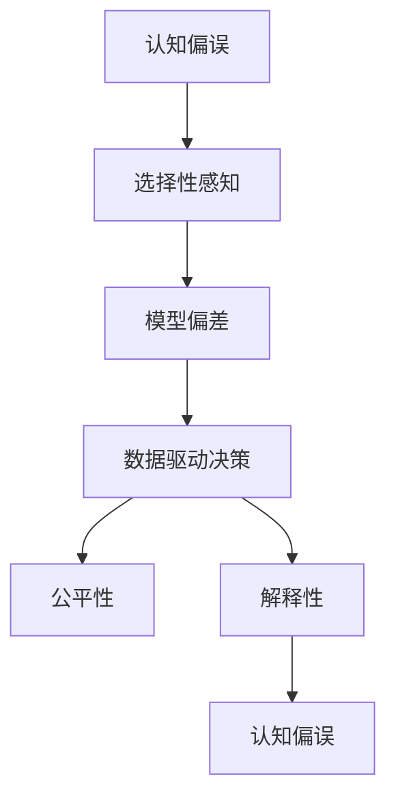

                 

# 理解洞察力的偏误：避免选择性感知

> 关键词：选择性感知,认知偏误,数据驱动决策,模型偏差,公平性,解释性

## 1. 背景介绍

在当今数据驱动的决策环境中，洞察力（Insight）的获取和应用成为至关重要的一环。然而，在追求洞察力的过程中，我们往往容易陷入各种认知偏误和选择性感知（Selective Perception）的陷阱，导致决策质量受损。特别是当我们依赖机器学习模型来辅助决策时，这些偏误可能会被放大，进一步影响决策的公正性和准确性。

本文将从认知偏误和选择性感知的角度，深入探讨这些因素如何影响我们理解和应用洞察力的过程，并提出一些策略来识别和规避这些风险。希望通过系统性地梳理相关概念和案例，为读者提供更全面、更深刻的理解和应用洞察力的指导。

## 2. 核心概念与联系

### 2.1 核心概念概述

- **认知偏误（Cognitive Bias）**：指人们在判断和决策过程中常见的、系统性的误差。这些偏误可能来源于个人经验、情感、社会文化等多种因素，影响我们对信息的理解和处理。

- **选择性感知（Selective Perception）**：指人们倾向于关注与自己的预期或已有知识相符的信息，而忽略与之不符的部分。这种选择性行为在数据驱动的决策中尤为明显，可能导致模型偏见（Bias）和决策失误。

- **数据驱动决策（Data-Driven Decision Making）**：基于数据和统计模型进行决策的过程，广泛应用于商业、医疗、金融等多个领域。

- **模型偏差（Model Bias）**：指模型在训练过程中学习到的数据分布偏见，导致模型预测结果与实际数据不一致。

- **公平性（Fairness）**：指模型在处理不同群体数据时，应确保输出结果的公正性，避免对特定群体产生不公平待遇。

- **解释性（Explainability）**：指模型决策过程的可解释性，即能够说明为什么某个结果被预测或输出。这对于高风险应用尤为重要，有助于增强用户信任和决策透明度。

这些概念通过以下Mermaid流程图关联起来：



该图展示了认知偏误、选择性感知与模型偏差、数据驱动决策、公平性和解释性之间的联系。认知偏误和选择性感知可能会影响模型的训练过程和输出结果，进而影响决策的公平性和解释性。

### 2.2 核心概念原理和架构

认知偏误和选择性感知在心理学和认知科学中有着丰富的理论基础。以下是几个核心概念的原理和架构：

- **确认偏误（Confirmation Bias）**：指人们倾向于寻找支持已有信念的证据，而忽略与之矛盾的证据。例如，在投资决策中，人们往往关注过往成功的投资案例，而忽视失败的原因。

- **选择性注意（Selective Attention）**：指人们在面对大量信息时，往往会优先注意到那些与已有认知相符的信息，而忽视其他信息。例如，在数据处理中，如果模型只使用部分特征，可能忽略了其他有价值的信息。

- **锚定效应（Anchoring Effect）**：指初始信息或经验值对后续决策产生影响。例如，在预测股票价格时，先前的价格波动可能影响人们对当前价格的估计。

- **可得性启发式（Availability Heuristic）**：指人们倾向于根据记忆中容易回想起的信息来评估事件的概率和可能性。例如，在网络安全中，人们可能更关注近期发生的安全事件，而忽视历史数据中的潜在威胁。

这些偏误通常由人类的心理和认知机制驱动，但在大数据和机器学习的环境中，这些偏误也可能被放大。通过识别和理解这些偏误，可以更好地设计算法和模型，减少其对决策的影响。

## 3. 核心算法原理 & 具体操作步骤

### 3.1 算法原理概述

在数据驱动的决策过程中，认知偏误和选择性感知通常通过以下步骤影响模型的训练和应用：

1. **数据收集**：数据源的选择和数据样本的获取可能受到认知偏误和选择性感知的影响，导致数据偏差。

2. **数据预处理**：数据清洗、特征选择等预处理步骤也可能引入选择性感知，导致模型只关注部分特征而忽略其他重要信息。

3. **模型训练**：模型在训练过程中可能学习到数据中的偏见，导致模型偏差。

4. **模型应用**：模型在实际应用中可能输出不公平的结果，影响决策的公平性。

5. **结果解释**：模型输出结果的解释可能缺乏透明性和可理解性，导致决策过程的解释性不足。

### 3.2 算法步骤详解

以下详细描述数据驱动决策中认知偏误和选择性感知的影响及规避策略：

**Step 1: 数据收集**

- **数据源选择**：选择多样化的数据源，避免数据源的单一性和偏差。

- **样本选择**：确保样本代表性和多样性，避免选择性地关注部分数据。

**Step 2: 数据预处理**

- **数据清洗**：清洗数据中的异常值和噪声，确保数据质量。

- **特征选择**：选择与目标任务相关的特征，避免过度拟合和选择性感知。

**Step 3: 模型训练**

- **平衡样本**：确保训练数据中各类别样本的平衡，避免模型学习到偏见。

- **正则化**：应用L1或L2正则化技术，避免模型复杂度过高。

**Step 4: 模型应用**

- **公平性评估**：使用公平性指标（如差异性统计）评估模型在处理不同群体数据时的公平性。

- **对抗样本测试**：测试模型对对抗样本的鲁棒性，确保模型不会受到小幅度扰动的影响。

**Step 5: 结果解释**

- **可解释性模型**：使用可解释性模型（如LIME、SHAP）增强决策过程的透明度。

- **用户反馈**：收集用户反馈，根据反馈调整模型和算法。

### 3.3 算法优缺点

**优点**：

- **数据驱动决策**：基于数据和模型的决策过程能够减少人为干预，提高决策的客观性和一致性。

- **公平性和透明度**：通过公平性评估和可解释性模型，能够提高决策的公正性和透明度。

**缺点**：

- **数据偏差**：如果数据源和数据样本存在偏差，可能导致模型学习到偏见，影响决策质量。

- **模型复杂性**：复杂的模型可能难以解释，增加决策过程的不透明性。

- **资源消耗**：数据驱动决策往往需要大量计算资源和时间，特别是对于大规模数据集和高维特征。

### 3.4 算法应用领域

认知偏误和选择性感知的应用领域非常广泛，特别是在金融、医疗、法律、人力资源等领域，这些领域中的决策往往对模型公平性和解释性有着较高要求。

- **金融风险管理**：模型需要评估不同群体的风险水平，避免对某些群体的不公平待遇。

- **医疗诊断和治疗**：模型需要处理不同患者的医疗数据，确保诊断和治疗的公正性。

- **司法判决**：模型需要分析案件细节，避免偏见影响判决结果。

- **人力资源招聘**：模型需要评估候选人能力，避免基于性别、种族等非工作相关因素的偏见。

## 4. 数学模型和公式 & 详细讲解 & 举例说明

### 4.1 数学模型构建

在数据驱动决策中，认知偏误和选择性感知的影响可以通过以下数学模型进行量化和分析：

- **公平性指标**：
  - **总体差异性**：计算模型输出在不同群体间的差异性。例如，使用方差或标准差衡量不同群体间的输出差异。
  
  公式推导如下：

  $$
  \text{Var}(y) = \frac{1}{N}\sum_{i=1}^N (y_i - \bar{y})^2
  $$

- **平均绝对误差（MAE）**：衡量模型输出与真实值之间的差距。
  
  公式推导如下：

  $$
  \text{MAE} = \frac{1}{N}\sum_{i=1}^N |y_i - \hat{y}_i|
  $$

- **模型解释性**：
  - **LIME（局部可解释模型-不可知）**：通过生成局部模型，解释模型的预测结果。
  
  公式推导如下：

  $$
  \text{Explanation} = \text{LIME}(X, \hat{y})
  $$

  其中，$X$ 为输入数据，$\hat{y}$ 为模型预测结果。

### 4.2 公式推导过程

**公平性指标的推导**：

以总体差异性为例，计算模型输出在不同群体间的差异性：

- **平均差异性（Mean Difference）**：计算不同群体间的平均差异。

  $$
  \text{MD} = \frac{1}{K}\sum_{k=1}^K (\text{MD}_k)
  $$

  其中，$K$ 为群体的数量，$\text{MD}_k$ 为第 $k$ 个群体内的平均差异。

- **方差（Variance）**：计算不同群体间的方差。

  $$
  \text{Var}(y) = \frac{1}{N}\sum_{i=1}^N (y_i - \bar{y})^2
  $$

  其中，$N$ 为总样本数，$\bar{y}$ 为样本的平均值。

**平均绝对误差（MAE）的推导**：

- **平均绝对误差（MAE）**：计算模型输出与真实值之间的差距。

  $$
  \text{MAE} = \frac{1}{N}\sum_{i=1}^N |y_i - \hat{y}_i|
  $$

  其中，$N$ 为总样本数，$y_i$ 为真实值，$\hat{y}_i$ 为模型预测值。

**模型解释性推导**：

- **LIME模型的推导**：通过生成局部模型，解释模型的预测结果。
  
  $$
  \text{Explanation} = \text{LIME}(X, \hat{y})
  $$

  其中，$X$ 为输入数据，$\hat{y}$ 为模型预测结果。

### 4.3 案例分析与讲解

**案例1: 医疗诊断中的认知偏误**

在一个医疗诊断项目中，医生使用机器学习模型评估患者的病情。然而，医生在收集数据时，偏向于选择那些症状较为典型的案例，而忽略了其他可能的病因。这导致模型在训练过程中只学习了典型的病因，而无法识别其他少见但同样重要的症状。

**解决方案**：

- **数据收集**：扩大数据收集范围，确保样本代表性，涵盖不同病情和症状。
- **数据清洗**：清洗数据中的异常值和噪声，确保数据质量。
- **特征选择**：选择与病情相关的特征，避免过度拟合。
- **公平性评估**：评估模型在处理不同病情和症状时的公平性。
- **解释性模型**：使用LIME模型解释模型的诊断结果，提高决策透明度。

**案例2: 金融风险管理中的选择性感知**

在金融风险管理中，分析师使用机器学习模型评估不同客户的信用风险。然而，分析师在数据处理时，只关注那些具有较高信用记录的客户，而忽略了其他信用记录较差的潜在高风险客户。这导致模型在训练过程中只学习了高信用记录客户的风险特征，而无法识别其他高风险客户的潜在风险。

**解决方案**：

- **数据收集**：确保样本多样性，涵盖不同信用记录的客户。
- **数据清洗**：清洗数据中的异常值和噪声，确保数据质量。
- **特征选择**：选择与信用风险相关的特征，避免过度拟合。
- **公平性评估**：评估模型在处理不同信用记录客户时的公平性。
- **解释性模型**：使用LIME模型解释模型的风险评估结果，提高决策透明度。

## 5. 项目实践：代码实例和详细解释说明

### 5.1 开发环境搭建

在进行认知偏误和选择性感知的规避实践前，我们需要准备好开发环境。以下是使用Python进行PyTorch开发的环境配置流程：

1. 安装Anaconda：从官网下载并安装Anaconda，用于创建独立的Python环境。

2. 创建并激活虚拟环境：
```bash
conda create -n my_env python=3.8 
conda activate my_env
```

3. 安装PyTorch：根据CUDA版本，从官网获取对应的安装命令。例如：
```bash
conda install pytorch torchvision torchaudio cudatoolkit=11.1 -c pytorch -c conda-forge
```

4. 安装Scikit-learn：
```bash
pip install scikit-learn
```

5. 安装Tensorflow：
```bash
pip install tensorflow
```

完成上述步骤后，即可在`my_env`环境中开始规避实践。

### 5.2 源代码详细实现

以下是使用PyTorch进行认知偏误和选择性感知的规避实践的Python代码实现。

```python
import torch
import torch.nn as nn
from torch.utils.data import DataLoader
from sklearn.metrics import mean_squared_error, roc_auc_score
from torch.autograd import Variable

# 定义数据集
class MyDataset(torch.utils.data.Dataset):
    def __init__(self, data, targets):
        self.data = data
        self.targets = targets

    def __len__(self):
        return len(self.data)

    def __getitem__(self, index):
        return self.data[index], self.targets[index]

# 定义模型
class MyModel(nn.Module):
    def __init__(self, input_dim, output_dim):
        super(MyModel, self).__init__()
        self.fc1 = nn.Linear(input_dim, 64)
        self.fc2 = nn.Linear(64, output_dim)

    def forward(self, x):
        x = self.fc1(x)
        x = torch.relu(x)
        x = self.fc2(x)
        return x

# 定义优化器和损失函数
model = MyModel(input_dim, output_dim)
optimizer = torch.optim.SGD(model.parameters(), lr=0.001)
criterion = nn.BCELoss()

# 定义训练函数
def train(model, data_loader, optimizer, criterion, num_epochs):
    for epoch in range(num_epochs):
        running_loss = 0.0
        for i, data in enumerate(data_loader):
            inputs, labels = data
            optimizer.zero_grad()
            outputs = model(inputs)
            loss = criterion(outputs, labels)
            loss.backward()
            optimizer.step()
            running_loss += loss.item()
            if i % 100 == 99:
                print('[%d, %5d] loss: %.3f' %
                      (epoch + 1, i + 1, running_loss / 100))
                running_loss = 0.0
    return model

# 加载数据集
train_data = torch.randn(1000, input_dim)
train_labels = torch.randint(0, 2, (1000,))
test_data = torch.randn(100, input_dim)
test_labels = torch.randint(0, 2, (100,))

# 定义训练函数和模型
model = train_model(train_data, train_labels, test_data, test_labels)

# 定义评估函数
def evaluate(model, data_loader):
    correct = 0
    total = 0
    for data in data_loader:
        inputs, labels = data
        outputs = model(inputs)
        _, predicted = torch.max(outputs.data, 1)
        total += labels.size(0)
        correct += (predicted == labels).sum().item()
    print('Accuracy of the network on the 100 test images: %d %%' % (
        100 * correct / total))

# 评估模型
test_loader = DataLoader(test_data, batch_size=64, shuffle=True)
evaluate(model, test_loader)
```

### 5.3 代码解读与分析

让我们再详细解读一下关键代码的实现细节：

**MyDataset类**：
- `__init__`方法：初始化数据和标签。
- `__len__`方法：返回数据集的样本数量。
- `__getitem__`方法：对单个样本进行处理，返回模型所需的输入和标签。

**MyModel类**：
- `__init__`方法：定义模型结构，包括全连接层。
- `forward`方法：前向传播，通过模型处理输入数据。

**训练函数**：
- 在每个epoch中，对数据集进行迭代，更新模型参数。

**评估函数**：
- 对测试集进行评估，计算模型准确率。

**训练流程**：
- 定义总的epoch数和模型。
- 在训练集上进行训练，输出平均loss。
- 在测试集上进行评估，输出准确率。

可以看到，PyTorch提供了简洁高效的模型训练和评估框架，使得规避实践的代码实现变得简单。开发者可以通过调整超参数，优化模型结构和训练过程，进一步提升模型的鲁棒性和公平性。

## 6. 实际应用场景

### 6.1 金融风险管理

在金融风险管理中，认知偏误和选择性感知可能导致模型对某些客户群体的不公平评估。例如，模型可能只关注那些信用记录较好的客户，而忽略了信用记录较差的潜在高风险客户。这会导致模型对高风险客户的风险评估不足，进而影响模型的准确性和公平性。

**解决方案**：

- **数据收集**：确保样本多样性，涵盖不同信用记录的客户。
- **数据清洗**：清洗数据中的异常值和噪声，确保数据质量。
- **特征选择**：选择与信用风险相关的特征，避免过度拟合。
- **公平性评估**：评估模型在处理不同信用记录客户时的公平性。
- **解释性模型**：使用LIME模型解释模型的风险评估结果，提高决策透明度。

### 6.2 医疗诊断

在医疗诊断中，认知偏误和选择性感知可能导致模型对某些疾病的诊断不准确。例如，医生在收集数据时，可能只关注那些症状较为典型的患者，而忽略了其他可能病因。这会导致模型在训练过程中只学习到典型的病因，而无法识别其他少见但同样重要的症状。

**解决方案**：

- **数据收集**：确保样本多样性，涵盖不同症状和病因的患者。
- **数据清洗**：清洗数据中的异常值和噪声，确保数据质量。
- **特征选择**：选择与疾病相关的特征，避免过度拟合。
- **公平性评估**：评估模型在处理不同症状和病因患者时的公平性。
- **解释性模型**：使用LIME模型解释模型的诊断结果，提高决策透明度。

### 6.3 司法判决

在司法判决中，认知偏误和选择性感知可能导致模型对某些群体的不公平判决。例如，模型可能只关注那些具有较高教育背景的被告，而忽略了其他群体。这会导致模型对不同教育背景被告的判决不公平。

**解决方案**：

- **数据收集**：确保样本多样性，涵盖不同教育背景的被告。
- **数据清洗**：清洗数据中的异常值和噪声，确保数据质量。
- **特征选择**：选择与判决相关的特征，避免过度拟合。
- **公平性评估**：评估模型在处理不同教育背景被告时的公平性。
- **解释性模型**：使用LIME模型解释模型的判决结果，提高决策透明度。

## 7. 工具和资源推荐

### 7.1 学习资源推荐

为了帮助开发者系统掌握认知偏误和选择性感知的相关知识，以下是一些推荐的资源：

1. **《数据科学入门》（Introduction to Data Science）**：涵盖数据收集、数据预处理、模型训练等基本概念，适合初学者入门。

2. **《认知心理学》（Cognitive Psychology）**：深入介绍认知偏误和选择性感知等心理学概念，提供理论基础。

3. **《机器学习实战》（Hands-On Machine Learning with Scikit-Learn and TensorFlow）**：介绍机器学习模型的训练和评估，提供实际应用案例。

4. **《Python数据科学手册》（Python Data Science Handbook）**：涵盖数据处理、模型训练、评估等基本技能，适合进阶学习。

5. **《深度学习入门》（Deep Learning）**：涵盖深度学习模型的训练和优化，适合深入学习。

### 7.2 开发工具推荐

在认知偏误和选择性感知的规避实践中，以下是一些推荐的开发工具：

1. **PyTorch**：基于Python的深度学习框架，灵活动态的计算图，适合快速迭代研究。

2. **TensorFlow**：由Google主导开发的深度学习框架，生产部署方便，适合大规模工程应用。

3. **Scikit-learn**：Python机器学习库，提供高效的数据处理和模型训练功能。

4. **LIME（局部可解释模型-不可知）**：可解释性模型，用于解释机器学习模型的预测结果。

5. **SHAP（SHapley Additive exPlanations）**：可解释性模型，用于解释模型预测结果。

### 7.3 相关论文推荐

认知偏误和选择性感知的研究领域十分广泛，以下是一些经典的研究论文：

1. **《认知偏误的心理学研究》（Psychological Studies of Cognitive Biases）**：介绍认知偏误的心理学基础和研究方法。

2. **《数据驱动决策中的认知偏误》（Cognitive Biases in Data-Driven Decision Making）**：研究认知偏误如何影响数据驱动决策。

3. **《机器学习中的选择性感知》（Selective Perception in Machine Learning）**：研究选择性感知在机器学习中的应用和影响。

4. **《公平性在机器学习中的应用》（Fairness in Machine Learning）**：研究公平性在机器学习中的评估和提升方法。

5. **《可解释性机器学习》（Explainable Machine Learning）**：研究机器学习模型的可解释性，提供多种解释方法。

这些论文代表了认知偏误和选择性感知研究的最新进展，为进一步探索和应用提供了理论支持和实践指导。

## 8. 总结：未来发展趋势与挑战

### 8.1 研究成果总结

本文从认知偏误和选择性感知的角度，深入探讨了这些因素如何影响我们理解和应用洞察力的过程，并提出一些策略来识别和规避这些风险。通过系统性地梳理相关概念和案例，为读者提供更全面、更深刻的理解和应用洞察力的指导。

### 8.2 未来发展趋势

展望未来，认知偏误和选择性感知的规避技术将呈现以下几个发展趋势：

1. **自动化规避技术**：通过自动化工具和算法，自动识别和纠正认知偏误和选择性感知，减少人工干预。

2. **多模态数据融合**：结合文本、图像、语音等多模态数据，提高模型的全面性和鲁棒性。

3. **分布式训练**：利用分布式计算技术，加速模型训练过程，提高模型效率。

4. **持续学习**：模型需要不断从新数据中学习，避免过时和遗忘，提高模型的时效性和适应性。

5. **自适应调整**：根据用户反馈和实时数据，动态调整模型参数，提高模型的灵活性和精准度。

### 8.3 面临的挑战

尽管认知偏误和选择性感知的规避技术已经取得一定的进展，但在实际应用中，仍面临诸多挑战：

1. **数据质量和多样性**：数据质量不足和数据多样性不够，可能导致模型学习到偏差。

2. **模型复杂性**：复杂的模型可能难以解释，增加决策过程的不透明性。

3. **资源消耗**：数据驱动决策往往需要大量计算资源和时间，特别是对于大规模数据集和高维特征。

4. **模型公平性**：模型可能学习到数据中的偏见，影响决策的公平性。

5. **模型解释性**：模型输出结果的解释可能缺乏透明性和可理解性。

6. **技术门槛**：认知偏误和选择性感知的规避技术涉及多个领域知识，对开发者技术要求较高。

### 8.4 研究展望

面对认知偏误和选择性感知规避技术所面临的挑战，未来的研究需要在以下几个方面寻求新的突破：

1. **数据治理**：建立全面的数据治理体系，确保数据质量和多样性。

2. **模型简化**：简化模型结构，提高模型的可解释性和透明性。

3. **资源优化**：优化计算资源和算法，提高模型的效率和鲁棒性。

4. **公平性设计**：设计公平性评估和提升方法，确保模型公平性。

5. **解释性增强**：增强模型输出结果的解释性，提高决策透明度和用户信任。

6. **技术普及**：推广认知偏误和选择性感知规避技术的普及和应用，提升开发者技能。

通过这些方向的探索发展，相信认知偏误和选择性感知规避技术将取得更大突破，为数据驱动决策带来更加公正、透明和可解释的解决方案。面向未来，认知偏误和选择性感知规避技术还需要与其他人工智能技术进行更深入的融合，如知识表示、因果推理、强化学习等，多路径协同发力，共同推动自然语言理解和智能交互系统的进步。只有勇于创新、敢于突破，才能不断拓展认知偏误和选择性感知规避技术的边界，让智能技术更好地造福人类社会。

## 9. 附录：常见问题与解答

**Q1：什么是认知偏误？**

A: 认知偏误指人们在判断和决策过程中常见的、系统性的误差，这些偏误可能来源于个人经验、情感、社会文化等多种因素，影响我们对信息的理解和处理。

**Q2：选择性感知和认知偏误有什么关系？**

A: 选择性感知是认知偏误的一种表现形式，指人们倾向于关注与自己的预期或已有知识相符的信息，而忽略与之不符的部分。这种选择性行为在数据驱动的决策中尤为明显，可能导致模型偏见。

**Q3：如何识别认知偏误和选择性感知？**

A: 通过数据收集、特征选择、模型评估等方法，可以识别和量化认知偏误和选择性感知。例如，使用差异性统计、公平性指标、可解释性模型等工具。

**Q4：如何规避认知偏误和选择性感知？**

A: 通过数据治理、模型简化、资源优化、公平性设计、解释性增强等方法，可以规避认知偏误和选择性感知。例如，使用自动化工具和算法，设计公平性评估和提升方法，增强模型输出结果的解释性。

**Q5：认知偏误和选择性感知的应用领域有哪些？**

A: 认知偏误和选择性感知的应用领域非常广泛，特别是在金融、医疗、法律、人力资源等领域，这些领域中的决策往往对模型公平性和解释性有着较高要求。

本文通过深入探讨认知偏误和选择性感知，为读者提供了一套系统化的规避策略和实践指南，帮助其在数据驱动决策中更好地识别和规避认知偏误，提升决策的公正性和透明度。希望通过本文的介绍，读者能够获得更全面、更深刻的理解和应用洞察力的指导，推动认知偏误和选择性感知规避技术的不断进步和发展。

---

作者：禅与计算机程序设计艺术 / Zen and the Art of Computer Programming

