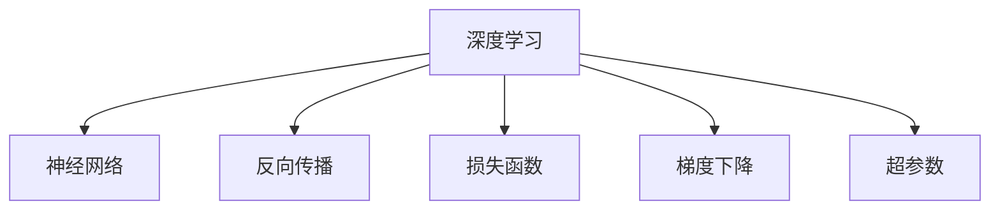

                 

# 理解洞察力的培养：鼓励好奇心和开放心态

> 关键词：洞察力, 好奇心, 开放心态, 人工智能, 深度学习, 算法优化

## 1. 背景介绍

在科技迅猛发展的今天，人工智能（AI）技术正深刻改变着我们的生活和工作方式。从自动驾驶到语音识别，从机器翻译到智能客服，AI技术在各个领域的应用，都离不开对深度学习模型的依赖。然而，深度学习模型之所以能取得如此出色的表现，离不开人类对其原理的深刻理解。这背后，洞察力的培养起着关键作用。

洞察力不仅仅是基于数据和算法的分析能力，更是对问题的敏锐捕捉、对模型的深刻理解以及对技术的持续探索。本文将围绕深度学习的核心算法和具体操作步骤，深入探讨如何培养洞察力，鼓励好奇心和开放心态，最终实现对AI技术的全面掌握。

## 2. 核心概念与联系

### 2.1 核心概念概述

为更好地理解深度学习模型的构建和优化过程，本节将介绍几个关键概念：

- 深度学习（Deep Learning）：一类基于神经网络的机器学习算法，通过多层非线性变换，学习数据分布的复杂结构。
- 神经网络（Neural Network）：由节点（神经元）和边（连接）组成的计算模型，用于模拟人脑处理信息的过程。
- 反向传播（Backpropagation）：一种用于训练神经网络的算法，通过链式法则计算每个节点的梯度，更新模型参数。
- 损失函数（Loss Function）：用于衡量模型预测与真实标签之间的差异，常用的损失函数包括均方误差、交叉熵等。
- 梯度下降（Gradient Descent）：一种优化算法，通过迭代计算梯度并更新模型参数，最小化损失函数。
- 超参数（Hyperparameters）：神经网络模型的参数，如学习率、批大小等，需要人工设定。

这些核心概念之间的逻辑关系可以通过以下Mermaid流程图来展示：



这个流程图展示了深度学习模型构建的基本流程：通过神经网络来学习数据分布，利用反向传播算法更新参数，以最小化损失函数为目标，并由超参数来控制模型的训练过程。

## 3. 核心算法原理 & 具体操作步骤
### 3.1 算法原理概述

深度学习模型的训练过程，本质上是求解一个复杂的优化问题。以神经网络为例，假设模型输出为 $f(x; \theta)$，其中 $\theta$ 为模型参数，$x$ 为输入数据。模型的目标是找到一个最优的参数集 $\theta^*$，使得损失函数 $L(f(x; \theta^*), y)$ 最小化，其中 $y$ 为真实标签。

因此，训练过程可以形式化为：

$$
\theta^* = \mathop{\arg\min}_{\theta} L(f(x; \theta), y)
$$

这一过程通常通过梯度下降等优化算法来实现。梯度下降的基本思想是通过计算损失函数对参数的梯度，反向传播到每一层神经元，更新参数以减小损失。具体步骤如下：

1. 初始化模型参数 $\theta$。
2. 随机选择一个训练样本 $x_i$。
3. 计算模型输出 $f(x_i; \theta)$。
4. 计算损失函数 $L(f(x_i; \theta), y_i)$。
5. 计算梯度 $\frac{\partial L}{\partial \theta}$。
6. 更新参数 $\theta \leftarrow \theta - \eta \frac{\partial L}{\partial \theta}$，其中 $\eta$ 为学习率。
7. 重复步骤2-6，直到损失函数收敛或达到预设轮数。

### 3.2 算法步骤详解

以简单的单层神经网络为例，详细讲解梯度下降的具体操作步骤：

**Step 1: 初始化模型参数**

首先，随机初始化模型参数 $\theta$，通常取值范围为 $[-\sigma, \sigma]$，其中 $\sigma$ 为标准差。

**Step 2: 随机选择一个训练样本**

从训练集 $D$ 中随机选择一个样本 $(x_i, y_i)$，其中 $x_i$ 为输入，$y_i$ 为标签。

**Step 3: 计算模型输出**

将样本 $x_i$ 输入模型，计算预测输出 $f(x_i; \theta)$。

**Step 4: 计算损失函数**

根据当前输出和真实标签 $y_i$，计算损失函数 $L(f(x_i; \theta), y_i)$。例如，使用均方误差损失：

$$
L(f(x_i; \theta), y_i) = \frac{1}{2} (f(x_i; \theta) - y_i)^2
$$

**Step 5: 计算梯度**

使用链式法则，计算损失函数对模型参数的梯度 $\frac{\partial L}{\partial \theta}$。例如，对于权重 $w$，梯度计算如下：

$$
\frac{\partial L}{\partial w} = \frac{\partial L}{\partial f(x_i; \theta)} \cdot \frac{\partial f(x_i; \theta)}{\partial w}
$$

**Step 6: 更新参数**

根据梯度和学习率，更新模型参数：

$$
w \leftarrow w - \eta \frac{\partial L}{\partial w}
$$

**Step 7: 重复迭代**

重复步骤2-6，直到损失函数收敛或达到预设轮数。

### 3.3 算法优缺点

深度学习模型在处理复杂数据时具有出色的表现，但同时也有其局限性：

**优点：**

1. 可以自动提取数据特征，无需人工设计。
2. 可以处理大规模数据，适用于多种任务。
3. 可以跨领域迁移，提升泛化能力。

**缺点：**

1. 需要大量标注数据，标注成本高。
2. 容易过拟合，模型复杂度高。
3. 对参数和超参数依赖性强，调试难度大。
4. 计算资源消耗大，训练时间长。

尽管存在这些局限性，但深度学习模型仍在不断进步，通过算法优化和模型设计，逐步克服了这些缺点。未来，随着算力和数据量的进一步提升，深度学习模型将在更多领域得到应用，成为解决复杂问题的有力工具。

### 3.4 算法应用领域

深度学习模型已经在计算机视觉、自然语言处理、语音识别、推荐系统等多个领域得到了广泛应用，以下是一些具体的应用场景：

- 计算机视觉：如人脸识别、物体检测、图像分割等。深度学习模型通过卷积神经网络（CNN）学习图像特征。
- 自然语言处理：如机器翻译、文本分类、情感分析等。深度学习模型通过循环神经网络（RNN）或Transformer等结构学习语言表示。
- 语音识别：如自动语音识别、说话人识别等。深度学习模型通过卷积神经网络或循环神经网络学习语音特征。
- 推荐系统：如商品推荐、内容推荐等。深度学习模型通过协同过滤或神经网络学习用户和物品的关联。

除了这些经典任务外，深度学习模型还被创新性地应用到更多场景中，如医疗影像分析、金融风控、智能交通等，为各行各业带来了新的变革。

## 4. 数学模型和公式 & 详细讲解
### 4.1 数学模型构建

深度学习模型的数学模型通常包括输入数据 $x$、模型参数 $\theta$、输出 $y$ 和损失函数 $L$。以简单的单层神经网络为例，数学模型可以表示为：

$$
y = f(x; \theta) = \sigma(w \cdot x + b)
$$

其中 $\sigma$ 为激活函数，$w$ 和 $b$ 为权重和偏置。

### 4.2 公式推导过程

以均方误差损失为例，推导损失函数的梯度：

$$
L(y, y') = \frac{1}{2} (y - y')^2
$$

其中 $y'$ 为模型预测输出。将 $y'$ 代入损失函数中，得到：

$$
L(y, f(x; \theta)) = \frac{1}{2} (y - f(x; \theta))^2
$$

对 $f(x; \theta)$ 求导，得到梯度：

$$
\frac{\partial L}{\partial w} = \frac{\partial L}{\partial f(x; \theta)} \cdot \frac{\partial f(x; \theta)}{\partial w}
$$

代入激活函数 $\sigma$，得到：

$$
\frac{\partial L}{\partial w} = \frac{\partial L}{\partial f(x; \theta)} \cdot \sigma'(w \cdot x + b) \cdot x
$$

其中 $\sigma'$ 为激活函数的导数。

### 4.3 案例分析与讲解

以深度学习模型在图像分类任务中的应用为例，分析其工作原理和数学模型：

**数据准备：**

1. 收集图像数据集，如MNIST、CIFAR-10等。
2. 将图像转换为数字矩阵，每个像素点表示为一个数字。
3. 将标签转换为数字，用于训练模型的监督信号。

**模型构建：**

1. 定义神经网络结构，如图像卷积神经网络（CNN）。
2. 随机初始化模型参数。
3. 将训练数据输入模型，计算预测输出。
4. 计算损失函数，如交叉熵损失。
5. 计算梯度，更新模型参数。

**训练过程：**

1. 重复迭代训练过程，逐步调整模型参数，最小化损失函数。
2. 在验证集上评估模型性能，调整超参数。
3. 在测试集上评估最终模型性能。

## 5. 项目实践：代码实例和详细解释说明
### 5.1 开发环境搭建

在进行深度学习项目实践前，需要准备好开发环境。以下是使用Python进行TensorFlow开发的配置流程：

1. 安装Anaconda：从官网下载并安装Anaconda，用于创建独立的Python环境。

2. 创建并激活虚拟环境：
```bash
conda create -n tf-env python=3.8 
conda activate tf-env
```

3. 安装TensorFlow：从官网获取对应的安装命令。例如：
```bash
conda install tensorflow -c conda-forge -c pytorch
```

4. 安装TensorBoard：用于可视化训练过程和模型性能。

5. 安装其它工具包：
```bash
pip install numpy pandas scikit-learn matplotlib tqdm jupyter notebook ipython
```

完成上述步骤后，即可在`tf-env`环境中开始项目开发。

### 5.2 源代码详细实现

这里我们以图像分类任务为例，给出使用TensorFlow进行深度学习模型训练的Python代码实现。

```python
import tensorflow as tf
from tensorflow.keras.datasets import mnist
from tensorflow.keras.models import Sequential
from tensorflow.keras.layers import Conv2D, MaxPooling2D, Flatten, Dense
from tensorflow.keras.optimizers import Adam
from tensorflow.keras.utils import to_categorical

# 加载数据集
(x_train, y_train), (x_test, y_test) = mnist.load_data()

# 数据预处理
x_train = x_train.reshape(-1, 28, 28, 1).astype('float32') / 255.0
x_test = x_test.reshape(-1, 28, 28, 1).astype('float32') / 255.0
y_train = to_categorical(y_train, 10)
y_test = to_categorical(y_test, 10)

# 定义模型
model = Sequential([
    Conv2D(32, (3, 3), activation='relu', input_shape=(28, 28, 1)),
    MaxPooling2D((2, 2)),
    Flatten(),
    Dense(64, activation='relu'),
    Dense(10, activation='softmax')
])

# 编译模型
model.compile(optimizer=Adam(learning_rate=0.001),
              loss='categorical_crossentropy',
              metrics=['accuracy'])

# 训练模型
model.fit(x_train, y_train, epochs=10, batch_size=64, validation_data=(x_test, y_test))
```

### 5.3 代码解读与分析

让我们再详细解读一下关键代码的实现细节：

**数据预处理：**

1. 加载MNIST数据集，获取训练集和测试集的图像和标签。
2. 将图像数据转换为数字矩阵，并归一化到0-1之间。
3. 将标签数据转换为one-hot编码格式，用于训练模型的监督信号。

**模型构建：**

1. 定义神经网络结构，包括卷积层、池化层、全连接层等。
2. 随机初始化模型参数。

**模型编译：**

1. 定义优化器，如Adam，设定学习率。
2. 定义损失函数，如交叉熵损失。
3. 定义评估指标，如准确率。

**模型训练：**

1. 使用fit方法训练模型，迭代优化模型参数。
2. 在验证集上评估模型性能，调整超参数。
3. 在测试集上评估最终模型性能。

## 6. 实际应用场景
### 6.1 智能推荐系统

深度学习模型在推荐系统中得到了广泛应用，通过协同过滤或神经网络模型学习用户和物品的关联，生成推荐结果。推荐系统可以通过分析用户的历史行为和兴趣偏好，预测其可能感兴趣的商品或内容，提供个性化的推荐服务。

**数据准备：**

1. 收集用户行为数据，如浏览记录、购买记录等。
2. 将数据转换为数字格式，用于训练模型。

**模型构建：**

1. 定义神经网络结构，如矩阵分解、神经网络等。
2. 随机初始化模型参数。

**模型训练：**

1. 使用fit方法训练模型，迭代优化模型参数。
2. 在验证集上评估模型性能，调整超参数。
3. 在测试集上评估最终模型性能。

**推荐应用：**

1. 根据用户输入的查询，使用模型预测推荐结果。
2. 根据推荐结果生成推荐列表，提供给用户。

### 6.2 智能交通系统

深度学习模型在智能交通系统中得到了广泛应用，通过分析交通数据，预测交通流量和拥堵情况，优化交通信号控制。智能交通系统可以通过实时监测交通数据，预测未来交通流量，优化交通信号灯的配时，减少拥堵，提高通行效率。

**数据准备：**

1. 收集交通数据，如车辆位置、速度、流量等。
2. 将数据转换为数字格式，用于训练模型。

**模型构建：**

1. 定义神经网络结构，如卷积神经网络、循环神经网络等。
2. 随机初始化模型参数。

**模型训练：**

1. 使用fit方法训练模型，迭代优化模型参数。
2. 在验证集上评估模型性能，调整超参数。
3. 在测试集上评估最终模型性能。

**应用场景：**

1. 根据实时交通数据，预测未来交通流量。
2. 根据流量预测结果，优化交通信号灯配时。
3. 实时监测交通状况，发布预警信息。

### 6.3 智能医疗系统

深度学习模型在智能医疗系统中得到了广泛应用，通过分析医疗数据，预测疾病风险，辅助诊断和治疗。智能医疗系统可以通过分析患者的历史病历、检查结果等数据，预测其患病的风险，辅助医生诊断和治疗，提高医疗效率和质量。

**数据准备：**

1. 收集医疗数据，如病历、检查结果等。
2. 将数据转换为数字格式，用于训练模型。

**模型构建：**

1. 定义神经网络结构，如卷积神经网络、循环神经网络等。
2. 随机初始化模型参数。

**模型训练：**

1. 使用fit方法训练模型，迭代优化模型参数。
2. 在验证集上评估模型性能，调整超参数。
3. 在测试集上评估最终模型性能。

**应用场景：**

1. 根据患者历史数据，预测其患病风险。
2. 根据患病风险，辅助医生进行诊断和治疗。
3. 实时监测患者健康状况，发布预警信息。

## 7. 工具和资源推荐
### 7.1 学习资源推荐

为了帮助开发者系统掌握深度学习模型的构建和优化过程，这里推荐一些优质的学习资源：

1. 《深度学习》（Ian Goodfellow, Yoshua Bengio, Aaron Courville）：深度学习领域的经典教材，涵盖深度学习的基本概念和算法。

2. 《TensorFlow官方文档》：TensorFlow官方提供的详细文档，涵盖深度学习模型的构建、训练和部署。

3. 《PyTorch官方文档》：PyTorch官方提供的详细文档，涵盖深度学习模型的构建、训练和部署。

4. 《Deep Learning with Python》：DeepLearning.AI提供的深度学习课程，涵盖深度学习模型的构建、训练和部署。

5. 《NeurIPS和ICLR论文集》：深度学习领域的顶级会议，涵盖最新的深度学习研究成果和技术进展。

通过对这些资源的学习实践，相信你一定能够快速掌握深度学习模型的构建和优化技巧，并用于解决实际的NLP问题。

### 7.2 开发工具推荐

高效的开发离不开优秀的工具支持。以下是几款用于深度学习模型构建和优化的常用工具：

1. TensorFlow：由Google主导开发的深度学习框架，生产部署方便，适合大规模工程应用。

2. PyTorch：由Facebook主导开发的深度学习框架，灵活性高，适合快速迭代研究。

3. Keras：一个高级神经网络API，简洁易用，适合初学者快速上手。

4. Jupyter Notebook：一个开源的交互式笔记本环境，支持Python代码编写和可视化展示。

5. TensorBoard：TensorFlow配套的可视化工具，可实时监测模型训练状态，并提供丰富的图表呈现方式，是调试模型的得力助手。

合理利用这些工具，可以显著提升深度学习模型的构建和优化效率，加快创新迭代的步伐。

### 7.3 相关论文推荐

深度学习模型的研究源于学界的持续研究。以下是几篇奠基性的相关论文，推荐阅读：

1. "Deep Learning" by Ian Goodfellow, Yoshua Bengio, and Aaron Courville：深度学习领域的经典教材，涵盖深度学习的基本概念和算法。

2. "ImageNet Classification with Deep Convolutional Neural Networks" by Alex Krizhevsky, Ilya Sutskever, and Geoffrey Hinton：展示深度卷积神经网络在图像分类任务上的出色表现，引发了深度学习的热潮。

3. "Attention is All You Need" by Ashish Vaswani et al.：提出Transformer结构，开启了深度学习中的自注意力机制，成为NLP任务中的重要模型。

4. "Convolutional Neural Networks for Sentence Classification" by Kyunghyun Cho et al.：展示卷积神经网络在文本分类任务上的出色表现，推动了文本分类任务的发展。

5. "Generative Adversarial Nets" by Ian Goodfellow, Jean Pouget-Abadie, and Aaron Courville：提出生成对抗网络，推动了生成模型和图像生成技术的发展。

这些论文代表了大深度学习模型的发展脉络。通过学习这些前沿成果，可以帮助研究者把握学科前进方向，激发更多的创新灵感。

## 8. 总结：未来发展趋势与挑战

### 8.1 总结

本文对深度学习模型的构建和优化过程进行了全面系统的介绍。首先阐述了深度学习模型在图像分类、推荐系统、智能交通、智能医疗等领域的广泛应用，明确了深度学习模型在现代科技中的重要地位。其次，从原理到实践，详细讲解了深度学习模型的数学模型和算法步骤，给出了深度学习模型开发的完整代码实例。同时，本文还探讨了深度学习模型在实际应用中面临的挑战和未来发展趋势，为深度学习模型的研究和实践提供了方向性指引。

通过本文的系统梳理，可以看到，深度学习模型作为人工智能的重要组成部分，正在深刻改变着各行各业。未来，伴随算力和数据量的进一步提升，深度学习模型将在更多领域得到应用，成为解决复杂问题的有力工具。

### 8.2 未来发展趋势

展望未来，深度学习模型将呈现以下几个发展趋势：

1. 模型规模持续增大。随着算力成本的下降和数据规模的扩张，深度学习模型的参数量还将持续增长。超大规模模型蕴含的丰富特征表示，有望支撑更加复杂多变的任务。

2. 模型效率不断提升。随着模型压缩、量化加速等技术的发展，深度学习模型的推理速度和内存占用将不断优化，实现更高效的应用。

3. 跨领域迁移能力增强。通过跨领域迁移学习，深度学习模型可以在不同任务之间实现知识迁移，提升泛化能力。

4. 数据驱动的模型优化。通过自监督学习、主动学习等方法，深度学习模型可以更好地利用数据进行模型优化，提高训练效率和模型性能。

5. 联邦学习和分布式训练。通过分布式训练和多设备协作，深度学习模型可以实现更高效、更大规模的训练，保障数据隐私和安全。

6. 人工智能伦理和安全。随着深度学习模型的广泛应用，模型伦理和安全问题日益凸显，亟需进一步研究和规范。

以上趋势凸显了深度学习模型的广阔前景。这些方向的探索发展，必将进一步提升深度学习模型的性能和应用范围，为各行各业带来新的变革。

### 8.3 面临的挑战

尽管深度学习模型已经取得了瞩目成就，但在迈向更加智能化、普适化应用的过程中，它仍面临着诸多挑战：

1. 数据质量和规模。深度学习模型需要大量高质量的数据进行训练，数据获取和标注成本高。如何高效利用有限数据，提升模型性能，是一个重要问题。

2. 模型复杂度和训练时间。深度学习模型往往结构复杂，训练时间较长，对计算资源要求高。如何优化模型结构和训练过程，提高训练效率，是一个重要问题。

3. 模型可解释性和鲁棒性。深度学习模型通常被视为"黑盒"系统，难以解释其内部工作机制。如何在保证模型性能的同时，增强可解释性和鲁棒性，是一个重要问题。

4. 模型泛化和迁移能力。深度学习模型在特定任务上表现优异，但在跨领域迁移时可能效果不佳。如何提高模型泛化能力，实现跨领域迁移，是一个重要问题。

5. 数据隐私和安全。深度学习模型涉及大量用户数据，数据隐私和安全问题亟需解决。如何保护用户隐私，确保数据安全，是一个重要问题。

6. 伦理和社会影响。深度学习模型可能带来歧视性、偏见性输出，对社会产生不良影响。如何保证模型伦理和社会影响，是一个重要问题。

这些挑战需要学术界、产业界和政府等多方协同合作，共同应对。只有解决好这些问题，深度学习模型才能在更广泛的应用场景中发挥其潜力，为人类社会带来更多福祉。

### 8.4 研究展望

面对深度学习模型所面临的种种挑战，未来的研究需要在以下几个方面寻求新的突破：

1. 探索新算法和新架构。研发新算法和新架构，提升深度学习模型的训练效率和模型性能，如图灵归一化、自适应归一化等。

2. 引入多模态数据融合。将视觉、语音、文本等多种模态数据进行融合，提升深度学习模型的感知能力和泛化能力。

3. 加强模型解释性和可解释性。开发可解释性模型，增强深度学习模型的可解释性和鲁棒性，如LIME、SHAP等。

4. 引入知识图谱和规则库。将符号化的知识图谱和规则库与深度学习模型进行融合，提升模型的常识推理能力。

5. 加强模型伦理和安全约束。在模型训练目标中引入伦理导向的评估指标，过滤和惩罚有偏见、有害的输出倾向，确保模型伦理和社会影响。

这些研究方向将引领深度学习模型迈向更高的台阶，为构建安全、可靠、可解释、可控的智能系统铺平道路。面向未来，深度学习模型还需要与其他人工智能技术进行更深入的融合，如知识表示、因果推理、强化学习等，多路径协同发力，共同推动人工智能技术的进步。只有勇于创新、敢于突破，才能不断拓展深度学习模型的边界，让智能技术更好地造福人类社会。

## 9. 附录：常见问题与解答

**Q1：深度学习模型需要多少数据？**

A: 深度学习模型通常需要大量的标注数据进行训练，数据量越大，模型性能越好。但不同任务对数据量的需求不同，如自然语言处理任务通常需要百万级别的标注数据，而图像分类任务可能只需要数千或数万条标注数据。

**Q2：深度学习模型为什么需要高性能计算资源？**

A: 深度学习模型参数量庞大，训练过程复杂，涉及大量的矩阵乘法和梯度计算。高性能计算资源可以加速训练过程，提高模型性能。

**Q3：深度学习模型如何进行超参数调优？**

A: 深度学习模型的超参数包括学习率、批大小、迭代次数等，需要通过实验找到最优组合。常用的方法包括网格搜索、随机搜索、贝叶斯优化等。

**Q4：深度学习模型如何进行模型压缩？**

A: 深度学习模型可以通过剪枝、量化、蒸馏等方法进行压缩，减小模型尺寸，提高推理速度和内存占用。

**Q5：深度学习模型如何进行迁移学习？**

A: 迁移学习是指将在大规模数据上预训练的模型迁移到小规模数据上进行微调，提升模型性能。迁移学习需要选择合适的预训练模型和微调策略，以实现最优效果。

这些问题的解答，可以帮助开发者更好地理解和应用深度学习模型，推动深度学习技术的不断进步。

---

作者：禅与计算机程序设计艺术 / Zen and the Art of Computer Programming

