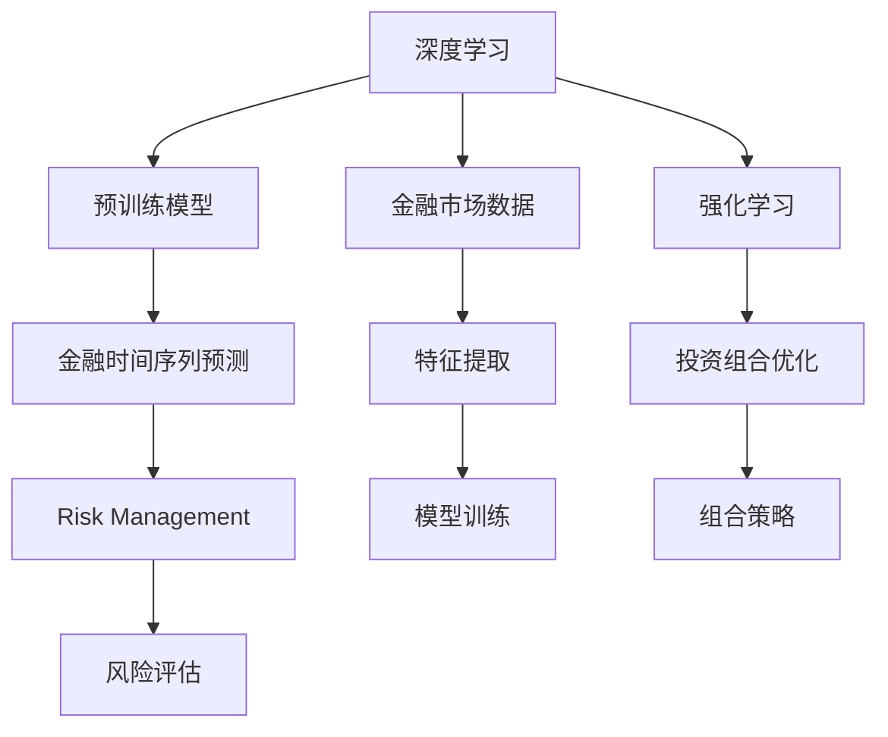

                 

# 理解洞察力的应用：在投资领域的策略实践

在瞬息万变的金融市场中，投资者需要敏锐的洞察力来捕捉机会、规避风险，从而实现稳定和可观的投资回报。本文将探讨如何利用人工智能(AI)技术，特别是基于深度学习模型的洞察力，帮助投资者在投资领域中做出更科学的决策。

## 1. 背景介绍

### 1.1 问题由来
投资决策是一个复杂而多变的过程，涉及基本面分析、技术分析、情绪分析等多种维度。传统的投资策略依赖于经验和直觉，往往难以应对市场动态和个体差异。随着深度学习技术的成熟，投资者开始利用机器学习算法来挖掘市场数据中的洞察力，提升决策的科学性和准确性。

### 1.2 问题核心关键点
深度学习在投资领域的应用主要集中在两个方面：一是利用预训练模型捕捉市场趋势和模式，二是通过强化学习等技术实现自动化的交易策略。本文将从这两个角度，详细阐述深度学习在投资中的策略实践。

## 2. 核心概念与联系

### 2.1 核心概念概述

- 深度学习(Deep Learning)：基于神经网络模型，通过多层次的非线性变换，自动从数据中学习出高维特征，捕捉复杂模式和关系。
- 预训练模型(Pre-trained Model)：在大规模无标签数据上预先训练的模型，可以提取通用特征，在特定任务上进行微调。
- 强化学习(Reinforcement Learning, RL)：通过智能体与环境交互，利用奖励信号不断优化策略，实现自动化决策。
- 金融时间序列预测(Financial Time Series Forecasting)：预测未来的金融市场走势，帮助投资者制定策略。
- 投资组合优化(Portfolio Optimization)：通过优化投资组合，实现收益最大化或风险最小化。
- 风险管理(Risk Management)：通过模型评估和管理风险，保障投资安全。

这些核心概念通过深度学习技术联系在一起，形成了一套综合的决策支持系统，帮助投资者应对市场变化，实现稳健投资。

### 2.2 核心概念原理和架构的 Mermaid 流程图



此流程图展示了深度学习在投资决策中的各个环节：通过金融市场数据输入，深度学习模型进行特征提取和模式识别，结合强化学习进行策略优化，最后风险管理模型评估和管理风险。

## 3. 核心算法原理 & 具体操作步骤

### 3.1 算法原理概述

基于深度学习的洞察力在投资决策中的应用，主要通过以下几个步骤：

1. **数据获取与预处理**：从各种数据源（如股票、期货、外汇等）获取市场数据，并进行清洗、归一化等预处理。
2. **特征提取**：利用深度学习模型，如卷积神经网络(CNN)、长短期记忆网络(LSTM)等，从历史数据中提取有意义的特征。
3. **模型训练**：使用标注数据训练预训练模型，并进行微调，以适应特定的投资决策任务。
4. **洞察力挖掘**：通过特征和模型，挖掘市场趋势、模式和异常，提供投资决策依据。
5. **策略优化**：结合强化学习，自动生成和优化交易策略，提升投资效果。
6. **风险评估与管理**：评估模型输出风险，采用模型管理策略，降低投资风险。

### 3.2 算法步骤详解

#### 数据获取与预处理
- 从各大数据源收集历史市场数据，包括股票价格、交易量、新闻、社交媒体等。
- 进行数据清洗，去除噪声和异常值。
- 归一化数据，使其在[0,1]范围内。

#### 特征提取
- 使用卷积神经网络(CNN)对市场数据进行空间特征提取，识别出重要的价格和交易趋势。
- 使用长短期记忆网络(LSTM)对时间序列数据进行序列特征提取，捕捉市场的季节性、周期性变化。
- 融合多种特征，构建多维度特征向量，用于后续模型的训练。

#### 模型训练
- 使用预训练模型，如VWAPNet、CRNN等，对金融时间序列进行预测。
- 对模型进行微调，使用标注数据优化预测结果。
- 使用交叉验证等技术评估模型性能，确保模型泛化能力。

#### 洞察力挖掘
- 利用提取的特征，通过预训练模型挖掘市场趋势、模式和异常，生成可视化报告。
- 结合自然语言处理(NLP)技术，分析新闻、社交媒体等文本数据，获取情感信息。

#### 策略优化
- 使用强化学习算法，如Q-learning、Deep Q-Networks等，自动生成和优化交易策略。
- 在模拟环境中测试策略效果，选择最优策略。
- 根据测试结果，调整模型参数和策略，提升投资效果。

#### 风险评估与管理
- 使用VaR、ES等风险评估模型，计算投资组合的风险水平。
- 结合深度学习模型，实时监控市场波动，调整投资策略。
- 引入保险机制，确保在极端市场条件下，仍能稳定投资。

### 3.3 算法优缺点

#### 优点
- **自动化**：通过深度学习模型和强化学习，自动生成和优化交易策略，减少人工干预。
- **高效性**：利用大规模数据和先进算法，快速提取市场洞察力，提供即时决策支持。
- **灵活性**：可以根据不同市场和任务，灵活调整模型参数和策略。
- **泛化能力**：预训练模型在大规模数据上提取通用特征，有助于泛化到新数据和任务。

#### 缺点
- **复杂性**：深度学习模型和算法复杂，需要较强的技术背景和计算资源。
- **数据依赖**：依赖高质量的市场数据，数据获取和预处理成本较高。
- **可解释性差**：深度学习模型的决策过程缺乏可解释性，难以理解模型内部逻辑。
- **过拟合风险**：模型过度拟合训练数据，可能导致在真实市场中的表现不佳。
- **鲁棒性问题**：市场环境复杂多变，模型可能难以应对突发事件和异常情况。

### 3.4 算法应用领域

基于深度学习的洞察力，在投资领域可以应用于以下多个方面：

- **投资组合优化**：使用多因子模型和深度学习，优化投资组合，实现收益最大化或风险最小化。
- **金融时间序列预测**：利用LSTM等模型，预测股票价格、市场指数等，帮助投资者把握市场趋势。
- **情绪分析**：通过NLP技术，分析新闻、社交媒体等文本数据，获取市场情绪，指导投资决策。
- **异常检测**：使用异常检测算法，如LSTM、Autoencoder等，识别市场中的异常情况，提前采取应对措施。
- **交易策略生成**：结合强化学习和深度学习，生成自动化交易策略，提升交易效率和成功率。
- **风险管理**：使用VaR、ES等模型，评估投资组合风险，制定风险管理策略。

这些应用场景展示了深度学习在投资领域的强大潜力和广泛适用性。

## 4. 数学模型和公式 & 详细讲解

### 4.1 数学模型构建

在投资决策中，深度学习模型主要应用于金融时间序列预测和交易策略生成。这里以金融时间序列预测为例，构建数学模型。

记市场价格序列为 $X_t = [X_t^1, X_t^2, ..., X_t^T]$，其中 $X_t^i$ 表示在第 $t$ 天的第 $i$ 种金融产品的价格。预测目标是利用历史数据 $X_1, X_2, ..., X_{t-1}$ 预测未来价格 $X_t$。

数学模型可以表示为：

$$
X_t \sim \mathcal{N}(f(X_{t-1}, \theta) + \epsilon)
$$

其中 $f$ 为预测函数，$\theta$ 为模型参数，$\epsilon$ 为随机噪声。

### 4.2 公式推导过程

假设使用LSTM模型进行时间序列预测，预测函数 $f$ 可以表示为：

$$
f(X_{t-1}, \theta) = \sum_{i=1}^{K} w_i \sigma(\sum_{j=1}^{L} U_j \cdot X_{t-1}^j + V_j \cdot X_{t-1}^j_{i-1} + b_j)
$$

其中 $w_i$ 为权重，$U_j, V_j, b_j$ 为LSTM模型中的权重和偏置。

预测函数的前向传播过程为：

$$
h_t = \sigma(W_0h_{t-1} + U_0X_t + b_0)
$$

$$
\tilde{c}_t = \tanh(W_1h_{t-1} + U_1X_t + b_1)
$$

$$
c_t = c_{t-1} \cdot \sigma(W_2h_{t-1} + U_2X_t + b_2) + \tilde{c}_t \cdot \sigma(W_3h_{t-1} + U_3X_t + b_3)
$$

$$
\hat{y}_t = \sigma(W_4h_t + U_4X_t + b_4)
$$

其中 $h_t$ 和 $c_t$ 分别为LSTM的隐藏状态和记忆状态，$\sigma$ 为激活函数。

使用交叉熵损失函数进行模型训练：

$$
\mathcal{L} = -\sum_{i=1}^{T} y_i \log \hat{y}_i
$$

反向传播计算梯度，更新模型参数：

$$
\frac{\partial \mathcal{L}}{\partial \theta} = -\sum_{i=1}^{T} \frac{\partial \hat{y}_i}{\partial \theta} \cdot (y_i - \hat{y}_i)
$$

### 4.3 案例分析与讲解

以股票价格预测为例，展示如何使用LSTM模型进行深度学习预测。

假设有一个包含N天股票价格的样本数据集，其中前N-1天作为训练集，第N天作为测试集。

1. **数据预处理**：对股票价格进行归一化处理，使其在[0,1]范围内。
2. **构建LSTM模型**：设置LSTM模型参数，如隐藏层大小、迭代次数等。
3. **训练模型**：使用前N-1天的数据，最小化交叉熵损失，更新模型参数。
4. **预测未来股票价格**：使用训练好的LSTM模型，预测第N天的股票价格。
5. **评估模型性能**：计算预测误差，如MAE、RMSE等，评估模型性能。

通过上述步骤，可以构建一个基于LSTM的股票价格预测模型，辅助投资者进行决策。

## 5. 项目实践：代码实例和详细解释说明

### 5.1 开发环境搭建

使用Python进行深度学习模型的开发，需安装相关库和工具：

1. 安装Anaconda：从官网下载并安装Anaconda，用于创建独立的Python环境。

2. 创建并激活虚拟环境：
```bash
conda create -n pytorch-env python=3.8 
conda activate pytorch-env
```

3. 安装深度学习库：
```bash
pip install torch torchvision torchaudio
```

4. 安装相关工具包：
```bash
pip install pandas numpy matplotlib scikit-learn
```

5. 安装TensorBoard：
```bash
pip install tensorboard
```

完成上述步骤后，即可在`pytorch-env`环境中开始深度学习模型的开发。

### 5.2 源代码详细实现

这里我们以LSTM模型预测股票价格为例，展示深度学习模型的代码实现。

```python
import torch
import torch.nn as nn
import torch.optim as optim
from torch.utils.data import TensorDataset, DataLoader

class LSTM(nn.Module):
    def __init__(self, input_size, hidden_size, output_size):
        super(LSTM, self).__init__()
        self.hidden_size = hidden_size
        self.lstm = nn.LSTM(input_size, hidden_size)
        self.fc = nn.Linear(hidden_size, output_size)

    def forward(self, x):
        h0 = torch.zeros(1, x.size(0), self.hidden_size).to(device)
        c0 = torch.zeros(1, x.size(0), self.hidden_size).to(device)
        out, (hn, cn) = self.lstm(x, (h0, c0))
        out = self.fc(out[:, -1, :])
        return out

# 定义超参数
input_size = 1
hidden_size = 128
output_size = 1
learning_rate = 0.001

# 加载数据集
train_dataset = TensorDataset(train_data)
train_loader = DataLoader(train_dataset, batch_size=32, shuffle=True)

# 初始化模型和优化器
model = LSTM(input_size, hidden_size, output_size).to(device)
optimizer = optim.Adam(model.parameters(), lr=learning_rate)

# 定义损失函数
criterion = nn.MSELoss()

# 训练模型
num_epochs = 100
for epoch in range(num_epochs):
    for i, (inputs, targets) in enumerate(train_loader):
        inputs, targets = inputs.to(device), targets.to(device)
        optimizer.zero_grad()
        outputs = model(inputs)
        loss = criterion(outputs, targets)
        loss.backward()
        optimizer.step()
```

### 5.3 代码解读与分析

这里我们详细解读一下关键代码的实现细节：

- **LSTM类**：定义了LSTM模型的基本结构，包括输入、隐藏层和输出层。
- **训练流程**：从加载数据集、初始化模型和优化器，到定义损失函数和迭代训练，展示了深度学习模型训练的全过程。
- **TensorBoard**：通过TensorBoard可视化训练过程中的损失和参数更新情况，帮助调试和优化模型。

## 6. 实际应用场景

### 6.1 智能投顾平台

智能投顾平台是深度学习在投资领域的重要应用场景之一。通过分析市场数据和用户行为，智能投顾可以提供个性化的投资建议，优化投资组合，帮助用户实现财务目标。

具体实现步骤如下：

1. **数据采集**：从各个金融平台收集市场数据、新闻、社交媒体等，构建全市场数据集。
2. **特征提取**：使用深度学习模型，如LSTM、CNN等，从历史数据中提取有意义的特征。
3. **模型训练**：在全市场数据集上训练深度学习模型，并使用强化学习生成交易策略。
4. **用户交互**：将模型集成到投顾平台，根据用户输入的风险偏好和目标，提供个性化投资建议。
5. **动态优化**：根据市场变化和用户反馈，动态调整投资策略，提升用户满意度。

### 6.2 风险预警系统

风险预警系统是金融市场中的重要工具，通过实时监测市场波动，及时预警潜在风险，帮助投资者规避损失。

具体实现步骤如下：

1. **数据获取**：从金融市场获取实时数据，如股票价格、指数、波动率等。
2. **异常检测**：使用深度学习模型，如Autoencoder、LSTM等，检测市场中的异常情况。
3. **风险评估**：使用VaR、ES等模型，评估投资组合的风险水平。
4. **预警机制**：根据风险评估结果，触发预警机制，及时通知投资者。
5. **后处理**：对触发预警的交易进行后处理，避免误报。

### 6.3 交易策略生成

交易策略生成是深度学习在投资领域的重要应用之一，通过自动化生成交易策略，提升交易效率和成功率。

具体实现步骤如下：

1. **策略设计**：设计交易策略的规则，如止损、止盈、仓位管理等。
2. **策略编码**：将策略规则编码成神经网络模型，训练生成交易策略。
3. **策略测试**：在历史数据上测试策略效果，优化策略参数。
4. **交易执行**：在真实市场环境中，根据策略进行交易，实时监控策略效果。
5. **策略更新**：根据策略效果和市场变化，不断更新和优化策略。

## 7. 工具和资源推荐

### 7.1 学习资源推荐

为了帮助开发者系统掌握深度学习在投资领域的应用，这里推荐一些优质的学习资源：

1. 《深度学习》书籍：Ian Goodfellow等著，全面介绍深度学习的原理和应用，涵盖金融领域的基本知识。
2. Coursera《深度学习专项课程》：由斯坦福大学Andrew Ng教授主讲，涵盖深度学习基础和应用，包括金融领域的案例。
3. Kaggle竞赛：参与Kaggle上的金融预测和交易策略竞赛，锻炼实战能力。
4. PyTorch官方文档：PyTorch深度学习框架的官方文档，包含丰富的代码示例和教程。
5. Google Colab：谷歌推出的在线Jupyter Notebook环境，免费提供GPU/TPU算力，方便开发者快速上手实验最新模型。

通过这些资源的学习实践，相信你一定能够快速掌握深度学习在投资领域的应用，并用于解决实际的投资问题。

### 7.2 开发工具推荐

高效的开发离不开优秀的工具支持。以下是几款用于深度学习在投资领域开发的常用工具：

1. PyTorch：基于Python的开源深度学习框架，灵活动态的计算图，适合快速迭代研究。
2. TensorFlow：由Google主导开发的开源深度学习框架，生产部署方便，适合大规模工程应用。
3. Weights & Biases：模型训练的实验跟踪工具，可以记录和可视化模型训练过程中的各项指标，方便对比和调优。
4. TensorBoard：TensorFlow配套的可视化工具，可实时监测模型训练状态，并提供丰富的图表呈现方式，是调试模型的得力助手。

合理利用这些工具，可以显著提升深度学习模型的开发效率，加快创新迭代的步伐。

### 7.3 相关论文推荐

深度学习在投资领域的应用源于学界的持续研究。以下是几篇奠基性的相关论文，推荐阅读：

1. Deep Learning for Asset Pricing（NeurIPS 2016）：提出使用深度学习模型进行资产定价的研究，展示了深度学习在金融分析中的应用潜力。
2. Recurrent Neural Network Based Stock Market Prediction（IEEE TNNLS 2017）：提出使用RNN模型进行股票价格预测的研究，展示了深度学习在金融时间序列预测中的应用。
3. Market Sentiment Analysis Using Natural Language Processing（TNNLS 2019）：提出使用NLP技术进行市场情绪分析的研究，展示了深度学习在金融市场情绪分析中的应用。
4. Automation of Financial Trading via Deep Reinforcement Learning（IEEE TNS 2018）：提出使用深度强化学习进行自动化交易的研究，展示了深度学习在金融交易中的应用。

这些论文代表了大规模深度学习在投资领域的最新研究进展，通过学习这些前沿成果，可以帮助研究者把握学科前进方向，激发更多的创新灵感。

## 8. 总结：未来发展趋势与挑战

### 8.1 研究成果总结

本文对深度学习在投资领域的应用进行了全面系统的介绍。通过系统的背景介绍、核心概念、算法原理和操作步骤，展示了深度学习在投资决策中的巨大潜力和广泛适用性。具体从金融时间序列预测、投资组合优化、情绪分析、异常检测和交易策略生成等方面，详细讲解了深度学习的应用场景和实现方法。

### 8.2 未来发展趋势

展望未来，深度学习在投资领域的应用将呈现以下几个发展趋势：

1. **自动化和智能化**：深度学习模型和算法将更加自动化和智能化，减少人工干预，提高投资效率。
2. **多模态融合**：融合金融市场中的多模态数据，如文本、图像、声音等，提供更全面和准确的投资决策支持。
3. **实时性提升**：通过优化深度学习模型和算法，提升投资决策的实时性和响应速度。
4. **可解释性增强**：提高深度学习模型的可解释性，使投资者能够理解和信任模型的决策逻辑。
5. **跨学科融合**：结合金融学、统计学、计算机科学等领域的知识，推动深度学习在投资领域的应用创新。

### 8.3 面临的挑战

尽管深度学习在投资领域的应用取得了一定的进展，但在迈向更加智能化、普适化应用的过程中，仍面临诸多挑战：

1. **数据质量问题**：深度学习模型依赖高质量的数据，金融市场数据存在噪声、缺失等问题，难以获得理想的结果。
2. **模型鲁棒性不足**：深度学习模型在面对市场异常和极端情况时，鲁棒性有待提高。
3. **计算资源需求高**：深度学习模型需要大量的计算资源，限制了其在大规模实时环境中的应用。
4. **模型可解释性差**：深度学习模型通常被视为"黑盒"，难以解释其决策过程。
5. **伦理和安全性问题**：深度学习模型可能存在偏见、误导等问题，需要引入伦理和安全的约束。

### 8.4 研究展望

面对深度学习在投资领域所面临的挑战，未来的研究需要在以下几个方面寻求新的突破：

1. **数据增强技术**：采用数据增强技术，提高数据质量和数量，提升模型性能。
2. **鲁棒性提升**：引入鲁棒性增强技术，提高深度学习模型在极端情况下的稳定性。
3. **资源优化**：优化深度学习模型和算法的资源消耗，提升实时性。
4. **可解释性增强**：引入可解释性增强技术，提高模型的可解释性，使投资者能够理解和信任模型。
5. **伦理和安全性**：引入伦理和安全性约束，确保深度学习模型的公平性和安全性。

## 9. 附录：常见问题与解答

**Q1：深度学习模型在金融投资中是否有局限性？**

A: 深度学习模型在金融投资中存在一定的局限性：

1. **数据依赖**：深度学习模型依赖高质量的市场数据，数据获取和预处理成本较高。
2. **过拟合风险**：模型过度拟合训练数据，可能导致在真实市场中的表现不佳。
3. **可解释性差**：深度学习模型通常被视为"黑盒"，难以解释其决策过程。

解决这些局限性需要结合其他方法，如数据增强、鲁棒性提升、可解释性增强等，才能更好地发挥深度学习在金融投资中的作用。

**Q2：如何评估深度学习模型的性能？**

A: 深度学习模型的性能评估可以通过以下指标：

1. **准确率**：预测正确的样本数占总样本数的比例。
2. **召回率**：预测正确的正样本数占实际正样本数的比例。
3. **F1分数**：综合考虑准确率和召回率的指标。
4. **MAE**：平均绝对误差，用于评估预测值和真实值之间的差距。
5. **RMSE**：均方根误差，用于评估预测值和真实值之间的差距。
6. **VaR**：在险价值，用于评估投资组合的风险水平。
7. **ES**：期望短缺，用于评估极端情况下的损失。

**Q3：深度学习模型在金融投资中如何避免误报？**

A: 深度学习模型在金融投资中避免误报的方法包括：

1. **模型验证**：使用交叉验证等技术，验证模型的泛化能力，避免过拟合。
2. **风险控制**：结合风险管理工具，如VaR、ES等，评估模型的风险水平，避免误报。
3. **人工干预**：结合人工审查机制，对模型输出进行二次验证，确保准确性。

**Q4：如何构建深度学习模型？**

A: 构建深度学习模型通常包括以下步骤：

1. **数据预处理**：清洗、归一化、特征提取等。
2. **模型设计**：选择合适的深度学习模型和架构，设置超参数。
3. **模型训练**：使用标注数据训练模型，最小化损失函数，更新模型参数。
4. **模型评估**：使用验证集或测试集评估模型性能，选择最优模型。
5. **模型部署**：将模型部署到生产环境中，实时预测。

通过以上步骤，可以构建一个稳定、高效的深度学习模型，用于金融投资决策。

**Q5：深度学习在金融投资中的应用场景有哪些？**

A: 深度学习在金融投资中的应用场景包括：

1. **金融时间序列预测**：利用LSTM等模型，预测股票价格、市场指数等。
2. **投资组合优化**：使用多因子模型和深度学习，优化投资组合，实现收益最大化或风险最小化。
3. **情绪分析**：通过NLP技术，分析新闻、社交媒体等文本数据，获取市场情绪，指导投资决策。
4. **异常检测**：使用深度学习模型，如Autoencoder、LSTM等，检测市场中的异常情况。
5. **交易策略生成**：结合强化学习和深度学习，生成自动化交易策略，提升交易效率和成功率。
6. **风险预警系统**：实时监测市场波动，及时预警潜在风险，帮助投资者规避损失。

通过这些应用场景，深度学习在金融投资领域展示了其强大的潜力和广泛适用性。

---

作者：禅与计算机程序设计艺术 / Zen and the Art of Computer Programming

