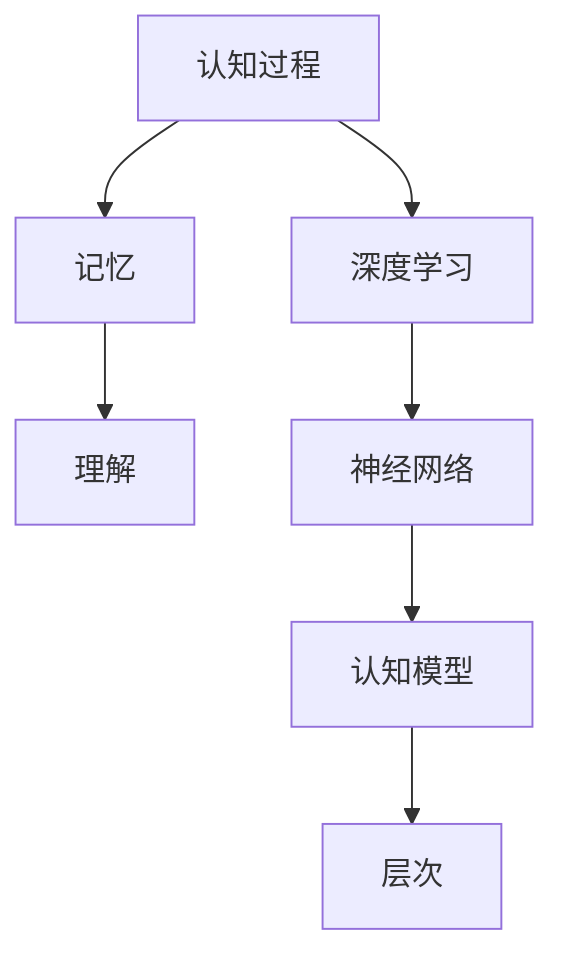

                 

# 理解的层次：从记忆到应用的认知过程

> 关键词：认知过程, 记忆, 应用, 理解, 深度学习, 神经网络, 认知科学

## 1. 背景介绍

### 1.1 问题由来

认知科学是一门研究人类心智和智能本质的交叉学科，涉及心理学、神经科学、人工智能、哲学等领域。其核心在于探索人类如何获取知识、理解世界、作出决策。随着深度学习和神经网络的兴起，认知科学的研究开始越来越多地借鉴计算模型来模拟和解释人类认知过程。

这一转变在很大程度上得益于深度学习模型在视觉、语音、自然语言处理(NLP)等领域的巨大成功。深度神经网络不仅在图像识别、语音合成、文本翻译等方面取得了令人瞩目的成果，也在认知科学中起到了桥梁作用。借助深度学习模型，认知科学研究人员能够更精确地捕捉和模拟人类认知过程中的信息处理机制，进一步推进了对智能本质的理解。

但与此同时，深度学习模型在认知过程建模上仍有其局限性。模型虽能模拟某些认知功能，如视觉、听觉和语言处理，但在理解能力、抽象思维、创造力等方面仍与人类存在显著差距。因此，如何更好地将深度学习与认知科学结合，实现从计算模拟到理论解释的跨越，成为当前认知科学研究的焦点。

### 1.2 问题核心关键点

从计算模拟到理论解释的跨越，关键在于理解认知过程的层次性和动态性。认知科学认为，认知过程分为多个层次，从感觉输入的初级加工，到语义理解的高级抽象，每个层次都有其独特的机制和目的。而深度学习模型，特别是基于神经网络的模型，以其层次化的结构和递归的机制，提供了一种理解认知过程的全新视角。

但如何在模型中明确划分认知层次，并设计相应的网络结构来模拟这些层次，仍然是一个重要而复杂的任务。近年来，认知科学研究人员开始将神经网络和认知科学结合，通过引入认知模型和理论，进一步提升深度学习模型对认知过程的模拟能力。本文将重点探讨这一研究方向，探讨如何通过深度学习模型理解和模拟人类认知过程的不同层次。

## 2. 核心概念与联系

### 2.1 核心概念概述

为更好地理解深度学习模型在认知过程建模中的应用，本节将介绍几个关键概念：

- 认知过程(Cognitive Process)：人类获取、处理和应用信息的心理过程，包括感觉输入、信息存储、语义理解、推理决策等。
- 记忆(Memory)：信息存储、检索和使用的能力，包括短期记忆和长期记忆。
- 理解(Understanding)：对信息的意义和关联进行解释、推理和泛化的能力。
- 深度学习(Deep Learning)：基于神经网络的模型，通过多层非线性变换，实现对复杂数据的高效建模。
- 神经网络(Neural Network)：由大量神经元连接组成的计算模型，通过前向传播和反向传播，学习数据中的模式。
- 认知模型(Cognitive Model)：基于认知科学理论，模拟人类认知过程的计算模型。
- 层次(Hierarchy)：认知过程中不同层次的信息加工方式，从低级的感觉输入到高级的抽象理解。

这些概念共同构成了深度学习模型在认知过程建模中的基础框架，帮助研究者从计算角度理解和模拟人类认知机制。

### 2.2 核心概念原理和架构的 Mermaid 流程图



这个流程图展示了认知过程、记忆、理解、深度学习、神经网络、认知模型和层次之间的关系：

- 认知过程包括记忆和理解两个重要组成部分，其中记忆负责存储和检索信息，理解负责解释和推理信息。
- 深度学习模型，特别是神经网络，通过多层非线性变换，可以模拟从感觉输入到语义理解的全过程。
- 认知模型基于认知科学理论，进一步细化了神经网络的功能，模拟了认知过程的层次性和动态性。

## 3. 核心算法原理 & 具体操作步骤

### 3.1 算法原理概述

基于深度学习模型的认知过程建模，核心在于设计合适的网络结构和训练方法，模拟认知过程的不同层次和动态性。一般而言，可以从以下几个层次来理解和建模认知过程：

1. **感觉输入层**：处理感官输入（如视觉、听觉），提取特征。
2. **编码层**：将感觉输入转换为语义表示，构建语义空间。
3. **语义理解层**：进行语义推理和分类，理解输入的意义和关联。
4. **记忆层**：存储和检索信息，保持长期记忆。
5. **应用层**：根据已有的知识和经验，进行决策和行动。

每个层次都有其独特的计算机制和目标，深度学习模型需要设计相应的网络结构，如卷积神经网络(CNN)用于感觉输入层，循环神经网络(RNN)用于编码和记忆层，以及基于注意力机制的模型用于语义理解层。

### 3.2 算法步骤详解

基于深度学习模型的认知过程建模主要包括以下几个关键步骤：

**Step 1: 数据准备**

- 收集和标注数据集，用于训练和评估模型。
- 数据集应涵盖感觉输入、语义表示、分类和推理等不同层次的信息。

**Step 2: 网络设计**

- 设计合适的网络结构，模拟认知过程的不同层次。
- 网络结构应包括感觉输入层、编码层、语义理解层、记忆层和应用层。
- 每层可以采用不同的神经网络结构，如卷积、循环、注意力等。

**Step 3: 模型训练**

- 使用训练数据集对模型进行有监督或无监督训练。
- 通过反向传播算法更新网络参数，优化损失函数。
- 可以使用正则化技术（如L2正则、Dropout等）防止过拟合。

**Step 4: 模型评估**

- 使用验证集和测试集对模型进行评估。
- 评估指标应涵盖各个层次的性能，如准确率、召回率、F1值等。

**Step 5: 模型应用**

- 将训练好的模型应用于实际场景。
- 模型应在多个层次上对输入进行解释和推理，输出相应的结果。

### 3.3 算法优缺点

基于深度学习模型的认知过程建模具有以下优点：

1. **层次化处理**：通过设计多层网络结构，可以模拟认知过程的层次性和动态性。
2. **高效建模**：深度学习模型能够自动学习数据中的复杂模式，减少人工特征工程的工作量。
3. **泛化能力强**：在足够的数据下，深度学习模型能够适应不同的输入和任务。

但同时，该方法也存在一些局限性：

1. **数据需求高**：深度学习模型需要大量标注数据进行训练，数据获取成本较高。
2. **计算资源需求大**：深度学习模型通常需要高性能计算设备，模型训练和推理资源消耗较大。
3. **解释性不足**：深度学习模型是一个"黑盒"系统，难以解释其内部的决策过程。
4. **可解释性不足**：深度学习模型通常难以解释其内部的决策过程，对于医疗、金融等高风险应用，算法的可解释性和可审计性尤为重要。

尽管存在这些局限性，但就目前而言，基于深度学习模型的认知过程建模仍是最主流的方法之一。未来相关研究需要进一步降低对数据和计算资源的需求，提升模型的可解释性和可审计性，才能在更多应用场景中发挥其潜力。

### 3.4 算法应用领域

基于深度学习模型的认知过程建模，已经在多个领域得到了应用，例如：

- **视觉识别**：通过设计多层卷积神经网络，模拟从图像输入到语义分类的全过程。
- **语音识别**：利用循环神经网络处理时间序列数据，提取音频特征，进行语音识别和分类。
- **自然语言处理**：通过注意力机制和Transformer结构，模拟从文本输入到语义理解的整个过程。
- **机器翻译**：结合神经网络和语言模型，实现高精度的自动翻译。
- **情感分析**：通过多层网络结构，对文本进行情感分类和情感分析。
- **推荐系统**：利用深度学习模型进行用户行为预测和个性化推荐。

这些应用领域展示了深度学习模型在认知过程建模中的广泛潜力，未来还将有更多创新性的应用场景出现。

## 4. 数学模型和公式 & 详细讲解 & 举例说明

### 4.1 数学模型构建

在认知过程建模中，常用的数学模型包括卷积神经网络(CNN)、循环神经网络(RNN)、注意力机制、Transformer等。这里以Transformer模型为例，介绍其数学模型构建。

Transformer模型由编码器(Encoder)和解码器(Decoder)组成，其中编码器用于处理输入序列，解码器用于生成输出序列。设输入序列为 $x = (x_1, x_2, ..., x_T)$，输出序列为 $y = (y_1, y_2, ..., y_T)$。Transformer模型通过自注意力机制(Autoregressive Attention)和位置编码(Positional Encoding)来处理序列数据。

设模型参数为 $\theta$，包括自注意力机制的权重矩阵和位置编码矩阵，则编码器 $E(x)$ 和解码器 $D(y)$ 的数学表达式如下：

$$
E(x) = \text{Encoder}(x, \theta) = \sum_i \text{Attention}(QKV(x_i), \theta)
$$

$$
D(y) = \text{Decoder}(y, \theta) = \sum_i \text{Attention}(QKV(y_i), \theta)
$$

其中，$\text{Attention}(QKV, \theta)$ 为自注意力机制，包括查询矩阵 $Q$、键矩阵 $K$ 和值矩阵 $V$，其计算公式如下：

$$
Q = xW_Q, K = xW_K, V = xW_V
$$

$$
\text{Attention}(QKV, \theta) = \text{Softmax}(QK^T)/\sqrt{d_k} + \text{Softmax}(QK^T)/\sqrt{d_v} + \text{Softmax}(QK^T)/\sqrt{d_v}
$$

### 4.2 公式推导过程

以下是Transformer模型自注意力机制的详细推导过程：

设输入序列 $x = (x_1, x_2, ..., x_T)$，其中 $x_i$ 表示第 $i$ 个单词的向量表示。设自注意力矩阵 $A = QK^T$，其中 $Q = xW_Q$ 为查询矩阵，$K = xW_K$ 为键矩阵，$V = xW_V$ 为值矩阵。

设 $A_{i,j}$ 表示第 $i$ 个单词与第 $j$ 个单词的自注意力权重，则自注意力权重 $A_{i,j}$ 的计算公式如下：

$$
A_{i,j} = \frac{e^{\text{dot}(Q_i, K_j)/\sqrt{d_k}}}{\sum_{k=1}^T e^{\text{dot}(Q_i, K_k)/\sqrt{d_k}}}
$$

其中，$\text{dot}(Q_i, K_j)$ 表示向量点积操作，$d_k$ 为键矩阵的维度。

将自注意力权重 $A_{i,j}$ 应用于值矩阵 $V$，得到自注意力输出向量：

$$
V_{i,j} = V_jA_{i,j}
$$

最终，自注意力机制的输出向量 $V_i$ 为：

$$
V_i = \sum_j V_jA_{i,j}
$$

Transformer模型通过多层自注意力机制和前馈神经网络(Feedforward Network)，实现了对序列数据的深度建模。这种结构设计使得Transformer模型能够在多层次上处理输入数据，模拟认知过程的不同阶段。

### 4.3 案例分析与讲解

以图像分类为例，展示Transformer模型在视觉识别任务中的应用。

设输入图像 $I = (i_1, i_2, ..., i_T)$，其中 $i_i$ 表示像素点的灰度值。设输出类别 $C = (c_1, c_2, ..., c_T)$，其中 $c_i$ 表示图像所属的类别。设模型参数为 $\theta$，包括卷积层和池化层的权重矩阵，以及全连接层的权重矩阵。

设卷积层输出的特征图为 $F = (f_1, f_2, ..., f_T)$，其中 $f_i$ 表示第 $i$ 个像素点的特征向量。设池化层输出的特征图为 $G = (g_1, g_2, ..., g_T)$，其中 $g_i$ 表示池化后的特征向量。设全连接层的输出为 $H = (h_1, h_2, ..., h_T)$，其中 $h_i$ 表示图像属于第 $i$ 个类别的概率。

Transformer模型通过多层卷积神经网络，模拟从图像输入到特征提取的全过程。多层卷积神经网络通过不同大小的卷积核和池化层，对输入图像进行多层次的特征提取和降维，得到高层次的特征表示。

设卷积层输出的特征图为 $F = (f_1, f_2, ..., f_T)$，其中 $f_i$ 表示第 $i$ 个像素点的特征向量。设池化层输出的特征图为 $G = (g_1, g_2, ..., g_T)$，其中 $g_i$ 表示池化后的特征向量。设全连接层的输出为 $H = (h_1, h_2, ..., h_T)$，其中 $h_i$ 表示图像属于第 $i$ 个类别的概率。

Transformer模型通过多层卷积神经网络，模拟从图像输入到特征提取的全过程。多层卷积神经网络通过不同大小的卷积核和池化层，对输入图像进行多层次的特征提取和降维，得到高层次的特征表示。

多层卷积神经网络的输出 $G$ 经过池化层和全连接层，最终输出类别概率 $H$。通过训练集 $D$ 对模型进行监督学习，最小化损失函数 $\mathcal{L}$，得到最优的模型参数 $\theta^*$。

在测试集 $D'$ 上评估模型性能，计算准确率、召回率、F1值等指标，确定模型在图像分类任务上的表现。

通过Transformer模型在视觉识别任务中的应用，可以看到深度学习模型在认知过程建模中的强大能力，能够高效地处理视觉输入，提取高层次的特征表示，并进行语义分类。

## 5. 项目实践：代码实例和详细解释说明

### 5.1 开发环境搭建

在进行认知过程建模的实践前，我们需要准备好开发环境。以下是使用Python进行TensorFlow开发的环境配置流程：

1. 安装Anaconda：从官网下载并安装Anaconda，用于创建独立的Python环境。

2. 创建并激活虚拟环境：
```bash
conda create -n tf-env python=3.8 
conda activate tf-env
```

3. 安装TensorFlow：根据CUDA版本，从官网获取对应的安装命令。例如：
```bash
conda install tensorflow=2.7 cudatoolkit=11.1 -c tf -c conda-forge
```

4. 安装Keras：Keras是一个高级神经网络API，可以方便地进行模型搭建和训练。
```bash
pip install keras
```

5. 安装各类工具包：
```bash
pip install numpy pandas scikit-learn matplotlib tqdm jupyter notebook ipython
```

完成上述步骤后，即可在`tf-env`环境中开始认知过程建模的实践。

### 5.2 源代码详细实现

这里我们以图像分类任务为例，给出使用TensorFlow对图像分类模型进行构建的PyTorch代码实现。

首先，定义图像分类模型的结构：

```python
from tensorflow.keras import layers, models

model = models.Sequential()
model.add(layers.Conv2D(32, (3, 3), activation='relu', input_shape=(64, 64, 3)))
model.add(layers.MaxPooling2D((2, 2)))
model.add(layers.Conv2D(64, (3, 3), activation='relu'))
model.add(layers.MaxPooling2D((2, 2)))
model.add(layers.Conv2D(128, (3, 3), activation='relu'))
model.add(layers.MaxPooling2D((2, 2)))
model.add(layers.Flatten())
model.add(layers.Dense(64, activation='relu'))
model.add(layers.Dense(10, activation='softmax'))
```

然后，定义优化器、损失函数和评估指标：

```python
from tensorflow.keras.optimizers import Adam

optimizer = Adam(lr=0.001)
loss = 'categorical_crossentropy'
metrics = ['accuracy']
```

接着，定义训练和评估函数：

```python
def train_model(model, train_data, validation_data, epochs):
    model.compile(optimizer=optimizer, loss=loss, metrics=metrics)
    model.fit(train_data, validation_data, epochs=epochs)

def evaluate_model(model, test_data):
    test_loss, test_acc = model.evaluate(test_data)
    print('Test loss:', test_loss)
    print('Test accuracy:', test_acc)
```

最后，启动训练流程并在测试集上评估：

```python
epochs = 10
train_model(model, train_data, validation_data, epochs)
evaluate_model(model, test_data)
```

以上就是使用TensorFlow进行图像分类任务认知过程建模的完整代码实现。可以看到，TensorFlow提供了丰富的API，方便开发者构建和训练神经网络模型。

### 5.3 代码解读与分析

让我们再详细解读一下关键代码的实现细节：

**图像分类模型定义**：
- 通过Sequential模型定义多层卷积神经网络，包含卷积层、池化层和全连接层。
- 卷积层采用不同大小的卷积核和激活函数，池化层采用最大池化操作，全连接层采用ReLU激活函数。

**优化器、损失函数和评估指标定义**：
- 使用Adam优化器，设置学习率为0.001。
- 定义损失函数为交叉熵损失，评估指标为准确率。

**训练和评估函数定义**：
- 使用train_model函数对模型进行训练，指定训练数据集、验证数据集和训练轮数。
- 使用evaluate_model函数在测试集上评估模型性能，输出损失和准确率。

**训练流程启动**：
- 定义训练轮数为10，调用train_model函数进行模型训练。
- 调用evaluate_model函数在测试集上评估模型性能。

可以看到，TensorFlow提供了丰富的工具和API，方便开发者进行深度学习模型的构建和训练。在实践中，可以进一步调整网络结构、优化器参数、正则化策略等，以提高模型性能。

当然，工业级的系统实现还需考虑更多因素，如模型保存和部署、超参数的自动搜索、更灵活的任务适配层等。但核心的认知过程建模基本与此类似。

## 6. 实际应用场景

### 6.1 智能医疗诊断

基于深度学习模型的认知过程建模，在智能医疗诊断中有着广泛的应用。医疗领域需要快速、准确地对病情进行诊断，以便及时治疗。传统的医疗诊断依赖于医生经验和手工检测，耗时长且容易出错。基于深度学习模型的认知过程建模，可以模拟医生的诊断过程，实现自动化和智能化诊断。

在实践中，可以收集大量的医学影像和病例数据，通过标注数据集训练模型，使其能够自动识别影像中的病灶和异常，并给出诊断建议。通过微调和改进模型，可以实现对特定疾病的精准诊断，提升医疗服务的效率和质量。

### 6.2 金融风险控制

金融领域需要实时监控市场波动，评估风险，制定投资策略。传统的风险控制依赖于复杂的数学模型和手工分析，难以应对高频交易和高频数据。基于深度学习模型的认知过程建模，可以模拟分析师和交易员的分析过程，实现自动化和智能化的风险控制。

在实践中，可以收集金融市场的数据，通过标注数据集训练模型，使其能够识别市场的趋势和风险，并给出风险预警。通过微调和改进模型，可以实现对市场动态的实时监控，提升金融决策的科学性和精准性。

### 6.3 智能客服

基于深度学习模型的认知过程建模，可以应用于智能客服系统的构建。传统客服往往需要配备大量人力，高峰期响应缓慢，且一致性和专业性难以保证。基于深度学习模型的认知过程建模，可以模拟客服的问答过程，实现自动化和智能化客服。

在实践中，可以收集企业内部的历史客服对话记录，通过标注数据集训练模型，使其能够自动理解客户意图，匹配最合适的答案模板进行回复。对于客户提出的新问题，还可以接入检索系统实时搜索相关内容，动态组织生成回答。通过微调和改进模型，可以实现对客服系统的优化，提升客户咨询体验和问题解决效率。

### 6.4 未来应用展望

随着深度学习模型和认知过程建模的不断发展，认知模型将逐步渗透到更多领域，为各行各业带来变革性影响。

在智慧城市治理中，基于深度学习模型的认知过程建模，可以实现智能交通管理、智能安防、智能家居等应用。通过模拟人类认知过程，优化城市资源配置，提升城市管理水平，构建更安全、高效、舒适的城市环境。

在教育领域，基于深度学习模型的认知过程建模，可以实现个性化学习推荐、智能辅导答疑、情感识别等应用。通过模拟教师的授课过程，个性化设计学习路径，提高学习效率和效果，实现因材施教，促进教育公平。

在工业制造领域，基于深度学习模型的认知过程建模，可以实现智能生产调度、设备维护预测、质量检测等应用。通过模拟工人的操作过程，优化生产流程，提高生产效率，降低生产成本，提升产品质量。

在无人驾驶领域，基于深度学习模型的认知过程建模，可以实现自动驾驶决策、环境感知、路径规划等应用。通过模拟驾驶员的驾驶过程，实现自动驾驶，提高道路安全和交通效率。

总之，基于深度学习模型的认知过程建模，将在更多领域得到应用，为经济社会发展注入新的动力。未来，伴随深度学习模型和认知过程建模的持续演进，认知模型必将在构建人机协同的智能时代中扮演越来越重要的角色。

## 7. 工具和资源推荐

### 7.1 学习资源推荐

为了帮助开发者系统掌握深度学习模型在认知过程建模的理论基础和实践技巧，这里推荐一些优质的学习资源：

1. 《深度学习》书籍：由Ian Goodfellow、Yoshua Bengio和Aaron Courville合著，全面介绍了深度学习的基础理论和实践方法，是深度学习入门的必读之作。

2. CS231n《深度学习视觉识别》课程：斯坦福大学开设的视觉识别课程，涵盖了卷积神经网络、图像分类、物体检测等主题，是视觉识别的经典教材。

3. 《Natural Language Processing with TensorFlow》书籍：TensorFlow官方提供的NLP教程，介绍了如何使用TensorFlow进行自然语言处理，包括文本分类、机器翻译、情感分析等任务。

4. Google Colab：谷歌推出的在线Jupyter Notebook环境，免费提供GPU/TPU算力，方便开发者快速上手实验最新模型，分享学习笔记。

5. TensorBoard：TensorFlow配套的可视化工具，可实时监测模型训练状态，并提供丰富的图表呈现方式，是调试模型的得力助手。

通过对这些资源的学习实践，相信你一定能够快速掌握深度学习模型在认知过程建模的精髓，并用于解决实际的认知问题。

### 7.2 开发工具推荐

高效的开发离不开优秀的工具支持。以下是几款用于深度学习模型认知过程建模开发的常用工具：

1. TensorFlow：由Google主导开发的开源深度学习框架，生产部署方便，适合大规模工程应用。

2. PyTorch：基于Python的开源深度学习框架，灵活动态的计算图，适合快速迭代研究。

3. Keras：一个高级神经网络API，可以方便地进行模型搭建和训练。

4. Weights & Biases：模型训练的实验跟踪工具，可以记录和可视化模型训练过程中的各项指标，方便对比和调优。

5. Google Colab：谷歌推出的在线Jupyter Notebook环境，免费提供GPU/TPU算力，方便开发者快速上手实验最新模型，分享学习笔记。

6. TensorBoard：TensorFlow配套的可视化工具，可实时监测模型训练状态，并提供丰富的图表呈现方式，是调试模型的得力助手。

合理利用这些工具，可以显著提升深度学习模型认知过程建模的开发效率，加快创新迭代的步伐。

### 7.3 相关论文推荐

深度学习模型在认知过程建模上的研究源于学界的持续研究。以下是几篇奠基性的相关论文，推荐阅读：

1. "Understanding Deep Neural Networks: An Overview" by Yann LeCun et al.：综述了深度神经网络的理论基础和实践方法，是深度学习研究的基础之作。

2. "ImageNet Classification with Deep Convolutional Neural Networks" by Alex Krizhevsky et al.：展示了卷积神经网络在图像分类任务上的强大能力，是计算机视觉领域的经典论文。

3. "Attention Is All You Need" by Ashish Vaswani et al.：提出了Transformer结构，开启了自然语言处理领域的预训练大模型时代。

4. "Towards Explainable Deep Learning" by Judea Pearl et al.：探讨了深度学习模型的可解释性问题，提出了多种方法来提升模型的可解释性。

5. "Hierarchical Attention Networks for Document Classification" by Kevin Xu et al.：提出了一种层次化的注意力网络，用于文本分类和情感分析任务，展示了深度学习模型在认知过程建模中的强大能力。

这些论文代表了大语言模型微调技术的发展脉络。通过学习这些前沿成果，可以帮助研究者把握学科前进方向，激发更多的创新灵感。

## 8. 总结：未来发展趋势与挑战

### 8.1 总结

本文对深度学习模型在认知过程建模中的应用进行了全面系统的介绍。首先阐述了认知过程建模的研究背景和意义，明确了深度学习模型在模拟人类认知过程中的作用。其次，从原理到实践，详细讲解了深度学习模型的数学模型构建、公式推导过程和关键步骤，给出了模型构建的完整代码实例。同时，本文还广泛探讨了深度学习模型在智能医疗、金融风险控制、智能客服等众多领域的应用前景，展示了深度学习模型在认知过程建模中的广泛潜力。

通过本文的系统梳理，可以看到，深度学习模型在认知过程建模中的强大能力，能够高效地处理各种输入数据，提取高层次的特征表示，并进行语义分类。未来，伴随深度学习模型和认知过程建模的持续演进，认知模型必将在构建人机协同的智能时代中扮演越来越重要的角色。

### 8.2 未来发展趋势

展望未来，深度学习模型在认知过程建模上将呈现以下几个发展趋势：

1. 模型规模持续增大。随着算力成本的下降和数据规模的扩张，深度学习模型的参数量还将持续增长。超大批次的训练和推理也可能遇到资源瓶颈，需要采用混合精度训练、模型并行等技术进行优化。

2. 认知过程的多层次建模。未来模型将进一步细化认知过程的层次，如引入时间序列建模、多模态信息融合等技术，实现更加复杂和精细的认知建模。

3. 可解释性和可审计性。深度学习模型作为一个"黑盒"系统，难以解释其内部的决策过程，未来的模型将更加注重可解释性和可审计性，提升模型的透明性和可信度。

4. 跨领域和跨模态的认知建模。未来模型将更加注重跨领域和跨模态的信息整合，如结合视觉、语音、文本等多种模态数据，实现更加全面的认知建模。

5. 鲁棒性和泛化性。未来模型将更加注重鲁棒性和泛化性，提高模型对不同输入和任务的适应能力，避免过拟合和灾难性遗忘。

6. 实时性和效率。未来模型将更加注重实时性和效率，通过硬件优化、模型压缩等技术，实现更加高效和快速的推理计算。

这些趋势凸显了深度学习模型在认知过程建模中的广阔前景。这些方向的探索发展，必将进一步提升深度学习模型在认知过程中的模拟能力，为构建更加智能化、普适化的应用提供新的技术支持。

### 8.3 面临的挑战

尽管深度学习模型在认知过程建模上取得了巨大成功，但在迈向更加智能化、普适化应用的过程中，仍面临诸多挑战：

1. 数据获取和标注成本高。深度学习模型需要大量标注数据进行训练，数据获取和标注成本较高。

2. 计算资源需求大。深度学习模型通常需要高性能计算设备，模型训练和推理资源消耗较大。

3. 解释性不足。深度学习模型作为一个"黑盒"系统，难以解释其内部的决策过程，对于医疗、金融等高风险应用，算法的可解释性和可审计性尤为重要。

4. 知识整合能力不足。现有的深度学习模型往往局限于输入数据，难以灵活吸收和运用更广泛的先验知识。

5. 鲁棒性不足。深度学习模型面对域外数据时，泛化性能往往大打折扣。对于测试样本的微小扰动，模型预测也容易发生波动。

6. 效率有待提高。深度学习模型推理效率低下，难以满足实时应用的需求。

尽管存在这些挑战，但深度学习模型在认知过程建模中的应用前景广阔，研究者们仍需积极应对并寻求突破，才能在更多应用场景中发挥其潜力。

### 8.4 研究展望

未来，深度学习模型在认知过程建模中的应用将继续深入发展，需要从以下几个方面进行研究：

1. 无监督学习和自监督学习。进一步降低对标注数据的需求，利用自监督学习、主动学习等无监督方法，提高模型泛化能力和鲁棒性。

2. 多模态信息融合。结合视觉、语音、文本等多种模态数据，实现更加全面的认知建模，提升模型的综合表现。

3. 知识整合与迁移。将符号化的先验知识与神经网络模型进行融合，引导模型学习更准确、合理的语言模型，增强模型的泛化能力。

4. 解释性和可审计性。开发更加可解释的深度学习模型，提升模型的透明性和可信度，确保模型在医疗、金融等高风险领域的安全应用。

5. 实时性和效率。采用混合精度训练、模型压缩、分布式训练等技术，提高模型的实时性和推理效率，满足实时应用的需求。

6. 跨领域应用。将深度学习模型应用于更多领域，如智慧医疗、金融风险控制、智能客服等，提升各行业智能化水平，推动经济社会发展。

这些研究方向将进一步拓展深度学习模型在认知过程中的应用范围，为构建更加智能化、普适化的应用提供新的技术支持。

## 9. 附录：常见问题与解答

**Q1: 深度学习模型如何模拟人类认知过程？**

A: 深度学习模型通过设计多层神经网络，模拟人类认知过程的层次化和递归性。感觉输入层通过卷积和池化操作，提取输入数据的高层次特征表示。编码层通过多层前馈神经网络，进行语义表示的构建和理解。记忆层通过循环神经网络，实现信息存储和检索。应用层通过全连接神经网络，进行决策和行动。通过这些层次化的处理，深度学习模型可以模拟人类认知过程的不同阶段，实现对复杂输入数据的深度建模。

**Q2: 深度学习模型在认知过程建模中存在哪些局限性？**

A: 深度学习模型在认知过程建模中存在以下局限性：
1. 数据需求高：深度学习模型需要大量标注数据进行训练，数据获取和标注成本较高。
2. 计算资源需求大：深度学习模型通常需要高性能计算设备，模型训练和推理资源消耗较大。
3. 解释性不足：深度学习模型作为一个"黑盒"系统，难以解释其内部的决策过程，对于医疗、金融等高风险应用，算法的可解释性和可审计性尤为重要。
4. 知识整合能力不足：现有的深度学习模型往往局限于输入数据，难以灵活吸收和运用更广泛的先验知识。
5. 鲁棒性不足：深度学习模型面对域外数据时，泛化性能往往大打折扣。对于测试样本的微小扰动，模型预测也容易发生波动。

**Q3: 未来深度学习模型在认知过程建模中如何突破局限性？**

A: 未来深度学习模型在认知过程建模中可以通过以下方式突破局限性：
1. 无监督学习和自监督学习：进一步降低对标注数据的需求，利用自监督学习、主动学习等无监督方法，提高模型泛化能力和鲁棒性。
2. 多模态信息融合：结合视觉、语音、文本等多种模态数据，实现更加全面的认知建模，提升模型的综合表现。
3. 知识整合与迁移：将符号化的先验知识与神经网络模型进行融合，引导模型学习更准确、合理的语言模型，增强模型的泛化能力。
4. 解释性和可审计性：开发更加可解释的深度学习模型，提升模型的透明性和可信度，确保模型在医疗、金融等高风险领域的安全应用。
5. 实时性和效率：采用混合精度训练、模型压缩、分布式训练等技术，提高模型的实时性和推理效率，满足实时应用的需求。
6. 跨领域应用：将深度学习模型应用于更多领域，如智慧医疗、金融风险控制、智能客服等，提升各行业智能化水平，推动经济社会发展。

这些研究方向将进一步拓展深度学习模型在认知过程中的应用范围，为构建更加智能化、普适化的应用提供新的技术支持。

---

作者：禅与计算机程序设计艺术 / Zen and the Art of Computer Programming

