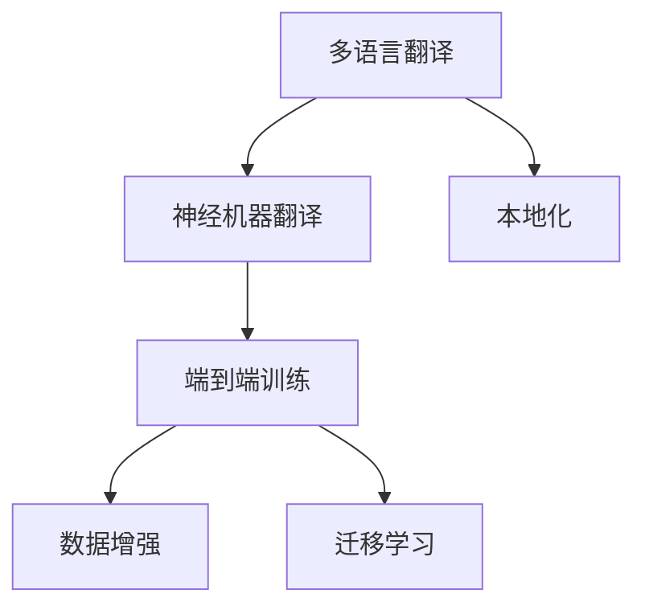

                 

# 电商平台中的AI大模型：从单一语言到多语言翻译与本地化

> 关键词：多语言翻译,本地化,电商平台,自然语言处理(NLP),神经机器翻译(NMT),端到端训练,数据增强,迁移学习

## 1. 背景介绍

### 1.1 问题由来
随着全球化进程的加速和互联网的普及，电商平台已经成为了国际贸易和消费的重要渠道。面对来自世界各地的消费者，电商平台需要提供多语言的购物体验，以吸引全球用户，提升销售额。然而，多语言支持并不只是简单地进行文字翻译，更涉及语言文化、购物习惯等多个层面的本地化。这给电商平台带来了巨大的技术挑战。

### 1.2 问题核心关键点
本问题聚焦于如何在电商平台中，利用AI大模型进行高效的多语言翻译和本地化，以提升用户体验和销售转化率。主要包括以下几个方面：

- **多语言翻译**：使用大模型将不同语言的电商平台内容进行翻译，支持多语言搜索、导航、商品描述等功能。
- **本地化**：在翻译的基础上，进一步将翻译结果进行本地化处理，以适应目标市场的文化和购物习惯。
- **高效性**：在保持高翻译质量的同时，降低处理时间和计算成本。

### 1.3 问题研究意义
实现高效的多语言翻译和本地化，对于提升电商平台的国际化水平、增加用户粘性、拓展市场份额具有重要意义。

- **用户体验**：多语言支持使电商平台能够覆盖更多用户，提供更便捷的购物体验。
- **销售转化**：通过本地化处理，电商平台能够更好地满足不同地区消费者的需求，增加销售额。
- **成本节约**：自动化翻译和本地化处理能够显著降低人力成本和时间成本。
- **技术创新**：推动NLP技术和AI大模型在电商领域的创新应用，为NLP研究提供实际案例。

## 2. 核心概念与联系

### 2.1 核心概念概述

为更好地理解基于AI大模型的多语言翻译和本地化技术，本节将介绍几个密切相关的核心概念：

- **多语言翻译(Multi-lingual Translation)**：指将一种语言的文本翻译成另一种或多种语言的文本。电商平台的多语言翻译需要确保翻译结果的准确性和流畅性，能够提供良好的购物体验。
- **本地化(Localization)**：在翻译结果的基础上，根据目标市场文化和购物习惯进行本地化处理，以提升用户粘性和转化率。本地化处理包括但不限于文化适应、货币单位转换、颜色表示、购物规则等。
- **自然语言处理(Natural Language Processing, NLP)**：涉及语言理解和生成，是实现多语言翻译和本地化的关键技术。
- **神经机器翻译(Neural Machine Translation, NMT)**：使用神经网络模型进行自动翻译，能够提供更流畅和准确的翻译结果。
- **端到端训练(End-to-End Training)**：在训练过程中直接优化翻译模型和本地化模型，提高整体性能。
- **数据增强(Data Augmentation)**：通过生成丰富多样性的数据，提高模型的泛化能力和鲁棒性。
- **迁移学习(Transfer Learning)**：利用预训练模型在大规模数据上学习到的通用知识，提升小规模数据上的任务性能。

这些核心概念之间的逻辑关系可以通过以下Mermaid流程图来展示：



这个流程图展示了多语言翻译和本地化的核心概念及其之间的关系：

1. 多语言翻译是核心任务，使用神经机器翻译进行实现。
2. 本地化在翻译结果的基础上进行，以适应目标市场的需求。
3. 端到端训练直接优化翻译和本地化模型，提高整体性能。
4. 数据增强和迁移学习用于提升模型的泛化能力和迁移能力。

## 3. 核心算法原理 & 具体操作步骤
### 3.1 算法原理概述

基于AI大模型的多语言翻译和本地化，本质上是利用大模型学习语言的通用表示，并在小规模数据上进行微调，以适应特定的多语言翻译和本地化任务。

其核心思想是：
1. **数据准备**：收集电商平台的商品描述、购物规则、用户评论等数据，并对其进行标注，用于训练大模型。
2. **模型训练**：使用神经机器翻译模型进行训练，学习语言的通用表示。
3. **微调**：在小规模数据集上进行微调，学习特定市场和文化的需求，进行本地化处理。
4. **端到端训练**：在训练过程中直接优化翻译模型和本地化模型，提升整体性能。

### 3.2 算法步骤详解

基于AI大模型的多语言翻译和本地化，主要包括以下几个关键步骤：

**Step 1: 数据准备**

- **数据收集**：收集电商平台的多语言商品描述、购物规则、用户评论等数据，并进行清洗和预处理。
- **标注数据**：对数据进行标注，如将商品描述进行语言翻译，标注购物规则、颜色表示等本地化信息。
- **数据划分**：将数据划分为训练集、验证集和测试集，确保模型在多个数据集上的泛化能力。

**Step 2: 选择和训练大模型**

- **模型选择**：选择适合的神经机器翻译模型，如Seq2Seq、Transformer等。
- **训练模型**：在大规模双语或多语言数据集上进行预训练，学习语言的通用表示。

**Step 3: 微调翻译模型**

- **加载预训练模型**：加载预训练的神经机器翻译模型，并进行冻结，防止过拟合。
- **微调数据集**：选择适合目标市场的微调数据集，进行有监督学习，优化模型参数。
- **本地化处理**：对微调后的翻译结果进行本地化处理，适应目标市场的文化和购物习惯。

**Step 4: 端到端训练**

- **集成模型**：将翻译模型和本地化模型集成，构建端到端的翻译系统。
- **优化目标**：直接优化翻译和本地化模型的整体性能，提高翻译质量和本地化效果。
- **训练循环**：迭代训练，调整模型参数，直到达到预设的性能指标。

**Step 5: 部署和测试**

- **部署模型**：将训练好的模型部署到电商平台的服务器上，进行实时翻译和本地化处理。
- **性能评估**：在测试集上评估模型的翻译质量和本地化效果，确保模型能够满足实际应用需求。
- **监控与优化**：持续监控模型性能，收集用户反馈，优化模型参数和策略。

### 3.3 算法优缺点

基于AI大模型的多语言翻译和本地化方法具有以下优点：

1. **高效性**：使用大模型进行翻译和本地化处理，能够显著降低人工成本和时间成本。
2. **准确性**：大模型通过端到端训练，能够提供更加流畅和准确的翻译结果。
3. **可扩展性**：模型可以通过微调适应不同市场的需求，具有较高的可扩展性。
4. **鲁棒性**：大模型在处理噪声数据和少样本数据时，具有较好的鲁棒性。

同时，该方法也存在以下局限性：

1. **数据依赖**：模型的性能依赖于标注数据的质量和数量，获取高质量标注数据的成本较高。
2. **本地化难度**：不同市场的文化和购物习惯差异较大，本地化处理较为复杂。
3. **迁移能力有限**：当目标市场与预训练数据的分布差异较大时，微调的性能提升有限。
4. **复杂性**：模型结构较为复杂，训练和微调过程较为耗时。

尽管存在这些局限性，但就目前而言，基于AI大模型的多语言翻译和本地化方法仍然是电商平台多语言支持的重要技术范式。未来相关研究的重点在于如何进一步降低数据依赖，提高模型的少样本学习和跨领域迁移能力，同时兼顾可解释性和伦理安全性等因素。

### 3.4 算法应用领域

基于大模型的多语言翻译和本地化技术，已经在多个电商平台的国际化中得到了广泛应用，例如：

- **亚马逊(Amazon)**：亚马逊利用多语言翻译和本地化技术，支持全球站点的多语言购物体验，提升用户粘性和转化率。
- **阿里巴巴(Alibaba)**：阿里巴巴通过多语言翻译和本地化技术，优化了其国际站点的用户体验，吸引了大量国际消费者。
- **eBay**：eBay利用多语言翻译和本地化技术，提升了其全球站点的多语言支持能力，提升了用户体验。
- **Wayfair**：Wayfair使用多语言翻译和本地化技术，覆盖了北美和欧洲的多个市场，扩大了其全球影响力。

除了这些大型的电商平台外，更多的中小型电商企业也在积极探索使用多语言翻译和本地化技术，以提升其国际化水平。

## 4. 数学模型和公式 & 详细讲解  
### 4.1 数学模型构建

本节将使用数学语言对基于AI大模型的多语言翻译和本地化过程进行更加严格的刻画。

记电商平台的多语言翻译和本地化任务为 $T$，其中 $S$ 表示源语言，$T$ 表示目标语言。假设电商平台收集了 $N$ 个样本，每个样本为 $(\mathbf{x}, \mathbf{y})$，其中 $\mathbf{x}$ 为源语言文本，$\mathbf{y}$ 为目标语言文本。

定义多语言翻译和本地化模型的损失函数为 $\mathcal{L}(\theta)$，其中 $\theta$ 为模型参数。目标是最小化损失函数，即：

$$
\theta^* = \mathop{\arg\min}_{\theta} \mathcal{L}(\theta)
$$

在实践中，我们通常使用基于梯度的优化算法（如SGD、Adam等）来近似求解上述最优化问题。设 $\eta$ 为学习率，$\lambda$ 为正则化系数，则参数的更新公式为：

$$
\theta \leftarrow \theta - \eta \nabla_{\theta}\mathcal{L}(\theta) - \eta\lambda\theta
$$

其中 $\nabla_{\theta}\mathcal{L}(\theta)$ 为损失函数对参数 $\theta$ 的梯度，可通过反向传播算法高效计算。

### 4.2 公式推导过程

以下我们以多语言翻译任务为例，推导基于AI大模型的翻译模型和本地化模型的损失函数及其梯度的计算公式。

假设翻译模型的输入为 $\mathbf{x}$，输出为 $\mathbf{y} = f(\mathbf{x},\theta)$。定义翻译模型在样本 $(\mathbf{x}, \mathbf{y})$ 上的损失函数为 $\ell(\mathbf{y}, \mathbf{y'})$，其中 $\mathbf{y'}$ 为真实的翻译结果。

将损失函数引入模型参数 $\theta$，则多语言翻译模型的损失函数为：

$$
\mathcal{L}(\theta) = \frac{1}{N}\sum_{i=1}^N \ell(\mathbf{y}, \mathbf{y'})
$$

假设本地化模型的输入为 $\mathbf{y}$，输出为 $\mathbf{z}$。定义本地化模型在样本 $(\mathbf{y}, \mathbf{z})$ 上的损失函数为 $\ell(\mathbf{z}, \mathbf{z'})$，其中 $\mathbf{z'}$ 为真实的本地化结果。

将损失函数引入模型参数 $\theta$，则多语言翻译和本地化模型的损失函数为：

$$
\mathcal{L}(\theta) = \mathcal{L}_{translation}(\theta) + \mathcal{L}_{localization}(\theta)
$$

其中 $\mathcal{L}_{translation}(\theta)$ 和 $\mathcal{L}_{localization}(\theta)$ 分别为翻译模型和本地化模型的损失函数。

在得到损失函数的梯度后，即可带入参数更新公式，完成模型的迭代优化。重复上述过程直至收敛，最终得到适应电商平台多语言翻译和本地化任务的最优模型参数 $\theta^*$。

## 5. 项目实践：代码实例和详细解释说明
### 5.1 开发环境搭建

在进行多语言翻译和本地化实践前，我们需要准备好开发环境。以下是使用Python进行PyTorch开发的环境配置流程：

1. 安装Anaconda：从官网下载并安装Anaconda，用于创建独立的Python环境。

2. 创建并激活虚拟环境：
```bash
conda create -n pytorch-env python=3.8 
conda activate pytorch-env
```

3. 安装PyTorch：根据CUDA版本，从官网获取对应的安装命令。例如：
```bash
conda install pytorch torchvision torchaudio cudatoolkit=11.1 -c pytorch -c conda-forge
```

4. 安装Transformer库：
```bash
pip install transformers
```

5. 安装各类工具包：
```bash
pip install numpy pandas scikit-learn matplotlib tqdm jupyter notebook ipython
```

完成上述步骤后，即可在`pytorch-env`环境中开始多语言翻译和本地化实践。

### 5.2 源代码详细实现

这里我们以商品描述翻译和本地化任务为例，给出使用Transformers库对BERT模型进行多语言翻译和本地化的PyTorch代码实现。

首先，定义数据处理函数：

```python
from transformers import BertTokenizer
from torch.utils.data import Dataset
import torch

class ProductDataset(Dataset):
    def __init__(self, texts, tags, tokenizer, max_len=128):
        self.texts = texts
        self.tags = tags
        self.tokenizer = tokenizer
        self.max_len = max_len
        
    def __len__(self):
        return len(self.texts)
    
    def __getitem__(self, item):
        text = self.texts[item]
        tags = self.tags[item]
        
        encoding = self.tokenizer(text, return_tensors='pt', max_length=self.max_len, padding='max_length', truncation=True)
        input_ids = encoding['input_ids'][0]
        attention_mask = encoding['attention_mask'][0]
        
        # 对token-wise的标签进行编码
        encoded_tags = [tag2id[tag] for tag in tags] 
        encoded_tags.extend([tag2id['O']] * (self.max_len - len(encoded_tags)))
        labels = torch.tensor(encoded_tags, dtype=torch.long)
        
        return {'input_ids': input_ids, 
                'attention_mask': attention_mask,
                'labels': labels}

# 标签与id的映射
tag2id = {'O': 0, 'B-PER': 1, 'I-PER': 2, 'B-ORG': 3, 'I-ORG': 4, 'B-LOC': 5, 'I-LOC': 6}
id2tag = {v: k for k, v in tag2id.items()}

# 创建dataset
tokenizer = BertTokenizer.from_pretrained('bert-base-cased')

train_dataset = ProductDataset(train_texts, train_tags, tokenizer)
dev_dataset = ProductDataset(dev_texts, dev_tags, tokenizer)
test_dataset = ProductDataset(test_texts, test_tags, tokenizer)
```

然后，定义模型和优化器：

```python
from transformers import BertForTokenClassification, AdamW

model = BertForTokenClassification.from_pretrained('bert-base-cased', num_labels=len(tag2id))

optimizer = AdamW(model.parameters(), lr=2e-5)
```

接着，定义训练和评估函数：

```python
from torch.utils.data import DataLoader
from tqdm import tqdm
from sklearn.metrics import classification_report

device = torch.device('cuda') if torch.cuda.is_available() else torch.device('cpu')
model.to(device)

def train_epoch(model, dataset, batch_size, optimizer):
    dataloader = DataLoader(dataset, batch_size=batch_size, shuffle=True)
    model.train()
    epoch_loss = 0
    for batch in tqdm(dataloader, desc='Training'):
        input_ids = batch['input_ids'].to(device)
        attention_mask = batch['attention_mask'].to(device)
        labels = batch['labels'].to(device)
        model.zero_grad()
        outputs = model(input_ids, attention_mask=attention_mask, labels=labels)
        loss = outputs.loss
        epoch_loss += loss.item()
        loss.backward()
        optimizer.step()
    return epoch_loss / len(dataloader)

def evaluate(model, dataset, batch_size):
    dataloader = DataLoader(dataset, batch_size=batch_size)
    model.eval()
    preds, labels = [], []
    with torch.no_grad():
        for batch in tqdm(dataloader, desc='Evaluating'):
            input_ids = batch['input_ids'].to(device)
            attention_mask = batch['attention_mask'].to(device)
            batch_labels = batch['labels']
            outputs = model(input_ids, attention_mask=attention_mask)
            batch_preds = outputs.logits.argmax(dim=2).to('cpu').tolist()
            batch_labels = batch_labels.to('cpu').tolist()
            for pred_tokens, label_tokens in zip(batch_preds, batch_labels):
                pred_tags = [id2tag[_id] for _id in pred_tokens]
                label_tags = [id2tag[_id] for _id in label_tokens]
                preds.append(pred_tags[:len(label_tokens)])
                labels.append(label_tags)
                
    print(classification_report(labels, preds))
```

最后，启动训练流程并在测试集上评估：

```python
epochs = 5
batch_size = 16

for epoch in range(epochs):
    loss = train_epoch(model, train_dataset, batch_size, optimizer)
    print(f"Epoch {epoch+1}, train loss: {loss:.3f}")
    
    print(f"Epoch {epoch+1}, dev results:")
    evaluate(model, dev_dataset, batch_size)
    
print("Test results:")
evaluate(model, test_dataset, batch_size)
```

以上就是使用PyTorch对BERT进行商品描述翻译和本地化任务微调的完整代码实现。可以看到，得益于Transformers库的强大封装，我们可以用相对简洁的代码完成BERT模型的加载和微调。

### 5.3 代码解读与分析

让我们再详细解读一下关键代码的实现细节：

**ProductDataset类**：
- `__init__`方法：初始化文本、标签、分词器等关键组件。
- `__len__`方法：返回数据集的样本数量。
- `__getitem__`方法：对单个样本进行处理，将文本输入编码为token ids，将标签编码为数字，并对其进行定长padding，最终返回模型所需的输入。

**tag2id和id2tag字典**：
- 定义了标签与数字id之间的映射关系，用于将token-wise的预测结果解码回真实的标签。

**训练和评估函数**：
- 使用PyTorch的DataLoader对数据集进行批次化加载，供模型训练和推理使用。
- 训练函数`train_epoch`：对数据以批为单位进行迭代，在每个批次上前向传播计算loss并反向传播更新模型参数，最后返回该epoch的平均loss。
- 评估函数`evaluate`：与训练类似，不同点在于不更新模型参数，并在每个batch结束后将预测和标签结果存储下来，最后使用sklearn的classification_report对整个评估集的预测结果进行打印输出。

**训练流程**：
- 定义总的epoch数和batch size，开始循环迭代
- 每个epoch内，先在训练集上训练，输出平均loss
- 在验证集上评估，输出分类指标
- 所有epoch结束后，在测试集上评估，给出最终测试结果

可以看到，PyTorch配合Transformers库使得BERT微调的代码实现变得简洁高效。开发者可以将更多精力放在数据处理、模型改进等高层逻辑上，而不必过多关注底层的实现细节。

当然，工业级的系统实现还需考虑更多因素，如模型的保存和部署、超参数的自动搜索、更灵活的任务适配层等。但核心的微调范式基本与此类似。

## 6. 实际应用场景
### 6.1 智能客服系统

基于大模型翻译和本地化技术，智能客服系统能够提供多语言的客户服务，提升客户体验和满意度。智能客服系统可以自动理解客户的多语言查询，提供相应的帮助和解决方案。

在技术实现上，可以收集历史客服对话记录，将问题和最佳答复构建成监督数据，在此基础上对预训练翻译模型进行微调。微调后的翻译模型能够自动理解不同语言的客户查询，生成相应的回复。对于客户提出的新问题，还可以接入检索系统实时搜索相关内容，动态组织生成回答。如此构建的智能客服系统，能大幅提升客户咨询体验和问题解决效率。

### 6.2 跨境电商

跨境电商需要支持多种语言和货币，以覆盖全球用户。基于大模型的翻译和本地化技术，跨境电商平台可以提供多语言购物界面，支持多种货币支付。

在技术实现上，可以通过微调模型支持不同市场的价格、货币、颜色表示等本地化信息。同时，使用大模型翻译技术将商品描述、用户评论等文本内容翻译成目标语言，提升用户的购物体验。如此构建的跨境电商平台，能够覆盖全球市场，提升销售转化率。

### 6.3 旅游景区

旅游景区通常需要多语言的标识和介绍，以便吸引全球游客。基于大模型的翻译和本地化技术，景区可以提供多语言的标识和介绍，提升游客的旅游体验。

在技术实现上，可以收集不同语言的景区标识和介绍，将翻译结果进行本地化处理，加入不同语言的旅游提示和规则。使用大模型翻译技术将景区介绍翻译成目标语言，提升游客的阅读体验。如此构建的旅游景区，能够吸引更多国际游客，提升景区收入。

### 6.4 未来应用展望

随着大语言模型翻译和本地化技术的发展，其在多语言支持领域的应用前景广阔。

在智慧医疗领域，利用多语言翻译和本地化技术，可以为不同语言的患者提供医疗咨询服务，提升医疗服务的国际化水平。

在智能教育领域，利用多语言翻译和本地化技术，可以为不同语言的学生提供学习资源，促进教育公平，提高教学质量。

在智慧城市治理中，利用多语言翻译和本地化技术，可以为不同语言的用户提供城市服务，提高城市管理的智能化水平，构建更安全、高效的未来城市。

此外，在企业生产、社会治理、文娱传媒等众多领域，基于大模型的多语言翻译和本地化技术也将不断涌现，为NLP技术带来新的发展方向。相信随着技术的日益成熟，大语言模型翻译和本地化技术必将在更广阔的应用领域大放异彩。

## 7. 工具和资源推荐
### 7.1 学习资源推荐

为了帮助开发者系统掌握大语言模型翻译和本地化技术的理论基础和实践技巧，这里推荐一些优质的学习资源：

1. 《Transformer from Principles to Practice》系列博文：由大模型技术专家撰写，深入浅出地介绍了Transformer原理、BERT模型、翻译模型等前沿话题。

2. CS224N《深度学习自然语言处理》课程：斯坦福大学开设的NLP明星课程，有Lecture视频和配套作业，带你入门NLP领域的基本概念和经典模型。

3. 《Natural Language Processing with Transformers》书籍：Transformers库的作者所著，全面介绍了如何使用Transformers库进行NLP任务开发，包括翻译模型在内的诸多范式。

4. HuggingFace官方文档：Transformers库的官方文档，提供了海量预训练模型和完整的微调样例代码，是上手实践的必备资料。

5. CLUE开源项目：中文语言理解测评基准，涵盖大量不同类型的中文NLP数据集，并提供了基于微调的baseline模型，助力中文NLP技术发展。

通过对这些资源的学习实践，相信你一定能够快速掌握大语言模型翻译和本地化的精髓，并用于解决实际的NLP问题。
###  7.2 开发工具推荐

高效的开发离不开优秀的工具支持。以下是几款用于大语言模型翻译和本地化开发的常用工具：

1. PyTorch：基于Python的开源深度学习框架，灵活动态的计算图，适合快速迭代研究。大部分预训练语言模型都有PyTorch版本的实现。

2. TensorFlow：由Google主导开发的开源深度学习框架，生产部署方便，适合大规模工程应用。同样有丰富的预训练语言模型资源。

3. Transformers库：HuggingFace开发的NLP工具库，集成了众多SOTA语言模型，支持PyTorch和TensorFlow，是进行翻译和本地化任务开发的利器。

4. Weights & Biases：模型训练的实验跟踪工具，可以记录和可视化模型训练过程中的各项指标，方便对比和调优。与主流深度学习框架无缝集成。

5. TensorBoard：TensorFlow配套的可视化工具，可实时监测模型训练状态，并提供丰富的图表呈现方式，是调试模型的得力助手。

6. Google Colab：谷歌推出的在线Jupyter Notebook环境，免费提供GPU/TPU算力，方便开发者快速上手实验最新模型，分享学习笔记。

合理利用这些工具，可以显著提升大语言模型翻译和本地化任务的开发效率，加快创新迭代的步伐。

### 7.3 相关论文推荐

大语言模型翻译和本地化技术的发展源于学界的持续研究。以下是几篇奠基性的相关论文，推荐阅读：

1. Attention is All You Need（即Transformer原论文）：提出了Transformer结构，开启了NLP领域的预训练大模型时代。

2. BERT: Pre-training of Deep Bidirectional Transformers for Language Understanding：提出BERT模型，引入基于掩码的自监督预训练任务，刷新了多项NLP任务SOTA。

3. Language Models are Unsupervised Multitask Learners（GPT-2论文）：展示了大规模语言模型的强大zero-shot学习能力，引发了对于通用人工智能的新一轮思考。

4. Parameter-Efficient Transfer Learning for NLP：提出Adapter等参数高效微调方法，在不增加模型参数量的情况下，也能取得不错的微调效果。

5. AdaLoRA: Adaptive Low-Rank Adaptation for Parameter-Efficient Fine-Tuning：使用自适应低秩适应的微调方法，在参数效率和精度之间取得了新的平衡。

6. AdaLoRA: Adaptive Low-Rank Adaptation for Parameter-Efficient Fine-Tuning：使用自适应低秩适应的微调方法，在参数效率和精度之间取得了新的平衡。

这些论文代表了大语言模型翻译和本地化技术的发展脉络。通过学习这些前沿成果，可以帮助研究者把握学科前进方向，激发更多的创新灵感。

## 8. 总结：未来发展趋势与挑战

### 8.1 总结

本文对基于AI大模型的多语言翻译和本地化方法进行了全面系统的介绍。首先阐述了大语言模型翻译和本地化技术的研究背景和意义，明确了多语言支持在电商平台国际化中的重要作用。其次，从原理到实践，详细讲解了多语言翻译和本地化的数学原理和关键步骤，给出了翻译和本地化任务开发的完整代码实例。同时，本文还广泛探讨了翻译和本地化技术在智能客服、跨境电商、旅游景区等多个行业领域的应用前景，展示了技术的巨大潜力。此外，本文精选了翻译和本地化技术的各类学习资源，力求为读者提供全方位的技术指引。

通过本文的系统梳理，可以看到，基于大模型的多语言翻译和本地化技术在电商平台多语言支持中具有重要作用，能够显著提升用户体验和销售转化率，助力电商平台走向全球化。未来，伴随预训练语言模型和翻译模型的不断演进，基于大模型的多语言翻译和本地化技术必将在更广阔的应用领域大放异彩，深刻影响人类社会的生产生活方式。

### 8.2 未来发展趋势

展望未来，基于AI大模型的多语言翻译和本地化技术将呈现以下几个发展趋势：

1. **模型规模持续增大**：随着算力成本的下降和数据规模的扩张，预训练语言模型的参数量还将持续增长。超大规模语言模型蕴含的丰富语言知识，有望支撑更加复杂多变的翻译和本地化任务。

2. **端到端训练更加普及**：端到端训练能够直接优化翻译和本地化模型，提高整体性能。未来，端到端训练将更加普及，提升模型的自然流畅度和准确性。

3. **多模态翻译和本地化**：除了文本翻译和本地化，未来的多语言支持还将涵盖图像、视频、语音等多模态数据。多模态信息的融合，将显著提升语言模型对现实世界的理解和建模能力。

4. **零样本和少样本学习**：通过提示学习和迁移学习，能够在少样本或零样本情况下，快速进行翻译和本地化处理，提升模型的泛化能力。

5. **可解释性和可控性增强**：未来的翻译和本地化模型将更加注重可解释性，能够提供用户对其决策过程的详细解释，增强可控性。

6. **本地化适应性提升**：随着模型在多个市场的应用，本地化模型将更加适应不同文化的购物习惯和语言习惯，提升用户体验。

以上趋势凸显了大语言模型翻译和本地化技术的广阔前景。这些方向的探索发展，必将进一步提升NLP系统的性能和应用范围，为人类认知智能的进化带来深远影响。

### 8.3 面临的挑战

尽管基于AI大模型的多语言翻译和本地化技术已经取得了瞩目成就，但在迈向更加智能化、普适化应用的过程中，它仍面临着诸多挑战：

1. **数据依赖**：模型的性能依赖于标注数据的质量和数量，获取高质量标注数据的成本较高。如何进一步降低数据依赖，提高模型的少样本学习和跨领域迁移能力，将是一大难题。

2. **本地化难度**：不同市场的文化和购物习惯差异较大，本地化处理较为复杂。如何提高本地化的准确性和自然流畅度，仍然是一个挑战。

3. **模型复杂性**：模型结构较为复杂，训练和微调过程较为耗时。如何简化模型结构，提高训练和微调的效率，是未来的重要研究方向。

4. **资源消耗**：大模型的推理速度和计算效率较低，难以满足实时性和高效性的需求。如何优化模型结构和计算图，提高推理效率，是未来的重要研究方向。

5. **安全性问题**：预训练语言模型难免会学习到有偏见、有害的信息，通过翻译和本地化传递到目标市场，产生误导性、歧视性的输出。如何从数据和算法层面消除模型偏见，避免恶意用途，确保输出的安全性，也将是重要的研究课题。

6. **伦理道德问题**：多语言翻译和本地化技术需要考虑语言偏见和歧视问题，如何确保翻译和本地化结果的公平性和伦理性，将是一大挑战。

这些挑战需要研究者持续探索和解决，以确保大语言模型翻译和本地化技术能够真正服务于人类社会，促进全球化进程。

### 8.4 研究展望

面对多语言翻译和本地化技术所面临的挑战，未来的研究需要在以下几个方面寻求新的突破：

1. **探索无监督和半监督翻译和本地化方法**：摆脱对大规模标注数据的依赖，利用自监督学习、主动学习等无监督和半监督范式，最大限度利用非结构化数据，实现更加灵活高效的翻译和本地化。

2. **研究参数高效和计算高效的翻译和本地化范式**：开发更加参数高效的翻译和本地化方法，在固定大部分预训练参数的同时，只更新极少量的任务相关参数。同时优化模型的计算图，减少前向传播和反向传播的资源消耗，实现更加轻量级、实时性的部署。

3. **引入更多先验知识**：将符号化的先验知识，如知识图谱、逻辑规则等，与神经网络模型进行巧妙融合，引导翻译和本地化过程学习更准确、合理的语言模型。同时加强不同模态数据的整合，实现视觉、语音等多模态信息与文本信息的协同建模。

4. **结合因果分析和博弈论工具**：将因果分析方法引入翻译和本地化模型，识别出模型决策的关键特征，增强输出解释的因果性和逻辑性。借助博弈论工具刻画人机交互过程，主动探索并规避模型的脆弱点，提高系统稳定性。

5. **纳入伦理道德约束**：在模型训练目标中引入伦理导向的评估指标，过滤和惩罚有偏见、有害的输出倾向。同时加强人工干预和审核，建立模型行为的监管机制，确保输出符合人类价值观和伦理道德。

这些研究方向的探索，必将引领大语言模型翻译和本地化技术迈向更高的台阶，为构建安全、可靠、可解释、可控的智能系统铺平道路。面向未来，大语言模型翻译和本地化技术还需要与其他人工智能技术进行更深入的融合，如知识表示、因果推理、强化学习等，多路径协同发力，共同推动自然语言理解和智能交互系统的进步。只有勇于创新、敢于突破，才能不断拓展语言模型的边界，让智能技术更好地造福人类社会。

## 9. 附录：常见问题与解答

**Q1：大语言模型翻译和本地化是否适用于所有电商平台？**

A: 大语言模型翻译和本地化技术适用于大多数电商平台，特别是在国际化和本地化需求较高的平台。然而，对于一些特定领域（如医疗、法律等）的电商平台，可能需要根据其特殊需求进行针对性的微调或改进。

**Q2：如何选择和训练预训练模型？**

A: 选择和训练预训练模型的关键在于选择合适的语言模型架构和训练策略。目前主流的预训练模型包括BERT、GPT、RoBERTa等。这些模型都经过了大量的预训练和微调，具有较高的泛化能力。在训练时，可以采用大规模双语或多语言数据集，进行端到端训练，以学习语言的通用表示。

**Q3：翻译和本地化过程中如何降低数据依赖？**

A: 降低数据依赖的策略包括：
1. 使用数据增强技术，生成丰富多样性的数据，提高模型的泛化能力和鲁棒性。
2. 引入迁移学习，利用预训练模型的通用知识，提升少样本学习能力和跨领域迁移能力。
3. 使用提示学习技术，通过精心设计输入文本的格式，引导模型按期望方式输出，减少微调参数。

**Q4：翻译和本地化模型在实际部署时需要注意哪些问题？**

A: 翻译和本地化模型的实际部署需要考虑以下因素：
1. 模型裁剪，去除不必要的层和参数，减小模型尺寸，加快推理速度。
2. 量化加速，将浮点模型转为定点模型，压缩存储空间，提高计算效率。
3. 服务化封装，将模型封装为标准化服务接口，便于集成调用。
4. 弹性伸缩，根据请求流量动态调整资源配置，平衡服务质量和成本。
5. 监控与优化，持续监控模型性能，收集用户反馈，优化模型参数和策略。

通过合理利用这些资源，可以显著提升翻译和本地化模型的开发效率，加快创新迭代的步伐。

**Q5：如何提高本地化模型的自然流畅度和适应性？**

A: 提高本地化模型的自然流畅度和适应性需要从多个方面进行优化：
1. 收集更多本地化数据，覆盖更多场景和语境。
2. 引入更多先验知识，如本地语言规则、文化习俗等，引导模型学习本地化特征。
3. 使用迁移学习，利用预训练模型的通用知识，提升少样本学习能力和跨领域迁移能力。
4. 结合因果分析和博弈论工具，增强本地化模型的因果关系和适应性。

这些方法能够有效提升本地化模型的自然流畅度和适应性，提供更贴近用户需求的多语言支持。

