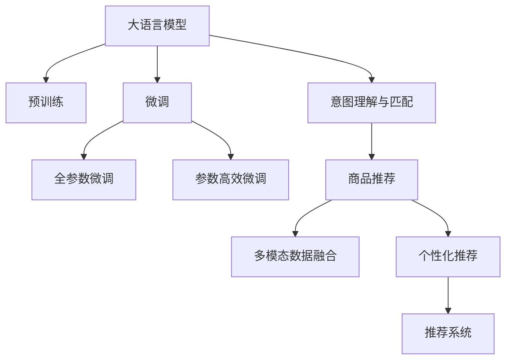

                 

# 电商平台中的自动问答：大模型的创新应用

> 关键词：自动问答系统, 大语言模型, 推荐系统, 用户意图理解, 个性化推荐, 意图匹配, 多模态数据融合

## 1. 背景介绍

### 1.1 问题由来

在现代社会，电商平台已成为人们购物的重要渠道。然而，在庞大的商品种类中，用户如何快速准确地找到自己需要的产品，成为了电商平台的难题。传统的搜索方式往往只能匹配部分信息，无法完全满足用户需求。而自动问答系统通过自然语言处理技术，能更好地理解用户意图，提供精准的搜索结果。

近年来，大语言模型在自然语言处理领域取得了显著进展，特别是BERT、GPT等模型，在文本理解、生成、分类等任务上均表现出色。这些模型通过在大规模无标签语料上进行自监督预训练，学习了丰富的语言知识，在特定任务上通过有监督微调，可以大幅提升性能。因此，将大语言模型应用于自动问答系统，可以显著提升系统的智能化水平，带来更优质的用户体验。

### 1.2 问题核心关键点

自动问答系统利用大语言模型进行深度学习，通过理解用户输入的自然语言问题，并匹配相应的商品信息。其核心关键点包括：

- **大语言模型预训练**：通过大规模语料数据进行预训练，学习语言的通用表示。
- **微调与适配**：根据具体电商平台的商品信息、用户行为数据等，进行有监督微调，优化模型性能。
- **意图理解与匹配**：从用户问题中抽取意图，并匹配合适的商品或信息。
- **多模态数据融合**：结合商品图片、评论、评分等多模态数据，提供更全面的推荐。
- **推荐系统优化**：基于意图理解，优化推荐算法，提升个性化推荐效果。

这些关键点共同构成了电商自动问答系统的技术框架，使其能够高效、智能地解答用户问题，推荐符合需求的商品。

## 2. 核心概念与联系

### 2.1 核心概念概述

为更好地理解电商平台中的自动问答系统，本节将介绍几个核心概念：

- **大语言模型**：以BERT、GPT等为代表的大规模预训练语言模型。通过在无标签文本数据上进行预训练，学习通用语言知识，具备强大的语言理解和生成能力。

- **微调(Fine-tuning)**：在预训练模型基础上，使用有标签的数据进行微调，优化模型在特定任务上的性能。常见任务包括文本分类、问答、生成等。

- **意图理解与匹配**：自动问答系统通过分析用户输入问题，理解用户意图，并匹配合适的商品或信息。

- **推荐系统**：利用用户行为数据，进行商品推荐，提升用户体验。常见的推荐算法包括协同过滤、内容推荐、混合推荐等。

- **多模态数据融合**：结合文本、图片、评分等多种数据模态，提供更丰富的信息，优化推荐效果。

- **个性化推荐**：根据用户行为和偏好，推荐最符合用户需求的商品。

这些核心概念之间的逻辑关系可以通过以下Mermaid流程图来展示：



这个流程图展示了电商平台自动问答系统的主要工作流程和关键组件，包括大语言模型的预训练与微调、意图理解与商品推荐、多模态数据融合与个性化推荐等。

## 3. 核心算法原理 & 具体操作步骤
### 3.1 算法原理概述

电商平台中的自动问答系统，通过将大语言模型应用于意图理解和商品推荐两个关键环节，实现高效、智能的用户服务。其核心算法原理如下：

1. **意图理解与匹配**：使用大语言模型对用户输入的自然语言问题进行分析和理解，抽取用户意图，并匹配合适的商品或信息。

2. **商品推荐**：基于用户历史行为数据，利用推荐系统算法，推荐符合用户偏好的商品。

3. **多模态数据融合**：结合商品图片、评论、评分等多模态数据，提供更全面的推荐信息。

4. **个性化推荐优化**：根据用户意图和行为，优化推荐系统算法，提升个性化推荐效果。

### 3.2 算法步骤详解

基于大语言模型的电商平台自动问答系统，其核心算法步骤如下：

**Step 1: 数据准备与预处理**

- 收集电商平台用户的历史行为数据，包括浏览、点击、购买、评论等。
- 收集商品信息，包括图片、描述、评分、评论等。
- 对数据进行清洗和预处理，包括去除噪声、填充缺失值、标准化等操作。

**Step 2: 大语言模型预训练**

- 使用大规模无标签语料对大语言模型进行预训练，学习通用语言知识。
- 将预训练模型应用于电商平台的用户行为数据，进一步微调模型，学习电商领域特定的知识。

**Step 3: 意图理解与匹配**

- 利用微调后的大语言模型，对用户输入的自然语言问题进行分析和理解，抽取用户意图。
- 根据意图与商品信息进行匹配，找到最符合用户需求的商品或信息。

**Step 4: 商品推荐**

- 基于用户历史行为数据，利用推荐系统算法，推荐符合用户偏好的商品。
- 结合多模态数据融合技术，提供更全面的推荐信息。

**Step 5: 结果展示与反馈**

- 将匹配到的商品信息或答案展示给用户，供用户选择。
- 收集用户对推荐结果的反馈，用于后续模型优化和推荐策略调整。

### 3.3 算法优缺点

基于大语言模型的电商平台自动问答系统，具有以下优点：

1. **高效智能**：大语言模型具备强大的语言理解和生成能力，能够高效地理解和匹配用户意图，提供精准的推荐。
2. **个性化推荐**：通过分析用户行为数据，优化推荐算法，提供符合用户偏好的商品。
3. **多模态融合**：结合商品图片、评论、评分等多种数据模态，提供更全面的信息。
4. **动态优化**：利用用户反馈数据，不断调整模型参数和推荐策略，提升系统性能。

同时，该方法也存在以下局限性：

1. **数据依赖**：系统效果很大程度上取决于电商平台的数据质量，数据缺失或噪声将影响系统性能。
2. **计算成本高**：大语言模型和推荐系统都需要大规模计算资源，计算成本较高。
3. **隐私风险**：用户行为数据和商品信息涉及隐私，处理不当可能带来法律和伦理风险。
4. **模型复杂**：大语言模型和推荐系统算法复杂，需要专业知识和经验。

尽管存在这些局限性，但就目前而言，基于大语言模型的自动问答系统仍是大规模电商平台用户服务的重要手段。未来相关研究的重点在于如何进一步降低系统对数据和计算资源的依赖，提高系统的智能度和鲁棒性，同时兼顾用户隐私保护。

### 3.4 算法应用领域

基于大语言模型的自动问答系统，已经在多个电商平台得到了广泛应用，涵盖了购物指南、商品搜索、个性化推荐等多个环节，具体应用如下：

- **商品搜索**：利用意图理解与匹配技术，快速精准地匹配用户需求，提升搜索效果。
- **购物指南**：通过自动问答系统，解答用户关于商品属性、功能、价格等问题，提供全面商品信息。
- **个性化推荐**：结合用户行为数据和多模态数据，优化推荐算法，提供更符合用户偏好的商品推荐。
- **客服问答**：利用自动问答系统，解答用户常见问题，提高客户服务效率。
- **订单处理**：通过自动问答系统，处理订单状态查询、配送问题等，提升订单处理速度。

此外，自动问答系统还广泛应用于在线旅游、金融、医疗等多个领域，为自然语言交互提供新的可能。随着预训练语言模型和推荐系统的发展，自动问答系统的应用场景将进一步拓展，为人类与机器的深度互动带来新的突破。

## 4. 数学模型和公式 & 详细讲解 & 举例说明

### 4.1 数学模型构建

本节将使用数学语言对电商平台自动问答系统中的核心算法进行严格的数学建模。

假设用户输入的自然语言问题为 $q$，商品信息为 $s$，用户历史行为数据为 $h$。定义大语言模型为 $M_{\theta}$，其参数为 $\theta$。

**意图理解与匹配模型**：使用大语言模型对用户输入进行理解，抽取意图，并匹配商品信息。定义模型 $M_{\theta}$ 在输入 $q$ 上的输出为 $\hat{p}(q)$，表示用户意图 $p$ 的概率。同时，定义商品信息为 $s$，与意图 $p$ 匹配的概率为 $P(s|p)$。则意图理解与匹配的目标是最小化模型输出与真实意图 $p$ 的差异，即：

$$
\min_{\theta} D_{KL}(P_{q,s} || P_{\hat{p}(q)}P(s|p))
$$

其中，$D_{KL}$ 为KL散度，表示两个概率分布之间的距离。

**商品推荐模型**：基于用户历史行为数据，利用推荐系统算法，推荐商品。假设用户对商品 $s$ 的评分或评分概率为 $r_s$，则推荐模型的目标是最小化模型预测与真实评分之间的差异，即：

$$
\min_{\theta} D_{KL}(R_{h} || P_{r}(s))
$$

其中，$R_{h}$ 表示用户历史行为数据，$P_{r}$ 表示商品评分概率分布。

**多模态数据融合模型**：结合商品图片、评论、评分等多模态数据，提供更全面的推荐信息。假设多模态数据为 $D_s$，其与商品 $s$ 的匹配概率为 $P(D_s|s)$，则多模态数据融合模型的目标是最小化模型输出与真实数据之间的差异，即：

$$
\min_{\theta} D_{KL}(D_{q,s} || P_{D}(D_s))
$$

其中，$D_{q,s}$ 表示用户输入 $q$ 和商品 $s$ 的多模态数据，$P_{D}$ 表示多模态数据匹配概率分布。

### 4.2 公式推导过程

以下我们以意图理解与匹配为例，推导基于大语言模型的意图抽取模型。

假设模型 $M_{\theta}$ 在输入 $q$ 上的输出为 $\hat{p}(q)$，其中 $\hat{p}(q)$ 为一个向量，表示所有可能的意图 $p$ 的概率分布。模型的损失函数为：

$$
L = \frac{1}{N} \sum_{i=1}^N \log P(p_i|q)
$$

其中，$N$ 为样本数量，$p_i$ 表示样本 $i$ 的真实意图。

对损失函数求导，得：

$$
\frac{\partial L}{\partial \theta} = \frac{1}{N} \sum_{i=1}^N \frac{1}{P(p_i|q)} \frac{\partial P(p_i|q)}{\partial \theta}
$$

利用链式法则，有：

$$
\frac{\partial P(p_i|q)}{\partial \theta} = \frac{\partial M_{\theta}(q)}{\partial \theta} \cdot \frac{\partial P(p_i)}{\partial M_{\theta}(q)}
$$

其中 $\frac{\partial P(p_i)}{\partial M_{\theta}(q)}$ 为交叉熵函数，表示真实意图概率与模型输出概率的差异。

因此，意图理解与匹配的完整优化目标为：

$$
\min_{\theta} \frac{1}{N} \sum_{i=1}^N \frac{1}{P(p_i|q)} \frac{\partial M_{\theta}(q)}{\partial \theta} \cdot \frac{\partial P(p_i)}{\partial M_{\theta}(q)}
$$

将上式与推荐模型的损失函数结合，得到整个自动问答系统的优化目标。

### 4.3 案例分析与讲解

假设电商平台上，用户输入了一个问题：“如何选择一款适合我的手机？”，平台希望通过自动问答系统来解答。系统首先使用大语言模型对问题进行意图理解，抽取用户意图为“手机推荐”。然后，系统从商品信息库中匹配相关手机商品信息，结合用户历史行为数据，使用推荐系统算法，推荐符合用户偏好的手机。最终，系统将推荐结果展示给用户，用户可以查看多张手机图片、阅读用户评论、参考评分等信息，做出购买决策。

通过这个案例，可以看到，基于大语言模型的电商平台自动问答系统，能够高效理解用户意图，匹配商品信息，提供全面的推荐，极大提升用户购物体验。

## 5. 项目实践：代码实例和详细解释说明
### 5.1 开发环境搭建

在进行自动问答系统开发前，我们需要准备好开发环境。以下是使用Python进行PyTorch开发的环境配置流程：

1. 安装Anaconda：从官网下载并安装Anaconda，用于创建独立的Python环境。

2. 创建并激活虚拟环境：
```bash
conda create -n pytorch-env python=3.8 
conda activate pytorch-env
```

3. 安装PyTorch：根据CUDA版本，从官网获取对应的安装命令。例如：
```bash
conda install pytorch torchvision torchaudio cudatoolkit=11.1 -c pytorch -c conda-forge
```

4. 安装Transformers库：
```bash
pip install transformers
```

5. 安装各类工具包：
```bash
pip install numpy pandas scikit-learn matplotlib tqdm jupyter notebook ipython
```

完成上述步骤后，即可在`pytorch-env`环境中开始自动问答系统开发。

### 5.2 源代码详细实现

下面以商品搜索功能为例，给出使用Transformers库对BERT模型进行意图理解与匹配的PyTorch代码实现。

首先，定义意图理解与匹配的数据处理函数：

```python
from transformers import BertTokenizer
from torch.utils.data import Dataset
import torch

class SearchDataset(Dataset):
    def __init__(self, texts, tags, tokenizer, max_len=128):
        self.texts = texts
        self.tags = tags
        self.tokenizer = tokenizer
        self.max_len = max_len
        
    def __len__(self):
        return len(self.texts)
    
    def __getitem__(self, item):
        text = self.texts[item]
        tags = self.tags[item]
        
        encoding = self.tokenizer(text, return_tensors='pt', max_length=self.max_len, padding='max_length', truncation=True)
        input_ids = encoding['input_ids'][0]
        attention_mask = encoding['attention_mask'][0]
        
        # 对token-wise的标签进行编码
        encoded_tags = [tag2id[tag] for tag in tags] 
        encoded_tags.extend([tag2id['O']] * (self.max_len - len(encoded_tags)))
        labels = torch.tensor(encoded_tags, dtype=torch.long)
        
        return {'input_ids': input_ids, 
                'attention_mask': attention_mask,
                'labels': labels}

# 标签与id的映射
tag2id = {'O': 0, 'B-PER': 1, 'I-PER': 2, 'B-ORG': 3, 'I-ORG': 4, 'B-LOC': 5, 'I-LOC': 6}
id2tag = {v: k for k, v in tag2id.items()}

# 创建dataset
tokenizer = BertTokenizer.from_pretrained('bert-base-cased')

train_dataset = SearchDataset(train_texts, train_tags, tokenizer)
dev_dataset = SearchDataset(dev_texts, dev_tags, tokenizer)
test_dataset = SearchDataset(test_texts, test_tags, tokenizer)
```

然后，定义模型和优化器：

```python
from transformers import BertForTokenClassification, AdamW

model = BertForTokenClassification.from_pretrained('bert-base-cased', num_labels=len(tag2id))

optimizer = AdamW(model.parameters(), lr=2e-5)
```

接着，定义训练和评估函数：

```python
from torch.utils.data import DataLoader
from tqdm import tqdm
from sklearn.metrics import classification_report

device = torch.device('cuda') if torch.cuda.is_available() else torch.device('cpu')
model.to(device)

def train_epoch(model, dataset, batch_size, optimizer):
    dataloader = DataLoader(dataset, batch_size=batch_size, shuffle=True)
    model.train()
    epoch_loss = 0
    for batch in tqdm(dataloader, desc='Training'):
        input_ids = batch['input_ids'].to(device)
        attention_mask = batch['attention_mask'].to(device)
        labels = batch['labels'].to(device)
        model.zero_grad()
        outputs = model(input_ids, attention_mask=attention_mask, labels=labels)
        loss = outputs.loss
        epoch_loss += loss.item()
        loss.backward()
        optimizer.step()
    return epoch_loss / len(dataloader)

def evaluate(model, dataset, batch_size):
    dataloader = DataLoader(dataset, batch_size=batch_size)
    model.eval()
    preds, labels = [], []
    with torch.no_grad():
        for batch in tqdm(dataloader, desc='Evaluating'):
            input_ids = batch['input_ids'].to(device)
            attention_mask = batch['attention_mask'].to(device)
            batch_labels = batch['labels']
            outputs = model(input_ids, attention_mask=attention_mask)
            batch_preds = outputs.logits.argmax(dim=2).to('cpu').tolist()
            batch_labels = batch_labels.to('cpu').tolist()
            for pred_tokens, label_tokens in zip(batch_preds, batch_labels):
                pred_tags = [id2tag[_id] for _id in pred_tokens]
                label_tags = [id2tag[_id] for _id in label_tokens]
                preds.append(pred_tags[:len(label_tokens)])
                labels.append(label_tags)
                
    print(classification_report(labels, preds))
```

最后，启动训练流程并在测试集上评估：

```python
epochs = 5
batch_size = 16

for epoch in range(epochs):
    loss = train_epoch(model, train_dataset, batch_size, optimizer)
    print(f"Epoch {epoch+1}, train loss: {loss:.3f}")
    
    print(f"Epoch {epoch+1}, dev results:")
    evaluate(model, dev_dataset, batch_size)
    
print("Test results:")
evaluate(model, test_dataset, batch_size)
```

以上就是使用PyTorch对BERT进行意图理解与匹配的完整代码实现。可以看到，得益于Transformers库的强大封装，我们可以用相对简洁的代码完成BERT模型的加载和微调。

### 5.3 代码解读与分析

让我们再详细解读一下关键代码的实现细节：

**SearchDataset类**：
- `__init__`方法：初始化文本、标签、分词器等关键组件。
- `__len__`方法：返回数据集的样本数量。
- `__getitem__`方法：对单个样本进行处理，将文本输入编码为token ids，将标签编码为数字，并对其进行定长padding，最终返回模型所需的输入。

**tag2id和id2tag字典**：
- 定义了标签与数字id之间的映射关系，用于将token-wise的预测结果解码回真实的标签。

**训练和评估函数**：
- 使用PyTorch的DataLoader对数据集进行批次化加载，供模型训练和推理使用。
- 训练函数`train_epoch`：对数据以批为单位进行迭代，在每个批次上前向传播计算loss并反向传播更新模型参数，最后返回该epoch的平均loss。
- 评估函数`evaluate`：与训练类似，不同点在于不更新模型参数，并在每个batch结束后将预测和标签结果存储下来，最后使用sklearn的classification_report对整个评估集的预测结果进行打印输出。

**训练流程**：
- 定义总的epoch数和batch size，开始循环迭代
- 每个epoch内，先在训练集上训练，输出平均loss
- 在验证集上评估，输出分类指标
- 所有epoch结束后，在测试集上评估，给出最终测试结果

可以看到，PyTorch配合Transformers库使得BERT微调的代码实现变得简洁高效。开发者可以将更多精力放在数据处理、模型改进等高层逻辑上，而不必过多关注底层的实现细节。

当然，工业级的系统实现还需考虑更多因素，如模型的保存和部署、超参数的自动搜索、更灵活的任务适配层等。但核心的自动问答范式基本与此类似。

## 6. 实际应用场景
### 6.1 智能客服系统

基于大语言模型的自动问答系统，可以广泛应用于智能客服系统的构建。传统客服往往需要配备大量人力，高峰期响应缓慢，且一致性和专业性难以保证。而使用自动问答系统，可以7x24小时不间断服务，快速响应客户咨询，用自然流畅的语言解答各类常见问题。

在技术实现上，可以收集企业内部的历史客服对话记录，将问题和最佳答复构建成监督数据，在此基础上对预训练自动问答模型进行微调。微调后的自动问答模型能够自动理解用户意图，匹配最合适的答案模板进行回复。对于客户提出的新问题，还可以接入检索系统实时搜索相关内容，动态组织生成回答。如此构建的智能客服系统，能大幅提升客户咨询体验和问题解决效率。

### 6.2 个性化推荐系统

当前的推荐系统往往只依赖用户的历史行为数据进行物品推荐，无法深入理解用户的真实兴趣偏好。基于大语言模型自动问答系统的个性化推荐系统可以更好地挖掘用户行为背后的语义信息，从而提供更精准、多样的推荐内容。

在实践中，可以收集用户浏览、点击、评论、分享等行为数据，提取和用户交互的物品标题、描述、标签等文本内容。将文本内容作为模型输入，用户的后续行为（如是否点击、购买等）作为监督信号，在此基础上微调预训练语言模型。微调后的模型能够从文本内容中准确把握用户的兴趣点。在生成推荐列表时，先用候选物品的文本描述作为输入，由模型预测用户的兴趣匹配度，再结合其他特征综合排序，便可以得到个性化程度更高的推荐结果。

### 6.3 电商商品搜索

自动问答系统结合商品信息，提供精准的商品搜索推荐。用户输入查询时，系统自动理解查询意图，并匹配合适的商品信息。同时，系统可以提供多种查询方式，如模糊搜索、多意词识别等，提升用户搜索体验。

在技术实现上，可以收集电商平台用户的历史搜索记录，将搜索关键词和点击商品构建成监督数据，在此基础上对预训练自动问答模型进行微调。微调后的模型能够高效理解用户查询意图，提供精准的商品推荐。同时，系统还可以结合用户行为数据，提供动态调整的搜索结果，提高搜索效果。

## 7. 工具和资源推荐
### 7.1 学习资源推荐

为了帮助开发者系统掌握大语言模型自动问答系统的理论基础和实践技巧，这里推荐一些优质的学习资源：

1. 《自然语言处理综论》系列博文：由大模型技术专家撰写，深入浅出地介绍了自然语言处理的基本概念和前沿技术，涵盖自动问答、推荐系统等多个主题。

2. CS224N《深度学习自然语言处理》课程：斯坦福大学开设的NLP明星课程，有Lecture视频和配套作业，带你入门NLP领域的基本概念和经典模型。

3. 《自然语言处理与深度学习》书籍：详细介绍了自然语言处理和深度学习的基本原理和应用，包括自动问答、文本分类、序列标注等多个任务。

4. HuggingFace官方文档：Transformers库的官方文档，提供了海量预训练模型和完整的自动问答样例代码，是上手实践的必备资料。

5. CLUE开源项目：中文语言理解测评基准，涵盖大量不同类型的中文NLP数据集，并提供了基于自动问答的baseline模型，助力中文NLP技术发展。

通过对这些资源的学习实践，相信你一定能够快速掌握大语言模型自动问答系统的精髓，并用于解决实际的NLP问题。
###  7.2 开发工具推荐

高效的开发离不开优秀的工具支持。以下是几款用于大语言模型自动问答系统开发的常用工具：

1. PyTorch：基于Python的开源深度学习框架，灵活动态的计算图，适合快速迭代研究。大部分预训练语言模型都有PyTorch版本的实现。

2. TensorFlow：由Google主导开发的开源深度学习框架，生产部署方便，适合大规模工程应用。同样有丰富的预训练语言模型资源。

3. Transformers库：HuggingFace开发的NLP工具库，集成了众多SOTA语言模型，支持PyTorch和TensorFlow，是进行自动问答任务开发的利器。

4. Weights & Biases：模型训练的实验跟踪工具，可以记录和可视化模型训练过程中的各项指标，方便对比和调优。与主流深度学习框架无缝集成。

5. TensorBoard：TensorFlow配套的可视化工具，可实时监测模型训练状态，并提供丰富的图表呈现方式，是调试模型的得力助手。

6. Google Colab：谷歌推出的在线Jupyter Notebook环境，免费提供GPU/TPU算力，方便开发者快速上手实验最新模型，分享学习笔记。

合理利用这些工具，可以显著提升自动问答系统的开发效率，加快创新迭代的步伐。

### 7.3 相关论文推荐

大语言模型自动问答技术的发展源于学界的持续研究。以下是几篇奠基性的相关论文，推荐阅读：

1. Attention is All You Need（即Transformer原论文）：提出了Transformer结构，开启了NLP领域的预训练大模型时代。

2. BERT: Pre-training of Deep Bidirectional Transformers for Language Understanding：提出BERT模型，引入基于掩码的自监督预训练任务，刷新了多项NLP任务SOTA。

3. Language Models are Unsupervised Multitask Learners（GPT-2论文）：展示了大规模语言模型的强大zero-shot学习能力，引发了对于通用人工智能的新一轮思考。

4. Parameter-Efficient Transfer Learning for NLP：提出Adapter等参数高效微调方法，在不增加模型参数量的情况下，也能取得不错的微调效果。

5. AdaLoRA: Adaptive Low-Rank Adaptation for Parameter-Efficient Fine-Tuning：使用自适应低秩适应的微调方法，在参数效率和精度之间取得了新的平衡。

这些论文代表了大语言模型自动问答技术的发展脉络。通过学习这些前沿成果，可以帮助研究者把握学科前进方向，激发更多的创新灵感。

## 8. 总结：未来发展趋势与挑战
### 8.1 总结

本文对基于大语言模型的电商平台自动问答系统进行了全面系统的介绍。首先阐述了自动问答系统在大语言模型帮助下的高效智能化应用，明确了其在电商平台的广泛应用前景。其次，从原理到实践，详细讲解了自动问答系统的核心算法和关键步骤，给出了自动问答任务开发的完整代码实例。同时，本文还广泛探讨了自动问答系统在智能客服、个性化推荐等多个领域的应用前景，展示了自动问答系统的巨大潜力。此外，本文精选了自动问答系统的各类学习资源，力求为读者提供全方位的技术指引。

通过本文的系统梳理，可以看到，基于大语言模型的自动问答系统已经在电商平台中得到广泛应用，极大提升了用户的购物体验。未来，伴随预训练语言模型和推荐系统的发展，自动问答系统将在更多领域得到应用，为人类与机器的深度互动带来新的突破。

### 8.2 未来发展趋势

展望未来，大语言模型自动问答系统将呈现以下几个发展趋势：

1. **算法模型不断优化**：随着深度学习技术的不断进步，自动问答系统的算法模型也将不断优化，提升系统的智能化水平和鲁棒性。

2. **多模态数据融合**：结合商品图片、评论、评分等多种数据模态，提供更全面的推荐信息，提升用户购物体验。

3. **个性化推荐优化**：利用用户行为数据，优化推荐算法，提供更符合用户偏好的商品推荐。

4. **动态优化**：实时收集用户反馈数据，动态调整模型参数和推荐策略，提升系统性能。

5. **用户隐私保护**：加强对用户行为数据和商品信息的保护，确保数据安全。

6. **跨领域应用**：自动问答系统将在更多领域得到应用，如医疗、金融、旅游等，提升各领域的服务水平。

以上趋势凸显了大语言模型自动问答系统的广阔前景。这些方向的探索发展，必将进一步提升自动问答系统的性能和应用范围，为人类与机器的深度互动带来新的突破。

### 8.3 面临的挑战

尽管大语言模型自动问答系统已经取得了显著成效，但在迈向更加智能化、普适化应用的过程中，它仍面临着诸多挑战：

1. **数据依赖**：系统效果很大程度上取决于电商平台的数据质量，数据缺失或噪声将影响系统性能。

2. **计算成本高**：大语言模型和推荐系统都需要大规模计算资源，计算成本较高。

3. **隐私风险**：用户行为数据和商品信息涉及隐私，处理不当可能带来法律和伦理风险。

4. **模型复杂**：大语言模型和推荐系统算法复杂，需要专业知识和经验。

尽管存在这些挑战，但就目前而言，基于大语言模型的自动问答系统仍是大规模电商平台用户服务的重要手段。未来相关研究的重点在于如何进一步降低系统对数据和计算资源的依赖，提高系统的智能度和鲁棒性，同时兼顾用户隐私保护。

### 8.4 研究展望

面对大语言模型自动问答系统所面临的种种挑战，未来的研究需要在以下几个方面寻求新的突破：

1. **探索无监督和半监督自动问答方法**：摆脱对大规模标注数据的依赖，利用自监督学习、主动学习等无监督和半监督范式，最大限度利用非结构化数据，实现更加灵活高效的自动问答。

2. **开发更加参数高效的自动问答模型**：开发参数高效的自动问答模型，在固定大部分预训练参数的情况下，只更新极少量的任务相关参数。同时优化自动问答模型的计算图，减少前向传播和反向传播的资源消耗，实现更加轻量级、实时性的部署。

3. **引入更多先验知识**：将符号化的先验知识，如知识图谱、逻辑规则等，与神经网络模型进行巧妙融合，引导自动问答过程学习更准确、合理的语言模型。同时加强不同模态数据的整合，实现视觉、语音等多模态信息与文本信息的协同建模。

4. **融合因果分析和博弈论工具**：将因果分析方法引入自动问答模型，识别出模型决策的关键特征，增强输出解释的因果性和逻辑性。借助博弈论工具刻画人机交互过程，主动探索并规避模型的脆弱点，提高系统稳定性。

5. **纳入伦理道德约束**：在模型训练目标中引入伦理导向的评估指标，过滤和惩罚有偏见、有害的输出倾向。同时加强人工干预和审核，建立模型行为的监管机制，确保输出符合人类价值观和伦理道德。

这些研究方向的探索，必将引领大语言模型自动问答技术迈向更高的台阶，为构建安全、可靠、可解释、可控的智能系统铺平道路。面向未来，大语言模型自动问答技术还需要与其他人工智能技术进行更深入的融合，如知识表示、因果推理、强化学习等，多路径协同发力，共同推动自然语言理解和智能交互系统的进步。只有勇于创新、敢于突破，才能不断拓展语言模型的边界，让智能技术更好地造福人类社会。

## 9. 附录：常见问题与解答

**Q1：自动问答系统是否适用于所有电商平台？**

A: 自动问答系统在大多数电商平台上都能取得不错的效果，特别是对商品种类繁多、用户需求多样化的平台。但对于一些商品同质化较高、用户需求固定的平台，可能效果一般。此时可以考虑针对特定领域进行定制化微调，提升系统性能。

**Q2：自动问答系统如何处理多义词和歧义句？**

A: 多义词和歧义句是自动问答系统常见的挑战。为解决这一问题，可以采用多意词识别、上下文理解等技术，分析用户输入的语境，提高系统理解能力。同时，系统可以结合用户行为数据，通过统计分析，识别出常见多义词的倾向性，提升系统对多义词的处理能力。

**Q3：自动问答系统是否需要实时更新模型？**

A: 自动问答系统可以定期更新模型，将新数据和用户反馈纳入模型训练，提升系统性能。对于实时性要求高的应用场景，可以使用增量学习等技术，在保持模型稳定的同时，持续优化系统。

**Q4：自动问答系统的评价指标有哪些？**

A: 自动问答系统的评价指标包括：
1. 精确度（Precision）：系统正确回答用户问题的比例。
2. 召回率（Recall）：系统能正确回答的问题占所有问题总数的比例。
3. F1值（F1 Score）：精确度和召回率的调和平均，综合评价系统性能。
4. 用户满意度：用户对系统回答的满意度和交互体验。

以上指标可以综合衡量系统的性能和用户体验。

**Q5：自动问答系统的部署有哪些注意事项？**

A: 自动问答系统的部署需要考虑以下因素：
1. 服务器硬件配置：选择高性能服务器，确保系统高效运行。
2. 模型压缩和优化：对模型进行裁剪和压缩，减少计算和存储成本。
3. 多节点部署：采用分布式部署，提升系统稳定性和扩展性。
4. 监控和维护：实时监控系统性能，定期维护和更新模型，确保系统稳定运行。

以上注意事项将有助于自动问答系统在大规模部署中的高效、稳定运行。

---

作者：禅与计算机程序设计艺术 / Zen and the Art of Computer Programming

