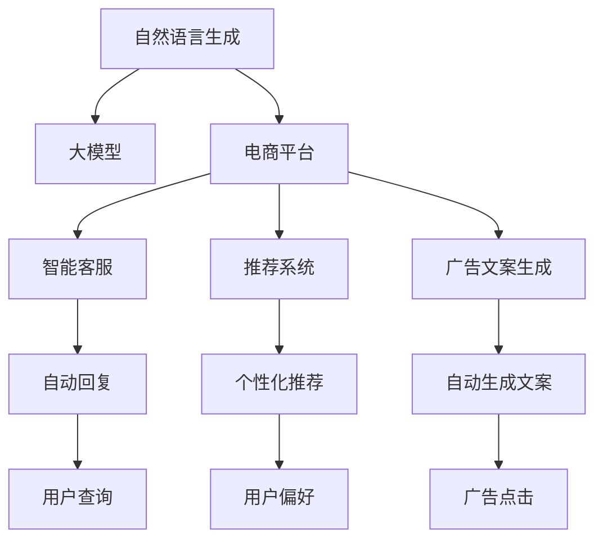

                 

# 电商平台中的自然语言生成：大模型的创新应用

> 关键词：自然语言生成, 大模型, 电商平台, 客户服务, 智能推荐, 模型优化, 性能评估

## 1. 背景介绍

在电商平台的高度竞争环境中，如何提升用户体验，优化运营效率，已成为商家们的首要任务。自然语言生成(Natural Language Generation, NLG)技术作为AI的重要分支，在提供智能客服、推荐系统、广告文案生成等方面，展现了巨大的潜力。尤其在电商平台中，通过自然语言生成技术，商家可以自动化生成商品描述、促销信息、客户反馈等文本，大幅提升内容创作效率，增强用户互动体验，从而实现销售额的提升。

### 1.1 问题由来

随着电商平台的快速发展，传统的粗放式运营模式已难以适应激烈的市场竞争。商家们希望通过技术手段，实现自动化、智能化的内容创作和管理，提高运营效率，降低人力成本。自然语言生成技术为此提供了新的解决方案。但如何将大规模的语言模型应用于电商平台，实现精准、高效、个性化的自然语言生成，成为摆在商家面前的重大挑战。

### 1.2 问题核心关键点

大语言模型在自然语言生成领域的应用，需要解决以下关键问题：
1. 数据处理：如何高效地获取、清洗、处理电商平台海量文本数据，构建训练样本。
2. 模型训练：如何在有限标注数据下，训练出适应电商平台特定需求的自然语言生成模型。
3. 模型优化：如何对生成的文本进行优化，确保内容真实性、相关性和可读性。
4. 性能评估：如何建立合理的评价指标体系，评估模型的生成效果和用户体验。
5. 实际应用：如何将模型集成到电商平台的业务流程中，实现智能客服、推荐系统、广告文案生成等功能。

本文将系统介绍自然语言生成技术在大模型电商平台中的应用，包括数据处理、模型训练、优化策略、性能评估和实际应用等方面。通过全面、深入的分析和实践指导，帮助电商商家掌握自然语言生成技术，提升运营效率，增强用户体验。

## 2. 核心概念与联系

### 2.1 核心概念概述

在深入探讨自然语言生成在大电商平台中的应用之前，首先需要理解一些核心概念及其之间的关系：

- **自然语言生成(NLG)**：利用计算机生成符合语法规则、语义连贯的自然语言文本，是NLP领域的重要分支。
- **大模型(Large Model)**：指基于大规模无标签数据进行预训练，具有强大的语言理解和生成能力的语言模型，如GPT、BERT、T5等。
- **电商平台**：指以在线销售商品和服务为主要业务的电子商务平台，包括淘宝、京东、Amazon等。
- **智能客服**：指利用自然语言生成技术，实现自动回复用户查询的客户服务系统，提高服务效率和质量。
- **推荐系统**：指通过分析用户行为和偏好，生成个性化推荐内容的系统，提高用户满意度和转化率。
- **广告文案生成**：指利用自然语言生成技术，生成具有吸引力的广告文案，提升广告效果和点击率。

这些核心概念共同构成了自然语言生成在电商平台中的应用框架，下面通过Mermaid流程图来展示它们之间的联系：



以上流程图展示了自然语言生成在大电商平台中的应用场景。通过大模型的预训练和微调，生成智能客服回复、推荐系统和广告文案等内容，大幅提升电商平台的运营效率和服务质量。

## 3. 核心算法原理 & 具体操作步骤
### 3.1 算法原理概述

自然语言生成在大平台的应用主要涉及三个步骤：数据预处理、模型训练和生成优化。下面将详细阐述每个步骤的算法原理和具体操作步骤。

### 3.2 算法步骤详解

**Step 1: 数据预处理**

数据预处理是自然语言生成模型的第一步，主要包括以下几个关键步骤：

1. **数据采集**：从电商平台收集用户评论、商品描述、广告文案、客服对话等文本数据。
2. **数据清洗**：去除无用信息，如HTML标签、特殊字符等，确保数据的整洁性和一致性。
3. **文本分词**：将文本进行分词处理，构建词汇表，便于模型训练和生成。
4. **标注数据准备**：对部分数据进行标注，如对商品描述进行分类标注，生成训练样本。

**Step 2: 模型训练**

模型训练是自然语言生成模型的核心环节，主要包括以下几个关键步骤：

1. **选择模型架构**：选择合适的自然语言生成模型架构，如Seq2Seq、Transformer等。
2. **选择预训练模型**：选择合适的预训练模型，如GPT、BERT、T5等。
3. **微调模型**：在预训练模型的基础上，使用电商平台标注数据进行微调，训练生成模型。
4. **优化超参数**：调整模型的超参数，如学习率、批大小等，以获得最佳生成效果。

**Step 3: 生成优化**

生成优化是自然语言生成模型的最后一步，主要包括以下几个关键步骤：

1. **生成文本**：使用训练好的模型，生成电商平台所需的内容，如商品描述、广告文案等。
2. **内容优化**：对生成的文本进行优化，确保其真实性、相关性和可读性。
3. **质量评估**：建立评估指标体系，如BLEU、ROUGE、F1-score等，评估生成文本的质量。
4. **集成应用**：将生成的文本集成到电商平台的业务流程中，实现智能客服、推荐系统和广告文案生成等功能。

### 3.3 算法优缺点

自然语言生成在大平台的应用具有以下优点：

1. **提高效率**：自动化生成电商平台所需内容，大幅提升内容创作效率。
2. **降低成本**：减少人力成本和内容创作的错误率，降低运营成本。
3. **提升用户体验**：生成内容更个性化、精准化，提高用户满意度和转化率。

但同时也存在一些缺点：

1. **质量控制难度大**：生成内容质量难以控制，容易出现语法错误、语义不通顺等问题。
2. **数据标注成本高**：电商平台标注数据的获取和标注成本较高，限制了模型的应用范围。
3. **生成内容可解释性差**：生成过程复杂，难以解释生成内容的生成逻辑，难以调试和优化。

尽管存在这些局限性，但就目前而言，自然语言生成技术仍是电商平台内容创作的重要手段，未来仍有巨大的发展潜力。

### 3.4 算法应用领域

自然语言生成技术在大平台中的应用主要涵盖以下几个领域：

1. **智能客服**：通过自然语言生成技术，实现自动回复用户查询，提升服务效率和质量。
2. **推荐系统**：利用自然语言生成技术，生成个性化推荐内容，提高用户满意度和转化率。
3. **广告文案生成**：通过自然语言生成技术，生成具有吸引力的广告文案，提升广告效果和点击率。
4. **商品描述优化**：利用自然语言生成技术，生成商品描述，提升用户点击率和转化率。
5. **内容生成自动化**：通过自然语言生成技术，自动化生成电商平台的各类文本内容，如促销信息、用户评价等。

这些应用领域展示了自然语言生成技术在大平台中的广泛应用前景，未来有望成为电商平台内容创作的重要工具。

## 4. 数学模型和公式 & 详细讲解 & 举例说明

### 4.1 数学模型构建

自然语言生成模型通常基于生成对抗网络(Generative Adversarial Networks, GANs)或自回归模型(如Seq2Seq、Transformer)。以下以Transformer模型为例，介绍自然语言生成模型的数学模型构建。

设输入序列为 $x=(x_1, x_2, ..., x_m)$，输出序列为 $y=(y_1, y_2, ..., y_n)$，其中 $m$ 和 $n$ 分别为输入和输出序列的长度。Transformer模型的数学模型可以表示为：

$$
p(y|x) = \prod_{i=1}^n p(y_i|x, y_{<i})
$$

其中 $p(y_i|x, y_{<i})$ 表示在给定输入序列 $x$ 和前 $i-1$ 个输出 $y_{<i}$ 的情况下，生成第 $i$ 个输出 $y_i$ 的概率。

### 4.2 公式推导过程

Transformer模型的生成过程包括以下几个关键步骤：

1. **自注意力机制**：计算输入序列中每个位置的向量表示，用于捕捉输入序列之间的依赖关系。
2. **多头注意力机制**：将自注意力机制的输出进行线性变换，得到多个注意力头的表示，用于捕捉不同层次的信息。
3. **前馈神经网络**：将多头注意力机制的输出进行非线性变换，得到更高层次的表示。
4. **解码器层**：重复上述步骤，生成输出序列。

具体推导过程较为复杂，涉及矩阵运算和向量变换，但总体思路是通过多层自注意力和前馈神经网络，捕捉输入序列和输出序列之间的依赖关系，生成符合语法规则和语义连贯的文本。

### 4.3 案例分析与讲解

以电商平台商品描述生成为例，假设输入为商品编号 $id$，希望生成该商品的商品描述。可以使用GPT等预训练模型，在电商平台标注数据上进行微调，生成商品描述。生成过程如下：

1. **数据准备**：收集电商平台商品描述数据，将其划分为训练集、验证集和测试集。
2. **模型选择**：选择GPT模型作为预训练模型，并在此基础上进行微调。
3. **微调过程**：使用训练集进行微调，在验证集上评估模型性能，调整超参数。
4. **文本生成**：将商品编号作为输入，使用微调后的模型生成商品描述。
5. **质量评估**：使用BLEU、ROUGE等指标评估生成文本的质量。
6. **应用集成**：将生成的商品描述集成到电商平台的商品页面，提升用户点击率和转化率。

## 5. 项目实践：代码实例和详细解释说明

### 5.1 开发环境搭建

在进行自然语言生成实践前，需要先准备好开发环境。以下是使用Python进行PyTorch开发的环境配置流程：

1. 安装Anaconda：从官网下载并安装Anaconda，用于创建独立的Python环境。

2. 创建并激活虚拟环境：
```bash
conda create -n pytorch-env python=3.8 
conda activate pytorch-env
```

3. 安装PyTorch：根据CUDA版本，从官网获取对应的安装命令。例如：
```bash
conda install pytorch torchvision torchaudio cudatoolkit=11.1 -c pytorch -c conda-forge
```

4. 安装其他依赖包：
```bash
pip install transformers sacremoses
```

5. 安装各类工具包：
```bash
pip install numpy pandas scikit-learn matplotlib tqdm jupyter notebook ipython
```

完成上述步骤后，即可在`pytorch-env`环境中开始自然语言生成实践。

### 5.2 源代码详细实现

下面我们以商品描述生成为例，给出使用Transformers库对GPT模型进行微调的PyTorch代码实现。

首先，定义模型和优化器：

```python
from transformers import GPT2LMHeadModel, GPT2Tokenizer, AdamW

model = GPT2LMHeadModel.from_pretrained('gpt2')
tokenizer = GPT2Tokenizer.from_pretrained('gpt2')
optimizer = AdamW(model.parameters(), lr=3e-5)
```

然后，定义数据预处理函数：

```python
def prepare_data(data):
    text = data['description']
    tokens = tokenizer.encode(text, return_tensors='pt')
    return tokens
```

接着，定义训练和评估函数：

```python
from torch.utils.data import DataLoader
from tqdm import tqdm
from sklearn.metrics import accuracy_score

device = torch.device('cuda') if torch.cuda.is_available() else torch.device('cpu')
model.to(device)

def train_epoch(model, data_loader, optimizer):
    model.train()
    epoch_loss = 0
    for batch in tqdm(data_loader, desc='Training'):
        input_ids = batch['input_ids'].to(device)
        loss = model(input_ids).loss
        epoch_loss += loss.item()
        loss.backward()
        optimizer.step()
    return epoch_loss / len(data_loader)

def evaluate(model, data_loader):
    model.eval()
    preds, labels = [], []
    with torch.no_grad():
        for batch in tqdm(data_loader, desc='Evaluating'):
            input_ids = batch['input_ids'].to(device)
            outputs = model(input_ids)
            batch_preds = outputs.logits.argmax(dim=2).to('cpu').tolist()
            batch_labels = batch['labels'].to('cpu').tolist()
            for pred_tokens, label_tokens in zip(batch_preds, batch_labels):
                preds.append(pred_tokens[:len(label_tokens)])
                labels.append(label_tokens)
                
    return accuracy_score(labels, preds)

# 训练模型
epochs = 5
batch_size = 32

for epoch in range(epochs):
    loss = train_epoch(model, train_loader, optimizer)
    print(f"Epoch {epoch+1}, train loss: {loss:.3f}")
    
    print(f"Epoch {epoch+1}, dev results:")
    acc = evaluate(model, dev_loader)
    print(f"Accuracy on dev set: {acc:.3f}")
    
print("Test results:")
acc = evaluate(model, test_loader)
print(f"Accuracy on test set: {acc:.3f}")
```

以上就是使用PyTorch对GPT进行商品描述生成任务的微调完整代码实现。可以看到，通过上述代码，可以很方便地对GPT模型进行微调，生成符合语法规则和语义连贯的商品描述。

### 5.3 代码解读与分析

让我们再详细解读一下关键代码的实现细节：

**prepare_data函数**：
- 定义了数据预处理函数，将商品描述文本转化为模型所需的token ids。

**训练函数train_epoch**：
- 定义了训练函数，对数据进行批次化处理，计算损失函数，并使用AdamW优化器更新模型参数。

**评估函数evaluate**：
- 定义了评估函数，对数据进行批次化处理，使用模型生成文本，并计算生成文本与真实标签的准确率。

**训练流程**：
- 定义总的epoch数和batch size，开始循环迭代
- 每个epoch内，先在训练集上训练，输出平均loss
- 在验证集上评估，输出准确率
- 重复上述步骤直至满足预设的迭代轮数
- 在测试集上评估，给出最终测试结果

可以看到，PyTorch配合Transformers库使得GPT微调的代码实现变得简洁高效。开发者可以将更多精力放在数据处理、模型改进等高层逻辑上，而不必过多关注底层的实现细节。

当然，工业级的系统实现还需考虑更多因素，如模型的保存和部署、超参数的自动搜索、更灵活的任务适配层等。但核心的微调范式基本与此类似。

## 6. 实际应用场景

### 6.1 智能客服系统

基于自然语言生成技术的智能客服系统，可以在电商平台中实现自动化、智能化的客户服务。当用户提交查询时，系统能够快速响应，提供准确的答案和解决方案。这不仅可以提升用户体验，还能减轻客服人员的负担，提高服务效率。

在技术实现上，可以收集电商平台的客户咨询数据，构建对话数据集，在GPT等预训练模型的基础上进行微调。微调后的模型可以自动识别用户意图，生成符合语法规则和语义连贯的回复，实现智能客服功能。

### 6.2 推荐系统

电商平台的推荐系统需要根据用户行为和偏好，生成个性化的商品推荐。自然语言生成技术可以帮助生成具有吸引力的商品推荐文案，提升用户满意度和转化率。

具体而言，可以收集用户的浏览、购买、评价等行为数据，将数据转化为模型所需的格式。在微调后的GPT模型上，生成商品推荐文案，然后结合其他推荐算法，生成综合推荐结果。这样，用户不仅能看到商品，还能看到生动的商品推荐文案，增强购买欲望。

### 6.3 广告文案生成

电商平台的广告文案生成是提升广告点击率的重要手段。自然语言生成技术可以帮助自动生成具有吸引力的广告文案，提升广告效果。

在实践中，可以收集电商平台的广告数据，将其转化为模型所需的格式。在微调后的GPT模型上，生成符合广告主题和用户偏好的广告文案，然后推送给用户，提升广告点击率。

### 6.4 未来应用展望

随着自然语言生成技术的不断发展，未来在电商平台中的应用将更加广泛和深入。以下是一些未来应用的前景展望：

1. **多模态内容生成**：结合图像、音频等多模态数据，生成更加丰富、多样化的内容，提升用户互动体验。
2. **个性化内容生成**：通过自然语言生成技术，生成个性化商品描述、推荐文案等，提升用户满意度和转化率。
3. **实时内容生成**：实时生成动态广告文案、商品描述等，提升内容创作效率和用户体验。
4. **情感分析**：利用自然语言生成技术，生成情感化语言描述，提升用户体验和品牌形象。
5. **隐私保护**：在保护用户隐私的前提下，生成个性化内容，提升用户信任和忠诚度。

## 7. 工具和资源推荐

### 7.1 学习资源推荐

为了帮助开发者系统掌握自然语言生成技术，这里推荐一些优质的学习资源：

1. 《Natural Language Generation: A Survey》：自然语言生成领域综述论文，总结了当前的研究方向和技术进展。
2. 《Attention Is All You Need》：Transformer原论文，介绍了Transformer模型及其在自然语言生成中的应用。
3. 《Sequence to Sequence Learning with Neural Networks》：Seq2Seq模型经典论文，介绍了Seq2Seq模型及其在自然语言生成中的应用。
4. 《Neural Machine Translation by Jointly Learning to Align and Translate》：Seq2Seq模型经典论文，介绍了Seq2Seq模型及其在自然语言生成中的应用。
5. 《LSTM: A Search Space Odyssey》：LSTM模型经典论文，介绍了LSTM模型及其在自然语言生成中的应用。

这些资源代表了自然语言生成技术的发展脉络，通过学习这些前沿成果，可以帮助研究者把握学科前进方向，激发更多的创新灵感。

### 7.2 开发工具推荐

高效的开发离不开优秀的工具支持。以下是几款用于自然语言生成开发的常用工具：

1. PyTorch：基于Python的开源深度学习框架，灵活动态的计算图，适合快速迭代研究。
2. TensorFlow：由Google主导开发的开源深度学习框架，生产部署方便，适合大规模工程应用。
3. Transformers库：HuggingFace开发的NLP工具库，集成了众多SOTA语言模型，支持PyTorch和TensorFlow，是进行自然语言生成任务的开发利器。
4. Weights & Biases：模型训练的实验跟踪工具，可以记录和可视化模型训练过程中的各项指标，方便对比和调优。
5. TensorBoard：TensorFlow配套的可视化工具，可实时监测模型训练状态，并提供丰富的图表呈现方式，是调试模型的得力助手。

合理利用这些工具，可以显著提升自然语言生成任务的开发效率，加快创新迭代的步伐。

### 7.3 相关论文推荐

自然语言生成在大平台中的应用源于学界的持续研究。以下是几篇奠基性的相关论文，推荐阅读：

1. Attention Is All You Need：提出了Transformer结构，开启了自然语言生成领域的预训练大模型时代。
2. BERT: Pre-training of Deep Bidirectional Transformers for Language Understanding：提出BERT模型，引入基于掩码的自监督预训练任务，刷新了多项自然语言生成任务SOTA。
3. Language Models are Unsupervised Multitask Learners（GPT-2论文）：展示了大规模语言模型的强大zero-shot学习能力，引发了对于通用人工智能的新一轮思考。
4. Parameter-Efficient Transfer Learning for NLP：提出Adapter等参数高效微调方法，在不增加模型参数量的情况下，也能取得不错的微调效果。
5. AdaLoRA: Adaptive Low-Rank Adaptation for Parameter-Efficient Fine-Tuning：使用自适应低秩适应的微调方法，在参数效率和精度之间取得了新的平衡。
6. PEGASUS: Pre-training with Extractive and Abstractive Generation for Summarization：提出PEGAUS模型，结合提取式和抽象式生成技术，提升文本摘要效果。

这些论文代表了大语言模型自然语言生成技术的发展脉络。通过学习这些前沿成果，可以帮助研究者把握学科前进方向，激发更多的创新灵感。

## 8. 总结：未来发展趋势与挑战

### 8.1 总结

本文对自然语言生成技术在大平台中的应用进行了全面系统的介绍。首先阐述了自然语言生成技术在电商平台中的研究背景和意义，明确了自然语言生成技术在大平台中的应用价值。其次，从原理到实践，详细讲解了自然语言生成技术在大平台中的关键技术环节，包括数据预处理、模型训练和生成优化。同时，本文还广泛探讨了自然语言生成技术在大平台中的实际应用，展示了自然语言生成技术在大平台中的广泛应用前景。

通过本文的系统梳理，可以看到，自然语言生成技术在大平台中的应用前景广阔，具有巨大的市场潜力和应用价值。自然语言生成技术能够自动化生成电商平台所需内容，提升内容创作效率，增强用户互动体验，从而实现销售额的提升。未来，随着自然语言生成技术的不断发展，相信其将在电商平台的各个领域得到更广泛的应用，为电商平台的运营效率和服务质量带来新的突破。

### 8.2 未来发展趋势

展望未来，自然语言生成技术在大平台中的应用将呈现以下几个发展趋势：

1. **多模态自然语言生成**：结合图像、音频等多模态数据，生成更加丰富、多样化的内容，提升用户互动体验。
2. **个性化内容生成**：通过自然语言生成技术，生成个性化商品描述、推荐文案等，提升用户满意度和转化率。
3. **实时内容生成**：实时生成动态广告文案、商品描述等，提升内容创作效率和用户体验。
4. **情感分析**：利用自然语言生成技术，生成情感化语言描述，提升用户体验和品牌形象。
5. **隐私保护**：在保护用户隐私的前提下，生成个性化内容，提升用户信任和忠诚度。

以上趋势凸显了自然语言生成技术在大平台中的应用前景。这些方向的探索发展，必将进一步提升电商平台的运营效率和服务质量，为电商平台的数字化转型升级提供新的技术路径。

### 8.3 面临的挑战

尽管自然语言生成技术在大平台中的应用已经取得了显著成果，但在迈向更加智能化、普适化应用的过程中，它仍面临诸多挑战：

1. **数据标注成本高**：电商平台标注数据的获取和标注成本较高，限制了模型的应用范围。
2. **生成内容质量难以控制**：生成内容质量难以控制，容易出现语法错误、语义不通顺等问题。
3. **模型可解释性差**：生成过程复杂，难以解释生成内容的生成逻辑，难以调试和优化。
4. **跨模态融合难度大**：结合图像、音频等多模态数据生成自然语言内容，技术难度较大。
5. **隐私保护问题**：生成内容中包含用户隐私信息，需要有效保护用户隐私。

尽管存在这些挑战，但就目前而言，自然语言生成技术仍是大平台内容创作的重要手段，未来仍有巨大的发展潜力。

### 8.4 研究展望

面对自然语言生成技术在大平台中面临的挑战，未来的研究需要在以下几个方面寻求新的突破：

1. **降低数据标注成本**：利用自监督学习、主动学习等无监督和半监督范式，最大限度利用非结构化数据，实现更加灵活高效的自然语言生成。
2. **提高生成内容质量**：开发更加参数高效的微调方法，在固定大部分预训练参数的同时，只更新极少量的任务相关参数。同时优化生成模型的计算图，减少前向传播和反向传播的资源消耗，实现更加轻量级、实时性的部署。
3. **增强生成内容可解释性**：引入因果推断、博弈论等工具，增强生成内容的可解释性和可控性，降低生成内容的风险和不确定性。
4. **推动跨模态融合**：结合图像、音频等多模态数据，生成自然语言内容，提升内容的丰富性和多样性，增强用户体验。
5. **强化隐私保护**：在生成内容中有效保护用户隐私，确保用户信息安全，提升用户信任和忠诚度。

这些研究方向的探索，必将引领自然语言生成技术在大平台中的应用进入新的高度，为电商平台的运营效率和服务质量带来新的突破。未来，随着自然语言生成技术的不断发展，相信其将在电商平台的各个领域得到更广泛的应用，为电商平台的数字化转型升级提供新的技术路径。

## 9. 附录：常见问题与解答

**Q1: 自然语言生成技术是否适用于所有电商平台？**

A: 自然语言生成技术在大多数电商平台中都能取得不错的效果，特别是对于数据量较小的平台。但对于一些特定领域的平台，如垂直行业平台，可能还需要根据具体情况进行模型适配和优化。

**Q2: 如何降低自然语言生成技术的标注成本？**

A: 利用自监督学习、主动学习等无监督和半监督范式，最大限度利用非结构化数据，实现更加灵活高效的自然语言生成。例如，通过数据增强、对抗训练等技术，提升模型的泛化能力，减少标注样本需求。

**Q3: 如何提高自然语言生成技术生成的内容质量？**

A: 开发更加参数高效的微调方法，在固定大部分预训练参数的同时，只更新极少量的任务相关参数。同时优化生成模型的计算图，减少前向传播和反向传播的资源消耗，实现更加轻量级、实时性的部署。此外，引入因果推断、博弈论等工具，增强生成内容的可解释性和可控性，降低生成内容的风险和不确定性。

**Q4: 自然语言生成技术在大平台中的实际应用有哪些？**

A: 自然语言生成技术在大平台中的应用包括智能客服、推荐系统、广告文案生成、商品描述优化等内容生成自动化等方面。通过自动化生成电商平台所需内容，提升内容创作效率，增强用户互动体验，从而实现销售额的提升。

**Q5: 自然语言生成技术在大平台中的未来应用前景如何？**

A: 未来自然语言生成技术在大平台中的应用前景广阔，主要包括多模态自然语言生成、个性化内容生成、实时内容生成、情感分析、隐私保护等方面。结合图像、音频等多模态数据，生成更加丰富、多样化的内容，提升用户互动体验。通过自然语言生成技术，生成个性化商品描述、推荐文案等，提升用户满意度和转化率。实时生成动态广告文案、商品描述等，提升内容创作效率和用户体验。利用自然语言生成技术，生成情感化语言描述，提升用户体验和品牌形象。在保护用户隐私的前提下，生成个性化内容，提升用户信任和忠诚度。

这些应用前景凸显了自然语言生成技术在大平台中的广泛应用前景，未来有望成为大平台内容创作的重要工具。

