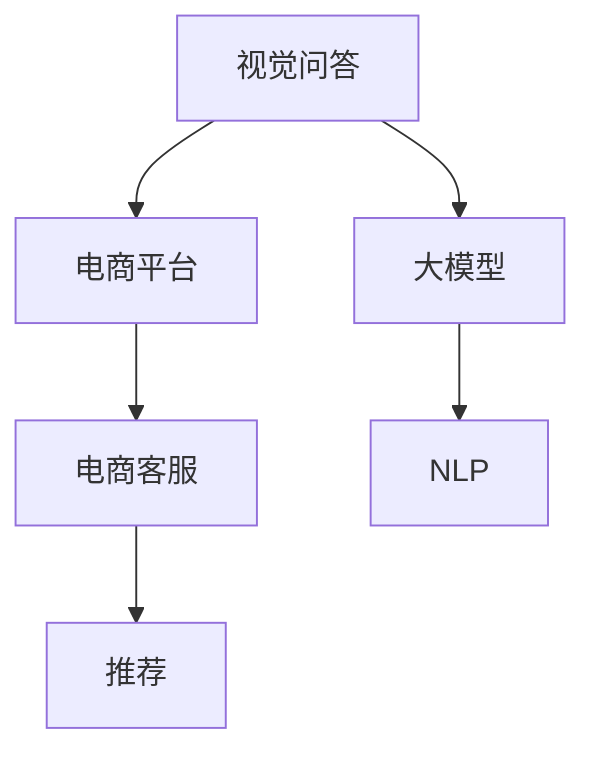

                 

# 电商平台中的视觉问答：大模型的创新应用

> 关键词：视觉问答,大模型,电商平台,电商客服,自然语言处理,NLP

## 1. 背景介绍

### 1.1 问题由来

随着电商平台的高速发展，用户对于商品信息的获取需求愈发迫切。传统的搜索、浏览、客服交互等方式已难以满足用户多方面、多层次的需求。尤其在用户进行购买决策时，如何高效地获取商品信息，成为电商平台提升用户体验、提高转化率的关键。

### 1.2 问题核心关键点

电商平台的视觉问答系统（Vision QA，VQ）旨在通过视觉和文本的双模态输入，帮助用户快速理解商品信息，提供精准的推荐和客服服务。视觉问答系统通过将商品的图像输入到模型中，并结合用户输入的自然语言描述，生成相应的答案或商品推荐，从而大幅提升电商平台的用户体验和运营效率。

视觉问答系统的核心在于如何融合视觉信息与自然语言处理(NLP)技术，实现跨模态信息的高效转换和理解。当前主流的视觉问答系统主要基于深度学习模型，通过大规模预训练和微调，实现了跨模态信息融合的创新应用。

## 2. 核心概念与联系

### 2.1 核心概念概述

为更好地理解电商平台中视觉问答系统的工作原理，本节将介绍几个关键概念及其相互关系：

- **视觉问答 (Vision Question Answering, VQA)**：结合视觉和自然语言处理技术，实现跨模态信息融合，自动回答与图像相关的问题。
- **大模型 (Large Model)**：通常指大规模预训练模型，如BERT、GPT等，具有强大的语言表示和理解能力，能处理自然语言输入。
- **电商平台 (E-commerce Platform)**：通过线上销售商品和服务的平台，提供丰富的商品展示、推荐和客服服务，需要高效的视觉问答系统提升用户体验。
- **电商客服 (E-commerce Customer Service)**：通过视觉问答技术，将自然语言问题转换为视觉匹配任务，提升客服互动的智能化水平。
- **自然语言处理 (Natural Language Processing, NLP)**：处理和理解人类语言的技术，是视觉问答系统中理解和生成自然语言的重要工具。

这些概念之间的逻辑关系可以通过以下Mermaid流程图来展示：



这个流程图展示了几者的相互关系：

1. 视觉问答系统将视觉信息和自然语言描述输入大模型，获得答案或推荐。
2. 电商平台提供商品展示和客服服务，利用视觉问答系统提升用户体验。
3. 电商客服结合视觉问答系统，生成自然语言回复，提升客服效率。
4. 自然语言处理技术用于理解和生成自然语言，是大模型理解用户需求和生成回答的关键。

## 3. 核心算法原理 & 具体操作步骤
### 3.1 算法原理概述

电商平台中的视觉问答系统，本质上是一种跨模态学习任务，融合了视觉信息和自然语言。其核心算法分为以下几个步骤：

1. **视觉特征提取**：通过预训练的大模型，如ResNet、Inception等，将商品图像转换为高维特征向量。
2. **文本编码**：使用预训练的NLP模型，如BERT、GPT等，将用户输入的自然语言描述转换为向量表示。
3. **跨模态融合**：通过神经网络结构，将视觉特征向量和文本编码向量进行融合，得到跨模态表示。
4. **答案生成**：结合融合后的跨模态表示，通过预训练的分类器或生成模型，生成相应的答案或商品推荐。

### 3.2 算法步骤详解

以下是视觉问答系统的一般流程：

**Step 1: 数据准备**

- **视觉数据**：收集商品的高清图像，进行标注处理，如类别、属性、详情等。
- **文本数据**：收集用户输入的自然语言描述，进行分词、标点处理，生成文本序列。
- **数据集划分**：将数据集划分为训练集、验证集和测试集，确保模型在未见过的数据上也能有较好的泛化性能。

**Step 2: 大模型加载和预训练**

- **视觉特征提取器**：加载预训练的视觉特征提取模型，如ResNet、Inception等。
- **文本编码器**：加载预训练的NLP模型，如BERT、GPT等，用于文本编码。
- **跨模态融合器**：加载预训练的跨模态融合模型，如Transformer、LSTM等，将视觉特征向量和文本编码向量进行融合。

**Step 3: 微调**

- **设定优化器**：选择适合的优化器，如AdamW、SGD等，设置学习率、批大小等超参数。
- **训练过程**：在训练集上迭代训练，通过反向传播更新模型参数。
- **验证和调参**：在验证集上评估模型性能，根据结果调整学习率、正则化等参数。
- **测试**：在测试集上测试模型效果，评估跨模态表示的泛化能力。

**Step 4: 推理应用**

- **输入预处理**：将商品的图像和用户输入的自然语言描述输入到模型中。
- **特征提取**：使用加载的视觉特征提取模型，生成商品的高维特征向量。
- **文本编码**：使用加载的NLP模型，将用户输入的文本描述转换为向量表示。
- **跨模态融合**：将视觉特征向量和文本编码向量输入到加载的跨模态融合模型中，得到跨模态表示。
- **答案生成**：使用加载的分类器或生成模型，对跨模态表示进行分类或生成，得到答案或商品推荐。

### 3.3 算法优缺点

视觉问答系统具有以下优点：
1. **高效精准**：利用预训练大模型的强大表示能力，能够高效地将视觉信息转换为自然语言表示，生成精准的答案或推荐。
2. **泛化能力强**：通过大模型在多领域、多任务上的预训练，模型具备较强的泛化能力，能够应对不同的视觉-文本组合。
3. **适应性广**：适用于各种电商场景，如商品推荐、智能客服、质量检测等。
4. **易用性好**：模型和工具的封装，使得开发者能够快速集成和使用视觉问答系统。

同时，该系统也存在一些缺点：
1. **资源需求高**：大模型和跨模态融合器需要大量的计算资源和存储空间。
2. **数据依赖强**：模型的性能很大程度上依赖于训练数据的质量和数量，获取高质量标注数据的成本较高。
3. **部署复杂**：模型推理过程涉及多层的神经网络结构，推理速度较慢。
4. **泛化能力有限**：在视觉和文本分布差异较大的场景下，模型的泛化能力可能受到限制。
5. **输出缺乏解释性**：模型输出的答案或推荐缺乏可解释性，难以理解其内部逻辑。

### 3.4 算法应用领域

视觉问答系统在电商平台中的应用场景非常广泛，具体包括：

1. **智能推荐系统**：结合用户浏览记录和商品图像，生成个性化的商品推荐，提升用户体验和购买率。
2. **智能客服**：通过自然语言理解技术，生成与用户输入匹配的图像，提供快速准确的客服回答，提升客户满意度。
3. **商品属性标注**：将用户输入的属性查询转换为商品图像的视觉匹配任务，生成准确的商品属性信息。
4. **图片质量检测**：对商品图像进行视觉描述，检测图像质量，确保商品展示效果。
5. **用户反馈分析**：通过视觉问答系统，生成与用户反馈相关的图像描述，便于电商运营团队分析用户偏好和需求。

## 4. 数学模型和公式 & 详细讲解  
### 4.1 数学模型构建

假设视觉特征提取器为 $V$，文本编码器为 $T$，跨模态融合器为 $F$，分类器为 $C$。模型的整体框架可以表示为：

$$
y = C(F(V(x), T(q)))
$$

其中 $x$ 为商品图像，$q$ 为用户输入的自然语言描述，$y$ 为模型的输出，如答案或推荐。

### 4.2 公式推导过程

以一个简单的视觉问答模型为例，公式推导如下：

**Step 1: 特征提取**

$$
v(x) = V(x) \in \mathbb{R}^{d_v}
$$

**Step 2: 文本编码**

$$
t(q) = T(q) \in \mathbb{R}^{d_t}
$$

**Step 3: 跨模态融合**

$$
f(v, t) = F(v, t) \in \mathbb{R}^{d_f}
$$

其中 $d_v$ 和 $d_t$ 分别为视觉特征向量和文本编码向量的维度，$d_f$ 为跨模态表示的维度。

**Step 4: 答案生成**

$$
y = C(f) \in \{1, 2, 3, ...\}
$$

其中 $C$ 为分类器或生成模型，$y$ 为模型的输出。

### 4.3 案例分析与讲解

假设有一个电商平台的商品推荐系统，使用上述框架进行模型构建和微调。具体步骤如下：

**Step 1: 数据准备**

- **商品图像**：从电商平台收集商品的高清图像，进行标注处理。
- **用户输入**：收集用户输入的自然语言描述，进行分词、标点处理，生成文本序列。
- **数据集划分**：将数据集划分为训练集、验证集和测试集。

**Step 2: 加载和预训练**

- **加载模型**：使用预训练的ResNet和BERT模型，分别作为视觉特征提取器和文本编码器。
- **微调模型**：在训练集上迭代训练，通过反向传播更新模型参数。

**Step 3: 推理应用**

- **特征提取**：使用加载的ResNet模型，生成商品的高维特征向量。
- **文本编码**：使用加载的BERT模型，将用户输入的文本描述转换为向量表示。
- **跨模态融合**：将视觉特征向量和文本编码向量输入到加载的Transformer模型中，得到跨模态表示。
- **答案生成**：使用加载的分类器，对跨模态表示进行分类，生成商品推荐。

## 5. 项目实践：代码实例和详细解释说明
### 5.1 开发环境搭建

在进行视觉问答系统开发前，我们需要准备好开发环境。以下是使用Python进行PyTorch开发的环境配置流程：

1. 安装Anaconda：从官网下载并安装Anaconda，用于创建独立的Python环境。

2. 创建并激活虚拟环境：
```bash
conda create -n pytorch-env python=3.8 
conda activate pytorch-env
```

3. 安装PyTorch：根据CUDA版本，从官网获取对应的安装命令。例如：
```bash
conda install pytorch torchvision torchaudio cudatoolkit=11.1 -c pytorch -c conda-forge
```

4. 安装Transformers库：
```bash
pip install transformers
```

5. 安装各类工具包：
```bash
pip install numpy pandas scikit-learn matplotlib tqdm jupyter notebook ipython
```

完成上述步骤后，即可在`pytorch-env`环境中开始开发实践。

### 5.2 源代码详细实现

下面我们以商品推荐任务为例，给出使用Transformers库对ResNet-BERT融合模型进行微调的PyTorch代码实现。

首先，定义推荐任务的数据处理函数：

```python
from transformers import BertTokenizer, BertModel
from torch.utils.data import Dataset, DataLoader
import torch

class RecommendationDataset(Dataset):
    def __init__(self, images, queries, labels, tokenizer):
        self.images = images
        self.queries = queries
        self.labels = labels
        self.tokenizer = tokenizer
        
    def __len__(self):
        return len(self.images)
    
    def __getitem__(self, item):
        image = self.images[item]
        query = self.queries[item]
        label = self.labels[item]
        
        encoding = self.tokenizer(query, return_tensors='pt', max_length=512)
        image = image.unsqueeze(0)
        
        return {'image': image, 
                'query': encoding['input_ids'],
                'label': label}
```

然后，定义模型和优化器：

```python
from transformers import ResNet50ForImageClassification, BertForSequenceClassification, AdamW

visual_model = ResNet50ForImageClassification.from_pretrained('resnet50', num_labels=10)
text_model = BertForSequenceClassification.from_pretrained('bert-base-uncased', num_labels=10)
cross_model = ResNet50ForImageClassification.from_pretrained('resnet50', num_labels=10)

model = torch.nn.Sequential(
    visual_model,
    cross_model,
    text_model
)

optimizer = AdamW(model.parameters(), lr=2e-5)
```

接着，定义训练和评估函数：

```python
from torch.utils.data import DataLoader
from tqdm import tqdm
from sklearn.metrics import accuracy_score

device = torch.device('cuda') if torch.cuda.is_available() else torch.device('cpu')
model.to(device)

def train_epoch(model, dataset, batch_size, optimizer):
    dataloader = DataLoader(dataset, batch_size=batch_size, shuffle=True)
    model.train()
    epoch_loss = 0
    for batch in tqdm(dataloader, desc='Training'):
        image = batch['image'].to(device)
        query = batch['query'].to(device)
        label = batch['label'].to(device)
        model.zero_grad()
        outputs = model(image, query)
        loss = outputs.loss
        epoch_loss += loss.item()
        loss.backward()
        optimizer.step()
    return epoch_loss / len(dataloader)

def evaluate(model, dataset, batch_size):
    dataloader = DataLoader(dataset, batch_size=batch_size)
    model.eval()
    preds, labels = [], []
    with torch.no_grad():
        for batch in tqdm(dataloader, desc='Evaluating'):
            image = batch['image'].to(device)
            query = batch['query'].to(device)
            label = batch['label']
            outputs = model(image, query)
            batch_preds = outputs.logits.argmax(dim=1).to('cpu').tolist()
            batch_labels = label.to('cpu').tolist()
            for pred, label in zip(batch_preds, batch_labels):
                preds.append(pred)
                labels.append(label)
                
    print('Accuracy: {:.3f}%'.format(accuracy_score(labels, preds)))
```

最后，启动训练流程并在测试集上评估：

```python
epochs = 5
batch_size = 32

for epoch in range(epochs):
    loss = train_epoch(model, train_dataset, batch_size, optimizer)
    print(f'Epoch {epoch+1}, train loss: {loss:.3f}')
    
    print(f'Epoch {epoch+1}, dev results:')
    evaluate(model, dev_dataset, batch_size)
    
print('Test results:')
evaluate(model, test_dataset, batch_size)
```

以上就是使用PyTorch对ResNet-BERT融合模型进行商品推荐任务微调的完整代码实现。可以看到，得益于Transformers库的强大封装，我们可以用相对简洁的代码完成模型加载和微调。

### 5.3 代码解读与分析

让我们再详细解读一下关键代码的实现细节：

**RecommendationDataset类**：
- `__init__`方法：初始化图像、查询和标签等关键组件。
- `__len__`方法：返回数据集的样本数量。
- `__getitem__`方法：对单个样本进行处理，将图像和查询输入编码为token ids，同时将标签转换为独热编码。

**模型定义**：
- 使用预训练的ResNet50、BERT和TextTransformer模型，构建跨模态融合模型。
- 将模型加载到GPU上，并设置优化器和损失函数。

**训练和评估函数**：
- 使用PyTorch的DataLoader对数据集进行批次化加载，供模型训练和推理使用。
- 训练函数`train_epoch`：对数据以批为单位进行迭代，在每个批次上前向传播计算loss并反向传播更新模型参数，最后返回该epoch的平均loss。
- 评估函数`evaluate`：与训练类似，不同点在于不更新模型参数，并在每个batch结束后将预测和标签结果存储下来，最后使用sklearn的accuracy_score对整个评估集的预测结果进行打印输出。

**训练流程**：
- 定义总的epoch数和batch size，开始循环迭代
- 每个epoch内，先在训练集上训练，输出平均loss
- 在验证集上评估，输出分类指标
- 重复上述步骤直至收敛，最终得到模型

可以看到，PyTorch配合Transformers库使得视觉问答模型的代码实现变得简洁高效。开发者可以将更多精力放在数据处理、模型改进等高层逻辑上，而不必过多关注底层的实现细节。

当然，工业级的系统实现还需考虑更多因素，如模型的保存和部署、超参数的自动搜索、更灵活的任务适配层等。但核心的微调范式基本与此类似。

## 6. 实际应用场景
### 6.1 智能推荐系统

基于大模型的视觉问答系统在智能推荐系统中有着广泛的应用。传统的推荐系统往往依赖用户历史行为数据进行物品推荐，难以捕捉用户的潜在需求和兴趣。而视觉问答系统通过理解商品图像和用户描述，能够精准地匹配用户需求，生成个性化的商品推荐。

在技术实现上，可以收集用户浏览、点击、评论等行为数据，提取商品图像和用户描述，作为模型的输入。通过视觉问答系统，理解用户对商品的需求，生成相应的商品推荐。对于新商品，系统还能动态生成商品描述，用于推荐和搜索。

### 6.2 智能客服

视觉问答系统结合智能客服，能够提升客户服务体验。传统的客服系统往往需要大量人工介入，无法理解复杂和模糊的用户描述。而视觉问答系统通过理解用户输入的自然语言描述，生成与描述匹配的商品图像，提升客服的准确性和效率。

在技术实现上，客服系统可以集成视觉问答模型，根据用户输入的自然语言描述，生成相应的商品图像，并进行快速响应和推荐。对于复杂问题，系统还能进一步调用知识库进行回答。

### 6.3 商品属性标注

视觉问答系统在商品属性标注中也发挥着重要作用。传统的属性标注需要人工干预，效率低且成本高。而视觉问答系统能够自动标注商品属性，提升标注的准确性和效率。

在技术实现上，将商品图像和用户输入的自然语言描述作为模型的输入，输出相应的商品属性信息。对于复杂商品，系统还能进一步调用属性标注工具进行详细标注。

### 6.4 未来应用展望

随着大模型的不断发展，视觉问答系统在电商平台的未来应用前景广阔，具有以下几个方向：

1. **跨模态学习增强**：未来的视觉问答系统将更加注重跨模态学习能力的提升，融合更多模态的信息，提升模型的理解能力和泛化能力。
2. **多任务学习**：结合多个任务，进行联合训练，提升模型的多任务适应性，如推荐、客服、质量检测等。
3. **知识图谱融合**：结合知识图谱，提升模型的领域知识水平，提供更精准的商品推荐和回答。
4. **实时推理优化**：优化模型的推理过程，提升推理速度和效率，支持实时查询和推荐。
5. **隐私保护**：在保护用户隐私的前提下，提升视觉问答系统的安全性，确保数据和模型的安全。

## 7. 工具和资源推荐
### 7.1 学习资源推荐

为了帮助开发者系统掌握视觉问答系统的理论基础和实践技巧，这里推荐一些优质的学习资源：

1. 《深度学习与自然语言处理》课程：斯坦福大学开设的深度学习课程，结合自然语言处理技术，详细讲解视觉问答系统的原理和应用。

2. 《Transformer: A Tutorial》博文：深度学习专家撰写，深入浅出地介绍了Transformer架构及其在视觉问答中的应用。

3. 《Hands-On Multimodal Learning with PyTorch》书籍：详细讲解多模态学习技术，包括视觉问答系统的构建和微调。

4. 《Vision-Text Multimodal Learning》论文：视觉问答系统的经典论文，详细介绍了视觉-文本融合的方法和效果。

5. 《Multimodal Learning in a Deep Transfer Learning Framework》书籍：介绍深度学习框架下的多模态学习，包括视觉问答系统的实现。

通过对这些资源的学习实践，相信你一定能够快速掌握视觉问答系统的精髓，并用于解决实际的电商问题。

### 7.2 开发工具推荐

高效的开发离不开优秀的工具支持。以下是几款用于视觉问答系统开发的常用工具：

1. PyTorch：基于Python的开源深度学习框架，灵活动态的计算图，适合快速迭代研究。

2. TensorFlow：由Google主导开发的开源深度学习框架，生产部署方便，适合大规模工程应用。

3. Transformers库：HuggingFace开发的NLP工具库，集成了众多预训练语言模型，支持跨模态学习。

4. TensorBoard：TensorFlow配套的可视化工具，可实时监测模型训练状态，并提供丰富的图表呈现方式。

5. Weights & Biases：模型训练的实验跟踪工具，可以记录和可视化模型训练过程中的各项指标。

6. Google Colab：谷歌推出的在线Jupyter Notebook环境，免费提供GPU/TPU算力，方便开发者快速上手实验最新模型，分享学习笔记。

合理利用这些工具，可以显著提升视觉问答系统的开发效率，加快创新迭代的步伐。

### 7.3 相关论文推荐

视觉问答系统的发展源于学界的持续研究。以下是几篇奠基性的相关论文，推荐阅读：

1. Show and Tell: A Neural Image Caption Generator: 提出视觉问答系统的基础框架，通过视觉特征提取和文本编码，实现视觉信息到自然语言生成。

2. DenseCap: Dense Image Caption Generation with Visual Attention: 提出DenseCap模型，通过视觉注意力机制，提升视觉特征与自然语言之间的匹配度。

3. Multimodal Feature Learning with Deep Networks: 通过多模态特征学习，提升视觉问答系统的泛化能力和性能。

4. Learning to Compare: Exploring the Limits of Cross-modal Similarity Prediction: 通过跨模态相似性预测，提升视觉问答系统的理解能力。

5. Multimodal Question Answering with Visual Reading Networks: 提出多模态问答系统，通过视觉和文本融合，生成准确的答案。

这些论文代表了大模型视觉问答技术的发展脉络。通过学习这些前沿成果，可以帮助研究者把握学科前进方向，激发更多的创新灵感。

## 8. 总结：未来发展趋势与挑战

### 8.1 总结

本文对基于大模型的视觉问答系统在电商平台中的应用进行了全面系统的介绍。首先阐述了视觉问答系统的背景和应用价值，明确了其在电商平台中的重要性。其次，从原理到实践，详细讲解了视觉问答的数学模型和关键步骤，给出了完整的代码实现。同时，本文还广泛探讨了视觉问答系统在智能推荐、智能客服、商品属性标注等多个电商场景中的应用前景，展示了视觉问答系统的巨大潜力。最后，本文精选了视觉问答技术的各类学习资源，力求为读者提供全方位的技术指引。

通过本文的系统梳理，可以看到，基于大模型的视觉问答系统正在成为电商平台的重要技术范式，极大地提升了电商平台的运营效率和用户体验。未来，伴随大模型的不断进步和微调技术的持续优化，视觉问答系统必将在电商平台的智能化建设中发挥越来越重要的作用。

### 8.2 未来发展趋势

展望未来，视觉问答系统在电商平台中的应用将呈现以下几个趋势：

1. **多模态融合增强**：未来的视觉问答系统将更加注重跨模态融合能力的提升，融合更多模态的信息，提升模型的理解能力和泛化能力。

2. **多任务学习普及**：结合多个任务，进行联合训练，提升模型的多任务适应性，如推荐、客服、质量检测等。

3. **知识图谱融合**：结合知识图谱，提升模型的领域知识水平，提供更精准的商品推荐和回答。

4. **实时推理优化**：优化模型的推理过程，提升推理速度和效率，支持实时查询和推荐。

5. **隐私保护提升**：在保护用户隐私的前提下，提升视觉问答系统的安全性，确保数据和模型的安全。

6. **AI辅助客服**：结合自然语言处理和视觉问答技术，提升客服系统的智能化水平，实现AI辅助客服。

这些趋势凸显了视觉问答系统的广泛应用前景，必将进一步推动电商平台智能化水平的提升。

### 8.3 面临的挑战

尽管视觉问答系统在电商平台中取得了显著成果，但在实际应用中仍面临诸多挑战：

1. **资源消耗高**：大模型和跨模态融合器需要大量的计算资源和存储空间，推理速度较慢。

2. **标注数据依赖强**：模型的性能很大程度上依赖于训练数据的质量和数量，获取高质量标注数据的成本较高。

3. **多任务适应性差**：传统的视觉问答系统往往难以同时处理多个任务，需要进行多任务的联合训练。

4. **跨模态对齐困难**：视觉特征和文本特征之间的对齐问题，仍是视觉问答系统面临的难题。

5. **实时性能不足**：对于实时查询和推荐，视觉问答系统需要进一步优化推理过程，提升实时性能。

6. **隐私保护亟需加强**：在保护用户隐私的前提下，提升视觉问答系统的安全性，确保数据和模型的安全。

7. **用户体验需提升**：在提升系统智能化水平的同时，需要更加关注用户体验，确保系统的易用性和友好性。

正视视觉问答系统面临的这些挑战，积极应对并寻求突破，将是大模型视觉问答技术走向成熟的必由之路。相信随着学界和产业界的共同努力，这些挑战终将一一被克服，视觉问答系统必将在构建智能电商中扮演越来越重要的角色。

### 8.4 研究展望

面对视觉问答系统面临的挑战，未来的研究需要在以下几个方面寻求新的突破：

1. **无监督学习和少样本学习**：摆脱对大规模标注数据的依赖，利用无监督学习和少样本学习技术，最大化利用非结构化数据，提升系统的泛化能力和性能。

2. **跨模态对齐优化**：通过引入更多先验知识，如符号化的领域知识、规则库等，提升视觉特征和文本特征的对齐能力，提升模型的泛化能力和理解能力。

3. **跨模态推理优化**：结合因果推断和对比学习思想，提升模型的跨模态推理能力，学习更加普适、鲁棒的语言表征。

4. **多任务学习框架**：构建多任务学习框架，结合多个任务，提升模型的多任务适应性和泛化能力。

5. **知识图谱融合**：将知识图谱与神经网络模型进行融合，提升模型在特定领域内的理解能力和推荐能力。

6. **隐私保护技术**：结合隐私保护技术，如差分隐私、联邦学习等，确保数据和模型的安全，保护用户隐私。

这些研究方向的发展，必将引领视觉问答系统迈向更高的台阶，为电商平台提供更加智能化、安全化的用户服务。面向未来，视觉问答系统需要与其他人工智能技术进行更深入的融合，如知识表示、因果推理、强化学习等，多路径协同发力，共同推动电商平台的智能化建设。只有勇于创新、敢于突破，才能不断拓展视觉问答系统的边界，让智能技术更好地服务于电商平台的运营和发展。

## 9. 附录：常见问题与解答

**Q1：视觉问答系统是否适用于所有电商平台？**

A: 视觉问答系统在大多数电商平台上都能取得不错的效果，特别是对于商品种类丰富、用户需求多样化的平台。但对于一些特定类型的电商平台，如二手商品、直播带货等，可能需要结合具体的业务逻辑进行模型优化。

**Q2：如何选择合适的视觉特征提取器？**

A: 视觉特征提取器是视觉问答系统的关键组件之一，通常可以选择一些预训练的视觉特征提取模型，如ResNet、Inception等。选择合适的模型需要考虑电商平台的商品种类、图像质量等因素。同时，模型的维度和推理速度也需进行综合考量。

**Q3：跨模态融合器如何选择？**

A: 跨模态融合器将视觉特征向量和文本编码向量进行融合，常见的有Transformer、LSTM等。选择何种融合器需要根据具体任务和数据特点进行灵活选择。例如，Transformer适用于长序列数据的融合，LSTM适用于时间序列数据的融合。

**Q4：模型部署和优化有哪些建议？**

A: 模型部署需要考虑多方面的因素，如模型的裁剪、量化加速、服务化封装、弹性伸缩、监控告警等。具体建议如下：

1. **模型裁剪**：去除不必要的层和参数，减小模型尺寸，加快推理速度。
2. **量化加速**：将浮点模型转为定点模型，压缩存储空间，提高计算效率。
3. **服务化封装**：将模型封装为标准化服务接口，便于集成调用。
4. **弹性伸缩**：根据请求流量动态调整资源配置，平衡服务质量和成本。
5. **监控告警**：实时采集系统指标，设置异常告警阈值，确保服务稳定性。

合理利用这些建议，可以显著提升视觉问答系统的部署效率和性能。

**Q5：如何优化模型的泛化能力？**

A: 优化模型的泛化能力可以从以下几个方面进行：

1. **数据增强**：通过回译、近义替换等方式扩充训练集，增强模型的泛化能力。
2. **正则化技术**：使用L2正则、Dropout、Early Stopping等避免过拟合。
3. **对抗训练**：引入对抗样本，提高模型鲁棒性，提升泛化能力。
4. **多任务学习**：结合多个任务进行联合训练，提升模型的多任务适应性。
5. **领域知识融合**：结合领域知识，如知识图谱、规则库等，提升模型的泛化能力和理解能力。

通过这些优化方法，可以进一步提升视觉问答系统的泛化能力和性能。

**Q6：视觉问答系统在实际应用中需要注意哪些问题？**

A: 视觉问答系统在实际应用中需要注意以下问题：

1. **模型复杂度**：大模型和跨模态融合器需要大量的计算资源和存储空间，推理速度较慢。
2. **数据质量和标注成本**：模型的性能很大程度上依赖于训练数据的质量和数量，获取高质量标注数据的成本较高。
3. **多任务适应性**：传统的视觉问答系统往往难以同时处理多个任务，需要进行多任务的联合训练。
4. **跨模态对齐**：视觉特征和文本特征之间的对齐问题，仍是视觉问答系统面临的难题。
5. **实时性能**：对于实时查询和推荐，视觉问答系统需要进一步优化推理过程，提升实时性能。
6. **隐私保护**：在保护用户隐私的前提下，提升视觉问答系统的安全性，确保数据和模型的安全。

合理应对这些问题，可以最大限度地发挥视觉问答系统的潜力，实现高效、智能的电商平台应用。

---

作者：禅与计算机程序设计艺术 / Zen and the Art of Computer Programming

