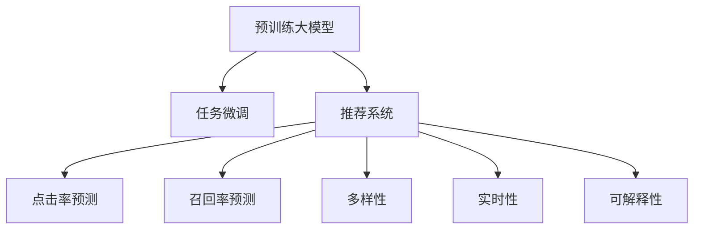

                 

# 电商平台搜索推荐系统的AI 大模型优化：提高系统性能、效率、准确率与多样性

## 1. 背景介绍

### 1.1 问题由来
随着电子商务的迅猛发展，电商平台搜索推荐系统成为提升用户体验、提高转化率、增加销售收入的关键环节。传统搜索推荐系统依赖于手工特征工程、模型训练和调优，开发和维护成本高，难以灵活应对海量数据和多变用户需求。随着AI大模型的兴起，通过自监督预训练并结合任务微调的方法，使得搜索推荐系统更加智能化、高效化。

### 1.2 问题核心关键点
- **数据量**：大规模电商平台搜索推荐系统需要处理海量的数据，这对训练模型的效率和计算资源提出了较高要求。
- **多样性**：推荐系统需要确保推荐结果的多样性，避免单一信息源带来的信息孤岛现象。
- **准确性**：推荐系统应具备高精度的用户行为预测能力，准确把握用户需求，提供满足期望的商品。
- **实时性**：推荐系统需要快速响应用户查询，保持搜索和推荐结果的时效性。
- **可解释性**：推荐系统应具备一定程度的可解释性，帮助用户理解推荐理由，增强信任感。

## 2. 核心概念与联系

### 2.1 核心概念概述

为更好地理解AI大模型在电商平台搜索推荐系统中的应用，本节将介绍几个核心概念：

- **预训练大模型**：以Transformer为代表的大规模语言模型，通过在大规模无标签文本语料上进行自监督预训练，学习到通用的语言表示，具备强大的语言理解和生成能力。
- **任务微调**：在预训练模型的基础上，使用电商平台搜索推荐系统的标注数据，通过有监督地训练优化模型在特定任务上的性能。
- **推荐系统**：通过预测用户的行为，为用户推荐合适的商品或内容，以提升用户体验和业务指标的系统。
- **搜索系统**：根据用户查询，快速返回相关的商品或信息，以满足用户的即时搜索需求。
- **点击率预测**：预测用户点击商品或广告的概率，是推荐系统的重要组成部分。
- **召回率预测**：预测商品或内容被用户检索的概率，是搜索系统的关键性能指标。
- **多样性**：推荐系统应保持推荐结果的多样性，避免推荐的商品或内容过于集中。
- **实时性**：搜索推荐系统需要具备实时处理用户查询的能力，保证查询响应的时效性。
- **可解释性**：推荐系统应具备一定程度的可解释性，帮助用户理解推荐理由，增强信任感。

这些核心概念之间的逻辑关系可以通过以下Mermaid流程图来展示：



这个流程图展示了大模型的核心概念及其之间的关系：

1. 预训练大模型通过自监督学习获取通用的语言表示。
2. 任务微调利用标注数据对预训练模型进行优化，使其适应特定的电商平台搜索推荐任务。
3. 推荐系统通过点击率和召回率的预测，实现商品或内容的推荐。
4. 推荐系统进一步通过多样性控制、实时响应和可解释性增强，满足用户需求。

## 3. 核心算法原理 & 具体操作步骤
### 3.1 算法原理概述

基于预训练大模型的电商平台搜索推荐系统，通过任务微调方法，将预训练模型作为初始化参数，使用电商平台的标注数据进行优化，以适应特定的搜索推荐任务。核心思想是将预训练模型视作一个"特征提取器"，通过有监督学习，调整顶层参数，以提高模型在特定任务上的性能。

具体步骤如下：

1. **数据准备**：收集电商平台的搜索、点击、购买等行为数据，将其标注为训练集。
2. **模型加载**：选择预训练模型，如BERT、GPT-2、ElasticEmbedding等，将其作为特征提取器。
3. **任务适配**：根据任务特点，添加或修改预训练模型的输出层和损失函数。例如，使用多层感知器(MLP)或注意力机制(Attention)作为输出层，交叉熵损失或均方误差损失作为损失函数。
4. **微调训练**：使用标注数据训练模型，最小化损失函数，更新模型参数，直至收敛。
5. **结果评估**：在验证集和测试集上评估模型性能，如点击率、召回率、多样性、实时性等指标。

### 3.2 算法步骤详解

以下详细介绍基于预训练大模型的电商平台搜索推荐系统的算法步骤：

#### 数据准备

- **数据收集**：收集电商平台的用户搜索、点击、购买行为数据，并对其进行标注，形成训练集、验证集和测试集。
- **数据清洗**：处理缺失值、异常值，进行数据归一化和特征工程，提升数据质量。
- **数据划分**：将数据划分为训练集、验证集和测试集，比例为7:2:1，确保模型训练和评估的公正性。

#### 模型加载

- **预训练模型选择**：根据任务特点选择合适的预训练模型，如BERT、GPT-2、ElasticEmbedding等。
- **模型初始化**：加载预训练模型，将其作为特征提取器，保留其大部分权重。

#### 任务适配

- **输出层设计**：根据任务类型设计合适的输出层，如点击率预测使用线性层，召回率预测使用MLP，多样性控制使用注意力机制。
- **损失函数选择**：选择合适的损失函数，如交叉熵损失、均方误差损失等，以衡量模型预测结果与实际标签之间的差异。

#### 微调训练

- **优化器选择**：选择适当的优化器，如AdamW、SGD等，设置学习率、批大小、迭代轮数等超参数。
- **数据增强**：对训练数据进行扩充，如随机回译、数据扰动等，提升模型鲁棒性。
- **正则化**：使用L2正则、Dropout等技术，防止模型过拟合。
- **模型更新**：通过反向传播算法计算损失函数梯度，并更新模型参数。

#### 结果评估

- **性能评估**：在验证集和测试集上评估模型性能，如点击率、召回率、多样性、实时性等指标。
- **调优与迭代**：根据评估结果，调整模型超参数和训练策略，进行迭代优化。

### 3.3 算法优缺点

基于预训练大模型的电商平台搜索推荐系统具有以下优点：

- **高效性**：预训练大模型能够快速适应特定任务，显著缩短模型训练时间。
- **可解释性**：预训练大模型的预训练过程公开透明，其内部机制具有一定的可解释性。
- **性能提升**：预训练大模型在大规模无标签数据上进行预训练，拥有丰富的语义知识和表示能力，能够提高推荐和搜索的准确率。

然而，该方法也存在一些局限性：

- **资源消耗**：预训练大模型需要大量的计算资源和时间，且对硬件设施要求较高。
- **泛化能力**：预训练大模型可能对特定任务或领域的数据泛化能力不足，需要进行任务微调以提升效果。
- **迁移能力**：不同电商平台的数据和业务特性差异较大，预训练模型需要根据具体情况进行适配。

## 4. 数学模型和公式 & 详细讲解  
### 4.1 数学模型构建

基于预训练大模型的电商平台搜索推荐系统的数学模型如下：

假设预训练大模型为 $M_{\theta}$，其中 $\theta$ 为预训练得到的模型参数。给定电商平台搜索推荐任务的标注数据集 $D=\{(x_i,y_i)\}_{i=1}^N$，微调的目标是找到新的模型参数 $\hat{\theta}$，使得：

$$
\hat{\theta}=\mathop{\arg\min}_{\theta} \mathcal{L}(M_{\theta},D)
$$

其中 $\mathcal{L}$ 为针对任务 $T$ 设计的损失函数，用于衡量模型预测输出与真实标签之间的差异。常见的损失函数包括交叉熵损失、均方误差损失等。

### 4.2 公式推导过程

以下以点击率预测任务为例，推导点击率预测模型的损失函数及梯度计算公式。

假设模型 $M_{\theta}$ 在输入 $x$ 上的输出为 $\hat{y}=M_{\theta}(x) \in [0,1]$，表示用户点击的概率。真实标签 $y \in \{0,1\}$。则二分类交叉熵损失函数定义为：

$$
\ell(M_{\theta}(x),y) = -[y\log \hat{y} + (1-y)\log (1-\hat{y})]
$$

将其代入经验风险公式，得：

$$
\mathcal{L}(\theta) = -\frac{1}{N}\sum_{i=1}^N [y_i\log M_{\theta}(x_i)+(1-y_i)\log(1-M_{\theta}(x_i))]
$$

根据链式法则，损失函数对参数 $\theta_k$ 的梯度为：

$$
\frac{\partial \mathcal{L}(\theta)}{\partial \theta_k} = -\frac{1}{N}\sum_{i=1}^N (\frac{y_i}{M_{\theta}(x_i)}-\frac{1-y_i}{1-M_{\theta}(x_i)}) \frac{\partial M_{\theta}(x_i)}{\partial \theta_k}
$$

其中 $\frac{\partial M_{\theta}(x_i)}{\partial \theta_k}$ 可进一步递归展开，利用自动微分技术完成计算。

### 4.3 案例分析与讲解

**案例：电商平台搜索推荐系统的点击率预测**

假设电商平台收集了用户对商品 $i$ 的点击数据 $(x_i,y_i)$，其中 $x_i$ 为商品描述和用户历史行为，$y_i$ 为点击与否。使用预训练模型BERT对商品描述和用户行为进行编码，得到向量表示 $z_i$。点击率预测模型为：

$$
\hat{y} = \sigma(Wz_i + b)
$$

其中 $W$ 和 $b$ 为可训练参数，$\sigma$ 为Sigmoid函数。点击率预测损失函数为：

$$
\mathcal{L}(\theta) = -\frac{1}{N}\sum_{i=1}^N [y_i\log \hat{y} + (1-y_i)\log(1-\hat{y})]
$$

通过反向传播算法，计算损失函数梯度：

$$
\frac{\partial \mathcal{L}(\theta)}{\partial \theta_k} = -\frac{1}{N}\sum_{i=1}^N (\frac{y_i}{\hat{y}}-\frac{1-y_i}{1-\hat{y}}) \frac{\partial M_{\theta}(x_i)}{\partial \theta_k}
$$

使用优化器如AdamW更新模型参数，直至损失函数收敛。

## 5. 项目实践：代码实例和详细解释说明
### 5.1 开发环境搭建

在进行搜索推荐系统的大模型微调实践前，需要准备相应的开发环境。以下是使用Python进行PyTorch开发的环境配置流程：

1. 安装Anaconda：从官网下载并安装Anaconda，用于创建独立的Python环境。

2. 创建并激活虚拟环境：
```bash
conda create -n pytorch-env python=3.8 
conda activate pytorch-env
```

3. 安装PyTorch：根据CUDA版本，从官网获取对应的安装命令。例如：
```bash
conda install pytorch torchvision torchaudio cudatoolkit=11.1 -c pytorch -c conda-forge
```

4. 安装Transformers库：
```bash
pip install transformers
```

5. 安装各类工具包：
```bash
pip install numpy pandas scikit-learn matplotlib tqdm jupyter notebook ipython
```

完成上述步骤后，即可在`pytorch-env`环境中开始搜索推荐系统的开发。

### 5.2 源代码详细实现

下面以点击率预测任务为例，给出使用Transformers库对BERT模型进行微调的PyTorch代码实现。

首先，定义数据处理函数：

```python
from transformers import BertTokenizer
from torch.utils.data import Dataset
import torch

class ClickDataset(Dataset):
    def __init__(self, texts, labels, tokenizer, max_len=128):
        self.texts = texts
        self.labels = labels
        self.tokenizer = tokenizer
        self.max_len = max_len
        
    def __len__(self):
        return len(self.texts)
    
    def __getitem__(self, item):
        text = self.texts[item]
        label = self.labels[item]
        
        encoding = self.tokenizer(text, return_tensors='pt', max_length=self.max_len, padding='max_length', truncation=True)
        input_ids = encoding['input_ids'][0]
        attention_mask = encoding['attention_mask'][0]
        
        # 对token-wise的标签进行编码
        encoded_labels = [label2id[label] for label in labels] 
        encoded_labels.extend([label2id['None']] * (self.max_len - len(encoded_labels)))
        labels = torch.tensor(encoded_labels, dtype=torch.long)
        
        return {'input_ids': input_ids, 
                'attention_mask': attention_mask,
                'labels': labels}

# 标签与id的映射
label2id = {'0': 0, '1': 1, 'None': 2}
id2label = {v: k for k, v in label2id.items()}

# 创建dataset
tokenizer = BertTokenizer.from_pretrained('bert-base-cased')

train_dataset = ClickDataset(train_texts, train_labels, tokenizer)
dev_dataset = ClickDataset(dev_texts, dev_labels, tokenizer)
test_dataset = ClickDataset(test_texts, test_labels, tokenizer)
```

然后，定义模型和优化器：

```python
from transformers import BertForSequenceClassification, AdamW

model = BertForSequenceClassification.from_pretrained('bert-base-cased', num_labels=len(label2id))

optimizer = AdamW(model.parameters(), lr=2e-5)
```

接着，定义训练和评估函数：

```python
from torch.utils.data import DataLoader
from tqdm import tqdm
from sklearn.metrics import roc_auc_score

device = torch.device('cuda') if torch.cuda.is_available() else torch.device('cpu')
model.to(device)

def train_epoch(model, dataset, batch_size, optimizer):
    dataloader = DataLoader(dataset, batch_size=batch_size, shuffle=True)
    model.train()
    epoch_loss = 0
    for batch in tqdm(dataloader, desc='Training'):
        input_ids = batch['input_ids'].to(device)
        attention_mask = batch['attention_mask'].to(device)
        labels = batch['labels'].to(device)
        model.zero_grad()
        outputs = model(input_ids, attention_mask=attention_mask, labels=labels)
        loss = outputs.loss
        epoch_loss += loss.item()
        loss.backward()
        optimizer.step()
    return epoch_loss / len(dataloader)

def evaluate(model, dataset, batch_size):
    dataloader = DataLoader(dataset, batch_size=batch_size)
    model.eval()
    preds, labels = [], []
    with torch.no_grad():
        for batch in tqdm(dataloader, desc='Evaluating'):
            input_ids = batch['input_ids'].to(device)
            attention_mask = batch['attention_mask'].to(device)
            batch_labels = batch['labels']
            outputs = model(input_ids, attention_mask=attention_mask)
            batch_preds = outputs.logits.argmax(dim=1).to('cpu').tolist()
            batch_labels = batch_labels.to('cpu').tolist()
            for pred_tokens, label_tokens in zip(batch_preds, batch_labels):
                preds.append(pred_tokens)
                labels.append(label_tokens)
                
    print('ROC-AUC:', roc_auc_score(labels, preds))
```

最后，启动训练流程并在测试集上评估：

```python
epochs = 5
batch_size = 16

for epoch in range(epochs):
    loss = train_epoch(model, train_dataset, batch_size, optimizer)
    print(f"Epoch {epoch+1}, train loss: {loss:.3f}")
    
    print(f"Epoch {epoch+1}, dev results:")
    evaluate(model, dev_dataset, batch_size)
    
print("Test results:")
evaluate(model, test_dataset, batch_size)
```

以上就是使用PyTorch对BERT进行点击率预测任务的微调代码实现。可以看到，由于Transformers库的强大封装，我们可以用相对简洁的代码完成BERT模型的加载和微调。

### 5.3 代码解读与分析

让我们再详细解读一下关键代码的实现细节：

**ClickDataset类**：
- `__init__`方法：初始化文本、标签、分词器等关键组件。
- `__len__`方法：返回数据集的样本数量。
- `__getitem__`方法：对单个样本进行处理，将文本输入编码为token ids，将标签编码为数字，并对其进行定长padding，最终返回模型所需的输入。

**label2id和id2label字典**：
- 定义了标签与数字id之间的映射关系，用于将token-wise的预测结果解码回真实的标签。

**训练和评估函数**：
- 使用PyTorch的DataLoader对数据集进行批次化加载，供模型训练和推理使用。
- 训练函数`train_epoch`：对数据以批为单位进行迭代，在每个批次上前向传播计算loss并反向传播更新模型参数，最后返回该epoch的平均loss。
- 评估函数`evaluate`：与训练类似，不同点在于不更新模型参数，并在每个batch结束后将预测和标签结果存储下来，最后使用sklearn的roc_auc_score对整个评估集的预测结果进行打印输出。

**训练流程**：
- 定义总的epoch数和batch size，开始循环迭代
- 每个epoch内，先在训练集上训练，输出平均loss
- 在验证集上评估，输出ROC-AUC
- 所有epoch结束后，在测试集上评估，给出最终的预测结果

可以看到，PyTorch配合Transformers库使得BERT微调的代码实现变得简洁高效。开发者可以将更多精力放在数据处理、模型改进等高层逻辑上，而不必过多关注底层的实现细节。

当然，工业级的系统实现还需考虑更多因素，如模型的保存和部署、超参数的自动搜索、更灵活的任务适配层等。但核心的微调范式基本与此类似。

## 6. 实际应用场景
### 6.1 智能推荐系统

基于预训练大模型的电商平台搜索推荐系统，可以广泛应用于智能推荐系统的构建。传统推荐系统往往依赖于手工特征工程、模型训练和调优，开发和维护成本高，难以灵活应对海量数据和多变用户需求。而使用预训练大模型进行微调，可以显著缩短开发周期，提升模型性能。

在技术实现上，可以收集用户的历史行为数据，如浏览、点击、购买等，将其标注为训练集。在此基础上对预训练模型进行微调，使其学习到用户行为和商品属性之间的关系，从而提高推荐系统的准确性和多样性。通过微调后的推荐系统，可以实时获取用户最新的行为数据，并进行动态推荐，确保推荐结果的时效性。

### 6.2 实时搜索系统

电商平台需要构建实时搜索系统，快速响应用户查询，提供符合期望的商品或信息。传统搜索系统依赖于规则引擎和查询解析器，难以处理复杂的查询语义和动态需求。而基于预训练大模型的搜索系统，可以更好地理解用户意图，生成更加精准的搜索结果。

具体而言，可以通过微调BERT模型，使其具备对自然语言查询的语义理解能力。在用户查询时，对查询进行编码，输入到微调后的模型中进行编码，生成向量表示。通过比较查询向量与商品向量的余弦相似度，获取最相关的商品，进行动态推荐。通过预训练大模型的实时搜索系统，可以大大提升搜索的准确性和响应速度。

### 6.3 广告投放系统

广告投放系统是电商平台的另一个重要环节，通过精准投放广告，提升广告效果和转化率。传统广告投放依赖于人工规则和定向策略，难以覆盖广泛的用户群体。而基于预训练大模型的广告投放系统，可以更灵活地进行定向和优化。

具体而言，可以收集用户的历史行为数据，如点击、浏览、搜索等，将其标注为训练集。在此基础上对预训练模型进行微调，使其学习到用户兴趣和广告特征之间的关系。通过微调后的模型，可以实时获取用户的行为数据，并进行动态广告投放，确保广告的精准性和相关性。通过预训练大模型的广告投放系统，可以大幅提升广告的点击率和转化率。

### 6.4 未来应用展望

随着预训练大模型和任务微调方法的不断发展，基于预训练大模型的电商平台搜索推荐系统将呈现以下几个发展趋势：

1. **模型规模持续增大**：随着算力成本的下降和数据规模的扩张，预训练语言模型的参数量还将持续增长。超大规模语言模型蕴含的丰富语言知识，有望支撑更加复杂多变的推荐和搜索任务。

2. **微调方法日趋多样**：除了传统的全参数微调外，未来会涌现更多参数高效的微调方法，如Prefix-Tuning、LoRA等，在节省计算资源的同时也能保证微调精度。

3. **持续学习成为常态**：随着数据分布的不断变化，微调模型也需要持续学习新知识以保持性能。如何在不遗忘原有知识的同时，高效吸收新样本信息，将成为重要的研究课题。

4. **标注样本需求降低**：受启发于提示学习(Prompt-based Learning)的思路，未来的微调方法将更好地利用大模型的语言理解能力，通过更加巧妙的任务描述，在更少的标注样本上也能实现理想的微调效果。

5. **多模态微调崛起**：当前的微调主要聚焦于纯文本数据，未来会进一步拓展到图像、视频、语音等多模态数据微调。多模态信息的融合，将显著提升语言模型对现实世界的理解和建模能力。

6. **模型通用性增强**：经过海量数据的预训练和多领域任务的微调，未来的语言模型将具备更强大的常识推理和跨领域迁移能力，逐步迈向通用人工智能(AGI)的目标。

以上趋势凸显了预训练大模型微调技术的广阔前景。这些方向的探索发展，必将进一步提升电商平台搜索推荐系统的性能和应用范围，为电子商务行业带来变革性影响。

## 7. 工具和资源推荐
### 7.1 学习资源推荐

为了帮助开发者系统掌握预训练大模型在电商平台搜索推荐系统中的应用，这里推荐一些优质的学习资源：

1. 《Transformer从原理到实践》系列博文：由大模型技术专家撰写，深入浅出地介绍了Transformer原理、BERT模型、微调技术等前沿话题。

2. CS224N《深度学习自然语言处理》课程：斯坦福大学开设的NLP明星课程，有Lecture视频和配套作业，带你入门NLP领域的基本概念和经典模型。

3. 《Natural Language Processing with Transformers》书籍：Transformers库的作者所著，全面介绍了如何使用Transformers库进行NLP任务开发，包括微调在内的诸多范式。

4. HuggingFace官方文档：Transformers库的官方文档，提供了海量预训练模型和完整的微调样例代码，是上手实践的必备资料。

5. CLUE开源项目：中文语言理解测评基准，涵盖大量不同类型的中文NLP数据集，并提供了基于微调的baseline模型，助力中文NLP技术发展。

通过对这些资源的学习实践，相信你一定能够快速掌握预训练大模型在电商平台搜索推荐系统中的应用，并用于解决实际的NLP问题。
###  7.2 开发工具推荐

高效的开发离不开优秀的工具支持。以下是几款用于预训练大模型微调开发的常用工具：

1. PyTorch：基于Python的开源深度学习框架，灵活动态的计算图，适合快速迭代研究。大部分预训练语言模型都有PyTorch版本的实现。

2. TensorFlow：由Google主导开发的开源深度学习框架，生产部署方便，适合大规模工程应用。同样有丰富的预训练语言模型资源。

3. Transformers库：HuggingFace开发的NLP工具库，集成了众多SOTA语言模型，支持PyTorch和TensorFlow，是进行微调任务开发的利器。

4. Weights & Biases：模型训练的实验跟踪工具，可以记录和可视化模型训练过程中的各项指标，方便对比和调优。与主流深度学习框架无缝集成。

5. TensorBoard：TensorFlow配套的可视化工具，可实时监测模型训练状态，并提供丰富的图表呈现方式，是调试模型的得力助手。

6. Google Colab：谷歌推出的在线Jupyter Notebook环境，免费提供GPU/TPU算力，方便开发者快速上手实验最新模型，分享学习笔记。

合理利用这些工具，可以显著提升预训练大模型微调任务的开发效率，加快创新迭代的步伐。

### 7.3 相关论文推荐

预训练大模型和微调技术的发展源于学界的持续研究。以下是几篇奠基性的相关论文，推荐阅读：

1. Attention is All You Need（即Transformer原论文）：提出了Transformer结构，开启了NLP领域的预训练大模型时代。

2. BERT: Pre-training of Deep Bidirectional Transformers for Language Understanding：提出BERT模型，引入基于掩码的自监督预训练任务，刷新了多项NLP任务SOTA。

3. Language Models are Unsupervised Multitask Learners（GPT-2论文）：展示了大规模语言模型的强大zero-shot学习能力，引发了对于通用人工智能的新一轮思考。

4. Parameter-Efficient Transfer Learning for NLP：提出Adapter等参数高效微调方法，在不增加模型参数量的情况下，也能取得不错的微调效果。

5. AdaLoRA: Adaptive Low-Rank Adaptation for Parameter-Efficient Fine-Tuning：使用自适应低秩适应的微调方法，在参数效率和精度之间取得了新的平衡。

这些论文代表了大模型微调技术的发展脉络。通过学习这些前沿成果，可以帮助研究者把握学科前进方向，激发更多的创新灵感。

## 8. 总结：未来发展趋势与挑战
### 8.1 总结

本文对基于预训练大模型的电商平台搜索推荐系统的优化进行了全面系统的介绍。首先阐述了预训练大模型和微调技术的研究背景和意义，明确了预训练大模型在电商平台搜索推荐系统中的应用价值。其次，从原理到实践，详细讲解了预训练大模型的优化方法，给出了搜索推荐任务的微调代码实现。同时，本文还广泛探讨了微调方法在智能推荐、实时搜索、广告投放等电商场景中的应用前景，展示了预训练大模型的强大潜力。此外，本文精选了预训练大模型的各类学习资源，力求为读者提供全方位的技术指引。

通过本文的系统梳理，可以看到，基于预训练大模型的电商平台搜索推荐系统正在成为电商领域的重要范式，极大地提升了用户体验和业务指标。得益于预训练大模型的强大性能和灵活性，搜索推荐系统的优化空间巨大，未来将迎来更多的突破和应用。

### 8.2 未来发展趋势

展望未来，预训练大模型微调技术将呈现以下几个发展趋势：

1. **模型规模持续增大**：随着算力成本的下降和数据规模的扩张，预训练语言模型的参数量还将持续增长。超大规模语言模型蕴含的丰富语言知识，有望支撑更加复杂多变的推荐和搜索任务。

2. **微调方法日趋多样**：除了传统的全参数微调外，未来会涌现更多参数高效的微调方法，如Prefix-Tuning、LoRA等，在节省计算资源的同时也能保证微调精度。

3. **持续学习成为常态**：随着数据分布的不断变化，微调模型也需要持续学习新知识以保持性能。如何在不遗忘原有知识的同时，高效吸收新样本信息，将成为重要的研究课题。

4. **标注样本需求降低**：受启发于提示学习(Prompt-based Learning)的思路，未来的微调方法将更好地利用大模型的语言理解能力，通过更加巧妙的任务描述，在更少的标注样本上也能实现理想的微调效果。

5. **多模态微调崛起**：当前的微调主要聚焦于纯文本数据，未来会进一步拓展到图像、视频、语音等多模态数据微调。多模态信息的融合，将显著提升语言模型对现实世界的理解和建模能力。

6. **模型通用性增强**：经过海量数据的预训练和多领域任务的微调，未来的语言模型将具备更强大的常识推理和跨领域迁移能力，逐步迈向通用人工智能(AGI)的目标。

以上趋势凸显了预训练大模型微调技术的广阔前景。这些方向的探索发展，必将进一步提升电商平台搜索推荐系统的性能和应用范围，为电子商务行业带来变革性影响。

### 8.3 面临的挑战

尽管预训练大模型微调技术已经取得了瞩目成就，但在迈向更加智能化、普适化应用的过程中，它仍面临着诸多挑战：

1. **资源消耗**：预训练大模型需要大量的计算资源和时间，且对硬件设施要求较高。

2. **泛化能力**：预训练大模型可能对特定任务或领域的数据泛化能力不足，需要进行任务微调以提升效果。

3. **迁移能力**：不同电商平台的数据和业务特性差异较大，预训练模型需要根据具体情况进行适配。

4. **标注样本依赖**：微调模型需要大量的标注数据进行训练，获取高质量标注数据的成本较高。

5. **模型鲁棒性**：预训练大模型可能对噪声数据或对抗样本敏感，需要进行鲁棒性增强。

6. **公平性**：预训练大模型可能存在偏差，需要进行公平性校准，确保推荐结果的公平性和公正性。

7. **隐私保护**：电商平台的搜索推荐系统需要处理大量用户数据，需确保数据隐私和安全。

8. **可解释性**：预训练大模型的决策过程难以解释，需要提供更强的可解释性。

9. **实时性**：预训练大模型需要实时处理用户查询，需确保系统的响应速度和处理效率。

以上挑战需要综合考虑技术、算法、工程等多个维度，进行全面的优化和改进。唯有在资源、算法、工程等多方面协同发力，才能真正实现预训练大模型在电商平台搜索推荐系统中的应用价值。

### 8.4 研究展望

面对预训练大模型微调技术所面临的挑战，未来的研究需要在以下几个方面寻求新的突破：

1. **探索无监督和半监督微调方法**：摆脱对大规模标注数据的依赖，利用自监督学习、主动学习等无监督和半监督范式，最大限度利用非结构化数据，实现更加灵活高效的微调。

2. **研究参数高效和计算高效的微调范式**：开发更加参数高效的微调方法，在固定大部分预训练参数的同时，只更新极少量的任务相关参数。同时优化微调模型的计算图，减少前向传播和反向传播的资源消耗，实现更加轻量级、实时性的部署。

3. **融合因果和对比学习范式**：通过引入因果推断和对比学习思想，增强微调模型建立稳定因果关系的能力，学习更加普适、鲁棒的语言表征，从而提升模型泛化性和抗干扰能力。

4. **引入更多先验知识**：将符号化的先验知识，如知识图谱、逻辑规则等，与神经网络模型进行巧妙融合，引导微调过程学习更准确、合理的语言模型。同时加强不同模态数据的整合，实现视觉、语音等多模态信息与文本信息的协同建模。

5. **结合因果分析和博弈论工具**：将因果分析方法引入微调模型，识别出模型决策的关键特征，增强输出解释的因果性和逻辑性。借助博弈论工具刻画人机交互过程，主动探索并规避模型的脆弱点，提高系统稳定性。

6. **纳入伦理道德约束**：在模型训练目标中引入伦理导向的评估指标，过滤和惩罚有偏见、有害的输出倾向。同时加强人工干预和审核，建立模型行为的监管机制，确保输出符合人类价值观和伦理道德。

这些研究方向的探索，必将引领预训练大模型微调技术迈向更高的台阶，为构建安全、可靠、可解释、可控的智能系统铺平道路。面向未来，预训练大模型微调技术还需要与其他人工智能技术进行更深入的融合，如知识表示、因果推理、强化学习等，多路径协同发力，共同推动自然语言理解和智能交互系统的进步。只有勇于创新、敢于突破，才能不断拓展语言模型的边界，让智能技术更好地造福人类社会。

## 9. 附录：常见问题与解答

**Q1：预训练大模型微调是否适用于所有电商平台搜索推荐任务？**

A: 预训练大模型微调在大多数电商平台搜索推荐任务上都能取得不错的效果，特别是对于数据量较小的任务。但对于一些特定领域的任务，如医学、法律等，仅仅依靠通用语料预训练的模型可能难以很好地适应。此时需要在特定领域语料上进一步预训练，再进行微调，才能获得理想效果。此外，对于一些需要时效性、个性化很强的任务，如对话、推荐等，微调方法也需要针对性的改进优化。

**Q2：如何选择预训练大模型进行微调？**

A: 选择预训练大模型进行微调，需要考虑以下几个因素：

1. **任务类型**：根据任务类型选择适合的预训练模型。例如，点击率预测任务适合使用BERT等结构化模型，而对话系统适合使用GPT等生成模型。

2. **数据规模**：根据数据规模选择模型大小。例如，大规模语料适合使用大模型，小规模语料适合使用小模型。

3. **计算资源**：根据计算资源选择模型大小。例如，GPU资源丰富的平台适合使用大模型，资源受限的平台适合使用小模型。

4. **可解释性**：根据可解释性需求选择模型大小。例如，需要可解释性的任务适合使用小模型，需要高精度的任务适合使用大模型。

5. **技术成熟度**：根据技术成熟度选择模型大小。例如，新发布的模型可能存在一些未知问题，需要逐步迭代优化。

**Q3：微调过程中如何避免过拟合？**

A: 微调过程中避免过拟合的方法有以下几种：

1. **数据增强**：通过数据增强技术，如随机回译、数据扰动等，扩充训练集。

2. **正则化**：使用L2正则、Dropout等技术，防止模型过拟合。

3. **早停策略**：设置早停策略，一旦验证集上的损失不再下降，立即停止训练。

4. **参数共享**：使用共享参数技术，将部分参数固定，只微调顶层。

5. **对抗训练**：加入对抗样本，提高模型鲁棒性。

6. **随机初始化**：使用随机初始化技术，随机初始化模型参数。

**Q4：微调模型在落地部署时需要注意哪些问题？**

A: 将微调模型转化为实际应用，还需要考虑以下问题：

1. **模型裁剪**：去除不必要的层和参数，减小模型尺寸，加快推理速度。

2. **量化加速**：将浮点模型转为定点模型，压缩存储空间，提高计算效率。

3. **服务化封装**：将模型封装为标准化服务接口，便于集成调用。

4. **弹性伸缩**：根据请求流量动态调整资源配置，平衡服务质量和成本。

5. **监控告警**：实时采集系统指标，设置异常告警阈值，确保服务稳定性。

6. **安全防护**：采用访问鉴权、数据脱敏等措施，保障数据和模型安全。

**Q5：如何评估预训练大模型的搜索推荐性能？**

A: 评估预训练大模型的搜索推荐性能，可以从以下几个方面进行：

1. **准确率**：评估模型预测的准确性，例如点击率预测的准确率、召回率等。

2. **多样性**：评估推荐结果的多样性，例如推荐结果的覆盖面、热门度和多样性等。

3. **实时性**：评估系统响应的实时性，例如系统延迟、响应速度等。

4. **可解释性**：评估模型的可解释性，例如推荐理由的合理性和可理解性。

5. **用户满意度**：评估用户的满意度，例如用户反馈、点击率、转化率等。

综上所述，预训练大模型在电商平台搜索推荐系统中的应用，已经取得了显著的进展和应用效果。未来的研究将继续在模型规模、微调方法、应用场景等方面进行深入探索，推动自然语言理解和智能交互系统的不断进步。

