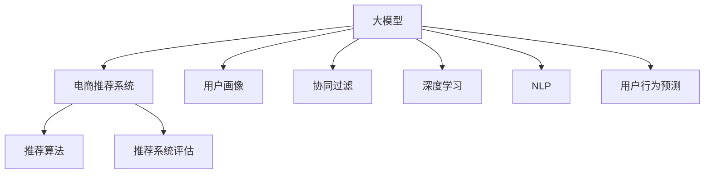

                 

# 电商平台搜索推荐系统的AI 大模型应用：应对数据规模与实时性的双重挑战

> 关键词：电商平台, 搜索推荐, AI大模型, 数据规模, 实时性, 深度学习, 自然语言处理

## 1. 背景介绍

### 1.1 问题由来
随着电商平台的迅速发展，用户搜索和推荐需求呈现出爆发式增长。如何高效、精准地满足用户需求，成为了各大电商平台的共同挑战。传统推荐系统以协同过滤、基于内容的推荐为主，难以充分考虑用户的多样化和个性化需求。

近年来，大模型在电商平台的搜索推荐中得到了广泛应用，显著提升了用户体验和平台收益。大模型通过学习海量数据，能捕捉复杂用户行为和商品特征，提供更精准、个性化的搜索结果和推荐内容。

### 1.2 问题核心关键点
大模型在电商平台搜索推荐中的核心问题包括：
1. 如何处理海量数据，提升模型训练和推理效率？
2. 如何平衡模型精度和实时性，确保推荐服务响应及时？
3. 如何增强模型的泛化能力和鲁棒性，应对新用户和商品？
4. 如何利用多模态数据，提升推荐系统的综合效果？
5. 如何优化模型的计算资源使用，降低平台成本？

### 1.3 问题研究意义
研究大模型在电商平台搜索推荐中的应用，对于提升电商平台的推荐质量、用户体验和运营效率具有重要意义：

1. 提升推荐精准度：通过深度学习模型，能够更好地理解和建模用户行为，提供个性化推荐。
2. 优化用户体验：精准推荐能够提高用户满意度，增加平台粘性。
3. 增加平台收益：个性化推荐能有效提高转化率、提升客单价，提升平台整体收益。
4. 推动技术创新：通过优化大模型在电商平台的部署和应用，能够推动AI技术在商业场景中的落地和应用。

## 2. 核心概念与联系

### 2.1 核心概念概述

为更好地理解大模型在电商平台搜索推荐系统中的应用，本节将介绍几个密切相关的核心概念：

- 大模型(Large Model)：如BERT、GPT、XLNet等，通过大规模数据预训练得到的深度神经网络模型。具备强大的语言理解和生成能力。
- 电商推荐系统(e-Commerce Recommendation System)：利用用户历史行为数据、商品特征、实时数据等，为用户提供个性化推荐服务的系统。
- 用户画像(User Profile)：根据用户历史行为、点击记录、浏览记录等，构建用户行为特征，用于个性化推荐。
- 协同过滤(Collaborative Filtering)：基于用户与商品之间的相似性，进行推荐。常见方法包括基于用户的协同过滤和基于商品的协同过滤。
- 深度学习(Deep Learning)：通过构建多层神经网络，利用数据特征进行复杂模式的建模和预测。
- 自然语言处理(Natural Language Processing, NLP)：利用深度学习技术处理和分析自然语言文本，提取语义信息。
- 用户行为预测(Predictive Analytics)：利用用户历史数据，预测用户未来行为，提升推荐效果。
- 推荐算法(Recommandation Algorithms)：结合用户画像、商品特征、实时数据等，构建推荐模型，提供个性化推荐。
- 推荐系统评估(Metrics for Recommendation System)：评估推荐算法效果的关键指标，如准确率、召回率、覆盖率等。

这些核心概念之间的逻辑关系可以通过以下Mermaid流程图来展示：



这个流程图展示了大模型在电商推荐系统中的核心概念及其之间的关系：

1. 大模型通过预训练获得基础能力。
2. 电商推荐系统基于大模型的能力和用户数据，提供个性化推荐。
3. 用户画像和大模型协同，更好地理解和建模用户行为。
4. 协同过滤和大模型结合，提升推荐效果。
5. 深度学习和NLP技术，丰富了电商推荐系统的数据类型。
6. 用户行为预测和大模型结合，提升了推荐系统的精准度。
7. 推荐算法和大模型配合，构建推荐模型。
8. 推荐系统评估，对推荐算法效果进行评估。

这些概念共同构成了大模型在电商推荐系统中的学习框架，使其能够更好地处理电商场景的复杂需求。

## 3. 核心算法原理 & 具体操作步骤
### 3.1 算法原理概述

大模型在电商平台搜索推荐系统中的应用，本质上是一个复杂的预测问题。其核心思想是：利用大模型学习海量数据，构建用户行为和商品特征的表示，结合推荐算法进行预测，生成个性化推荐结果。

形式化地，假设电商平台有 $N$ 个用户 $U=\{u_1,u_2,...,u_N\}$，$m$ 个商品 $I=\{i_1,i_2,...,i_m\}$，用户历史行为数据 $D=\{d_{ui}\}$，其中 $d_{ui}$ 表示用户 $u_i$ 对商品 $i_j$ 的操作记录。电商推荐系统的目标是通过深度学习模型，预测用户 $u_i$ 对商品 $i_j$ 的兴趣程度，从而提供个性化的推荐结果。

假设模型的输入为 $x_{ui}=\{x_i,d_{ui}\}$，表示用户 $u_i$ 与商品 $i_j$ 相关的特征向量。模型输出为 $y_{ui}$，表示用户 $u_i$ 对商品 $i_j$ 的兴趣程度。则推荐系统的目标是最小化预测误差：

$$
\min_{\theta} \sum_{ui} L(y_{ui},\hat{y}_{ui})
$$

其中 $L$ 为损失函数，通常使用均方误差损失或交叉熵损失。

### 3.2 算法步骤详解

大模型在电商平台搜索推荐系统中的应用一般包括以下几个关键步骤：

**Step 1: 数据预处理和特征工程**
- 收集电商平台的业务数据，包括用户历史行为、商品信息、实时数据等。
- 对数据进行清洗、标准化、归一化等预处理操作。
- 设计合适的特征提取策略，将原始数据转换为模型的输入特征。

**Step 2: 构建用户画像**
- 利用用户历史行为数据，构建用户行为特征，如购买记录、浏览记录、点击记录等。
- 结合用户画像和大模型，提取用户行为和商品特征的表示。

**Step 3: 选择推荐算法**
- 根据电商推荐系统的需求，选择合适的推荐算法，如协同过滤、基于内容的推荐、混合推荐等。
- 设计推荐算法的输入和输出接口，与大模型进行数据交互。

**Step 4: 训练和优化模型**
- 将电商数据集划分为训练集、验证集和测试集，进行模型训练和优化。
- 使用大模型对输入特征进行映射，生成用户行为和商品特征的表示。
- 结合推荐算法，进行推荐结果的生成和排序。

**Step 5: 部署和评估**
- 将训练好的模型部署到电商平台的推荐服务中，进行实时推荐。
- 根据推荐系统评估指标，如准确率、召回率、覆盖率等，评估模型效果。
- 根据反馈数据，进行模型调优，提升推荐效果。

以上是使用大模型在电商平台搜索推荐系统中的基本流程。在实际应用中，还需要针对具体任务和平台特点，对微调过程进行优化设计，如改进训练目标函数、引入更多的正则化技术、搜索最优的超参数组合等，以进一步提升模型性能。

### 3.3 算法优缺点

使用大模型在电商平台搜索推荐系统中，具有以下优点：
1. 强大的学习能力：大模型通过预训练获得了丰富的语言和知识表示，能更好地理解和建模用户行为和商品特征。
2. 广泛的适用性：大模型适用于多种电商推荐场景，如个性化推荐、搜索排序、商品分类等。
3. 自动化特征提取：大模型自动提取输入特征，减少了人工特征工程的工作量。
4. 高效的推理能力：大模型通常具有高效的计算图和推理算法，能够快速生成推荐结果。

同时，该方法也存在一定的局限性：
1. 依赖标注数据：大模型的预训练和微调过程需要大量的标注数据，获取高质量标注数据的成本较高。
2. 数据隐私问题：电商推荐系统需要收集用户数据，可能涉及用户隐私保护问题。
3. 过拟合风险：大模型可能对数据集中的噪声和异常点过于敏感，导致过拟合。
4. 资源消耗高：大模型需要大量的计算资源进行训练和推理，成本较高。
5. 模型可解释性不足：大模型通常缺乏可解释性，难以对其内部机制进行理解和调试。

尽管存在这些局限性，但就目前而言，使用大模型在电商推荐系统中的应用范式仍然是最主流的方法。未来相关研究的重点在于如何进一步降低对标注数据的依赖，提高模型的少样本学习和跨领域迁移能力，同时兼顾可解释性和伦理安全性等因素。

### 3.4 算法应用领域

使用大模型在电商平台搜索推荐系统中的应用，已经在许多电商企业得到了广泛应用，覆盖了商品推荐、搜索排序、商品分类、个性化广告等多个业务场景。具体应用包括：

- **个性化推荐**：根据用户行为数据，为用户推荐可能感兴趣的商品。
- **搜索排序**：根据用户输入的查询，对搜索结果进行排序，提升搜索体验。
- **商品分类**：对商品进行语义分类，便于推荐和搜索。
- **个性化广告**：根据用户行为和兴趣，推送个性化广告。
- **智能客服**：通过大模型提供智能客服功能，提升用户满意度。

除了这些核心应用外，大模型在电商推荐系统中的应用还在不断扩展，如利用多模态数据进行推荐、基于用户画像生成虚拟试穿效果等，为电商推荐系统带来了更多的可能性。

## 4. 数学模型和公式 & 详细讲解 & 举例说明
### 4.1 数学模型构建

本节将使用数学语言对大模型在电商平台搜索推荐系统中的应用进行更加严格的刻画。

假设电商平台有 $N$ 个用户 $U=\{u_1,u_2,...,u_N\}$，$m$ 个商品 $I=\{i_1,i_2,...,i_m\}$，用户历史行为数据 $D=\{d_{ui}\}$，其中 $d_{ui}$ 表示用户 $u_i$ 对商品 $i_j$ 的操作记录。假设用户行为表示为 $x_{ui}=\{x_i,d_{ui}\}$，其中 $x_i$ 为商品特征向量，$d_{ui}$ 为用户的交互向量。

定义推荐模型 $M_{\theta}:\mathcal{X} \rightarrow \mathcal{Y}$，其中 $\mathcal{X}$ 为输入特征空间，$\mathcal{Y}$ 为输出空间。模型的参数为 $\theta$。

假设推荐模型的输出为 $y_{ui}$，表示用户 $u_i$ 对商品 $i_j$ 的兴趣程度。则推荐系统的目标是最小化预测误差：

$$
\min_{\theta} \sum_{ui} L(y_{ui},\hat{y}_{ui})
$$

其中 $L$ 为损失函数，通常使用均方误差损失或交叉熵损失。

### 4.2 公式推导过程

以下我们以均方误差损失为例，推导推荐模型的训练目标。

假设推荐模型的输出为 $y_{ui}$，表示用户 $u_i$ 对商品 $i_j$ 的兴趣程度。则均方误差损失为：

$$
L(y_{ui},\hat{y}_{ui}) = \frac{1}{N} \sum_{ui} (y_{ui} - \hat{y}_{ui})^2
$$

将上述损失函数代入目标函数，得：

$$
\min_{\theta} \sum_{ui} (y_{ui} - M_{\theta}(x_{ui},d_{ui}))^2
$$

通过梯度下降等优化算法，更新模型参数 $\theta$，最小化损失函数。在训练过程中，模型将自动学习用户行为和商品特征的表示，并结合推荐算法进行预测和排序，最终生成推荐结果。

### 4.3 案例分析与讲解

以淘宝平台为例，展示如何使用大模型进行个性化推荐。

**数据集准备**：
- 收集用户历史行为数据，包括点击、购买、浏览记录等。
- 收集商品信息，包括商品名称、价格、描述等。
- 将数据进行清洗、标准化、归一化等预处理操作。

**特征提取**：
- 利用大模型提取用户行为和商品特征的表示。
- 设计合适的特征提取策略，将原始数据转换为模型的输入特征。

**模型构建**：
- 选择协同过滤或基于内容的推荐算法，设计推荐算法的输入和输出接口。
- 将推荐算法与大模型进行数据交互，生成推荐结果。

**模型训练与优化**：
- 将电商数据集划分为训练集、验证集和测试集，进行模型训练和优化。
- 使用大模型对输入特征进行映射，生成用户行为和商品特征的表示。
- 结合推荐算法，进行推荐结果的生成和排序。

**模型评估与调优**：
- 根据推荐系统评估指标，如准确率、召回率、覆盖率等，评估模型效果。
- 根据反馈数据，进行模型调优，提升推荐效果。

## 5. 项目实践：代码实例和详细解释说明
### 5.1 开发环境搭建

在进行大模型在电商平台搜索推荐系统中的应用实践前，我们需要准备好开发环境。以下是使用Python进行TensorFlow开发的环境配置流程：

1. 安装Anaconda：从官网下载并安装Anaconda，用于创建独立的Python环境。

2. 创建并激活虚拟环境：
```bash
conda create -n tf-env python=3.8 
conda activate tf-env
```

3. 安装TensorFlow：根据CUDA版本，从官网获取对应的安装命令。例如：
```bash
conda install tensorflow -c tf -c conda-forge
```

4. 安装各类工具包：
```bash
pip install numpy pandas scikit-learn matplotlib tqdm jupyter notebook ipython
```

完成上述步骤后，即可在`tf-env`环境中开始应用实践。

### 5.2 源代码详细实现

下面我们以淘宝平台为例，展示如何使用TensorFlow进行大模型在电商推荐系统中的应用。

**数据集准备**：
- 收集用户历史行为数据，包括点击、购买、浏览记录等。
- 收集商品信息，包括商品名称、价格、描述等。
- 将数据进行清洗、标准化、归一化等预处理操作。

**特征提取**：
- 利用TensorFlow Hub加载预训练的BERT模型，提取用户行为和商品特征的表示。
- 设计合适的特征提取策略，将原始数据转换为模型的输入特征。

**模型构建**：
- 选择协同过滤或基于内容的推荐算法，设计推荐算法的输入和输出接口。
- 将推荐算法与大模型进行数据交互，生成推荐结果。

**模型训练与优化**：
- 将电商数据集划分为训练集、验证集和测试集，进行模型训练和优化。
- 使用TensorFlow的Keras API构建推荐模型，定义损失函数和优化器。
- 将用户行为和商品特征的表示输入模型，生成推荐结果。

**模型评估与调优**：
- 根据推荐系统评估指标，如准确率、召回率、覆盖率等，评估模型效果。
- 根据反馈数据，进行模型调优，提升推荐效果。

**代码实现**：

```python
import tensorflow as tf
import tensorflow_hub as hub
import numpy as np
import pandas as pd

# 加载预训练的BERT模型
model = hub.KerasLayer('https://tfhub.dev/google/bert-base-chinese-wwm-ext/1', input_shape=[128])

# 特征提取
def featurize(user_data, item_data):
    user_features = model(user_data)
    item_features = model(item_data)
    return user_features, item_features

# 构建推荐模型
class RecommendationModel(tf.keras.Model):
    def __init__(self):
        super(RecommendationModel, self).__init__()
        self.dense1 = tf.keras.layers.Dense(128, activation='relu')
        self.dense2 = tf.keras.layers.Dense(1, activation='sigmoid')

    def call(self, inputs):
        user_features, item_features = inputs
        x = tf.concat([user_features, item_features], axis=1)
        x = self.dense1(x)
        x = self.dense2(x)
        return x

# 模型训练与优化
model = RecommendationModel()
optimizer = tf.keras.optimizers.Adam(learning_rate=0.001)
loss_fn = tf.keras.losses.BinaryCrossentropy()

# 数据集划分
train_data = ...
val_data = ...
test_data = ...

# 训练过程
@tf.function
def train_step(inputs):
    with tf.GradientTape() as tape:
        logits = model(inputs)
        loss = loss_fn(y_true, logits)
    grads = tape.gradient(loss, model.trainable_variables)
    optimizer.apply_gradients(zip(grads, model.trainable_variables))

# 训练过程
for epoch in range(10):
    for batch in train_data:
        train_step(batch)

# 模型评估与调优
eval_loss = tf.keras.metrics.Mean()
for batch in val_data:
    logits = model(batch)
    loss = loss_fn(y_true, logits)
    eval_loss.update_state(loss)

# 输出评估结果
print("Validation loss:", eval_loss.result())
```

以上就是使用TensorFlow进行大模型在电商推荐系统中的应用实例。可以看到，得益于TensorFlow Hub提供的预训练模型，开发者可以轻松加载和使用大模型，快速构建推荐系统。

### 5.3 代码解读与分析

让我们再详细解读一下关键代码的实现细节：

**数据集准备**：
- 通过pandas库，收集和整理电商平台的业务数据。
- 对数据进行清洗和预处理，如去除缺失值、标准化、归一化等。

**特征提取**：
- 使用TensorFlow Hub加载预训练的BERT模型，对用户行为和商品特征进行提取。
- 设计合适的特征提取策略，将原始数据转换为模型的输入特征。

**模型构建**：
- 使用Keras API构建推荐模型，包括多个全连接层和激活函数。
- 将用户行为和商品特征的表示输入模型，生成推荐结果。

**模型训练与优化**：
- 使用Adam优化器进行模型训练，最小化均方误差损失。
- 通过@tf.function装饰器，定义TensorFlow函数的计算图，提升模型训练的效率。

**模型评估与调优**：
- 使用tf.keras.metrics.Mean计算平均损失，评估模型效果。
- 根据反馈数据，进行模型调优，提升推荐效果。

**推荐系统评估**：
- 使用推荐系统评估指标，如准确率、召回率、覆盖率等，评估模型效果。
- 根据评估结果，优化模型参数，提升推荐效果。

## 6. 实际应用场景
### 6.1 智能客服系统

基于大模型的电商推荐系统，可以与智能客服系统结合，提供更智能的客户服务。智能客服系统可以根据用户的问题，调用电商推荐系统的推荐模型，提供个性化的商品推荐，提升客户体验和满意度。

**应用场景**：
- 用户咨询某商品的功能、参数等，智能客服系统推荐相关商品。
- 用户浏览商品详情页时，智能客服系统推荐类似商品。
- 用户输入搜索关键词时，智能客服系统推荐相关商品。

**技术实现**：
- 收集智能客服系统的聊天记录，提取用户问题和意图。
- 将用户问题和意图输入电商推荐系统的推荐模型，生成推荐结果。
- 将推荐结果展示给用户，提升客户体验。

### 6.2 金融舆情监测

金融舆情监测是大模型在电商平台搜索推荐系统中的重要应用场景。通过大模型分析社交媒体、新闻、评论等，能够实时监测金融市场舆情变化，预测市场走势，提供及时的金融信息服务。

**应用场景**：
- 实时监测社交媒体上的金融话题，分析用户情感倾向。
- 收集新闻和评论，分析市场舆情变化。
- 预测市场走势，提供金融决策支持。

**技术实现**：
- 收集金融领域的文本数据，如社交媒体、新闻、评论等。
- 利用大模型提取文本中的情感信息、主题信息等。
- 结合市场数据，预测市场走势。

### 6.3 个性化推荐系统

大模型在电商推荐系统中的应用，已经广泛应用于个性化推荐系统中。通过大模型，能够更好地理解和建模用户行为，提供个性化推荐，提升用户体验和平台收益。

**应用场景**：
- 根据用户历史行为，生成个性化推荐列表。
- 根据用户浏览记录，推荐类似商品。
- 根据用户搜索关键词，推荐相关商品。

**技术实现**：
- 收集用户历史行为数据，如点击、购买、浏览记录等。
- 利用大模型提取用户行为和商品特征的表示。
- 结合推荐算法，生成个性化推荐列表。

### 6.4 未来应用展望

随着大模型和推荐系统技术的不断演进，未来将有更多前沿技术应用于电商推荐系统，为电商推荐系统带来新的突破。

**数据融合**：
- 将多模态数据进行融合，如文本、图片、视频等，提升推荐系统的效果。

**个性化广告**：
- 利用大模型进行个性化广告投放，提升广告效果和平台收益。

**实时推荐**：
- 利用大模型进行实时推荐，提升用户体验。

**预测性推荐**：
- 利用大模型进行预测性推荐，提升推荐精度。

**隐私保护**：
- 利用差分隐私等技术，保护用户隐私。

**多任务学习**：
- 利用多任务学习技术，提升推荐系统的泛化能力。

**上下文推荐**：
- 利用上下文信息进行推荐，提升推荐效果。

总之，未来大模型在电商推荐系统中的应用将更加多样和深入，为电商推荐系统带来更多的可能性。

## 7. 工具和资源推荐
### 7.1 学习资源推荐

为了帮助开发者系统掌握大模型在电商平台搜索推荐系统中的应用，这里推荐一些优质的学习资源：

1. TensorFlow官方文档：TensorFlow提供了丰富的学习资源，包括官方教程、案例库、社区讨论等，适合初学者和进阶开发者。

2. PyTorch官方文档：PyTorch是另一款流行的深度学习框架，提供了详细的API文档和教程，适合使用PyTorch进行模型训练的开发者。

3. TensorFlow Hub官方文档：TensorFlow Hub提供了丰富的预训练模型，能够快速部署大模型，适合初学者和开发者快速上手。

4. Keras官方文档：Keras是一个简单易用的深度学习框架，适合快速构建和训练推荐模型。

5. Coursera深度学习课程：Coursera提供了多门深度学习课程，涵盖从基础到进阶的内容，适合系统学习深度学习技术。

6. Udacity深度学习课程：Udacity提供了多个深度学习课程，涵盖推荐系统、自然语言处理等内容，适合进阶学习。

通过对这些资源的学习实践，相信你一定能够快速掌握大模型在电商平台搜索推荐系统中的应用，并用于解决实际的NLP问题。

### 7.2 开发工具推荐

高效的开发离不开优秀的工具支持。以下是几款用于大模型在电商平台搜索推荐系统中应用的常用工具：

1. TensorFlow：基于Python的开源深度学习框架，灵活动态的计算图，适合快速迭代研究。

2. PyTorch：基于Python的开源深度学习框架，支持动态图和静态图，灵活性高。

3. TensorFlow Hub：Google提供的预训练模型库，方便快速部署和使用大模型。

4. TensorBoard：TensorFlow配套的可视化工具，可实时监测模型训练状态，提供丰富的图表呈现方式。

5. Weights & Biases：模型训练的实验跟踪工具，记录和可视化模型训练过程中的各项指标，方便对比和调优。

6. Jupyter Notebook：轻量级开发环境，支持多种编程语言和工具集成，适合快速迭代研究。

合理利用这些工具，可以显著提升大模型在电商平台搜索推荐系统中的应用效率，加快创新迭代的步伐。

### 7.3 相关论文推荐

大模型在电商平台搜索推荐系统中的应用源于学界的持续研究。以下是几篇奠基性的相关论文，推荐阅读：

1. Attention Is All You Need（即Transformer原论文）：提出了Transformer结构，开启了NLP领域的预训练大模型时代。

2. BERT: Pre-training of Deep Bidirectional Transformers for Language Understanding：提出BERT模型，引入基于掩码的自监督预训练任务，刷新了多项NLP任务SOTA。

3. Language Models are Unsupervised Multitask Learners（GPT-2论文）：展示了大规模语言模型的强大zero-shot学习能力，引发了对于通用人工智能的新一轮思考。

4. Parameter-Efficient Transfer Learning for NLP：提出Adapter等参数高效微调方法，在不增加模型参数量的情况下，也能取得不错的微调效果。

5. AutoML: Automating Machine Learning：提出AutoML方法，自动搜索模型结构、超参数等，提升模型训练和调优效率。

这些论文代表了大模型在电商平台搜索推荐系统中的应用研究的发展脉络。通过学习这些前沿成果，可以帮助研究者把握学科前进方向，激发更多的创新灵感。

## 8. 总结：未来发展趋势与挑战
### 8.1 总结

本文对大模型在电商平台搜索推荐系统中的应用进行了全面系统的介绍。首先阐述了电商平台搜索推荐系统的背景和意义，明确了大模型在提升推荐精度、优化用户体验和增加平台收益等方面的重要价值。其次，从原理到实践，详细讲解了使用大模型进行电商推荐系统的关键步骤和算法设计。同时，本文还广泛探讨了基于大模型的电商推荐系统在多个业务场景中的应用前景，展示了其强大的应用潜力。

通过本文的系统梳理，可以看到，大模型在电商平台搜索推荐系统中的应用范式已经成为电商推荐系统的核心技术之一。得益于大模型的强大学习能力，电商推荐系统能够更好地理解和建模用户行为和商品特征，提供个性化推荐，提升用户体验和平台收益。未来，伴随大模型技术的不断演进和应用场景的不断扩展，电商推荐系统有望迎来更多创新和突破。

### 8.2 未来发展趋势

展望未来，大模型在电商平台搜索推荐系统中的应用将呈现以下几个发展趋势：

1. 数据规模持续增大。随着电商平台的不断发展和用户数量的增加，推荐系统的数据规模将持续增长。大模型将能更好地利用海量数据，提升推荐效果。

2. 模型泛化能力增强。大模型通过预训练，具备更强的泛化能力，能够更好地应对新用户和商品，提供稳定的推荐服务。

3. 实时推荐系统提升。大模型能够实现实时推荐，提升用户体验和平台收益。

4. 多模态数据融合。电商推荐系统将能够更好地融合多模态数据，提升推荐效果。

5. 个性化广告效果提升。大模型能够实现个性化广告投放，提升广告效果和平台收益。

6. 隐私保护技术成熟。差分隐私等隐私保护技术将得到广泛应用，保护用户隐私。

7. 模型部署和调优效率提升。模型压缩、混合精度训练等技术将得到广泛应用，提升模型部署和调优效率。

8. 上下文推荐系统完善。利用上下文信息进行推荐，提升推荐效果。

以上趋势凸显了大模型在电商平台搜索推荐系统中的应用前景。这些方向的探索发展，必将进一步提升电商推荐系统的性能和应用范围，为电商推荐系统带来更多的可能性。

### 8.3 面临的挑战

尽管大模型在电商平台搜索推荐系统中的应用取得了显著成效，但在迈向更加智能化、普适化应用的过程中，它仍面临着诸多挑战：

1. 数据隐私问题。电商推荐系统需要收集大量用户数据，可能涉及用户隐私保护问题。如何在保护用户隐私的同时，提升推荐效果，是一个重要挑战。

2. 计算资源消耗高。大模型需要大量的计算资源进行训练和推理，成本较高。如何降低计算资源消耗，提升模型效率，是一个重要问题。

3. 过拟合风险。大模型可能对数据集中的噪声和异常点过于敏感，导致过拟合。如何降低过拟合风险，是一个重要研究方向。

4. 模型可解释性不足。大模型通常缺乏可解释性，难以对其内部机制进行理解和调试。如何在保证模型精度的同时，增强模型的可解释性，是一个重要问题。

5. 模型鲁棒性不足。大模型面对域外数据时，泛化性能往往大打折扣。如何提高模型的鲁棒性，避免灾难性遗忘，还需要更多理论和实践的积累。

6. 多任务学习复杂。多任务学习涉及多个任务之间的协调和优化，复杂度高。如何更好地进行多任务学习，是一个重要问题。

7. 实时推荐系统效率低。实时推荐系统对计算资源和算法效率要求高，如何实现高效实时推荐，是一个重要问题。

8. 多模态数据融合难度大。多模态数据融合涉及数据类型、特征空间等复杂问题，如何实现高效融合，是一个重要问题。

总之，大模型在电商平台搜索推荐系统中的应用仍面临诸多挑战，需要在数据隐私、计算资源、模型鲁棒性、可解释性等方面进行深入研究和实践。只有在这些方面取得突破，大模型才能更好地应用于电商推荐系统，带来更广泛的应用价值。

### 8.4 研究展望

面对大模型在电商平台搜索推荐系统中的应用所面临的挑战，未来的研究需要在以下几个方面寻求新的突破：

1. 探索低成本的模型训练和推理方法。如利用压缩模型、混合精度训练等方法，降低计算资源消耗。

2. 研究高效的多任务学习算法。如利用多任务学习、元学习等方法，提升模型泛化能力和多任务协调性。

3. 开发更好的隐私保护技术。如利用差分隐私、联邦学习等技术，保护用户隐私。

4. 研究更高效的实时推荐算法。如利用增量学习、在线学习等方法，实现高效的实时推荐。

5. 开发更强的模型可解释性方法。如利用可解释性模型、解释工具等，增强模型可解释性。

6. 研究更好的模型鲁棒性方法。如利用对抗训练、正则化等方法，提升模型鲁棒性。

7. 研究更好的多模态数据融合方法。如利用多模态学习、跨模态对齐等方法，实现高效融合。

这些研究方向的探索，必将引领大模型在电商平台搜索推荐系统中的应用走向更高的台阶，为电商推荐系统带来更多的创新和突破。面向未来，大模型在电商推荐系统中的应用需要与其他AI技术进行更深入的融合，如知识表示、因果推理、强化学习等，多路径协同发力，共同推动自然语言理解和智能交互系统的进步。只有勇于创新、敢于突破，才能不断拓展语言模型的边界，让智能技术更好地造福人类社会。

## 9. 附录：常见问题与解答
----------------------------------------------------------------

**Q1：大模型在电商推荐系统中需要处理海量数据，如何提高模型训练和推理效率？**

A: 大模型在电商推荐系统中需要处理海量数据，提高模型训练和推理效率的方法包括：

1. 模型压缩：通过剪枝、量化等技术，减少模型参数和计算量。

2. 混合精度训练：使用混合精度计算，降低计算资源消耗。

3. 分布式训练：利用分布式计算框架，如TensorFlow、PyTorch等，进行大规模分布式训练。

4. 增量学习：使用增量学习算法，降低模型训练时间。

5. 缓存技术：利用缓存技术，提高模型推理效率。

6. 预训练微调：利用预训练模型进行微调，减少训练时间。

**Q2：大模型在电商推荐系统中如何进行实时推荐？**

A: 大模型在电商推荐系统中进行实时推荐的方法包括：

1. 增量学习：使用增量学习算法，实时更新模型参数。

2. 在线学习：使用在线学习算法，实时更新模型参数。

3. 缓存技术：利用缓存技术，快速生成推荐结果。

4. 多级缓存：利用多级缓存技术，提升推荐系统响应速度。

5. 分布式推理：利用分布式推理技术，快速生成推荐结果。

**Q3：大模型在电商推荐系统中如何进行多模态数据融合？**

A: 大模型在电商推荐系统中进行多模态数据融合的方法包括：

1. 多模态特征提取：利用多模态特征提取技术，提取不同模态的数据特征。

2. 多模态拼接：利用多模态拼接技术，将不同模态的特征拼接起来。

3. 多模态对齐：利用多模态对齐技术，将不同模态的数据进行对齐。

4. 多模态学习：利用多模态学习技术，将不同模态的数据进行联合学习。

5. 跨模态融合：利用跨模态融合技术，将不同模态的数据进行融合。

**Q4：大模型在电商推荐系统中如何进行隐私保护？**

A: 大模型在电商推荐系统中进行隐私保护的方法包括：

1. 差分隐私：利用差分隐私技术，保护用户隐私。

2. 联邦学习：利用联邦学习技术，保护用户隐私。

3. 数据匿名化：利用数据匿名化技术，保护用户隐私。

4. 隐私计算：利用隐私计算技术，保护用户隐私。

5. 隐私预算：利用隐私预算技术，保护用户隐私。

**Q5：大模型在电商推荐系统中如何进行模型调优？**

A: 大模型在电商推荐系统中进行模型调优的方法包括：

1. 超参数调优：利用超参数调优技术，优化模型参数。

2. 迁移学习：利用迁移学习技术，优化模型参数。

3. 多任务学习：利用多任务学习技术，优化模型参数。

4. 梯度裁剪：利用梯度裁剪技术，优化模型参数。

5. 数据增强：利用数据增强技术，优化模型参数。

6. 正则化：利用正则化技术，优化模型参数。

**Q6：大模型在电商推荐系统中如何进行上下文推荐？**

A: 大模型在电商推荐系统中进行上下文推荐的方法包括：

1. 上下文嵌入：利用上下文嵌入技术，提取上下文信息。

2. 上下文拼接：利用上下文拼接技术，将上下文信息与推荐结果进行拼接。

3. 上下文感知：利用上下文感知技术，提取上下文信息。

4. 上下文融合：利用上下文融合技术，将上下文信息与推荐结果进行融合。

5. 上下文对齐：利用上下文对齐技术，将上下文信息与推荐结果进行对齐。

**Q7：大模型在电商推荐系统中如何进行个性化广告？**

A: 大模型在电商推荐系统中进行个性化广告的方法包括：

1. 用户画像：利用用户画像，提取用户特征。

2. 广告优化：利用广告优化技术，优化广告效果。

3. 推荐算法：利用推荐算法，推荐个性化广告。

4. 实时推荐：利用实时推荐技术，实现个性化广告投放。

5. A/B测试：利用A/B测试技术，评估广告效果。

总之，大模型在电商平台搜索推荐系统中的应用面临着诸多挑战，需要在数据隐私、计算资源、模型鲁棒性、可解释性等方面进行深入研究和实践。只有在这些方面取得突破，大模型才能更好地应用于电商推荐系统，带来更广泛的应用价值。通过不断探索和创新，大模型有望在电商平台搜索推荐系统中发挥更大作用，为电商推荐系统带来更多的可能性。

