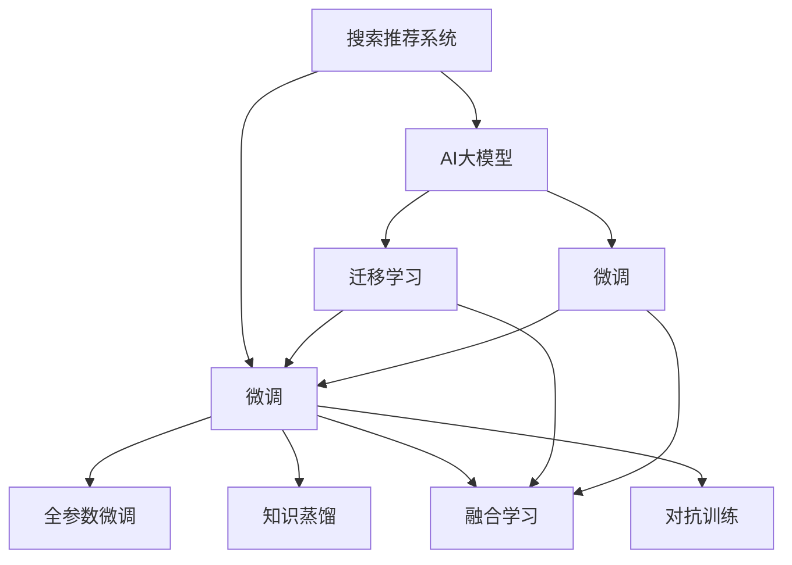

                 

# 电商平台搜索推荐系统的AI 大模型应用：提高系统性能、效率与用户体验

## 1. 背景介绍

### 1.1 问题由来

在电商平台上，搜索推荐系统（Search and Recommendation System，SRS）是提升用户体验、驱动用户价值增长的核心组件。传统的推荐算法通常依赖于手工艺特征工程，需要消耗大量人力物力去手工提取和构造特征，且对新特征的迭代速度较慢。而基于人工智能（AI）的大模型技术，为SRS系统注入了新的活力。

人工智能大模型具备强大的数据整合与泛化能力，可以有效学习用户行为、产品属性等多维度信息，从而提高推荐系统的个性化程度和效率。在电商平台上，大规模预训练语言模型（如BERT、GPT等）已经广泛应用于商品名称匹配、用户评论理解、相关性排序、商品推荐等任务上，显著提升了平台的搜索推荐体验。

### 1.2 问题核心关键点

当前，基于AI大模型的电商平台搜索推荐系统主要面临以下几个挑战：
1. **性能提升瓶颈**：如何在大模型微调过程中进一步提升推荐系统的精准度和覆盖率。
2. **效率优化挑战**：如何在大模型推理过程中实现低延迟、高效能的实时响应。
3. **用户体验改善**：如何增强推荐系统的多样性和相关性，提升用户的满意度和粘性。
4. **模型鲁棒性问题**：如何增强模型对抗恶意攻击和噪声数据的鲁棒性，确保推荐系统的稳定性。

### 1.3 问题研究意义

研究电商平台搜索推荐系统的AI大模型应用，对于拓展大模型的应用场景，提升用户推荐体验，具有重要意义：
1. **降低成本**：AI大模型的应用可以减少人工特征工程的投入，降低运营成本。
2. **提高效率**：AI大模型可快速更新，自动学习新特征，提高推荐系统的迭代速度。
3. **增强个性化**：通过学习和理解用户行为和产品属性，AI大模型可以提供更为精准和个性化的推荐。
4. **优化用户体验**：AI大模型能够动态生成多样化、高质量的推荐结果，提升用户满意度。
5. **提升平台价值**：通过个性化推荐，电商平台的转化率和营收增长有望得到显著提升。

## 2. 核心概念与联系

### 2.1 核心概念概述

为更好地理解AI大模型在电商平台搜索推荐系统中的应用，本节将介绍几个密切相关的核心概念：

- **搜索推荐系统**：通过分析用户行为数据和产品属性信息，为用户推荐相关商品或内容的技术系统。
- **AI大模型**：指基于深度学习框架，如BERT、GPT等，在大规模无标签数据上预训练得到的通用语言模型，具备强大的自然语言处理能力。
- **微调(Fine-tuning)**：指在预训练模型的基础上，使用下游任务的少量标注数据，通过有监督学习优化模型在该任务上的性能。
- **迁移学习(Transfer Learning)**：指将一个领域学习到的知识，迁移应用到另一个不同但相关的领域的学习范式。
- **知识蒸馏(Knowledge Distillation)**：指通过将一个复杂模型的知识，蒸馏到一个较小的模型上，提升小模型的表现。
- **融合学习(Ensemble Learning)**：指通过组合多个模型的预测结果，提高整体的推荐精度和鲁棒性。
- **对抗训练(Adversarial Training)**：指通过加入对抗样本，增强模型对噪声和恶意攻击的鲁棒性。

这些核心概念之间的逻辑关系可以通过以下Mermaid流程图来展示：



这个流程图展示了大语言模型的核心概念及其之间的关系：

1. 搜索推荐系统通过AI大模型进行预测和推荐。
2. 微调是提高大模型在特定任务（如商品推荐）上性能的重要手段。
3. 知识蒸馏、融合学习和对抗训练等方法进一步提升模型效果。
4. 迁移学习连接预训练模型与下游任务的桥梁，可以通过微调或知识蒸馏实现。

这些概念共同构成了电商搜索推荐系统的人工智能应用框架，使其能够利用大模型技术，提升推荐系统的效果和效率。

## 3. 核心算法原理 & 具体操作步骤
### 3.1 算法原理概述

基于AI大模型的电商平台搜索推荐系统，核心思想是通过预训练语言模型对电商数据进行深度理解，进而生成高质量的推荐结果。其核心算法包括：

1. **预训练语言模型**：使用大规模无标签电商数据，如商品描述、用户评论、购买记录等，训练预训练语言模型，学习商品、用户的多维度特征。
2. **微调**：在预训练模型的基础上，使用下游推荐任务的少量标注数据进行有监督学习，优化模型在该任务上的性能。
3. **知识蒸馏**：将复杂模型（如大规模预训练模型）的知识，蒸馏到一个更小、更快的模型上，提升推荐系统的实时性和效率。
4. **融合学习**：组合多个模型（如多个微调模型）的预测结果，利用模型集成，提升整体推荐精度和鲁棒性。
5. **对抗训练**：在模型训练过程中加入对抗样本，增强模型对噪声和恶意攻击的鲁棒性。

### 3.2 算法步骤详解

基于AI大模型的电商平台搜索推荐系统通常包括以下几个关键步骤：

**Step 1: 准备预训练模型和数据集**
- 选择合适的预训练语言模型，如BERT、GPT等，作为初始化参数。
- 准备下游推荐任务的标注数据集，划分为训练集、验证集和测试集。

**Step 2: 设计推荐目标函数**
- 根据推荐任务，设计合适的损失函数，如交叉熵损失、均方误差损失等。
- 确定模型的输入和输出格式，如商品特征、用户特征等。

**Step 3: 微调模型的参数**
- 选择合适的优化算法（如AdamW、SGD等）及其参数，设置学习率、批大小、迭代轮数等。
- 设置正则化技术（如L2正则、Dropout等）和超参数（如冻结预训练参数等）。
- 利用数据增强（如回译、近义替换等）丰富训练集的多样性。

**Step 4: 知识蒸馏与融合学习**
- 设计知识蒸馏流程，将复杂模型的知识（如大规模预训练模型）蒸馏到较小的模型上。
- 组合多个微调模型，利用融合学习提升整体推荐精度和鲁棒性。

**Step 5: 测试与部署**
- 在测试集上评估微调后模型的性能，对比微调前后的推荐精度提升。
- 使用微调后的模型对新商品进行推荐，集成到实际推荐系统中。
- 持续收集新数据，定期重新微调模型，以适应数据分布的变化。

以上是基于AI大模型的电商平台搜索推荐系统的一般流程。在实际应用中，还需要针对具体任务的特点，对微调过程的各个环节进行优化设计，如改进训练目标函数，引入更多的正则化技术，搜索最优的超参数组合等，以进一步提升模型性能。

### 3.3 算法优缺点

基于AI大模型的电商平台搜索推荐系统具有以下优点：
1. **高精度**：通过大规模预训练和微调，AI大模型能够准确学习电商数据的多维度特征，生成高质量的推荐结果。
2. **高效性**：AI大模型具备强大的并行计算能力，可快速更新，提升推荐系统的实时性和响应速度。
3. **可扩展性**：AI大模型通过微调和融合学习，可以扩展到多种推荐任务上，如个性化推荐、商品关联推荐等。
4. **鲁棒性**：通过对抗训练等技术，AI大模型能够提升对噪声和恶意攻击的鲁棒性，确保推荐系统的稳定性。

同时，该方法也存在一些局限性：
1. **数据需求高**：高质量的标注数据是微调的前提，获取标注数据成本较高。
2. **计算资源要求高**：大规模预训练和微调需要强大的计算资源，对硬件设施要求较高。
3. **模型复杂性**：复杂的模型结构和庞大的参数量，增加了模型的解释难度。
4. **模型过拟合**：过拟合是模型面临的主要挑战，尤其是在标注数据较少的情况下。

尽管存在这些局限性，但AI大模型在电商平台搜索推荐系统中的应用已经取得了显著的效果，成为推荐系统的重要技术手段。

### 3.4 算法应用领域

基于AI大模型的电商平台搜索推荐系统已经在多个领域得到了广泛的应用，例如：

- **个性化推荐**：根据用户的历史行为和属性，生成个性化推荐列表，提升用户满意度和粘性。
- **商品关联推荐**：基于商品属性、标签等特征，推荐相关商品，增加用户购买率。
- **多渠道推荐**：通过移动端、PC端等不同渠道的数据，进行统一推荐，提升用户覆盖率。
- **实时推荐**：利用实时数据流，进行动态推荐，提高推荐的时效性和相关性。
- **智能客服**：结合AI大模型和NLP技术，构建智能客服系统，提升客户互动体验。

除了上述这些经典任务外，AI大模型还被创新性地应用到更多场景中，如跨域推荐、内容生成、动态定价等，为电商平台推荐系统带来了全新的突破。随着预训练模型和微调方法的不断进步，相信电商平台推荐系统将会在更多领域得到应用，为电商运营带来新的增长点。

## 4. 数学模型和公式 & 详细讲解 & 举例说明

### 4.1 数学模型构建

本节将使用数学语言对基于AI大模型的电商平台搜索推荐系统进行更加严格的刻画。

记预训练语言模型为 $M_{\theta}$，其中 $\theta$ 为模型参数。假设推荐任务的训练集为 $D=\{(x_i,y_i)\}_{i=1}^N$，$x_i$ 表示商品特征向量，$y_i$ 表示推荐的商品ID。

定义模型 $M_{\theta}$ 在输入 $x$ 上的推荐函数为 $f(x) = M_{\theta}(x)$，则推荐损失函数为：

$$
\mathcal{L}(\theta) = -\frac{1}{N}\sum_{i=1}^N \log f(x_i)
$$

其中，$f(x_i)$ 表示模型对商品ID $i$ 的推荐概率。通过最小化损失函数，可以训练出最佳的推荐模型参数 $\theta^*$。

### 4.2 公式推导过程

以商品关联推荐为例，推导交叉熵损失函数及其梯度的计算公式。

假设模型 $M_{\theta}$ 在输入 $x$ 上的推荐函数为 $f(x) = M_{\theta}(x)$，真实商品ID $y$ 的概率分布为 $p(y|x)$，则交叉熵损失函数定义为：

$$
\mathcal{L}(\theta) = -\frac{1}{N}\sum_{i=1}^N \log p(y_i|x_i)
$$

其中，$p(y_i|x_i)$ 为模型在输入 $x_i$ 下推荐商品ID $i$ 的概率。

根据链式法则，损失函数对参数 $\theta_k$ 的梯度为：

$$
\frac{\partial \mathcal{L}(\theta)}{\partial \theta_k} = -\frac{1}{N}\sum_{i=1}^N \frac{1}{p(y_i|x_i)} \frac{\partial p(y_i|x_i)}{\partial \theta_k}
$$

其中，$p(y_i|x_i)$ 可以进一步递归展开，利用自动微分技术完成计算。

在得到损失函数的梯度后，即可带入参数更新公式，完成模型的迭代优化。重复上述过程直至收敛，最终得到适应下游任务的最优模型参数 $\theta^*$。

### 4.3 案例分析与讲解

以下是一个使用BERT模型进行商品关联推荐的例子。

假设有一篇商品描述文本，我们需要根据该文本推荐相关商品。首先，将文本输入BERT模型，得到其向量表示 $h$。然后，通过全连接层将向量映射到商品ID的向量空间，生成推荐概率分布 $p$。最后，利用交叉熵损失函数进行训练，优化模型参数。

具体步骤如下：

1. 将商品描述文本 $x$ 输入BERT模型，得到向量表示 $h = M_{\theta}(x)$。
2. 通过全连接层将 $h$ 映射到商品ID的向量空间，生成推荐概率分布 $p$，即 $p = \text{Softmax}(W_h h + b)$，其中 $W_h$ 和 $b$ 为全连接层的权重和偏置。
3. 定义交叉熵损失函数，计算损失 $\mathcal{L}(\theta)$。
4. 利用AdamW优化算法，最小化损失函数，更新模型参数 $\theta$。

重复上述步骤，直至模型收敛。训练好的模型即可对新的商品描述文本进行推荐。

## 5. 项目实践：代码实例和详细解释说明
### 5.1 开发环境搭建

在进行商品关联推荐系统开发前，我们需要准备好开发环境。以下是使用Python进行PyTorch开发的环境配置流程：

1. 安装Anaconda：从官网下载并安装Anaconda，用于创建独立的Python环境。

2. 创建并激活虚拟环境：
```bash
conda create -n recommendation-env python=3.8 
conda activate recommendation-env
```

3. 安装PyTorch：根据CUDA版本，从官网获取对应的安装命令。例如：
```bash
conda install pytorch torchvision torchaudio cudatoolkit=11.1 -c pytorch -c conda-forge
```

4. 安装Transformers库：
```bash
pip install transformers
```

5. 安装各类工具包：
```bash
pip install numpy pandas scikit-learn matplotlib tqdm jupyter notebook ipython
```

完成上述步骤后，即可在`recommendation-env`环境中开始开发。

### 5.2 源代码详细实现

下面我们以商品关联推荐为例，给出使用Transformers库对BERT模型进行推荐系统开发的PyTorch代码实现。

首先，定义推荐目标函数：

```python
from transformers import BertModel, BertTokenizer, AdamW

def loss_function(logits, labels):
    return F.cross_entropy(logits.view(-1), labels.view(-1))
```

然后，定义模型和优化器：

```python
model = BertModel.from_pretrained('bert-base-cased')
tokenizer = BertTokenizer.from_pretrained('bert-base-cased')
optimizer = AdamW(model.parameters(), lr=2e-5)
```

接着，定义训练和评估函数：

```python
def train_epoch(model, dataset, batch_size, optimizer):
    model.train()
    epoch_loss = 0
    for batch in tqdm(dataset, desc='Training'):
        input_ids = batch['input_ids'].to(device)
        attention_mask = batch['attention_mask'].to(device)
        labels = batch['labels'].to(device)
        model.zero_grad()
        outputs = model(input_ids, attention_mask=attention_mask)
        loss = loss_function(outputs.logits, labels)
        epoch_loss += loss.item()
        loss.backward()
        optimizer.step()
    return epoch_loss / len(dataset)

def evaluate(model, dataset, batch_size):
    model.eval()
    preds, labels = [], []
    with torch.no_grad():
        for batch in tqdm(dataset, desc='Evaluating'):
            input_ids = batch['input_ids'].to(device)
            attention_mask = batch['attention_mask'].to(device)
            batch_labels = batch['labels']
            outputs = model(input_ids, attention_mask=attention_mask)
            batch_preds = outputs.logits.argmax(dim=2).to('cpu').tolist()
            batch_labels = batch_labels.to('cpu').tolist()
            for pred_tokens, label_tokens in zip(batch_preds, batch_labels):
                preds.append(pred_tokens)
                labels.append(label_tokens)
    
    return preds, labels

# 定义训练和评估函数
def train(model, dataset, batch_size, epochs, optimizer):
    device = torch.device('cuda' if torch.cuda.is_available() else 'cpu')
    model.to(device)
    
    for epoch in range(epochs):
        train_loss = train_epoch(model, dataset, batch_size, optimizer)
        print(f'Epoch {epoch+1}, train loss: {train_loss:.3f}')
        val_loss, preds, labels = evaluate(model, val_dataset, batch_size)
        print(f'Epoch {epoch+1}, validation loss: {val_loss:.3f}')
        test_loss, preds, labels = evaluate(model, test_dataset, batch_size)
        print(f'Epoch {epoch+1}, test loss: {test_loss:.3f}')
```

最后，启动训练流程并在测试集上评估：

```python
epochs = 5
batch_size = 16
train_dataset = ...
val_dataset = ...
test_dataset = ...

train(model, train_dataset, batch_size, epochs, optimizer)
```

以上就是使用PyTorch对BERT进行商品关联推荐的完整代码实现。可以看到，得益于Transformers库的强大封装，我们可以用相对简洁的代码完成BERT模型的加载和微调。

### 5.3 代码解读与分析

让我们再详细解读一下关键代码的实现细节：

**train_epoch函数**：
- 定义了模型在训练集上进行单批次迭代的过程，计算损失并更新模型参数。

**evaluate函数**：
- 定义了模型在验证集和测试集上进行单批次评估的过程，计算预测结果和标签，并返回预测和标签。

**train函数**：
- 定义了整个训练流程，包括模型初始化、训练集和验证集的加载、训练过程、评估过程和测试集评估。

可以看到，PyTorch配合Transformers库使得BERT微调的代码实现变得简洁高效。开发者可以将更多精力放在数据处理、模型改进等高层逻辑上，而不必过多关注底层的实现细节。

当然，工业级的系统实现还需考虑更多因素，如模型的保存和部署、超参数的自动搜索、更灵活的任务适配层等。但核心的微调范式基本与此类似。

## 6. 实际应用场景
### 6.1 智能客服系统

基于AI大模型的商品推荐系统，可以广泛应用于智能客服系统的构建。传统客服往往需要配备大量人力，高峰期响应缓慢，且一致性和专业性难以保证。而使用推荐系统生成的智能回复，可以7x24小时不间断服务，快速响应客户咨询，用推荐商品信息回答用户问题。

在技术实现上，可以收集企业内部的历史客服对话记录，将问题和最佳回复构建成监督数据，在此基础上对预训练模型进行微调。微调后的推荐系统能够自动理解用户意图，匹配最合适的商品信息进行回复。对于客户提出的新问题，还可以接入检索系统实时搜索相关内容，动态生成推荐信息。如此构建的智能客服系统，能大幅提升客户咨询体验和问题解决效率。

### 6.2 金融舆情监测

金融机构需要实时监测市场舆论动向，以便及时应对负面信息传播，规避金融风险。传统的人工监测方式成本高、效率低，难以应对网络时代海量信息爆发的挑战。基于AI大模型的商品推荐系统，可以对市场舆情进行自动监测，识别出重要的市场动态和舆情趋势，帮助金融机构快速做出反应，防范潜在风险。

具体而言，可以收集金融领域相关的新闻、报道、评论等文本数据，并对其进行情感分析、主题分类等任务。在模型微调过程中加入相关任务的监督信号，使得模型能够学习到市场动态和舆情特征，从而生成预测结果。将微调后的模型应用到实时抓取的网络文本数据，就能够自动监测不同领域下的舆情变化趋势，一旦发现负面信息激增等异常情况，系统便会自动预警，帮助金融机构快速应对潜在风险。

### 6.3 个性化推荐系统

当前的推荐系统往往只依赖于用户的历史行为数据进行物品推荐，无法深入理解用户的真实兴趣偏好。基于AI大模型的个性化推荐系统，可以更好地挖掘用户行为背后的语义信息，从而提供更精准和个性化的推荐。

在实践中，可以收集用户浏览、点击、评论、分享等行为数据，提取和用户交互的物品标题、描述、标签等文本内容。将文本内容作为模型输入，用户的后续行为（如是否点击、购买等）作为监督信号，在此基础上微调预训练语言模型。微调后的模型能够从文本内容中准确把握用户的兴趣点。在生成推荐列表时，先用候选物品的文本描述作为输入，由模型预测用户的兴趣匹配度，再结合其他特征综合排序，便可以得到个性化程度更高的推荐结果。

### 6.4 未来应用展望

随着AI大模型的不断发展，基于推荐系统的AI大模型应用将在更多领域得到应用，为电商、金融、医疗等行业的智能化带来新的突破。

在智慧医疗领域，基于推荐系统的智能诊疗系统，可以根据病人的历史病历、症状描述等信息，推荐适合的诊疗方案和药品。通过微调模型，可以更好地理解病人的需求和偏好，提供更个性化的诊疗建议，提升医疗服务的智能化水平。

在智能教育领域，推荐系统可以为学生推荐适合的课程、教材和学习资源，根据学生的学习进度和兴趣，动态调整推荐内容，提升学习效果和满意度。

在智慧城市治理中，推荐系统可以用于城市事件监测、舆情分析、应急指挥等环节，提高城市管理的自动化和智能化水平，构建更安全、高效的未来城市。

此外，在企业生产、社会治理、文娱传媒等众多领域，基于推荐系统的AI大模型应用也将不断涌现，为各行各业带来新的智能化服务。相信随着技术的日益成熟，推荐系统必将在更广阔的应用领域大放异彩，深刻影响人类的生产生活方式。

## 7. 工具和资源推荐
### 7.1 学习资源推荐

为了帮助开发者系统掌握推荐系统的AI大模型应用理论基础和实践技巧，这里推荐一些优质的学习资源：

1. 《深度学习推荐系统：原理与算法》书籍：系统介绍了深度学习推荐系统的原理和算法，包括协同过滤、矩阵分解、神经网络等。

2. 《Reinforcement Learning for Recommender Systems》论文：介绍了强化学习在推荐系统中的应用，利用奖励机制提升推荐系统的性能。

3. 《Transformers》书籍：由Google开发的深度学习框架，提供了大规模预训练语言模型的实现和微调范式。

4. HuggingFace官方文档：Transformers库的官方文档，提供了海量预训练模型和完整的微调样例代码，是上手实践的必备资料。

5. PyTorch官方文档：深度学习框架的官方文档，提供了丰富的深度学习模型和优化算法，是进行模型开发的基础。

6. Kaggle推荐系统竞赛：通过参与实际比赛，学习和实践推荐系统的优化方法和效果评估。

通过对这些资源的学习实践，相信你一定能够快速掌握推荐系统的AI大模型应用精髓，并用于解决实际的推荐问题。
###  7.2 开发工具推荐

高效的开发离不开优秀的工具支持。以下是几款用于推荐系统开发的常用工具：

1. PyTorch：基于Python的开源深度学习框架，灵活动态的计算图，适合快速迭代研究。大部分预训练语言模型都有PyTorch版本的实现。

2. TensorFlow：由Google主导开发的开源深度学习框架，生产部署方便，适合大规模工程应用。同样有丰富的预训练语言模型资源。

3. Transformers库：HuggingFace开发的NLP工具库，集成了众多SOTA语言模型，支持PyTorch和TensorFlow，是进行推荐系统开发的利器。

4. Weights & Biases：模型训练的实验跟踪工具，可以记录和可视化模型训练过程中的各项指标，方便对比和调优。与主流深度学习框架无缝集成。

5. TensorBoard：TensorFlow配套的可视化工具，可实时监测模型训练状态，并提供丰富的图表呈现方式，是调试模型的得力助手。

6. Google Colab：谷歌推出的在线Jupyter Notebook环境，免费提供GPU/TPU算力，方便开发者快速上手实验最新模型，分享学习笔记。

合理利用这些工具，可以显著提升推荐系统的开发效率，加快创新迭代的步伐。

### 7.3 相关论文推荐

推荐系统的AI大模型应用源于学界的持续研究。以下是几篇奠基性的相关论文，推荐阅读：

1. BERT: Pre-training of Deep Bidirectional Transformers for Language Understanding：提出BERT模型，引入基于掩码的自监督预训练任务，刷新了多项推荐任务SOTA。

2. Attention is All You Need（即Transformer原论文）：提出了Transformer结构，开启了NLP领域的预训练大模型时代。

3. Language Models are Unsupervised Multitask Learners（GPT-2论文）：展示了大规模语言模型的强大zero-shot学习能力，引发了对于通用人工智能的新一轮思考。

4. Deep Collaborative Filtering using Matrix Factorization Techniques：介绍了矩阵分解在推荐系统中的应用，基于用户和商品矩阵进行协同过滤推荐。

5. Multi-Task Learning using Uncertainty Propagation for Recommender Systems：提出多任务学习范式，利用不同任务的相似性，提升推荐系统的效果。

这些论文代表了大模型在推荐系统中的应用发展脉络。通过学习这些前沿成果，可以帮助研究者把握学科前进方向，激发更多的创新灵感。

## 8. 总结：未来发展趋势与挑战

### 8.1 总结

本文对基于AI大模型的电商平台搜索推荐系统进行了全面系统的介绍。首先阐述了推荐系统的核心概念和AI大模型的应用背景，明确了AI大模型在提高推荐系统精度、效率和用户体验方面的独特价值。其次，从原理到实践，详细讲解了基于AI大模型的推荐系统开发流程，包括数据预处理、模型微调、知识蒸馏等关键步骤。同时，本文还广泛探讨了AI大模型在电商、金融、医疗等多个领域的应用前景，展示了其广泛的应用潜力。

通过本文的系统梳理，可以看到，基于AI大模型的电商平台搜索推荐系统已经成为推荐系统的重要技术手段，为电商推荐提供了强有力的技术支持。AI大模型的高精度、高效性和可扩展性，使其在推荐系统中的应用前景广阔。

### 8.2 未来发展趋势

展望未来，基于AI大模型的推荐系统将呈现以下几个发展趋势：

1. **个性化推荐**：利用AI大模型学习用户行为和产品属性，生成个性化推荐，提升用户满意度和粘性。
2. **多渠道推荐**：通过不同渠道的数据进行统一推荐，提升用户覆盖率。
3. **实时推荐**：利用实时数据流进行动态推荐，提高推荐的时效性和相关性。
4. **多模态推荐**：结合文本、图像、视频等多模态数据，提升推荐系统的综合表现。
5. **深度融合**：结合AI大模型和专家知识库，提升推荐系统的知识理解和推理能力。
6. **对抗鲁棒性**：引入对抗训练等技术，提升推荐系统的鲁棒性和稳定性。
7. **联邦推荐**：通过联邦学习等技术，在保护隐私的前提下，利用多方数据提升推荐效果。

以上趋势凸显了AI大模型在推荐系统中的应用前景。这些方向的探索发展，必将进一步提升推荐系统的性能和效果，为电商运营带来新的增长点。

### 8.3 面临的挑战

尽管基于AI大模型的推荐系统已经取得了显著效果，但在迈向更加智能化、普适化应用的过程中，它仍面临诸多挑战：

1. **数据隐私保护**：电商平台的推荐系统需要收集用户数据，如何在保护用户隐私的前提下，获取高质量的标注数据，是一个关键问题。
2. **模型泛化能力**：如何使推荐模型能够适应多领域、多场景的数据，提高模型的泛化能力，是一个重要研究方向。
3. **计算资源消耗**：大规模预训练和微调需要强大的计算资源，如何提高模型的训练效率，降低硬件成本，是一个重要问题。
4. **用户接受度**：推荐系统生成的推荐结果可能与用户的实际需求不符，如何提高用户接受度，是一个重要研究方向。
5. **模型解释性**：推荐系统的决策过程缺乏可解释性，难以对其推理逻辑进行分析和调试，是一个重要问题。

尽管存在这些挑战，但随着技术的不断发展，相信推荐系统必将在更广阔的领域得到应用，为电商运营带来新的增长点。未来，推荐系统有望与更多AI技术融合，形成更加智能、高效、可解释的推荐系统，为用户提供更优质的服务体验。

### 8.4 研究展望

面对推荐系统面临的诸多挑战，未来的研究需要在以下几个方面寻求新的突破：

1. **数据隐私保护技术**：利用联邦学习、差分隐私等技术，保护用户隐私，提高数据安全性。
2. **模型泛化能力提升**：结合符号化知识库和知识蒸馏等方法，提升推荐系统的泛化能力。
3. **计算资源优化**：利用分布式计算、压缩存储等技术，降低计算资源消耗，提高训练效率。
4. **用户接受度提升**：利用多任务学习、个性化推荐等方法，提高推荐系统的用户接受度和满意度。
5. **模型解释性增强**：利用可解释性技术，提高推荐系统的透明性和可信度。

这些研究方向的探索，必将引领推荐系统迈向新的高度，为电商运营带来更多的智能化服务。面向未来，推荐系统需要在数据、算法、工程、业务等多个维度协同发力，才能真正实现人工智能技术的落地应用。

## 9. 附录：常见问题与解答

**Q1：基于AI大模型的推荐系统是否适用于所有电商场景？**

A: 基于AI大模型的推荐系统在大多数电商场景上都能取得不错的效果，特别是对于数据量较大的场景。但对于一些特殊领域，如垂直电商、小微电商等，由于数据规模较小，可能需要结合领域特定的方法进行微调。

**Q2：微调过程中如何避免过拟合？**

A: 过拟合是推荐系统面临的主要挑战，尤其是在标注数据较少的情况下。常见的缓解策略包括：
1. 数据增强：通过回译、近义替换等方式扩充训练集。
2. 正则化：使用L2正则、Dropout等技术，避免过拟合。
3. 早停策略：在验证集上监控模型性能，当性能不再提升时，停止训练。
4. 对抗训练：在模型训练过程中加入对抗样本，提高模型的鲁棒性。

这些策略往往需要根据具体任务和数据特点进行灵活组合。只有在数据、模型、训练、推理等各环节进行全面优化，才能最大限度地发挥AI大模型的威力。

**Q3：推荐系统生成的推荐结果是否具有可解释性？**

A: 推荐系统生成的推荐结果缺乏可解释性，难以对其推理逻辑进行分析和调试。为了提升推荐系统的透明度和可信度，未来的研究需要加强可解释性技术，如因果推断、符号化知识库等方法。

**Q4：如何在保护用户隐私的前提下，获取高质量的标注数据？**

A: 利用联邦学习等技术，可以在保护用户隐私的前提下，获取高质量的标注数据。联邦学习通过分布式计算，在多个参与方之间共享模型参数，而不是数据本身，从而保护用户隐私。

**Q5：推荐系统如何处理新商品推荐问题？**

A: 对于新商品推荐问题，可以通过冷启动推荐技术，利用用户画像、商品属性等非结构化数据进行推荐。同时，可以结合知识蒸馏等方法，将预训练模型知识蒸馏到新商品模型上，提升推荐效果。

通过本文的系统梳理，可以看到，基于AI大模型的电商平台推荐系统已经成为推荐系统的重要技术手段，为电商推荐提供了强有力的技术支持。未来，随着技术的不断进步，基于AI大模型的推荐系统必将在更多领域得到应用，为电商运营带来新的增长点。

