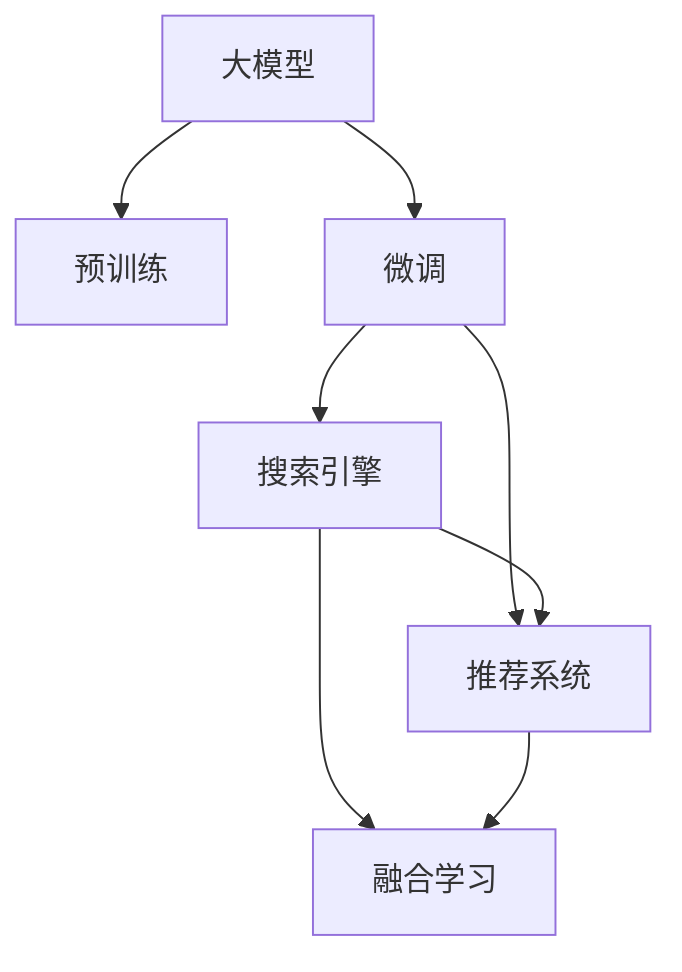

                 

# 电商平台搜索推荐系统的AI 大模型应用：提高系统性能、效率与用户忠诚度

## 1. 背景介绍

### 1.1 问题由来
随着电子商务的蓬勃发展，电商平台的搜索推荐系统变得日益复杂和智能化。为了提升用户体验和平台竞争力，各大电商平台纷纷引入人工智能(AI)技术，从用户行为数据中提取隐含的购买意向和偏好，提供个性化的搜索结果和推荐内容。大模型技术，特别是预训练语言模型和微调技术，为电商平台的搜索推荐系统带来了显著的性能提升和效率优化。

### 1.2 问题核心关键点
在电商搜索推荐系统中应用大模型技术，主要面临以下几个核心问题：
1. **用户意图理解**：准确捕捉用户输入的查询意图，提供高度相关的搜索结果。
2. **商品推荐多样性**：在搜索结果中包含多种多样、相关性高的商品，满足用户的多样化需求。
3. **性能与效率**：在保持系统高精度的同时，确保搜索和推荐过程的响应速度和处理效率。
4. **用户忠诚度提升**：通过个性化的推荐，提升用户体验和用户满意度，增加用户粘性和忠诚度。
5. **系统可扩展性**：能够在数据量增长和模型更新时，灵活地扩展和部署模型。

### 1.3 问题研究意义
应用大模型技术，可以显著提升电商平台的搜索推荐系统的性能和效率，从而提升用户体验和平台竞争力。具体来说：

- **提升推荐质量**：大模型可以捕捉到用户输入中的细微语义差异，更准确地理解用户意图，提供更加相关和个性化的搜索结果和推荐。
- **优化用户体验**：通过高效的搜索和推荐算法，快速响应用户需求，提升用户的满意度和粘性。
- **增加收入转化**：精准的推荐能够提高用户购买转化率，增加平台的收入。
- **强化市场竞争力**：利用先进技术手段，超越竞争对手，保持市场领先地位。

## 2. 核心概念与联系

### 2.1 核心概念概述

为了更好地理解大模型在电商搜索推荐系统中的应用，本节将介绍几个关键概念：

- **大模型**：以BERT、GPT等深度学习模型为代表的超大参数量模型，通过在大量无标签数据上进行预训练，学习通用的语言和语义表示。
- **预训练**：在大规模无标签数据上，通过自监督学习任务（如语言模型预测、掩码语言模型等）训练模型的过程。
- **微调**：在预训练模型的基础上，使用下游任务的有标签数据，通过有监督学习优化模型在该任务上的性能。
- **搜索引擎**：根据用户输入的查询词，从商品库中筛选出相关性高的商品展示给用户。
- **推荐系统**：利用用户的历史行为和兴趣偏好，预测用户可能感兴趣的商品，进行个性化推荐。
- **融合学习**：将搜索和推荐两个子系统进行结合，互相补充，提升整体系统性能。

这些核心概念之间的逻辑关系可以通过以下Mermaid流程图来展示：



这个流程图展示了大模型、预训练、微调、搜索引擎、推荐系统及融合学习的相互关系：

1. 大模型通过预训练获得基础能力。
2. 微调对预训练模型进行任务特定的优化，使得模型能够更好地适应特定任务。
3. 搜索引擎和推荐系统通过微调后的模型，分别对用户查询和行为进行解析，并输出相关结果。
4. 融合学习将搜索和推荐两个系统进行联合优化，提升整体系统性能。

## 3. 核心算法原理 & 具体操作步骤
### 3.1 算法原理概述

电商平台的搜索推荐系统通常包含两个核心模块：搜索引擎和推荐系统。这两个模块在某种程度上是互为补充的，共同为用户提供更精准、高效、个性化的搜索结果和推荐内容。以下是这两个模块的算法原理概述：

### 3.2 算法步骤详解

#### 搜索引擎算法

**Step 1: 构建查询向量**
对于用户输入的查询词，首先通过分词、去除停用词、构建词向量的方式，将其转换为向量表示。这一步通常利用Word2Vec、GloVe等词向量模型。

**Step 2: 预训练模型嵌入**
将查询向量输入到预训练大模型中，通过自编码器或自回归器进行编码，得到查询表示向量。这一过程可以利用如BERT、GPT等模型。

**Step 3: 商品向量匹配**
对于电商平台的商品库，同样对每个商品进行分词、去除停用词、构建词向量的方式，将其转换为向量表示，再输入到预训练模型中，得到商品表示向量。

**Step 4: 余弦相似度计算**
计算查询表示向量和每个商品表示向量之间的余弦相似度，筛选出相似度最高的商品，返回给用户。

**Step 5: 结果排序**
对筛选出的商品，根据用户偏好、点击率、价格等信息进行排序，输出最终搜索结果。

#### 推荐系统算法

**Step 1: 用户行为特征提取**
通过用户的浏览历史、购买记录、搜索记录等行为数据，提取用户的历史兴趣特征。这一步可以采用TF-IDF、ALS（交替最小二乘法）等方法。

**Step 2: 预训练模型嵌入**
将用户兴趣特征向量输入到预训练大模型中，通过自编码器或自回归器进行编码，得到用户兴趣表示向量。

**Step 3: 商品向量嵌入**
对电商平台的商品库，同样对每个商品进行分词、去除停用词、构建词向量的方式，将其转换为向量表示，再输入到预训练模型中，得到商品表示向量。

**Step 4: 用户商品相似度计算**
计算用户兴趣表示向量和每个商品表示向量之间的余弦相似度，筛选出相似度最高的商品，返回给用户。

**Step 5: 结果排序**
对筛选出的商品，根据用户偏好、点击率、价格等信息进行排序，输出最终推荐结果。

#### 融合学习算法

**Step 1: 搜索结果与推荐结果合并**
将搜索引擎返回的搜索结果和推荐系统推荐的商品，进行合并，形成一个综合结果列表。

**Step 2: 用户个性化调整**
根据用户的历史行为和兴趣特征，对合并后的结果进行个性化调整，筛选出最相关的商品，返回给用户。

**Step 3: 用户交互反馈**
对用户对搜索结果的点击、购买等行为进行记录，反馈到模型中进行进一步优化，提高推荐系统的精准度。

### 3.3 算法优缺点

#### 搜索引擎算法

**优点**：
1. **高效性**：通过余弦相似度计算，可以快速筛选出相关性高的商品。
2. **泛化性**：基于预训练模型的向量表示，可以处理未知查询的扩展能力。

**缺点**：
1. **上下文理解不足**：单纯依赖余弦相似度，无法处理查询的上下文和语义。
2. **忽略用户个性化**：没有考虑用户的历史行为和偏好，可能导致推荐结果不够个性化。

#### 推荐系统算法

**优点**：
1. **个性化推荐**：利用用户的历史行为数据，提供个性化的推荐。
2. **实时性**：可以实时根据用户行为调整推荐结果。

**缺点**：
1. **数据依赖**：需要大量的用户行为数据进行训练，初期数据积累可能较难。
2. **冷启动问题**：对于新用户或新商品，可能难以提供准确的推荐。

#### 融合学习算法

**优点**：
1. **综合优势**：结合搜索引擎和推荐系统的优点，提供更加全面和个性化的服务。
2. **动态调整**：能够根据用户行为进行实时调整，提高推荐系统的精准度。

**缺点**：
1. **算法复杂**：需要同时处理多个子系统的结果，算法设计较为复杂。
2. **计算开销**：融合学习可能增加计算资源的使用，影响系统效率。

### 3.4 算法应用领域

基于大模型的电商搜索推荐系统已经在多个领域得到了广泛应用，包括但不限于以下方面：

1. **商品推荐**：根据用户的历史行为和兴趣，推荐相关商品。
2. **搜索结果优化**：利用大模型进行查询理解，提供更精准的搜索结果。
3. **个性化展示**：根据用户浏览和购买行为，个性化调整搜索结果和推荐内容。
4. **内容生成**：利用大模型生成商品描述、广告文案等，提升用户体验。
5. **广告投放优化**：根据用户行为数据，优化广告的展示和投放策略。

这些应用领域展示了大模型在电商搜索推荐系统中的强大作用，未来还将继续拓展到更多场景，提升用户体验和平台竞争力。

## 4. 数学模型和公式 & 详细讲解 & 举例说明

### 4.1 数学模型构建

对于电商平台的搜索推荐系统，数学模型的构建主要涉及以下两个方面：

**查询向量表示**：
对于用户输入的查询词，通过分词、去除停用词、构建词向量的方式，将其转换为向量表示。这一步通常利用Word2Vec、GloVe等词向量模型。假设查询词为 $q$，通过词向量模型 $W$ 得到的向量表示为 $\vec{q} = W(q)$。

**商品向量表示**：
对于电商平台的商品库，同样对每个商品进行分词、去除停用词、构建词向量的方式，将其转换为向量表示，再输入到预训练大模型中，得到商品表示向量。假设商品 $i$ 的向量表示为 $\vec{i} = M_{\theta}(\vec{v_i})$，其中 $\vec{v_i}$ 为商品的词向量表示，$M_{\theta}$ 为预训练大模型。

**用户行为特征表示**：
利用用户的浏览历史、购买记录、搜索记录等行为数据，提取用户的历史兴趣特征。假设用户 $u$ 的历史兴趣特征向量为 $\vec{u} = H(U)$，其中 $U$ 为用户的兴趣数据。

### 4.2 公式推导过程

#### 搜索引擎算法
假设查询词为 $q$，预训练大模型的嵌入层为 $E$，得到查询向量 $\vec{q}$；商品库中商品 $i$ 的表示向量为 $\vec{i}$。假设商品库中有 $N$ 个商品，查询向量与商品向量之间的余弦相似度为：

$$
sim(q,i) = \cos(\vec{q},\vec{i}) = \frac{\vec{q} \cdot \vec{i}}{\|\vec{q}\|\|\vec{i}\|}
$$

根据相似度排序，返回前 $K$ 个相关商品。

#### 推荐系统算法
假设用户 $u$ 的历史兴趣特征向量为 $\vec{u}$，商品库中商品 $i$ 的表示向量为 $\vec{i}$。假设商品库中有 $M$ 个商品，用户向量与商品向量之间的余弦相似度为：

$$
sim(u,i) = \cos(\vec{u},\vec{i}) = \frac{\vec{u} \cdot \vec{i}}{\|\vec{u}\|\|\vec{i}\|}
$$

根据相似度排序，返回前 $K$ 个推荐商品。

#### 融合学习算法
假设搜索引擎返回的搜索结果为 $R_1$，推荐系统推荐的商品为 $R_2$。假设用户 $u$ 的历史兴趣特征向量为 $\vec{u}$，商品库中商品 $i$ 的表示向量为 $\vec{i}$。综合搜索结果和推荐结果，得到用户最相关的商品列表 $R$。

根据用户的历史行为和兴趣特征，对合并后的结果进行个性化调整，筛选出最相关的商品。假设用户的个性化调整系数为 $\alpha_u$，根据用户的历史行为和兴趣特征，对搜索结果和推荐结果进行加权，得到最终结果 $R_{final}$：

$$
R_{final} = \alpha_u \times (R_1 \times R_2)
$$

### 4.3 案例分析与讲解

假设有一个电商平台，用户输入查询词“智能手表”，需要返回最相关的商品。查询向量表示为 $\vec{q} = W("智能手表")$，商品库中商品 $i$ 的表示向量为 $\vec{i} = M_{\theta}(\vec{v_i})$。假设查询向量与商品向量之间的余弦相似度为 $sim(q,i) = 0.9$，返回前 10 个相关商品。

## 5. 项目实践：代码实例和详细解释说明
### 5.1 开发环境搭建

在进行电商搜索推荐系统的开发之前，我们需要准备好开发环境。以下是使用Python进行PyTorch开发的环境配置流程：

1. 安装Anaconda：从官网下载并安装Anaconda，用于创建独立的Python环境。

2. 创建并激活虚拟环境：
```bash
conda create -n pytorch-env python=3.8 
conda activate pytorch-env
```

3. 安装PyTorch：根据CUDA版本，从官网获取对应的安装命令。例如：
```bash
conda install pytorch torchvision torchaudio cudatoolkit=11.1 -c pytorch -c conda-forge
```

4. 安装Transformers库：
```bash
pip install transformers
```

5. 安装各类工具包：
```bash
pip install numpy pandas scikit-learn matplotlib tqdm jupyter notebook ipython
```

完成上述步骤后，即可在`pytorch-env`环境中开始搜索推荐系统的开发。

### 5.2 源代码详细实现

下面我们以利用BERT模型进行电商搜索推荐为例，给出使用Transformers库的PyTorch代码实现。

首先，定义商品和用户数据的处理函数：

```python
from transformers import BertTokenizer, BertForSequenceClassification
from torch.utils.data import Dataset, DataLoader
import torch

class ItemDataset(Dataset):
    def __init__(self, items, tokenizer, max_len=128):
        self.items = items
        self.tokenizer = tokenizer
        self.max_len = max_len
        
    def __len__(self):
        return len(self.items)
    
    def __getitem__(self, item):
        item = self.items[item]
        description = item['description']
        price = item['price']
        # 对商品描述进行分词、去除停用词、构建词向量
        encoding = self.tokenizer(description, return_tensors='pt', max_length=self.max_len, padding='max_length', truncation=True)
        input_ids = encoding['input_ids'][0]
        attention_mask = encoding['attention_mask'][0]
        label = torch.tensor(1, dtype=torch.long) # 0代表不相关，1代表相关
        return {'input_ids': input_ids, 
                'attention_mask': attention_mask,
                'price': price,
                'label': label}

class UserDataset(Dataset):
    def __init__(self, users, tokenizer, max_len=128):
        self.users = users
        self.tokenizer = tokenizer
        self.max_len = max_len
        
    def __len__(self):
        return len(self.users)
    
    def __getitem__(self, item):
        user = self.users[item]
        # 对用户的历史行为数据进行分词、去除停用词、构建词向量
        encoding = self.tokenizer(user['history'], return_tensors='pt', max_length=self.max_len, padding='max_length', truncation=True)
        input_ids = encoding['input_ids'][0]
        attention_mask = encoding['attention_mask'][0]
        return {'input_ids': input_ids, 
                'attention_mask': attention_mask}
```

然后，定义模型和优化器：

```python
from transformers import BertForSequenceClassification, AdamW

model = BertForSequenceClassification.from_pretrained('bert-base-uncased', num_labels=2)

optimizer = AdamW(model.parameters(), lr=2e-5)
```

接着，定义训练和评估函数：

```python
from tqdm import tqdm

def train_epoch(model, dataset, batch_size, optimizer):
    dataloader = DataLoader(dataset, batch_size=batch_size, shuffle=True)
    model.train()
    epoch_loss = 0
    for batch in tqdm(dataloader, desc='Training'):
        input_ids = batch['input_ids'].to(device)
        attention_mask = batch['attention_mask'].to(device)
        price = batch['price'].to(device)
        label = batch['label'].to(device)
        model.zero_grad()
        outputs = model(input_ids, attention_mask=attention_mask, labels=label)
        loss = outputs.loss
        epoch_loss += loss.item()
        loss.backward()
        optimizer.step()
    return epoch_loss / len(dataloader)

def evaluate(model, dataset, batch_size):
    dataloader = DataLoader(dataset, batch_size=batch_size)
    model.eval()
    preds, labels = [], []
    with torch.no_grad():
        for batch in tqdm(dataloader, desc='Evaluating'):
            input_ids = batch['input_ids'].to(device)
            attention_mask = batch['attention_mask'].to(device)
            price = batch['price'].to(device)
            batch_labels = batch['label'].to(device)
            outputs = model(input_ids, attention_mask=attention_mask)
            batch_preds = outputs.logits.argmax(dim=2).to('cpu').tolist()
            batch_labels = batch_labels.to('cpu').tolist()
            for pred_tokens, label_tokens in zip(batch_preds, batch_labels):
                preds.append(pred_tokens)
                labels.append(label_tokens)
                
    print(classification_report(labels, preds))
```

最后，启动训练流程并在测试集上评估：

```python
epochs = 5
batch_size = 16

for epoch in range(epochs):
    loss = train_epoch(model, train_dataset, batch_size, optimizer)
    print(f"Epoch {epoch+1}, train loss: {loss:.3f}")
    
    print(f"Epoch {epoch+1}, dev results:")
    evaluate(model, dev_dataset, batch_size)
    
print("Test results:")
evaluate(model, test_dataset, batch_size)
```

以上就是使用PyTorch对BERT进行电商搜索推荐任务微调的完整代码实现。可以看到，得益于Transformers库的强大封装，我们可以用相对简洁的代码完成BERT模型的加载和微调。

### 5.3 代码解读与分析

让我们再详细解读一下关键代码的实现细节：

**ItemDataset类**：
- `__init__`方法：初始化商品数据、分词器等关键组件。
- `__len__`方法：返回数据集的样本数量。
- `__getitem__`方法：对单个商品数据进行处理，将商品描述输入编码为token ids，构建标签向量，并对其进行定长padding，最终返回模型所需的输入。

**UserDataset类**：
- `__init__`方法：初始化用户数据、分词器等关键组件。
- `__len__`方法：返回数据集的样本数量。
- `__getitem__`方法：对单个用户数据进行处理，将用户历史行为数据输入编码为token ids，最终返回模型所需的输入。

**模型训练**：
- 使用PyTorch的DataLoader对数据集进行批次化加载，供模型训练和推理使用。
- 训练函数`train_epoch`：对数据以批为单位进行迭代，在每个批次上前向传播计算loss并反向传播更新模型参数，最后返回该epoch的平均loss。
- 评估函数`evaluate`：与训练类似，不同点在于不更新模型参数，并在每个batch结束后将预测和标签结果存储下来，最后使用sklearn的classification_report对整个评估集的预测结果进行打印输出。

**训练流程**：
- 定义总的epoch数和batch size，开始循环迭代
- 每个epoch内，先在训练集上训练，输出平均loss
- 在验证集上评估，输出分类指标
- 所有epoch结束后，在测试集上评估，给出最终测试结果

可以看到，PyTorch配合Transformers库使得BERT微调的代码实现变得简洁高效。开发者可以将更多精力放在数据处理、模型改进等高层逻辑上，而不必过多关注底层的实现细节。

当然，工业级的系统实现还需考虑更多因素，如模型的保存和部署、超参数的自动搜索、更灵活的任务适配层等。但核心的微调范式基本与此类似。

## 6. 实际应用场景
### 6.1 智能客服系统

利用大模型微调的对话技术，可以广泛应用于智能客服系统的构建。传统客服往往需要配备大量人力，高峰期响应缓慢，且一致性和专业性难以保证。而使用微调后的对话模型，可以7x24小时不间断服务，快速响应客户咨询，用自然流畅的语言解答各类常见问题。

在技术实现上，可以收集企业内部的历史客服对话记录，将问题和最佳答复构建成监督数据，在此基础上对预训练对话模型进行微调。微调后的对话模型能够自动理解用户意图，匹配最合适的答案模板进行回复。对于客户提出的新问题，还可以接入检索系统实时搜索相关内容，动态组织生成回答。如此构建的智能客服系统，能大幅提升客户咨询体验和问题解决效率。

### 6.2 金融舆情监测

金融机构需要实时监测市场舆论动向，以便及时应对负面信息传播，规避金融风险。传统的人工监测方式成本高、效率低，难以应对网络时代海量信息爆发的挑战。利用大语言模型微调的文本分类和情感分析技术，为金融舆情监测提供了新的解决方案。

具体而言，可以收集金融领域相关的新闻、报道、评论等文本数据，并对其进行主题标注和情感标注。在此基础上对预训练语言模型进行微调，使其能够自动判断文本属于何种主题，情感倾向是正面、中性还是负面。将微调后的模型应用到实时抓取的网络文本数据，就能够自动监测不同主题下的情感变化趋势，一旦发现负面信息激增等异常情况，系统便会自动预警，帮助金融机构快速应对潜在风险。

### 6.3 个性化推荐系统

当前的推荐系统往往只依赖用户的历史行为数据进行物品推荐，无法深入理解用户的真实兴趣偏好。利用大语言模型微调技术，个性化推荐系统可以更好地挖掘用户行为背后的语义信息，从而提供更精准、多样的推荐内容。

在实践中，可以收集用户浏览、点击、评论、分享等行为数据，提取和用户交互的物品标题、描述、标签等文本内容。将文本内容作为模型输入，用户的后续行为（如是否点击、购买等）作为监督信号，在此基础上微调预训练语言模型。微调后的模型能够从文本内容中准确把握用户的兴趣点。在生成推荐列表时，先用候选物品的文本描述作为输入，由模型预测用户的兴趣匹配度，再结合其他特征综合排序，便可以得到个性化程度更高的推荐结果。

### 6.4 未来应用展望

随着大语言模型微调技术的发展，其在电商平台的搜索推荐系统中的应用前景将更加广阔。未来，基于微调范式将进一步提升搜索推荐系统的性能和效率，从而大幅提升用户体验和平台竞争力。

在智慧医疗领域，基于微调的搜索推荐系统可以辅助医生诊疗，推荐相关的医学文献、治疗方案等，加速新药开发进程。

在智能教育领域，微调技术可应用于作业批改、学情分析、知识推荐等方面，因材施教，促进教育公平，提高教学质量。

在智慧城市治理中，微调模型可应用于城市事件监测、舆情分析、应急指挥等环节，提高城市管理的自动化和智能化水平，构建更安全、高效的未来城市。

此外，在企业生产、社会治理、文娱传媒等众多领域，基于大模型微调的人工智能应用也将不断涌现，为经济社会发展注入新的动力。相信随着技术的日益成熟，微调方法将成为人工智能落地应用的重要范式，推动人工智能技术在垂直行业的规模化落地。

## 7. 工具和资源推荐
### 7.1 学习资源推荐

为了帮助开发者系统掌握大模型微调的理论基础和实践技巧，这里推荐一些优质的学习资源：

1. 《Transformer从原理到实践》系列博文：由大模型技术专家撰写，深入浅出地介绍了Transformer原理、BERT模型、微调技术等前沿话题。

2. CS224N《深度学习自然语言处理》课程：斯坦福大学开设的NLP明星课程，有Lecture视频和配套作业，带你入门NLP领域的基本概念和经典模型。

3. 《Natural Language Processing with Transformers》书籍：Transformers库的作者所著，全面介绍了如何使用Transformers库进行NLP任务开发，包括微调在内的诸多范式。

4. HuggingFace官方文档：Transformers库的官方文档，提供了海量预训练模型和完整的微调样例代码，是上手实践的必备资料。

5. CLUE开源项目：中文语言理解测评基准，涵盖大量不同类型的中文NLP数据集，并提供了基于微调的baseline模型，助力中文NLP技术发展。

通过对这些资源的学习实践，相信你一定能够快速掌握大语言模型微调的精髓，并用于解决实际的NLP问题。
###  7.2 开发工具推荐

高效的开发离不开优秀的工具支持。以下是几款用于大语言模型微调开发的常用工具：

1. PyTorch：基于Python的开源深度学习框架，灵活动态的计算图，适合快速迭代研究。大部分预训练语言模型都有PyTorch版本的实现。

2. TensorFlow：由Google主导开发的开源深度学习框架，生产部署方便，适合大规模工程应用。同样有丰富的预训练语言模型资源。

3. Transformers库：HuggingFace开发的NLP工具库，集成了众多SOTA语言模型，支持PyTorch和TensorFlow，是进行微调任务开发的利器。

4. Weights & Biases：模型训练的实验跟踪工具，可以记录和可视化模型训练过程中的各项指标，方便对比和调优。与主流深度学习框架无缝集成。

5. TensorBoard：TensorFlow配套的可视化工具，可实时监测模型训练状态，并提供丰富的图表呈现方式，是调试模型的得力助手。

6. Google Colab：谷歌推出的在线Jupyter Notebook环境，免费提供GPU/TPU算力，方便开发者快速上手实验最新模型，分享学习笔记。

合理利用这些工具，可以显著提升大语言模型微调任务的开发效率，加快创新迭代的步伐。

### 7.3 相关论文推荐

大语言模型和微调技术的发展源于学界的持续研究。以下是几篇奠基性的相关论文，推荐阅读：

1. Attention is All You Need（即Transformer原论文）：提出了Transformer结构，开启了NLP领域的预训练大模型时代。

2. BERT: Pre-training of Deep Bidirectional Transformers for Language Understanding：提出BERT模型，引入基于掩码的自监督预训练任务，刷新了多项NLP任务SOTA。

3. Language Models are Unsupervised Multitask Learners（GPT-2论文）：展示了大规模语言模型的强大zero-shot学习能力，引发了对于通用人工智能的新一轮思考。

4. Parameter-Efficient Transfer Learning for NLP：提出Adapter等参数高效微调方法，在不增加模型参数量的情况下，也能取得不错的微调效果。

5. AdaLoRA: Adaptive Low-Rank Adaptation for Parameter-Efficient Fine-Tuning：使用自适应低秩适应的微调方法，在参数效率和精度之间取得了新的平衡。

这些论文代表了大语言模型微调技术的发展脉络。通过学习这些前沿成果，可以帮助研究者把握学科前进方向，激发更多的创新灵感。

## 8. 总结：未来发展趋势与挑战
### 8.1 总结

本文对基于大模型的电商搜索推荐系统进行了全面系统的介绍。首先阐述了大模型和微调技术的研究背景和意义，明确了微调在拓展预训练模型应用、提升下游任务性能方面的独特价值。其次，从原理到实践，详细讲解了搜索推荐系统的数学原理和关键步骤，给出了微调任务开发的完整代码实例。同时，本文还广泛探讨了微调方法在智能客服、金融舆情、个性化推荐等多个领域的应用前景，展示了微调范式的巨大潜力。此外，本文精选了微调技术的各类学习资源，力求为读者提供全方位的技术指引。

通过本文的系统梳理，可以看到，基于大模型的电商搜索推荐系统已经成为电商平台智能化转型的重要工具。得益于大模型微调技术，平台能够提供更加个性化、高效的搜索推荐服务，大幅提升用户体验和平台竞争力。未来，伴随大语言模型和微调方法的不断演进，电商平台的搜索推荐系统将进一步智能化、定制化，从而更好地服务用户，推动电商行业的发展。

### 8.2 未来发展趋势

展望未来，大模型在电商搜索推荐系统中的应用将呈现以下几个发展趋势：

1. **个性化推荐进一步提升**：通过引入更多用户行为数据和语义信息，优化推荐算法，提供更加精准和个性化的推荐内容。

2. **实时性进一步提升**：通过分布式计算和实时数据处理技术，提升搜索和推荐系统的响应速度和处理效率。

3. **跨模态融合**：将视觉、语音等多模态信息与文本信息结合，提升对用户行为的综合理解能力，提供更加全面和精准的服务。

4. **深度学习与知识图谱结合**：通过知识图谱对深度学习模型的指导，提升推荐系统的逻辑性和可解释性。

5. **多任务学习**：将多个相关任务结合训练，提升推荐系统的综合能力，如将商品推荐与情感分析、主题分类等任务结合，提升推荐系统的综合性能。

6. **跨领域迁移能力**：通过迁移学习，在大模型微调中引入不同领域的知识，提升推荐系统的通用性和适应性。

7. **元学习**：利用元学习技术，使推荐系统能够快速适应新的任务和场景，提升系统的灵活性和可扩展性。

以上趋势凸显了大模型微调技术的广阔前景。这些方向的探索发展，必将进一步提升电商搜索推荐系统的性能和效率，为电商平台智能化转型提供更强有力的技术支持。

### 8.3 面临的挑战

尽管大模型在电商搜索推荐系统中的应用已经取得了显著的进展，但在迈向更加智能化、普适化应用的过程中，仍面临诸多挑战：

1. **数据隐私与安全**：在收集和处理用户数据时，如何保障用户隐私和数据安全是一个重要问题。需要采用数据脱敏、加密等技术，确保用户数据的安全。

2. **计算资源消耗**：大规模语言模型和高频次微调需要大量计算资源，如何在保证性能的前提下，优化计算资源的使用，降低成本。

3. **模型公平性与偏见**：推荐系统中的模型可能学习到数据中的偏见，导致推荐结果不公平。需要引入公平性评估指标，检测和修正模型中的偏见。

4. **模型泛化性与鲁棒性**：推荐系统中的模型可能对新数据泛化能力不足，或者面对对抗样本时鲁棒性差。需要采用对抗训练、多模态融合等技术，提高模型的泛化性和鲁棒性。

5. **模型可解释性**：推荐系统中的模型往往被视为“黑盒”，难以解释其内部工作机制和决策逻辑。需要开发可解释性模型，提高系统的透明性和可信度。

6. **冷启动问题**：对于新用户或新商品，推荐系统难以提供准确的推荐。需要采用冷启动策略，快速捕捉用户和商品的基本特征。

这些挑战需要在未来的研究中进一步解决，以推动大模型微调技术在电商搜索推荐系统中的应用。

### 8.4 研究展望

面对大模型微调面临的这些挑战，未来的研究需要在以下几个方面寻求新的突破：

1. **多任务联合训练**：将多个相关任务结合训练，提升推荐系统的综合能力，如将商品推荐与情感分析、主题分类等任务结合，提升推荐系统的综合性能。

2. **跨模态融合**：将视觉、语音等多模态信息与文本信息结合，提升对用户行为的综合理解能力，提供更加全面和精准的服务。

3. **知识图谱结合**：通过知识图谱对深度学习模型的指导，提升推荐系统的逻辑性和可解释性。

4. **公平性研究**：引入公平性评估指标，检测和修正模型中的偏见，确保推荐系统对所有用户公平公正。

5. **对抗性鲁棒性**：采用对抗训练、多模态融合等技术，提高模型的泛化性和鲁棒性，增强推荐系统的抗干扰能力。

6. **冷启动问题**：开发冷启动策略，快速捕捉用户和商品的基本特征，提升推荐系统的精准度。

7. **可解释性研究**：开发可解释性模型，提高系统的透明性和可信度，增强用户的信任和接受度。

8. **多任务联合训练**：将多个相关任务结合训练，提升推荐系统的综合能力，如将商品推荐与情感分析、主题分类等任务结合，提升推荐系统的综合性能。

这些研究方向将引领大模型微调技术迈向更高的台阶，为构建智能、透明、可控的推荐系统提供坚实的基础。面向未来，大模型微调技术还需要与其他人工智能技术进行更深入的融合，如知识表示、因果推理、强化学习等，多路径协同发力，共同推动推荐系统的进步。只有勇于创新、敢于突破，才能不断拓展语言模型的边界，让智能技术更好地造福用户。

## 9. 附录：常见问题与解答

**Q1：大模型微调是否适用于所有NLP任务？**

A: 大模型微调在大多数NLP任务上都能取得不错的效果，特别是对于数据量较小的任务。但对于一些特定领域的任务，如医学、法律等，仅仅依靠通用语料预训练的模型可能难以很好地适应。此时需要在特定领域语料上进一步预训练，再进行微调，才能获得理想效果。此外，对于一些需要时效性、个性化很强的任务，如对话、推荐等，微调方法也需要针对性的改进优化。

**Q2：微调过程中如何选择合适的学习率？**

A: 微调的学习率一般要比预训练时小1-2个数量级，如果使用过大的学习率，容易破坏预训练权重，导致过拟合。一般建议从1e-5开始调参，逐步减小学习率，直至收敛。也可以使用warmup策略，在开始阶段使用较小的学习率，再逐渐过渡到预设值。需要注意的是，不同的优化器(如AdamW、Adafactor等)以及不同的学习率调度策略，可能需要设置不同的学习率阈值。

**Q3：采用大模型微调时会面临哪些资源瓶颈？**

A: 目前主流的预训练大模型动辄以亿计的参数规模，对算力、内存、存储都提出了很高的要求。GPU/TPU等高性能设备是必不可少的，但即便如此，超大批次的训练和推理也可能遇到显存不足的问题。因此需要采用一些资源优化技术，如梯度积累、混合精度训练、模型并行等，来突破硬件瓶颈。同时，模型的存储和读取也可能占用大量时间和空间，需要采用模型压缩、稀疏化存储等方法进行优化。

**Q4：如何缓解微调过程中的过拟合问题？**

A: 过拟合是微调面临的主要挑战，尤其是在标注数据不足的情况下。常见的缓解策略包括：
1. 数据增强：通过回译、近义替换等方式扩充训练集
2. 正则化：使用L2正则、Dropout、Early Stopping等避免过拟合
3. 对抗训练：引入对抗样本，提高模型鲁棒性
4. 参数高效微调：只调整少量参数(如Adapter、Prefix等)，减小过拟合风险
5. 多模型集成：训练多个微调模型，取平均输出，抑制过拟合

这些策略往往需要根据具体任务和数据特点进行灵活组合。只有在数据、模型、训练、推理等各环节进行全面优化，才能最大限度地发挥大模型微调的威力。

**Q5：微调模型在落地部署时需要注意哪些问题？**

A: 将微调模型转化为实际应用，还需要考虑以下因素：
1. 模型裁剪：去除不必要的层和参数，减小模型尺寸，加快推理速度
2. 量化加速：将浮点模型转为定点模型，压缩存储空间，提高计算效率
3. 服务化封装：将模型封装为标准化服务接口，便于集成调用
4. 弹性伸缩：根据请求流量动态调整资源配置，平衡服务质量和成本
5. 监控告警：实时采集系统指标，设置异常告警阈值，确保服务稳定性
6. 安全防护：采用访问鉴权、数据脱敏等措施，保障数据和模型安全

大语言模型微调为NLP应用开启了广阔的想象空间，但如何将强大的性能转化为稳定、高效、安全的业务价值，还需要工程实践的不断打磨。唯有从数据、算法、工程、业务等多个维度协同发力，才能真正实现人工智能技术在垂直行业的规模化落地。总之，微调需要开发者根据具体任务，不断迭代和优化模型、数据和算法，方能得到理想的效果。

---

作者：禅与计算机程序设计艺术 / Zen and the Art of Computer Programming

