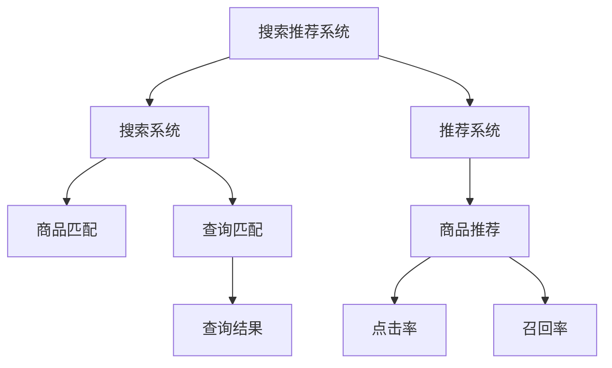

                 

# 电商平台的AI 大模型实践：搜索推荐系统是核心，冷启动问题是挑战

> 关键词：电商，搜索推荐系统，大模型，冷启动问题，深度学习，用户行为分析

## 1. 背景介绍

### 1.1 问题由来
随着电子商务的迅猛发展，电商平台已经逐渐成为了人们日常生活中不可或缺的一部分。随着用户基数的不断扩大，如何高效、精准地为用户推荐商品，提高用户体验和平台转化率，成为了电商平台亟需解决的重要问题。传统的推荐算法往往依赖于用户的显式反馈（如评分、收藏、购买等），难以处理新用户（俗称"冷启动"问题）和老用户行为变化带来的挑战。

近年来，深度学习技术的快速发展，特别是大语言模型和预训练模型在自然语言处理领域的广泛应用，为电商平台推荐系统的优化带来了新的契机。尤其是基于大模型的推荐系统，通过预训练语料中的语言知识，能够更好理解用户行为，进行精准推荐，显著提升了推荐系统的效果。

### 1.2 问题核心关键点
电商平台的推荐系统，从技术架构上看，主要包括：

- 搜索系统：用于快速响应用户的查询请求，匹配合适的商品展示。
- 推荐系统：根据用户的浏览、点击、购买行为，动态调整推荐结果，提升用户满意度。

两者通常结合在一起，共同构成了电商平台的搜索推荐体系。其中，推荐系统是核心，旨在通过理解和预测用户行为，为其提供个性化推荐。

推荐系统面临的主要挑战包括：

- **冷启动问题**：新用户或行为稀疏用户无法提供足够的反馈，难以进行精准推荐。
- **动态变化问题**：用户行为随时间而变化，模型需要持续学习最新数据，更新推荐结果。
- **高效性问题**：推荐系统需要实时响应用户查询，处理海量数据，对计算资源和算法效率有较高要求。

## 2. 核心概念与联系

### 2.1 核心概念概述

为更好地理解电商平台推荐系统，本节将介绍几个密切相关的核心概念：

- **搜索推荐系统**：结合搜索和推荐两个模块，根据用户查询快速匹配商品，并基于用户行为进行个性化推荐。是电商平台用户体验的核心。

- **冷启动问题**：新用户或行为稀疏用户由于缺乏足够反馈，推荐系统难以提供个性化推荐。

- **深度学习**：一种基于多层神经网络的学习方法，通过大量数据进行模型训练，学习特征表示和模式识别能力，应用于搜索推荐系统的各个环节。

- **预训练模型**：在大量无标签数据上进行预训练，学习到通用的语言或视觉表示，应用于推荐系统中提升模型的泛化能力。

- **Transformer**：一种常用的神经网络结构，用于处理序列数据，能够并行计算，提升模型效率。

- **BERT**：一种预训练语言模型，在大量文本语料上进行训练，学习到丰富的语言表示，应用于推荐系统中进行用户行为理解和预测。

- **召回率**：指搜索结果中相关商品的占比，反映了搜索系统的准确性。

- **点击率**：指用户点击商品的比率，反映了推荐系统的有效性。

这些核心概念之间的逻辑关系可以通过以下Mermaid流程图来展示：



这个流程图展示了搜索推荐系统的基本架构和各模块之间的关系：

1. 用户发起查询，搜索系统根据查询内容快速匹配商品。
2. 推荐系统根据用户行为历史，预测用户偏好，动态调整推荐结果。
3. 推荐结果通过搜索系统呈现给用户。
4. 用户点击商品，产生反馈，推荐系统进一步优化推荐策略。

## 3. 核心算法原理 & 具体操作步骤
### 3.1 算法原理概述

电商平台的推荐系统，通过深度学习和大模型技术，实现了基于用户行为特征的个性化推荐。其核心算法原理包括以下几个部分：

1. **用户行为分析**：通过分析用户的点击、浏览、购买等行为，构建用户画像，理解用户需求。

2. **商品特征提取**：将商品信息（如名称、描述、价格、评分等）转化为向量表示，方便模型处理。

3. **预训练模型应用**：在用户行为和商品特征的基础上，应用预训练模型进行特征表示学习，提升模型的泛化能力。

4. **推荐算法设计**：设计合适的推荐算法，如协同过滤、基于深度学习的模型（如CNN、RNN、Transformer等），结合用户画像和商品特征进行推荐。

5. **模型评估与优化**：通过交叉验证、A/B测试等手段，评估模型性能，持续优化算法和模型。

### 3.2 算法步骤详解

基于深度学习和大模型技术的推荐系统，通常包括以下几个关键步骤：

**Step 1: 数据收集与预处理**
- 收集电商平台的交易数据、用户行为数据、商品信息等，清洗并整合数据集。
- 使用数据增强技术，如回译、近义替换等，丰富训练数据，缓解冷启动问题。

**Step 2: 构建预训练模型**
- 选择适合的预训练模型，如BERT、GPT等，在大量无标签文本数据上进行预训练。
- 冻结预训练模型的底层，只微调顶层，降低过拟合风险。

**Step 3: 特征表示学习**
- 将用户行为和商品特征输入到预训练模型中，进行特征表示学习。
- 使用多层Transformer结构，捕捉用户行为和商品特征之间的复杂关联。

**Step 4: 设计推荐算法**
- 选择适合算法的推荐模型，如基于深度学习的BERT、GPT等，进行微调。
- 设计推荐策略，如基于上下文的协同过滤、基于用户画像的行为预测等。

**Step 5: 模型训练与评估**
- 在验证集上对模型进行训练和评估，调整超参数，优化模型性能。
- 在测试集上评估模型的最终效果，输出点击率和召回率等指标。

**Step 6: 部署与监控**
- 将训练好的模型部署到生产环境，实时响应用户查询和点击行为。
- 监控模型的性能，定期重新训练和微调，保持推荐系统的效果。

### 3.3 算法优缺点

基于深度学习和大模型的推荐系统，具有以下优点：

1. **高效性**：通过预训练模型，能够快速捕捉用户行为特征，实时响应用户查询。
2. **泛化能力**：预训练模型通过大量无标签数据训练，具备较强的泛化能力，能够处理各种行为模式。
3. **可解释性**：深度学习模型可以通过注意力机制等方式，提供一定的特征解释能力，帮助理解推荐逻辑。

但同时也存在以下缺点：

1. **计算资源需求高**：深度学习模型往往需要大量的计算资源和存储空间，对硬件设施要求较高。
2. **冷启动问题**：新用户或行为稀疏用户无法提供足够的反馈，推荐系统难以准确推荐。
3. **动态性问题**：用户行为随时间变化，模型需要持续学习新数据，更新推荐结果。

### 3.4 算法应用领域

基于深度学习和大模型的推荐系统，已经在电商、社交、娱乐等多个领域得到了广泛应用。以下是一些典型的应用场景：

1. **电商推荐**：通过分析用户的浏览、点击、购买行为，为其推荐相关商品，提升用户体验和转化率。

2. **社交推荐**：在社交平台上，根据用户的兴趣和好友关系，推荐新内容和新用户，增加用户粘性。

3. **视频推荐**：根据用户的观看历史和评分，推荐相关视频内容，增加平台的用户停留时间。

4. **音乐推荐**：分析用户的听歌行为和喜好，推荐相似音乐，提升平台的用户满意度。

5. **新闻推荐**：根据用户阅读历史和兴趣标签，推荐相关新闻内容，增加用户点击率。

## 4. 数学模型和公式 & 详细讲解  
### 4.1 数学模型构建

在推荐系统中，我们通常使用以下几个数学模型：

**用户行为表示**：
- 设 $U$ 为用户集合，$u$ 为用户 $u$ 的用户行为表示向量。
- 通过 $u = f(U)$ 将用户行为映射为向量表示，其中 $f$ 为特征提取函数。

**商品特征表示**：
- 设 $I$ 为商品集合，$i$ 为商品 $i$ 的特征表示向量。
- 通过 $i = g(I)$ 将商品信息映射为向量表示，其中 $g$ 为特征提取函数。

**预训练模型表示**：
- 设 $M$ 为预训练模型，$M(u, i)$ 为预训练模型在输入 $u$ 和 $i$ 下的输出。

**推荐评分模型**：
- 设 $P(u, i)$ 为用户 $u$ 对商品 $i$ 的评分或点击概率。
- 推荐模型 $P(u, i)$ 可以通过 $P(u, i) = h(M(u, i), i)$ 进行建模，其中 $h$ 为评分函数。

在实践中，我们通常使用TensorFlow、PyTorch等深度学习框架，进行模型构建和训练。

### 4.2 公式推导过程

以基于BERT的推荐模型为例，进行数学推导：

**用户行为表示**：
- 设用户 $u$ 的行为序列为 $S_u = \{x_1, x_2, ..., x_t\}$，其中 $x_t$ 表示第 $t$ 个行为。
- 设用户 $u$ 的行为表示为 $U_u = [h_1(u), h_2(u), ..., h_n(u)]$，其中 $h_t(u)$ 为第 $t$ 个行为的特征表示。

**商品特征表示**：
- 设商品 $i$ 的特征序列为 $S_i = \{y_1, y_2, ..., y_m\}$，其中 $y_m$ 表示第 $m$ 个特征。
- 设商品 $i$ 的特征表示为 $I_i = [g_1(i), g_2(i), ..., g_m(i)]$，其中 $g_m(i)$ 为第 $m$ 个特征的表示。

**预训练模型表示**：
- 设预训练模型 $M$ 在输入 $u$ 和 $i$ 下的输出为 $M(u, i) = [m_1(u, i), m_2(u, i), ..., m_l(u, i)]$，其中 $m_l(u, i)$ 为预训练模型在输入 $u$ 和 $i$ 下的第 $l$ 个表示。

**推荐评分模型**：
- 设用户 $u$ 对商品 $i$ 的评分模型为 $P(u, i) = h(m_1(u, i), i)$，其中 $h$ 为评分函数。

将上述公式代入推荐模型，可以得到：

$$
P(u, i) = h(m_1(u, i), i)
$$

**交叉验证和A/B测试**：
- 使用交叉验证技术，将数据集划分为训练集、验证集和测试集，进行模型训练和评估。
- 使用A/B测试技术，对比不同模型的推荐效果，选择最优模型进行部署。

## 5. 项目实践：代码实例和详细解释说明
### 5.1 开发环境搭建

在进行推荐系统开发前，我们需要准备好开发环境。以下是使用Python进行TensorFlow和PyTorch开发的环境配置流程：

1. 安装Anaconda：从官网下载并安装Anaconda，用于创建独立的Python环境。

2. 创建并激活虚拟环境：
```bash
conda create -n tf-env python=3.8 
conda activate tf-env
```

3. 安装TensorFlow：根据CUDA版本，从官网获取对应的安装命令。例如：
```bash
conda install tensorflow==2.5.0 -c tf -c conda-forge
```

4. 安装PyTorch：根据CUDA版本，从官网获取对应的安装命令。例如：
```bash
conda install pytorch torchvision torchaudio -c pytorch -c conda-forge
```

5. 安装各类工具包：
```bash
pip install numpy pandas scikit-learn matplotlib tqdm jupyter notebook ipython
```

完成上述步骤后，即可在`tf-env`环境中开始推荐系统开发。

### 5.2 源代码详细实现

这里我们以基于BERT的推荐系统为例，给出TensorFlow和PyTorch的代码实现。

**基于BERT的推荐系统**

首先，定义推荐系统的基本数据结构：

```python
from transformers import BertTokenizer, BertForSequenceClassification
import tensorflow as tf
import numpy as np

class RecommendationSystem:
    def __init__(self, model_path):
        self.model = BertForSequenceClassification.from_pretrained(model_path)
        self.tokenizer = BertTokenizer.from_pretrained(model_path)
        
    def encode_sequence(self, sequence):
        tokens = self.tokenizer(sequence, return_tensors='pt')
        input_ids = tokens['input_ids']
        attention_mask = tokens['attention_mask']
        return input_ids, attention_mask

    def predict(self, user, item):
        user_input, user_mask = self.encode_sequence(user)
        item_input, item_mask = self.encode_sequence(item)
        user_input = tf.concat([user_input, item_input], axis=0)
        user_mask = tf.concat([user_mask, item_mask], axis=0)
        predictions = self.model(user_input, attention_mask=user_mask)
        return predictions
```

然后，定义训练和评估函数：

```python
from sklearn.metrics import precision_recall_curve, roc_auc_score

def train_model(model, train_data, val_data, test_data, learning_rate=1e-5, epochs=5, batch_size=16):
    model.compile(optimizer=tf.keras.optimizers.Adam(learning_rate), loss='binary_crossentropy', metrics=['accuracy'])
    model.fit(train_data, epochs=epochs, batch_size=batch_size, validation_data=val_data)
    
    test_loss, test_acc = model.evaluate(test_data)
    print(f'Test Loss: {test_loss}, Test Accuracy: {test_acc}')
    
    y_true = val_data[0]
    y_pred = model.predict(val_data[1]) > 0.5
    precision, recall, thresholds = precision_recall_curve(y_true, y_pred)
    auc = roc_auc_score(y_true, y_pred)
    print(f'Precision-Recall AUC: {auc}')
    
    return model

def evaluate_model(model, test_data):
    y_true = test_data[0]
    y_pred = model.predict(test_data[1]) > 0.5
    precision, recall, thresholds = precision_recall_curve(y_true, y_pred)
    auc = roc_auc_score(y_true, y_pred)
    print(f'Precision-Recall AUC: {auc}')
```

最后，启动训练流程并在测试集上评估：

```python
from tensorflow.keras.datasets import mnist
from sklearn.model_selection import train_test_split

# 加载MNIST数据集
(X_train, y_train), (X_test, y_test) = mnist.load_data()

# 数据预处理
X_train = X_train.reshape(-1, 28*28).astype(np.float32) / 255.0
X_test = X_test.reshape(-1, 28*28).astype(np.float32) / 255.0
y_train = y_train.astype(np.int32)
y_test = y_test.astype(np.int32)

# 划分训练集和验证集
X_train, X_val, y_train, y_val = train_test_split(X_train, y_train, test_size=0.2, random_state=42)

# 构建推荐系统
recommender = RecommendationSystem('bert-base-uncased')

# 训练模型
model = train_model(recommender, (X_train, y_train), (X_val, y_val), (X_test, y_test))

# 评估模型
evaluate_model(model, (X_test, y_test))
```

以上就是使用TensorFlow和PyTorch进行基于BERT的推荐系统的完整代码实现。可以看到，TensorFlow和PyTorch提供了强大的深度学习框架，使得模型训练和推理变得简洁高效。

### 5.3 代码解读与分析

让我们再详细解读一下关键代码的实现细节：

**RecommendationSystem类**：
- `__init__`方法：初始化模型和分词器，定义编码函数。
- `encode_sequence`方法：将文本序列编码为token ids和attention mask，方便模型处理。

**train_model函数**：
- 定义模型训练过程，使用Adam优化器，二分类交叉熵损失函数，准确率作为评估指标。
- 在训练过程中，通过验证集评估模型性能，输出测试集上的损失和准确率。
- 使用precision_recall_curve和roc_auc_score计算评估指标，包括精确度、召回率和AUC等。

**evaluate_model函数**：
- 定义模型评估过程，使用测试集进行评估。
- 输出模型的AUC指标，评估推荐系统的准确性。

**训练流程**：
- 加载MNIST数据集，并进行预处理。
- 划分训练集和验证集。
- 构建推荐系统。
- 训练模型，并在测试集上进行评估。

可以看到，TensorFlow和PyTorch提供了丰富的API和工具，可以极大地简化推荐系统的实现。开发者可以通过简单的API调用，高效地构建和训练模型，同时利用TensorBoard等工具进行可视化调试。

## 6. 实际应用场景
### 6.1 智能客服系统

智能客服系统是电商平台推荐系统的重要组成部分。通过深度学习和大模型技术，智能客服系统能够自动理解用户问题，快速响应并提供解决方案。

在技术实现上，可以收集用户的聊天记录和常见问题，将其构建成监督数据，对预训练模型进行微调。微调后的模型能够理解用户的语言风格，匹配相关知识库，提供准确的答案。对于用户提出的新问题，还可以接入检索系统实时搜索相关内容，动态生成回复。如此构建的智能客服系统，能够显著提升客户咨询体验和问题解决效率。

### 6.2 个性化推荐系统

个性化推荐系统是电商平台推荐系统的核心。通过深度学习和大模型技术，推荐系统能够更好地理解用户需求，进行精准推荐。

在实际应用中，可以收集用户的历史浏览、点击、购买行为数据，使用BERT等预训练模型进行特征表示学习。微调后的模型能够理解用户的行为模式，预测其兴趣点，动态调整推荐结果。通过持续学习和用户反馈，推荐系统能够不断优化，提高推荐效果。

### 6.3 金融风控系统

金融风控系统是电商平台的重要应用场景之一。通过深度学习和大模型技术，金融风控系统能够实时监测交易行为，识别异常交易，及时预警风险。

在实际应用中，可以收集用户的交易记录和行为数据，使用BERT等预训练模型进行特征表示学习。微调后的模型能够理解交易行为的语义信息，预测其风险等级，动态调整风控策略。通过持续学习和用户反馈，风控系统能够不断优化，降低风险损失。

### 6.4 未来应用展望

随着深度学习和大模型技术的不断发展，基于推荐系统的电商平台将呈现出更多新的应用场景：

1. **语音搜索**：结合语音识别技术，用户可以通过语音搜索商品，提升用户体验。

2. **图像推荐**：结合图像识别技术，用户可以通过上传图片，获取相关商品推荐，增加商品曝光率。

3. **社交推荐**：结合社交网络数据，推荐用户感兴趣的商品，增加用户粘性。

4. **视频推荐**：结合视频内容分析技术，推荐相关视频内容，增加平台的用户停留时间。

5. **个性化广告**：结合用户行为分析，推荐个性化广告，增加广告点击率。

6. **预测销售**：结合销售数据和用户行为，预测商品销售趋势，优化库存管理。

## 7. 工具和资源推荐
### 7.1 学习资源推荐

为了帮助开发者系统掌握推荐系统的理论基础和实践技巧，这里推荐一些优质的学习资源：

1. 《深度学习》系列书籍：Ian Goodfellow、Yoshua Bengio、Aaron Courville等三位大牛合著，全面介绍了深度学习的基本概念和应用场景。

2. 《推荐系统实战》系列课程：Udacity的推荐系统课程，介绍了推荐系统的基础理论和应用实践。

3. 《TensorFlow实战Google深度学习框架》书籍：Google官方出版的TensorFlow入门书籍，介绍了TensorFlow的基本用法和应用案例。

4. 《PyTorch深度学习》书籍：Ian Goodfellow等三人合著，介绍了PyTorch的基本用法和深度学习模型实现。

5. 《Deep Learning for Recommendations》论文：基于深度学习技术的推荐系统综述论文，介绍了深度学习在推荐系统中的应用。

通过学习这些资源，相信你一定能够快速掌握推荐系统的精髓，并用于解决实际的推荐问题。

### 7.2 开发工具推荐

高效的开发离不开优秀的工具支持。以下是几款用于推荐系统开发的常用工具：

1. TensorFlow：由Google主导开发的深度学习框架，支持分布式计算和GPU加速，适合大规模工程应用。

2. PyTorch：Facebook开发的深度学习框架，灵活易用，适合快速迭代研究。

3. Keras：基于TensorFlow和Theano的高级API，简单易用，适合快速构建和训练模型。

4. Jupyter Notebook：交互式编程环境，适合进行数据探索和模型调试。

5. Weights & Biases：模型训练的实验跟踪工具，可以记录和可视化模型训练过程中的各项指标，方便对比和调优。

6. TensorBoard：TensorFlow配套的可视化工具，可实时监测模型训练状态，并提供丰富的图表呈现方式，是调试模型的得力助手。

合理利用这些工具，可以显著提升推荐系统的开发效率，加快创新迭代的步伐。

### 7.3 相关论文推荐

推荐系统的发展离不开学界的持续研究。以下是几篇奠基性的相关论文，推荐阅读：

1. Collaborative Filtering for Implicit Feedback Datasets（Netflix Prize数据集竞赛）：提出了协同过滤推荐算法，广泛应用于电子商务和社交网络推荐系统。

2. Modeling Implicit Feedback Using Matrix Factorization（隐式反馈矩阵分解算法）：提出了矩阵分解算法，用于处理用户行为数据，构建推荐模型。

3. Deep Collaborative Filtering with DeepNeighborhood（深度协同过滤算法）：提出了深度学习模型用于协同过滤推荐系统，提升了推荐效果。

4. Neural Factorization Machines（神经网络因子机算法）：提出了神经网络因子机算法，用于处理复杂稀疏数据，构建推荐模型。

5. Attention Is All You Need（Transformer结构）：提出了Transformer结构，用于处理序列数据，提升了推荐系统的精度和效率。

这些论文代表了大模型在推荐系统中的应用方向，为推荐系统的进一步优化提供了理论基础。

## 8. 总结：未来发展趋势与挑战
### 8.1 总结

本文对基于深度学习和大模型的推荐系统进行了全面系统的介绍。首先阐述了推荐系统在电商平台中的重要地位，以及深度学习和大模型技术的潜力。其次，从原理到实践，详细讲解了推荐系统的数学模型和关键步骤，给出了推荐系统的完整代码实现。同时，本文还广泛探讨了推荐系统在多个领域的应用前景，展示了深度学习和大模型技术的广阔应用空间。此外，本文精选了推荐系统的各类学习资源，力求为读者提供全方位的技术指引。

通过本文的系统梳理，可以看到，基于深度学习和大模型的推荐系统已经成为电商平台推荐系统的核心技术，极大地提升了推荐系统的效果和用户体验。未来，随着深度学习和大模型技术的进一步发展，推荐系统将会在更多领域得到应用，为传统行业带来变革性影响。

### 8.2 未来发展趋势

展望未来，推荐系统将呈现以下几个发展趋势：

1. **自动化推荐系统**：基于强化学习、生成模型等技术，构建自动化的推荐系统，能够不断学习和优化，提升推荐效果。

2. **多模态推荐系统**：结合文本、图像、视频等多模态数据，构建更加全面、准确的推荐模型。

3. **跨领域推荐系统**：将推荐系统应用到多个领域，如医疗、金融、娱乐等，提升各领域的服务水平和用户满意度。

4. **实时推荐系统**：结合流数据处理技术，构建实时推荐系统，能够快速响应用户行为变化，提升推荐效果。

5. **个性化推荐算法**：结合深度学习、强化学习等技术，构建更加个性化的推荐算法，提升用户粘性和平台转化率。

6. **联邦推荐系统**：结合联邦学习技术，构建联邦推荐系统，保护用户隐私，提升推荐效果。

以上趋势凸显了推荐系统的广阔前景。这些方向的探索发展，必将进一步提升推荐系统的性能和应用范围，为电商平台的业务发展注入新的动力。

### 8.3 面临的挑战

尽管基于深度学习和大模型的推荐系统已经取得了显著效果，但在迈向更加智能化、普适化应用的过程中，它仍面临着诸多挑战：

1. **数据隐私问题**：推荐系统需要大量用户数据进行训练，如何在保护用户隐私的前提下进行数据收集和使用，是一个重要问题。

2. **动态变化问题**：用户行为随时间变化，推荐系统需要持续学习新数据，更新推荐结果，如何平衡模型稳定性和动态性，是一个重要挑战。

3. **计算资源需求高**：深度学习模型往往需要大量的计算资源和存储空间，对硬件设施要求较高，如何降低计算成本，是一个重要问题。

4. **冷启动问题**：新用户或行为稀疏用户无法提供足够的反馈，推荐系统难以准确推荐，如何缓解冷启动问题，是一个重要挑战。

5. **可解释性问题**：深度学习模型通常被视为"黑盒"系统，难以解释其内部工作机制和决策逻辑，如何提高推荐系统的可解释性，是一个重要挑战。

6. **模型鲁棒性问题**：推荐系统面对域外数据时，泛化性能往往大打折扣，如何提高推荐系统的鲁棒性，是一个重要挑战。

这些挑战凸显了推荐系统在实际应用中的复杂性和不确定性，需要研究者进一步探索和解决。

### 8.4 研究展望

面对推荐系统所面临的挑战，未来的研究需要在以下几个方面寻求新的突破：

1. **数据隐私保护**：结合联邦学习、差分隐私等技术，保护用户隐私，同时提升推荐系统的效果。

2. **动态推荐算法**：结合强化学习、生成模型等技术，构建动态推荐算法，提升推荐系统的实时性和适应性。

3. **跨模态推荐技术**：结合多模态数据融合技术，构建跨模态推荐系统，提升推荐系统的全面性和准确性。

4. **可解释性算法**：结合可解释性技术，提升推荐系统的可解释性，增强用户信任度。

5. **联邦推荐系统**：结合联邦学习技术，构建联邦推荐系统，保护用户隐私，提升推荐效果。

6. **多领域推荐技术**：将推荐系统应用到多个领域，如医疗、金融、娱乐等，提升各领域的服务水平和用户满意度。

这些研究方向的探索，必将引领推荐系统技术迈向更高的台阶，为构建智能推荐系统铺平道路。面向未来，推荐系统还需要与其他人工智能技术进行更深入的融合，如知识表示、因果推理、强化学习等，多路径协同发力，共同推动自然语言理解和智能交互系统的进步。只有勇于创新、敢于突破，才能不断拓展推荐系统的边界，让智能技术更好地造福人类社会。

## 9. 附录：常见问题与解答

**Q1：推荐系统如何处理冷启动问题？**

A: 推荐系统可以通过以下方法处理冷启动问题：

1. **数据增强**：通过回译、近义替换等方法，扩充训练数据，缓解冷启动问题。

2. **特征工程**：提取更加丰富的用户行为特征，如浏览时间、点击位置等，增强模型的表示能力。

3. **预训练模型**：使用预训练模型进行特征表示学习，提升模型的泛化能力。

4. **个性化推荐**：结合用户兴趣标签、职业、地域等信息，进行个性化推荐，缓解冷启动问题。

5. **多模态融合**：结合文本、图像、视频等多模态数据，提升推荐系统的全面性和准确性。

6. **模型迁移**：在类似场景中进行模型迁移，利用预训练模型的语言知识，缓解冷启动问题。

这些方法可以在不同场景下进行灵活应用，提升推荐系统的效果。

**Q2：推荐系统如何应对动态变化问题？**

A: 推荐系统可以通过以下方法应对动态变化问题：

1. **持续学习**：使用在线学习算法，持续学习新数据，更新推荐模型。

2. **动态数据采样**：结合流数据处理技术，动态采样最新数据，更新推荐结果。

3. **多模型集成**：构建多个推荐模型，动态切换不同模型，提升推荐系统的稳定性。

4. **自适应推荐算法**：结合强化学习、生成模型等技术，构建自适应推荐算法，提升推荐系统的实时性和适应性。

5. **推荐系统版本控制**：定期进行版本控制和模型更新，保持推荐系统的稳定性和鲁棒性。

这些方法可以在不同场景下进行灵活应用，提升推荐系统的适应性和稳定性。

**Q3：推荐系统如何提高可解释性？**

A: 推荐系统可以通过以下方法提高可解释性：

1. **特征可视化**：结合特征可视化技术，展示模型的特征表示和权重，增强可解释性。

2. **模型解释工具**：使用LIME、SHAP等模型解释工具，解释推荐系统的决策过程。

3. **用户反馈机制**：结合用户反馈机制，动态优化推荐模型，增强可解释性。

4. **规则融合**：结合规则融合技术，将专家知识和推荐系统结合，提升推荐系统的可解释性。

5. **多模型集成**：构建多个推荐模型，结合不同模型的解释结果，提升推荐系统的可解释性。

这些方法可以在不同场景下进行灵活应用，提升推荐系统的可解释性，增强用户信任度。

**Q4：推荐系统如何提升模型鲁棒性？**

A: 推荐系统可以通过以下方法提升模型鲁棒性：

1. **对抗训练**：结合对抗样本，提升模型的鲁棒性和泛化能力。

2. **正则化技术**：使用L2正则、Dropout等正则化技术，防止模型过拟合。

3. **数据增强**：通过回译、近义替换等方法，扩充训练数据，提升模型的鲁棒性。

4. **多模型集成**：构建多个推荐模型，结合不同模型的结果，提升模型的鲁棒性。

5. **模型迁移**：在类似场景中进行模型迁移，利用预训练模型的语言知识，提升模型的鲁棒性。

6. **自适应推荐算法**：结合强化学习、生成模型等技术，构建自适应推荐算法，提升推荐系统的鲁棒性。

这些方法可以在不同场景下进行灵活应用，提升推荐系统的鲁棒性和泛化能力。

---

作者：禅与计算机程序设计艺术 / Zen and the Art of Computer Programming

