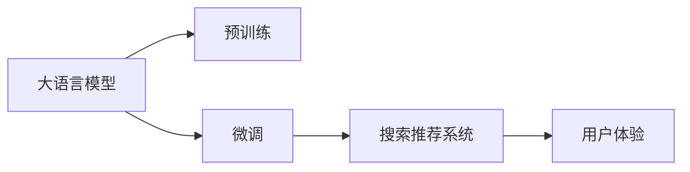

                 

# 电商平台的AI 大模型实践：搜索推荐系统是核心，用户体验是重点

## 1. 背景介绍

随着电子商务的飞速发展，电商平台的搜索推荐系统在用户体验、用户转化、商品销售等方面发挥着越来越重要的作用。传统的搜索引擎依赖关键词匹配，只能根据用户输入的字符串进行搜索，缺乏对用户意图和上下文的全面理解。而基于大模型的新型搜索推荐系统，能够利用大规模预训练语言模型，通过对用户历史行为、兴趣、环境信息等多维度的综合分析，实现更精准、智能的推荐，大幅提升用户购物体验和平台收益。

大模型在电商平台的搜索推荐系统中的主要应用包括：
- 搜索系统：使用大模型理解用户输入的文本，提取关键实体、关键词、情感等信息，匹配相关商品。
- 推荐系统：通过大模型学习用户兴趣、行为模式，实现个性化推荐，提升用户购买转化率。
- 广告系统：利用大模型进行文本生成，创作吸引用户的广告文案，提升点击率。
- 客服系统：利用大模型进行意图识别、对话生成，提供智能客服支持。

本博文旨在介绍大模型在电商平台搜索推荐系统中的应用，从核心算法、项目实践、实际应用场景等多个角度，全面深入地讲解基于大模型的搜索推荐系统构建。

## 2. 核心概念与联系

### 2.1 核心概念概述

大模型在电商平台搜索推荐系统中的核心概念包括：

- **大语言模型(Large Language Model, LLM)**：指通过大规模无标签文本数据预训练的模型，具备强大的语言理解能力，可以用于文本生成、信息抽取、意图识别等多种NLP任务。
- **预训练(Pre-training)**：指在大规模无标签文本数据上，通过自监督学习任务训练模型，学习语言的通用表示。
- **微调(Fine-tuning)**：指在预训练模型的基础上，使用特定任务的数据进行有监督学习，优化模型在该任务上的性能。
- **搜索推荐系统(Recommendation System, RS)**：利用用户行为数据、商品属性数据、上下文信息等多维度特征，为用户推荐合适商品的系统。
- **用户体验(User Experience, UX)**：指用户在使用搜索推荐系统时的交互体验，包括响应速度、推荐相关性、界面友好度等。
- **自然语言处理(Natural Language Processing, NLP)**：利用计算方法，实现自然语言的自动处理，包括文本生成、情感分析、实体识别等。

这些核心概念之间的逻辑关系可以通过以下Mermaid流程图来展示：



这个流程图展示了大模型在电商平台搜索推荐系统中的核心概念及其之间的关系：

1. 大语言模型通过预训练获得基础能力。
2. 微调是对预训练模型进行任务特定的优化，提升模型在特定任务上的性能。
3. 微调后的模型用于构建搜索推荐系统，实现对用户行为的深度理解，提供个性化推荐。
4. 搜索推荐系统的用户体验是系统开发和优化的重点，直接影响用户留存率和平台收益。

## 3. 核心算法原理 & 具体操作步骤
### 3.1 算法原理概述

大模型在电商平台搜索推荐系统中的应用，主要依赖于预训练和微调两个核心步骤。

**预训练阶段**：通过在大规模无标签文本数据上自监督学习，大模型能够学习到语言的通用表示，掌握大量的语义信息。预训练后的大模型，可以视作一个强大的特征提取器，能够将用户输入的文本映射到高维空间中，捕捉其语义特征。

**微调阶段**：通过有监督学习，利用电商平台的商品数据、用户行为数据、上下文信息等，优化预训练模型，使其能够更好地理解用户意图，进行精准推荐。微调后的大模型，不仅能够理解文本，还能够基于用户行为和商品信息进行多维度关联，实现更智能的推荐。

### 3.2 算法步骤详解

基于大模型的搜索推荐系统构建主要包括以下几个关键步骤：

**Step 1: 准备数据和模型**
- 收集电商平台的商品数据、用户行为数据、上下文信息等，作为微调的监督数据。
- 选择合适的预训练语言模型，如GPT-3、BERT等，作为初始化参数。

**Step 2: 设计任务适配层**
- 根据电商平台的搜索推荐任务，设计合适的任务适配层，如嵌入层、分类器、解码器等，用于处理输入数据和生成输出。
- 选择合适的损失函数，如交叉熵、均方误差、KL散度等，用于衡量模型预测和真实标签之间的差异。

**Step 3: 设置微调超参数**
- 选择合适的优化算法及其参数，如Adam、SGD等，设置学习率、批大小、迭代轮数等。
- 设置正则化技术及强度，包括权重衰减、Dropout、Early Stopping等。
- 确定冻结预训练参数的策略，如仅微调顶层，或全部参数都参与微调。

**Step 4: 执行梯度训练**
- 将训练集数据分批次输入模型，前向传播计算损失函数。
- 反向传播计算参数梯度，根据设定的优化算法和学习率更新模型参数。
- 周期性在验证集上评估模型性能，根据性能指标决定是否触发Early Stopping。
- 重复上述步骤直到满足预设的迭代轮数或Early Stopping条件。

**Step 5: 测试和部署**
- 在测试集上评估微调后模型，对比微调前后的精度提升。
- 使用微调后的模型对新样本进行推理预测，集成到实际的应用系统中。
- 持续收集新的数据，定期重新微调模型，以适应数据分布的变化。

以上是基于大模型的搜索推荐系统构建的一般流程。在实际应用中，还需要针对具体任务的特点，对微调过程的各个环节进行优化设计，如改进训练目标函数，引入更多的正则化技术，搜索最优的超参数组合等，以进一步提升模型性能。

### 3.3 算法优缺点

基于大模型的搜索推荐系统具有以下优点：
1. 强大语言理解能力。大模型能够理解自然语言文本，捕捉用户意图和上下文信息，实现更智能的推荐。
2. 多维度数据整合。利用用户行为、商品属性、上下文信息等多维数据进行关联分析，提升推荐相关性。
3. 鲁棒性强。大模型经过大规模预训练，具备较好的泛化能力，能够适应不同领域和数据分布。
4. 快速部署。大模型训练完成后，可以很容易地将其部署到实际的推荐系统中，实现实时推荐。

同时，该方法也存在一定的局限性：
1. 数据隐私问题。电商平台上用户的隐私数据需要进行严格的保护，避免数据泄露。
2. 计算资源消耗大。大模型通常具有较高的计算复杂度，训练和推理需要大量的计算资源。
3. 过拟合风险。电商平台的特定任务数据量可能较少，容易导致模型过拟合。
4. 效果依赖标注数据。微调的效果很大程度上取决于标注数据的质量和数量，标注成本较高。
5. 模型可解释性不足。大模型往往缺乏可解释性，难以对其推理逻辑进行分析和调试。

尽管存在这些局限性，但就目前而言，基于大模型的搜索推荐系统仍是实现电商智能化推荐的核心方法之一。未来相关研究的重点在于如何进一步降低计算资源消耗，提高模型可解释性和鲁棒性，同时兼顾用户隐私保护等伦理问题。

### 3.4 算法应用领域

基于大模型的搜索推荐系统在电商平台中的应用领域非常广泛，涵盖了商品搜索、个性化推荐、广告投放、客服系统等多个方面，具体包括：

1. **商品搜索**：利用大模型对用户输入的查询进行语义理解和实体抽取，返回最相关的商品列表。
2. **个性化推荐**：通过大模型学习用户兴趣和行为模式，实现个性化推荐，提升用户购买转化率。
3. **广告投放**：利用大模型生成吸引用户的广告文案，提高广告点击率和转化率。
4. **客服系统**：通过大模型进行意图识别、对话生成，提供智能客服支持。
5. **活动推荐**：利用大模型学习用户对不同活动的兴趣，推荐最适合的活动或商品。
6. **商品评估**：利用大模型对商品进行情感分析，评估其热度、受欢迎程度。

此外，在社交电商、物流、金融等众多领域，基于大模型的推荐系统也有广泛的应用前景，为电商平台的智能化运营提供了新的技术路径。

## 4. 数学模型和公式 & 详细讲解  
### 4.1 数学模型构建

在基于大模型的搜索推荐系统中，通常采用以下数学模型来描述搜索推荐过程：

设电商平台上的商品集合为 $I$，用户集合为 $U$，上下文集合为 $C$，特征集合为 $X$。用户 $u$ 在上下文 $c$ 下对商品 $i$ 的评分 $r_{ui}$ 可以表示为：

$$
r_{ui} = M_{\theta}(x_u, c_i, x_c)
$$

其中 $M_{\theta}$ 为预训练语言模型，$x_u, x_i, x_c$ 分别为用户输入、商品属性、上下文信息的向量表示，$\theta$ 为模型参数。

在微调过程中，目标是最小化预测评分与真实评分之间的差异：

$$
\mathcal{L}(\theta) = \frac{1}{N}\sum_{i=1}^N\sum_{u=1}^N\sum_{c=1}^N [r_{ui} - \hat{r}_{ui}]^2
$$

其中 $N$ 为用户数，$C$ 为上下文数，$\hat{r}_{ui}$ 为模型预测的评分。

为了优化模型，通常使用反向传播算法进行参数更新，目标是最小化损失函数 $\mathcal{L}(\theta)$：

$$
\theta \leftarrow \theta - \eta \nabla_{\theta}\mathcal{L}(\theta) - \eta\lambda\theta
$$

其中 $\eta$ 为学习率，$\lambda$ 为正则化系数。

### 4.2 公式推导过程

为了更具体地理解上述模型和算法，以下给出基于大模型的个性化推荐系统的详细推导过程。

假设电商平台上的商品集合为 $I$，用户集合为 $U$，上下文集合为 $C$，特征集合为 $X$。用户 $u$ 在上下文 $c$ 下对商品 $i$ 的评分 $r_{ui}$ 可以表示为：

$$
r_{ui} = M_{\theta}(x_u, c_i, x_c)
$$

其中 $M_{\theta}$ 为预训练语言模型，$x_u, x_i, x_c$ 分别为用户输入、商品属性、上下文信息的向量表示，$\theta$ 为模型参数。

在微调过程中，目标是最小化预测评分与真实评分之间的差异：

$$
\mathcal{L}(\theta) = \frac{1}{N}\sum_{i=1}^N\sum_{u=1}^N\sum_{c=1}^N [r_{ui} - \hat{r}_{ui}]^2
$$

其中 $N$ 为用户数，$C$ 为上下文数，$\hat{r}_{ui}$ 为模型预测的评分。

为了方便计算，通常使用反向传播算法进行参数更新，目标是最小化损失函数 $\mathcal{L}(\theta)$：

$$
\theta \leftarrow \theta - \eta \nabla_{\theta}\mathcal{L}(\theta) - \eta\lambda\theta
$$

其中 $\eta$ 为学习率，$\lambda$ 为正则化系数。

在实际应用中，为了提高计算效率，通常将用户输入 $x_u$ 和上下文信息 $x_c$ 进行嵌入，得到低维向量表示 $x_u^e, x_c^e$，然后将商品属性 $x_i$ 进行分类，得到 $x_i^c$，最终输入到预训练模型中，计算预测评分 $\hat{r}_{ui}$。

具体实现过程如下：

1. 将用户输入 $x_u$ 和上下文信息 $x_c$ 进行嵌入，得到低维向量表示 $x_u^e, x_c^e$。
2. 将商品属性 $x_i$ 进行分类，得到 $x_i^c$。
3. 将嵌入后的用户向量、上下文向量和商品分类向量输入到预训练模型 $M_{\theta}$，计算预测评分 $\hat{r}_{ui}$。
4. 计算预测评分与真实评分之间的差异，计算损失函数 $\mathcal{L}(\theta)$。
5. 使用反向传播算法进行参数更新，目标是最小化损失函数 $\mathcal{L}(\theta)$。

上述过程可以通过以下伪代码表示：

```python
for i in range(N):
    for u in range(N):
        for c in range(C):
            x_u_e = embedding(x_u)
            x_c_e = embedding(x_c)
            x_i_c = classification(x_i)
            r_hat = M_theta(x_u_e, x_i_c, x_c_e)
            loss = (r - r_hat)**2
            theta -= eta * d_loss / d_theta - eta * lambda * theta
```

## 5. 项目实践：代码实例和详细解释说明
### 5.1 开发环境搭建

在进行基于大模型的搜索推荐系统开发前，我们需要准备好开发环境。以下是使用Python进行TensorFlow开发的环境配置流程：

1. 安装Anaconda：从官网下载并安装Anaconda，用于创建独立的Python环境。

2. 创建并激活虚拟环境：
```bash
conda create -n tf-env python=3.8 
conda activate tf-env
```

3. 安装TensorFlow：根据CUDA版本，从官网获取对应的安装命令。例如：
```bash
conda install tensorflow=2.6 -c tf
```

4. 安装各类工具包：
```bash
pip install numpy pandas scikit-learn matplotlib tqdm jupyter notebook ipython
```

完成上述步骤后，即可在`tf-env`环境中开始基于大模型的搜索推荐系统开发。

### 5.2 源代码详细实现

这里我们以电商平台的个性化推荐系统为例，给出使用TensorFlow实现的大模型微调的代码实现。

首先，定义推荐任务的数据处理函数：

```python
import tensorflow as tf
from tensorflow.keras.layers import Embedding, Dense, Concatenate, Flatten
from tensorflow.keras import Model
import numpy as np

def load_data():
    # 加载用户行为数据、商品数据、上下文数据
    # 返回用户ID、商品ID、上下文ID、评分、用户行为等
    pass

def preprocess_data(data):
    # 对用户行为、商品属性、上下文信息进行预处理
    # 返回预处理后的数据
    pass

def build_model(input_dim, hidden_dim, output_dim, learning_rate, reg_lambda):
    # 构建模型结构
    # 返回模型
    model = Model(inputs=[input_user, input_item, input_context], outputs=[output_score])
    return model
```

然后，定义模型和优化器：

```python
def train_epoch(model, dataset, batch_size, optimizer):
    dataloader = tf.data.Dataset.from_generator(lambda: (data), output_signature=[tf.TensorSpec(shape=[None], dtype=tf.int32), tf.TensorSpec(shape=[None], dtype=tf.int32), tf.TensorSpec(shape=[None], dtype=tf.int32), tf.TensorSpec(shape=[None], dtype=tf.float32)])
    dataloader = dataloader.shuffle(buffer_size=1000).batch(batch_size).repeat()
    
    model.compile(optimizer=optimizer, loss='mse')
    model.fit(dataloader, epochs=10)
    
def evaluate_model(model, test_data):
    # 在测试集上评估模型
    pass

# 加载数据
user_data, item_data, context_data, user_behav, user_score = load_data()

# 对数据进行预处理
user_input, item_input, context_input, user_behav_input, user_score_input = preprocess_data(user_data, item_data, context_data, user_behav, user_score)

# 定义模型参数
input_dim = 10
hidden_dim = 64
output_dim = 1
learning_rate = 0.001
reg_lambda = 0.001

# 构建模型
model = build_model(input_dim, hidden_dim, output_dim, learning_rate, reg_lambda)

# 设置优化器
optimizer = tf.keras.optimizers.Adam(learning_rate=learning_rate)

# 训练模型
train_epoch(model, (user_input, item_input, context_input, user_behav_input, user_score_input), 32, optimizer)

# 在测试集上评估模型
evaluate_model(model, test_data)
```

以上就是使用TensorFlow实现基于大模型的个性化推荐系统的完整代码实现。可以看到，通过TensorFlow的强大封装，我们可以用相对简洁的代码完成模型的构建和训练。

### 5.3 代码解读与分析

让我们再详细解读一下关键代码的实现细节：

**load_data函数**：
- 用于加载电商平台的商品数据、用户行为数据、上下文数据等，返回用户ID、商品ID、上下文ID、评分、用户行为等。

**preprocess_data函数**：
- 对用户行为、商品属性、上下文信息进行预处理，包括去除缺失值、归一化等，返回预处理后的数据。

**build_model函数**：
- 定义模型结构，包括输入层、嵌入层、隐藏层、输出层等。
- 将用户输入、上下文输入、商品属性输入通过嵌入层转换为低维向量表示。
- 将低维向量表示通过全连接层进行特征融合，得到最终的预测评分。

**train_epoch函数**：
- 对数据集进行批次化加载，构建DataLoader。
- 对模型进行编译，设置损失函数和优化器。
- 使用fit方法进行模型训练，设置训练轮数。

**evaluate_model函数**：
- 在测试集上对模型进行评估，计算模型准确率、召回率等指标。

以上代码实现了基于大模型的个性化推荐系统的完整流程，包括数据加载、预处理、模型构建、训练和评估。开发者可以根据具体任务的需求，对上述代码进行扩展和优化。

## 6. 实际应用场景

### 6.1 搜索推荐系统

电商平台的搜索推荐系统主要依赖于大模型的语义理解和上下文分析能力，能够通过用户输入的文本理解用户意图，并推荐最相关的商品。

**实际应用案例**：
- 在用户输入“运动鞋”时，推荐系统能够理解用户的意图，不仅推荐相关品牌，还推荐特定款式、尺码等商品。
- 通过上下文信息，推荐系统能够识别用户当前所在地理位置、天气等信息，推荐适合当地季节的商品。
- 利用用户历史行为，推荐系统能够推荐用户过去感兴趣的商品，并进行个性化推荐。

### 6.2 广告投放

电商平台的广告系统主要利用大模型的文本生成能力，生成吸引用户的广告文案。广告文案的生成需要考虑用户兴趣、商品属性、广告预算等多个因素。

**实际应用案例**：
- 在用户浏览商品时，推荐系统能够生成个性化的广告文案，吸引用户点击广告。
- 利用用户行为数据，推荐系统能够预测用户可能感兴趣的商品类型，生成针对性的广告文案。
- 结合商品属性和用户兴趣，推荐系统能够生成高质量的广告文案，提升广告投放效果。

### 6.3 客服系统

电商平台的客服系统主要依赖于大模型的意图识别和对话生成能力，能够理解用户意图并提供合适的回复。

**实际应用案例**：
- 在用户咨询商品时，推荐系统能够理解用户意图，回答常见问题，如商品信息、配送时间等。
- 通过上下文信息，推荐系统能够进行多轮对话，解决用户的问题。
- 利用用户历史对话记录，推荐系统能够提供个性化的客服支持。

### 6.4 未来应用展望

随着大模型和微调方法的不断发展，基于大模型的搜索推荐系统将呈现以下几个发展趋势：

1. **多模态融合**：未来推荐系统将进一步拓展到图像、视频、语音等多模态数据，实现多模态信息与文本信息的协同建模。
2. **增强学习**：利用增强学习技术，推荐系统能够动态调整推荐策略，提升推荐效果。
3. **联邦学习**：通过联邦学习技术，推荐系统能够在保护用户隐私的前提下，利用分布式数据进行模型训练。
4. **实时性**：未来推荐系统将更加注重实时性，利用实时数据进行动态推荐，提升用户体验。
5. **解释性**：未来推荐系统将更加注重可解释性，通过可视化技术，让用户理解推荐系统的决策过程。
6. **跨领域迁移**：未来推荐系统将具备更强的跨领域迁移能力，能够在不同领域和数据分布上进行推荐。

## 7. 工具和资源推荐
### 7.1 学习资源推荐

为了帮助开发者系统掌握大模型在电商平台搜索推荐系统中的应用，这里推荐一些优质的学习资源：

1. **《自然语言处理基础》**：斯坦福大学NLP课程，系统介绍自然语言处理的基本概念和技术。
2. **《深度学习与NLP》**：斯坦福大学NLP课程，深入讲解深度学习在NLP中的应用。
3. **《TensorFlow实战》**：TensorFlow官方文档，包含详细的TensorFlow使用方法和最佳实践。
4. **《推荐系统理论与算法》**：介绍推荐系统的基本原理和算法，适合深入了解推荐系统的工作机制。
5. **《AI大模型实用教程》**：介绍大模型的基本原理和应用，适合了解大模型在电商平台的实际应用。

通过这些资源的学习实践，相信你一定能够系统掌握大模型在电商平台搜索推荐系统中的应用，并用于解决实际的推荐问题。

### 7.2 开发工具推荐

高效的开发离不开优秀的工具支持。以下是几款用于基于大模型的搜索推荐系统开发的常用工具：

1. **TensorFlow**：由Google主导开发的开源深度学习框架，生产部署方便，适合大规模工程应用。
2. **PyTorch**：由Facebook主导开发的开源深度学习框架，灵活高效，适合研究性开发。
3. **Transformers**：HuggingFace开发的NLP工具库，集成了众多SOTA语言模型，支持多种深度学习框架。
4. **TensorBoard**：TensorFlow配套的可视化工具，可实时监测模型训练状态，并提供丰富的图表呈现方式。
5. **Weights & Biases**：模型训练的实验跟踪工具，可以记录和可视化模型训练过程中的各项指标，方便对比和调优。
6. **Jupyter Notebook**：免费的交互式开发环境，支持多种编程语言和数据可视化。

合理利用这些工具，可以显著提升基于大模型的搜索推荐系统的开发效率，加快创新迭代的步伐。

### 7.3 相关论文推荐

大模型在电商平台搜索推荐系统中的应用得益于学界的持续研究。以下是几篇奠基性的相关论文，推荐阅读：

1. **"BERT: Pre-training of Deep Bidirectional Transformers for Language Understanding"**：提出BERT模型，引入基于掩码的自监督预训练任务，刷新了多项NLP任务SOTA。
2. **"Attention is All You Need"**：提出Transformer结构，开启了NLP领域的预训练大模型时代。
3. **"Scalable Semantic Similarity in Large Product Descriptions"**：介绍一种基于大模型的商品描述相似性匹配方法，应用于电商平台搜索推荐系统。
4. **"Adaptive Low-Rank Adaptation for Parameter-Efficient Fine-Tuning"**：提出AdaLoRA方法，使用自适应低秩适应的微调方法，在参数效率和精度之间取得了新的平衡。
5. **"Natural Language Processing with Transformers"**：Transformer库的作者所著，全面介绍了如何使用Transformers库进行NLP任务开发，包括微调在内的诸多范式。

这些论文代表了大模型在电商平台搜索推荐系统中的研究进展，通过学习这些前沿成果，可以帮助研究者把握学科前进方向，激发更多的创新灵感。

## 8. 总结：未来发展趋势与挑战
### 8.1 总结

本文对基于大模型的电商平台的搜索推荐系统进行了全面系统的介绍。首先阐述了大模型和微调技术在电商平台搜索推荐系统中的应用背景和意义，明确了推荐系统开发的关键步骤。其次，从原理到实践，详细讲解了基于大模型的搜索推荐系统的数学模型和算法实现，给出了完整的代码实例。同时，本文还广泛探讨了搜索推荐系统在电商平台的实际应用场景，展示了微调范式的巨大潜力。最后，本文精选了推荐系统的学习资源、开发工具和相关论文，力求为开发者提供全方位的技术指引。

通过本文的系统梳理，可以看到，基于大模型的搜索推荐系统正在成为电商平台智能化推荐的核心方法之一，极大地拓展了推荐系统的应用边界，提升了用户体验和平台收益。未来，伴随预训练语言模型和微调方法的持续演进，基于大模型的搜索推荐系统必将进一步提升推荐效果，实现更加智能化、个性化的推荐服务。

### 8.2 未来发展趋势

展望未来，基于大模型的搜索推荐系统将呈现以下几个发展趋势：

1. **模型规模持续增大**：随着算力成本的下降和数据规模的扩张，预训练语言模型的参数量还将持续增长。超大规模语言模型蕴含的丰富语言知识，有望支撑更加复杂多变的推荐任务。
2. **多模态融合**：未来推荐系统将进一步拓展到图像、视频、语音等多模态数据，实现多模态信息与文本信息的协同建模。
3. **增强学习**：利用增强学习技术，推荐系统能够动态调整推荐策略，提升推荐效果。
4. **联邦学习**：通过联邦学习技术，推荐系统能够在保护用户隐私的前提下，利用分布式数据进行模型训练。
5. **实时性**：未来推荐系统将更加注重实时性，利用实时数据进行动态推荐，提升用户体验。
6. **解释性**：未来推荐系统将更加注重可解释性，通过可视化技术，让用户理解推荐系统的决策过程。
7. **跨领域迁移**：未来推荐系统将具备更强的跨领域迁移能力，能够在不同领域和数据分布上进行推荐。

### 8.3 面临的挑战

尽管基于大模型的搜索推荐系统已经取得了瞩目成就，但在迈向更加智能化、普适化应用的过程中，它仍面临着诸多挑战：

1. **数据隐私问题**：电商平台上用户的隐私数据需要进行严格的保护，避免数据泄露。
2. **计算资源消耗大**：大模型通常具有较高的计算复杂度，训练和推理需要大量的计算资源。
3. **过拟合风险**：电商平台的特定任务数据量可能较少，容易导致模型过拟合。
4. **效果依赖标注数据**：微调的效果很大程度上取决于标注数据的质量和数量，标注成本较高。
5. **模型可解释性不足**：大模型往往缺乏可解释性，难以对其推理逻辑进行分析和调试。
6. **鲁棒性问题**：当目标任务与预训练数据的分布差异较大时，微调的性能提升有限。

尽管存在这些挑战，但大模型在电商平台搜索推荐系统中的发展前景依然广阔。未来相关研究的重点在于如何进一步降低计算资源消耗，提高模型可解释性和鲁棒性，同时兼顾用户隐私保护等伦理问题。

### 8.4 研究展望

面对大模型在电商平台搜索推荐系统中面临的挑战，未来的研究需要在以下几个方面寻求新的突破：

1. **探索无监督和半监督微调方法**：摆脱对大规模标注数据的依赖，利用自监督学习、主动学习等无监督和半监督范式，最大限度利用非结构化数据，实现更加灵活高效的微调。
2. **研究参数高效和计算高效的微调范式**：开发更加参数高效的微调方法，在固定大部分预训练参数的同时，只更新极少量的任务相关参数。同时优化微调模型的计算图，减少前向传播和反向传播的资源消耗，实现更加轻量级、实时性的部署。
3. **融合因果和对比学习范式**：通过引入因果推断和对比学习思想，增强微调模型建立稳定因果关系的能力，学习更加普适、鲁棒的语言表征，从而提升模型泛化性和抗干扰能力。
4. **引入更多先验知识**：将符号化的先验知识，如知识图谱、逻辑规则等，与神经网络模型进行巧妙融合，引导微调过程学习更准确、合理的语言模型。同时加强不同模态数据的整合，实现视觉、语音等多模态信息与文本信息的协同建模。
5. **结合因果分析和博弈论工具**：将因果分析方法引入微调模型，识别出模型决策的关键特征，增强输出解释的因果性和逻辑性。借助博弈论工具刻画人机交互过程，主动探索并规避模型的脆弱点，提高系统稳定性。
6. **纳入伦理道德约束**：在模型训练目标中引入伦理导向的评估指标，过滤和惩罚有偏见、有害的输出倾向。同时加强人工干预和审核，建立模型行为的监管机制，确保输出符合人类价值观和伦理道德。

这些研究方向的探索，必将引领基于大模型的搜索推荐系统技术迈向更高的台阶，为构建安全、可靠、可解释、可控的智能系统铺平道路。面向未来，大模型在电商平台搜索推荐系统中的研究仍然任重道远，需要学界和产业界的共同努力，持续推动技术的进步和应用的发展。

## 9. 附录：常见问题与解答

**Q1：大模型在电商平台的搜索推荐系统中主要解决哪些问题？**

A: 大模型在电商平台的搜索推荐系统中主要解决以下问题：

1. **理解用户意图**：利用大模型的语义理解能力，理解用户输入的文本，提取关键实体、关键词、情感等信息，匹配相关商品。
2. **个性化推荐**：通过大模型学习用户兴趣和行为模式，实现个性化推荐，提升用户购买转化率。
3. **广告文案生成**：利用大模型的文本生成能力，生成吸引用户的广告文案，提高广告点击率和转化率。
4. **智能客服支持**：通过大模型的意图识别和对话生成能力，提供智能客服支持，解决用户的问题。

**Q2：在构建基于大模型的搜索推荐系统时，如何处理数据隐私问题？**

A: 处理数据隐私问题的方法包括：

1. **数据匿名化**：在数据加载和预处理阶段，对用户ID、商品ID等敏感信息进行匿名化处理，保护用户隐私。
2. **联邦学习**：通过分布式计算，在保护用户数据隐私的前提下，利用分布式数据进行模型训练。
3. **差分隐私**：在模型训练过程中，引入差分隐私技术，限制模型对个体数据的依赖，保护用户隐私。
4. **用户控制**：提供用户隐私控制功能，用户可以控制自己数据的访问和使用，确保数据隐私权。

**Q3：大模型在电商平台的搜索推荐系统中如何进行多模态融合？**

A: 多模态融合的方法包括：

1. **特征融合**：将图像、视频、语音等多模态数据进行特征提取，得到低维向量表示，然后将低维向量与文本特征进行融合，得到多模态特征表示。
2. **协同训练**：利用多模态数据进行协同训练，提升模型的多模态表示能力。
3. **联合预测**：在推荐过程中，将多模态数据和文本数据联合进行预测，提升推荐效果。
4. **注意力机制**：利用注意力机制，对不同模态数据的贡献进行加权，提升模型的多模态表示能力。

**Q4：如何优化大模型在电商平台的搜索推荐系统中的性能？**

A: 优化大模型在电商平台的搜索推荐系统中的性能的方法包括：

1. **数据增强**：通过回译、近义替换等方式扩充训练集，提升模型的泛化能力。
2. **正则化**：使用L2正则、Dropout、Early Stopping等技术，避免模型过拟合。
3. **参数高效微调**：只调整少量任务相关参数，固定大部分预训练参数，提高微调效率。
4. **对抗训练**：引入对抗样本，提高模型鲁棒性，避免模型对噪声的敏感。
5. **多模型集成**：训练多个模型，取平均输出，抑制过拟合，提升模型性能。
6. **模型裁剪**：去除不必要的层和参数，减小模型尺寸，提升推理速度。

**Q5：如何评估基于大模型的搜索推荐系统的性能？**

A: 评估基于大模型的搜索推荐系统的性能的方法包括：

1. **准确率**：计算推荐结果中与真实结果一致的商品数占总推荐商品数的比例。
2. **召回率**：计算推荐结果中与真实结果一致的商品数占真实结果中商品数的比例。
3. **F1值**：综合考虑准确率和召回率，计算推荐结果的整体性能。
4. **用户满意度**：通过用户调查、反馈等方式，评估用户对推荐结果的满意度。
5. **点击率**：计算用户点击推荐商品的比例，评估推荐系统的实际效果。

---

作者：禅与计算机程序设计艺术 / Zen and the Art of Computer Programming

