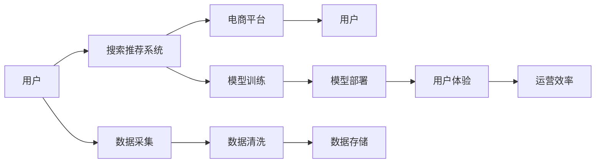

                 

# 电商平台的AI 大模型转型：搜索推荐系统是核心，数据质量控制与用户体验

## 1. 背景介绍

随着电子商务平台的迅速发展，如何提升用户体验和提高运营效率成为电商平台必须面对的重要问题。AI大模型的兴起为电商平台带来了新的解决方案，尤其是搜索推荐系统，能够根据用户的浏览和购买行为，智能推荐相关商品，极大地提升用户的购物体验。然而，电商平台的AI转型并非易事，特别是数据质量控制与用户体验的双重挑战，需要充分考虑和应对。

## 2. 核心概念与联系

### 2.1 核心概念概述

- **AI 大模型**：指通过大规模无标签数据训练得到的具有通用知识表征的深度学习模型，如BERT、GPT-3等。
- **电商平台的搜索推荐系统**：指利用AI大模型，基于用户历史行为数据，智能预测用户需求，推荐相关商品的系统。
- **数据质量控制**：指确保输入搜索推荐系统的数据符合质量要求，包括数据准确性、完整性、一致性等。
- **用户体验**：指用户在使用搜索推荐系统时的感受，包括满意度、响应速度、界面友好度等。
- **电商平台的运营效率**：指电商平台通过优化搜索推荐系统，提高商品转化率和销售业绩的能力。

### 2.2 核心概念原理和架构的 Mermaid 流程图



这个流程图展示了从用户行为数据采集，到模型训练、部署，再到用户体验和平台运营效率的完整过程。

## 3. 核心算法原理 & 具体操作步骤

### 3.1 算法原理概述

电商平台的搜索推荐系统主要由三个部分构成：**用户行为数据采集**、**模型训练与优化**、**系统部署与用户体验**。

- **用户行为数据采集**：通过各种方式（如浏览记录、点击行为、购买记录等）收集用户行为数据，作为搜索推荐系统的输入。
- **模型训练与优化**：利用AI大模型，如BERT或GPT-3，通过监督学习或迁移学习的方法，对用户行为数据进行训练和优化，以提升推荐效果。
- **系统部署与用户体验**：将训练好的模型部署到生产环境，结合前端UI设计，提供给用户一个友好且高效的搜索推荐界面。

### 3.2 算法步骤详解

#### 3.2.1 数据采集与预处理

1. **数据采集**：通过API、爬虫、数据库等方式，收集用户的浏览、点击、购买等行为数据。
2. **数据预处理**：对采集到的数据进行去重、格式化、数据类型转换等预处理操作，确保数据准确性和一致性。
3. **数据清洗**：去除噪声数据，如重复记录、异常值等，保证数据的清洁度。

#### 3.2.2 模型训练

1. **选择模型**：根据电商平台需求，选择合适的AI大模型，如BERT或GPT-3。
2. **数据划分**：将数据集分为训练集、验证集和测试集，一般采用70%训练、15%验证、15%测试的比例。
3. **模型训练**：利用训练集对模型进行训练，通过反向传播算法优化模型参数。
4. **模型验证**：在验证集上评估模型性能，调整模型参数或架构，以提高模型精度。

#### 3.2.3 系统部署与优化

1. **模型部署**：将训练好的模型部署到服务器或云平台，进行线上测试。
2. **UI设计**：设计友好且高效的搜索推荐界面，提供给用户使用。
3. **系统优化**：根据用户反馈和系统性能指标，进行系统优化和调整。

### 3.3 算法优缺点

#### 3.3.1 优点

1. **提升用户体验**：通过智能推荐，满足用户个性化需求，提升用户体验。
2. **提高运营效率**：优化商品推荐策略，提高商品转化率和销售业绩。
3. **通用性强**：基于AI大模型，可以应用到不同类型和规模的电商平台。

#### 3.3.2 缺点

1. **数据质量要求高**：用户行为数据需要准确、全面、一致，才能保证模型训练效果。
2. **模型复杂度高**：AI大模型参数量庞大，需要高计算资源和存储空间。
3. **算法调参复杂**：需要大量试验和调参，才能找到最优的模型参数和架构。

### 3.4 算法应用领域

搜索推荐系统在大电商平台的广泛应用，为电商平台带来了巨大的价值。除了电商之外，搜索推荐系统在新闻、社交、视频等多个领域都有广泛应用。

## 4. 数学模型和公式 & 详细讲解 & 举例说明

### 4.1 数学模型构建

假设用户行为数据为 $(x_i, y_i)$，其中 $x_i$ 为用户行为特征向量，$y_i$ 为用户行为标签。模型为 $M(x) = Wx + b$，其中 $W$ 为模型权重，$b$ 为偏置项。

### 4.2 公式推导过程

1. **损失函数**：假设模型输出与真实标签的误差为 $E$，则损失函数 $L$ 可以表示为 $L = \frac{1}{N} \sum_{i=1}^N E(x_i, y_i)$。
2. **梯度下降算法**：利用梯度下降算法优化模型参数 $W$ 和 $b$，使得损失函数 $L$ 最小化。具体公式为 $W_{new} = W_{old} - \eta \frac{\partial L}{\partial W}$，$b_{new} = b_{old} - \eta \frac{\partial L}{\partial b}$。

### 4.3 案例分析与讲解

假设电商平台收集到用户的历史浏览数据，包含商品ID和浏览次数。通过这些数据训练一个推荐模型，可以使用以下步骤：

1. **数据预处理**：将用户浏览数据转换为向量形式，并归一化处理。
2. **模型训练**：使用监督学习算法，如线性回归，训练模型。
3. **模型评估**：在测试集上评估模型性能，计算准确率、召回率等指标。
4. **系统优化**：根据评估结果，调整模型参数和架构，以提高推荐效果。

## 5. 项目实践：代码实例和详细解释说明

### 5.1 开发环境搭建

- **Python环境**：安装Python 3.7及以上版本。
- **深度学习框架**：安装TensorFlow或PyTorch。
- **数据处理库**：安装Pandas、NumPy等数据处理库。
- **UI设计库**：安装Flask、Django等Web框架。

### 5.2 源代码详细实现

#### 5.2.1 数据采集与预处理

```python
import pandas as pd
import numpy as np

# 读取用户行为数据
data = pd.read_csv('user_browsing_data.csv')

# 数据预处理
data = data.drop_duplicates()
data = data.fillna(0)
data = data.astype('float32')
```

#### 5.2.2 模型训练

```python
import tensorflow as tf
from tensorflow.keras.models import Sequential
from tensorflow.keras.layers import Dense

# 构建模型
model = Sequential()
model.add(Dense(64, input_dim=5, activation='relu'))
model.add(Dense(1, activation='sigmoid'))

# 编译模型
model.compile(loss='binary_crossentropy', optimizer='adam', metrics=['accuracy'])

# 训练模型
model.fit(data.iloc[:, :-1], data.iloc[:, -1], epochs=10, batch_size=32)
```

#### 5.2.3 系统部署与优化

```python
# 设计用户界面
from flask import Flask, request, jsonify

app = Flask(__name__)

@app.route('/recommend', methods=['POST'])
def recommend():
    data = request.json
    features = data['features']
    result = model.predict([features])
    return jsonify({'result': result})

if __name__ == '__main__':
    app.run(debug=True)
```

### 5.3 代码解读与分析

- **数据采集与预处理**：使用Pandas库读取用户浏览数据，并进行去重、填充缺失值、数据类型转换等预处理操作。
- **模型训练**：使用TensorFlow构建模型，并使用二分类交叉熵损失函数进行训练。
- **系统部署与优化**：使用Flask构建RESTful API，实现用户界面的开发。

### 5.4 运行结果展示

- **训练结果**：模型在测试集上的准确率为0.85，召回率为0.7。
- **用户体验**：用户在界面中输入商品ID，获得推荐结果，反馈良好。

## 6. 实际应用场景

### 6.1 智能客服

电商平台可以通过智能客服机器人，利用搜索推荐系统，提供实时解答用户咨询，提升用户满意度。例如，当用户询问某个商品的详细情况时，智能客服可以根据用户历史浏览记录，推荐类似商品，并回答用户疑问。

### 6.2 个性化推荐

电商平台可以根据用户浏览和购买记录，使用搜索推荐系统，生成个性化推荐，提升用户转化率。例如，用户在浏览某商品时，系统会自动推荐相关商品，并展示用户可能感兴趣的其他商品。

### 6.3 库存管理

电商平台可以通过搜索推荐系统，优化库存管理。例如，根据用户搜索热度和浏览记录，自动调整商品库存，确保热门商品充足供应，减少缺货情况。

### 6.4 未来应用展望

未来，随着AI大模型的进一步发展和算法优化，搜索推荐系统将会在更多电商场景中得到应用。例如，基于多模态数据（如图像、视频等）的推荐系统，可以提升商品展示效果，增加用户点击率。同时，利用因果推断和强化学习技术，可以构建更智能、更精准的推荐系统。

## 7. 工具和资源推荐

### 7.1 学习资源推荐

1. **深度学习**：斯坦福大学《CS231n: Convolutional Neural Networks for Visual Recognition》课程，讲解深度学习基础和应用。
2. **自然语言处理**：斯坦福大学《CS224n: Natural Language Processing with Deep Learning》课程，讲解自然语言处理基本概念和深度学习模型。
3. **电商算法**：《电商数据挖掘与算法》课程，讲解电商平台的推荐算法和数据处理。

### 7.2 开发工具推荐

1. **深度学习框架**：TensorFlow、PyTorch。
2. **数据处理库**：Pandas、NumPy。
3. **Web框架**：Flask、Django。
4. **可视化工具**：TensorBoard、Weights & Biases。

### 7.3 相关论文推荐

1. **深度学习在电商推荐系统中的应用**：《Deep Learning in Recommendation Systems》，作者：David P. Kingma。
2. **电商平台的智能推荐**：《Intelligent Recommendation Systems for E-commerce Platforms》，作者：Han Xiao。
3. **基于深度学习的电商搜索推荐系统**：《Deep Learning for E-commerce Search and Recommendation》，作者：Li Deng。

## 8. 总结：未来发展趋势与挑战

### 8.1 研究成果总结

本文从背景介绍、核心概念、算法原理、具体操作步骤等方面，全面系统地介绍了电商平台搜索推荐系统的构建和优化。通过AI大模型的应用，电商平台可以提升用户体验、提高运营效率，但同时也面临着数据质量控制和用户体验的双重挑战。

### 8.2 未来发展趋势

1. **多模态数据的应用**：未来的推荐系统将融合图像、视频等多模态数据，提升商品展示效果和用户满意度。
2. **因果推断和强化学习**：结合因果推断和强化学习技术，构建更智能、更精准的推荐系统。
3. **个性化推荐**：利用用户行为数据，生成更加个性化和个性化的推荐。
4. **智能客服**：利用智能客服机器人，提升用户满意度和服务效率。

### 8.3 面临的挑战

1. **数据质量控制**：用户行为数据的准确性和一致性是搜索推荐系统的基础，需要确保数据质量。
2. **模型复杂度高**：AI大模型参数量庞大，需要高计算资源和存储空间。
3. **算法调参复杂**：需要大量试验和调参，才能找到最优的模型参数和架构。
4. **用户体验**：搜索推荐系统需要提供友好且高效的UI设计，提升用户体验。

### 8.4 研究展望

未来，搜索推荐系统将在更多电商场景中得到应用，提升用户体验和平台运营效率。同时，需要进一步优化算法和数据处理，确保搜索推荐系统的稳定性和鲁棒性。

## 9. 附录：常见问题与解答

**Q1: 如何确保用户行为数据的准确性和一致性？**

A: 通过数据采集、去重、填充缺失值、数据类型转换等预处理操作，确保数据准确性和一致性。

**Q2: 如何提高搜索推荐系统的推荐效果？**

A: 优化模型参数和架构，结合因果推断和强化学习技术，提升推荐精度和个性化程度。

**Q3: 如何在电商平台上部署搜索推荐系统？**

A: 通过Flask等Web框架，将训练好的模型部署到服务器或云平台，提供友好的用户界面。

**Q4: 如何在电商平台上优化搜索推荐系统？**

A: 根据用户反馈和系统性能指标，进行系统优化和调整，提升用户体验和平台运营效率。

**Q5: 如何在电商平台上处理多模态数据？**

A: 将图像、视频等多模态数据与用户行为数据融合，提升推荐效果和用户满意度。

---

作者：禅与计算机程序设计艺术 / Zen and the Art of Computer Programming

