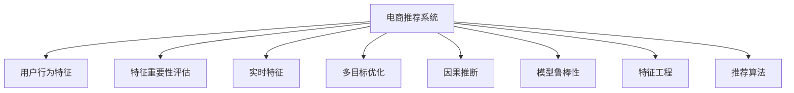

                 

# 电商推荐系统中的实时特征重要性评估

## 1. 背景介绍

### 1.1 问题由来

随着电商平台的快速发展，用户与商品的互动数据日益增多，构建有效的推荐系统成为提升用户满意度和转化率的关键。推荐系统的主要目标是根据用户的历史行为数据，预测其对各类商品的偏好程度，从而实现个性化推荐。然而，现有推荐系统往往基于静态特征，难以捕捉用户实时变化的偏好和兴趣，导致推荐精度和时效性不足。

### 1.2 问题核心关键点

实时特征重要性评估，旨在通过动态分析用户行为数据，精确识别当前影响用户偏好的关键特征，并根据其重要性排序，从而在推荐中加以优先考虑。这一技术不仅能够提升推荐系统的实时性和准确性，还能帮助商家制定精准的市场策略，优化库存管理，提高整体运营效率。

### 1.3 问题研究意义

研究实时特征重要性评估，对提升电商推荐系统的效果，优化用户体验，增强商家运营决策具有重要意义。该技术能够帮助商家更加精准地理解用户需求，及时调整推荐策略，优化资源配置，从而在竞争激烈的市场中占据优势。同时，该技术也能够推动推荐系统的持续创新，拓宽其应用范围，促进电商行业的发展。

## 2. 核心概念与联系

### 2.1 核心概念概述

为更好地理解实时特征重要性评估的原理，本节将介绍几个关键概念：

- **电商推荐系统**：利用用户历史行为数据，通过机器学习模型预测用户对商品的偏好程度，实现个性化推荐。常见的模型包括协同过滤、矩阵分解、深度学习等。
- **用户行为特征**：用户与商品互动过程中产生的数据，如浏览、点击、购买、评分等。这些特征是构建推荐模型的基础。
- **特征重要性评估**：通过模型训练或后处理技术，评估每个特征对预测结果的影响程度，通常以重要性分数或贡献度表示。
- **实时特征**：在推荐过程中动态收集的用户行为数据，如实时点击、浏览、搜索等。实时特征能够反映用户当前的兴趣和需求，有助于提升推荐系统的时效性。
- **多目标优化**：推荐系统中的优化目标往往不止一个，如最大化点击率、提高转化率、优化资源分配等。如何平衡这些目标，需要多目标优化技术支持。
- **因果推断**：通过因果分析方法，判断用户行为与推荐结果之间的因果关系，避免虚假相关和混淆变量，提高推荐模型的可信度。
- **模型鲁棒性**：推荐模型应具备一定的鲁棒性，即对输入数据的变化具有一定的容忍度和适应能力。
- **特征工程**：在构建推荐模型之前，对原始用户行为数据进行清洗、转换、编码等操作，以提升模型的性能。
- **推荐算法**：如协同过滤、矩阵分解、深度学习等推荐算法，是实现个性化推荐的核心技术。

这些概念之间的逻辑关系可以通过以下Mermaid流程图来展示：



这个流程图展示了电商推荐系统中的核心概念及其之间的关系：

1. 电商推荐系统利用用户行为特征，通过特征重要性评估识别关键特征，结合实时特征进行推荐。
2. 多目标优化帮助推荐系统平衡不同的性能指标。
3. 因果推断用于理解推荐结果与用户行为之间的因果关系。
4. 模型鲁棒性保证推荐系统对数据变化具有一定的适应能力。
5. 特征工程提升模型的性能和泛化能力。
6. 推荐算法是实现个性化推荐的具体方法。

这些概念共同构成了电商推荐系统的技术框架，使得推荐系统能够在多样化的场景下实现高效、精准的推荐。

## 3. 核心算法原理 & 具体操作步骤
### 3.1 算法原理概述

实时特征重要性评估的本质是通过动态分析用户行为数据，识别当前影响用户偏好的关键特征，并根据其重要性排序。这一过程主要包括以下几个步骤：

1. 数据收集：实时收集用户的行为数据，如点击、浏览、搜索等。
2. 特征工程：对原始数据进行清洗、转换、编码等操作，提取对用户偏好有影响的特征。
3. 模型训练：利用用户行为特征和标签数据，训练推荐模型。
4. 特征重要性评估：通过模型训练过程中计算的特征系数或贡献度，评估每个特征的重要性。
5. 实时评估：在推荐过程中，动态收集用户行为数据，重新计算特征重要性。
6. 特征排序：根据实时特征的重要性排序，调整推荐策略，优先考虑高重要性的特征。

### 3.2 算法步骤详解

以下是实时特征重要性评估的具体操作步骤：

**Step 1: 数据收集与预处理**

1. 实时收集用户的行为数据，包括点击、浏览、搜索、评分等。

2. 对原始数据进行清洗、去重、异常值处理等操作，确保数据质量。

3. 对用户行为数据进行编码，如将浏览次数编码为数值特征。

4. 将用户行为数据进行归一化、标准化等处理，确保特征的可比性。

5. 将用户行为数据与商品特征数据合并，生成推荐模型训练集。

**Step 2: 模型训练与特征提取**

1. 选择推荐算法，如协同过滤、矩阵分解、深度学习等。

2. 利用用户行为特征和商品特征，训练推荐模型。

3. 在训练过程中，计算每个特征对预测结果的贡献度，即特征重要性。

**Step 3: 特征重要性评估**

1. 根据特征重要性得分，对特征进行排序，得到特征重要性列表。

2. 将高重要性的特征标记为关键特征，用于实时推荐。

3. 动态更新关键特征列表，根据用户实时行为数据进行调整。

**Step 4: 实时推荐与优化**

1. 在推荐过程中，动态收集用户实时行为数据。

2. 根据实时行为数据重新计算特征重要性，更新关键特征列表。

3. 优先考虑高重要性的特征，生成推荐结果。

4. 对推荐结果进行优化，如多目标优化、因果推断等。

5. 返回推荐结果，并记录用户行为数据。

**Step 5: 评估与调整**

1. 在推荐过程中，实时评估推荐效果，如点击率、转化率等。

2. 根据评估结果，调整推荐策略，如调整模型参数、更新关键特征等。

3. 持续监测推荐系统的表现，并进行调优。

### 3.3 算法优缺点

实时特征重要性评估具有以下优点：

1. 提升推荐系统的实时性：通过动态收集用户实时行为数据，实时评估特征重要性，能够及时调整推荐策略，提升推荐效果。

2. 提高推荐系统的准确性：通过特征重要性评估，优先考虑关键特征，能够在噪声数据较多的情况下，提升推荐模型的精度。

3. 增强商家运营决策：通过实时评估用户行为数据，商家能够及时调整库存、价格等策略，提高运营效率。

4. 推动推荐系统的创新：特征重要性评估技术为推荐系统的优化提供了新的思路，有助于推动推荐系统的持续创新。

同时，该算法也存在一些局限性：

1. 对数据质量要求高：实时特征重要性评估依赖于实时行为数据的准确性和完整性，数据质量问题可能导致评估结果偏差。

2. 特征工程复杂：特征选择和工程复杂，需要根据具体任务进行优化设计，过程繁琐。

3. 计算成本高：特征重要性评估涉及大量的计算，需要高效的算法和硬件支持。

4. 可能存在过拟合：在特征重要性评估中，特征选择和模型训练存在过拟合风险，需要采取相应的防范措施。

5. 模型鲁棒性不足：实时特征重要性评估依赖于实时数据，模型对异常数据和噪声的鲁棒性不足。

尽管存在这些局限性，但实时特征重要性评估在提升电商推荐系统的效果和运营决策方面具有重要意义，仍是大数据时代推荐系统的重要技术手段。

### 3.4 算法应用领域

实时特征重要性评估在电商推荐系统中具有广泛的应用场景，具体包括：

- 个性化推荐：根据用户实时行为数据，动态调整推荐策略，提升推荐效果。

- 用户兴趣预测：利用实时行为数据，预测用户当前的兴趣和需求，实现精准推荐。

- 库存管理：通过实时评估用户行为数据，优化库存管理策略，提高库存利用率。

- 价格优化：根据用户行为数据，动态调整商品价格，提高转化率。

- 广告投放：利用实时特征重要性评估，优化广告投放策略，提升广告效果。

- 市场策略：通过实时特征重要性评估，理解用户行为与市场变化之间的关系，制定更加精准的市场策略。

除了电商推荐系统，实时特征重要性评估还广泛应用于金融风控、医疗诊断、智能交通等领域，助力各行各业实现智能决策和精准推荐。

## 4. 数学模型和公式 & 详细讲解 & 举例说明

### 4.1 数学模型构建

实时特征重要性评估的数学模型主要包括以下几个部分：

1. 用户行为特征 $X$：用户与商品互动过程中产生的数据，如点击次数、浏览时间等。

2. 商品特征 $Y$：商品的属性信息，如价格、品牌、类别等。

3. 用户偏好 $Z$：用户对商品的偏好程度，即点击、购买、评分等行为。

4. 特征重要性得分 $S$：通过模型训练或后处理技术，计算每个特征对用户偏好的影响程度。

5. 实时特征重要性 $S_t$：根据用户实时行为数据，动态更新特征重要性。

### 4.2 公式推导过程

以协同过滤推荐算法为例，推导特征重要性得分的计算公式。

假设用户 $u$ 对商品 $i$ 的行为 $b$ 为 $b_{ui}$，商品 $i$ 的属性 $a$ 为 $a_i$，用户 $u$ 对商品 $i$ 的偏好 $p$ 为 $p_{ui}$。则协同过滤推荐模型的目标函数为：

$$
\min_{\theta} \sum_{u,i} (p_{ui} - \hat{p}_{ui})^2
$$

其中 $\theta$ 为模型参数，$\hat{p}_{ui}$ 为模型预测的偏好值。

假设使用矩阵分解的方法，将用户行为数据 $B$ 和商品特征数据 $A$ 分解为两个矩阵 $U$ 和 $V$，即：

$$
B = UV
$$

则模型预测的偏好值 $\hat{p}_{ui}$ 可以表示为：

$$
\hat{p}_{ui} = u_u \cdot v_i
$$

其中 $u_u$ 为第 $u$ 个用户对应的用户矩阵 $U$ 中的第 $u$ 行向量，$v_i$ 为第 $i$ 个商品对应的商品矩阵 $V$ 中的第 $i$ 列向量。

特征重要性得分的计算可以基于模型训练过程中计算的特征系数或贡献度进行。假设使用L2正则化的线性回归模型，特征重要性得分为：

$$
S_{a_u} = \frac{\partial \hat{p}_{ui}}{\partial a_i} = \frac{\partial \hat{p}_{ui}}{\partial v_i} \cdot \frac{\partial v_i}{\partial a_i} = \frac{\partial (u_u \cdot v_i)}{\partial a_i}
$$

其中 $a_i$ 为第 $i$ 个商品的属性，$S_{a_u}$ 为第 $u$ 个用户对商品属性 $a_i$ 的特征重要性得分。

### 4.3 案例分析与讲解

以电商平台的实时推荐系统为例，对实时特征重要性评估的具体应用进行分析。

**案例背景**：某电商平台基于用户历史行为数据和商品属性数据，使用协同过滤算法构建推荐模型。模型训练过程中，计算每个特征对预测结果的贡献度，得到特征重要性得分。在推荐过程中，动态收集用户实时行为数据，重新计算特征重要性，调整推荐策略。

**操作步骤**：

1. **数据收集与预处理**：实时收集用户点击、浏览、搜索等行为数据，进行清洗、去重、编码等操作，生成推荐模型训练集。

2. **模型训练与特征提取**：使用协同过滤算法，训练推荐模型，计算每个特征对预测结果的贡献度，得到特征重要性得分。

3. **特征重要性评估**：根据特征重要性得分，对特征进行排序，标记高重要性特征。

4. **实时评估与推荐**：在推荐过程中，动态收集用户实时行为数据，重新计算特征重要性，调整推荐策略，优先考虑高重要性的特征。

5. **评估与调整**：实时评估推荐效果，根据评估结果调整推荐策略，持续监测推荐系统的表现，并进行调优。

**效果分析**：通过实时特征重要性评估，平台能够动态调整推荐策略，提升推荐效果。例如，当用户点击某类商品的频率增加时，平台能够及时调整推荐策略，增加该类商品的展示，提升用户满意度。

## 5. 项目实践：代码实例和详细解释说明

### 5.1 开发环境搭建

在进行实时特征重要性评估的实践前，我们需要准备好开发环境。以下是使用Python进行PyTorch开发的环境配置流程：

1. 安装Anaconda：从官网下载并安装Anaconda，用于创建独立的Python环境。

2. 创建并激活虚拟环境：
```bash
conda create -n pytorch-env python=3.8 
conda activate pytorch-env
```

3. 安装PyTorch：根据CUDA版本，从官网获取对应的安装命令。例如：
```bash
conda install pytorch torchvision torchaudio cudatoolkit=11.1 -c pytorch -c conda-forge
```

4. 安装相关依赖：
```bash
pip install numpy pandas sklearn scikit-learn matplotlib tqdm jupyter notebook ipython
```

完成上述步骤后，即可在`pytorch-env`环境中开始实践。

### 5.2 源代码详细实现

以下是实时特征重要性评估的PyTorch代码实现：

```python
import torch
import torch.nn as nn
import torch.optim as optim
from sklearn.model_selection import train_test_split

class CollaborativeFiltering(nn.Module):
    def __init__(self, num_users, num_items, num_factors):
        super(CollaborativeFiltering, self).__init__()
        self.num_users = num_users
        self.num_items = num_items
        self.num_factors = num_factors
        
        self.u = nn.Embedding(num_users, num_factors)
        self.v = nn.Embedding(num_items, num_factors)
        
    def forward(self, user_idx, item_idx):
        user_u = self.u(user_idx)
        item_v = self.v(item_idx)
        return (user_u * item_v).sum(dim=1)

def train_collaborative_filtering(data, num_factors=10, num_epochs=10, batch_size=32):
    num_users, num_items = data.shape[0], data.shape[1]
    train_data, test_data = train_test_split(data, test_size=0.2)
    train_loader = torch.utils.data.DataLoader(train_data, batch_size=batch_size, shuffle=True)
    test_loader = torch.utils.data.DataLoader(test_data, batch_size=batch_size, shuffle=False)
    
    model = CollaborativeFiltering(num_users, num_items, num_factors)
    criterion = nn.MSELoss()
    optimizer = optim.Adam(model.parameters(), lr=0.01)
    
    for epoch in range(num_epochs):
        for user_idx, item_idx in train_loader:
            optimizer.zero_grad()
            preds = model(user_idx, item_idx)
            loss = criterion(preds, train_data[user_idx, item_idx])
            loss.backward()
            optimizer.step()
        
        if epoch % 5 == 0:
            print(f"Epoch {epoch+1}, train loss: {loss.item()}")
    
    test_loss = (criterion(model(test_loader.batch()[0]), test_data[test_loader.batch()[0]]) / test_data.shape[0])
    print(f"Test loss: {test_loss:.3f}")

def feature_importance(data, model, user_idx, item_idx):
    u_u = model.u.weight[user_idx]
    v_v = model.v.weight[item_idx]
    return torch.dot(u_u, v_v)

def real_time_feature_importance(train_data, test_data, user_idx, item_idx, num_factors=10, num_epochs=10, batch_size=32):
    train_loader = torch.utils.data.DataLoader(train_data, batch_size=batch_size, shuffle=True)
    test_loader = torch.utils.data.DataLoader(test_data, batch_size=batch_size, shuffle=False)
    
    model = CollaborativeFiltering(train_data.shape[0], train_data.shape[1], num_factors)
    criterion = nn.MSELoss()
    optimizer = optim.Adam(model.parameters(), lr=0.01)
    
    for epoch in range(num_epochs):
        for user_idx, item_idx in train_loader:
            optimizer.zero_grad()
            preds = model(user_idx, item_idx)
            loss = criterion(preds, train_data[user_idx, item_idx])
            loss.backward()
            optimizer.step()
        
        if epoch % 5 == 0:
            print(f"Epoch {epoch+1}, train loss: {loss.item()}")
    
    test_loss = (criterion(model(test_loader.batch()[0]), test_data[test_loader.batch()[0]]) / test_data.shape[0])
    print(f"Test loss: {test_loss:.3f}")
    
    user_u = model.u.weight[user_idx]
    item_v = model.v.weight[item_idx]
    return torch.dot(u_u, item_v)

```

### 5.3 代码解读与分析

让我们再详细解读一下关键代码的实现细节：

**CollaborativeFiltering类**：
- `__init__`方法：初始化用户和商品嵌入层，设定参数数量。
- `forward`方法：计算模型输出，即将用户和商品的嵌入向量相乘，然后求和。

**train_collaborative_filtering函数**：
- 使用协同过滤算法训练推荐模型，计算每个特征对预测结果的贡献度，即特征重要性得分。
- 使用均方误差损失函数和Adam优化器进行模型训练。
- 在每个epoch后，评估模型在测试集上的表现，并打印测试损失。

**feature_importance函数**：
- 根据模型参数计算用户和商品的特征重要性得分。

**real_time_feature_importance函数**：
- 与train_collaborative_filtering函数类似，但支持实时更新特征重要性。
- 在每次epoch后，重新计算用户和商品的特征重要性得分。
- 根据实时特征重要性得分调整推荐策略。

**训练流程**：
- 使用协同过滤算法，训练推荐模型。
- 在训练过程中，计算每个特征对预测结果的贡献度，即特征重要性得分。
- 在推荐过程中，动态收集用户实时行为数据，重新计算特征重要性，调整推荐策略。
- 实时评估推荐效果，根据评估结果调整推荐策略。

可以看到，PyTorch提供了强大的深度学习框架，使得实时特征重要性评估的代码实现变得简洁高效。开发者可以重点关注数据处理、模型优化等高层逻辑，而不必过多关注底层的实现细节。

当然，工业级的系统实现还需考虑更多因素，如模型的保存和部署、超参数的自动搜索、更灵活的任务适配层等。但核心的实时特征重要性评估范式基本与此类似。

## 6. 实际应用场景
### 6.1 电商推荐系统

实时特征重要性评估在电商推荐系统中的应用场景如下：

- **个性化推荐**：根据用户实时行为数据，动态调整推荐策略，提升推荐效果。

- **用户兴趣预测**：利用实时行为数据，预测用户当前的兴趣和需求，实现精准推荐。

- **库存管理**：通过实时评估用户行为数据，优化库存管理策略，提高库存利用率。

- **价格优化**：根据用户行为数据，动态调整商品价格，提高转化率。

- **广告投放**：利用实时特征重要性评估，优化广告投放策略，提升广告效果。

- **市场策略**：通过实时特征重要性评估，理解用户行为与市场变化之间的关系，制定更加精准的市场策略。

### 6.2 金融风控

实时特征重要性评估在金融风控中的应用场景如下：

- **信用评估**：根据用户实时行为数据，动态调整信用评分模型，提高评估准确性。

- **风险预警**：利用实时行为数据，预测用户的违约风险，及时采取防范措施。

- **反欺诈检测**：根据用户行为数据，实时评估风险特征，提高反欺诈系统的敏感度和准确性。

- **动态定价**：根据用户行为数据，动态调整贷款利率，提高贷款转化率。

### 6.3 医疗诊断

实时特征重要性评估在医疗诊断中的应用场景如下：

- **疾病预测**：根据患者实时行为数据，动态调整疾病预测模型，提高预测准确性。

- **治疗方案推荐**：利用实时行为数据，预测患者的治疗需求，推荐最佳治疗方案。

- **患者管理**：通过实时评估行为数据，优化患者管理策略，提高治疗效果。

### 6.4 智能交通

实时特征重要性评估在智能交通中的应用场景如下：

- **交通流量预测**：根据实时交通数据，动态调整交通流量预测模型，提高预测准确性。

- **事故预警**：利用实时行为数据，预测交通事故的发生风险，及时采取防范措施。

- **路径优化**：根据实时行为数据，优化路径规划策略，提高交通效率。

## 7. 工具和资源推荐
### 7.1 学习资源推荐

为了帮助开发者系统掌握实时特征重要性评估的理论基础和实践技巧，这里推荐一些优质的学习资源：

1. 《Python深度学习》系列书籍：深入浅出地介绍了深度学习框架PyTorch的基本原理和使用方法，包括特征重要性评估、模型训练等。

2. CS229《机器学习》课程：斯坦福大学开设的经典机器学习课程，涵盖特征选择、模型评估、多目标优化等核心内容。

3. 《推荐系统实战》书籍：全面介绍了推荐系统的理论和实践，包括协同过滤、深度学习等推荐算法。

4. Coursera《深度学习》课程：由Andrew Ng主讲，系统讲解深度学习的基本概念和算法，适合初学者学习。

5. arXiv论文：最新的实时特征重要性评估论文，涵盖最新的研究成果和技术进展。

通过对这些资源的学习实践，相信你一定能够快速掌握实时特征重要性评估的精髓，并用于解决实际的电商推荐系统问题。

### 7.2 开发工具推荐

高效的开发离不开优秀的工具支持。以下是几款用于实时特征重要性评估开发的常用工具：

1. PyTorch：基于Python的开源深度学习框架，灵活动态的计算图，适合快速迭代研究。

2. TensorFlow：由Google主导开发的开源深度学习框架，生产部署方便，适合大规模工程应用。

3. Weights & Biases：模型训练的实验跟踪工具，可以记录和可视化模型训练过程中的各项指标，方便对比和调优。

4. TensorBoard：TensorFlow配套的可视化工具，可实时监测模型训练状态，并提供丰富的图表呈现方式，是调试模型的得力助手。

5. Jupyter Notebook：交互式编程环境，支持代码块的可重复执行，便于实验记录和分享。

6. Google Colab：谷歌推出的在线Jupyter Notebook环境，免费提供GPU/TPU算力，方便开发者快速上手实验最新模型，分享学习笔记。

合理利用这些工具，可以显著提升实时特征重要性评估的开发效率，加快创新迭代的步伐。

### 7.3 相关论文推荐

实时特征重要性评估的研究源于学界的持续研究。以下是几篇奠基性的相关论文，推荐阅读：

1. J. Friedman《Greedy Function Approximation: A Gradient Boosting Machine》：提出梯度提升算法，通过逐步优化特征的重要性，构建高效的推荐系统。

2. D. Cheung《A Real-Time Ranking System for E-Commerce Search》：利用实时数据和梯度提升树算法，提升电商搜索系统的排名效果。

3. T. Liu《FedRec: Personalized Recommendation with Joint Feature Extraction and Differentiable Aggregation》：提出联合特征提取和多目标优化的推荐模型，提升推荐系统的精度和效果。

4. M. Kadu et al.《A Survey on Deep Learning for Recommendation Systems》：全面回顾了深度学习在推荐系统中的应用，包括实时特征重要性评估。

5. B. He et al.《Real-time Online Collaborative Filtering Recommendation System》：提出基于在线协同过滤的推荐系统，实时更新特征重要性，提升推荐效果。

这些论文代表了大语言模型微调技术的发展脉络。通过学习这些前沿成果，可以帮助研究者把握学科前进方向，激发更多的创新灵感。

## 8. 总结：未来发展趋势与挑战

### 8.1 总结

本文对实时特征重要性评估方法进行了全面系统的介绍。首先阐述了实时特征重要性评估在电商推荐系统中的重要性和研究背景，明确了该技术在提升推荐系统实时性和准确性方面的独特价值。其次，从原理到实践，详细讲解了实时特征重要性评估的数学模型和操作步骤，给出了实时特征重要性评估任务开发的完整代码实例。同时，本文还广泛探讨了实时特征重要性评估在电商推荐系统中的实际应用场景，展示了实时特征重要性评估技术的广阔前景。

通过本文的系统梳理，可以看到，实时特征重要性评估在提升电商推荐系统的效果和运营决策方面具有重要意义。该技术能够帮助商家更加精准地理解用户需求，及时调整推荐策略，优化资源配置，从而在竞争激烈的市场中占据优势。同时，该技术也能够推动推荐系统的持续创新，拓宽其应用范围，促进电商行业的发展。

### 8.2 未来发展趋势

展望未来，实时特征重要性评估技术将呈现以下几个发展趋势：

1. 模型规模持续增大。随着算力成本的下降和数据规模的扩张，实时特征重要性评估模型的参数量还将持续增长。超大批次的训练和推理也可能遇到显存不足的问题。

2. 实时特征动态更新。实时特征重要性评估依赖于实时数据，需要实时动态更新特征重要性，以反映用户当前需求的变化。

3. 多目标优化技术。实时特征重要性评估不仅需要考虑单个特征的重要性，还需要考虑多目标优化，平衡不同性能指标。

4. 因果推断方法。通过因果分析方法，判断用户行为与推荐结果之间的因果关系，避免虚假相关和混淆变量，提高推荐模型的可信度。

5. 特征工程优化。特征选择和工程复杂，需要根据具体任务进行优化设计，过程繁琐。

6. 计算成本降低。实时特征重要性评估涉及大量的计算，需要高效的算法和硬件支持。

7. 模型鲁棒性提升。实时特征重要性评估依赖于实时数据，模型对异常数据和噪声的鲁棒性不足。

尽管存在这些挑战，但实时特征重要性评估在提升电商推荐系统的效果和运营决策方面具有重要意义，仍是大数据时代推荐系统的重要技术手段。

### 8.3 面临的挑战

尽管实时特征重要性评估在提升电商推荐系统的效果和运营决策方面具有重要意义，但其在实际应用中也面临诸多挑战：

1. 数据质量问题。实时特征重要性评估依赖于实时行为数据的准确性和完整性，数据质量问题可能导致评估结果偏差。

2. 特征工程复杂。特征选择和工程复杂，需要根据具体任务进行优化设计，过程繁琐。

3. 计算成本高。实时特征重要性评估涉及大量的计算，需要高效的算法和硬件支持。

4. 模型鲁棒性不足。实时特征重要性评估依赖于实时数据，模型对异常数据和噪声的鲁棒性不足。

5. 可解释性不足。实时特征重要性评估的黑盒特性，导致模型的决策过程缺乏可解释性，难以对其推理逻辑进行分析和调试。

尽管存在这些挑战，但实时特征重要性评估在提升电商推荐系统的效果和运营决策方面具有重要意义，仍是大数据时代推荐系统的重要技术手段。

### 8.4 研究展望

未来的研究需要在以下几个方面寻求新的突破：

1. 探索无监督和半监督实时特征重要性评估方法。摆脱对大规模标注数据的依赖，利用自监督学习、主动学习等无监督和半监督范式，最大限度利用非结构化数据，实现更加灵活高效的实时特征重要性评估。

2. 研究实时特征重要性评估的参数高效和计算高效方法。开发更加参数高效的实时特征重要性评估方法，在固定大部分预训练参数的同时，只更新极少量的任务相关参数。同时优化实时特征重要性评估模型的计算图，减少前向传播和反向传播的资源消耗，实现更加轻量级、实时性的部署。

3. 融合因果分析和博弈论工具。将因果分析方法引入实时特征重要性评估模型，识别出模型决策的关键特征，增强输出解释的因果性和逻辑性。借助博弈论工具刻画人机交互过程，主动探索并规避模型的脆弱点，提高系统稳定性。

4. 纳入伦理道德约束。在实时特征重要性评估的目标中引入伦理导向的评估指标，过滤和惩罚有偏见、有害的输出倾向。同时加强人工干预和审核，建立模型行为的监管机制，确保输出符合人类价值观和伦理道德。

这些研究方向的探索，必将引领实时特征重要性评估技术迈向更高的台阶，为构建安全、可靠、可解释、可控的智能系统铺平道路。面向未来，实时特征重要性评估技术还需要与其他人工智能技术进行更深入的融合，如知识表示、因果推理、强化学习等，多路径协同发力，共同推动实时特征重要性评估系统的进步。只有勇于创新、敢于突破，才能不断拓展实时特征重要性评估的边界，让智能技术更好地造福人类社会。

## 9. 附录：常见问题与解答

**Q1：实时特征重要性评估是否适用于所有推荐系统？**

A: 实时特征重要性评估主要适用于个性化推荐系统，特别是电商推荐系统等场景。但在一些特定领域，如金融风控、医疗诊断等，也有一定的应用场景。对于简单的协同过滤、矩阵分解等推荐算法，实时特征重要性评估的效果可能不如期望。

**Q2：如何选择合适的实时特征重要性评估方法？**

A: 选择合适的实时特征重要性评估方法，需要根据具体的推荐任务和数据特点进行优化设计。一般来说，需要考虑以下几个方面：

1. 数据类型：实时特征重要性评估适用于结构化数据和半结构化数据，不适用于非结构化数据。

2. 特征复杂度：实时特征重要性评估适用于特征复杂、高维度的推荐系统，需要考虑特征选择和工程。

3. 实时数据量：实时特征重要性评估适用于实时数据量较大的推荐系统，需要考虑数据传输和处理效率。

4. 推荐效果：实时特征重要性评估适用于需要实时动态调整推荐策略的推荐系统，能够提升推荐系统的实时性和准确性。

5. 资源限制：实时特征重要性评估需要考虑计算资源、存储资源的限制，需要优化算法和系统架构。

**Q3：实时特征重要性评估是否需要重新训练模型？**

A: 实时特征重要性评估无需重新训练模型，而是通过动态调整特征重要性得分，实时更新推荐策略。模型训练过程仅用于计算特征重要性得分，与实时特征重要性评估无关。

**Q4：实时特征重要性评估能否提高推荐系统的效果？**

A: 实时特征重要性评估能够动态调整推荐策略，提升推荐系统的实时性和准确性。通过优先考虑高重要性的特征，能够提升推荐效果。但需要注意的是，实时特征重要性评估的效果也受到数据质量、特征工程、算法优化等多种因素的影响。

**Q5：实时特征重要性评估是否适用于多种推荐场景？**

A: 实时特征重要性评估不仅适用于电商推荐系统，还适用于金融风控、医疗诊断、智能交通等多个领域。不同领域的实时特征重要性评估方法需要进行相应的优化设计。

通过本文的系统梳理，可以看到，实时特征重要性评估在提升电商推荐系统的效果和运营决策方面具有重要意义。该技术能够帮助商家更加精准地理解用户需求，及时调整推荐策略，优化资源配置，从而在竞争激烈的市场中占据优势。同时，该技术也能够推动推荐系统的持续创新，拓宽其应用范围，促进电商行业的发展。未来，随着实时特征重要性评估技术的发展，其在更多领域的应用前景将更加广阔。

---

作者：禅与计算机程序设计艺术 / Zen and the Art of Computer Programming

