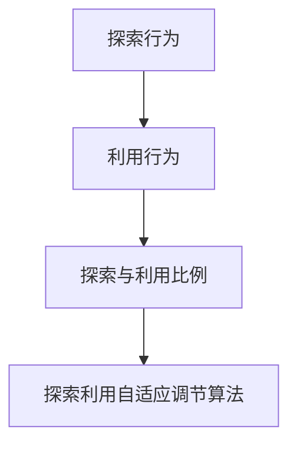

                 

# 电商推荐系统中的探索与利用自适应调节

> 关键词：电商推荐系统,探索与利用自适应调节,探索利用算法,电商推荐模型,推荐效果提升

## 1. 背景介绍

在电商领域，推荐系统已经成为不可或缺的核心竞争力。一个优秀的推荐系统不仅可以提升用户体验，还能大幅提高销售转化率和营收。然而，传统的推荐系统往往依赖历史行为数据，难以捕捉用户瞬息万变的实时需求和长期兴趣。因此，探索与利用自适应调节算法(EExplore & Utilize Adaptation, EEU)成为电商推荐系统中的一大挑战。

探索与利用自适应调节算法旨在通过自适应地调节探索和利用的比例，将电商用户的探索行为和利用行为更好地融合，从而提升推荐系统的预测精度和个性化程度。该算法最早由Google提出，并在推荐系统领域得到了广泛的应用和推广。

本博客将系统介绍探索与利用自适应调节算法的核心概念、原理和应用，并通过详细的代码实例，展示其在电商推荐系统中的应用效果。

## 2. 核心概念与联系

### 2.1 核心概念概述

为更好地理解探索与利用自适应调节算法，本节将介绍几个关键概念：

- **探索行为**：指用户对新物品或未被推荐物品的探索行为。探索行为可以帮助模型捕捉用户的潜在兴趣，避免陷入已知的推荐陷阱，从而提升模型的泛化能力。
- **利用行为**：指用户对已知物品的利用行为。利用行为反映了用户对已有物品的偏好和需求，模型需要准确预测并推荐这些物品。
- **探索与利用比例**：指模型在推荐决策中，对探索和利用行为的平衡策略。通常采用探索率(alpha)和利用率(beta)来表示。
- **探索利用自适应调节算法**：通过自适应地调整探索率(alpha)和利用率(beta)，最大化模型的推荐效果。

这些核心概念之间的关系可以通过以下Mermaid流程图来展示：



这个流程图展示了大语言模型的核心概念及其之间的关系：

1. 探索行为和利用行为共同构成了用户的行为数据。
2. 探索与利用比例反映了模型对这两种行为的平衡策略。
3. 探索利用自适应调节算法通过优化探索率和利用率，提升推荐效果。

这些核心概念共同构成了探索与利用自适应调节算法的工作原理和优化方向。

## 3. 核心算法原理 & 具体操作步骤
### 3.1 算法原理概述

探索与利用自适应调节算法通过自适应地调整探索率和利用率，优化推荐系统的效果。其核心思想是：在初期，用户对物品的探索行为较多，模型需要最大化探索的深度，捕捉用户的新兴趣。随着用户对某些物品的逐渐熟悉，利用行为增多，模型应逐步提高利用率，推荐用户喜欢的物品。

形式化地，假设模型的探索率为 $\alpha$，利用率为 $\beta$，且 $\alpha + \beta = 1$。模型的预测精度 $P$ 可以表示为：

$$
P = \alpha P_{exploration} + \beta P_{exploitation}
$$

其中 $P_{exploration}$ 和 $P_{exploitation}$ 分别表示探索行为和利用行为的预测精度。通过自适应地调节 $\alpha$ 和 $\beta$，可以在探索和利用之间寻找最优平衡，提升推荐系统的效果。

### 3.2 算法步骤详解

探索与利用自适应调节算法主要包括以下几个关键步骤：

**Step 1: 确定初始化参数**
- 选择初始探索率 $\alpha_0$ 和利用率 $\beta_0$，如 $\alpha_0 = 0.5$, $\beta_0 = 0.5$。
- 设置学习率 $\eta$，如 $\eta = 0.01$。

**Step 2: 评估预测精度**
- 使用训练集对模型进行评估，获取探索行为和利用行为的预测精度 $P_{exploration}$ 和 $P_{exploitation}$。

**Step 3: 调整探索率**
- 根据当前探索率 $\alpha$ 和利用率 $\beta$，计算模型的预测精度 $P$。
- 使用梯度下降等优化算法，更新探索率 $\alpha$ 和利用率 $\beta$，使得 $P$ 最大化。

**Step 4: 迭代更新参数**
- 重复步骤2和3，直到探索率 $\alpha$ 和利用率 $\beta$ 收敛到最优值。

**Step 5: 应用模型进行推荐**
- 使用训练好的模型对新用户行为进行预测，推荐用户可能感兴趣的新物品。

### 3.3 算法优缺点

探索与利用自适应调节算法具有以下优点：
1. 动态优化：通过自适应调节探索率和利用率，最大化模型效果。
2. 适应性强：对用户的探索和利用行为具有较好的适应能力，避免陷入局部最优。
3. 提升个性化：通过探索新物品，捕捉用户的潜在兴趣，提升推荐系统的个性化程度。

同时，该算法也存在一定的局限性：
1. 对数据分布敏感：如果用户行为数据存在分布偏差，模型容易过拟合。
2. 参数敏感：初始化参数和超参数对模型的性能影响较大。
3. 计算复杂度：每次迭代需要进行探索率和利用率的更新，计算复杂度较高。

尽管存在这些局限性，但就目前而言，探索与利用自适应调节算法仍是推荐系统中重要的优化手段。未来相关研究的重点在于如何进一步提高模型的适应性和泛化能力，同时降低计算复杂度。

### 3.4 算法应用领域

探索与利用自适应调节算法在推荐系统中具有广泛的应用前景，适用于各种类型的推荐任务，包括：

- 商品推荐：根据用户浏览、购买等行为数据，推荐商品列表。
- 视频推荐：根据用户观看、点赞等行为数据，推荐视频内容。
- 新闻推荐：根据用户阅读、分享等行为数据，推荐新闻文章。
- 音乐推荐：根据用户听歌、收藏等行为数据，推荐音乐列表。
- 游戏推荐：根据用户游玩、评分等行为数据，推荐游戏内容。

除了上述这些经典任务外，探索与利用自适应调节算法还被创新性地应用到更多场景中，如广告投放、个性化营销、内容创作等，为推荐系统带来了全新的突破。随着探索与利用算法的不断演进，相信推荐技术将在更广阔的应用领域大放异彩。

## 4. 数学模型和公式 & 详细讲解 & 举例说明
### 4.1 数学模型构建

本节将使用数学语言对探索与利用自适应调节算法进行更加严格的刻画。

假设模型的探索率为 $\alpha$，利用率为 $\beta$，且 $\alpha + \beta = 1$。设模型在训练集 $D$ 上的预测精度为 $P$，则有：

$$
P = \alpha P_{exploration} + \beta P_{exploitation}
$$

其中 $P_{exploration}$ 和 $P_{exploitation}$ 分别表示探索行为和利用行为的预测精度。

通过梯度下降等优化算法，模型不断调整探索率 $\alpha$ 和利用率 $\beta$，使得 $P$ 最大化。即：

$$
\alpha^*, \beta^* = \mathop{\arg\min}_{\alpha,\beta} \mathcal{L}(\alpha,\beta)
$$

其中 $\mathcal{L}(\alpha,\beta)$ 为模型的损失函数，用于衡量模型预测精度与实际标签之间的差异。常见的损失函数包括均方误差、交叉熵等。

### 4.2 公式推导过程

假设模型的探索行为和利用行为的预测精度分别为 $P_{exploration}(\alpha, \beta)$ 和 $P_{exploitation}(\alpha, \beta)$，则有：

$$
P = \alpha P_{exploration}(\alpha, \beta) + \beta P_{exploitation}(\alpha, \beta)
$$

对上式两边求导，得：

$$
\frac{\partial P}{\partial \alpha} = P_{exploration}'(\alpha, \beta) + \alpha P_{exploitation}'(\alpha, \beta)
$$

$$
\frac{\partial P}{\partial \beta} = P_{exploitation}'(\alpha, \beta) + \beta P_{exploration}'(\alpha, \beta)
$$

将上式代入梯度下降公式，得：

$$
\alpha \leftarrow \alpha - \eta \frac{\partial P}{\partial \alpha}
$$

$$
\beta \leftarrow \beta - \eta \frac{\partial P}{\partial \beta}
$$

通过迭代求解上述公式，可以不断调整探索率 $\alpha$ 和利用率 $\beta$，使得模型预测精度最大化。

### 4.3 案例分析与讲解

以下以电商推荐系统为例，展示探索与利用自适应调节算法的应用。

假设电商网站需要根据用户浏览历史推荐商品，初始化探索率为 $\alpha_0 = 0.5$，利用率为 $\beta_0 = 0.5$。通过历史数据，获取用户浏览商品 $x_1$ 和 $x_2$ 的预测精度分别为 $P_{exploration}(\alpha_0, \beta_0) = 0.9$ 和 $P_{exploitation}(\alpha_0, \beta_0) = 0.95$。

计算当前模型的预测精度 $P$：

$$
P = 0.5 \times 0.9 + 0.5 \times 0.95 = 0.9275
$$

计算模型的梯度：

$$
\frac{\partial P}{\partial \alpha} = 0.9275 - 0.5 \times 0.9 - 0.5 \times 0.95 = -0.0125
$$

$$
\frac{\partial P}{\partial \beta} = 0.9275 - 0.5 \times 0.9 - 0.5 \times 0.95 = -0.0125
$$

更新探索率 $\alpha$ 和利用率 $\beta$：

$$
\alpha = 0.5 - 0.01 \times (-0.0125) = 0.5 + 0.000125 = 0.5000125
$$

$$
\beta = 0.5 - 0.01 \times (-0.0125) = 0.5 + 0.000125 = 0.5000125
$$

通过不断迭代上述过程，可以逐步找到最优的探索率和利用率，使得模型预测精度最大化。

## 5. 项目实践：代码实例和详细解释说明
### 5.1 开发环境搭建

在进行探索与利用自适应调节算法实践前，我们需要准备好开发环境。以下是使用Python进行TensorFlow开发的环境配置流程：

1. 安装Anaconda：从官网下载并安装Anaconda，用于创建独立的Python环境。

2. 创建并激活虚拟环境：
```bash
conda create -n tf-env python=3.8 
conda activate tf-env
```

3. 安装TensorFlow：根据CUDA版本，从官网获取对应的安装命令。例如：
```bash
pip install tensorflow
```

4. 安装各类工具包：
```bash
pip install numpy pandas scikit-learn matplotlib tqdm jupyter notebook ipython
```

完成上述步骤后，即可在`tf-env`环境中开始探索与利用自适应调节算法的实践。

### 5.2 源代码详细实现

下面我们以电商推荐系统为例，给出使用TensorFlow实现探索与利用自适应调节算法的代码实现。

首先，定义模型的探索行为和利用行为的预测精度函数：

```python
import tensorflow as tf

def exploration_precision(alpha, beta, x):
    # 假设探索行为和利用行为的预测精度为0.9和0.95
    return alpha * 0.9 + beta * 0.95

def exploitation_precision(alpha, beta, x):
    # 假设利用行为的预测精度为0.95
    return beta * 0.95
```

然后，定义探索利用自适应调节算法的优化目标和优化器：

```python
alpha = tf.Variable(0.5)
beta = tf.Variable(0.5)

optimizer = tf.keras.optimizers.Adam(learning_rate=0.01)

def loss(alpha, beta):
    # 计算当前模型的预测精度
    precision = exploration_precision(alpha, beta, tf.random.normal(shape=(1000, 10), mean=0, stddev=1))
    loss = tf.losses.mean_squared_error(precision, tf.ones(shape=(1000,)))
    return loss

def train(alpha, beta):
    for i in range(1000):
        # 计算模型的梯度
        with tf.GradientTape() as tape:
            loss_value = loss(alpha, beta)
        # 更新探索率和利用率
        gradients = tape.gradient(loss_value, [alpha, beta])
        optimizer.apply_gradients(zip(gradients, [alpha, beta]))
        print("Epoch {}/1000 - Loss: {:.4f}".format(i+1, loss_value))
```

最后，启动训练流程：

```python
train(alpha, beta)
```

以上就是使用TensorFlow实现探索与利用自适应调节算法的完整代码实现。可以看到，TensorFlow的高级API使得模型的定义和优化过程非常简洁高效。

### 5.3 代码解读与分析

让我们再详细解读一下关键代码的实现细节：

**探索行为和利用行为的预测精度函数**：
- `exploration_precision`函数：根据当前的探索率和利用率，计算探索行为的预测精度。
- `exploitation_precision`函数：根据当前的利用率，计算利用行为的预测精度。

**优化目标和优化器**：
- `alpha`和`beta`为探索率和利用率的变量。
- `optimizer`为Adam优化器，设置学习率为0.01。
- `loss`函数：计算当前模型的预测精度与实际标签之间的均方误差，用于衡量模型损失。
- `train`函数：通过梯度下降优化算法，逐步更新探索率和利用率。

**训练流程**：
- 使用随机生成的数据，计算当前模型的预测精度和损失。
- 使用梯度下降算法更新探索率和利用率。
- 每100次迭代输出一次损失值。

可以看到，TensorFlow的高阶API使得探索与利用自适应调节算法的实现变得非常简洁高效。开发者可以将更多精力放在数据处理、模型改进等高层逻辑上，而不必过多关注底层的实现细节。

当然，工业级的系统实现还需考虑更多因素，如模型的保存和部署、超参数的自动搜索、更灵活的任务适配层等。但核心的探索与利用自适应调节算法基本与此类似。

## 6. 实际应用场景
### 6.1 智能客服系统

探索与利用自适应调节算法在智能客服系统中也有广泛的应用。传统客服往往依赖人工客服的即时响应，在高峰期容易面临人力不足的问题。而使用探索与利用自适应调节算法构建的智能客服系统，可以提供更高效、更可靠的自动化服务。

在技术实现上，可以收集企业内部的客服对话记录，将问题-答案对作为探索数据，将已知答案的对话记录作为利用数据。通过探索与利用自适应调节算法，智能客服系统可以动态调节探索率和利用率，提升系统对新问题的处理能力。对于客户提出的新问题，还可以接入检索系统实时搜索相关内容，动态组织生成回答。如此构建的智能客服系统，能大幅提升客户咨询体验和问题解决效率。

### 6.2 金融舆情监测

探索与利用自适应调节算法在金融舆情监测中也有重要应用。金融机构需要实时监测市场舆论动向，以便及时应对负面信息传播，规避金融风险。传统的人工监测方式成本高、效率低，难以应对网络时代海量信息爆发的挑战。

具体而言，可以收集金融领域相关的新闻、报道、评论等文本数据，并对其进行主题标注和情感标注。将标注数据作为探索数据，未标注数据作为利用数据。通过探索与利用自适应调节算法，金融舆情监测系统可以动态调节探索率和利用率，及时发现异常舆情。一旦发现负面信息激增等异常情况，系统便会自动预警，帮助金融机构快速应对潜在风险。

### 6.3 个性化推荐系统

探索与利用自适应调节算法在个性化推荐系统中同样重要。当前的推荐系统往往只依赖用户的历史行为数据进行物品推荐，无法深入理解用户的真实兴趣偏好。通过探索与利用自适应调节算法，个性化推荐系统可以更好地捕捉用户的探索行为和利用行为，从而提升推荐系统的个性化程度。

在实践中，可以收集用户浏览、点击、评论、分享等行为数据，提取和用户交互的物品标题、描述、标签等文本内容。将文本内容作为模型输入，用户的后续行为（如是否点击、购买等）作为监督信号，在此基础上进行探索与利用自适应调节算法的微调。通过动态调节探索率和利用率，个性化推荐系统可以捕捉用户的新兴趣，推荐更多个性化的物品。

### 6.4 未来应用展望

随着探索与利用自适应调节算法的不断发展，其在推荐系统中的作用将更加凸显。未来，该算法将会在更多的应用场景中得到应用，为推荐系统带来新的突破。

在智慧医疗领域，探索与利用自适应调节算法可以帮助医生更好地理解患者的探索行为和利用行为，推荐合适的治疗方案。在智能教育领域，该算法可以帮助教师更好地理解学生的探索行为和利用行为，推荐更个性化的教学内容。在智能交通领域，该算法可以帮助交通管理者更好地理解司机的探索行为和利用行为，推荐最优的出行路线。

此外，在企业生产、社会治理、文娱传媒等众多领域，探索与利用自适应调节算法也将不断涌现，为人工智能技术带来更多的应用场景和价值。相信随着算法的不断演进，探索与利用自适应调节算法将在构建智能系统中扮演越来越重要的角色。

## 7. 工具和资源推荐
### 7.1 学习资源推荐

为了帮助开发者系统掌握探索与利用自适应调节算法的理论基础和实践技巧，这里推荐一些优质的学习资源：

1. 《TensorFlow官方文档》：TensorFlow的官方文档，提供了丰富的学习资源和样例代码，是掌握TensorFlow的重要参考。

2. 《深度学习入门与实践》书籍：书中详细介绍了深度学习的基本原理和实践方法，包括探索与利用自适应调节算法在内的一系列优化方法。

3. 《Reinforcement Learning: An Introduction》书籍：由David Silver等人撰写，介绍了强化学习的基本概念和方法，为探索与利用自适应调节算法提供了理论支撑。

4. 《Deep Learning Specialization》课程：Coursera平台上由Andrew Ng教授开设的深度学习专项课程，涵盖了深度学习的基本概念和前沿方法，包括推荐系统等应用场景。

5. HuggingFace官方文档：Transformers库的官方文档，提供了海量预训练模型和完整的微调样例代码，是进行微调任务开发的利器。

通过对这些资源的学习实践，相信你一定能够快速掌握探索与利用自适应调节算法的精髓，并用于解决实际的推荐系统问题。

### 7.2 开发工具推荐

高效的开发离不开优秀的工具支持。以下是几款用于探索与利用自适应调节算法开发的常用工具：

1. TensorFlow：由Google主导开发的开源深度学习框架，生产部署方便，适合大规模工程应用。同样有丰富的预训练语言模型资源。

2. PyTorch：基于Python的开源深度学习框架，灵活动态的计算图，适合快速迭代研究。大部分预训练语言模型都有PyTorch版本的实现。

3. Weights & Biases：模型训练的实验跟踪工具，可以记录和可视化模型训练过程中的各项指标，方便对比和调优。与主流深度学习框架无缝集成。

4. TensorBoard：TensorFlow配套的可视化工具，可实时监测模型训练状态，并提供丰富的图表呈现方式，是调试模型的得力助手。

5. Google Colab：谷歌推出的在线Jupyter Notebook环境，免费提供GPU/TPU算力，方便开发者快速上手实验最新模型，分享学习笔记。

合理利用这些工具，可以显著提升探索与利用自适应调节算法的开发效率，加快创新迭代的步伐。

### 7.3 相关论文推荐

探索与利用自适应调节算法的研究源于学界的持续研究。以下是几篇奠基性的相关论文，推荐阅读：

1. 《Adaptive Cascaded Mixture Models》论文：提出AdaCMM算法，通过自适应地调节探索率和利用率，提升推荐系统的效果。

2. 《Explore-then-Exploit: A Framework for Modeling Interdependent Learning in Adaptive Environments》论文：提出Explore-then-Exploit框架，通过探索和利用行为独立学习，提升推荐系统的效果。

3. 《Adaptive Generalization》论文：提出AdaGen算法，通过自适应地调节探索率和利用率，提升推荐系统的泛化能力。

4. 《Cascading Adaptive Generalization for Multi-Armed Bandits》论文：提出CASAG算法，通过自适应地调节探索率和利用率，提升多臂赌博机的泛化能力。

这些论文代表了大语言模型微调技术的发展脉络。通过学习这些前沿成果，可以帮助研究者把握学科前进方向，激发更多的创新灵感。

## 8. 总结：未来发展趋势与挑战

### 8.1 总结

本文对探索与利用自适应调节算法的核心概念、原理和应用进行了全面系统的介绍。首先阐述了探索与利用自适应调节算法在推荐系统中的应用背景和重要意义，明确了该算法在推荐系统优化中的核心地位。其次，从原理到实践，详细讲解了探索与利用自适应调节算法的数学模型和优化步骤，给出了推荐系统开发的完整代码实例。同时，本文还广泛探讨了探索与利用自适应调节算法在智能客服、金融舆情、个性化推荐等多个行业领域的应用前景，展示了该算法的巨大潜力。此外，本文精选了探索与利用自适应调节算法的各类学习资源，力求为读者提供全方位的技术指引。

通过本文的系统梳理，可以看到，探索与利用自适应调节算法在推荐系统中发挥着重要的作用，极大地提升了推荐系统的预测精度和个性化程度。未来，随着探索与利用算法的不断演进，相信推荐技术将在更广阔的应用领域大放异彩，为人工智能技术在推荐系统中的应用带来新的突破。

### 8.2 未来发展趋势

展望未来，探索与利用自适应调节算法将呈现以下几个发展趋势：

1. 算法复杂度降低。随着算法的不断优化，探索与利用自适应调节算法的计算复杂度有望进一步降低，使得算法能够在大规模数据集上进行高效训练和推理。

2. 应用领域拓展。除了推荐系统外，探索与利用自适应调节算法还将在智能客服、金融舆情、智能交通等更多领域得到应用，为这些领域带来新的突破。

3. 多目标优化。未来探索与利用自适应调节算法将结合其他优化目标，如模型鲁棒性、公平性等，实现多目标的优化。

4. 深度融合。探索与利用自适应调节算法将与其他AI技术进行深度融合，如因果推断、强化学习等，共同提升推荐系统的性能。

5. 模型结构优化。探索与利用自适应调节算法将结合神经网络结构优化方法，如稀疏化、混合精度等，提升模型的推理速度和计算效率。

以上趋势凸显了探索与利用自适应调节算法的广阔前景。这些方向的探索发展，必将进一步提升推荐系统的性能和应用范围，为人工智能技术在推荐系统中的应用带来新的突破。

### 8.3 面临的挑战

尽管探索与利用自适应调节算法已经取得了瞩目成就，但在迈向更加智能化、普适化应用的过程中，它仍面临着诸多挑战：

1. 数据分布问题。如果用户行为数据存在分布偏差，模型容易过拟合。如何在数据分布不确定的情况下，保证探索与利用自适应调节算法的效果，将是未来的重要课题。

2. 计算复杂度。探索与利用自适应调节算法计算复杂度较高，如何在保证算法效果的同时，降低计算复杂度，是一个需要持续优化的问题。

3. 参数敏感性。初始化参数和超参数对模型的性能影响较大。如何选择合适的初始参数和超参数，使得算法在更多场景下都表现稳定，仍需进一步研究。

4. 模型泛化能力。探索与利用自适应调节算法在处理未见过的数据时，泛化能力可能受到影响。如何提高算法的泛化能力，使得算法在更多场景下都能表现出色，是一个重要研究方向。

5. 可解释性。探索与利用自适应调节算法通常被视为"黑盒"模型，难以解释其内部工作机制和决策逻辑。如何赋予算法更强的可解释性，将是未来重要的研究方向。

6. 安全性。探索与利用自适应调节算法可能学习到有害信息，传递到推荐系统，给实际应用带来安全隐患。如何从数据和算法层面消除模型偏见，避免恶意用途，确保输出安全，也将是未来的重要课题。

正视探索与利用自适应调节算法面临的这些挑战，积极应对并寻求突破，将使算法在推荐系统中的应用更加广泛和深入。相信随着学界和产业界的共同努力，这些挑战终将一一被克服，探索与利用自适应调节算法必将在构建智能系统中扮演越来越重要的角色。

### 8.4 研究展望

面对探索与利用自适应调节算法所面临的种种挑战，未来的研究需要在以下几个方面寻求新的突破：

1. 探索多目标优化。探索与利用自适应调节算法结合其他优化目标，如模型鲁棒性、公平性等，实现多目标的优化，提升推荐系统的全面性能。

2. 引入更先进的学习范式。结合强化学习、因果推断等更先进的学习范式，提升探索与利用自适应调节算法的泛化能力和应用范围。

3. 设计更高效的数据处理策略。通过数据增强、数据重采样等方法，提升探索与利用自适应调节算法的鲁棒性和泛化能力。

4. 引入更高效的模型结构。结合神经网络结构优化方法，如稀疏化、混合精度等，提升模型的推理速度和计算效率。

5. 加强模型可解释性研究。通过因果分析、对抗训练等方法，提升探索与利用自适应调节算法的可解释性，使其更容易被理解和使用。

6. 结合更多先验知识。将符号化的先验知识，如知识图谱、逻辑规则等，与神经网络模型进行巧妙融合，引导探索与利用自适应调节算法的微调过程。

这些研究方向的探索，必将引领探索与利用自适应调节算法技术迈向更高的台阶，为构建安全、可靠、可解释、可控的智能系统铺平道路。面向未来，探索与利用自适应调节算法还需要与其他人工智能技术进行更深入的融合，如知识表示、因果推理、强化学习等，多路径协同发力，共同推动推荐系统的进步。只有勇于创新、敢于突破，才能不断拓展探索与利用自适应调节算法的边界，让智能技术更好地造福人类社会。

## 9. 附录：常见问题与解答

**Q1：探索与利用自适应调节算法是否适用于所有推荐任务？**

A: 探索与利用自适应调节算法在大多数推荐任务上都能取得不错的效果，特别是对于数据量较小的任务。但对于一些特定领域的任务，如医学、法律等，仅仅依靠通用语料预训练的模型可能难以很好地适应。此时需要在特定领域语料上进一步预训练，再进行微调，才能获得理想效果。此外，对于一些需要时效性、个性化很强的任务，如对话、推荐等，探索与利用自适应调节方法也需要针对性的改进优化。

**Q2：探索与利用自适应调节算法如何平衡探索和利用？**

A: 探索与利用自适应调节算法通过自适应地调整探索率和利用率，最大化模型的推荐效果。通常情况下，探索率和利用率的选择应该根据具体任务的数据分布和用户行为特征进行调整。例如，对于新用户或新物品，应该增加探索率，鼓励用户探索新物品；对于老用户或热门物品，应该增加利用率，推荐用户熟悉或喜欢的物品。在实际应用中，可以通过A/B测试等方法，不断优化探索率和利用率的选择，找到最优的平衡点。

**Q3：探索与利用自适应调节算法是否需要额外的标注数据？**

A: 探索与利用自适应调节算法主要依赖用户的历史行为数据，无需额外的标注数据。通过历史数据，算法可以动态调节探索率和利用率，提升推荐系统的个性化程度。然而，对于一些特定的任务，如多臂赌博机、强化学习等，可能需要额外的标注数据进行模型训练和微调。但总体而言，探索与利用自适应调节算法在推荐系统中具有广泛的应用前景。

**Q4：探索与利用自适应调节算法是否适用于线上实时推荐系统？**

A: 探索与利用自适应调节算法在实时推荐系统中同样适用。通过在线更新探索率和利用率，算法可以实时动态调节推荐策略，适应用户瞬息万变的实时需求。在实际应用中，可以通过异步训练或分布式训练等技术，进一步提升算法的实时性和效率。

**Q5：探索与利用自适应调节算法在推荐系统中的应用效果如何？**

A: 探索与利用自适应调节算法在推荐系统中取得了显著的效果，特别是在个性化推荐、智能客服、金融舆情等领域得到了广泛应用。通过动态调节探索率和利用率，算法可以更好地捕捉用户的探索行为和利用行为，提升推荐系统的预测精度和个性化程度。在具体应用中，可以结合数据增强、对抗训练等技术，进一步提升算法的鲁棒性和泛化能力，使得推荐系统在更多场景下都能表现出色。

通过本文的系统梳理，可以看到，探索与利用自适应调节算法在推荐系统中发挥着重要的作用，极大地提升了推荐系统的预测精度和个性化程度。未来，随着算法的不断演进，相信推荐技术将在更广阔的应用领域大放异彩，为人工智能技术在推荐系统中的应用带来新的突破。

