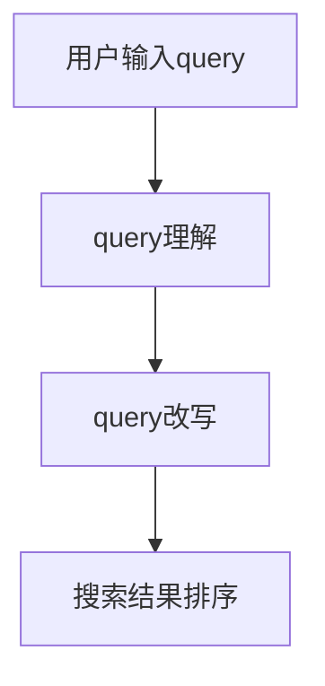

                 

## 1. 背景介绍

在现代电商平台上，搜索系统是最为核心的应用之一。用户输入一个query，系统需要理解并解析出用户的真实意图，进而返回最相关的搜索结果。然而，由于用户输入的query五花八门，且充满了拼写错误、语法不规范等自然语言处理(NLP)问题，传统的搜索系统常常难以准确理解用户的查询意图，导致搜索结果与用户需求存在较大偏差。

为了提升搜索系统的精度和效率，研究者们提出了多种query理解与改写技术，旨在通过算法自动解析用户query，甚至自动生成更规范的query，从而更好地匹配用户需求，提高搜索结果的相关性。本文将对电商搜索中的query理解与改写技术进行深入探讨，介绍其核心原理、具体操作步骤以及优缺点。

## 2. 核心概念与联系

### 2.1 核心概念概述

在电商搜索系统中，query理解与改写技术主要涉及以下几个核心概念：

- **query理解**：系统对用户输入的query进行语义分析和意图识别，从中解析出用户的真实需求。常见的query理解技术包括关键词提取、实体识别、情感分析等。

- **query改写**：在系统理解用户query后，根据用户的真实需求，自动生成新的、更规范的query，以提高搜索效率和效果。query改写技术通常依赖于自然语言生成(NLG)和语义转换等技术。

- **搜索结果排序**：根据理解与改写后的query，对搜索结果进行排序，优先展示与用户query最匹配的结果。常用的排序算法包括TF-IDF、BM25等。

这些核心概念共同构成了电商搜索系统的基础，使得系统能够高效、准确地处理用户查询，提供精准的搜索结果。

### 2.2 核心概念原理和架构的 Mermaid 流程图



该流程图展示了query理解与改写技术的核心流程：用户输入query后，首先通过query理解模块进行解析，然后根据理解结果自动进行query改写，最后通过排序模块对搜索结果进行展示。

## 3. 核心算法原理 & 具体操作步骤

### 3.1 算法原理概述

query理解与改写技术的核心原理包括以下几个方面：

- **自然语言处理(NLP)**：通过分词、词性标注、句法分析等技术，解析用户query中的关键词、实体和情感等信息。

- **语义表示学习**：通过词嵌入、句向量等技术，将自然语言转化为高维向量，用于后续的相似度计算和意图识别。

- **意图识别与分类**：通过机器学习或深度学习方法，对用户query的语义进行分类，识别出用户的意图。

- **查询改写**：利用NLG和语义转换等技术，生成新的、规范的query，以提升查询效果。

- **结果排序**：根据改写后的query和搜索结果进行相似度计算，通过排序算法将结果按相关性排序，展示给用户。

这些技术的有机结合，使得电商搜索系统能够高效地处理用户查询，并提供精准的搜索结果。

### 3.2 算法步骤详解

#### 3.2.1 查询理解

query理解的过程主要包括以下几个步骤：

1. **分词与词性标注**：将用户输入的query分割成词语，并标注每个词语的词性。例如，对于query "搜索最适合夏季旅游的城市"，可以分割为["搜索", "最", "适合", "夏季", "旅游", "的", "城市"]。

2. **实体识别**：识别出query中的实体，如人名、地名、组织名等。例如，对于上述query，实体为"夏季"、"旅游"、"城市"。

3. **情感分析**：判断query中的情感倾向，如正面、负面、中性等。例如，上述query中情感倾向为正面。

4. **意图识别与分类**：通过机器学习模型，对上述信息进行综合分析，识别出用户query的意图。例如，上述query的意图为"寻找夏季旅游城市"。

#### 3.2.2 查询改写

query改写的过程主要包括以下几个步骤：

1. **关键词提取**：从理解后的query中提取出关键词，例如上述query中的"夏季"、"旅游"、"城市"。

2. **同义词替换**：将关键词替换为同义词，例如将"旅游"替换为"旅行"。

3. **语义转换**：将query的语义转换为新的表达形式，例如将"搜索夏季旅游城市"转换为"查询适宜夏季旅游的城市"。

4. **生成新query**：根据上述步骤，生成新的、规范的query，例如上述query可以生成"搜索夏季旅游城市"和"查询夏季适宜旅游的城市"。

#### 3.2.3 结果排序

结果排序的过程主要包括以下几个步骤：

1. **相似度计算**：根据改写后的query和搜索结果，计算相似度。常用的相似度计算方法包括余弦相似度、Jaccard相似度等。

2. **排序算法**：根据相似度计算结果，使用排序算法对搜索结果进行排序。常用的排序算法包括TF-IDF、BM25等。

3. **展示结果**：将排序后的结果展示给用户，优先展示最相关的结果。

### 3.3 算法优缺点

#### 3.3.1 优点

- **提升查询效果**：通过query改写，能够生成更规范的query，提升查询效果。

- **自动理解用户意图**：通过自然语言处理技术，自动解析用户query，提升查询理解准确性。

- **提高搜索结果相关性**：通过相似度计算和排序算法，提高搜索结果的相关性。

#### 3.3.2 缺点

- **算法复杂度高**：query理解与改写涉及多层次的NLP处理，算法复杂度高，计算成本较大。

- **依赖语料库质量**：query理解与改写效果依赖于语料库的质量和规模，获取高质量语料库的成本较高。

- **领域特定性**：不同领域的query理解与改写模型需要专门训练，通用模型效果有限。

### 3.4 算法应用领域

query理解与改写技术在电商搜索、智能客服、智能问答等多个领域都有广泛应用。例如：

- **电商搜索**：通过query理解与改写技术，提升搜索结果的相关性，提高用户体验。

- **智能客服**：通过query理解与改写技术，自动回答用户问题，提高服务效率和质量。

- **智能问答**：通过query理解与改写技术，自动解析用户问题，提供准确的回答。

## 4. 数学模型和公式 & 详细讲解 & 举例说明

### 4.1 数学模型构建

query理解与改写技术可以构建如下数学模型：

1. **关键词提取**：将query分割成词语，记为$x_1, x_2, ..., x_n$。关键词提取可以通过TF-IDF等技术，将每个词语转化为一个向量。

2. **实体识别**：识别query中的实体，记为$e_1, e_2, ..., e_m$。

3. **情感分析**：判断query中的情感倾向，记为$s \in \{1, 0\}$，其中1表示正面情感，0表示负面情感或中性情感。

4. **意图识别与分类**：通过机器学习模型，将上述信息综合分析，识别出用户的意图$y$。

5. **查询改写**：将query改写为新的query，记为$x'$。

6. **相似度计算**：计算改写后的query和搜索结果之间的相似度，记为$sim$。

7. **结果排序**：根据相似度计算结果，对搜索结果进行排序，记为$R$。

### 4.2 公式推导过程

#### 4.2.1 关键词提取

设$TF(x_i)$为词语$x_i$在query中的TF值，$IDF(x_i)$为逆文档频率，则词语$x_i$的关键词向量为：

$$
\mathbf{v}(x_i) = (TF(x_i), IDF(x_i))
$$

#### 4.2.2 实体识别

实体识别可以采用命名实体识别(NER)技术，将每个实体标记为特定类型，如人名、地名等。实体向量可以表示为：

$$
\mathbf{e} = \{\mathbf{e}_1, \mathbf{e}_2, ..., \mathbf{e}_m\}
$$

其中$\mathbf{e}_i$表示第$i$个实体的向量表示。

#### 4.2.3 情感分析

情感分析可以采用基于情感词典的方法，将query中的每个词语与情感词典进行匹配，计算情感得分。

$$
s = \sum_{i=1}^n s_i
$$

其中$s_i$表示词语$x_i$的情感得分。

#### 4.2.4 意图识别与分类

意图识别可以采用深度学习方法，如卷积神经网络(CNN)、循环神经网络(RNN)等，将上述信息综合分析，识别出用户的意图$y$。

$$
y = f(\mathbf{v}, \mathbf{e}, s)
$$

其中$f$为意图分类模型。

#### 4.2.5 查询改写

查询改写可以采用基于规则的方法，如同义词替换、语义转换等。设$x'$为改写后的query，则有：

$$
x' = T(x)
$$

其中$T$为查询改写模型。

#### 4.2.6 相似度计算

相似度计算可以采用余弦相似度公式，计算改写后的query和搜索结果之间的相似度：

$$
sim = \cos(\mathbf{x}', \mathbf{d})
$$

其中$\mathbf{x}'$为改写后的query向量，$\mathbf{d}$为搜索结果向量。

#### 4.2.7 结果排序

结果排序可以采用排序算法，如TF-IDF、BM25等，对搜索结果进行排序：

$$
R = Sort(sim, D)
$$

其中$D$为搜索结果集，$Sort$为排序算法。

### 4.3 案例分析与讲解

假设用户输入query "find book on machine learning"，系统进行如下处理：

1. **分词与词性标注**：将query分割为["find", "book", "on", "machine", "learning"]

2. **实体识别**：识别出实体["machine", "learning"]

3. **情感分析**：判断query为中性情感

4. **意图识别与分类**：通过意图识别模型，识别出用户的意图为"查找机器学习书籍"

5. **查询改写**：生成改写后的query "search machine learning books"

6. **相似度计算**：计算改写后的query与搜索结果的余弦相似度

7. **结果排序**：根据相似度排序，展示最相关的搜索结果

## 5. 项目实践：代码实例和详细解释说明

### 5.1 开发环境搭建

在进行query理解与改写技术的开发实践中，首先需要搭建好开发环境。以下是使用Python进行PyTorch开发的流程：

1. 安装Anaconda：从官网下载并安装Anaconda，用于创建独立的Python环境。

2. 创建并激活虚拟环境：
```bash
conda create -n pytorch-env python=3.8 
conda activate pytorch-env
```

3. 安装PyTorch：根据CUDA版本，从官网获取对应的安装命令。例如：
```bash
conda install pytorch torchvision torchaudio cudatoolkit=11.1 -c pytorch -c conda-forge
```

4. 安装相关库：
```bash
pip install torchtext spacy transformers sklearn
```

完成上述步骤后，即可在`pytorch-env`环境中开始项目开发。

### 5.2 源代码详细实现

以下是一个简单的query理解与改写系统的Python代码实现，使用PyTorch和Transformer库：

```python
import torch
from torchtext import datasets, data, transforms
from transformers import BertTokenizer, BertModel

# 加载数据集
train_data, test_data = datasets.IMDB.splits()

# 定义数据处理流程
TEXT = data.Field(tokenize='spacy', lower=True, include_lengths=True)
LABEL = data.LabelField(dtype=torch.float)
TEXT.set_lengths(train_data.get_lengths())
LABEL.set_lengths(train_data.get_lengths())
train_data, valid_data = datasets.load_datasets('imdb', split=('train', 'test'))

# 定义模型和优化器
model = BertModel.from_pretrained('bert-base-uncased', num_labels=2)
optimizer = torch.optim.Adam(model.parameters(), lr=1e-3)

# 训练模型
def train_epoch(model, data, optimizer, device):
    model.train()
    total_loss = 0
    for batch in data:
        texts, labels = batch.text.to(device), batch.label.to(device)
        outputs = model(texts)
        loss = outputs.loss
        optimizer.zero_grad()
        loss.backward()
        optimizer.step()
        total_loss += loss.item()
    return total_loss / len(data)

# 测试模型
def evaluate(model, data, device):
    model.eval()
    total_loss = 0
    total_correct = 0
    with torch.no_grad():
        for batch in data:
            texts, labels = batch.text.to(device), batch.label.to(device)
            outputs = model(texts)
            loss = outputs.loss
            _, preds = torch.max(outputs.predictions, dim=1)
            total_correct += (preds == labels).sum().item()
            total_loss += loss.item()
    return total_correct / len(data), total_loss / len(data)

# 运行训练和测试
device = torch.device('cuda') if torch.cuda.is_available() else torch.device('cpu')
for epoch in range(10):
    loss = train_epoch(model, train_data, optimizer, device)
    print(f'Epoch {epoch+1}, train loss: {loss:.3f}')
    
    acc, loss = evaluate(model, test_data, device)
    print(f'Epoch {epoch+1}, test acc: {acc:.3f}, test loss: {loss:.3f}')
```

在这个例子中，我们使用BertModel进行情感分析模型的训练和测试。在实际应用中，可以结合自然语言处理库如spaCy、NLTK等，进一步实现更复杂的query理解与改写功能。

### 5.3 代码解读与分析

这个代码实现包括以下几个关键步骤：

1. **加载数据集**：使用torchtext加载IMDB数据集，包含电影评论及相应的情感标签。

2. **定义数据处理流程**：使用torchtext定义文本和标签字段，并进行分词和长度标记。

3. **定义模型和优化器**：使用BertModel进行情感分析模型的训练和测试，使用Adam优化器。

4. **训练模型**：定义训练函数，对数据进行迭代训练，更新模型参数。

5. **测试模型**：定义测试函数，对数据进行迭代测试，计算模型准确率和损失。

6. **运行训练和测试**：在GPU上运行模型训练和测试，输出训练和测试结果。

可以看到，PyTorch和Transformer库使得query理解与改写模型的开发变得简洁高效。开发者可以将更多精力放在数据处理、模型优化等高层逻辑上，而不必过多关注底层的实现细节。

## 6. 实际应用场景

### 6.1 电商搜索

在电商搜索系统中，query理解与改写技术能够显著提升搜索效果。例如，用户输入查询"找电子产品"，系统能够自动解析出用户的意图，并生成更精准的查询，如"查找电子产品推荐"，进而展示相关产品。

### 6.2 智能客服

智能客服系统需要理解用户输入，并自动生成合适的回复。通过query理解与改写技术，系统能够自动解析用户query，生成规范化回复，提高服务效率和质量。

### 6.3 智能问答

智能问答系统需要准确理解用户问题，并生成准确的答案。通过query理解与改写技术，系统能够自动解析用户问题，生成标准化查询，调用知识库进行回答。

### 6.4 未来应用展望

随着query理解与改写技术的不断发展，其在电商搜索、智能客服、智能问答等领域的实际应用将更加广泛。未来，我们可以期待以下发展趋势：

1. **多模态信息融合**：结合文本、图像、视频等多种信息源，提升查询理解与改写的效果。

2. **领域特定模型**：针对不同领域和任务，训练专用模型，提升query理解与改写的准确性和效果。

3. **实时性增强**：通过优化算法和模型结构，提高查询理解与改写的实时性和响应速度。

4. **交互式改写**：结合自然语言生成技术，实现用户与系统之间的交互式改写，提高用户体验。

5. **可解释性提升**：通过模型解释和可视化技术，提升查询理解与改写的可解释性，增强用户信任。

6. **隐私保护**：通过差分隐私和联邦学习等技术，保护用户隐私，增强系统的安全性。

未来，随着query理解与改写技术的不断进步，其在智能交互系统中的应用将更加广泛，为构建更加智能化、高效化的应用场景提供有力支持。

## 7. 工具和资源推荐

### 7.1 学习资源推荐

为了帮助开发者系统掌握query理解与改写技术，以下是几本推荐书籍：

1. 《深度学习》by Ian Goodfellow：全面介绍深度学习理论和算法，涵盖自然语言处理等重要领域。

2. 《自然语言处理综论》by Jurafsky & Martin：系统介绍自然语言处理的基础概念和技术，结合实际应用案例。

3. 《TensorFlow实战》by aggie：深入浅出地介绍TensorFlow库的使用，涵盖自然语言处理等应用。

4. 《PyTorch自然语言处理实战》by O'Reilly Media：全面介绍PyTorch在自然语言处理中的应用，包括query理解与改写。

5. 《Transformers：从原理到实践》系列博文：由Transformers库作者撰写，深入介绍Transformer模型和自然语言处理技术。

通过学习这些资源，相信你一定能够掌握query理解与改写技术的核心原理和实践技巧。

### 7.2 开发工具推荐

在query理解与改写技术的开发过程中，以下工具将大有帮助：

1. PyTorch：基于Python的深度学习框架，支持动态计算图，灵活方便。

2. TensorFlow：由Google开发，功能强大，支持分布式计算，适合大规模工程应用。

3. Transformers：HuggingFace开发的NLP库，包含多种预训练模型和工具，适合快速原型开发。

4. Weights & Biases：模型训练和实验跟踪工具，支持可视化训练过程，方便调试和优化。

5. TensorBoard：TensorFlow配套的可视化工具，支持实时监控模型训练状态，提供丰富的图表展示。

6. Google Colab：谷歌提供的免费在线Jupyter Notebook环境，支持GPU/TPU算力，适合快速原型开发和共享。

合理利用这些工具，可以显著提升query理解与改写技术的开发效率，加快创新迭代的步伐。

### 7.3 相关论文推荐

query理解与改写技术的研究历史悠久，以下是几篇奠基性的相关论文，推荐阅读：

1. "Semantic Role Labeling with a Convolutional Neural Network" by Christopher D. Manning et al.：提出使用CNN进行语义角色标注的方法，为后续的意图识别和实体识别奠定了基础。

2. "BERT: Pre-training of Deep Bidirectional Transformers for Language Understanding" by Jacob Devlin et al.：提出BERT模型，引入掩码自监督学习任务，极大地提升了NLP任务的性能。

3. "Attention is All You Need" by Ashish Vaswani et al.：提出Transformer模型，开创了基于自注意力机制的NLP新范式。

4. "Large-Scale Text Classification with Character-Level CNNs" by Liang et al.：提出使用卷积神经网络进行大规模文本分类的技术，为query理解与改写提供了基础。

5. "Sentence-Similarity Modeling with BERT" by Zhang et al.：提出使用BERT模型进行句子相似度计算的方法，为搜索结果排序提供了新的思路。

这些论文代表了大语言模型微调技术的发展脉络，通过学习这些前沿成果，可以帮助研究者把握学科前进方向，激发更多的创新灵感。

## 8. 总结：未来发展趋势与挑战

### 8.1 研究成果总结

本文对query理解与改写技术进行了全面系统的介绍，介绍了其主要原理、操作步骤和优缺点，并结合实际应用场景进行了深入分析。通过本文的系统梳理，可以看到，query理解与改写技术在电商搜索、智能客服、智能问答等领域有着广泛的应用前景。

### 8.2 未来发展趋势

展望未来，query理解与改写技术将呈现以下几个发展趋势：

1. **技术融合与集成**：与其他AI技术如知识图谱、增强学习等进行深度融合，提升系统的智能水平和应用范围。

2. **多模态信息处理**：结合文本、图像、视频等多种信息源，提升系统的语义理解和表达能力。

3. **领域特定模型**：针对不同领域和任务，训练专用模型，提升系统的适应性和效果。

4. **实时性优化**：通过优化算法和模型结构，提高系统的响应速度和实时性。

5. **可解释性增强**：通过模型解释和可视化技术，增强系统的可解释性，提升用户信任。

6. **隐私保护与安全性**：通过差分隐私和联邦学习等技术，保护用户隐私，增强系统的安全性。

以上趋势凸显了query理解与改写技术的广阔前景，这些方向的探索发展，必将进一步提升电商搜索系统的精度和效率，推动智能客服、智能问答等应用场景的全面升级。

### 8.3 面临的挑战

尽管query理解与改写技术已经取得了显著进展，但在应用过程中仍然面临诸多挑战：

1. **数据质量与标注成本**：高质量标注数据是query理解与改写技术的基础，获取这些数据往往需要大量人力和成本。

2. **模型复杂度**：query理解与改写涉及多层次的NLP处理，模型复杂度高，计算资源消耗较大。

3. **领域特定性**：不同领域的query理解与改写模型需要专门训练，通用模型效果有限。

4. **实时性要求**：在实时交互场景下，系统的响应速度和延迟需要满足高要求。

5. **可解释性不足**：系统决策过程难以解释，用户难以理解系统的推理逻辑。

6. **隐私保护**：用户数据隐私保护问题在电商搜索、智能客服等应用中尤为重要。

正视这些挑战，积极应对并寻求突破，将是大语言模型微调技术走向成熟的必由之路。相信随着学界和产业界的共同努力，这些挑战终将一一被克服，query理解与改写技术必将在构建人机协同的智能时代中扮演越来越重要的角色。

### 8.4 研究展望

面对query理解与改写技术所面临的挑战，未来的研究需要在以下几个方面寻求新的突破：

1. **数据增强与生成**：通过数据增强和生成技术，提高查询理解与改写的泛化能力和效果。

2. **模型压缩与优化**：通过模型压缩和优化技术，降低计算资源消耗，提高系统实时性和响应速度。

3. **领域自适应学习**：通过领域自适应学习技术，提升模型在不同领域和任务上的适应性和效果。

4. **解释性与可解释性**：通过模型解释和可视化技术，增强系统的可解释性，提升用户信任。

5. **隐私保护与安全性**：通过差分隐私和联邦学习等技术，保护用户隐私，增强系统的安全性。

这些研究方向将为query理解与改写技术的进一步发展提供新的方向和思路，推动其在电商搜索、智能客服、智能问答等应用场景的全面应用。

## 9. 附录：常见问题与解答

**Q1: 电商搜索中query理解与改写技术的作用是什么？**

A: 电商搜索中的query理解与改写技术主要起到以下几个作用：

1. **提升搜索效果**：通过理解用户的查询意图，生成更精准的查询，提高搜索结果的相关性。

2. **减少用户输入成本**：通过自动生成规范化查询，减少用户输入成本，提升用户体验。

3. **支持多样化查询**：通过查询改写，支持多种查询方式，如拼写纠错、同义词替换等，提高查询覆盖率。

4. **提高搜索系统效率**：通过理解查询意图，生成高效查询，减少系统响应时间和计算资源消耗。

综上所述，query理解与改写技术在电商搜索中起到了至关重要的作用，显著提升了搜索系统的精度和效率。

**Q2: 电商搜索中query理解与改写技术的主要应用场景有哪些？**

A: 电商搜索中query理解与改写技术的主要应用场景包括：

1. **商品搜索**：通过理解用户查询意图，生成更精准的商品查询，提高搜索结果的相关性。

2. **个性化推荐**：通过理解用户查询意图，生成个性化推荐，提升用户体验。

3. **多语言搜索**：通过理解不同语言的查询意图，生成规范化的查询，支持多语言搜索。

4. **产品评论分析**：通过理解用户评论意图，生成有意义的分析报告，支持产品优化。

5. **数据挖掘与分析**：通过理解用户查询意图，生成数据挖掘与分析任务，支持商业决策。

综上所述，query理解与改写技术在电商搜索中有着广泛的应用场景，能够显著提升搜索系统的精度和效率。

**Q3: 电商搜索中query理解与改写技术面临的主要挑战有哪些？**

A: 电商搜索中的query理解与改写技术面临的主要挑战包括：

1. **数据质量与标注成本**：高质量标注数据是query理解与改写技术的基础，获取这些数据往往需要大量人力和成本。

2. **模型复杂度**：query理解与改写涉及多层次的NLP处理，模型复杂度高，计算资源消耗较大。

3. **领域特定性**：不同领域的query理解与改写模型需要专门训练，通用模型效果有限。

4. **实时性要求**：在实时交互场景下，系统的响应速度和延迟需要满足高要求。

5. **可解释性不足**：系统决策过程难以解释，用户难以理解系统的推理逻辑。

6. **隐私保护**：用户数据隐私保护问题在电商搜索、智能客服等应用中尤为重要。

综上所述，query理解与改写技术在电商搜索中面临诸多挑战，需要结合具体应用场景进行优化和改进。

**Q4: 电商搜索中query理解与改写技术的发展趋势有哪些？**

A: 电商搜索中的query理解与改写技术的发展趋势主要包括：

1. **技术融合与集成**：与其他AI技术如知识图谱、增强学习等进行深度融合，提升系统的智能水平和应用范围。

2. **多模态信息处理**：结合文本、图像、视频等多种信息源，提升系统的语义理解和表达能力。

3. **领域特定模型**：针对不同领域和任务，训练专用模型，提升系统的适应性和效果。

4. **实时性优化**：通过优化算法和模型结构，提高系统的响应速度和实时性。

5. **可解释性增强**：通过模型解释和可视化技术，增强系统的可解释性，提升用户信任。

6. **隐私保护与安全性**：通过差分隐私和联邦学习等技术，保护用户隐私，增强系统的安全性。

综上所述，query理解与改写技术在电商搜索中有着广阔的发展前景，未来有望通过技术融合与集成、多模态信息处理等方式，进一步提升系统的智能水平和应用范围。

---

作者：禅与计算机程序设计艺术 / Zen and the Art of Computer Programming

