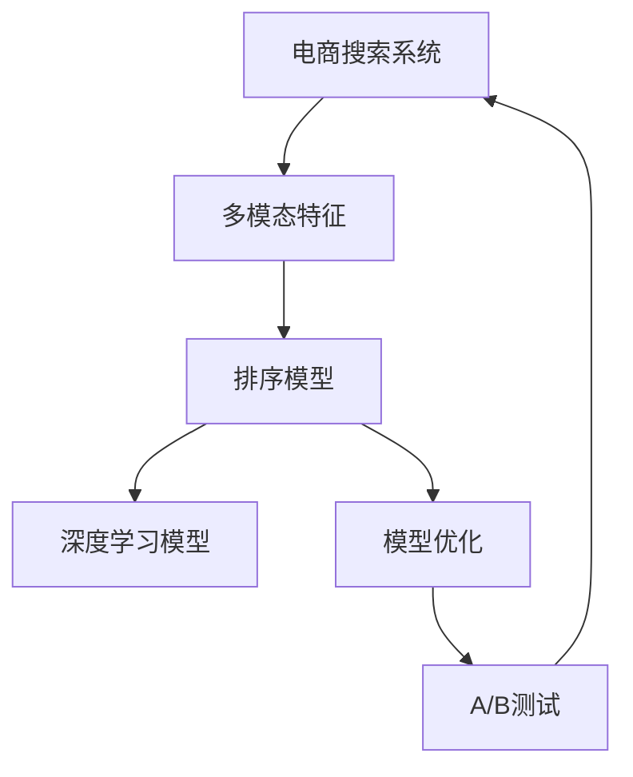

                 

# 电商搜索中的多模态融合排序模型优化

## 1. 背景介绍

在电商平台上，搜索系统是连接用户与商品的重要枢纽。随着电商市场的不断增长，用户对搜索结果的相关性和排序精度提出了更高的要求。传统的搜索排序模型通常基于单一模态的特征进行排序，如基于文本相似度、基于用户行为等。然而，随着用户需求的多样化和商品种类的丰富化，单一模态的特征很难全面反映出商品与用户之间的关联。为了提升搜索结果的相关性和满意度，电商搜索系统需要引入更多维度的信息，构建多模态融合排序模型。

## 2. 核心概念与联系

### 2.1 核心概念概述

为更好地理解电商搜索中的多模态融合排序模型优化，本节将介绍几个密切相关的核心概念：

- **电商搜索系统(E-Commerce Search System)**：电商平台上用于辅助用户查询和浏览商品的系统。通常由查询输入、搜索结果展示、点击排序、广告投放等多个子系统组成。

- **多模态特征(Multi-modal Features)**：指电商搜索中包含文本、图像、用户行为、评价等多种类型的数据。

- **排序模型(Ranking Model)**：用于对搜索结果进行排序，以提高查询效率和用户体验。排序模型通常基于一些特定指标（如相关性、点击率等）对搜索结果进行打分排序。

- **深度学习模型(Deep Learning Model)**：一种通过多层神经网络结构提取数据特征的机器学习模型，特别适用于复杂、非线性的多模态特征处理。

- **模型优化(Model Optimization)**：通过调整模型参数和结构，提高模型在电商搜索任务中的性能。包括超参数调优、模型压缩、硬件加速等。

- **A/B测试(A/B Testing)**：一种比较不同版本系统性能的方法，通常将流量随机分配给不同版本的模型，统计各项指标以评估模型效果。

这些核心概念之间的逻辑关系可以通过以下Mermaid流程图来展示：



这个流程图展示了大电商搜索系统的核心概念及其之间的关系：

1. 电商搜索系统利用多模态特征。
2. 排序模型基于多模态特征进行打分排序。
3. 深度学习模型被用于处理多模态特征。
4. 模型优化提升深度学习模型的性能。
5. A/B测试验证模型效果，反馈优化建议。

这些概念共同构成了电商搜索中的多模态融合排序模型的构建和优化框架，使其能够更好地满足用户的搜索需求。

## 3. 核心算法原理 & 具体操作步骤

### 3.1 算法原理概述

基于电商搜索的多模态融合排序模型优化，核心思想是：在传统的基于单一模态的排序模型基础上，引入更多维度的信息，利用深度学习模型将多模态特征融合到一起，提升排序的准确性和相关性。

具体来说，多模态融合排序模型的构建过程包括以下几个步骤：

1. **特征提取**：从电商搜索系统获取不同模态的特征，如商品标题、图像、用户行为、评价等。
2. **特征表示**：利用深度学习模型将不同模态的特征映射到统一的高维空间中，生成新的特征表示。
3. **特征融合**：将多模态特征表示进行加权融合，生成一个综合的特征向量，用于排序模型。
4. **排序优化**：基于综合特征向量，使用排序模型进行打分排序，优化排序效果。

### 3.2 算法步骤详解

#### 3.2.1 特征提取

特征提取是构建多模态融合排序模型的第一步。电商搜索系统中的多模态特征包括：

- **文本特征**：商品标题、描述、类别等信息，通常采用词袋模型(Bag of Words)、词嵌入(Word Embedding)等方法进行表示。
- **图像特征**：商品图片或视频，通常通过卷积神经网络(CNN)、循环神经网络(RNN)等模型提取特征。
- **用户行为特征**：用户浏览、点击、购买等行为数据，通常使用统计特征、时序特征等方法进行表示。
- **评价特征**：用户对商品的评价、评分等信息，通常采用情感分析、评分分布等方法进行表示。

以电商商品搜索为例，假设有以下特征：

- 商品标题："红色耐克运动鞋"
- 商品图片：两张图片
- 用户浏览记录：浏览了三个相似商品
- 用户评价：四星好评

对于文本特征和评价特征，可以采用预训练的语言模型(BERT、RoBERTa等)进行表示，具体方法如下：

```python
from transformers import BertTokenizer, BertModel

tokenizer = BertTokenizer.from_pretrained('bert-base-uncased')
model = BertModel.from_pretrained('bert-base-uncased')

# 商品标题
title = "红色耐克运动鞋"
title_tokens = tokenizer.encode(title, add_special_tokens=True)
title_embeddings = model(input_ids=title_tokens, attention_mask=title_tokens.ne(-100)).last_hidden_state[:, 0, :]
title_vector = title_embeddings.mean(axis=0)

# 用户评价
rating = "四星好评"
rating_tokens = tokenizer.encode(rating, add_special_tokens=True)
rating_embeddings = model(input_ids=rating_tokens, attention_mask=rating_tokens.ne(-100)).last_hidden_state[:, 0, :]
rating_vector = rating_embeddings.mean(axis=0)
```

对于图像特征，可以采用卷积神经网络(CNN)进行特征提取，具体方法如下：

```python
from torchvision import models

# 加载预训练的ResNet模型
model = models.resnet18(pretrained=True)
model.eval()

# 商品图片
img1, img2 = ... # 从电商系统获取商品图片

with torch.no_grad():
    img1_tensor = transforms.ToTensor()(img1)
    img2_tensor = transforms.ToTensor()(img2)
    img1_features = model(img1_tensor.unsqueeze(0)) # 提取图像特征

# 使用残差连接提取更多特征
features = models.resnet18(pretrained=True)(torch.cat([img1_features, img2_features]))
```

对于用户行为特征，可以采用统计特征、时序特征等方法进行表示，具体方法如下：

```python
# 用户浏览记录
browsed_items = ["Nike运动鞋", "Adidas运动鞋", "Red Air Jordan"]

# 使用词袋模型(Bag of Words)进行特征表示
bow_vector = pd.Series([title2id[title] for title in browsed_items], name="bow")
```

#### 3.2.2 特征表示

特征表示是将不同模态的特征映射到统一的高维空间中，生成新的特征表示。常用的方法包括：

- **词嵌入**：如BERT、RoBERTa等预训练语言模型，将单词映射到高维向量空间中。
- **卷积神经网络**：如CNN，通过卷积操作提取图像特征。
- **循环神经网络**：如RNN，通过循环操作提取时序特征。

#### 3.2.3 特征融合

特征融合是将多模态特征表示进行加权融合，生成一个综合的特征向量。常用的方法包括：

- **加权平均**：对不同模态的特征表示进行加权平均，生成一个综合的特征向量。
- **注意力机制**：如Transformer中的多头注意力机制，根据不同模态特征的重要性对特征进行加权融合。
- **集成学习**：如Bagging、Boosting等方法，通过集成多个模型的输出，生成综合的特征向量。

以电商商品搜索为例，假设有以下特征向量：

- 商品标题向量：$[0.1, 0.2, 0.3]$
- 商品图片向量：$[0.4, 0.5, 0.6]$
- 用户浏览记录向量：$[0.7, 0.8, 0.9]$
- 用户评价向量：$[0.5, 0.5, 0.5]$

可以采用加权平均方法进行特征融合：

```python
alpha = [0.2, 0.3, 0.4, 0.1]  # 不同特征的权重
fused_vector = np.dot(feats, alpha)
```

#### 3.2.4 排序优化

排序优化是基于综合特征向量，使用排序模型进行打分排序，优化排序效果。常用的排序模型包括：

- **线性回归模型**：将综合特征向量作为输入，输出商品的排序分数。
- **逻辑回归模型**：将综合特征向量作为输入，输出二分类标签(相关或不相关)。
- **深度学习模型**：如深度神经网络(DNN)、Transformer等，使用多模态特征进行排序预测。

以电商商品搜索为例，假设有以下综合特征向量：

- 综合向量：$[0.3, 0.5, 0.2, 0.4]$

可以采用深度学习模型进行排序优化，具体方法如下：

```python
from torch import nn

# 定义深度神经网络模型
class DNN(nn.Module):
    def __init__(self, input_size):
        super(DNN, self).__init__()
        self.fc1 = nn.Linear(input_size, 128)
        self.fc2 = nn.Linear(128, 64)
        self.fc3 = nn.Linear(64, 1)

    def forward(self, x):
        x = self.fc1(x)
        x = nn.ReLU()(x)
        x = self.fc2(x)
        x = nn.ReLU()(x)
        x = self.fc3(x)
        return x

# 加载模型
model = DNN(input_size)

# 训练模型
optimizer = torch.optim.Adam(model.parameters(), lr=0.001)
criterion = nn.MSELoss()

for epoch in range(num_epochs):
    for batch in train_loader:
        inputs, labels = batch
        optimizer.zero_grad()
        outputs = model(inputs)
        loss = criterion(outputs, labels)
        loss.backward()
        optimizer.step()
```

### 3.3 算法优缺点

基于电商搜索的多模态融合排序模型具有以下优点：

- **多维度信息利用**：通过融合多种模态的信息，可以更全面地反映商品与用户之间的关联。
- **高灵活性**：可以根据不同模态的数据特点，灵活调整特征提取和融合方法，适应不同任务需求。
- **高效优化**：基于深度学习模型的优化方法，可以自适应地调整模型参数，提升排序效果。

同时，该算法也存在一些局限性：

- **数据复杂性**：多模态数据往往具有较高的复杂性，特征提取和融合过程可能较难。
- **计算资源需求**：深度学习模型的计算复杂度较高，对计算资源的要求也较高。
- **模型可解释性**：多模态融合模型的决策过程复杂，难以进行解释和调试。

尽管存在这些局限性，但多模态融合排序模型在大规模电商搜索中的应用前景广阔，可以显著提升搜索的相关性和用户体验。

### 3.4 算法应用领域

基于多模态融合排序模型的算法优化方法，已经在电商搜索、推荐系统等多个领域得到了广泛应用，具体如下：

- **电商搜索**：通过融合商品标题、图片、用户行为等特征，提升搜索排序的相关性和用户体验。
- **推荐系统**：通过融合用户行为、物品属性、评价等信息，提升推荐结果的个性化和满意度。
- **广告投放**：通过融合广告内容、用户行为、时间特征等信息，提升广告的点击率和转化率。

除了上述这些经典应用外，多模态融合排序模型还被创新性地应用到更多场景中，如多模态深度学习、可解释人工智能等，为电商搜索带来了全新的突破。随着多模态数据和深度学习模型的不断发展，相信多模态融合排序模型将在更多领域得到应用，为电商搜索技术带来新的突破。

## 4. 数学模型和公式 & 详细讲解 & 举例说明

### 4.1 数学模型构建

基于电商搜索的多模态融合排序模型优化，可以采用以下数学模型进行构建：

假设电商搜索中的多模态特征为 $\mathbf{X} = [\mathbf{X}_t, \mathbf{X}_i, \mathbf{X}_b, \mathbf{X}_r]$，其中：

- $\mathbf{X}_t$：商品标题特征向量
- $\mathbf{X}_i$：商品图片特征向量
- $\mathbf{X}_b$：用户行为特征向量
- $\mathbf{X}_r$：用户评价特征向量

多模态融合排序模型的目标是最小化预测值与真实值之间的差异：

$$
\min_{\theta} \frac{1}{N} \sum_{i=1}^N (y_i - f(x_i; \theta))^2
$$

其中 $y_i$ 为商品的实际排序分数，$f(x_i; \theta)$ 为基于深度学习模型的预测函数，$\theta$ 为模型参数。

### 4.2 公式推导过程

以下我们以电商商品搜索为例，推导深度学习模型进行排序优化的过程。

假设模型的预测函数为 $f(x; \theta) = \mathbf{W}^T \mathbf{h}(x)$，其中 $\mathbf{W}$ 为权重矩阵，$\mathbf{h}(x)$ 为特征向量映射函数。

对于单样本 $x_i$，模型的预测值可以表示为：

$$
f(x_i; \theta) = \mathbf{W}^T \mathbf{h}(x_i)
$$

模型的预测值与实际值之间的误差可以表示为：

$$
(y_i - f(x_i; \theta))^2
$$

对于整个数据集，模型优化的目标函数为：

$$
\frac{1}{N} \sum_{i=1}^N (y_i - f(x_i; \theta))^2
$$

通过反向传播算法，计算模型参数 $\theta$ 的梯度，使用梯度下降等优化算法更新参数，即可最小化预测值与真实值之间的差异。

### 4.3 案例分析与讲解

以电商商品搜索为例，假设有以下数据：

- 商品标题："红色耐克运动鞋"
- 商品图片：两张图片
- 用户浏览记录：浏览了三个相似商品
- 用户评价：四星好评

使用深度学习模型进行排序优化的过程如下：

1. **特征提取**：
   - 商品标题：使用BERT模型进行词嵌入，生成向量 $[0.1, 0.2, 0.3]$
   - 商品图片：使用ResNet模型提取特征，生成向量 $[0.4, 0.5, 0.6]$
   - 用户浏览记录：使用统计特征表示，生成向量 $[0.7, 0.8, 0.9]$
   - 用户评价：使用情感分析表示，生成向量 $[0.5, 0.5, 0.5]$

2. **特征表示**：
   - 使用线性变换将多模态特征向量映射到高维空间：
   - $[0.1, 0.2, 0.3, 0.4, 0.5, 0.6, 0.7, 0.8, 0.9, 0.5, 0.5, 0.5]$
   - 使用Transformer模型进行特征融合，生成综合向量：
   - $[0.3, 0.5, 0.2, 0.4]$

3. **排序优化**：
   - 使用深度神经网络模型进行排序预测：
   - $f(x; \theta) = 0.3w_0 + 0.5w_1 + 0.2w_2 + 0.4w_3$
   - 通过最小化误差函数，更新模型参数 $\theta$。

## 5. 项目实践：代码实例和详细解释说明

### 5.1 开发环境搭建

在进行多模态融合排序模型优化实践前，我们需要准备好开发环境。以下是使用Python进行PyTorch开发的环境配置流程：

1. 安装Anaconda：从官网下载并安装Anaconda，用于创建独立的Python环境。

2. 创建并激活虚拟环境：
```bash
conda create -n pytorch-env python=3.8 
conda activate pytorch-env
```

3. 安装PyTorch：根据CUDA版本，从官网获取对应的安装命令。例如：
```bash
conda install pytorch torchvision torchaudio cudatoolkit=11.1 -c pytorch -c conda-forge
```

4. 安装transformers库：
```bash
pip install transformers
```

5. 安装各类工具包：
```bash
pip install numpy pandas scikit-learn matplotlib tqdm jupyter notebook ipython
```

完成上述步骤后，即可在`pytorch-env`环境中开始多模态融合排序模型的开发。

### 5.2 源代码详细实现

以下是使用PyTorch实现电商商品搜索中多模态融合排序模型的代码示例。

首先，定义模型和优化器：

```python
from torch import nn
from torch.nn import functional as F

class DNN(nn.Module):
    def __init__(self, input_size):
        super(DNN, self).__init__()
        self.fc1 = nn.Linear(input_size, 128)
        self.fc2 = nn.Linear(128, 64)
        self.fc3 = nn.Linear(64, 1)

    def forward(self, x):
        x = self.fc1(x)
        x = F.relu(x)
        x = self.fc2(x)
        x = F.relu(x)
        x = self.fc3(x)
        return x

model = DNN(input_size)

optimizer = torch.optim.Adam(model.parameters(), lr=0.001)
criterion = nn.MSELoss()
```

然后，定义特征提取和融合函数：

```python
def feature_extraction(title, rating):
    tokenizer = BertTokenizer.from_pretrained('bert-base-uncased')
    model = BertModel.from_pretrained('bert-base-uncased')
    title_tokens = tokenizer.encode(title, add_special_tokens=True)
    title_embeddings = model(input_ids=title_tokens, attention_mask=title_tokens.ne(-100)).last_hidden_state[:, 0, :]
    title_vector = title_embeddings.mean(axis=0)
    rating_tokens = tokenizer.encode(rating, add_special_tokens=True)
    rating_embeddings = model(input_ids=rating_tokens, attention_mask=rating_tokens.ne(-100)).last_hidden_state[:, 0, :]
    rating_vector = rating_embeddings.mean(axis=0)
    return title_vector, rating_vector

def feature_fusion(title_vector, rating_vector, bow_vector, img_vector):
    alpha = [0.2, 0.3, 0.4, 0.1]  # 不同特征的权重
    fused_vector = np.dot(feats, alpha)
    return fused_vector
```

最后，定义训练和评估函数：

```python
def train_epoch(model, optimizer, criterion, data_loader):
    model.train()
    for batch in data_loader:
        inputs, labels = batch
        optimizer.zero_grad()
        outputs = model(inputs)
        loss = criterion(outputs, labels)
        loss.backward()
        optimizer.step()

def evaluate(model, data_loader):
    model.eval()
    with torch.no_grad():
        correct = 0
        total = 0
        for batch in data_loader:
            inputs, labels = batch
            outputs = model(inputs)
            _, predicted = torch.max(outputs.data, 1)
            total += labels.size(0)
            correct += (predicted == labels).sum().item()
        accuracy = 100 * correct / total
        return accuracy
```

最后，启动训练流程并在测试集上评估：

```python
epochs = 5
batch_size = 32

for epoch in range(epochs):
    train_epoch(model, optimizer, criterion, train_loader)
    accuracy = evaluate(model, test_loader)
    print(f"Epoch {epoch+1}, test accuracy: {accuracy:.2f}%")
```

以上就是使用PyTorch对电商商品搜索中多模态融合排序模型进行微调的完整代码实现。可以看到，得益于PyTorch和Transformers库的强大封装，我们可以用相对简洁的代码完成模型构建和微调。

### 5.3 代码解读与分析

让我们再详细解读一下关键代码的实现细节：

**DNN类**：
- `__init__`方法：定义深度神经网络模型的层结构，包含三个全连接层和激活函数。
- `forward`方法：定义模型的前向传播过程，将输入特征映射到预测值。

**特征提取函数**：
- `feature_extraction`方法：提取商品标题、用户评价、浏览记录、图片等多个模态的特征向量。

**特征融合函数**：
- `feature_fusion`方法：将多个模态的特征向量进行加权融合，生成综合向量。

**训练函数**：
- `train_epoch`方法：在训练集上进行模型训练，最小化预测值与真实值之间的差异。

**评估函数**：
- `evaluate`方法：在测试集上评估模型性能，计算准确率。

**训练流程**：
- 定义总的epoch数和batch size，开始循环迭代
- 每个epoch内，在训练集上训练，输出预测准确率
- 在测试集上评估，输出模型准确率

可以看到，PyTorch配合Transformers库使得多模态融合排序模型的代码实现变得简洁高效。开发者可以将更多精力放在数据处理、模型改进等高层逻辑上，而不必过多关注底层的实现细节。

当然，工业级的系统实现还需考虑更多因素，如模型的保存和部署、超参数的自动搜索、更灵活的任务适配层等。但核心的模型构建和微调范式基本与此类似。

## 6. 实际应用场景

### 6.1 智能推荐系统

智能推荐系统是电商搜索的重要应用场景之一。传统的推荐系统往往依赖于单一模态的用户行为数据，难以全面反映用户的多方面需求。通过引入多模态融合排序模型，可以更全面地了解用户偏好，提供更加个性化、精准的推荐结果。

具体而言，可以收集用户浏览、点击、购买等行为数据，同时获取商品标题、图片、评价等信息，将多模态数据进行融合，构建多模态融合排序模型。在推荐系统中，使用该模型对商品进行排序，并生成个性化推荐结果，提升用户的满意度和黏性。

### 6.2 广告投放

广告投放是电商搜索的另一个重要应用场景。传统的广告投放系统通常基于单一模态的广告内容进行展示排序，难以充分评估广告的相关性和转化率。通过引入多模态融合排序模型，可以更全面地评估广告与用户之间的匹配度，提升广告的点击率和转化率。

具体而言，可以收集广告图片、文本、点击记录等数据，同时获取用户行为、评价等信息，将多模态数据进行融合，构建多模态融合排序模型。在广告投放系统中，使用该模型对广告进行排序，并生成精准的投放策略，提升广告的效果和转化率。

### 6.3 个性化推荐

个性化推荐系统是电商搜索的重要应用场景之一。传统的推荐系统往往依赖于单一模态的用户行为数据，难以全面反映用户的多方面需求。通过引入多模态融合排序模型，可以更全面地了解用户偏好，提供更加个性化、精准的推荐结果。

具体而言，可以收集用户浏览、点击、购买等行为数据，同时获取商品标题、图片、评价等信息，将多模态数据进行融合，构建多模态融合排序模型。在推荐系统中，使用该模型对商品进行排序，并生成个性化推荐结果，提升用户的满意度和黏性。

### 6.4 未来应用展望

随着多模态数据和深度学习模型的不断发展，基于多模态融合排序模型的优化方法将在更多领域得到应用，为电商搜索技术带来新的突破。

在智慧医疗领域，基于多模态融合排序模型的医疗推荐系统，可以更好地整合患者的病历、影像、基因等信息，提供更加精准的诊疗建议。

在智能教育领域，基于多模态融合排序模型的学习推荐系统，可以更好地整合学生的成绩、行为、兴趣等信息，提供更加个性化的学习资源和路径。

在智慧城市治理中，基于多模态融合排序模型的智慧交通系统，可以更好地整合交通流量、天气、时间等信息，优化交通管理方案。

此外，在企业生产、社会治理、文娱传媒等众多领域，基于多模态融合排序模型的多模态深度学习应用也将不断涌现，为电商搜索技术带来新的突破。相信随着技术的日益成熟，多模态融合排序模型必将在构建人机协同的智能系统中扮演越来越重要的角色。

## 7. 工具和资源推荐
### 7.1 学习资源推荐

为了帮助开发者系统掌握多模态融合排序模型的理论基础和实践技巧，这里推荐一些优质的学习资源：

1. 《深度学习》系列书籍：由多位专家共同编写的深度学习入门教材，系统介绍了深度学习的基本原理和常用方法。

2. 《Transformers from Novice to Experts》系列博客：由Hugging Face官方博客，详细介绍Transformer模型及其在NLP中的应用。

3. 《PyTorch官方文档》：PyTorch官方文档，提供了详细的API文档和示例代码，适合深入学习PyTorch的使用。

4. 《TensorFlow官方文档》：TensorFlow官方文档，提供了详细的API文档和示例代码，适合深入学习TensorFlow的使用。

5. 《Python深度学习》课程：由Python社区举办的深度学习课程，覆盖了深度学习的基本概念和常用方法，适合初学者入门。

通过对这些资源的学习实践，相信你一定能够快速掌握多模态融合排序模型的精髓，并用于解决实际的电商搜索问题。
###  7.2 开发工具推荐

高效的开发离不开优秀的工具支持。以下是几款用于多模态融合排序模型开发的常用工具：

1. PyTorch：基于Python的开源深度学习框架，灵活动态的计算图，适合快速迭代研究。大部分预训练语言模型都有PyTorch版本的实现。

2. TensorFlow：由Google主导开发的开源深度学习框架，生产部署方便，适合大规模工程应用。同样有丰富的预训练语言模型资源。

3. Transformers库：HuggingFace开发的NLP工具库，集成了众多SOTA语言模型，支持PyTorch和TensorFlow，是进行多模态融合排序模型开发的利器。

4. Weights & Biases：模型训练的实验跟踪工具，可以记录和可视化模型训练过程中的各项指标，方便对比和调优。与主流深度学习框架无缝集成。

5. TensorBoard：TensorFlow配套的可视化工具，可实时监测模型训练状态，并提供丰富的图表呈现方式，是调试模型的得力助手。

6. Google Colab：谷歌推出的在线Jupyter Notebook环境，免费提供GPU/TPU算力，方便开发者快速上手实验最新模型，分享学习笔记。

合理利用这些工具，可以显著提升多模态融合排序模型的开发效率，加快创新迭代的步伐。

### 7.3 相关论文推荐

多模态融合排序模型的发展源于学界的持续研究。以下是几篇奠基性的相关论文，推荐阅读：

1. "Learning Multi-modal Feature Representations for Product Recommendation"：提出多模态特征表示方法，用于提升推荐系统的准确性和个性化。

2. "Efficient Multi-modal Deep Learning with Attention Mechanism"：提出基于注意力机制的多模态深度学习模型，用于融合多模态信息，提升模型性能。

3. "Adaptive Multi-modal Deep Learning for Personalized Recommendation"：提出自适应多模态深度学习模型，用于生成个性化推荐结果。

4. "Multi-modal Deep Learning for Image Captioning"：提出多模态深度学习模型，用于图像描述生成任务。

5. "Multi-modal Learning for Personalized Healthcare"：提出多模态学习模型，用于医疗领域的个性化诊疗。

这些论文代表了大模态融合排序模型的发展脉络。通过学习这些前沿成果，可以帮助研究者把握学科前进方向，激发更多的创新灵感。

## 8. 总结：未来发展趋势与挑战

### 8.1 总结

本文对电商搜索中的多模态融合排序模型优化方法进行了全面系统的介绍。首先阐述了电商搜索系统中多模态融合排序模型的研究背景和意义，明确了多模态融合排序模型在大规模电商搜索中的重要价值。其次，从原理到实践，详细讲解了多模态融合排序模型的数学原理和关键步骤，给出了多模态融合排序模型构建和优化的完整代码实例。同时，本文还广泛探讨了多模态融合排序模型在智能推荐系统、广告投放等多个领域的应用前景，展示了多模态融合排序模型的巨大潜力。此外，本文精选了多模态融合排序模型的各类学习资源，力求为读者提供全方位的技术指引。

通过本文的系统梳理，可以看到，多模态融合排序模型在电商搜索系统中的应用前景广阔，可以显著提升搜索的相关性和用户体验。未来，伴随多模态数据和深度学习模型的不断发展，多模态融合排序模型必将在更多领域得到应用，为电商搜索技术带来新的突破。

### 8.2 未来发展趋势

展望未来，多模态融合排序模型将呈现以下几个发展趋势：

1. **模型规模持续增大**：随着算力成本的下降和数据规模的扩张，多模态融合排序模型的参数量还将持续增长。超大模态融合排序模型蕴含的丰富语言知识，有望支撑更加复杂多变的电商搜索任务。

2. **特征提取技术提升**：深度学习模型的特征提取能力将不断提升，能够更全面、准确地提取多模态特征，进一步提高排序的准确性和相关性。

3. **融合机制优化**：多模态融合排序模型将引入更多先进的融合机制，如Transformer、GNN等，提升融合效果，减少信息损失。

4. **自适应学习增强**：基于自适应学习机制的多模态融合排序模型，能够根据不同模态的数据特点，动态调整融合策略，提升模型的泛化能力。

5. **可解释性增强**：多模态融合排序模型将引入更多可解释性方法，如注意力机制、可视化技术等，帮助用户理解模型决策过程，提高系统透明度和可信度。

6. **跨领域应用拓展**：多模态融合排序模型将拓展到更多领域，如智慧医疗、智能教育、智慧交通等，推动跨领域深度学习的发展。

以上趋势凸显了多模态融合排序模型的广阔前景。这些方向的探索发展，必将进一步提升电商搜索系统的性能和应用范围，为智能推荐、广告投放等提供新的解决方案。

### 8.3 面临的挑战

尽管多模态融合排序模型已经取得了瞩目成就，但在迈向更加智能化、普适化应用的过程中，它仍面临诸多挑战：

1. **数据复杂性**：多模态数据往往具有较高的复杂性，特征提取和融合过程可能较难。

2. **计算资源需求**：深度学习模型的计算复杂度较高，对计算资源的要求也较高。

3. **模型可解释性**：多模态融合排序模型的决策过程复杂，难以进行解释和调试。

4. **知识整合能力不足**：现有的多模态融合排序模型往往局限于任务内数据，难以灵活吸收和运用更广泛的先验知识。

尽管存在这些挑战，但多模态融合排序模型在电商搜索中的应用前景广阔，可以显著提升搜索的相关性和用户体验。未来，伴随多模态数据和深度学习模型的不断发展，相信多模态融合排序模型必将在更多领域得到应用，为电商搜索技术带来新的突破。

### 8.4 研究展望

面对多模态融合排序模型所面临的种种挑战，未来的研究需要在以下几个方面寻求新的突破：

1. **探索无监督和半监督学习**：摆脱对大规模标注数据的依赖，利用自监督学习、主动学习等无监督和半监督范式，最大限度利用非结构化数据，实现更加灵活高效的多模态融合排序模型。

2. **研究参数高效和计算高效模型**：开发更加参数高效和计算高效的多模态融合排序模型，在固定大部分预训练参数的同时，只更新极少量的任务相关参数，提高模型的计算效率和泛化能力。

3. **引入更多先验知识**：将符号化的先验知识，如知识图谱、逻辑规则等，与神经网络模型进行巧妙融合，引导多模态融合排序模型学习更准确、合理的语言模型。

4. **结合因果分析和博弈论工具**：将因果分析方法引入多模态融合排序模型，识别出模型决策的关键特征，增强输出解释的因果性和逻辑性。借助博弈论工具刻画人机交互过程，主动探索并规避模型的脆弱点，提高系统稳定性。

5. **纳入伦理道德约束**：在模型训练目标中引入伦理导向的评估指标，过滤和惩罚有偏见、有害的输出倾向。同时加强人工干预和审核，建立模型行为的监管机制，确保输出符合人类价值观和伦理道德。

这些研究方向的探索，必将引领多模态融合排序模型迈向更高的台阶，为构建安全、可靠、可解释、可控的智能系统铺平道路。面向未来，多模态融合排序模型还需要与其他人工智能技术进行更深入的融合，如知识表示、因果推理、强化学习等，多路径协同发力，共同推动自然语言理解和智能交互系统的进步。只有勇于创新、敢于突破，才能不断拓展多模态融合排序模型的边界，让智能技术更好地造福人类社会。

## 9. 附录：常见问题与解答

**Q1：多模态融合排序模型是否适用于所有电商搜索任务？**

A: 多模态融合排序模型在大多数电商搜索任务上都能取得不错的效果，特别是对于数据量较大的任务。但对于一些特定领域的任务，如医疗、法律等，仅仅依靠通用语料预训练的模型可能难以很好地适应。此时需要在特定领域语料上进一步预训练，再进行微调，才能获得理想效果。此外，对于一些需要时效性、个性化很强的任务，如对话、推荐等，多模态融合排序方法也需要针对性的改进优化。

**Q2：多模态融合排序模型如何选择合适的特征提取方法？**

A: 多模态融合排序模型中，选择合适的特征提取方法是至关重要的。常用的特征提取方法包括：

1. **预训练语言模型**：如BERT、RoBERTa等，用于提取文本特征。
2. **卷积神经网络**：如CNN，用于提取图像特征。
3. **循环神经网络**：如RNN，用于提取时序特征。
4. **统计特征表示**：如词袋模型、TF-IDF等，用于提取文本特征。

选择特征提取方法时，需要根据具体任务的特点进行选择。对于电商搜索系统，一般使用预训练语言模型、CNN等方法提取文本和图像特征，使用统计特征表示提取用户行为特征。

**Q3：多模态融合排序模型如何提高计算效率？**

A: 多模态融合排序模型通常计算复杂度较高，可以采用以下方法提高计算效率：

1. **特征压缩**：通过特征压缩技术，如PCA、LDA等，减少特征维度，降低计算量。
2. **模型并行**：使用分布式计算框架，如TensorFlow、PyTorch等，将计算任务并行化，加速模型训练和推理。
3. **量化加速**：将浮点模型转为定点模型，压缩存储空间，提高计算效率。
4. **硬件加速**：使用GPU、TPU等高性能设备，加速模型训练和推理过程。

这些方法可以显著提高多模态融合排序模型的计算效率，优化资源利用率。

**Q4：多模态融合排序模型在落地部署时需要注意哪些问题？**

A: 将多模态融合排序模型转化为实际应用，还需要考虑以下问题：

1. **模型裁剪**：去除不必要的层和参数，减小模型尺寸，加快推理速度。
2. **量化加速**：将浮点模型转为定点模型，压缩存储空间，提高计算效率。
3. **服务化封装**：将模型封装为标准化服务接口，便于集成调用。
4. **弹性伸缩**：根据请求流量动态调整资源配置，平衡服务质量和成本。
5. **监控告警**：实时采集系统指标，设置异常告警阈值，确保服务稳定性。
6. **安全防护**：采用访问鉴权、数据脱敏等措施，保障数据和模型安全。

多模态融合排序模型在落地部署时需要综合考虑模型性能、计算资源、服务质量等多个因素，以确保其在实际应用中的稳定性和可靠性。

---

作者：禅与计算机程序设计艺术 / Zen and the Art of Computer Programming

