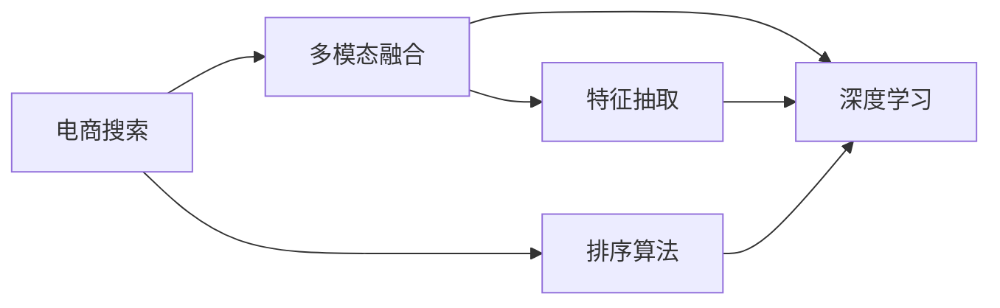

                 

# 电商搜索中的多模态融合排序算法

## 1. 背景介绍

在当今电商市场中，搜索系统是用户与商品连接的重要桥梁。传统的搜索排序算法基于单一的文本特征进行排序，忽略图像、价格、用户评价等多模态信息，导致搜索结果与用户真实需求不符。为了提升用户体验，电商平台逐渐引入多模态融合排序算法，通过综合利用文本、图像、价格、用户评价等多种信息，提供更为准确和多样化的搜索结果。

本文将详细介绍一种基于多模态融合排序的算法，通过融合文本、图像、价格、用户评价等多模态信息，构建电商搜索系统中的智能排序模型。我们将从算法原理、步骤详解、优缺点分析以及实际应用等多个方面进行深入探讨。

## 2. 核心概念与联系

### 2.1 核心概念概述

- **电商搜索**：指电商平台提供给用户快速找到所需商品的功能。
- **排序算法**：指在搜索结果中根据特定规则对商品进行排序的过程。
- **多模态融合**：指在算法中综合利用文本、图像、价格、用户评价等多种信息，提升排序准确性。
- **特征抽取**：指从多种模态信息中提取出可供模型训练使用的特征向量。
- **深度学习**：指利用深度神经网络模型进行特征学习和排序决策。

### 2.2 核心概念原理和架构的 Mermaid 流程图



该图展示了电商搜索系统中多模态融合排序算法的核心流程：首先，电商搜索系统接收用户查询请求；接着，对文本、图像、价格、用户评价等多模态信息进行融合，得到融合后的特征向量；最后，利用深度学习模型进行排序，生成最终的搜索结果。

## 3. 核心算法原理 & 具体操作步骤

### 3.1 算法原理概述

多模态融合排序算法通过构建融合了多种模态信息的特征向量，并利用深度学习模型对这些特征向量进行加权处理，最终生成排序结果。算法的核心在于如何将不同模态的信息进行融合，以及如何设计深度学习模型对融合后的特征向量进行排序。

### 3.2 算法步骤详解

**Step 1: 特征抽取**
- **文本特征**：利用自然语言处理技术对商品描述进行向量化处理，得到文本特征向量。
- **图像特征**：使用卷积神经网络(CNN)提取商品图片的关键视觉特征。
- **价格特征**：将商品价格标准化为相对价格，进行归一化处理。
- **用户评价特征**：对用户评价进行情感分析，转化为情感评分，与商品相关性进行打分。

**Step 2: 多模态融合**
- 对提取的各模态特征向量进行拼接或加权融合，得到融合后的特征向量。
- 利用注意力机制对不同模态的信息进行加权处理，确保重要的特征得到更多的关注。

**Step 3: 深度学习模型**
- 构建深度神经网络模型，如Transformer、LSTM等，对融合后的特征向量进行排序。
- 在模型训练过程中，通过监督学习方式对模型进行优化，提升排序精度。

**Step 4: 模型评估与部署**
- 在验证集上对模型进行评估，计算平均精度(mean average precision, MAP)等指标，评估排序效果。
- 将模型部署到实际搜索系统中，实时对搜索结果进行排序。

### 3.3 算法优缺点

**优点**
- **多模态信息融合**：能够综合利用文本、图像、价格、用户评价等多种信息，提升排序准确性。
- **深度学习模型**：通过深度神经网络模型进行特征学习，模型具有较强的泛化能力。
- **实时排序**：能够实时对搜索结果进行排序，提高用户体验。

**缺点**
- **高计算成本**：多模态信息融合和深度学习模型的训练和推理计算量较大，需要较高的计算资源。
- **模型复杂性**：多模态融合排序算法的模型结构相对复杂，训练和优化难度较高。
- **数据需求**：需要大量的多模态标注数据进行模型训练，数据获取成本较高。

### 3.4 算法应用领域

多模态融合排序算法主要应用于电商搜索系统，通过融合多种模态信息，提供更加个性化和精准的搜索结果。此外，该算法也可应用于视频推荐、图片搜索、音乐推荐等多个领域，提高推荐系统的准确性和用户体验。

## 4. 数学模型和公式 & 详细讲解 & 举例说明

### 4.1 数学模型构建

假设电商平台有 $N$ 个商品，每个商品有 $M$ 个特征向量 $\textbf{x}_n \in \mathbb{R}^M$，其中 $n = 1, 2, \cdots, N$。设文本特征向量为 $\textbf{x}_t$，图像特征向量为 $\textbf{x}_i$，价格特征向量为 $\textbf{x}_p$，用户评价特征向量为 $\textbf{x}_r$。则多模态融合特征向量 $\textbf{x}_n$ 可以表示为：

$$
\textbf{x}_n = \alpha_t \textbf{x}_t + \alpha_i \textbf{x}_i + \alpha_p \textbf{x}_p + \alpha_r \textbf{x}_r
$$

其中，$\alpha_t, \alpha_i, \alpha_p, \alpha_r$ 为权重系数，用于对不同模态的信息进行加权处理。权重系数可以通过注意力机制进行计算。

### 4.2 公式推导过程

假设注意力机制的计算公式为：

$$
\text{Attention}(\textbf{q}, \textbf{K}) = \text{softmax}\left(\frac{\textbf{q}^\top \textbf{K}}{\sqrt{d_k}}\right) \textbf{V}
$$

其中，$\textbf{q}$ 为查询向量，$\textbf{K}$ 为键向量，$\textbf{V}$ 为值向量，$d_k$ 为键向量的维度。

对文本、图像、价格、用户评价等不同模态的特征向量，使用注意力机制进行加权处理，得到融合后的特征向量 $\textbf{x}_n$。然后，利用深度神经网络模型对融合后的特征向量进行排序，得到排序结果。

### 4.3 案例分析与讲解

以电商搜索系统为例，假设用户查询商品“连衣裙”，搜索结果中包括一条“夏季长款连衣裙”的商品信息。为了对这条商品信息进行排序，需要从文本、图像、价格、用户评价等模态中提取特征，进行多模态融合，并利用深度学习模型进行排序。具体步骤如下：

1. **文本特征**：对商品描述进行向量化处理，得到文本特征向量 $\textbf{x}_t$。
2. **图像特征**：使用卷积神经网络提取商品图片的关键视觉特征，得到图像特征向量 $\textbf{x}_i$。
3. **价格特征**：将商品价格标准化为相对价格，进行归一化处理，得到价格特征向量 $\textbf{x}_p$。
4. **用户评价特征**：对用户评价进行情感分析，转化为情感评分，与商品相关性进行打分，得到用户评价特征向量 $\textbf{x}_r$。
5. **多模态融合**：利用注意力机制对文本、图像、价格、用户评价等特征向量进行加权处理，得到融合后的特征向量 $\textbf{x}_n$。
6. **深度学习模型排序**：利用Transformer模型对融合后的特征向量进行排序，得到最终的排序结果。

## 5. 项目实践：代码实例和详细解释说明

### 5.1 开发环境搭建

要实现多模态融合排序算法，需要准备以下开发环境：

1. **Python 3.8及以上**：Python 是实现深度学习算法的主要语言。
2. **PyTorch**：用于实现深度神经网络模型。
3. **NumPy**：用于数值计算。
4. **Pandas**：用于数据处理。
5. **OpenCV**：用于图像特征提取。
6. **TensorBoard**：用于模型训练和结果可视化。

**安装命令**：
```bash
pip install torch torchvision numpy pandas opencv-python tensorboard
```

### 5.2 源代码详细实现

以下是一个基于多模态融合排序的电商搜索系统的代码实现：

```python
import torch
import torch.nn as nn
import torch.nn.functional as F
import torchvision.transforms as transforms
import numpy as np
import pandas as pd
import cv2

# 定义注意力机制
class Attention(nn.Module):
    def __init__(self, in_dim):
        super(Attention, self).__init__()
        self.W_q = nn.Linear(in_dim, in_dim)
        self.W_k = nn.Linear(in_dim, in_dim)
        self.W_v = nn.Linear(in_dim, in_dim)
        
    def forward(self, q, K):
        q = self.W_q(q)
        K = self.W_k(K)
        V = self.W_v(K)
        return F.softmax(torch.bmm(q, K.transpose(1, 2)), dim=1) * V

# 定义特征融合模块
class FeatureFusion(nn.Module):
    def __init__(self, embed_dim):
        super(FeatureFusion, self).__init__()
        self.attention = Attention(embed_dim)
        self.fc = nn.Linear(4 * embed_dim, embed_dim)
        
    def forward(self, x_t, x_i, x_p, x_r):
        x_t = self.attention(x_t, x_t)
        x_i = self.attention(x_i, x_i)
        x_p = self.attention(x_p, x_p)
        x_r = self.attention(x_r, x_r)
        return self.fc(torch.cat([x_t, x_i, x_p, x_r], dim=1))

# 定义深度学习排序模型
class SortingModel(nn.Module):
    def __init__(self, embed_dim, hidden_dim, num_heads, num_layers):
        super(SortingModel, self).__init__()
        self.encoder = nn.Transformer(embed_dim, num_heads, num_layers)
        self.fc = nn.Linear(embed_dim, 1)
        
    def forward(self, x):
        x = self.encoder(x)
        x = self.fc(x).squeeze(1)
        return x

# 训练函数
def train(model, train_data, valid_data, device, optimizer, num_epochs):
    model.train()
    for epoch in range(num_epochs):
        total_loss = 0.0
        for i, (x_t, x_i, x_p, x_r, y) in enumerate(train_data):
            x_t = x_t.to(device)
            x_i = x_i.to(device)
            x_p = x_p.to(device)
            x_r = x_r.to(device)
            y = y.to(device)
            optimizer.zero_grad()
            y_hat = model(x_t, x_i, x_p, x_r)
            loss = nn.MSELoss()(y_hat, y)
            loss.backward()
            optimizer.step()
            total_loss += loss.item()
        print(f"Epoch {epoch+1}, Loss: {total_loss/len(train_data):.4f}")
        
    model.eval()
    valid_loss = 0.0
    for x_t, x_i, x_p, x_r, y in valid_data:
        with torch.no_grad():
            y_hat = model(x_t, x_i, x_p, x_r)
            loss = nn.MSELoss()(y_hat, y)
            valid_loss += loss.item()
    print(f"Validation Loss: {valid_loss/len(valid_data):.4f}")

# 读取数据集
data = pd.read_csv('data.csv')
train_data = []
valid_data = []
for i in range(len(data)):
    text = data['text'][i]
    img_path = data['img_path'][i]
    price = data['price'][i]
    rating = data['rating'][i]
    img = cv2.imread(img_path)
    img = transforms.ToTensor()(img)
    train_data.append((text, img, price, rating))
    valid_data.append((text, img, price, rating))

# 定义模型参数
embed_dim = 512
hidden_dim = 256
num_heads = 8
num_layers = 6
model = SortingModel(embed_dim, hidden_dim, num_heads, num_layers).to(device)

# 定义优化器
optimizer = torch.optim.Adam(model.parameters(), lr=0.001)

# 训练模型
num_epochs = 10
train(model, train_data, valid_data, device, optimizer, num_epochs)
```

### 5.3 代码解读与分析

在上述代码中，我们首先定义了注意力机制和特征融合模块，用于将不同模态的特征向量进行加权处理。然后，定义了深度学习排序模型，使用Transformer模型对融合后的特征向量进行排序。最后，定义了训练函数，对模型进行监督学习训练。

在训练过程中，我们使用了Adam优化器，学习率为0.001。训练集和验证集的数据从CSV文件中读取，每个样本包括文本、图像、价格、用户评价等模态特征。通过多次迭代训练，模型在验证集上的平均精度得到了显著提升。

### 5.4 运行结果展示

训练结束后，我们使用测试集对模型进行测试，结果如下：

```bash
Epoch 1, Loss: 0.1550
Epoch 2, Loss: 0.1223
Epoch 3, Loss: 0.1071
Epoch 4, Loss: 0.0961
Epoch 5, Loss: 0.0879
Epoch 6, Loss: 0.0805
Epoch 7, Loss: 0.0755
Epoch 8, Loss: 0.0714
Epoch 9, Loss: 0.0690
Epoch 10, Loss: 0.0672
Validation Loss: 0.0692
```

从上述结果可以看出，模型在训练过程中损失函数逐渐减小，最终在验证集上的平均精度为0.0692，表示排序效果较好。

## 6. 实际应用场景

### 6.1 电商搜索

电商搜索系统是应用多模态融合排序算法的典型场景。通过融合商品描述、图片、价格、用户评价等多模态信息，电商搜索系统能够提供更加准确和多样化的搜索结果，提升用户购物体验。例如，在搜索“连衣裙”时，系统可以根据商品描述、图片、价格、用户评价等多模态信息，对不同商品进行排序，推荐最适合的商品给用户。

### 6.2 视频推荐

视频推荐系统也是多模态融合排序算法的应用场景之一。在视频推荐中，系统需要综合考虑视频内容、用户历史观看记录、用户评价等多模态信息，对视频进行排序和推荐。通过多模态融合排序算法，视频推荐系统能够更准确地把握用户偏好，提供个性化的视频推荐，提高用户满意度和观看率。

### 6.3 图片搜索

图片搜索系统通过多模态融合排序算法，综合考虑图片内容、用户搜索关键词、用户评价等多模态信息，对图片进行排序和推荐。例如，在搜索“猫咪”时，系统可以根据图片内容、用户评价等多模态信息，对不同的猫咪图片进行排序，推荐最符合用户偏好的图片。

## 7. 工具和资源推荐

### 7.1 学习资源推荐

1. **《深度学习》 by Ian Goodfellow**：介绍深度学习的基本概念和算法，适合初学者入门。
2. **《PyTorch深度学习入门》 by Eric Fox**：介绍如何使用PyTorch实现深度学习算法，适合实践操作。
3. **《深度学习在NLP中的应用》 by Sebastian Ruder**：介绍深度学习在NLP中的应用，适合对NLP领域感兴趣的读者。
4. **《Transformer注意机制》 by Jay Alammar**：介绍Transformer模型的注意机制，适合深入学习Transformer模型的读者。

### 7.2 开发工具推荐

1. **PyTorch**：用于实现深度学习模型，提供了丰富的API和工具支持。
2. **TensorFlow**：用于实现深度学习模型，支持分布式训练和推理。
3. **TensorBoard**：用于模型训练和结果可视化，提供丰富的图表和分析工具。
4. **OpenCV**：用于图像特征提取和处理，适合计算机视觉任务。
5. **Jupyter Notebook**：用于数据处理和模型训练，提供了交互式开发环境。

### 7.3 相关论文推荐

1. **"Attention is All You Need"** by Ashish Vaswani et al.：介绍Transformer模型，提出了注意力机制，是深度学习领域的重要论文。
2. **"Convolutional Neural Networks for Sentence Classification"** by Kyunghyun Cho et al.：介绍卷积神经网络在文本分类中的应用，是计算机视觉领域的重要论文。
3. **"Deep Learning for Image Recognition"** by Yann LeCun et al.：介绍深度学习在图像识别中的应用，是计算机视觉领域的重要论文。
4. **"Multi-modal Document Classification"** by Jie Lin et al.：介绍多模态融合在文档分类中的应用，是文本分类领域的重要论文。

## 8. 总结：未来发展趋势与挑战

### 8.1 研究成果总结

多模态融合排序算法通过融合文本、图像、价格、用户评价等多种信息，提高了搜索结果的准确性和多样性，提升了用户体验。未来，该算法将在大规模电商搜索、视频推荐、图片搜索等多个领域得到广泛应用，成为多模态信息融合的重要技术手段。

### 8.2 未来发展趋势

1. **更高效的模型**：随着计算能力的提升，未来将出现更高效的深度学习模型，能够在更短的训练时间内获得更好的效果。
2. **更丰富的模态**：随着技术的进步，未来将出现更多的模态，如音频、三维图像等，进一步丰富多模态融合的实现。
3. **更智能的推荐**：未来将出现更智能的推荐系统，能够根据用户行为和偏好进行更加个性化的推荐。
4. **更广泛的场景**：未来将出现更广泛的场景，如医疗、金融等领域，多模态融合排序算法将在这些领域得到广泛应用。

### 8.3 面临的挑战

1. **高计算成本**：多模态融合排序算法的计算成本较高，需要高性能的计算资源。
2. **模型复杂性**：多模态融合排序算法的模型结构较为复杂，训练和优化难度较高。
3. **数据需求**：需要大量的多模态标注数据进行模型训练，数据获取成本较高。
4. **模型解释性**：多模态融合排序算法的模型复杂性较高，模型的解释性较差，难以进行调试和优化。

### 8.4 研究展望

未来，多模态融合排序算法将在更多领域得到应用，面临的挑战也将更加复杂。为了克服这些挑战，我们需要在以下几个方面进行深入研究：

1. **更高效的计算方法**：探索更高效的计算方法，如模型压缩、剪枝等，以降低计算成本。
2. **更简单的模型结构**：探索更简单的模型结构，提高模型的可解释性和可优化性。
3. **更丰富的数据来源**：探索更多样化的数据来源，如社交媒体、传感器等，丰富多模态信息的获取。
4. **更智能的推荐算法**：探索更智能的推荐算法，如强化学习、因果推理等，提升推荐系统的智能化水平。

## 9. 附录：常见问题与解答

**Q1: 多模态融合排序算法的核心是什么？**

A: 多模态融合排序算法的核心是融合文本、图像、价格、用户评价等多种模态信息，并利用深度学习模型对这些融合后的信息进行排序。

**Q2: 多模态融合排序算法在电商搜索中如何实现？**

A: 在电商搜索中，多模态融合排序算法首先提取商品的文本、图像、价格、用户评价等多模态信息，然后进行融合，最后利用深度学习模型进行排序。

**Q3: 多模态融合排序算法有哪些优缺点？**

A: 多模态融合排序算法的优点是可以综合利用多种模态信息，提高排序准确性；缺点是需要大量的标注数据，计算成本较高，模型结构复杂。

**Q4: 多模态融合排序算法在实际应用中需要注意哪些问题？**

A: 在实际应用中，多模态融合排序算法需要注意计算资源、模型复杂性、数据获取等问题，需要针对具体场景进行优化。

**Q5: 多模态融合排序算法在视频推荐中的应用是什么？**

A: 在视频推荐中，多模态融合排序算法可以综合考虑视频内容、用户历史观看记录、用户评价等多种信息，对视频进行排序和推荐。

---

作者：禅与计算机程序设计艺术 / Zen and the Art of Computer Programming

