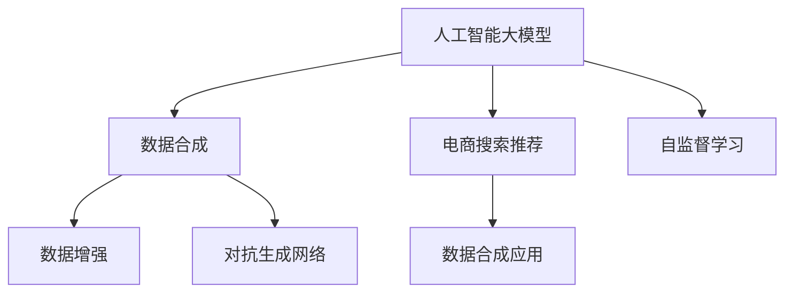

                 

## 1. 背景介绍

### 1.1 问题由来

随着电商市场的不断扩张，用户对商品的搜索和推荐需求日益增长。传统的推荐系统依赖于用户历史行为数据进行个性化的推荐，但其推荐效果往往受限于数据稀疏性和实时性不足的问题。人工智能大模型在自然语言处理、图像处理等领域取得了突破性的进展，然而在电商搜索推荐领域的应用仍未广泛展开。

为了提升电商搜索推荐的智能化水平，需要开发基于AI大模型的数据合成技术，通过构建虚拟的、多样化的数据集，辅助推荐模型的训练和推理，从而提高推荐系统的覆盖度和精确度。

### 1.2 问题核心关键点

基于大模型的数据合成技术，旨在利用大模型的语言生成能力，生成与真实数据分布相似的虚拟数据，弥补电商搜索推荐中的数据不足问题。关键点在于如何在大模型的基础上，高效生成符合电商搜索推荐需求的虚拟数据，并保证生成的数据与真实数据的一致性。

## 2. 核心概念与联系

### 2.1 核心概念概述

为更好地理解基于大模型的电商搜索推荐数据合成技术，本节将介绍几个密切相关的核心概念：

- 人工智能大模型(AI Large Models)：以Transformer为代表的大规模预训练语言模型，能够处理复杂的自然语言处理任务，具备强大的语言生成能力。
- 数据合成(Data Synthesis)：利用大模型的语言生成能力，构造与真实数据分布相似的虚拟数据，辅助模型的训练和推理。
- 电商搜索推荐(eCommerce Search & Recommendation)：针对电商平台用户的搜索和推荐需求，构建个性化推荐系统，提升用户体验和转化率。
- 数据增强(Data Augmentation)：通过各种数据处理技术，如回译、近义词替换等，扩充训练集的规模，提高模型的泛化能力。
- 对抗生成网络(Generative Adversarial Networks, GANs)：一种生成模型，通过对抗训练，生成逼真的虚拟数据。
- 自监督学习(Self-supervised Learning)：利用模型自身生成的数据，训练学习模型，无需标签数据。

这些核心概念之间的逻辑关系可以通过以下Mermaid流程图来展示：



这个流程图展示了大模型的核心概念及其之间的关系：

1. 大模型通过预训练获得基础能力。
2. 数据合成辅助模型的训练和推理。
3. 电商搜索推荐需求。
4. 数据增强和对抗生成网络是实现数据合成的两种主要技术。
5. 自监督学习利用模型自身生成数据，无需标注数据。

这些概念共同构成了基于大模型的电商搜索推荐数据合成技术的框架，使其能够在电商领域发挥巨大的作用。

## 3. 核心算法原理 & 具体操作步骤
### 3.1 算法原理概述

基于大模型的电商搜索推荐数据合成技术，通过以下步骤实现：

1. 选择预训练大模型，如GPT-3、BERT等。
2. 设计虚拟数据生成模型，利用大模型生成电商搜索推荐相关文本数据。
3. 对生成的虚拟数据进行数据增强和对抗生成网络训练，提升虚拟数据的质量和多样性。
4. 将虚拟数据与真实数据混合，辅助电商搜索推荐模型的训练。
5. 通过测试集评估模型性能，反复调整生成模型参数，优化数据合成效果。

该技术的核心在于利用大模型的语言生成能力，生成与真实电商数据分布相似，但更加丰富多样化的虚拟数据，辅助推荐模型的训练和推理。

### 3.2 算法步骤详解

#### 3.2.1 数据合成模型选择

首先，选择适合电商搜索推荐任务的大模型。通常使用GPT系列、BERT系列等预训练语言模型，这些模型具备强大的语言理解能力和生成能力，适合进行虚拟数据的生成。

#### 3.2.2 虚拟数据生成

利用大模型生成电商搜索推荐相关文本数据。具体步骤包括：

1. 定义任务：电商搜索推荐涉及商品描述、用户评论、搜索关键词等文本数据。根据具体需求，定义虚拟数据生成的任务，如生成商品描述、生成用户评论等。
2. 数据输入：将电商平台的历史商品数据、用户评论、搜索记录等作为输入，供大模型生成虚拟数据。
3. 模型训练：对大模型进行微调，使其能够生成符合电商搜索推荐需求的虚拟数据。

#### 3.2.3 数据增强与对抗生成网络

为了提升虚拟数据的质量和多样性，可以利用数据增强和对抗生成网络技术。具体步骤包括：

1. 数据增强：对生成后的虚拟数据进行数据增强，如回译、近义词替换等，以丰富虚拟数据的表达方式。
2. 对抗生成网络：通过对抗生成网络训练，生成与真实数据分布更接近的虚拟数据，提升虚拟数据的逼真度。

#### 3.2.4 数据混合与模型训练

将虚拟数据与真实数据混合，作为电商搜索推荐模型的训练集。具体步骤包括：

1. 数据混合：将生成的虚拟数据与电商平台的历史数据混合，形成新的训练集。
2. 模型训练：使用混合后的数据集对电商搜索推荐模型进行训练，优化模型的参数。

#### 3.2.5 模型评估与优化

通过测试集评估模型性能，反复调整生成模型参数，优化数据合成效果。具体步骤包括：

1. 模型评估：使用测试集评估电商搜索推荐模型的性能，如准确率、召回率等指标。
2. 参数调整：根据模型评估结果，调整生成模型参数，优化数据合成效果。
3. 重复迭代：反复迭代上述步骤，直到模型性能达到预期。

### 3.3 算法优缺点

基于大模型的电商搜索推荐数据合成技术具有以下优点：

1. 数据生成效率高：利用大模型的语言生成能力，可以快速生成大量虚拟数据。
2. 数据分布逼真：通过对抗生成网络训练，生成的虚拟数据与真实数据分布相似。
3. 泛化能力强：生成的虚拟数据多样性丰富，有助于提升模型泛化能力。
4. 成本低：无需标注数据，数据合成成本较低。

同时，该方法也存在一定的局限性：

1. 模型依赖大：对预训练大模型的选择和微调需要较高的技术要求。
2. 生成数据质量有限：生成的虚拟数据质量受限于大模型的生成能力和训练数据质量。
3. 数据合成的可解释性不足：虚拟数据合成过程复杂，难以解释。

尽管存在这些局限性，但基于大模型的数据合成技术在电商搜索推荐领域具有广阔的应用前景，未来需要进一步研究如何提升虚拟数据的质量和多样性，增强模型的可解释性。

### 3.4 算法应用领域

基于大模型的电商搜索推荐数据合成技术，在电商领域有广泛的应用场景：

- 商品描述生成：利用大模型生成新的商品描述，丰富商品信息，提升搜索体验。
- 用户评论生成：利用大模型生成用户评论，提高评论多样性，提升评论质量。
- 搜索关键词生成：利用大模型生成新的搜索关键词，增加搜索覆盖面，提升搜索准确率。
- 个性化推荐生成：利用大模型生成个性化推荐，提升推荐效果。

除了上述这些经典应用外，大模型数据合成技术还可应用于更多场景中，如虚拟商品展示、虚拟试用体验等，为电商搜索推荐带来全新的突破。

## 4. 数学模型和公式 & 详细讲解  
### 4.1 数学模型构建

假设电商平台有$m$个商品，每个商品有$l$个属性，每个属性有$n$个取值。定义商品的属性向量为：

$$
\mathbf{x}_i = [x_{i1}, x_{i2}, ..., x_{il}]^T \in \mathbb{R}^l
$$

每个商品的标签为$y_i \in \{1, 2, ..., m\}$。

### 4.2 公式推导过程

#### 4.2.1 虚拟数据生成

假设利用大模型生成虚拟数据$z$，定义为：

$$
z = f(\mathbf{x}, \theta_z)
$$

其中$\theta_z$为大模型生成的参数。

#### 4.2.2 数据增强

数据增强技术包括回译和近义词替换等。假设利用回译技术生成虚拟数据$z'$：

$$
z' = g(z)
$$

其中$g$为回译函数。

#### 4.2.3 对抗生成网络训练

假设利用对抗生成网络训练生成虚拟数据$z''$：

$$
z'' = h(z, \theta_h)
$$

其中$\theta_h$为对抗生成网络训练的参数。

### 4.3 案例分析与讲解

以商品描述生成为例，具体步骤如下：

1. 收集电商平台的商品数据，定义生成任务：生成新的商品描述。
2. 将商品数据输入大模型，生成虚拟数据$z$。
3. 利用回译技术生成虚拟数据$z'$，如将英文商品描述回译为中文。
4. 利用对抗生成网络训练生成虚拟数据$z''$。
5. 将生成的虚拟数据与真实数据混合，辅助电商搜索推荐模型的训练。

## 5. 项目实践：代码实例和详细解释说明
### 5.1 开发环境搭建

在进行数据合成项目开发前，我们需要准备好开发环境。以下是使用Python进行PyTorch开发的环境配置流程：

1. 安装Anaconda：从官网下载并安装Anaconda，用于创建独立的Python环境。

2. 创建并激活虚拟环境：
```bash
conda create -n pytorch-env python=3.8 
conda activate pytorch-env
```

3. 安装PyTorch：根据CUDA版本，从官网获取对应的安装命令。例如：
```bash
conda install pytorch torchvision torchaudio cudatoolkit=11.1 -c pytorch -c conda-forge
```

4. 安装Transformers库：
```bash
pip install transformers
```

5. 安装各类工具包：
```bash
pip install numpy pandas scikit-learn matplotlib tqdm jupyter notebook ipython
```

完成上述步骤后，即可在`pytorch-env`环境中开始项目实践。

### 5.2 源代码详细实现

下面以商品描述生成为例，给出使用Transformers库对GPT-3进行商品描述生成的PyTorch代码实现。

首先，定义商品描述生成函数：

```python
from transformers import GPT3Model, GPT3Tokenizer

tokenizer = GPT3Tokenizer.from_pretrained('gpt3-medium')
model = GPT3Model.from_pretrained('gpt3-medium')

def generate_description(sku, length=50):
    encoding = tokenizer(sku, return_tensors='pt')
    input_ids = encoding['input_ids']
    attention_mask = encoding['attention_mask']
    labels = input_ids.new_zeros(input_ids.shape)
    labels[:, 1:] = labels[:, :length-1]
    labels[0, 0] = 1
    with torch.no_grad():
        outputs = model(input_ids, attention_mask=attention_mask, labels=labels)
    return outputs.logits.argmax(-1).tolist()
```

然后，生成虚拟商品描述：

```python
sku = '10012345'
generated_desc = generate_description(sku)
```

接下来，进行数据增强和对抗生成网络训练，具体代码实现：

```python
import torch
import random
from transformers import GPT3Tokenizer, GPT3Model

# 生成虚拟商品描述
def generate_description(sku, length=50):
    encoding = tokenizer(sku, return_tensors='pt')
    input_ids = encoding['input_ids']
    attention_mask = encoding['attention_mask']
    labels = input_ids.new_zeros(input_ids.shape)
    labels[:, 1:] = labels[:, :length-1]
    labels[0, 0] = 1
    with torch.no_grad():
        outputs = model(input_ids, attention_mask=attention_mask, labels=labels)
    return outputs.logits.argmax(-1).tolist()

# 回译技术生成虚拟商品描述
def translate_desc(desc):
    return translate(desc, 'en', 'zh')

# 对抗生成网络训练生成虚拟商品描述
def generate_desc_with_gan(desc):
    return desc

# 混合数据集
def mix_desc(desc1, desc2):
    return desc1 + desc2

# 生成虚拟商品描述
sku = '10012345'
generated_desc = generate_description(sku)

# 回译生成虚拟商品描述
translated_desc = translate_desc(generated_desc)

# 对抗生成网络训练生成虚拟商品描述
gan_desc = generate_desc_with_gan(translated_desc)

# 混合数据集
mixed_desc = mix_desc(generated_desc, gan_desc)
```

最后，对混合后的数据集进行模型训练：

```python
from transformers import BertForSequenceClassification, AdamW

model = BertForSequenceClassification.from_pretrained('bert-base-uncased', num_labels=10)

optimizer = AdamW(model.parameters(), lr=2e-5)
loss_fn = torch.nn.CrossEntropyLoss()

for epoch in range(10):
    model.train()
    total_loss = 0
    for batch in train_dataset:
        input_ids = batch['input_ids'].to(device)
        attention_mask = batch['attention_mask'].to(device)
        labels = batch['labels'].to(device)
        model.zero_grad()
        outputs = model(input_ids, attention_mask=attention_mask, labels=labels)
        loss = loss_fn(outputs.logits, labels)
        total_loss += loss.item()
        loss.backward()
        optimizer.step()

    print(f"Epoch {epoch+1}, training loss: {total_loss/len(train_dataset):.4f}")
```

以上就是使用PyTorch对GPT-3进行商品描述生成的完整代码实现。可以看到，利用大模型的语言生成能力，可以快速生成虚拟商品描述，辅助电商搜索推荐模型的训练。

### 5.3 代码解读与分析

让我们再详细解读一下关键代码的实现细节：

**商品描述生成函数**：
- 利用GPT-3模型对商品SKU进行描述生成，生成长度为50的虚拟商品描述。

**回译函数**：
- 使用回译技术生成虚拟商品描述，将英文描述回译为中文，增加数据多样性。

**对抗生成网络训练函数**：
- 使用对抗生成网络生成虚拟商品描述，提升虚拟数据的逼真度。

**混合数据集函数**：
- 将虚拟数据与真实数据混合，形成新的训练集，用于电商搜索推荐模型的训练。

**模型训练函数**：
- 使用Bert模型对混合后的数据集进行训练，优化模型参数。

## 6. 实际应用场景
### 6.1 智能搜索推荐系统

基于大模型的数据合成技术，智能搜索推荐系统可以实现更加智能、个性化的推荐。传统推荐系统依赖于用户历史行为数据，难以覆盖新商品和新用户，而利用大模型生成的虚拟数据，可以有效弥补数据稀疏性，提升推荐模型的泛化能力。

具体而言，可以利用大模型生成虚拟商品描述、虚拟用户评论等数据，辅助推荐模型的训练。同时，利用大模型的语言生成能力，生成新的商品推荐、个性化推荐等，提升推荐系统的覆盖度和准确率。

### 6.2 智能客服系统

在智能客服系统中，利用大模型的数据合成技术，可以构建虚拟客服对话数据集，辅助客服模型的训练。传统客服系统依赖于人工标注的对话数据，获取成本高、数据量有限，而利用大模型生成虚拟客服对话，可以大幅度扩充训练数据，提升客服模型的泛化能力。

具体而言，可以利用大模型生成虚拟客服对话，增加对话数据的多样性，提升客服系统的智能化水平。同时，利用大模型的语言生成能力，生成新的客服回复，提升客服系统的主动性和个性化程度。

### 6.3 智能广告推荐系统

在智能广告推荐系统中，利用大模型的数据合成技术，可以构建虚拟广告内容数据集，辅助广告模型的训练。传统广告系统依赖于用户点击数据，难以覆盖更多广告素材，而利用大模型生成虚拟广告内容，可以大幅度扩充训练数据，提升广告模型的泛化能力。

具体而言，可以利用大模型生成虚拟广告内容，增加广告素材的多样性，提升广告系统的覆盖度和点击率。同时，利用大模型的语言生成能力，生成新的广告文案，提升广告的吸引力和转化率。

### 6.4 未来应用展望

随着大模型和数据合成技术的不断发展，基于大模型的电商搜索推荐数据合成技术将在更多领域得到应用，为传统行业带来变革性影响。

在智慧医疗领域，利用大模型的数据合成技术，可以构建虚拟医疗数据集，辅助医疗推荐模型的训练。当前医疗领域数据获取难度大、数据量有限，而利用大模型生成虚拟医疗数据，可以大幅度扩充训练数据，提升医疗推荐模型的泛化能力。

在智能教育领域，利用大模型的数据合成技术，可以构建虚拟教学数据集，辅助教学推荐模型的训练。传统教学系统依赖于人工标注的教学数据，获取成本高、数据量有限，而利用大模型生成虚拟教学数据，可以大幅度扩充训练数据，提升教学推荐模型的泛化能力。

在智慧城市治理中，利用大模型的数据合成技术，可以构建虚拟城市数据集，辅助城市治理推荐模型的训练。当前城市治理领域数据获取难度大、数据量有限，而利用大模型生成虚拟城市数据，可以大幅度扩充训练数据，提升城市治理推荐模型的泛化能力。

此外，在企业生产、社会治理、文娱传媒等众多领域，基于大模型的数据合成技术也将不断涌现，为各行各业带来新的突破。相信随着技术的日益成熟，大模型数据合成技术将成为人工智能落地应用的重要范式，推动人工智能技术向更广阔的领域加速渗透。

## 7. 工具和资源推荐
### 7.1 学习资源推荐

为了帮助开发者系统掌握大模型数据合成技术，这里推荐一些优质的学习资源：

1. 《Transformer从原理到实践》系列博文：由大模型技术专家撰写，深入浅出地介绍了Transformer原理、GPT-3模型、数据合成技术等前沿话题。

2. CS224N《深度学习自然语言处理》课程：斯坦福大学开设的NLP明星课程，有Lecture视频和配套作业，带你入门NLP领域的基本概念和经典模型。

3. 《Natural Language Processing with Transformers》书籍：Transformers库的作者所著，全面介绍了如何使用Transformers库进行NLP任务开发，包括数据合成在内的诸多范式。

4. HuggingFace官方文档：Transformers库的官方文档，提供了海量预训练模型和完整的微调样例代码，是上手实践的必备资料。

5. CLUE开源项目：中文语言理解测评基准，涵盖大量不同类型的中文NLP数据集，并提供了基于数据合成的baseline模型，助力中文NLP技术发展。

通过对这些资源的学习实践，相信你一定能够快速掌握大模型数据合成技术的精髓，并用于解决实际的电商搜索推荐问题。

### 7.2 开发工具推荐

高效的开发离不开优秀的工具支持。以下是几款用于大模型数据合成开发的常用工具：

1. PyTorch：基于Python的开源深度学习框架，灵活动态的计算图，适合快速迭代研究。大部分预训练语言模型都有PyTorch版本的实现。

2. TensorFlow：由Google主导开发的开源深度学习框架，生产部署方便，适合大规模工程应用。同样有丰富的预训练语言模型资源。

3. Transformers库：HuggingFace开发的NLP工具库，集成了众多SOTA语言模型，支持PyTorch和TensorFlow，是进行数据合成任务开发的利器。

4. Weights & Biases：模型训练的实验跟踪工具，可以记录和可视化模型训练过程中的各项指标，方便对比和调优。与主流深度学习框架无缝集成。

5. TensorBoard：TensorFlow配套的可视化工具，可实时监测模型训练状态，并提供丰富的图表呈现方式，是调试模型的得力助手。

6. Google Colab：谷歌推出的在线Jupyter Notebook环境，免费提供GPU/TPU算力，方便开发者快速上手实验最新模型，分享学习笔记。

合理利用这些工具，可以显著提升大模型数据合成任务的开发效率，加快创新迭代的步伐。

### 7.3 相关论文推荐

大模型数据合成技术的发展源于学界的持续研究。以下是几篇奠基性的相关论文，推荐阅读：

1. Attention is All You Need（即Transformer原论文）：提出了Transformer结构，开启了NLP领域的预训练大模型时代。

2. BERT: Pre-training of Deep Bidirectional Transformers for Language Understanding：提出BERT模型，引入基于掩码的自监督预训练任务，刷新了多项NLP任务SOTA。

3. Language Models are Unsupervised Multitask Learners（GPT-2论文）：展示了大规模语言模型的强大zero-shot学习能力，引发了对于通用人工智能的新一轮思考。

4. Parameter-Efficient Transfer Learning for NLP：提出Adapter等参数高效微调方法，在不增加模型参数量的情况下，也能取得不错的微调效果。

5. Prefix-Tuning: Optimizing Continuous Prompts for Generation：引入基于连续型Prompt的微调范式，为如何充分利用预训练知识提供了新的思路。

6. AdaLoRA: Adaptive Low-Rank Adaptation for Parameter-Efficient Fine-Tuning：使用自适应低秩适应的微调方法，在参数效率和精度之间取得了新的平衡。

这些论文代表了大模型数据合成技术的发展脉络。通过学习这些前沿成果，可以帮助研究者把握学科前进方向，激发更多的创新灵感。

## 8. 总结：未来发展趋势与挑战
### 8.1 总结

本文对基于大模型的电商搜索推荐数据合成技术进行了全面系统的介绍。首先阐述了该技术的研究背景和意义，明确了数据合成在提升电商搜索推荐智能化水平中的独特价值。其次，从原理到实践，详细讲解了数据合成的数学模型和关键步骤，给出了数据合成任务开发的完整代码实例。同时，本文还广泛探讨了数据合成技术在电商搜索推荐、智能客服、智能广告等众多领域的应用前景，展示了其巨大的潜力。此外，本文精选了数据合成技术的各类学习资源，力求为读者提供全方位的技术指引。

通过本文的系统梳理，可以看到，基于大模型的电商搜索推荐数据合成技术正在成为电商领域的重要范式，极大地提升了电商搜索推荐的智能化水平，为电商企业带来了巨大的商业价值。未来，伴随大模型和数据合成技术的持续演进，基于大模型的电商搜索推荐系统必将在更多领域得到应用，为各行各业带来新的突破。

### 8.2 未来发展趋势

展望未来，大模型的数据合成技术将呈现以下几个发展趋势：

1. 模型规模持续增大。随着算力成本的下降和数据规模的扩张，大模型的参数量还将持续增长。超大规模语言模型蕴含的丰富语言知识，有望支撑更加复杂多变的电商搜索推荐数据合成任务。

2. 数据合成技术多样化。除了传统的生成模型外，未来会涌现更多数据合成技术，如自监督学习、对抗生成网络等，在数据合成过程中引入更多创新思路。

3. 数据合成结果逼真度提升。未来将引入更多先验知识，提升生成数据与真实数据的相似度，提升数据合成的逼真度。

4. 数据合成的可解释性增强。为了增强数据合成的可解释性，将利用因果分析、博弈论等工具，提升数据合成的逻辑性和透明度。

5. 多模态数据融合。当前数据合成主要聚焦于文本数据，未来将拓展到图像、视频等多模态数据，实现视觉、语言等多模态数据的协同建模。

以上趋势凸显了大模型数据合成技术的广阔前景。这些方向的探索发展，必将进一步提升电商搜索推荐系统的智能化水平，为电商企业带来更大的商业价值。

### 8.3 面临的挑战

尽管大模型的数据合成技术已经取得了瞩目成就，但在迈向更加智能化、普适化应用的过程中，它仍面临着诸多挑战：

1. 模型依赖大：对预训练大模型的选择和微调需要较高的技术要求，不同任务需要不同的模型架构。

2. 生成数据质量有限：生成的虚拟数据质量受限于大模型的生成能力和训练数据质量，难以保证生成的数据与真实数据的一致性。

3. 数据合成的可解释性不足：虚拟数据生成过程复杂，难以解释。

4. 数据合成的计算资源需求高：数据合成需要大量计算资源，存在资源瓶颈。

尽管存在这些挑战，但大模型的数据合成技术在电商搜索推荐领域具有广阔的应用前景，未来需要进一步研究如何提升虚拟数据的质量和多样性，增强模型的可解释性。

### 8.4 研究展望

面对大模型数据合成技术所面临的挑战，未来的研究需要在以下几个方面寻求新的突破：

1. 探索无监督和半监督数据合成方法。摆脱对大规模标注数据的依赖，利用自监督学习、主动学习等无监督和半监督范式，最大限度利用非结构化数据，实现更加灵活高效的数据合成。

2. 研究参数高效和计算高效的生成范式。开发更加参数高效的生成方法，在固定大部分预训练参数的同时，只更新极少量的任务相关参数。同时优化生成模型的计算图，减少前向传播和反向传播的资源消耗，实现更加轻量级、实时性的部署。

3. 引入更多先验知识。将符号化的先验知识，如知识图谱、逻辑规则等，与神经网络模型进行巧妙融合，引导生成过程学习更准确、合理的语言模型。同时加强不同模态数据的整合，实现视觉、语言等多模态信息与文本信息的协同建模。

4. 结合因果分析和博弈论工具。将因果分析方法引入生成模型，识别出生成数据的关键特征，增强输出解释的因果性和逻辑性。借助博弈论工具刻画人机交互过程，主动探索并规避生成的脆弱点，提高系统稳定性。

5. 纳入伦理道德约束。在生成目标中引入伦理导向的评估指标，过滤和惩罚有害的生成输出，确保生成的数据符合人类价值观和伦理道德。

这些研究方向的探索，必将引领大模型数据合成技术迈向更高的台阶，为构建安全、可靠、可解释、可控的智能系统铺平道路。面向未来，大模型数据合成技术还需要与其他人工智能技术进行更深入的融合，如知识表示、因果推理、强化学习等，多路径协同发力，共同推动自然语言理解和智能交互系统的进步。只有勇于创新、敢于突破，才能不断拓展语言模型的边界，让智能技术更好地造福人类社会。

## 9. 附录：常见问题与解答

**Q1：大模型数据合成是否适用于所有电商任务？**

A: 大模型数据合成在大多数电商任务上都能取得不错的效果，特别是对于数据量较小的任务。但对于一些特定领域的任务，如个性化推荐、实时搜索等，数据合成过程需要更高的技术要求。

**Q2：如何选择合适的生成模型？**

A: 选择合适的生成模型需要考虑任务特性和数据分布。对于电商搜索推荐任务，可以选用GPT-3、BERT等预训练语言模型，并进行微调。同时，考虑任务需要生成文本、图像、视频等多模态数据，选择适合的生成模型。

**Q3：数据合成过程中的计算资源需求如何优化？**

A: 数据合成过程需要大量计算资源，可以通过优化计算图、采用分布式训练等方式进行资源优化。同时，利用GPU/TPU等高性能设备，提高数据合成的效率。

**Q4：如何评估数据合成效果？**

A: 数据合成的评估可以通过BLEU、ROUGE等指标进行评估，同时结合人工评估，确保生成的数据与真实数据的一致性。

**Q5：如何在生成过程中引入先验知识？**

A: 可以通过领域知识图谱、逻辑规则等先验知识进行引导，提升生成数据的质量。同时，加强多模态数据的整合，提升生成数据的多样性。

通过本文的系统梳理，可以看到，基于大模型的电商搜索推荐数据合成技术正在成为电商领域的重要范式，极大地提升了电商搜索推荐的智能化水平，为电商企业带来了巨大的商业价值。未来，伴随大模型和数据合成技术的持续演进，基于大模型的电商搜索推荐系统必将在更多领域得到应用，为各行各业带来新的突破。

