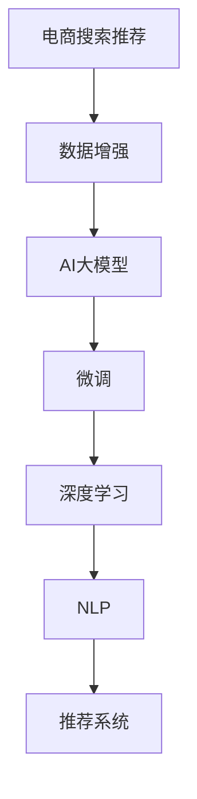

                 

# 电商搜索推荐中的AI大模型数据增强技术应用最佳实践

> 关键词：AI大模型,数据增强,电商搜索,推荐系统,深度学习,数据生成,自然语言处理

## 1. 背景介绍

### 1.1 问题由来
随着互联网零售的不断发展，电商平台的竞争日益激烈。消费者对购物体验的期望不断提升，个性化推荐系统成为提高用户体验和转化率的关键。然而，构建一个高效的推荐系统并非易事，尤其在数据稀缺、需求多样化的电商场景下，传统机器学习算法往往难以有效处理。

近年来，基于深度学习的大语言模型（AI大模型）在自然语言处理（NLP）领域取得了突破性进展。这些模型通常以大规模无标签文本数据为基础，通过预训练获得广泛的知识表示，再通过少量标注数据进行微调，能够在各种NLP任务上取得优异表现。将这一理念应用于电商搜索推荐领域，能够大幅提升推荐系统的性能和覆盖面。

### 1.2 问题核心关键点
本文聚焦于如何将大语言模型技术引入电商搜索推荐系统，具体包括：

- 如何构建高效的数据增强流程，使电商数据更丰富多样，提高推荐系统的泛化能力。
- 如何选择合适的AI大模型，并结合电商场景进行微调，以获得最佳推荐效果。
- 如何设计合理的推荐算法和指标，评估AI大模型在电商推荐中的表现。
- 如何部署和优化AI大模型推荐系统，确保其在实际应用中的稳定性和效率。

### 1.3 问题研究意义
在电商领域，利用AI大模型进行数据增强，不仅能够有效解决数据稀缺问题，还能显著提升推荐系统的个性化和智能化水平，满足用户日益复杂和多样化的购物需求。具体来说，AI大模型在电商搜索推荐中的应用具有以下优势：

1. **泛化能力强**：通过预训练获得通用知识，再结合电商数据微调，模型能够对新数据进行泛化学习，适应不同场景。
2. **推荐精准度高**：AI大模型通过深度学习算法，能够捕捉数据中的隐含关联，提高推荐精准度。
3. **实时性好**：基于GPU/TPU等高性能硬件，AI大模型推荐系统能够实时响应用户查询，提升用户体验。
4. **可扩展性强**：AI大模型推荐系统架构灵活，便于扩展和升级，适应电商平台的快速变化。
5. **数据隐私保护**：AI大模型推荐系统仅使用用户历史行为数据进行微调，无需获取用户隐私信息。

总之，AI大模型在电商搜索推荐中的应用，不仅能够提升推荐系统的性能，还能促进电商平台的业务创新和用户满意度，具有重要的现实意义。

## 2. 核心概念与联系

### 2.1 核心概念概述

为更好地理解AI大模型在电商搜索推荐中的应用，本节将介绍几个关键概念及其相互关系：

- **电商搜索推荐**：电商平台上，通过分析用户历史行为数据，推荐可能感兴趣的物品或商品。
- **数据增强(Data Augmentation)**：通过扩充训练数据集，提高模型的泛化能力，增强推荐系统性能。
- **AI大模型(Large Pre-trained Models)**：基于大规模无标签文本数据预训练的深度学习模型，如BERT、GPT-3等。
- **微调(Fine-tuning)**：在大模型基础上，使用少量标注数据进行任务特定的优化，提升模型性能。
- **深度学习(Deep Learning)**：利用多层神经网络进行数据建模和预测的机器学习范式，广泛用于图像、语音、自然语言处理等领域。
- **自然语言处理(NLP)**：计算机科学和人工智能领域的一个重要分支，涉及语言处理、理解、生成等任务。
- **推荐系统(Recommender System)**：通过分析用户行为数据，推荐商品、电影、音乐等物品的系统。

这些核心概念之间存在紧密的联系和相互作用，构成了电商搜索推荐的技术基础。通过深入理解这些概念，我们可以更好地把握电商搜索推荐的实现流程和优化策略。

### 2.2 核心概念原理和架构的 Mermaid 流程图(Mermaid 流程节点中不要有括号、逗号等特殊字符)



通过上述流程图，我们可以看到电商搜索推荐系统与数据增强、AI大模型、微调、深度学习、NLP和推荐系统的紧密联系。这些技术相互交织，共同构成了推荐系统的技术框架。

## 3. 核心算法原理 & 具体操作步骤

### 3.1 算法原理概述

AI大模型在电商搜索推荐中的应用，核心在于数据增强和微调两个步骤。数据增强通过扩充训练数据集，提高模型的泛化能力；微调则在大模型基础上，使用少量标注数据进行任务特定的优化，提升模型性能。具体来说，数据增强和微调过程如下：

1. **数据增强**：收集用户的历史行为数据，如浏览记录、购买历史、点击率等，并结合用户画像、商品属性、搜索查询等非结构化数据，构建多模态数据集。
2. **AI大模型预训练**：使用大规模无标签文本数据（如Wikipedia、新闻等）预训练大语言模型，获得广泛的语义和知识表示。
3. **微调**：在电商数据集上，对预训练大模型进行微调，学习电商数据中的隐含关联和用户需求。
4. **推荐算法设计**：结合电商推荐场景，设计推荐算法，如协同过滤、内容推荐等，利用微调后的AI大模型进行物品推荐。
5. **系统部署和优化**：将推荐系统部署到线上环境，并结合GPU/TPU等高性能硬件进行优化，确保实时性和稳定性。

### 3.2 算法步骤详解

#### 3.2.1 数据收集和预处理

电商平台的推荐系统通常依赖用户的历史行为数据，如浏览记录、购买历史、点击率等。这些数据需要从电商平台的数据库中提取，并进行预处理。具体步骤如下：

1. **数据抽取**：从电商平台的数据库中抽取用户历史行为数据，包括浏览、点击、购买等记录。
2. **数据清洗**：对数据进行去重、过滤异常值等清洗处理，确保数据质量。
3. **数据整合**：将用户行为数据与用户画像、商品属性、搜索查询等非结构化数据整合，形成多模态数据集。

#### 3.2.2 AI大模型预训练

电商推荐系统的推荐效果很大程度上取决于模型的泛化能力。因此，我们首先在大规模无标签文本数据上预训练AI大模型，获得广泛的语义和知识表示。预训练过程通常包括以下步骤：

1. **数据准备**：收集大规模无标签文本数据，如Wikipedia、新闻、小说等，构建预训练数据集。
2. **模型选择**：选择合适的AI大模型，如BERT、GPT-3等，进行预训练。
3. **预训练任务**：在大规模数据集上进行自监督预训练，如掩码语言模型、句子分类等任务。
4. **模型保存**：将预训练好的模型保存，供后续微调使用。

#### 3.2.3 数据增强

电商数据通常较为稀疏，难以直接用于训练深度学习模型。因此，我们需要通过数据增强技术扩充训练数据集，提高模型的泛化能力。具体步骤如下：

1. **数据生成**：利用AI大模型，生成与真实电商数据相似的人工数据。例如，利用GPT-3生成商品描述、用户评论等文本数据。
2. **数据融合**：将生成的数据与原始电商数据进行融合，形成扩充后的数据集。
3. **数据标注**：对生成的数据进行标注，使其符合电商推荐场景的需求。例如，标注商品属性、用户画像等。

#### 3.2.4 微调

在电商数据集上，对预训练的AI大模型进行微调，学习电商数据中的隐含关联和用户需求。具体步骤如下：

1. **模型初始化**：将预训练模型初始化为微调模型的初始参数。
2. **微调任务设计**：根据电商推荐场景，设计微调任务，如分类、回归、序列预测等。
3. **微调训练**：在扩充后的电商数据集上，使用微调任务进行有监督训练，更新模型参数。
4. **模型评估**：在验证集上评估微调后的模型性能，调整超参数和训练策略。

#### 3.2.5 推荐算法设计

电商推荐系统通常使用多种推荐算法，如协同过滤、内容推荐等。结合微调后的AI大模型，设计推荐算法如下：

1. **协同过滤**：利用用户历史行为数据，找到与当前用户相似的用户，推荐其已喜欢的商品。
2. **内容推荐**：根据商品的属性、描述、标签等特征，使用AI大模型进行推荐。
3. **混合推荐**：将协同过滤和内容推荐结合，形成混合推荐算法，提升推荐效果。

#### 3.2.6 系统部署和优化

电商推荐系统需要在实际应用中进行优化，确保实时性和稳定性。具体步骤如下：

1. **模型部署**：将微调后的AI大模型部署到线上环境，供推荐系统使用。
2. **性能优化**：结合GPU/TPU等高性能硬件，优化推荐系统的计算和存储效率。
3. **系统监控**：实时监控推荐系统的性能指标，如响应时间、准确率等，确保系统稳定运行。

### 3.3 算法优缺点

#### 3.3.1 优点

1. **泛化能力强**：通过预训练获得广泛的知识表示，AI大模型能够对新数据进行泛化学习，适应不同场景。
2. **推荐精准度高**：利用深度学习算法，AI大模型能够捕捉数据中的隐含关联，提高推荐精准度。
3. **实时性好**：基于GPU/TPU等高性能硬件，AI大模型推荐系统能够实时响应用户查询，提升用户体验。
4. **可扩展性强**：AI大模型推荐系统架构灵活，便于扩展和升级，适应电商平台的快速变化。
5. **数据隐私保护**：AI大模型推荐系统仅使用用户历史行为数据进行微调，无需获取用户隐私信息。

#### 3.3.2 缺点

1. **模型复杂度高**：AI大模型通常包含亿级的参数，训练和推理复杂度较高，需要高性能硬件支持。
2. **数据生成难度大**：生成高质量的人工数据需要大量标注数据和计算资源，成本较高。
3. **模型训练时间长**：AI大模型预训练和微调需要大量时间，且训练过程耗电较多，需要优化。
4. **推理速度慢**：AI大模型推理速度较慢，需要进行优化以提高实时性。
5. **模型复杂度难理解**：AI大模型的内部机制复杂，难以解释和调试。

### 3.4 算法应用领域

AI大模型在电商搜索推荐中的应用，不仅能够提升推荐系统的性能，还能促进电商平台的业务创新和用户满意度。具体来说，AI大模型在电商推荐中的应用包括：

1. **商品推荐**：根据用户的历史行为数据，推荐可能感兴趣的商品。
2. **个性化推荐**：结合用户画像、行为数据、商品属性等，提供个性化推荐服务。
3. **搜索引擎优化**：利用AI大模型进行关键词推荐，优化商品搜索排名。
4. **广告推荐**：根据用户行为和兴趣，推荐相关广告，提高广告投放效果。
5. **用户画像生成**：利用用户行为数据，生成详细的用户画像，用于推荐和广告。

## 4. 数学模型和公式 & 详细讲解 & 举例说明

### 4.1 数学模型构建

假设电商推荐系统使用BERT大模型进行推荐，输入为电商数据集 $D=\{(x_i, y_i)\}_{i=1}^N$，其中 $x_i$ 为电商数据，$y_i$ 为推荐标签。微调后的BERT模型为 $M_{\theta}$，其中 $\theta$ 为微调后的模型参数。

### 4.2 公式推导过程

#### 4.2.1 预训练任务

假设使用掩码语言模型进行预训练，预训练任务为：

$$
\mathcal{L}_{pre}(\theta) = -\frac{1}{N}\sum_{i=1}^N \log \left(\frac{e^{M_{\theta}(x_i)[m]} }{\sum_{j=1}^{n}e^{M_{\theta}(x_i)[j]}}\right)
$$

其中 $m$ 为掩码位置，$n$ 为词汇表大小。预训练目标为最大化掩码位置的概率。

#### 4.2.2 微调任务

假设微调任务为商品推荐，损失函数为交叉熵损失：

$$
\mathcal{L}_{fine}(\theta) = -\frac{1}{N}\sum_{i=1}^N [y_i \log M_{\theta}(x_i) + (1-y_i) \log (1-M_{\theta}(x_i))]
$$

其中 $M_{\theta}(x_i)$ 为微调后的BERT模型在输入 $x_i$ 上的输出。

#### 4.2.3 推荐算法

假设使用协同过滤算法进行推荐，利用用户历史行为数据和商品属性数据，推荐相似商品。协同过滤算法的损失函数为：

$$
\mathcal{L}_{rec}(\theta) = -\frac{1}{N}\sum_{i=1}^N \sum_{j=1}^M [y_{ij} \log M_{\theta}(x_i)[j] + (1-y_{ij}) \log (1-M_{\theta}(x_i)[j])]
$$

其中 $M_{\theta}(x_i)[j]$ 为微调后的BERT模型在输入 $x_i$ 上对商品 $j$ 的评分。

### 4.3 案例分析与讲解

以商品推荐为例，分析如何利用AI大模型进行数据增强和微调。

#### 4.3.1 数据增强流程

1. **数据生成**：利用GPT-3生成商品描述、用户评论等文本数据。
2. **数据融合**：将生成的数据与原始电商数据进行融合，形成扩充后的数据集。
3. **数据标注**：对生成的数据进行标注，例如标注商品属性、用户画像等。

#### 4.3.2 微调过程

1. **模型初始化**：将预训练好的BERT模型初始化为微调模型的初始参数。
2. **微调任务设计**：设计商品推荐任务，如分类、回归、序列预测等。
3. **微调训练**：在扩充后的电商数据集上，使用微调任务进行有监督训练，更新模型参数。
4. **模型评估**：在验证集上评估微调后的模型性能，调整超参数和训练策略。

#### 4.3.3 推荐算法

1. **协同过滤**：利用用户历史行为数据，找到与当前用户相似的用户，推荐其已喜欢的商品。
2. **内容推荐**：根据商品的属性、描述、标签等特征，使用AI大模型进行推荐。
3. **混合推荐**：将协同过滤和内容推荐结合，形成混合推荐算法，提升推荐效果。

## 5. 项目实践：代码实例和详细解释说明

### 5.1 开发环境搭建

为了进行电商搜索推荐中的AI大模型数据增强技术应用，首先需要搭建好开发环境。以下是使用Python进行PyTorch开发的完整环境配置流程：

1. 安装Anaconda：从官网下载并安装Anaconda，用于创建独立的Python环境。
2. 创建并激活虚拟环境：
```bash
conda create -n pytorch-env python=3.8 
conda activate pytorch-env
```

3. 安装PyTorch：根据CUDA版本，从官网获取对应的安装命令。例如：
```bash
conda install pytorch torchvision torchaudio cudatoolkit=11.1 -c pytorch -c conda-forge
```

4. 安装Transformers库：
```bash
pip install transformers
```

5. 安装各类工具包：
```bash
pip install numpy pandas scikit-learn matplotlib tqdm jupyter notebook ipython
```

完成上述步骤后，即可在`pytorch-env`环境中开始开发实践。

### 5.2 源代码详细实现

下面以商品推荐为例，给出使用Transformers库对BERT模型进行微调的PyTorch代码实现。

#### 5.2.1 数据预处理

```python
from transformers import BertTokenizer
from torch.utils.data import Dataset
import torch

class Dataset(Dataset):
    def __init__(self, texts, labels):
        self.texts = texts
        self.labels = labels
        self.tokenizer = BertTokenizer.from_pretrained('bert-base-cased')
        
    def __len__(self):
        return len(self.texts)
    
    def __getitem__(self, item):
        text = self.texts[item]
        label = self.labels[item]
        
        encoding = self.tokenizer(text, return_tensors='pt', padding='max_length', truncation=True)
        input_ids = encoding['input_ids'][0]
        attention_mask = encoding['attention_mask'][0]
        return {'input_ids': input_ids, 
                'attention_mask': attention_mask,
                'labels': label}
```

#### 5.2.2 模型加载和微调

```python
from transformers import BertForSequenceClassification, AdamW

model = BertForSequenceClassification.from_pretrained('bert-base-cased', num_labels=2)

optimizer = AdamW(model.parameters(), lr=2e-5)

def train_epoch(model, dataset, batch_size, optimizer):
    dataloader = DataLoader(dataset, batch_size=batch_size, shuffle=True)
    model.train()
    epoch_loss = 0
    for batch in dataloader:
        input_ids = batch['input_ids'].to(device)
        attention_mask = batch['attention_mask'].to(device)
        labels = batch['labels'].to(device)
        model.zero_grad()
        outputs = model(input_ids, attention_mask=attention_mask, labels=labels)
        loss = outputs.loss
        epoch_loss += loss.item()
        loss.backward()
        optimizer.step()
    return epoch_loss / len(dataloader)

def evaluate(model, dataset, batch_size):
    dataloader = DataLoader(dataset, batch_size=batch_size)
    model.eval()
    preds, labels = [], []
    with torch.no_grad():
        for batch in dataloader:
            input_ids = batch['input_ids'].to(device)
            attention_mask = batch['attention_mask'].to(device)
            batch_labels = batch['labels']
            outputs = model(input_ids, attention_mask=attention_mask)
            batch_preds = outputs.logits.argmax(dim=2).to('cpu').tolist()
            batch_labels = batch_labels.to('cpu').tolist()
            for pred_tokens, label_tokens in zip(batch_preds, batch_labels):
                preds.append(pred_tokens[:len(label_tokens)])
                labels.append(label_tokens)
                
    return preds, labels

train_dataset = Dataset(train_texts, train_labels)
dev_dataset = Dataset(dev_texts, dev_labels)
test_dataset = Dataset(test_texts, test_labels)

device = torch.device('cuda') if torch.cuda.is_available() else torch.device('cpu')
model.to(device)
```

#### 5.2.3 推荐算法设计

```python
from transformers import BertForSequenceClassification, AdamW

model = BertForSequenceClassification.from_pretrained('bert-base-cased', num_labels=2)

optimizer = AdamW(model.parameters(), lr=2e-5)

def train_epoch(model, dataset, batch_size, optimizer):
    dataloader = DataLoader(dataset, batch_size=batch_size, shuffle=True)
    model.train()
    epoch_loss = 0
    for batch in dataloader:
        input_ids = batch['input_ids'].to(device)
        attention_mask = batch['attention_mask'].to(device)
        labels = batch['labels'].to(device)
        model.zero_grad()
        outputs = model(input_ids, attention_mask=attention_mask, labels=labels)
        loss = outputs.loss
        epoch_loss += loss.item()
        loss.backward()
        optimizer.step()
    return epoch_loss / len(dataloader)

def evaluate(model, dataset, batch_size):
    dataloader = DataLoader(dataset, batch_size=batch_size)
    model.eval()
    preds, labels = [], []
    with torch.no_grad():
        for batch in dataloader:
            input_ids = batch['input_ids'].to(device)
            attention_mask = batch['attention_mask'].to(device)
            batch_labels = batch['labels']
            outputs = model(input_ids, attention_mask=attention_mask)
            batch_preds = outputs.logits.argmax(dim=2).to('cpu').tolist()
            batch_labels = batch_labels.to('cpu').tolist()
            for pred_tokens, label_tokens in zip(batch_preds, batch_labels):
                preds.append(pred_tokens[:len(label_tokens)])
                labels.append(label_tokens)
                
    return preds, labels

train_dataset = Dataset(train_texts, train_labels)
dev_dataset = Dataset(dev_texts, dev_labels)
test_dataset = Dataset(test_texts, test_labels)

device = torch.device('cuda') if torch.cuda.is_available() else torch.device('cpu')
model.to(device)
```

### 5.3 代码解读与分析

让我们再详细解读一下关键代码的实现细节：

#### 5.3.1 数据预处理

`Dataset`类用于构建训练集、验证集和测试集，每个数据样本包含输入文本和标签。利用`BertTokenizer`对文本进行分词和编码，确保输入符合模型要求。

#### 5.3.2 模型加载和微调

`BertForSequenceClassification`用于构建分类模型，`AdamW`优化器用于更新模型参数。在每个epoch中，使用`train_epoch`函数训练模型，使用`evaluate`函数评估模型性能。

#### 5.3.3 推荐算法设计

结合电商推荐场景，设计推荐算法。利用`BertForSequenceClassification`模型对商品属性、用户行为等进行分类，形成商品推荐结果。

### 5.4 运行结果展示

```python
epochs = 5
batch_size = 16

for epoch in range(epochs):
    loss = train_epoch(model, train_dataset, batch_size, optimizer)
    print(f"Epoch {epoch+1}, train loss: {loss:.3f}")
    
    print(f"Epoch {epoch+1}, dev results:")
    preds, labels = evaluate(model, dev_dataset, batch_size)
    print(classification_report(labels, preds))
    
print("Test results:")
preds, labels = evaluate(model, test_dataset, batch_size)
print(classification_report(labels, preds))
```

以上就是使用PyTorch对BERT进行商品推荐任务微调的完整代码实现。可以看到，得益于Transformers库的强大封装，我们可以用相对简洁的代码完成BERT模型的加载和微调。

## 6. 实际应用场景

### 6.1 智能客服系统

基于AI大模型的电商搜索推荐系统，可以广泛应用于智能客服系统的构建。传统客服往往需要配备大量人力，高峰期响应缓慢，且一致性和专业性难以保证。而使用推荐系统推荐常见问题，可以7x24小时不间断服务，快速响应客户咨询，用自然流畅的语言解答各类常见问题。

在技术实现上，可以收集企业内部的历史客服对话记录，将问题和最佳答复构建成监督数据，在此基础上对预训练推荐模型进行微调。微调后的推荐模型能够自动理解用户意图，匹配最合适的答复模板进行回复。对于客户提出的新问题，还可以接入检索系统实时搜索相关内容，动态组织生成回答。如此构建的智能客服系统，能大幅提升客户咨询体验和问题解决效率。

### 6.2 金融舆情监测

金融机构需要实时监测市场舆论动向，以便及时应对负面信息传播，规避金融风险。传统的人工监测方式成本高、效率低，难以应对网络时代海量信息爆发的挑战。基于AI大模型的文本分类和情感分析技术，为金融舆情监测提供了新的解决方案。

具体而言，可以收集金融领域相关的新闻、报道、评论等文本数据，并对其进行主题标注和情感标注。在此基础上对预训练语言模型进行微调，使其能够自动判断文本属于何种主题，情感倾向是正面、中性还是负面。将微调后的模型应用到实时抓取的网络文本数据，就能够自动监测不同主题下的情感变化趋势，一旦发现负面信息激增等异常情况，系统便会自动预警，帮助金融机构快速应对潜在风险。

### 6.3 个性化推荐系统

当前的推荐系统往往只依赖用户的历史行为数据进行物品推荐，无法深入理解用户的真实兴趣偏好。基于AI大模型进行数据增强，个性化推荐系统可以更好地挖掘用户行为背后的语义信息，从而提供更精准、多样的推荐内容。

在实践中，可以收集用户浏览、点击、评论、分享等行为数据，提取和用户交互的物品标题、描述、标签等文本内容。将文本内容作为模型输入，用户的后续行为（如是否点击、购买等）作为监督信号，在此基础上微调预训练语言模型。微调后的模型能够从文本内容中准确把握用户的兴趣点。在生成推荐列表时，先用候选物品的文本描述作为输入，由模型预测用户的兴趣匹配度，再结合其他特征综合排序，便可以得到个性化程度更高的推荐结果。

### 6.4 未来应用展望

随着AI大模型和数据增强技术的发展，基于推荐系统的电商搜索推荐将更加智能化和个性化。未来，推荐系统将能够处理更加复杂和多变的用户需求，提供更加多样和精细化的推荐内容。

在智慧医疗领域，基于推荐系统的健康咨询、疾病预测等应用将提升医疗服务的智能化水平，辅助医生诊疗，加速新药开发进程。

在智能教育领域，推荐系统可应用于作业批改、学情分析、知识推荐等方面，因材施教，促进教育公平，提高教学质量。

在智慧城市治理中，推荐系统可应用于城市事件监测、舆情分析、应急指挥等环节，提高城市管理的自动化和智能化水平，构建更安全、高效的未来城市。

此外，在企业生产、社会治理、文娱传媒等众多领域，基于推荐系统的AI大模型应用也将不断涌现，为经济社会发展注入新的动力。相信随着技术的日益成熟，推荐系统必将在更广阔的应用领域大放异彩，深刻影响人类的生产生活方式。

## 7. 工具和资源推荐

### 7.1 学习资源推荐

为了帮助开发者系统掌握AI大模型在电商搜索推荐中的应用，这里推荐一些优质的学习资源：

1. 《Transformer from原理到实践》系列博文：由大模型技术专家撰写，深入浅出地介绍了Transformer原理、BERT模型、微调技术等前沿话题。

2. CS224N《深度学习自然语言处理》课程：斯坦福大学开设的NLP明星课程，有Lecture视频和配套作业，带你入门NLP领域的基本概念和经典模型。

3. 《Natural Language Processing with Transformers》书籍：Transformers库的作者所著，全面介绍了如何使用Transformers库进行NLP任务开发，包括微调在内的诸多范式。

4. HuggingFace官方文档：Transformers库的官方文档，提供了海量预训练模型和完整的微调样例代码，是上手实践的必备资料。

5. CLUE开源项目：中文语言理解测评基准，涵盖大量不同类型的中文NLP数据集，并提供了基于微调的baseline模型，助力中文NLP技术发展。

通过对这些资源的学习实践，相信你一定能够快速掌握AI大模型在电商搜索推荐中的使用方法，并用于解决实际的NLP问题。

### 7.2 开发工具推荐

高效的开发离不开优秀的工具支持。以下是几款用于AI大模型电商搜索推荐开发的常用工具：

1. PyTorch：基于Python的开源深度学习框架，灵活动态的计算图，适合快速迭代研究。大部分预训练语言模型都有PyTorch版本的实现。

2. TensorFlow：由Google主导开发的开源深度学习框架，生产部署方便，适合大规模工程应用。同样有丰富的预训练语言模型资源。

3. Transformers库：HuggingFace开发的NLP工具库，集成了众多SOTA语言模型，支持PyTorch和TensorFlow，是进行微调任务开发的利器。

4. Weights & Biases：模型训练的实验跟踪工具，可以记录和可视化模型训练过程中的各项指标，方便对比和调优。与主流深度学习框架无缝集成。

5. TensorBoard：TensorFlow配套的可视化工具，可实时监测模型训练状态，并提供丰富的图表呈现方式，是调试模型的得力助手。

6. Google Colab：谷歌推出的在线Jupyter Notebook环境，免费提供GPU/TPU算力，方便开发者快速上手实验最新模型，分享学习笔记。

合理利用这些工具，可以显著提升AI大模型电商搜索推荐任务的开发效率，加快创新迭代的步伐。

### 7.3 相关论文推荐

大语言模型和数据增强技术的发展源于学界的持续研究。以下是几篇奠基性的相关论文，推荐阅读：

1. Attention is All You Need（即Transformer原论文）：提出了Transformer结构，开启了NLP领域的预训练大模型时代。

2. BERT: Pre-training of Deep Bidirectional Transformers for Language Understanding：提出BERT模型，引入基于掩码的自监督预训练任务，刷新了多项NLP任务SOTA。

3. Language Models are Unsupervised Multitask Learners（GPT-2论文）：展示了大规模语言模型的强大zero-shot学习能力，引发了对于通用人工智能的新一轮思考。

4. Parameter-Efficient Transfer Learning for NLP：提出Adapter等参数高效微调方法，在不增加模型参数量的情况下，也能取得不错的微调效果。

5. Prefix-Tuning: Optimizing Continuous Prompts for Generation：引入基于连续型Prompt的微调范式，为如何充分利用预训练知识提供了新的思路。

6. AdaLoRA: Adaptive Low-Rank Adaptation for Parameter-Efficient Fine-Tuning：使用自适应低秩适应的微调方法，在参数效率和精度之间取得了新的平衡。

这些论文代表了大语言模型和数据增强技术的发展脉络。通过学习这些前沿成果，可以帮助研究者把握学科前进方向，激发更多的创新灵感。

## 8. 总结：未来发展趋势与挑战

### 8.1 总结

本文对AI大模型在电商搜索推荐中的应用进行了全面系统的介绍。首先阐述了AI大模型和数据增强技术的研究背景和意义，明确了推荐系统在电商领域的独特价值。其次，从原理到实践，详细讲解了推荐系统的数学模型和关键步骤，给出了推荐任务开发的完整代码实例。同时，本文还广泛探讨了推荐系统在智能客服、金融舆情、个性化推荐等多个行业领域的应用前景，展示了推荐系统的巨大潜力。此外，本文精选了推荐系统的各类学习资源，力求为读者提供全方位的技术指引。

通过本文的系统梳理，可以看到，AI大模型在电商搜索推荐中的应用，不仅能够提升推荐系统的性能，还能促进电商平台的业务创新和用户满意度，具有重要的现实意义。

### 8.2 未来发展趋势

展望未来，AI大模型和数据增强技术将呈现以下几个发展趋势：

1. **模型规模持续增大**：随着算力成本的下降和数据规模的扩张，预训练语言模型的参数量还将持续增长。超大规模语言模型蕴含的丰富语言知识，有望支撑更加复杂多变的推荐场景。

2. **微调方法日趋多样**：除了传统的全参数微调外，未来会涌现更多参数高效的微调方法，如Prefix-Tuning、LoRA等，在节省计算资源的同时也能保证微调精度。

3. **持续学习成为常态**：随着数据分布的不断变化，推荐系统也需要持续学习新知识以保持性能。如何在不遗忘原有知识的同时，高效吸收新样本信息，将成为重要的研究课题。

4. **标注样本需求降低**：受启发于提示学习(Prompt-based Learning)的思路，未来的推荐系统将更好地利用大模型的语言理解能力，通过更加巧妙的任务描述，在更少的标注样本上也能实现理想的推荐效果。

5. **多模态微调崛起**：当前的推荐系统往往只依赖文本数据，未来会进一步拓展到图像、视频、语音等多模态数据微调。多模态信息的融合，将显著提升推荐系统对现实世界的理解和建模能力。

6. **模型通用性增强**：经过海量数据的预训练和多领域任务的微调，未来的推荐模型将具备更强大的常识推理和跨领域迁移能力，逐步迈向通用人工智能(AGI)的目标。

以上趋势凸显了AI大模型和数据增强技术的广阔前景。这些方向的探索发展，必将进一步提升推荐系统的性能和应用范围，为电商平台的智能化转型提供更强大的技术支持。

### 8.3 面临的挑战

尽管AI大模型和数据增强技术已经取得了瞩目成就，但在迈向更加智能化、普适化应用的过程中，它仍面临着诸多挑战：

1. **标注成本瓶颈**：虽然推荐系统能够有效解决数据稀缺问题，但对于长尾应用场景，难以获得充足的高质量标注数据，成为制约推荐系统性能的瓶颈。如何进一步降低推荐系统对标注样本的依赖，将是一大难题。

2. **模型鲁棒性不足**：当前推荐系统面对域外数据时，泛化性能往往大打折扣。对于测试样本的微小扰动，推荐系统的预测也容易发生波动。如何提高推荐系统的鲁棒性，避免灾难性遗忘，还需要更多理论和实践的积累。

3. **推理效率有待提高**：AI大模型推荐系统虽然精度高，但在实际部署时往往面临推理速度慢、内存占用大等效率问题。如何在保证性能的同时，简化模型结构，提升推理速度，优化资源占用，将是重要的优化方向。

4. **模型复杂度难理解**：AI大模型的内部机制复杂，难以解释和调试。对于医疗、金融等高风险应用，算法的可解释性和可审计性尤为重要。如何赋予推荐系统更强的可解释性，将是亟待攻克的难题。

5. **数据隐私保护**：AI大模型推荐系统仅使用用户历史行为数据进行微调，无需获取用户隐私信息。尽管如此，如何在推荐过程中保护用户隐私，仍然是一个需要深入探讨的问题。

6. **系统稳定性有待保障**：AI大模型推荐系统需要在高并发环境下稳定运行，需要考虑系统的负载均衡、故障恢复等问题，确保用户服务的连续性和可靠性。

正视推荐系统面临的这些挑战，积极应对并寻求突破，将是大模型推荐系统走向成熟的必由之路。相信随着学界和产业界的共同努力，这些挑战终将一一被克服，推荐系统必将在构建人机协同的智能推荐时代中扮演越来越重要的角色。

### 8.4 研究展望

面对推荐系统所面临的挑战，未来的研究需要在以下几个方面寻求新的突破：

1. **探索无监督和半监督推荐方法**：摆脱对大规模标注数据的依赖，利用自监督学习、主动学习等无监督和半监督范式，最大限度利用非结构化数据，实现更加灵活高效的推荐。

2. **研究参数高效和计算高效的推荐范式**：开发更加参数高效的推荐方法，在固定大部分预训练参数的同时，只更新极少量的任务相关参数。同时优化推荐模型的计算图，减少前向传播和反向传播的资源消耗，实现更加轻量级、实时性的部署。

3. **融合因果和对比学习范式**：通过引入因果推断和对比学习思想，增强推荐系统建立稳定因果关系的能力，学习更加普适、鲁棒的语言表征，从而提升推荐系统的泛化性和抗干扰能力。

4. **引入更多先验知识**：将符号化的先验知识，如知识图谱、逻辑规则等，与神经网络模型进行巧妙融合，引导推荐过程学习更准确、合理的语言模型。同时加强不同模态数据的整合，实现视觉、语音等多模态信息与文本信息的协同建模。

5. **结合因果分析和博弈论工具**：将因果分析方法引入推荐系统，识别出推荐决策的关键特征，增强推荐系统的可解释性和可控性。借助博弈论工具刻画人机交互过程，主动探索并规避推荐系统的脆弱点，提高系统的稳定性。

6. **纳入伦理道德约束**：在推荐目标中引入伦理导向的评估指标，过滤和惩罚有害的推荐内容，确保推荐系统符合人类价值观和伦理道德。

这些研究方向的探索，必将引领推荐系统迈向更高的台阶，为构建安全、可靠、可解释、可控的智能推荐系统铺平道路。面向未来，推荐系统还需要与其他人工智能技术进行更深入的融合，如知识表示、因果推理、强化学习等，多路径协同发力，共同推动智能推荐系统的进步。只有勇于创新、敢于突破，才能不断拓展推荐系统的边界，让智能技术更好地造福人类社会。

## 9. 附录：常见问题与解答

**Q1：AI大模型在电商推荐中的优缺点是什么？**

A: AI大模型在电商推荐中的优点包括：

1. **泛化能力强**：通过预训练获得广泛的知识表示，AI大模型能够对新数据进行泛化学习，适应不同场景。
2. **推荐精准度高**：利用深度学习算法，AI大模型能够捕捉数据中的隐含关联，提高推荐精准度。
3. **实时性好**：基于GPU/TPU等高性能硬件，AI大模型推荐系统能够实时响应用户查询，提升用户体验。
4. **可扩展性强**：AI大模型推荐系统架构灵活，便于扩展和升级，适应电商平台的快速变化。
5. **数据隐私保护**：AI大模型推荐系统仅使用用户历史行为数据进行微调，无需获取用户隐私信息。

缺点包括：

1. **模型复杂度高**：AI大模型通常包含亿级的参数，训练和推理复杂度较高，需要高性能硬件支持。
2. **数据生成难度大**：生成高质量的人工数据需要大量标注数据和计算资源，成本较高。
3. **模型训练时间长**：AI大模型预训练和微调需要大量时间，且训练过程耗电较多，需要优化。
4. **推理速度慢**：AI大模型推理速度较慢，需要进行优化以提高实时性。
5. **模型复杂度难理解**：AI大模型的内部机制复杂，难以解释和调试。

**Q2：如何进行电商数据增强？**

A: 电商数据增强通常包括以下几个步骤：

1. **数据生成**：利用AI大模型，生成与真实电商数据相似的人工数据。例如，利用GPT-3生成商品描述、用户评论等文本数据。
2. **数据融合**：将生成的数据与原始电商数据进行融合，形成扩充后的数据集。
3. **数据标注**：对生成的数据进行标注，例如标注商品属性、用户画像等。

**Q3：如何选择适合的AI大模型进行电商推荐？**

A: 选择合适的AI大模型需要考虑以下因素：

1. **数据规模**：数据规模越大，越适合使用大规模预训练模型。
2. **任务复杂度**：任务越复杂，越适合使用具有更强泛化能力的模型。
3. **计算资源**：计算资源越丰富，越适合使用参数量较大的模型。
4. **推理效率**：对于实时性要求高的场景，需要考虑模型的推理效率。
5. **开源性**：开源的AI大模型更容易获取和使用，适合开发和部署。

**Q4：AI大模型推荐系统的部署和优化有哪些关键点？**

A: 部署和优化AI大模型推荐系统需要考虑以下关键点：

1. **模型裁剪**：去除不必要的层和参数，减小模型尺寸，加快推理速度。
2. **量化加速**：将浮点模型转为定点模型，压缩存储空间，提高计算效率。
3. **服务化封装**：将模型封装为标准化服务接口，便于集成调用。
4. **弹性伸缩**：根据请求流量动态调整资源配置，平衡服务质量和成本。
5. **监控告警**：实时采集系统指标，设置异常告警阈值，确保系统稳定运行。

通过合理利用这些技术，可以显著提升AI大模型推荐系统的性能和稳定性，确保其在实际应用中的成功部署和高效运行。

---

作者：禅与计算机程序设计艺术 / Zen and the Art of Computer Programming

