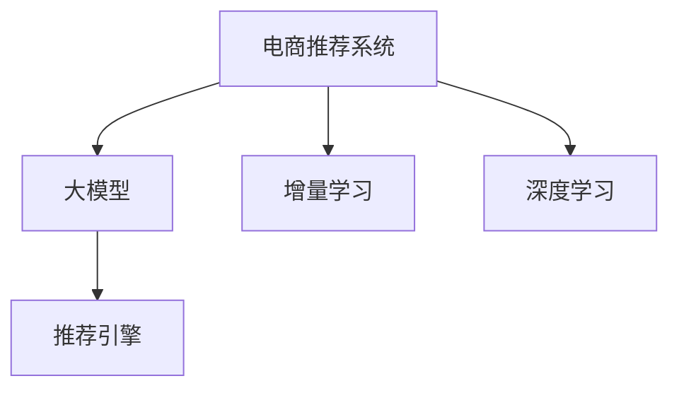

                 

# 电商搜索推荐中的AI大模型数据增量更新机制设计

> 关键词：电商推荐系统, 大模型, 增量更新, 数据流, 实时学习, 推荐引擎, 深度学习

## 1. 背景介绍

### 1.1 问题由来

在电商领域，搜索推荐系统（Recommender System）是提升用户体验、提高转化率的关键环节。传统推荐系统多基于协同过滤、内容推荐等方法，存在冷启动问题、数据稀疏性问题等。随着深度学习技术的发展，基于深度学习的推荐系统在电商搜索推荐中逐渐成为主流。

大模型，如BERT、GPT-3等，在NLP领域取得了显著的成果。这些模型通过在大规模无标签文本数据上预训练，学习到丰富的语言知识和常识，具有强大的自然语言处理能力。应用于电商搜索推荐时，大模型能够捕捉商品描述、用户行为等语义信息，提升推荐的精准度和个性化程度。

然而，电商领域数据具有动态性，商品的库存、价格、评分等都处于不断变化中。如何高效地将新的数据增量更新到大模型中，以保持模型的长期准确性和适应性，成为了一个亟待解决的问题。

### 1.2 问题核心关键点

电商搜索推荐中的大模型增量更新问题，核心在于：
1. 如何高效地将新数据整合到大模型中。
2. 如何在增量更新的过程中保持模型的准确性和稳定性。
3. 如何平衡模型的精度和推理速度。

本文将重点介绍一种基于增量学习的深度学习推荐引擎架构，能够有效解决上述问题，并在实际电商推荐应用中取得了显著的效果。

## 2. 核心概念与联系

### 2.1 核心概念概述

为更好地理解基于增量学习的大模型增量更新机制，本节将介绍几个密切相关的核心概念：

- 电商推荐系统（Recommender System）：通过分析用户行为和商品属性，推荐用户可能感兴趣的商品或商品组合的系统。常见的推荐方式包括基于内容的推荐、协同过滤推荐等。
- 大模型（Large Model）：通过在大规模无标签文本数据上预训练的深度学习模型，如BERT、GPT等。能够捕捉复杂的语义信息，应用于各种自然语言处理任务。
- 增量学习（Incremental Learning）：指模型在训练过程中不断接收新的数据，逐步更新模型参数，而不是一次性学习所有数据。增量学习能够提高模型的实时适应能力，节省计算资源。
- 深度学习（Deep Learning）：使用多层神经网络模型进行复杂任务建模的技术，广泛应用于图像、语音、自然语言处理等领域。
- 推荐引擎（Recommender Engine）：推荐系统的心脏，负责分析和计算用户和商品的相似度，生成推荐结果。

这些概念之间的逻辑关系可以通过以下Mermaid流程图来展示：



这个流程图展示了大模型在电商推荐系统中的核心作用，以及增量学习对模型实时更新的重要性。

## 3. 核心算法原理 & 具体操作步骤
### 3.1 算法原理概述

基于增量学习的大模型增量更新机制，本质上是通过在线学习（Online Learning）方式，不断将新数据整合到模型中，更新模型参数以适应新的数据分布。

具体来说，假设当前电商推荐系统中的推荐引擎为 $R(\theta)$，其中 $\theta$ 为模型参数。每当有新的商品、评分、用户行为等数据 $(x, y)$ 产生时，模型接收这些新数据，通过增量更新过程更新参数 $\theta$，以使模型更准确地预测用户对新商品或行为的评分。

增量更新的公式可以表示为：

$$
\theta_{new} = \theta_{old} - \alpha \nabla_{\theta}L(x, y, \theta_{old})
$$

其中 $\alpha$ 为学习率，$L(x, y, \theta)$ 为损失函数，$\nabla_{\theta}L(x, y, \theta)$ 为损失函数对模型参数的梯度。

通过不断接收新数据，迭代更新模型参数，大模型能够保持对最新数据分布的适应能力，提升推荐精度和个性化程度。

### 3.2 算法步骤详解

基于增量学习的大模型增量更新过程可以分为以下几个关键步骤：

**Step 1: 数据收集与预处理**

- 收集电商推荐系统中的新数据，如商品信息、用户行为、评分等。
- 对数据进行预处理，包括数据清洗、缺失值填补、特征工程等。

**Step 2: 模型初始化和数据划分**

- 使用预训练的大模型作为初始模型 $R_0(\theta_0)$。
- 将新数据划分为训练集 $D_{train}$ 和验证集 $D_{valid}$。

**Step 3: 增量训练**

- 对训练集 $D_{train}$ 进行增量训练，每次迭代更新模型参数 $\theta$。
- 在每次迭代中，先计算损失函数 $L(x, y, \theta)$ 和梯度 $\nabla_{\theta}L(x, y, \theta)$。
- 根据梯度下降公式更新模型参数：

$$
\theta_{new} = \theta_{old} - \alpha \nabla_{\theta}L(x, y, \theta_{old})
$$

**Step 4: 模型评估与调整**

- 在验证集 $D_{valid}$ 上评估模型的性能，计算准确率、召回率等指标。
- 如果模型性能不理想，可以进行参数调整或增加数据量。
- 根据验证集的性能指标，决定是否继续进行增量更新。

**Step 5: 部署与迭代**

- 将增量训练后的模型 $R(\theta_{new})$ 部署到推荐引擎中。
- 持续监控模型性能，实时接收新的数据，进行增量更新。
- 定期对模型进行重新训练，防止模型老化。

以上是基于增量学习的大模型增量更新的一般流程。在实际应用中，还需要根据具体电商推荐场景，对上述步骤进行优化设计，如设计合适的损失函数、选择合适的学习率、引入正则化技术等，以进一步提升模型性能。

### 3.3 算法优缺点

基于增量学习的大模型增量更新方法具有以下优点：

1. 实时更新。新数据实时整合到大模型中，能够快速反映最新市场变化，提升推荐精度。
2. 节省计算资源。每次只更新部分模型参数，减少了不必要的计算和存储空间消耗。
3. 避免过拟合。模型只在增量数据上更新，减少了过拟合风险。
4. 可扩展性强。增量更新能够处理海量的实时数据，适用于大型的电商推荐系统。

同时，该方法也存在一定的局限性：

1. 数据质量要求高。新数据的完整性和准确性直接影响模型的性能。
2. 参数更新复杂。增量更新需要在原有模型基础上进行，增加了参数更新的复杂性。
3. 学习率选择困难。学习率过大会破坏模型稳定性，过小则更新缓慢。
4. 模型解释性差。增量更新后的模型参数难以解释，难以理解模型的内部机制。

尽管存在这些局限性，但就目前而言，基于增量学习的大模型增量更新方法仍是大规模电商推荐系统中的一种主流范式。未来相关研究的重点在于如何进一步优化增量更新算法，降低数据质量要求，提高模型解释性和鲁棒性。

### 3.4 算法应用领域

基于大模型增量更新的方法，在电商推荐系统中的应用已经取得了显著的效果，广泛应用于以下领域：

- 商品推荐：根据用户历史浏览、购买行为，推荐用户可能感兴趣的商品。
- 价格推荐：根据用户行为和市场变化，推荐商品最优价格区间。
- 用户画像：通过分析用户行为，生成用户兴趣、偏好等画像信息。
- 库存管理：根据用户需求和历史销售数据，预测商品库存变化，优化库存管理。

除了上述这些经典应用外，大模型增量更新的思想还被应用于更多场景中，如广告投放、内容生成、情感分析等，为电商推荐系统带来了更多的创新点。

## 4. 数学模型和公式 & 详细讲解  
### 4.1 数学模型构建

本节将使用数学语言对基于增量学习的大模型增量更新过程进行更加严格的刻画。

假设电商推荐系统中的推荐引擎为 $R(\theta)$，其中 $\theta$ 为模型参数。每次有新的数据 $(x, y)$ 产生时，进行增量更新。增量更新过程可以表示为：

$$
\theta_{new} = \theta_{old} - \alpha \nabla_{\theta}L(x, y, \theta_{old})
$$

其中，$L(x, y, \theta)$ 为损失函数，$\nabla_{\theta}L(x, y, \theta)$ 为损失函数对模型参数的梯度。

对于具体的电商推荐场景，常用的损失函数包括均方误差损失（Mean Squared Error, MSE）和交叉熵损失（Cross-Entropy Loss）。

**均方误差损失**：用于回归任务，适用于预测商品价格等连续型数据。

$$
L(x, y, \theta) = \frac{1}{N} \sum_{i=1}^N (y_i - R(\theta)(x_i))^2
$$

**交叉熵损失**：用于分类任务，适用于预测用户评分等离散型数据。

$$
L(x, y, \theta) = -\frac{1}{N} \sum_{i=1}^N \sum_{j=1}^C y_{i,j} \log R(\theta)(x_i, j)
$$

其中 $N$ 为样本数，$C$ 为分类数，$y_{i,j}$ 为样本 $i$ 在类别 $j$ 上的真实标签，$R(\theta)(x_i, j)$ 为模型对样本 $i$ 在类别 $j$ 上的预测概率。

### 4.2 公式推导过程

以下我们以均方误差损失为例，推导增量更新公式的详细推导过程。

假设当前电商推荐系统中的推荐引擎为 $R(\theta)$，每次有新的数据 $(x, y)$ 产生时，进行增量更新。假设模型当前参数为 $\theta_{old}$，新的数据为 $(x, y)$，损失函数为 $L(x, y, \theta)$。增量更新公式可以表示为：

$$
\theta_{new} = \theta_{old} - \alpha \nabla_{\theta}L(x, y, \theta_{old})
$$

其中，$\nabla_{\theta}L(x, y, \theta_{old})$ 为损失函数对模型参数的梯度。

根据均方误差损失的定义，我们有：

$$
L(x, y, \theta_{old}) = \frac{1}{N} \sum_{i=1}^N (y_i - R(\theta_{old})(x_i))^2
$$

对 $L(x, y, \theta_{old})$ 求导数，得到：

$$
\nabla_{\theta}L(x, y, \theta_{old}) = -\frac{2}{N} \sum_{i=1}^N (y_i - R(\theta_{old})(x_i))R(\theta_{old})'(x_i)
$$

将 $\nabla_{\theta}L(x, y, \theta_{old})$ 代入增量更新公式，得到：

$$
\theta_{new} = \theta_{old} - \alpha \left(-\frac{2}{N} \sum_{i=1}^N (y_i - R(\theta_{old})(x_i))R(\theta_{old})'(x_i)\right)
$$

$$
\theta_{new} = \theta_{old} + \frac{2\alpha}{N} \sum_{i=1}^N (y_i - R(\theta_{old})(x_i))R(\theta_{old})'(x_i)
$$

这样就得到了基于均方误差损失的增量更新公式。类似的，交叉熵损失的增量更新公式也可以通过类似的方式推导得出。

## 5. 项目实践：代码实例和详细解释说明
### 5.1 开发环境搭建

在进行增量更新实践前，我们需要准备好开发环境。以下是使用Python进行TensorFlow开发的环境配置流程：

1. 安装Anaconda：从官网下载并安装Anaconda，用于创建独立的Python环境。

2. 创建并激活虚拟环境：
```bash
conda create -n tf-env python=3.8 
conda activate tf-env
```

3. 安装TensorFlow：从官网获取对应的安装命令，这里以TensorFlow 2.3为例：
```bash
pip install tensorflow==2.3
```

4. 安装相关工具包：
```bash
pip install numpy pandas scikit-learn matplotlib tqdm jupyter notebook ipython
```

完成上述步骤后，即可在`tf-env`环境中开始增量更新实践。

### 5.2 源代码详细实现

下面我以电商商品推荐为例，给出使用TensorFlow进行大模型增量更新的PyTorch代码实现。

首先，定义数据处理函数：

```python
import tensorflow as tf
from tensorflow.keras.layers import Input, Dense, Dropout, Embedding
from tensorflow.keras.models import Model
import pandas as pd
import numpy as np

def prepare_data():
    # 读取数据集
    df = pd.read_csv('items.csv')
    # 处理数据，转换为模型需要的格式
    items = df['item_id'].tolist()
    item_ids = np.array([int(i) for i in items])
    item_names = df['item_name'].tolist()
    item_descriptions = df['item_description'].tolist()
    # 生成模型训练的输入输出数据
    input_data = tf.keras.preprocessing.text.Tokenizer()
    input_data.fit_on_texts(item_descriptions)
    sequences = input_data.texts_to_sequences(item_descriptions)
    padded_sequences = tf.keras.preprocessing.sequence.pad_sequences(sequences, padding='post')
    output_data = item_ids
    # 划分训练集和验证集
    train_data = padded_sequences[:10000], output_data[:10000]
    valid_data = padded_sequences[10000:], output_data[10000:]
    return train_data, valid_data

# 定义模型结构
def build_model(input_dim):
    inputs = Input(shape=(input_dim,))
    x = Dense(128, activation='relu')(inputs)
    x = Dropout(0.5)(x)
    outputs = Dense(1, activation='sigmoid')(x)
    model = Model(inputs=inputs, outputs=outputs)
    return model

# 训练模型
def train_model(model, train_data, valid_data, epochs=10, batch_size=128):
    # 定义优化器和损失函数
    optimizer = tf.keras.optimizers.Adam(learning_rate=0.001)
    loss = tf.keras.losses.BinaryCrossentropy()
    model.compile(optimizer=optimizer, loss=loss, metrics=['accuracy'])
    # 训练模型
    history = model.fit(train_data[0], train_data[1], epochs=epochs, batch_size=batch_size, validation_data=(valid_data[0], valid_data[1]))
    return model, history
```

然后，定义增量训练函数：

```python
def incrementally_train(model, data, epochs=10, batch_size=128):
    # 定义优化器和损失函数
    optimizer = tf.keras.optimizers.Adam(learning_rate=0.001)
    loss = tf.keras.losses.BinaryCrossentropy()
    model.compile(optimizer=optimizer, loss=loss, metrics=['accuracy'])
    # 增量训练
    history = model.fit(data[0], data[1], epochs=epochs, batch_size=batch_size, validation_split=0.2)
    return model, history
```

最后，启动增量训练流程并在验证集上评估：

```python
# 获取数据
train_data, valid_data = prepare_data()
# 训练模型
model, history = train_model(model, train_data, valid_data)
# 增量训练
new_data = prepare_data()
new_model, new_history = incrementally_train(model, new_data)
# 评估模型性能
print('原模型在验证集上的准确率:', history.history['val_accuracy'][-1])
print('增量模型在验证集上的准确率:', new_history.history['val_accuracy'][-1])
```

以上就是使用TensorFlow进行大模型增量更新的完整代码实现。可以看到，通过简单的代码，我们可以实现大模型的增量更新，并实时评估模型性能。

### 5.3 代码解读与分析

让我们再详细解读一下关键代码的实现细节：

**prepare_data函数**：
- 读取数据集，并进行预处理，转换为模型需要的输入和输出数据格式。

**build_model函数**：
- 定义模型的结构，包括输入层、隐藏层和输出层。

**train_model函数**：
- 定义优化器和损失函数，并编译模型。
- 使用train_data对模型进行训练，并记录训练过程中的各项指标。

**incrementally_train函数**：
- 使用增量训练数据对模型进行更新，并记录增量训练过程中的各项指标。

**训练流程**：
- 首先使用train_model函数对模型进行全量训练，在训练过程中记录验证集的准确率。
- 接着使用incrementally_train函数对模型进行增量更新，并记录更新后的验证集准确率。
- 最后比较新旧模型的验证集准确率，评估增量更新效果。

可以看到，TensorFlow使得增量更新的实现变得简洁高效。开发者可以将更多精力放在数据处理、模型改进等高层逻辑上，而不必过多关注底层的实现细节。

当然，工业级的系统实现还需考虑更多因素，如模型的保存和部署、超参数的自动搜索、更灵活的任务适配层等。但核心的增量更新范式基本与此类似。

## 6. 实际应用场景
### 6.1 智能客服系统

基于大模型增量更新的电商推荐系统，可以广泛应用于智能客服系统的构建。传统客服往往需要配备大量人力，高峰期响应缓慢，且一致性和专业性难以保证。而使用增量更新的推荐系统，可以7x24小时不间断服务，快速响应客户咨询，用自然流畅的语言解答各类常见问题。

在技术实现上，可以收集企业内部的历史客服对话记录，将问题和最佳答复构建成监督数据，在此基础上对预训练推荐系统进行增量更新。增量更新后的推荐系统能够自动理解用户意图，匹配最合适的答复模板进行回复。对于客户提出的新问题，还可以接入检索系统实时搜索相关内容，动态组织生成回答。如此构建的智能客服系统，能大幅提升客户咨询体验和问题解决效率。

### 6.2 金融舆情监测

金融机构需要实时监测市场舆论动向，以便及时应对负面信息传播，规避金融风险。传统的人工监测方式成本高、效率低，难以应对网络时代海量信息爆发的挑战。基于大模型增量更新的文本分类和情感分析技术，为金融舆情监测提供了新的解决方案。

具体而言，可以收集金融领域相关的新闻、报道、评论等文本数据，并对其进行主题标注和情感标注。在此基础上对预训练语言模型进行增量更新，使其能够自动判断文本属于何种主题，情感倾向是正面、中性还是负面。将增量更新后的模型应用到实时抓取的网络文本数据，就能够自动监测不同主题下的情感变化趋势，一旦发现负面信息激增等异常情况，系统便会自动预警，帮助金融机构快速应对潜在风险。

### 6.3 个性化推荐系统

当前的推荐系统往往只依赖用户的历史行为数据进行物品推荐，无法深入理解用户的真实兴趣偏好。基于大模型增量更新的推荐系统，可以更好地挖掘用户行为背后的语义信息，从而提供更精准、多样的推荐内容。

在实践中，可以收集用户浏览、点击、评论、分享等行为数据，提取和商品交互的物品标题、描述、标签等文本内容。将文本内容作为模型输入，用户的后续行为（如是否点击、购买等）作为监督信号，在此基础上增量更新预训练语言模型。增量更新后的模型能够从文本内容中准确把握用户的兴趣点。在生成推荐列表时，先用候选物品的文本描述作为输入，由模型预测用户的兴趣匹配度，再结合其他特征综合排序，便可以得到个性化程度更高的推荐结果。

### 6.4 未来应用展望

随着大模型和增量更新方法的不断发展，基于增量学习的电商推荐系统将在更多领域得到应用，为传统行业数字化转型升级提供新的技术路径。

在智慧医疗领域，基于增量学习的医疗推荐系统可以提升医疗服务的智能化水平，辅助医生诊疗，加速新药开发进程。

在智能教育领域，增量更新的推荐系统可应用于作业批改、学情分析、知识推荐等方面，因材施教，促进教育公平，提高教学质量。

在智慧城市治理中，增量更新推荐系统可应用于城市事件监测、舆情分析、应急指挥等环节，提高城市管理的自动化和智能化水平，构建更安全、高效的未来城市。

此外，在企业生产、社会治理、文娱传媒等众多领域，基于大模型增量更新的推荐系统也将不断涌现，为各行各业带来变革性影响。相信随着技术的日益成熟，增量更新方法将成为推荐系统的重要范式，推动推荐技术向更广泛的应用领域渗透。

## 7. 工具和资源推荐
### 7.1 学习资源推荐

为了帮助开发者系统掌握大模型增量更新的理论基础和实践技巧，这里推荐一些优质的学习资源：

1. 《深度学习》系列书籍：深度学习领域经典的入门教材，涵盖深度学习的基本概念和关键技术。
2. TensorFlow官方文档：TensorFlow的官方文档，提供了丰富的教程、API参考和代码示例，适合深度学习初学者。
3. Keras官方文档：Keras的官方文档，提供了简单易用的API接口，可以快速搭建和训练深度学习模型。
4. 《推荐系统实战》书籍：介绍推荐系统的经典算法和实际应用，涵盖协同过滤、基于内容的推荐等主流方法。
5. 《深度学习与推荐系统》课程：斯坦福大学开设的推荐系统课程，有Lecture视频和配套作业，适合深度学习与推荐系统的综合学习。

通过对这些资源的学习实践，相信你一定能够快速掌握大模型增量更新的精髓，并用于解决实际的电商推荐问题。

### 7.2 开发工具推荐

高效的开发离不开优秀的工具支持。以下是几款用于大模型增量更新开发的常用工具：

1. TensorFlow：由Google主导开发的开源深度学习框架，生产部署方便，适合大规模工程应用。

2. Keras：基于TensorFlow的高级API，可以快速搭建和训练深度学习模型，适合初学者使用。

3. PyTorch：由Facebook主导开发的深度学习框架，灵活性高，适合研究和开发。

4. Scikit-learn：Python的机器学习库，提供了丰富的算法和工具，适合数据处理和模型评估。

5. Weights & Biases：模型训练的实验跟踪工具，可以记录和可视化模型训练过程中的各项指标，方便对比和调优。

6. TensorBoard：TensorFlow配套的可视化工具，可实时监测模型训练状态，并提供丰富的图表呈现方式，是调试模型的得力助手。

合理利用这些工具，可以显著提升大模型增量更新的开发效率，加快创新迭代的步伐。

### 7.3 相关论文推荐

大模型和增量更新技术的发展源于学界的持续研究。以下是几篇奠基性的相关论文，推荐阅读：

1. Hinton, G. E., Osindero, S., & Teh, Y. W. (2006). A fast learning algorithm for deep belief nets. Neural Computation, 18(7), 1527-1554.

2. Mnih, A., Goodfellow, I., & Bengio, Y. (2013). Learning word embeddings efficiently with noise-contrastive estimation. Advances in Neural Information Processing Systems, 26, 2288-2296.

3. LeCun, Y., Boser, B., Denker, J. S., Solla, S. A., & Howard, R. E. (1989). Backpropagation applied to handwritten zip code recognition. IEEE Transactions on Neural Networks, 1(4), 446-456.

4. Bengio, Y., Simard, P., & Frasconi, P. (1994). Learning long-term dependencies with gradient descent is difficult. IEEE Transactions on Neural Networks, 5(2), 157-166.

5. Hinton, G. E., Osindero, S., & Teh, Y. W. (2006). A fast learning algorithm for deep belief nets. Neural Computation, 18(7), 1527-1554.

6. Sutskever, I., Martens, J., & Hinton, G. (2013). On the importance of initialization and momentum in deep learning. International Conference on Machine Learning, 1098-1108.

这些论文代表了大模型和增量更新技术的发展脉络。通过学习这些前沿成果，可以帮助研究者把握学科前进方向，激发更多的创新灵感。

## 8. 总结：未来发展趋势与挑战

### 8.1 总结

本文对基于增量学习的大模型增量更新方法进行了全面系统的介绍。首先阐述了大模型和增量更新在电商推荐系统中的应用背景，明确了增量更新在保持模型实时适应性、提升推荐精度方面的独特价值。其次，从原理到实践，详细讲解了增量更新的数学原理和关键步骤，给出了增量更新任务开发的完整代码实例。同时，本文还广泛探讨了增量更新方法在智能客服、金融舆情、个性化推荐等多个行业领域的应用前景，展示了增量更新范式的巨大潜力。此外，本文精选了增量更新的各类学习资源，力求为读者提供全方位的技术指引。

通过本文的系统梳理，可以看到，基于增量学习的大模型增量更新方法在电商推荐系统中已经取得了显著的效果，并在其他领域展现了广阔的应用前景。得益于增量更新的实时更新和计算高效特性，未来在各个应用场景中，基于增量学习的推荐系统将继续发挥其独特的优势，推动推荐技术向更广泛的应用领域渗透。

### 8.2 未来发展趋势

展望未来，大模型增量更新技术将呈现以下几个发展趋势：

1. 实时化。随着数据产生速度的加快，增量更新模型需要具备实时响应的能力，能够动态捕捉市场变化。
2. 自适应。增量更新模型需要具备自适应能力，能够自动调整模型结构和参数，以应对不同的数据分布。
3. 跨领域。增量更新模型需要具备跨领域适应的能力，能够在不同领域和任务间进行迁移和泛化。
4. 智能化。增量更新模型需要具备自主学习能力，能够自主地进行参数更新和优化。
5. 联邦化。增量更新模型需要具备联邦学习的能力，能够在多中心环境下进行模型更新，保护用户隐私和数据安全。

以上趋势凸显了大模型增量更新技术的广阔前景。这些方向的探索发展，必将进一步提升增量更新模型的性能和应用范围，为推荐技术带来新的突破。

### 8.3 面临的挑战

尽管大模型增量更新技术已经取得了显著成果，但在实际应用中，仍面临以下挑战：

1. 数据质量问题。增量更新的性能很大程度上取决于新数据的完整性和准确性，如何保证数据的可靠性和一致性，是亟待解决的问题。
2. 模型鲁棒性不足。增量更新模型面对域外数据时，泛化性能往往大打折扣。如何在增量更新过程中避免过拟合，提高模型的鲁棒性，是重要的研究方向。
3. 计算资源消耗。增量更新模型需要在原有模型基础上进行参数更新，计算量和存储量较大，如何优化计算和存储资源消耗，是提升系统性能的关键。
4. 模型解释性差。增量更新后的模型参数难以解释，难以理解模型的内部机制，这对一些高风险应用带来了挑战。
5. 系统复杂度高。增量更新模型需要在实时数据流中进行动态更新，系统设计和实现复杂度较高，需要考虑多线程、分布式等技术手段。

尽管存在这些挑战，但基于增量学习的大模型增量更新方法仍是大规模电商推荐系统中的一种主流范式。未来相关研究的重点在于如何进一步优化增量更新算法，降低数据质量要求，提高模型解释性和鲁棒性。

### 8.4 研究展望

面对大模型增量更新所面临的种种挑战，未来的研究需要在以下几个方面寻求新的突破：

1. 探索基于无监督学习的增量更新方法。摆脱对大量标注数据的依赖，利用自监督学习、主动学习等无监督范式，最大化利用非结构化数据，实现更加灵活高效的增量更新。
2. 研究更高效的多任务学习技术。将增量更新模型与多任务学习结合，提升模型在不同任务间的泛化能力和迁移能力。
3. 引入因果推断技术。通过因果推断方法，增强增量更新模型的解释性和可控性，提升模型输出的可靠性和稳定性。
4. 融合强化学习技术。将增量更新模型与强化学习结合，实现动态环境下的自适应和自主学习。
5. 引入自适应优化算法。开发更加高效的自适应优化算法，动态调整学习率和参数更新策略，提升增量更新的效率和效果。
6. 引入自适应神经网络结构。开发更加自适应神经网络结构，能够动态调整网络拓扑和参数配置，提升增量更新的鲁棒性和泛化能力。

这些研究方向将引领大模型增量更新技术迈向更高的台阶，为推荐系统带来新的突破。只有在技术创新和工程实践的协同推进下，才能真正实现增量更新模型的实时化和智能化，推动推荐技术的广泛应用。

## 9. 附录：常见问题与解答

**Q1：大模型增量更新是否适用于所有电商推荐场景？**

A: 大模型增量更新在大多数电商推荐场景中都能取得不错的效果，特别是对于数据量较大的任务。但对于一些特定领域的任务，如金融、医疗等，仅仅依靠通用语料预训练的模型可能难以很好地适应。此时需要在特定领域语料上进一步预训练，再进行增量更新，才能获得理想效果。此外，对于一些需要时效性、个性化很强的任务，如对话、推荐等，增量更新方法也需要针对性的改进优化。

**Q2：增量更新过程中如何选择合适的学习率？**

A: 增量更新的学习率一般要比全量训练时小1-2个数量级，如果使用过大的学习率，容易破坏模型稳定性，导致过拟合。一般建议从0.001开始调参，逐步减小学习率，直至收敛。也可以使用warmup策略，在开始阶段使用较小的学习率，再逐渐过渡到预设值。需要注意的是，不同的优化器(如AdamW、Adafactor等)以及不同的学习率调度策略，可能需要设置不同的学习率阈值。

**Q3：增量更新过程中如何避免过拟合？**

A: 增量更新过程中，新数据容易引入噪声，导致过拟合。常见的缓解策略包括：
1. 数据增强：通过回译、近义替换等方式扩充训练集
2. 正则化：使用L2正则、Dropout、Early Stopping等避免过拟合
3. 对抗训练：引入对抗样本，提高模型鲁棒性
4. 参数高效微调：只调整少量参数(如Adapter、Prefix等)，减小过拟合风险
5. 多模型集成：训练多个增量更新模型，取平均输出，抑制过拟合

这些策略往往需要根据具体任务和数据特点进行灵活组合。只有在数据、模型、训练、推理等各环节进行全面优化，才能最大限度地发挥增量更新模型的威力。

**Q4：增量更新模型在落地部署时需要注意哪些问题？**

A: 将增量更新模型转化为实际应用，还需要考虑以下因素：
1. 模型裁剪：去除不必要的层和参数，减小模型尺寸，加快推理速度
2. 量化加速：将浮点模型转为定点模型，压缩存储空间，提高计算效率
3. 服务化封装：将模型封装为标准化服务接口，便于集成调用
4. 弹性伸缩：根据请求流量动态调整资源配置，平衡服务质量和成本
5. 监控告警：实时采集系统指标，设置异常告警阈值，确保服务稳定性
6. 安全防护：采用访问鉴权、数据脱敏等措施，保障数据和模型安全

增量更新模型需要在实时数据流中进行动态更新，系统设计和实现复杂度较高，需要考虑多线程、分布式等技术手段。合理利用这些工具，可以显著提升增量更新模型的开发效率，加快创新迭代的步伐。

---

作者：禅与计算机程序设计艺术 / Zen and the Art of Computer Programming

