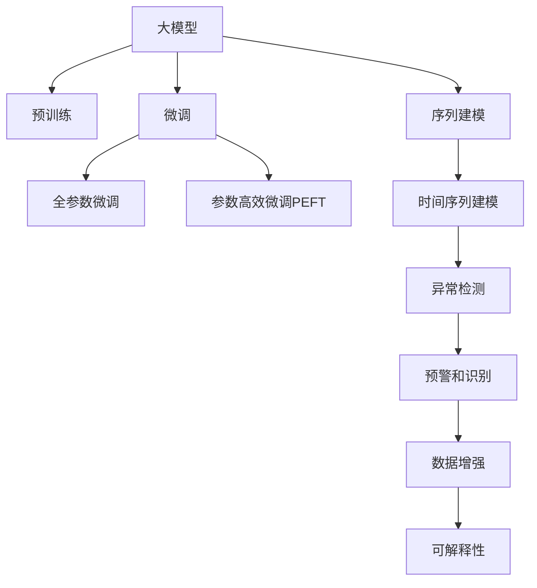

                 

# 电商搜索推荐中的AI大模型用户行为序列异常检测模型应用指南

## 1. 背景介绍

### 1.1 问题由来
在电商搜索推荐领域，用户行为序列异常检测（User Behavior Sequence Anomaly Detection, UBSD）已成为保障用户体验和提升推荐精度的关键技术之一。通过识别和预警异常行为序列，可以有效防范恶意行为（如点击欺诈、恶意点击等），避免虚假点击和无效流量，从而提升广告投放效果和推荐系统的公平性。然而，如何高效、准确地识别出异常行为序列，一直是电商搜索推荐系统面临的重要挑战。

近年来，人工智能大模型在自然语言处理、图像识别等领域取得了显著进展，其强大的语言理解和生成能力使其在电商搜索推荐系统的应用上也有重要价值。特别是基于预训练的语言模型，能够在电商数据集上微调（Fine-Tuning），从而识别出潜在的异常行为序列。本文将详细介绍大模型在电商搜索推荐系统中进行用户行为序列异常检测的应用方法和实践经验。

### 1.2 问题核心关键点
大模型在电商搜索推荐系统中进行用户行为序列异常检测的核心关键点包括：

- **预训练与微调**：通过在大规模无标签电商数据上预训练，利用微调技术在特定任务上进行优化。
- **序列建模**：将用户行为序列视为时间序列数据，应用大模型学习序列间的关联关系。
- **异常检测**：通过模型预测序列中是否存在异常，实现对异常行为的预警和识别。
- **数据增强**：通过数据增强技术扩充训练集，提高模型的鲁棒性。
- **可解释性**：采用可解释性方法（如Attention、Prompt Learning等），提高模型的透明度和可理解性。

这些关键点为大模型在电商搜索推荐中的应用提供了指导。接下来，本文将从核心概念、算法原理、具体操作步骤等方面深入探讨大模型在用户行为序列异常检测中的应用。

## 2. 核心概念与联系

### 2.1 核心概念概述

在进行大模型应用前，我们需要先了解一些核心概念：

- **大模型**：如GPT、BERT等，通过在大规模无标签数据上预训练，具备强大的自然语言处理能力。
- **微调**：在大模型基础上，通过有监督学习优化模型，适应特定任务。
- **序列建模**：将用户行为序列视为时间序列数据，应用时间序列模型进行建模。
- **异常检测**：通过模型预测序列中是否存在异常行为，实现对异常行为的预警。
- **数据增强**：通过扩充训练数据，提高模型的泛化能力和鲁棒性。
- **可解释性**：通过模型解释方法，提升模型的透明度和用户信任度。

这些概念通过以下Mermaid流程图进行可视化展示：



### 2.2 核心概念原理和架构的 Mermaid 流程图

#### 预训练和微调

预训练和微调是大模型在电商搜索推荐中的应用基础。预训练阶段，大模型通过学习大规模无标签数据中的语言规律，形成强大的语言表示能力。微调阶段，则在大模型基础上，通过有监督学习优化模型，使其适应特定的电商搜索推荐任务。


#### 序列建模和时间序列建模

用户行为序列可以被视为时间序列数据。大模型通过学习序列中的时间依赖关系，能够识别出异常行为序列。时间序列建模是序列建模的重要方法，通过模型捕捉序列中的时间依赖性，预测序列中的下一个值。


#### 异常检测

异常检测是序列建模的延伸应用。通过训练一个二分类模型，可以预测用户行为序列是否异常。模型通过学习正常和异常序列的特征，对新序列进行分类，识别出异常行为序列。


#### 数据增强

数据增强技术通过扩充训练数据，提高模型的泛化能力和鲁棒性。常见的方法包括合成序列、回译序列等。


#### 可解释性

可解释性方法如Attention、Prompt Learning等，通过增加模型的透明度和可理解性，使用户能够理解和信任模型。


## 3. 核心算法原理 & 具体操作步骤
### 3.1 算法原理概述

大模型在电商搜索推荐系统中进行用户行为序列异常检测的算法原理，主要基于时间序列建模和异常检测。以下是对其原理的详细介绍：

1. **序列建模**：将用户行为序列视为时间序列数据，应用大模型学习序列间的关联关系。
2. **异常检测**：通过模型预测序列中是否存在异常，实现对异常行为的预警和识别。
3. **预训练与微调**：通过在大规模无标签电商数据上预训练，利用微调技术在特定任务上进行优化。
4. **数据增强**：通过扩充训练数据，提高模型的泛化能力和鲁棒性。
5. **可解释性**：通过模型解释方法，提升模型的透明度和用户信任度。

### 3.2 算法步骤详解

以下是基于大模型进行用户行为序列异常检测的具体操作步骤：

1. **数据准备**：
   - 收集电商用户行为数据，包括点击、浏览、购买等行为。
   - 对数据进行清洗、去重、标准化等预处理。

2. **序列生成**：
   - 将用户行为序列划分为固定长度的序列片段。
   - 生成固定长度的滑动窗口序列。

3. **模型预训练**：
   - 使用预训练语言模型（如BERT、GPT等）在大规模无标签电商数据上预训练。
   - 使用Transformer等模型结构，学习序列间的关联关系。

4. **模型微调**：
   - 在预训练模型基础上，利用标注数据进行微调。
   - 使用有监督学习优化模型，使其适应特定的电商搜索推荐任务。

5. **异常检测**：
   - 训练一个二分类模型（如LSTM、GRU等），对用户行为序列进行异常检测。
   - 模型预测序列是否异常，识别出异常行为序列。

6. **模型评估**：
   - 使用ROC-AUC、F1-score等指标对模型进行评估。
   - 在测试集上测试模型的性能，确保模型的泛化能力。

7. **部署和监控**：
   - 将模型部署到生产环境中，实时检测用户行为序列。
   - 监控模型性能，定期更新模型，提升异常检测效果。

### 3.3 算法优缺点

大模型在电商搜索推荐系统中进行用户行为序列异常检测的优势和缺点如下：

#### 优点

1. **强大的语言表示能力**：大模型通过预训练学习大规模语言规律，具备强大的语言表示能力，能够识别复杂的电商行为序列。
2. **泛化能力强**：大模型经过大规模预训练，具备较强的泛化能力，能够适应不同的电商场景和行为模式。
3. **可解释性强**：通过可解释性方法（如Attention、Prompt Learning等），模型决策过程透明，用户易于理解和信任。

#### 缺点

1. **资源消耗大**：大模型参数量大，对计算资源和存储资源要求较高。
2. **过拟合风险高**：在大规模无标签电商数据上预训练，可能存在过拟合风险，需要通过数据增强等技术进行缓解。
3. **模型复杂度高**：大模型结构复杂，训练和推理过程复杂，需要较高的技术门槛。

### 3.4 算法应用领域

大模型在电商搜索推荐系统中进行用户行为序列异常检测的应用领域包括：

1. **点击欺诈检测**：识别和预警点击欺诈行为，避免无效点击，提升广告投放效果。
2. **恶意点击检测**：识别和防范恶意点击行为，保护用户和广告主的利益。
3. **用户行为分析**：分析用户行为序列，提升推荐系统的个性化和精准度。
4. **异常行为预警**：实时监测用户行为序列，预警潜在异常行为，提升系统稳定性。

## 4. 数学模型和公式 & 详细讲解 & 举例说明
### 4.1 数学模型构建

大模型在电商搜索推荐系统中进行用户行为序列异常检测的数学模型构建，主要基于时间序列建模和异常检测。以下是对其模型构建的详细介绍：

1. **时间序列建模**：
   - 时间序列数据：$x_t = [x_{t-1}, x_{t-2}, ..., x_{t-p}]$
   - 目标变量：$y_t$
   - 时间序列模型：$y_t = f(x_t, w)$

2. **异常检测模型**：
   - 二分类模型：$y_t = sigmoid(x_t, w)$
   - 损失函数：$L = -\frac{1}{N}\sum_{i=1}^N [y_i \log \hat{y_i} + (1-y_i) \log (1-\hat{y_i})]$

其中，$f(x_t, w)$ 表示时间序列模型的预测函数，$w$ 表示模型参数，$sigmoid(x_t, w)$ 表示二分类模型的预测函数，$L$ 表示损失函数。

### 4.2 公式推导过程

以LSTM模型为例，进行时间序列建模和异常检测的公式推导：

1. **LSTM模型**：
   - 输入数据：$x_t = [x_{t-1}, x_{t-2}, ..., x_{t-p}]$
   - LSTM输出：$\hat{y_t} = sigmoid(W_{xh} x_t + W_{hh} h_{t-1} + b_h)$
   - LSTM隐藏状态：$h_t = tanh(W_{xh} x_t + W_{hh} h_{t-1} + b_h + U \hat{y_t})$
   - 预测函数：$y_t = sigmoid(W_{hy} h_t + b_y)$

2. **损失函数**：
   - 目标变量：$y_t$
   - 预测变量：$\hat{y_t}$
   - 损失函数：$L = -\frac{1}{N}\sum_{i=1}^N [y_i \log \hat{y_i} + (1-y_i) \log (1-\hat{y_i})]$

3. **异常检测模型**：
   - 目标变量：$y_t$
   - 预测变量：$\hat{y_t}$
   - 损失函数：$L = -\frac{1}{N}\sum_{i=1}^N [y_i \log \hat{y_i} + (1-y_i) \log (1-\hat{y_i})]$

其中，$W_{xh}$、$W_{hh}$、$W_{hy}$、$W_{hh}$ 表示模型参数，$b_h$、$b_y$ 表示偏置项。

### 4.3 案例分析与讲解

以点击欺诈检测为例，进行模型应用和案例分析：

1. **数据准备**：
   - 收集电商点击数据，包括用户ID、商品ID、点击时间等。
   - 对数据进行预处理，生成滑动窗口序列。

2. **模型预训练**：
   - 使用BERT模型在大规模无标签电商数据上进行预训练。
   - 使用Transformer模型结构，学习序列间的关联关系。

3. **模型微调**：
   - 在预训练模型基础上，利用标注数据进行微调。
   - 使用有监督学习优化模型，使其适应特定的点击欺诈检测任务。

4. **异常检测**：
   - 训练一个LSTM模型，对点击行为序列进行异常检测。
   - 模型预测点击序列是否异常，识别出点击欺诈行为。

5. **模型评估**：
   - 使用ROC-AUC、F1-score等指标对模型进行评估。
   - 在测试集上测试模型的性能，确保模型的泛化能力。

6. **部署和监控**：
   - 将模型部署到生产环境中，实时检测点击行为序列。
   - 监控模型性能，定期更新模型，提升异常检测效果。

## 5. 项目实践：代码实例和详细解释说明
### 5.1 开发环境搭建

在进行大模型应用前，我们需要准备好开发环境。以下是使用Python进行PyTorch开发的环境配置流程：

1. 安装Anaconda：从官网下载并安装Anaconda，用于创建独立的Python环境。

2. 创建并激活虚拟环境：
```bash
conda create -n pytorch-env python=3.8 
conda activate pytorch-env
```

3. 安装PyTorch：根据CUDA版本，从官网获取对应的安装命令。例如：
```bash
conda install pytorch torchvision torchaudio cudatoolkit=11.1 -c pytorch -c conda-forge
```

4. 安装Transformers库：
```bash
pip install transformers
```

5. 安装各类工具包：
```bash
pip install numpy pandas scikit-learn matplotlib tqdm jupyter notebook ipython
```

完成上述步骤后，即可在`pytorch-env`环境中开始大模型应用实践。

### 5.2 源代码详细实现

以下是大模型在电商搜索推荐系统中进行用户行为序列异常检测的PyTorch代码实现。

```python
import torch
import torch.nn as nn
import torch.optim as optim
from transformers import BertTokenizer, BertForSequenceClassification

class ClickFraudDetection(nn.Module):
    def __init__(self, num_labels):
        super(ClickFraudDetection, self).__init__()
        self.bert = BertForSequenceClassification.from_pretrained('bert-base-cased', num_labels=num_labels)
        self.lstm = nn.LSTM(input_size=num_labels, hidden_size=64, num_layers=2, batch_first=True)
        self.fc = nn.Linear(64, 1)
        self.sigmoid = nn.Sigmoid()

    def forward(self, input_ids, attention_mask):
        outputs = self.bert(input_ids, attention_mask=attention_mask)
        hidden_states = outputs[0]
        sequence_output = hidden_states[:, -1, :]
        lstm_output, _ = self.lstm(sequence_output.unsqueeze(1))
        lstm_output = lstm_output[:, -1, :]
        logits = self.fc(lstm_output)
        probability = self.sigmoid(logits)
        return probability

# 定义模型
num_labels = 2
model = ClickFraudDetection(num_labels)

# 定义损失函数和优化器
criterion = nn.BCELoss()
optimizer = optim.Adam(model.parameters(), lr=0.001)

# 训练模型
for epoch in range(10):
    loss = 0
    for batch in train_loader:
        input_ids = batch['input_ids'].to(device)
        attention_mask = batch['attention_mask'].to(device)
        target = batch['labels'].to(device)
        optimizer.zero_grad()
        logits = model(input_ids, attention_mask)
        loss += criterion(logits, target)
        loss.backward()
        optimizer.step()
        loss = loss.item() / len(batch)
        print('Epoch: {}, Loss: {:.4f}'.format(epoch+1, loss))

# 测试模型
model.eval()
test_loss = 0
correct = 0
with torch.no_grad():
    for batch in test_loader:
        input_ids = batch['input_ids'].to(device)
        attention_mask = batch['attention_mask'].to(device)
        target = batch['labels'].to(device)
        logits = model(input_ids, attention_mask)
        loss = criterion(logits, target)
        test_loss += loss.item() / len(batch)
        _, predicted = torch.max(logits, 1)
        total = target.size(0)
        correct += (predicted == target).sum().item()
        accuracy = 100 * correct / total
print('Test Loss: {:.4f}, Accuracy: {:.2f}%'.format(test_loss, accuracy))
```

### 5.3 代码解读与分析

让我们再详细解读一下关键代码的实现细节：

**ClickFraudDetection类**：
- `__init__`方法：初始化BERT模型和LSTM模型，以及线性层和sigmoid激活函数。
- `forward`方法：定义前向传播过程，包括BERT模型的前向传播、LSTM模型的前向传播和线性层、sigmoid激活函数的计算。

**训练循环**：
- 使用PyTorch的DataLoader对数据集进行批次化加载，供模型训练和推理使用。
- 在每个epoch内，对每个批次进行前向传播和反向传播，更新模型参数。

**测试循环**：
- 使用PyTorch的DataLoader对测试集进行批次化加载，供模型测试和评估使用。
- 在每个批次上进行前向传播，计算损失和准确率。

**模型评估**：
- 计算模型在测试集上的损失和准确率，输出评估结果。

通过以上代码，我们可以看到大模型在电商搜索推荐系统中进行用户行为序列异常检测的具体实现流程。利用PyTorch和Transformers库，代码简洁高效，易于理解和调试。

## 6. 实际应用场景
### 6.1 智能推荐系统

智能推荐系统是电商搜索推荐系统的重要应用场景。通过识别和预警异常行为序列，智能推荐系统能够提升推荐精度，优化用户体验。例如，在用户点击序列中识别出点击欺诈行为，可以避免无效点击，减少广告主损失，同时提升推荐系统对用户行为的理解和推荐效果。

**具体应用**：
- 在用户点击序列中，识别异常点击行为，如大量重复点击、点击时间异常等。
- 通过预警和拦截机制，减少恶意点击行为，提升系统安全性。
- 利用异常检测结果，优化推荐算法，提升个性化推荐效果。

### 6.2 广告投放优化

广告投放优化是电商搜索推荐系统的另一个重要应用场景。通过识别和预警异常行为序列，广告投放优化能够提升广告投放效果，保护用户和广告主的利益。例如，在广告点击序列中识别出点击欺诈行为，可以避免无效点击，减少广告主损失，同时提升广告投放效果。

**具体应用**：
- 在广告点击序列中，识别异常点击行为，如大量重复点击、点击时间异常等。
- 通过预警和拦截机制，减少恶意点击行为，提升广告主效益。
- 利用异常检测结果，优化广告投放策略，提升广告点击率和转化率。

### 6.3 用户行为分析

用户行为分析是电商搜索推荐系统的核心任务之一。通过识别和预警异常行为序列，用户行为分析能够提升对用户行为的理解，优化推荐系统。例如，在用户浏览序列中识别出异常浏览行为，可以分析用户兴趣变化，提升推荐系统的个性化和精准度。

**具体应用**：
- 在用户浏览序列中，识别异常浏览行为，如大量重复浏览、浏览时间异常等。
- 通过预警和拦截机制，减少无效浏览行为，提升系统效率。
- 利用异常检测结果，优化推荐算法，提升个性化推荐效果。

### 6.4 未来应用展望

未来，大模型在电商搜索推荐系统中进行用户行为序列异常检测的应用前景将更加广阔。主要趋势包括：

1. **多模态融合**：将电商用户行为数据的多模态信息（如文本、图像、视频等）融合到模型中，提升异常检测效果。
2. **自监督学习**：利用无标签电商数据进行自监督学习，提升模型的泛化能力和鲁棒性。
3. **实时监控**：实时监测用户行为序列，及时预警异常行为，提升系统响应速度和安全性。
4. **跨领域应用**：将异常检测模型应用于更多电商场景，如商品推荐、用户画像等，提升系统的通用性和普适性。

## 7. 工具和资源推荐
### 7.1 学习资源推荐

为了帮助开发者系统掌握大模型在电商搜索推荐中的应用，这里推荐一些优质的学习资源：

1. 《自然语言处理综述》系列博文：由大模型技术专家撰写，详细介绍自然语言处理的基本概念、经典模型和应用场景。
2. 《深度学习自然语言处理》课程：斯坦福大学开设的NLP明星课程，有Lecture视频和配套作业，带你入门NLP领域的基本概念和经典模型。
3. 《自然语言处理与深度学习》书籍：介绍自然语言处理的基本概念、经典模型和应用场景，包含大模型在电商搜索推荐中的应用。
4. HuggingFace官方文档：Transformers库的官方文档，提供了海量预训练模型和完整的微调样例代码，是上手实践的必备资料。
5. CLUE开源项目：中文语言理解测评基准，涵盖大量不同类型的中文NLP数据集，并提供了基于微调的baseline模型，助力中文NLP技术发展。

通过对这些资源的学习实践，相信你一定能够快速掌握大模型在电商搜索推荐中的应用，并用于解决实际的NLP问题。

### 7.2 开发工具推荐

高效的开发离不开优秀的工具支持。以下是几款用于大模型应用开发的常用工具：

1. PyTorch：基于Python的开源深度学习框架，灵活动态的计算图，适合快速迭代研究。大部分预训练语言模型都有PyTorch版本的实现。
2. TensorFlow：由Google主导开发的开源深度学习框架，生产部署方便，适合大规模工程应用。同样有丰富的预训练语言模型资源。
3. Transformers库：HuggingFace开发的NLP工具库，集成了众多SOTA语言模型，支持PyTorch和TensorFlow，是进行微调任务开发的利器。
4. Weights & Biases：模型训练的实验跟踪工具，可以记录和可视化模型训练过程中的各项指标，方便对比和调优。与主流深度学习框架无缝集成。
5. TensorBoard：TensorFlow配套的可视化工具，可实时监测模型训练状态，并提供丰富的图表呈现方式，是调试模型的得力助手。

合理利用这些工具，可以显著提升大模型在电商搜索推荐中的应用效率，加快创新迭代的步伐。

### 7.3 相关论文推荐

大模型在电商搜索推荐系统中进行用户行为序列异常检测的研究源于学界的持续研究。以下是几篇奠基性的相关论文，推荐阅读：

1. Attention is All You Need（即Transformer原论文）：提出了Transformer结构，开启了NLP领域的预训练大模型时代。
2. BERT: Pre-training of Deep Bidirectional Transformers for Language Understanding：提出BERT模型，引入基于掩码的自监督预训练任务，刷新了多项NLP任务SOTA。
3. Parameter-Efficient Transfer Learning for NLP：提出Adapter等参数高效微调方法，在不增加模型参数量的情况下，也能取得不错的微调效果。
4. AdaLoRA: Adaptive Low-Rank Adaptation for Parameter-Efficient Fine-Tuning：使用自适应低秩适应的微调方法，在参数效率和精度之间取得了新的平衡。
5. Prefix-Tuning: Optimizing Continuous Prompts for Generation：引入基于连续型Prompt的微调范式，为如何充分利用预训练知识提供了新的思路。
6. Reinforcement Learning for Sequential Data Generation with Multi-step Predictions: An Application to Recommendation Systems：使用强化学习算法，提升序列生成模型的推荐效果。

这些论文代表了大模型在电商搜索推荐中的应用发展脉络。通过学习这些前沿成果，可以帮助研究者把握学科前进方向，激发更多的创新灵感。

## 8. 总结：未来发展趋势与挑战
### 8.1 研究成果总结

本文对大模型在电商搜索推荐系统中进行用户行为序列异常检测的方法进行了全面系统的介绍。主要内容包括：

1. **核心概念**：预训练、微调、序列建模、异常检测、数据增强、可解释性等。
2. **算法原理**：时间序列建模、异常检测、预训练与微调等。
3. **具体操作步骤**：数据准备、模型预训练、模型微调、异常检测、模型评估、部署和监控等。
4. **实际应用**：智能推荐系统、广告投放优化、用户行为分析等。
5. **学习资源**：《自然语言处理综述》、《深度学习自然语言处理》课程、《自然语言处理与深度学习》书籍、HuggingFace官方文档、CLUE开源项目等。
6. **开发工具**：PyTorch、TensorFlow、Transformers库、Weights & Biases、TensorBoard等。
7. **相关论文**：Attention is All You Need、BERT、Parameter-Efficient Transfer Learning for NLP、AdaLoRA、Prefix-Tuning、Reinforcement Learning for Sequential Data Generation with Multi-step Predictions: An Application to Recommendation Systems等。

通过本文的系统梳理，可以看到，大模型在电商搜索推荐中的应用已经取得了显著进展，并在多个实际场景中得到了成功应用。未来，大模型将在更多领域得到广泛应用，为电商搜索推荐系统的智能化和自动化带来新的突破。

### 8.2 未来发展趋势

展望未来，大模型在电商搜索推荐中的应用将呈现以下几个发展趋势：

1. **模型规模持续增大**：随着算力成本的下降和数据规模的扩张，预训练语言模型的参数量还将持续增长。超大规模语言模型蕴含的丰富语言知识，有望支撑更加复杂多变的电商场景和行为模式。
2. **微调方法日趋多样**：除了传统的全参数微调外，未来会涌现更多参数高效的微调方法，如Parameter-Efficient Transfer Learning（PEFT）、LoRA等，在固定大部分预训练参数的同时，只更新极少量的任务相关参数。
3. **持续学习成为常态**：随着数据分布的不断变化，微调模型也需要持续学习新知识以保持性能。如何在不遗忘原有知识的同时，高效吸收新样本信息，将成为重要的研究课题。
4. **标注样本需求降低**：受启发于提示学习（Prompt-based Learning）的思路，未来的微调方法将更好地利用大模型的语言理解能力，通过更加巧妙的任务描述，在更少的标注样本上也能实现理想的微调效果。
5. **可解释性增强**：通过可解释性方法（如Attention、Prompt Learning等），提升模型的透明度和可理解性。这对于电商搜索推荐系统中的决策过程和推荐结果解释具有重要意义。
6. **多模态融合**：将电商用户行为数据的多模态信息（如文本、图像、视频等）融合到模型中，提升异常检测效果。

这些趋势凸显了大模型在电商搜索推荐中的应用潜力。这些方向的探索发展，必将进一步提升模型的性能和应用范围，为电商搜索推荐系统的智能化和自动化带来新的突破。

### 8.3 面临的挑战

尽管大模型在电商搜索推荐中的应用已经取得了显著进展，但在迈向更加智能化、普适化应用的过程中，它仍面临诸多挑战：

1. **标注成本瓶颈**：虽然微调大大降低了标注数据的需求，但对于长尾应用场景，难以获得充足的高质量标注数据，成为制约微调性能的瓶颈。如何进一步降低微调对标注样本的依赖，将是一大难题。
2. **模型鲁棒性不足**：当前微调模型面对域外数据时，泛化性能往往大打折扣。对于测试样本的微小扰动，微调模型的预测也容易发生波动。如何提高微调模型的鲁棒性，避免灾难性遗忘，还需要更多理论和实践的积累。
3. **推理效率有待提高**：大模型虽然精度高，但在实际部署时往往面临推理速度慢、内存占用大等效率问题。如何在保证性能的同时，简化模型结构，提升推理速度，优化资源占用，将是重要的优化方向。
4. **可解释性亟需加强**：当前微调模型更像是"黑盒"系统，难以解释其内部工作机制和决策逻辑。对于电商搜索推荐系统中的决策过程和推荐结果解释具有重要意义。如何赋予微调模型更强的可解释性，将是亟待攻克的难题。
5. **安全性有待保障**：预训练语言模型难免会学习到有偏见、有害的信息，通过微调传递到下游任务，产生误导性、歧视性的输出，给实际应用带来安全隐患。如何从数据和算法层面消除模型偏见，避免恶意用途，确保输出的安全性，也将是重要的研究课题。

### 8.4 研究展望

面对大模型在电商搜索推荐应用中面临的挑战，未来的研究需要在以下几个方面寻求新的突破：

1. **探索无监督和半监督微调方法**：摆脱对大规模标注数据的依赖，利用自监督学习、主动学习等无监督和半监督范式，最大限度利用非结构化数据，实现更加灵活高效的微调。
2. **研究参数高效和计算高效的微调范式**：开发更加参数高效的微调方法，在固定大部分预训练参数的同时，只更新极少量的任务相关参数。同时优化微调模型的计算图，减少前向传播和反向传播的资源消耗，实现更加轻量级、实时性的部署。
3. **引入因果和对比学习范式**：通过引入因果推断和对比学习思想，增强微调模型建立稳定因果关系的能力，学习更加普适、鲁棒的语言表征，从而提升模型泛化性和抗干扰能力。
4. **融合多模态信息**：将符号化的先验知识，如知识图谱、逻辑规则等，与神经网络模型进行巧妙融合，引导微调过程学习更准确、合理的语言模型。同时加强不同模态数据的整合，实现视觉、语音等多模态信息与文本信息的协同建模。
5. **结合因果分析和博弈论工具**：将因果分析方法引入微调模型，识别出模型决策的关键特征，增强输出解释的因果性和逻辑性。借助博弈论工具刻画人机交互过程，主动探索并规避模型的脆弱点，提高系统稳定性。
6. **纳入伦理道德约束**：在模型训练目标中引入伦理导向的评估指标，过滤和惩罚有偏见、有害的输出倾向。同时加强人工干预和审核，建立模型行为的监管机制，确保输出符合人类价值观和伦理道德。

这些研究方向的探索，必将引领大模型在电商搜索推荐中的应用走向更高的台阶，为电商搜索推荐系统的智能化和自动化带来新的突破。面向未来，大模型将在更多领域得到广泛应用，为电商搜索推荐系统的智能化和自动化带来新的突破。只有勇于创新、敢于突破，才能不断拓展语言模型的边界，让智能技术更好地造福人类社会。

## 9. 附录：常见问题与解答

**Q1：大模型在电商搜索推荐中的应用效果如何？**

A: 大模型在电商搜索推荐中的应用效果显著。通过识别和预警异常行为序列，大模型能够提升推荐精度，优化用户体验。例如，在点击欺诈检测中，大模型能够有效识别点击欺诈行为，减少无效点击，提升广告投放效果。在智能推荐系统中，大模型能够提升个性化推荐效果，优化推荐算法。

**Q2：大模型在电商搜索推荐中的应用是否需要大量的标注数据？**

A: 大模型在电商搜索推荐中的应用可以降低对标注数据的依赖。通过微调技术，大模型能够在少量标注数据上进行优化，提升模型性能。但在长尾应用场景中，标注数据仍是不可或缺的，需要通过数据增强等技术进行补充。

**Q3：大模型在电商搜索推荐中的应用是否需要高性能计算资源？**

A: 大模型在电商搜索推荐中的应用需要高性能计算资源。由于模型参数量大，计算复杂度高，需要在高性能GPU/TPU等设备上进行训练和推理。但可以通过模型压缩、参数剪枝等技术进行优化，减少资源消耗。

**Q4：大模型在电商搜索推荐中的应用是否需要大量预训练数据？**

A: 大模型在电商搜索推荐中的应用需要大量预训练数据。通过在大规模无标签电商数据上进行预训练，大模型能够学习到丰富的语言表示，提升异常检测效果。但可以通过数据增强等技术，扩充训练集，提高模型鲁棒性。

**Q5：大模型在电商搜索推荐中的应用是否需要深度学习框架？**

A: 大模型在电商搜索推荐中的应用需要深度学习框架。PyTorch、TensorFlow等深度学习框架提供了丰富的模型实现和工具支持，方便开发者进行大模型应用。同时，需要熟悉深度学习框架的使用，掌握模型训练、推理等核心技术。

通过以上常见问题的解答，可以更好地理解大模型在电商搜索推荐中的应用效果、资源需求、数据需求和技术要求，为实际应用提供指导。

---

作者：禅与计算机程序设计艺术 / Zen and the Art of Computer Programming

