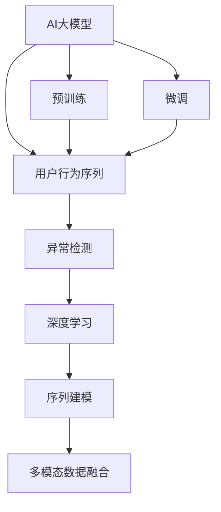

                 

# 电商搜索推荐中的AI大模型用户行为序列异常检测模型应用指南

## 1. 背景介绍

### 1.1 问题由来

电商搜索推荐系统在提升用户体验、提高转化率等方面发挥了至关重要的作用。然而，该系统同时也面临着许多挑战，如个性化推荐的准确度、用户需求的及时响应等。随着人工智能和大数据技术的发展，使用AI大模型进行用户行为分析和推荐已成为趋势。其中，异常行为检测是大模型应用中的重要一环，能够帮助电商平台及时发现潜在风险，提升推荐系统的鲁棒性。

### 1.2 问题核心关键点

异常行为检测的核心在于识别用户行为序列中的异常模式。这些异常可能包括异常浏览行为、恶意操作、欺诈行为等。常见的方法包括统计分析、规则引擎、机器学习等。其中，使用大模型进行异常检测，可以更灵活地处理复杂的用户行为，提升检测的准确性和鲁棒性。

本研究聚焦于使用大模型进行电商搜索推荐系统中的用户行为序列异常检测，通过分析用户搜索、浏览、点击等行为数据，预测潜在的异常行为，为电商平台提供风险预警和应对策略。

### 1.3 问题研究意义

电商搜索推荐系统中的异常行为检测具有以下重要意义：

- 增强系统安全性。及时发现和应对恶意操作和欺诈行为，保护用户和平台的安全。
- 提升推荐质量。通过识别异常行为，提升个性化推荐系统的精准度和可信度。
- 提高用户体验。及时处理异常行为，避免推荐系统干扰用户正常购物行为，提升用户满意度。
- 辅助运营决策。异常行为检测结果可用于分析用户行为变化，指导运营策略调整，优化电商平台的用户增长、留存和转化。

## 2. 核心概念与联系

### 2.1 核心概念概述

为更好地理解使用大模型进行电商搜索推荐系统中的用户行为序列异常检测，本节将介绍几个关键概念：

- **AI大模型**：如BERT、GPT等预训练语言模型，通过在大规模无标签数据上预训练，具备强大的语言理解能力。
- **用户行为序列**：用户浏览、搜索、点击等行为构成的序列数据。
- **异常检测**：识别用户行为序列中的异常模式，如异常浏览路径、频繁点击等。
- **深度学习**：基于神经网络的机器学习方法，能够自动学习复杂的数据分布。
- **序列建模**：使用递归神经网络、Transformer等模型，处理和预测序列数据。
- **多模态数据融合**：将文本、图像、行为数据等不同模态的数据进行融合，提升模型的预测能力。

这些概念之间的逻辑关系可以通过以下Mermaid流程图来展示：



这个流程图展示了大模型在用户行为序列异常检测中的应用框架：

1. 大模型通过预训练获得通用语言表示，用于理解用户行为。
2. 预训练模型在电商搜索推荐系统中的行为序列上微调，学习特定任务的知识。
3. 利用深度学习进行异常检测，识别行为序列中的异常模式。
4. 使用序列建模和融合技术，提升异常检测的精度和鲁棒性。

## 3. 核心算法原理 & 具体操作步骤
### 3.1 算法原理概述

使用AI大模型进行用户行为序列异常检测的算法原理基于深度学习和序列建模。其核心思想是：将用户行为序列看作一种语言数据，利用预训练语言模型提取行为特征，并通过深度学习模型进行分类或回归，判断序列是否异常。

### 3.2 算法步骤详解

基于深度学习的大模型用户行为序列异常检测，主要包括以下几个关键步骤：

**Step 1: 数据预处理**

- 收集电商搜索推荐系统中的用户行为数据，包括搜索关键词、浏览页面、点击商品等。
- 对行为数据进行预处理，如去除重复数据、归一化、特征工程等。
- 将行为序列转化为模型的输入形式，如token化、转换为固定长度的序列等。

**Step 2: 大模型预训练与微调**

- 使用大规模无标签数据对预训练语言模型进行预训练，如使用BERT对行为序列进行预训练。
- 在电商搜索推荐系统中的行为序列数据上进行微调，学习特定任务的知识。
- 选择合适的微调目标，如分类任务、回归任务等，定义损失函数。

**Step 3: 异常检测模型训练**

- 将预训练大模型的输出作为特征输入，使用深度学习模型进行训练。
- 常用的深度学习模型包括递归神经网络(RNN)、长短期记忆网络(LSTM)、Transformer等。
- 在训练过程中，使用正则化技术如Dropout、Early Stopping等，防止过拟合。
- 使用交叉验证等方法，评估模型的性能。

**Step 4: 模型应用与优化**

- 将训练好的模型应用于电商搜索推荐系统，实时监测用户行为序列。
- 根据异常检测结果，及时采取相应的应对策略，如警告、阻止等。
- 定期更新模型，考虑新数据和新用户行为的变化，保持模型的高效和准确性。

### 3.3 算法优缺点

使用大模型进行电商搜索推荐系统中的用户行为序列异常检测具有以下优点：

1. **灵活性高**：大模型可以灵活地处理复杂的用户行为数据，提升异常检测的准确性和鲁棒性。
2. **泛化能力强**：预训练模型在大规模数据上学习到的语言表示，可以很好地泛化到特定领域和任务。
3. **可解释性强**：利用深度学习模型的可解释性，能够详细分析异常行为的原因和影响。

同时，该方法也存在一些缺点：

1. **数据需求大**：大模型需要大量的无标签数据进行预训练，可能存在数据隐私和存储问题。
2. **计算资源消耗大**：大模型训练和推理对计算资源的需求较高，需高性能设备支持。
3. **可解释性差**：深度学习模型的内部机制较为复杂，难以解释其决策过程。
4. **过拟合风险**：在使用小规模数据进行微调时，可能存在过拟合风险。

尽管存在这些局限性，但就目前而言，使用大模型进行用户行为序列异常检测的方法，在电商搜索推荐系统中具有重要意义，可以显著提升系统的安全性和稳定性。

### 3.4 算法应用领域

大模型用户行为序列异常检测不仅在电商领域有广泛应用，还在金融、医疗、社交网络等多个领域得到广泛应用。例如：

- **金融领域**：使用大模型进行交易异常检测，识别潜在的欺诈行为，保护用户资产安全。
- **医疗领域**：使用大模型进行病患行为分析，识别异常诊断路径，辅助医生决策。
- **社交网络**：使用大模型进行用户行为异常检测，识别恶意操作，维护平台秩序。

## 4. 数学模型和公式 & 详细讲解  
### 4.1 数学模型构建

本节将使用数学语言对大模型在电商搜索推荐系统中的用户行为序列异常检测过程进行更加严格的刻画。

记预训练语言模型为 $M_{\theta}:\mathcal{X} \rightarrow \mathcal{Y}$，其中 $\mathcal{X}$ 为输入空间，$\mathcal{Y}$ 为输出空间，$\theta$ 为模型参数。假设电商搜索推荐系统中的行为序列数据集为 $D=\{(x_i,y_i)\}_{i=1}^N, x_i \in \mathcal{X}, y_i \in \mathcal{Y}$，其中 $x_i$ 为用户行为序列，$y_i$ 为异常标签。

定义模型 $M_{\theta}$ 在行为序列 $x$ 上的输出为 $\hat{y}=M_{\theta}(x)$，其中 $\hat{y}$ 为模型预测的异常标签。

异常检测的目标是最小化损失函数 $\mathcal{L}(\theta)$，使模型能够准确预测用户行为序列是否异常：

$$
\mathcal{L}(\theta) = \frac{1}{N} \sum_{i=1}^N \ell(M_{\theta}(x_i),y_i)
$$

其中 $\ell$ 为损失函数，通常为交叉熵损失。

### 4.2 公式推导过程

以下我们以二分类任务为例，推导交叉熵损失函数及其梯度的计算公式。

假设模型 $M_{\theta}$ 在输入 $x$ 上的输出为 $\hat{y}=M_{\theta}(x) \in [0,1]$，表示样本属于正类的概率。真实标签 $y \in \{0,1\}$。则二分类交叉熵损失函数定义为：

$$
\ell(M_{\theta}(x),y) = -[y\log \hat{y} + (1-y)\log (1-\hat{y})]
$$

将其代入经验风险公式，得：

$$
\mathcal{L}(\theta) = -\frac{1}{N}\sum_{i=1}^N [y_i\log M_{\theta}(x_i)+(1-y_i)\log(1-M_{\theta}(x_i))]
$$

根据链式法则，损失函数对参数 $\theta_k$ 的梯度为：

$$
\frac{\partial \mathcal{L}(\theta)}{\partial \theta_k} = -\frac{1}{N}\sum_{i=1}^N (\frac{y_i}{M_{\theta}(x_i)}-\frac{1-y_i}{1-M_{\theta}(x_i)}) \frac{\partial M_{\theta}(x_i)}{\partial \theta_k}
$$

其中 $\frac{\partial M_{\theta}(x_i)}{\partial \theta_k}$ 可进一步递归展开，利用自动微分技术完成计算。

在得到损失函数的梯度后，即可带入参数更新公式，完成模型的迭代优化。重复上述过程直至收敛，最终得到适应电商搜索推荐系统异常检测任务的最优模型参数 $\theta^*$。

## 5. 项目实践：代码实例和详细解释说明
### 5.1 开发环境搭建

在进行用户行为序列异常检测的实践前，我们需要准备好开发环境。以下是使用Python进行TensorFlow开发的环境配置流程：

1. 安装Anaconda：从官网下载并安装Anaconda，用于创建独立的Python环境。

2. 创建并激活虚拟环境：
```bash
conda create -n tf-env python=3.8 
conda activate tf-env
```

3. 安装TensorFlow：根据CUDA版本，从官网获取对应的安装命令。例如：
```bash
conda install tensorflow tensorflow-cpu
```

4. 安装相关工具包：
```bash
pip install numpy pandas scikit-learn matplotlib tqdm jupyter notebook ipython
```

完成上述步骤后，即可在`tf-env`环境中开始用户行为序列异常检测的实践。

### 5.2 源代码详细实现

这里我们以电商搜索推荐系统中的异常检测为例，给出使用TensorFlow进行模型训练的PyTorch代码实现。

首先，定义异常检测任务的数据处理函数：

```python
from tensorflow.keras.preprocessing.sequence import pad_sequences
from sklearn.model_selection import train_test_split

def preprocess_data(data, max_seq_length):
    # 将行为序列转换为固定长度，并进行token化
    X, y = [], []
    for user_seq, label in data:
        tokenized_seq = tokenizer.tokenize(user_seq)
        tokenized_seq = [token2id[token] for token in tokenized_seq]
        X.append(tokenized_seq[:max_seq_length])
        y.append(label)
    X = pad_sequences(X, maxlen=max_seq_length, padding='post')
    return X, y
```

然后，定义模型和优化器：

```python
from tensorflow.keras.models import Sequential
from tensorflow.keras.layers import Embedding, LSTM, Dense

model = Sequential([
    Embedding(vocab_size, embedding_dim, input_length=max_seq_length),
    LSTM(64, return_sequences=True),
    LSTM(64),
    Dense(1, activation='sigmoid')
])

optimizer = tf.keras.optimizers.Adam(learning_rate=0.001)
```

接着，定义训练和评估函数：

```python
from tensorflow.keras.utils import to_categorical
from sklearn.metrics import accuracy_score

def train_model(model, train_data, train_labels, val_data, val_labels, epochs=10, batch_size=64):
    model.compile(optimizer=optimizer, loss='binary_crossentropy', metrics=['accuracy'])
    model.fit(train_data, train_labels, epochs=epochs, batch_size=batch_size, validation_data=(val_data, val_labels))
    return model

def evaluate_model(model, test_data, test_labels):
    y_pred = model.predict(test_data)
    y_pred = [1 if y > 0.5 else 0 for y in y_pred]
    accuracy = accuracy_score(test_labels, y_pred)
    print(f"Accuracy: {accuracy:.2f}")
```

最后，启动训练流程并在测试集上评估：

```python
X_train, y_train, X_test, y_test = train_test_split(X, y, test_size=0.2)
X_train = to_categorical(X_train, num_classes=2)
X_test = to_categorical(X_test, num_classes=2)

model = train_model(model, X_train, y_train, X_test, y_test)
evaluate_model(model, X_test, y_test)
```

以上就是使用TensorFlow进行电商搜索推荐系统中的异常检测的完整代码实现。可以看到，得益于TensorFlow的强大封装，我们可以用相对简洁的代码完成模型的加载和训练。

### 5.3 代码解读与分析

让我们再详细解读一下关键代码的实现细节：

**preprocess_data函数**：
- 将用户行为序列转换为固定长度，并进行token化。
- 将tokenized序列截断为指定长度，并进行padding处理，使其长度一致。
- 将标签进行one-hot编码，适合模型训练。

**模型定义**：
- 使用Embedding层将tokenized序列映射到低维嵌入空间。
- 使用LSTM层处理序列数据，提取序列特征。
- 使用Dense层进行二分类，输出预测结果。

**模型编译和训练**：
- 使用Adam优化器和二分类交叉熵损失函数进行模型编译。
- 在训练过程中，使用Early Stopping等策略，防止过拟合。
- 使用交叉验证等方法，评估模型的性能。

**模型评估**：
- 使用模型在测试集上进行预测，并计算准确率。

可以看到，TensorFlow提供的高级API可以极大简化模型的实现，开发者只需关注模型结构和训练过程的优化。

当然，工业级的系统实现还需考虑更多因素，如模型的保存和部署、超参数的自动搜索、更灵活的任务适配层等。但核心的异常检测范式基本与此类似。

## 6. 实际应用场景
### 6.1 智能客服系统

基于大模型进行用户行为序列异常检测，可以在智能客服系统中应用，提升系统的智能化水平。具体而言：

- 在用户与客服对话过程中，实时监测用户行为序列，识别异常操作或情感变化。
- 及时向客服人员发出预警，提供用户情绪和意图分析，帮助客服人员更好地应对用户需求。
- 利用异常检测结果，进行用户画像和行为分析，优化客服策略和流程。

### 6.2 金融交易系统

金融领域的安全和合规要求极高，异常检测在大模型中的应用同样重要。具体而言：

- 实时监测交易行为，识别异常交易模式，如大额交易、异常频繁交易等。
- 及时阻断异常交易，保护用户资产安全。
- 利用异常检测结果，进行交易风险评估和预警，辅助风险管理。

### 6.3 社交媒体平台

社交媒体平台需要对用户行为进行实时监测，防止恶意操作和违规行为。具体而言：

- 监测用户发布内容、评论等行为，识别异常言论和行为。
- 及时处理违规内容，保护平台秩序和用户利益。
- 利用异常检测结果，进行用户行为分析和预测，优化内容推荐策略。

## 7. 工具和资源推荐
### 7.1 学习资源推荐

为了帮助开发者系统掌握大模型在电商搜索推荐系统中的应用，这里推荐一些优质的学习资源：

1. 《TensorFlow官方文档》系列博文：由TensorFlow官方团队撰写，深入浅出地介绍了TensorFlow的使用方法和实践技巧。

2. 《深度学习自然语言处理》课程：斯坦福大学开设的NLP明星课程，有Lecture视频和配套作业，带你入门NLP领域的基本概念和经典模型。

3. 《TensorFlow实战》书籍：Google大牛撰写，全面介绍了TensorFlow的高级功能和实战案例。

4. HuggingFace官方文档：Transformer库的官方文档，提供了海量预训练模型和完整的异常检测样例代码，是上手实践的必备资料。

5. PyTorch官方文档：PyTorch的官方文档，详细介绍了深度学习框架的使用方法和最佳实践。

通过对这些资源的学习实践，相信你一定能够快速掌握大模型在电商搜索推荐系统中的应用技巧，并用于解决实际的异常检测问题。

### 7.2 开发工具推荐

高效的开发离不开优秀的工具支持。以下是几款用于大模型在电商搜索推荐系统中的异常检测开发的常用工具：

1. TensorFlow：由Google主导开发的开源深度学习框架，生产部署方便，适合大规模工程应用。

2. PyTorch：基于Python的开源深度学习框架，灵活动态的计算图，适合快速迭代研究。

3. Transformers库：HuggingFace开发的NLP工具库，集成了众多SOTA语言模型，支持TensorFlow和PyTorch，是进行异常检测任务开发的利器。

4. Weights & Biases：模型训练的实验跟踪工具，可以记录和可视化模型训练过程中的各项指标，方便对比和调优。

5. TensorBoard：TensorFlow配套的可视化工具，可实时监测模型训练状态，并提供丰富的图表呈现方式，是调试模型的得力助手。

合理利用这些工具，可以显著提升大模型在电商搜索推荐系统中的异常检测任务的开发效率，加快创新迭代的步伐。

### 7.3 相关论文推荐

大模型在电商搜索推荐系统中的异常检测技术的发展源于学界的持续研究。以下是几篇奠基性的相关论文，推荐阅读：

1. Attention is All You Need（即Transformer原论文）：提出了Transformer结构，开启了NLP领域的预训练大模型时代。

2. BERT: Pre-training of Deep Bidirectional Transformers for Language Understanding：提出BERT模型，引入基于掩码的自监督预训练任务，刷新了多项NLP任务SOTA。

3. Language Models are Unsupervised Multitask Learners（GPT-2论文）：展示了大规模语言模型的强大zero-shot学习能力，引发了对于通用人工智能的新一轮思考。

4. Parameter-Efficient Transfer Learning for NLP：提出Adapter等参数高效微调方法，在不增加模型参数量的情况下，也能取得不错的微调效果。

5. Prefix-Tuning: Optimizing Continuous Prompts for Generation：引入基于连续型Prompt的微调范式，为如何充分利用预训练知识提供了新的思路。

6. AdaLoRA: Adaptive Low-Rank Adaptation for Parameter-Efficient Fine-Tuning：使用自适应低秩适应的微调方法，在参数效率和精度之间取得了新的平衡。

这些论文代表了大模型在电商搜索推荐系统中的应用发展脉络。通过学习这些前沿成果，可以帮助研究者把握学科前进方向，激发更多的创新灵感。

## 8. 总结：未来发展趋势与挑战

### 8.1 总结

本文对使用大模型在电商搜索推荐系统中的用户行为序列异常检测方法进行了全面系统的介绍。首先阐述了该方法的背

