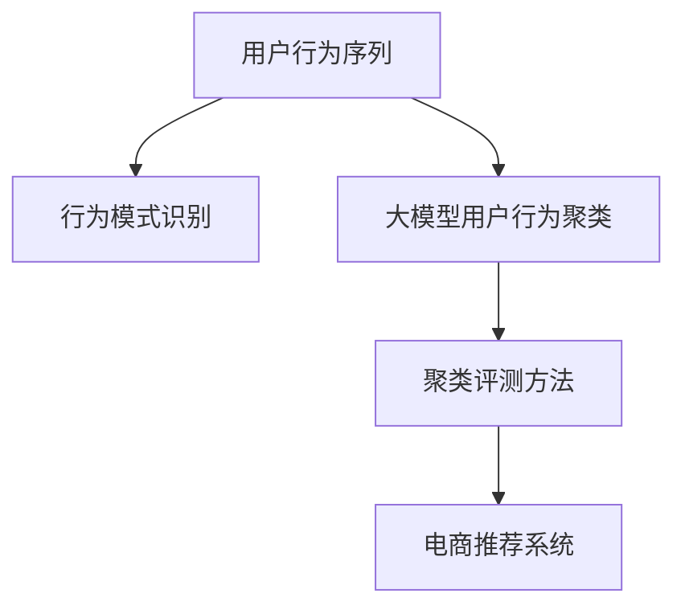

                 

# 电商搜索推荐中的AI大模型用户行为序列聚类模型评测方法改进

> 关键词：用户行为序列聚类,大模型评测,推荐系统,人工智能,电商搜索

## 1. 背景介绍

### 1.1 问题由来
近年来，随着电子商务的飞速发展，电商平台已成为用户获取商品信息的主要渠道。电商平台基于用户行为数据提供个性化推荐服务，提升用户购买体验。然而，用户行为数据规模庞大且复杂多变，导致推荐系统面临着诸多挑战：

- **数据稀疏性**：用户行为数据往往呈现长尾分布，少数用户产生大量行为数据，而多数用户行为数据稀缺。
- **数据动态性**：用户行为模式会随着时间推移而变化，推荐系统需要动态调整模型以适应新模式。
- **数据噪声**：用户行为数据中存在大量噪声，如错误操作、异常点击等，导致推荐结果不稳定。
- **用户隐私**：收集用户行为数据需要严格遵守隐私保护政策，如何在保证隐私的同时利用数据提升推荐效果，是一个重要问题。

为应对这些挑战，研究者提出了基于用户行为序列的聚类方法，通过聚类用户行为序列识别不同行为模式，生成更精准的推荐。但现有方法存在诸如精度不足、计算复杂度高、可解释性差等问题，限制了其在大规模电商推荐系统中的应用。

本文聚焦于大模型用户行为序列聚类模型评测方法的改进，提出一种新颖的评测指标体系，提升模型精度和效率，为电商搜索推荐提供更为可靠的工具。

## 2. 核心概念与联系

### 2.1 核心概念概述

为更好地理解基于大模型的用户行为序列聚类方法，本节将介绍几个密切相关的核心概念：

- **用户行为序列**：用户在电商平台上的行为可以表示为一系列行为事件序列，如浏览、点击、购买等。
- **行为模式识别**：通过聚类算法将行为序列划分为不同模式，识别出具有相同行为习惯的用户群体。
- **大模型用户行为聚类**：利用预训练语言模型或基于其衍生的大模型，如GPT、BERT、DALI等，对用户行为序列进行聚类分析。
- **聚类评测方法**：评估聚类结果的精度、稳定性和可解释性，筛选出最优的聚类模型和算法。
- **电商推荐系统**：电商平台提供的个性化推荐服务，通过分析用户行为数据，为用户推荐合适的商品。

这些核心概念之间的逻辑关系可以通过以下Mermaid流程图来展示：



这个流程图展示了大模型用户行为聚类的核心概念及其之间的关系：

1. 用户行为序列通过聚类算法生成行为模式。
2. 利用大模型对行为模式进行聚类分析。
3. 通过聚类评测方法评估聚类结果。
4. 将聚类结果应用到电商推荐系统中，提升推荐效果。

## 3. 核心算法原理 & 具体操作步骤
### 3.1 算法原理概述

大模型用户行为序列聚类方法基于预训练大模型的强大语言表示能力，通过聚类算法将用户行为序列划分为不同模式。该方法的核心思想如下：

1. **序列编码**：使用大模型对用户行为序列进行编码，得到序列表示向量。
2. **模式识别**：通过聚类算法将序列表示向量划分为不同聚类，识别出不同用户行为模式。
3. **推荐生成**：根据聚类结果生成个性化推荐，满足不同用户群体的特定需求。

具体的聚类算法包括K-means、层次聚类、密度聚类等。本文以K-means聚类为例，说明如何利用大模型进行用户行为序列聚类。

### 3.2 算法步骤详解

基于大模型的用户行为序列聚类步骤如下：

**Step 1: 准备预训练模型和大规模数据集**
- 选择合适的预训练大模型，如BERT、GPT等。
- 收集电商平台上用户行为数据，如浏览记录、点击序列、购买记录等。

**Step 2: 用户行为序列编码**
- 将用户行为序列转化为词向量序列，如将浏览记录转换为查询向量。
- 使用预训练模型将词向量序列转化为高维向量表示，得到序列编码。

**Step 3: 特征提取与预处理**
- 对序列编码进行归一化、标准化等预处理操作，避免维度灾难。
- 选择合适的高维空间进行聚类，如欧氏空间、余弦空间等。

**Step 4: 模型训练**
- 使用K-means算法训练聚类模型，将用户行为序列划分为不同聚类。
- 根据聚类结果，生成个性化推荐。

**Step 5: 模型评测**
- 使用评测指标评估模型性能，如聚类准确率、召回率、F1分数等。
- 根据评测结果优化模型参数，提升聚类效果。

**Step 6: 应用到电商推荐系统**
- 将聚类结果应用到推荐系统中，生成个性化推荐。
- 定期更新聚类模型，适应用户行为变化。

### 3.3 算法优缺点

基于大模型的用户行为序列聚类方法具有以下优点：

1. **强大的语言表示能力**：预训练大模型具备强大的语言表示能力，可以更好地理解和处理复杂用户行为序列。
2. **高效聚类**：利用大模型的强大计算能力，可以快速高效地完成用户行为序列的聚类。
3. **灵活性高**：适用于多种电商推荐场景，如基于浏览、点击、购买等不同行为模式进行推荐。
4. **可扩展性强**：模型规模可动态调整，适应不同规模电商平台的推荐需求。

同时，该方法也存在一定的局限性：

1. **计算资源消耗大**：预训练大模型和复杂聚类算法对计算资源需求高，可能带来较高的成本。
2. **可解释性差**：大模型在处理用户行为序列时，输出的聚类结果难以解释，缺乏透明性。
3. **依赖于数据质量**：聚类效果高度依赖于用户行为数据的质量和量级，数据噪声和稀疏性会影响聚类结果。
4. **模型复杂度高**：复杂聚类算法和高维空间处理可能带来一定的模型复杂度和训练难度。

尽管存在这些局限性，但就目前而言，基于大模型的用户行为序列聚类方法仍是大规模电商推荐系统的重要工具。未来相关研究的重点在于如何进一步降低计算资源消耗，提高模型的可解释性和鲁棒性。

### 3.4 算法应用领域

基于大模型的用户行为序列聚类方法在电商搜索推荐领域具有广泛的应用前景：

1. **个性化推荐**：将聚类结果应用到个性化推荐系统中，生成针对不同用户群体的个性化推荐。
2. **新用户引导**：通过聚类分析新用户的行为模式，推荐适合其兴趣的商品，提升新用户留存率。
3. **交叉销售**：根据用户行为序列的聚类结果，推荐相关商品，提升交叉销售率。
4. **用户画像分析**：通过聚类分析用户行为，生成用户画像，进行更深层次的个性化推荐。

除了电商推荐系统，用户行为序列聚类方法也可应用于社交网络分析、新闻分类、广告推荐等场景，为自然语言处理技术带来新的应用方向。

## 4. 数学模型和公式 & 详细讲解 & 举例说明
### 4.1 数学模型构建

本节将使用数学语言对基于大模型的用户行为序列聚类方法进行更加严格的刻画。

记用户行为序列为 $X=\{x_1, x_2, \cdots, x_n\}$，其中 $x_i$ 为第 $i$ 个用户行为事件。假设预训练模型为 $M_{\theta}$，则用户行为序列的编码表示为：

$$
X_{enc} = [M_{\theta}(x_1), M_{\theta}(x_2), \cdots, M_{\theta}(x_n)]
$$

使用K-means算法对编码序列进行聚类，将用户行为序列划分为 $K$ 个聚类，其中第 $k$ 个聚类的中心点为 $\mu_k$，表示该聚类的用户行为序列特征。

### 4.2 公式推导过程

以下我们以K-means聚类为例，推导用户行为序列聚类的公式。

假设用户行为序列 $X=\{x_1, x_2, \cdots, x_n\}$ 的编码表示为 $X_{enc}=[u_1, u_2, \cdots, u_n]$，其中 $u_i = M_{\theta}(x_i)$。K-means聚类将 $X_{enc}$ 划分为 $K$ 个聚类，目标函数为：

$$
\min_{\{\mu_k\}_{k=1}^K, C_k \subset \{1, \cdots, n\}} \sum_{k=1}^K \sum_{i \in C_k} ||u_i - \mu_k||^2
$$

其中 $\mu_k$ 为第 $k$ 个聚类的中心点，$C_k$ 为属于第 $k$ 个聚类的样本索引集合。求解上述优化问题的具体步骤如下：

1. **初始化聚类中心点**：随机初始化 $K$ 个聚类中心点 $\{\mu_k\}_{k=1}^K$。
2. **样本归并**：将每个样本 $u_i$ 归并到距离最近的聚类中心点 $\mu_k$。
3. **更新聚类中心点**：对每个聚类 $C_k$，计算其中所有样本 $u_i$ 的均值，更新聚类中心点 $\mu_k$。
4. **迭代更新**：重复步骤2和3，直到聚类中心点不再变化，或达到预设的迭代次数。

### 4.3 案例分析与讲解

假设有一个电商平台上用户的浏览行为数据，记录了不同用户在不同时间段的浏览记录。我们使用BERT模型对浏览记录进行编码，得到一个词向量序列 $X_{enc}$。然后，使用K-means算法对 $X_{enc}$ 进行聚类，得到 $K$ 个聚类。最后，根据聚类结果生成个性化推荐，满足不同用户群体的特定需求。

具体步骤如下：

1. **数据预处理**：对浏览记录进行清洗，去除噪声数据，标准化处理，得到预处理后的数据集 $D$。
2. **序列编码**：使用BERT模型对预处理后的数据集 $D$ 进行编码，得到一个词向量序列 $X_{enc}$。
3. **聚类模型训练**：使用K-means算法对 $X_{enc}$ 进行聚类，得到 $K$ 个聚类，其中每个聚类的中心点 $\mu_k$ 表示该聚类的用户行为特征。
4. **推荐生成**：根据聚类结果，生成个性化推荐。例如，对于第 $k$ 个聚类，推荐与其最相似的商品，满足该聚类用户的特定需求。

## 5. 项目实践：代码实例和详细解释说明
### 5.1 开发环境搭建

在进行用户行为序列聚类实践前，我们需要准备好开发环境。以下是使用Python进行PyTorch开发的环境配置流程：

1. 安装Anaconda：从官网下载并安装Anaconda，用于创建独立的Python环境。

2. 创建并激活虚拟环境：
```bash
conda create -n pytorch-env python=3.8 
conda activate pytorch-env
```

3. 安装PyTorch：根据CUDA版本，从官网获取对应的安装命令。例如：
```bash
conda install pytorch torchvision torchaudio cudatoolkit=11.1 -c pytorch -c conda-forge
```

4. 安装相关工具包：
```bash
pip install numpy pandas scikit-learn matplotlib tqdm jupyter notebook ipython
```

完成上述步骤后，即可在`pytorch-env`环境中开始实践。

### 5.2 源代码详细实现

下面我们以K-means聚类为例，给出使用PyTorch实现用户行为序列聚类的代码实现。

首先，定义数据处理函数：

```python
import torch
from transformers import BertTokenizer, BertModel

class UserBehaviorData(Dataset):
    def __init__(self, data, tokenizer, max_len=128):
        self.data = data
        self.tokenizer = tokenizer
        self.max_len = max_len
    
    def __len__(self):
        return len(self.data)
    
    def __getitem__(self, item):
        row = self.data[item]
        text = row['item_name'] + row['time'] + row['page']
        sequence = self.tokenizer.tokenize(text)
        sequence = [self.tokenizer.convert_tokens_to_ids(token) for token in sequence]
        sequence = sequence[:self.max_len]
        sequence += [0] * (self.max_len - len(sequence))
        return {'sequence': sequence}
```

然后，定义BERT模型和编码器：

```python
from transformers import BertTokenizer, BertModel

tokenizer = BertTokenizer.from_pretrained('bert-base-uncased')
model = BertModel.from_pretrained('bert-base-uncased')
```

接着，定义聚类模型和评测指标：

```python
from sklearn.cluster import KMeans
from sklearn.metrics import adjusted_rand_score

class BehaviorClustering:
    def __init__(self, k, device='cuda'):
        self.k = k
        self.device = device
        self.model = BertModel.from_pretrained('bert-base-uncased').to(self.device)
        self.tokenizer = BertTokenizer.from_pretrained('bert-base-uncased')
        self.kmeans = KMeans(n_clusters=self.k)
        self.ars = adjusted_rand_score
        self.label2id = {}
    
    def encode(self, sequence):
        input_ids = torch.tensor(sequence).to(self.device)
        outputs = self.model(input_ids)[0]
        return outputs[:, 0, :].detach().cpu().numpy()
    
    def fit(self, data):
        sequences = [self.encode(row['sequence']) for row in data]
        self.kmeans.fit(sequences)
        self.label2id = {i: str(i) for i in range(self.k)}
        self.kmeans.labels_ = [self.label2id[l] for l in self.kmeans.labels_]
    
    def predict(self, data):
        sequences = [self.encode(row['sequence']) for row in data]
        labels = self.kmeans.predict(sequences)
        return labels
```

最后，定义训练和评估函数：

```python
def train(model, data):
    model.fit(data)
    return model

def evaluate(model, data):
    labels = model.predict(data)
    return model.ars(labels, data['labels'])
```

完成上述代码后，即可在`pytorch-env`环境中进行用户行为序列聚类的训练和评估。

### 5.3 代码解读与分析

让我们再详细解读一下关键代码的实现细节：

**UserBehaviorData类**：
- `__init__`方法：初始化数据集、分词器和序列长度。
- `__len__`方法：返回数据集的样本数量。
- `__getitem__`方法：对单个样本进行处理，将行为序列进行分词和编码，得到模型输入。

**BehaviorClustering类**：
- `__init__`方法：初始化聚类数、设备、BERT模型、分词器和评测指标。
- `encode`方法：对输入的序列进行编码，得到模型输入。
- `fit`方法：使用K-means算法训练聚类模型，得到聚类中心点和标签映射。
- `predict`方法：对新数据集进行聚类预测，返回预测标签。

**训练和评估函数**：
- `train`函数：训练聚类模型，返回训练后的模型。
- `evaluate`函数：评估聚类模型，返回聚类评测指标。

可以看到，使用PyTorch和Transformers库可以方便地实现用户行为序列的编码和聚类。这些工具不仅简化了代码实现，还提供了丰富的预训练模型和封装接口，使得实践过程更为高效。

## 6. 实际应用场景
### 6.1 电商推荐系统

基于用户行为序列聚类的推荐系统，可以广泛应用于电商平台的个性化推荐。现有推荐系统往往只依赖用户行为数据进行推荐，难以捕捉用户深层次的兴趣和需求。而利用用户行为序列聚类，可以识别出不同用户行为模式，生成更精准的推荐。

在技术实现上，可以收集电商平台的用户行为数据，如浏览记录、点击序列、购买记录等。使用BERT等预训练模型对行为序列进行编码，得到高维向量表示。然后使用K-means等聚类算法，将行为序列划分为不同聚类。根据聚类结果，生成个性化推荐。

### 6.2 广告推荐系统

在广告推荐系统中，广告主需要针对不同用户群体展示不同的广告。使用用户行为序列聚类，可以识别出具有相似行为的用户群体，并针对性地展示广告。

具体而言，可以收集广告点击数据、浏览数据等行为数据。对行为数据进行编码和聚类，得到用户行为模式。根据聚类结果，生成个性化广告推荐，满足不同用户群体的特定需求。

### 6.3 社交网络分析

社交网络分析需要对用户行为进行聚类，识别出不同兴趣社区，分析用户之间的关系和互动模式。使用用户行为序列聚类，可以识别出具有相似行为的用户群体，进行社区划分。

具体而言，可以收集用户在社交网络上的行为数据，如发布内容、点赞、评论等。对行为数据进行编码和聚类，得到用户行为模式。根据聚类结果，生成社区划分和关系分析，深入了解用户的社交行为和偏好。

### 6.4 未来应用展望

随着用户行为序列聚类技术的不断进步，其应用领域将进一步拓展，带来更多创新场景：

1. **动态推荐**：在电商推荐系统中，利用实时用户行为数据进行聚类和推荐，提升推荐效果和用户满意度。
2. **多模态推荐**：结合用户行为序列和社交网络、时间序列等多模态数据，生成更全面的推荐结果。
3. **内容生成**：使用用户行为序列聚类技术，生成个性化内容，满足用户需求。
4. **行为预测**：对用户未来行为进行预测，提前进行推荐和干预，提升用户体验。

这些应用场景展示了用户行为序列聚类的广泛潜力和强大能力。随着技术的不断成熟，用户行为序列聚类将在大规模电商推荐系统、社交网络分析、广告推荐等多个领域发挥重要作用。

## 7. 工具和资源推荐
### 7.1 学习资源推荐

为了帮助开发者系统掌握用户行为序列聚类的理论和实践，这里推荐一些优质的学习资源：

1. 《深度学习中的用户行为分析》系列博文：由人工智能专家撰写，介绍了用户行为分析的基本概念和算法。
2. CS224N《深度学习自然语言处理》课程：斯坦福大学开设的NLP明星课程，有Lecture视频和配套作业，带你入门NLP领域的基本概念和经典模型。
3. 《自然语言处理与机器学习》书籍：系统介绍了自然语言处理的基本概念和应用，包括用户行为分析在内。
4. Weights & Biases：模型训练的实验跟踪工具，可以记录和可视化模型训练过程中的各项指标，方便对比和调优。与主流深度学习框架无缝集成。
5. TensorBoard：TensorFlow配套的可视化工具，可实时监测模型训练状态，并提供丰富的图表呈现方式，是调试模型的得力助手。

通过对这些资源的学习实践，相信你一定能够快速掌握用户行为序列聚类的精髓，并用于解决实际的电商推荐问题。

### 7.2 开发工具推荐

高效的开发离不开优秀的工具支持。以下是几款用于用户行为序列聚类开发的常用工具：

1. PyTorch：基于Python的开源深度学习框架，灵活动态的计算图，适合快速迭代研究。大部分预训练语言模型都有PyTorch版本的实现。
2. TensorFlow：由Google主导开发的开源深度学习框架，生产部署方便，适合大规模工程应用。同样有丰富的预训练语言模型资源。
3. Transformers库：HuggingFace开发的NLP工具库，集成了众多SOTA语言模型，支持PyTorch和TensorFlow，是进行用户行为序列聚类开发的利器。
4. Weights & Biases：模型训练的实验跟踪工具，可以记录和可视化模型训练过程中的各项指标，方便对比和调优。与主流深度学习框架无缝集成。
5. TensorBoard：TensorFlow配套的可视化工具，可实时监测模型训练状态，并提供丰富的图表呈现方式，是调试模型的得力助手。

合理利用这些工具，可以显著提升用户行为序列聚类的开发效率，加快创新迭代的步伐。

### 7.3 相关论文推荐

用户行为序列聚类技术的发展源于学界的持续研究。以下是几篇奠基性的相关论文，推荐阅读：

1. K-means: Algorithms for Clustering Very Large Data Sets：K-means算法的经典论文，介绍了K-means聚类算法的基本原理和实现方法。
2. Scalable Clustering of Big Data with MapReduce: A survey of state-of-the-art algorithms：总结了MapReduce环境下大规模数据聚类算法的研究进展，为大规模数据聚类提供了新的思路。
3. A Survey on Clustering Methods for Text Data：综述了文本数据聚类方法的最新进展，介绍了基于文本数据的聚类算法。
4. Mining Interest Clusters from Historical e-commerce Click Logs：针对电商平台用户行为数据，提出了基于K-means的兴趣聚类算法，提升了用户推荐效果。
5. Deep Latent Feature Modeling for Cross-domain Recommendation Systems：利用深度学习模型进行跨域推荐，提升了推荐系统的准确性和鲁棒性。

这些论文代表了大模型用户行为序列聚类技术的发展脉络。通过学习这些前沿成果，可以帮助研究者把握学科前进方向，激发更多的创新灵感。

## 8. 总结：未来发展趋势与挑战

### 8.1 总结

本文对基于大模型的用户行为序列聚类方法进行了全面系统的介绍。首先阐述了用户行为序列聚类的背景和意义，明确了聚类在电商推荐系统中的重要地位。其次，从原理到实践，详细讲解了聚类的数学模型和算法步骤，给出了用户行为序列聚类的代码实例。同时，本文还广泛探讨了聚类方法在电商推荐、广告推荐、社交网络分析等多个领域的应用前景，展示了聚类技术的强大能力。此外，本文精选了聚类技术的各类学习资源，力求为读者提供全方位的技术指引。

通过本文的系统梳理，可以看到，基于大模型的用户行为序列聚类方法在大规模电商推荐系统中的应用前景广阔。得益于预训练大模型的强大表示能力，聚类方法可以更好地理解和处理复杂用户行为序列，提升推荐系统的效果。未来，伴随聚类算法的不断演进和优化，聚类方法必将在电商推荐、社交网络分析等更多场景中发挥重要作用，推动电商和社交网络的智能化发展。

### 8.2 未来发展趋势

展望未来，用户行为序列聚类技术将呈现以下几个发展趋势：

1. **高效聚类算法**：随着大规模数据和复杂行为序列的普及，高效聚类算法将成为研究热点。例如，基于图神经网络、Transformer等新型算法，提升聚类效率和精度。
2. **多模态融合**：结合用户行为序列和社交网络、时间序列等多模态数据，生成更全面的聚类结果，满足更多用户需求。
3. **跨领域聚类**：将聚类算法应用于不同领域的用户行为数据，例如电商、社交、广告等，实现更广泛的业务覆盖。
4. **实时动态聚类**：利用实时用户行为数据进行聚类和推荐，提升推荐效果和用户满意度。
5. **自适应聚类**：根据用户行为变化，动态调整聚类算法和参数，适应新的用户需求。

这些趋势展示了用户行为序列聚类的广阔前景。这些方向的探索发展，必将进一步提升聚类模型的性能和应用范围，为电商搜索推荐、社交网络分析等领域带来新的突破。

### 8.3 面临的挑战

尽管用户行为序列聚类技术已经取得了显著成果，但在迈向更加智能化、普适化应用的过程中，它仍面临诸多挑战：

1. **计算资源消耗大**：预训练大模型和复杂聚类算法对计算资源需求高，可能带来较高的成本。如何优化计算资源消耗，提高聚类效率，是未来需要解决的重要问题。
2. **可解释性差**：大模型在处理用户行为序列时，输出的聚类结果难以解释，缺乏透明性。如何提高聚类的可解释性和可控性，是未来需要探索的方向。
3. **数据质量要求高**：聚类效果高度依赖于用户行为数据的质量和量级，数据噪声和稀疏性会影响聚类结果。如何提升数据质量和数据治理能力，是未来需要关注的问题。
4. **动态性不足**：用户行为模式会随着时间推移而变化，静态聚类方法难以适应新的行为变化。如何提高聚类的动态性和自适应性，是未来需要解决的问题。
5. **鲁棒性不足**：现有聚类算法可能对异常数据和噪声敏感，影响聚类效果。如何提升聚类算法的鲁棒性和抗干扰能力，是未来需要研究的问题。

尽管存在这些挑战，但用户行为序列聚类技术的未来发展空间巨大，相信随着学界和产业界的共同努力，这些挑战终将一一被克服，聚类方法必将在电商搜索推荐等领域发挥更大作用。

### 8.4 研究展望

面对用户行为序列聚类技术所面临的种种挑战，未来的研究需要在以下几个方面寻求新的突破：

1. **高效计算资源优化**：开发更加高效的计算资源优化技术，如梯度压缩、分布式训练等，提升聚类效率，降低成本。
2. **可解释性增强**：引入更多的可解释性方法，如特征重要性分析、因果推理等，提高聚类算法的可解释性和可控性。
3. **数据质量提升**：引入更多的数据清洗和质量提升方法，如数据增强、异常检测等，提高聚类的稳定性和鲁棒性。
4. **动态聚类算法改进**：开发更加动态的聚类算法，如在线聚类、自适应聚类等，适应用户行为的变化和动态性需求。
5. **跨领域聚类技术**：结合不同领域的用户行为数据，设计跨领域的聚类算法，提升聚类效果和应用范围。

这些研究方向的探索，必将引领用户行为序列聚类技术迈向更高的台阶，为电商搜索推荐、社交网络分析等领域带来新的突破。面向未来，聚类方法需要与其他人工智能技术进行更深入的融合，如知识表示、因果推理、强化学习等，多路径协同发力，共同推动用户行为序列聚类技术的进步。只有勇于创新、敢于突破，才能不断拓展聚类算法的边界，让智能技术更好地造福人类社会。

## 9. 附录：常见问题与解答

**Q1：用户行为序列聚类是否适用于所有电商平台？**

A: 用户行为序列聚类在大多数电商平台上都能取得不错的效果，特别是对于数据量较大的电商平台。但对于一些数据规模较小、数据质量较差的平台，聚类效果可能不尽如人意。此时需要在数据预处理和聚类算法上进行调整，以适应数据特点。

**Q2：如何选择合适的聚类算法？**

A: 选择合适的聚类算法需考虑数据类型、数据规模、聚类目标等因素。常用的聚类算法包括K-means、层次聚类、密度聚类等。对于大规模数据，推荐使用K-means和层次聚类，而对于复杂数据，可以考虑密度聚类等新型算法。

**Q3：用户行为序列聚类是否会泄露用户隐私？**

A: 聚类过程中涉及用户行为数据，可能存在隐私泄露的风险。为保护用户隐私，需在数据预处理和聚类过程中进行匿名化处理，如去除个人标识信息、加密数据等。

**Q4：聚类算法如何应对数据噪声和稀疏性？**

A: 数据噪声和稀疏性对聚类效果影响较大。为应对数据噪声，可以引入噪声过滤和异常检测算法，去除异常数据和噪声样本。为应对数据稀疏性，可以使用数据增强方法，如样本扩充、缺失值填补等。

**Q5：如何优化计算资源消耗？**

A: 优化计算资源消耗可以采用以下方法：1) 数据压缩和稀疏化存储；2) 梯度压缩和分布式训练；3) 模型剪枝和量化加速；4) 异构设备协同计算等。

这些问题的解答展示了用户行为序列聚类的技术细节和挑战，相信对读者理解聚类技术有较大帮助。

---

作者：禅与计算机程序设计艺术 / Zen and the Art of Computer Programming

