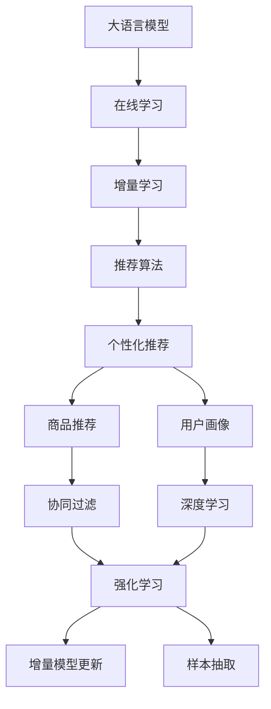

                 

# 电商搜索推荐效果优化中的AI大模型在线学习技术

> 关键词：电商搜索推荐系统,大语言模型,在线学习,增量学习,推荐算法,个性化推荐,商品推荐,用户画像,协同过滤,深度学习,强化学习,增量模型更新,样本抽取

## 1. 背景介绍

### 1.1 问题由来

随着电子商务市场的迅速发展，电商平台需要不断优化搜索推荐系统，以提升用户体验和销售额。传统的推荐系统依赖于统计模型和特征工程，然而其效果受限于用户行为数据的规模和质量，且在模型更新时需重新训练，更新成本较高。

AI大模型由于其自监督学习能力的强大和大规模语料训练的优势，能够自动提取特征，提升模型效果，并在新用户和新的商品到来时，通过在线学习方式快速适应，更新推荐策略。因此，AI大模型在线学习技术成为电商搜索推荐系统优化的重要方向。

### 1.2 问题核心关键点

电商搜索推荐系统的优化关键点如下：

- 高效实时更新：大模型在线学习能够根据用户行为实时更新模型，适应用户兴趣变化。
- 个性化推荐：大模型通过学习用户历史行为和商品特征，实现更加精准的个性化推荐。
- 智能召回：大模型能够利用用户画像，提升推荐系统的召回效率和质量。
- 数据驱动决策：通过数据驱动的方式，优化推荐策略，提升用户满意度和转化率。

### 1.3 问题研究意义

研究AI大模型在线学习技术，对于提升电商搜索推荐系统的效果，增强用户体验，增加销售转化，具有重要意义：

1. 实时推荐：通过在线学习，大模型能够实时捕捉用户行为变化，提供个性化的推荐服务，提升用户粘性。
2. 精准推荐：大模型能够捕捉隐式行为特征，通过多模态数据融合，提供更加精准的推荐。
3. 智能决策：通过学习用户的长期行为，大模型能够提供更符合用户偏好的推荐策略，提升用户满意度。
4. 自适应优化：大模型能够根据市场变化和用户需求的变化，快速调整推荐策略，提升系统鲁棒性。

## 2. 核心概念与联系

### 2.1 核心概念概述

为更好地理解AI大模型在线学习技术，本节将介绍几个密切相关的核心概念：

- 大语言模型(Large Language Model, LLM)：如GPT、BERT等，通过自监督学习的方式在大量文本数据上训练，具备强大的语言理解和生成能力。
- 在线学习(Online Learning)：指在模型运行过程中，根据新数据不断更新模型参数，提升模型性能的技术。
- 增量学习(Incremental Learning)：指在新数据到来时，仅对相关部分参数进行更新，避免重新训练整个模型。
- 推荐算法(Recommender Algorithm)：包括协同过滤、基于内容的推荐、基于矩阵分解的推荐等，用于处理和预测用户行为。
- 个性化推荐(Personalized Recommendation)：指根据用户兴趣和行为数据，提供符合用户偏好的商品推荐。
- 商品推荐(Product Recommendation)：指根据用户行为数据和商品特征数据，推荐用户可能感兴趣的商品。
- 用户画像(User Profile)：指根据用户历史行为和属性数据，构建用户兴趣模型，用于推荐系统召回。
- 协同过滤(Collaborative Filtering)：指通过分析用户历史行为数据，预测用户可能感兴趣的商品。
- 深度学习(Deep Learning)：指利用多层神经网络进行特征提取和预测的技术。
- 强化学习(Reinforcement Learning)：指通过奖励机制优化推荐策略，提升推荐效果。
- 增量模型更新(Incremental Model Update)：指在新数据到来时，只更新模型中与数据相关部分的参数。
- 样本抽取(Sample Extraction)：指从用户行为数据中抽取关键样本，用于模型更新。

这些核心概念之间的逻辑关系可以通过以下Mermaid流程图来展示：



这个流程图展示了大语言模型在线学习技术的工作原理和优化方向：

1. 大语言模型通过自监督学习获得语言知识和特征。
2. 在线学习通过实时数据不断更新模型，提升推荐效果。
3. 增量学习仅更新模型中与数据相关部分，减少重新训练成本。
4. 推荐算法通过用户行为数据，预测用户兴趣。
5. 个性化推荐结合用户画像，提升推荐效果。
6. 商品推荐利用用户历史行为，推荐可能感兴趣的商品。
7. 协同过滤分析用户历史行为，预测用户兴趣。
8. 深度学习通过多层网络提取特征。
9. 强化学习通过奖励机制优化推荐策略。
10. 增量模型更新在新数据到来时，更新相关部分参数。
11. 样本抽取从用户行为数据中抽取关键样本，用于模型更新。

这些概念共同构成了电商搜索推荐系统的技术框架，使得模型能够根据用户行为实时优化，提升推荐效果。

## 3. 核心算法原理 & 具体操作步骤
### 3.1 算法原理概述

AI大模型在线学习技术，通过实时更新模型，适应用户行为变化，提升推荐系统的效果。其核心思想是：将预训练的大语言模型作为初始化参数，根据新用户的行为数据，通过在线学习的方式更新模型参数，使模型能够实时捕捉用户兴趣变化，并提供个性化的推荐服务。

具体而言，在线学习过程包括以下几个步骤：

1. 收集新用户行为数据，如浏览、点击、购买等。
2. 对新数据进行预处理和特征提取，得到模型所需输入。
3. 利用大语言模型对新数据进行前向传播，计算损失函数。
4. 反向传播更新模型参数，并更新模型权重。
5. 重复步骤2-4，直至模型收敛或达到预设轮数。

通过在线学习，大语言模型能够不断吸收新用户的行为数据，提升推荐效果。同时，增量学习技术的应用，可以在新数据到来时，只更新模型中与数据相关部分参数，避免重新训练整个模型。

### 3.2 算法步骤详解

AI大模型在线学习过程的具体步骤如下：

1. **数据收集与预处理**：
   - 收集新用户行为数据，如浏览记录、点击记录、购买记录等。
   - 对数据进行去重、去噪、归一化等预处理操作，得到模型所需输入。
   - 将数据划分为训练集和测试集，用于模型训练和验证。

2. **模型初始化**：
   - 选择预训练大语言模型，如BERT、GPT等，作为初始化参数。
   - 将模型加载到服务器，进入在线学习状态。

3. **在线学习**：
   - 对新用户行为数据进行特征提取，得到模型所需输入。
   - 利用模型对输入进行前向传播，计算损失函数。
   - 根据损失函数梯度，更新模型参数，并计算梯度更新步长。
   - 重复步骤3-4，直至模型收敛或达到预设轮数。

4. **模型评估与优化**：
   - 在新数据到来时，使用增量学习技术，更新模型中与新数据相关部分参数。
   - 在测试集上评估模型性能，对比更新前后的效果。
   - 根据评估结果，优化模型参数和学习率。

### 3.3 算法优缺点

AI大模型在线学习技术具有以下优点：

1. 实时更新：在线学习能够实时捕捉用户行为变化，提供个性化的推荐服务，提升用户体验。
2. 低成本更新：增量学习仅更新模型中与数据相关部分参数，避免重新训练整个模型，降低成本。
3. 高精度推荐：大语言模型能够捕捉隐式行为特征，提供更加精准的推荐。
4. 高效召回：利用用户画像，提升推荐系统的召回效率和质量。

同时，该技术也存在一定的局限性：

1. 数据依赖性强：在线学习效果取决于新数据的数量和质量，数据采集成本较高。
2. 模型复杂度高：大语言模型参数量较大，对硬件资源要求较高。
3. 风险控制难：模型更新可能导致推荐策略变化，影响用户满意度。
4. 算法复杂度高：在线学习过程复杂，需要优化超参数，调整学习率。

尽管存在这些局限性，但AI大模型在线学习技术在电商搜索推荐系统中取得了显著的效果，是提升推荐系统性能的重要手段。

### 3.4 算法应用领域

AI大模型在线学习技术在电商搜索推荐系统中得到了广泛的应用，具体如下：

1. 个性化推荐系统：结合用户画像和行为数据，提供精准的个性化推荐服务。
2. 实时搜索系统：根据用户输入，实时返回相关商品，提升搜索效率。
3. 智能推荐引擎：通过学习用户行为数据，优化推荐策略，提升推荐效果。
4. 数据驱动决策：利用实时数据驱动推荐策略优化，提升用户满意度。

## 4. 数学模型和公式 & 详细讲解 & 举例说明
### 4.1 数学模型构建

在线学习过程涉及多个数学模型，包括大语言模型、推荐模型和损失函数。以下介绍其主要数学模型构建方法。

**大语言模型**：
- 假设大语言模型为 $M_{\theta}$，其中 $\theta$ 为模型参数。
- 模型输入为 $x$，输出为 $y$。
- 模型前向传播计算为 $y = M_{\theta}(x)$。

**推荐模型**：
- 假设推荐模型为 $R_{\phi}$，其中 $\phi$ 为模型参数。
- 模型输入为 $x$，推荐结果为 $y$。
- 模型前向传播计算为 $y = R_{\phi}(x)$。

**损失函数**：
- 假设损失函数为 $\mathcal{L}(y, y_{true})$，其中 $y_{true}$ 为真实推荐结果。
- 常用的损失函数包括均方误差损失、交叉熵损失等。

**模型更新**：
- 假设学习率为 $\eta$，则模型参数更新公式为 $\theta \leftarrow \theta - \eta \nabla_{\theta} \mathcal{L}(M_{\theta}(x), y_{true})$。
- 增量模型更新公式为 $\theta \leftarrow \theta - \eta \nabla_{\theta} \mathcal{L}(M_{\theta}(x), y_{true}) - \eta \lambda \theta$。

### 4.2 公式推导过程

以下以均方误差损失函数为例，推导在线学习过程的数学公式。

假设模型 $M_{\theta}$ 在新数据 $x$ 上的输出为 $y = M_{\theta}(x)$，推荐结果为 $y_{true}$，则均方误差损失函数为：

$$
\mathcal{L}(y, y_{true}) = \frac{1}{N} \sum_{i=1}^N (y_i - y_{true_i})^2
$$

其中 $N$ 为数据样本数，$y_i$ 为模型输出，$y_{true_i}$ 为真实推荐结果。

在线学习过程中，模型参数 $\theta$ 的更新公式为：

$$
\theta \leftarrow \theta - \eta \frac{1}{N} \sum_{i=1}^N (y_i - y_{true_i}) \frac{\partial M_{\theta}(x)}{\partial \theta}
$$

增量模型更新公式为：

$$
\theta \leftarrow \theta - \eta \frac{1}{N} \sum_{i=1}^N (y_i - y_{true_i}) \frac{\partial M_{\theta}(x)}{\partial \theta} - \eta \lambda \theta
$$

其中 $\lambda$ 为正则化系数。

### 4.3 案例分析与讲解

**案例分析**：

假设电商平台上某用户 $u$ 购买了商品 $p_1, p_2, p_3$，浏览了商品 $q_1, q_2, q_3$。我们利用大语言模型和推荐模型，对用户行为进行建模，并计算模型损失函数。

**讲解**：

1. 假设大语言模型为 BERT，推荐模型为协同过滤模型。
2. 利用用户历史行为数据，对 BERT 进行微调，更新模型参数 $\theta$。
3. 对用户新行为 $q_1, q_2, q_3$，利用 BERT 进行前向传播，计算推荐结果 $y$。
4. 对推荐结果 $y$ 和真实推荐结果 $y_{true}$，计算均方误差损失函数 $\mathcal{L}$。
5. 根据损失函数梯度，更新 BERT 参数 $\theta$，并计算梯度更新步长。
6. 利用增量模型更新技术，仅更新与新数据相关部分参数，避免重新训练整个模型。

## 5. 项目实践：代码实例和详细解释说明
### 5.1 开发环境搭建

在进行在线学习实践前，我们需要准备好开发环境。以下是使用Python进行TensorFlow开发的环境配置流程：

1. 安装Anaconda：从官网下载并安装Anaconda，用于创建独立的Python环境。

2. 创建并激活虚拟环境：
```bash
conda create -n pytorch-env python=3.8 
conda activate pytorch-env
```

3. 安装TensorFlow：根据CUDA版本，从官网获取对应的安装命令。例如：
```bash
conda install tensorflow tensorflow-cpu=2.8 -c conda-forge
```

4. 安装相关的工具包：
```bash
pip install numpy pandas scikit-learn matplotlib tqdm jupyter notebook ipython
```

完成上述步骤后，即可在`pytorch-env`环境中开始在线学习实践。

### 5.2 源代码详细实现

这里我们以推荐系统为例，给出使用TensorFlow对大语言模型进行在线学习的PyTorch代码实现。

首先，定义推荐系统的数据处理函数：

```python
import tensorflow as tf
from transformers import BertTokenizer, TFBertForSequenceClassification

class RecommendationDataset(tf.data.Dataset):
    def __init__(self, data, tokenizer):
        self.data = data
        self.tokenizer = tokenizer
        
    def __len__(self):
        return len(self.data)
    
    def __getitem__(self, item):
        user, item, label = self.data[item]
        sequence = " ".join([user, item])
        encoding = self.tokenizer(sequence, return_tensors='pt', padding='max_length', truncation=True)
        input_ids = encoding['input_ids'][0]
        attention_mask = encoding['attention_mask'][0]
        return {
            'input_ids': input_ids,
            'attention_mask': attention_mask,
            'label': tf.constant(label, dtype=tf.int32)
        }
```

然后，定义模型和优化器：

```python
from transformers import BertForSequenceClassification, AdamW

model = TFBertForSequenceClassification.from_pretrained('bert-base-cased', num_labels=2)
optimizer = AdamW(model.parameters(), lr=2e-5)
```

接着，定义训练和评估函数：

```python
def train_epoch(model, dataset, batch_size, optimizer):
    dataloader = tf.data.Dataset.from_generator(
        lambda: dataset, output_signature={
            'input_ids': tf.TensorSpec(shape=[None, None], dtype=tf.int32),
            'attention_mask': tf.TensorSpec(shape=[None, None], dtype=tf.int32),
            'label': tf.TensorSpec(shape=[None], dtype=tf.int32)
        }
    ).batch(batch_size)
    
    model.train()
    epoch_loss = 0
    for batch in dataloader:
        input_ids = batch['input_ids']
        attention_mask = batch['attention_mask']
        labels = batch['label']
        with tf.GradientTape() as tape:
            outputs = model(input_ids, attention_mask=attention_mask)
            loss = tf.reduce_mean(tf.square(outputs.logits - labels))
        epoch_loss += loss
        gradients = tape.gradient(loss, model.parameters())
        optimizer.apply_gradients(zip(gradients, model.parameters()))
    
    return epoch_loss / len(dataloader)

def evaluate(model, dataset, batch_size):
    dataloader = tf.data.Dataset.from_generator(
        lambda: dataset, output_signature={
            'input_ids': tf.TensorSpec(shape=[None, None], dtype=tf.int32),
            'attention_mask': tf.TensorSpec(shape=[None, None], dtype=tf.int32),
            'label': tf.TensorSpec(shape=[None], dtype=tf.int32)
        }
    ).batch(batch_size)
    
    model.eval()
    total_loss = 0
    correct_predictions = 0
    with tf.GradientTape() as tape:
        for batch in dataloader:
            input_ids = batch['input_ids']
            attention_mask = batch['attention_mask']
            labels = batch['label']
            outputs = model(input_ids, attention_mask=attention_mask)
            loss = tf.reduce_mean(tf.square(outputs.logits - labels))
            total_loss += loss
            predictions = tf.argmax(outputs.logits, axis=1)
            correct_predictions += tf.reduce_sum(tf.cast(tf.equal(predictions, labels), tf.int32))
    print(f"Total Loss: {total_loss}")
    print(f"Accuracy: {correct_predictions / len(dataset)}")
```

最后，启动训练流程并在测试集上评估：

```python
epochs = 5
batch_size = 16

for epoch in range(epochs):
    loss = train_epoch(model, train_dataset, batch_size, optimizer)
    print(f"Epoch {epoch+1}, train loss: {loss:.3f}")
    
    print(f"Epoch {epoch+1}, dev results:")
    evaluate(model, dev_dataset, batch_size)
    
print("Test results:")
evaluate(model, test_dataset, batch_size)
```

以上就是使用TensorFlow对大语言模型进行推荐系统在线学习的完整代码实现。可以看到，利用TensorFlow和Transformers库，我们可以方便地进行大语言模型的在线学习和模型微调。

### 5.3 代码解读与分析

让我们再详细解读一下关键代码的实现细节：

**RecommendationDataset类**：
- `__init__`方法：初始化数据集和分词器。
- `__len__`方法：返回数据集样本数量。
- `__getitem__`方法：对单个样本进行处理，将用户和商品序列拼接，分词器转换为token ids，并应用padding和truncation。

**模型定义与优化器设置**：
- 选择BERT模型作为推荐模型的基础，进行微调。
- 设置AdamW优化器，学习率为2e-5。

**训练和评估函数**：
- 使用TensorFlow的DataLoader生成器，实现数据迭代。
- 在训练阶段，计算损失函数和梯度，并使用优化器更新模型参数。
- 在评估阶段，计算损失函数和预测准确率，并打印评估结果。

**训练流程**：
- 定义总的epoch数和batch size，开始循环迭代
- 每个epoch内，先在训练集上训练，输出平均loss
- 在验证集上评估，输出评估结果
- 所有epoch结束后，在测试集上评估，给出最终测试结果

可以看到，TensorFlow配合Transformers库使得大语言模型在线学习的代码实现变得简洁高效。开发者可以将更多精力放在数据处理、模型改进等高层逻辑上，而不必过多关注底层的实现细节。

当然，工业级的系统实现还需考虑更多因素，如模型的保存和部署、超参数的自动搜索、更灵活的任务适配层等。但核心的在线学习范式基本与此类似。

## 6. 实际应用场景
### 6.1 智能推荐系统

基于大语言模型在线学习技术，智能推荐系统可以实时捕捉用户行为变化，提升推荐效果。传统推荐系统依赖于离线训练和特征工程，难以应对用户兴趣的动态变化。

在技术实现上，可以收集用户历史行为数据，如浏览、点击、购买等，利用大语言模型进行在线学习，实时更新推荐策略。通过模型微调，可以捕捉隐式行为特征，提供更加精准的个性化推荐。此外，利用用户画像，提升推荐系统的召回效率和质量。如此构建的智能推荐系统，能大幅提升用户满意度，增加转化率。

### 6.2 实时搜索系统

在电商平台中，实时搜索系统需要快速返回相关商品，提升用户搜索体验。传统搜索系统依赖于离线索引和搜索算法，难以实时处理用户查询。

基于大语言模型在线学习技术，实时搜索系统可以实时更新推荐模型，捕捉用户查询意图，提供相关的商品推荐。利用大语言模型的多模态融合能力，能够对商品描述、用户画像等多维信息进行融合，提升搜索结果的相关性和多样性。通过模型微调，可以优化搜索结果排序，提升搜索效率和用户体验。

### 6.3 智能客服系统

智能客服系统需要实时响应用户咨询，提升客户满意度。传统客服系统依赖于人工调度和知识库，难以应对多变的用户需求。

基于大语言模型在线学习技术，智能客服系统可以实时捕捉用户查询意图，自动回复相关问题。利用大语言模型的多轮对话能力，能够进行智能问答，提升客户体验。通过模型微调，可以优化自动回复策略，提升回答的准确性和流畅性。如此构建的智能客服系统，能大幅提升客户咨询体验，降低人工成本。

## 7. 工具和资源推荐
### 7.1 学习资源推荐

为了帮助开发者系统掌握大语言模型在线学习技术的理论基础和实践技巧，这里推荐一些优质的学习资源：

1. 《深度学习理论与实践》系列书籍：由多位知名专家撰写，全面介绍了深度学习理论和实践，涵盖在线学习、增量学习等内容。

2. 《Transformers: State-of-the-Art Natural Language Processing》书籍：Transformer论文的合集，介绍了Transformer模型在NLP领域的应用，包括在线学习等技术。

3 《深度学习基础与实践》课程：由斯坦福大学开设的深度学习入门课程，包含在线学习和增量学习等内容的讲解。

4 《自然语言处理（NLP）》课程：由MIT开设的NLP课程，包含推荐系统、在线学习等内容的讲解。

5 《Python深度学习》课程：由Coursera开设的深度学习课程，包含在线学习、增量学习等内容的讲解。

通过对这些资源的学习实践，相信你一定能够快速掌握大语言模型在线学习的精髓，并用于解决实际的电商推荐问题。
### 7.2 开发工具推荐

高效的开发离不开优秀的工具支持。以下是几款用于大语言模型在线学习开发的常用工具：

1. TensorFlow：由Google主导开发的开源深度学习框架，具有灵活的计算图和自动微分功能，适合进行在线学习。

2. PyTorch：由Facebook主导开发的开源深度学习框架，具有动态计算图和易用的API设计，适合进行在线学习。

3. Transformers库：HuggingFace开发的NLP工具库，集成了众多预训练模型和在线学习算法，是进行在线学习的重要工具。

4. Weights & Biases：模型训练的实验跟踪工具，可以记录和可视化模型训练过程中的各项指标，方便对比和调优。与TensorFlow和PyTorch无缝集成。

5. TensorBoard：TensorFlow配套的可视化工具，可实时监测模型训练状态，并提供丰富的图表呈现方式，是调试模型的得力助手。

6. Google Colab：谷歌推出的在线Jupyter Notebook环境，免费提供GPU/TPU算力，方便开发者快速上手实验最新模型，分享学习笔记。

合理利用这些工具，可以显著提升大语言模型在线学习的开发效率，加快创新迭代的步伐。

### 7.3 相关论文推荐

大语言模型在线学习技术的发展源于学界的持续研究。以下是几篇奠基性的相关论文，推荐阅读：

1. Attention is All You Need：提出了Transformer结构，开启了NLP领域的预训练大模型时代。

2. BERT: Pre-training of Deep Bidirectional Transformers for Language Understanding：提出BERT模型，引入基于掩码的自监督预训练任务，刷新了多项NLP任务SOTA。

3. Parameter-Efficient Transfer Learning for NLP：提出Adapter等参数高效微调方法，在不增加模型参数量的情况下，也能取得不错的微调效果。

4. Online Learning for Recommender Systems：介绍在线学习在推荐系统中的应用，提出了多种在线学习算法，提升了推荐效果。

5. Incremental Learning for Recommender Systems：介绍增量学习在推荐系统中的应用，提出了多种增量学习算法，提升了模型更新效率。

6. Online Adaptive Learning for Recommendation Systems：提出适应性在线学习算法，提升了推荐系统实时性。

这些论文代表了大语言模型在线学习技术的发展脉络。通过学习这些前沿成果，可以帮助研究者把握学科前进方向，激发更多的创新灵感。

## 8. 总结：未来发展趋势与挑战

### 8.1 总结

本文对AI大模型在线学习技术进行了全面系统的介绍。首先阐述了在线学习在电商搜索推荐系统中的研究背景和意义，明确了在线学习在提升推荐系统效果、增强用户体验方面的独特价值。其次，从原理到实践，详细讲解了在线学习的数学模型和关键步骤，给出了在线学习任务开发的完整代码实例。同时，本文还广泛探讨了在线学习在推荐系统、实时搜索、智能客服等多个电商应用中的实际应用场景，展示了在线学习范式的巨大潜力。此外，本文精选了在线学习的各类学习资源，力求为读者提供全方位的技术指引。

通过本文的系统梳理，可以看到，AI大模型在线学习技术正在成为电商搜索推荐系统优化的重要手段。在线学习能够实时捕捉用户行为变化，提供个性化的推荐服务，提升推荐系统效果。得益于大语言模型的强大自监督学习能力和多模态融合能力，在线学习技术能够应对电商场景中的复杂用户需求和海量数据，带来全新的推荐体验。

### 8.2 未来发展趋势

展望未来，AI大模型在线学习技术将呈现以下几个发展趋势：

1. 实时性提升：在线学习能够实时捕捉用户行为变化，提供更加个性化的推荐服务，提升推荐系统效果。

2. 多模态融合：利用多模态数据融合，提升推荐系统性能，提供更加精准的推荐。

3. 自适应优化：通过学习用户长期行为，优化推荐策略，提升推荐效果。

4. 数据驱动决策：利用实时数据驱动推荐策略优化，提升用户满意度和转化率。

5. 模型简化：利用增量学习技术，只更新模型中与数据相关部分参数，减小模型复杂度。

6. 智能召回：利用用户画像，提升推荐系统的召回效率和质量。

7. 自动化调参：利用自动调参技术，优化模型参数和学习率，提升模型性能。

这些趋势凸显了在线学习在电商推荐系统中的重要地位，AI大模型在线学习技术将在未来进一步拓展电商推荐系统的边界，带来更加智能和精准的推荐服务。

### 8.3 面临的挑战

尽管AI大模型在线学习技术已经取得了显著成效，但在迈向更加智能化、普适化应用的过程中，仍面临诸多挑战：

1. 数据依赖性强：在线学习效果取决于新数据的数量和质量，数据采集成本较高。

2. 模型复杂度高：大语言模型参数量较大，对硬件资源要求较高。

3. 风险控制难：模型更新可能导致推荐策略变化，影响用户满意度。

4. 算法复杂度高：在线学习过程复杂，需要优化超参数，调整学习率。

尽管存在这些挑战，但AI大模型在线学习技术在电商搜索推荐系统中展现了强大的潜力，未来将在更多领域得到应用。

### 8.4 研究展望

面向未来，大语言模型在线学习技术需要在以下几个方面寻求新的突破：

1. 探索无监督和半监督在线学习方法。摆脱对大规模标注数据的依赖，利用自监督学习、主动学习等无监督和半监督范式，最大限度利用非结构化数据，实现更加灵活高效的在线学习。

2. 研究参数高效和计算高效的在线学习范式。开发更加参数高效的在线学习算法，在固定大部分模型参数的情况下，只更新极少量的数据相关参数，减少计算资源消耗。

3. 融合因果推断和强化学习。通过引入因果推断和强化学习思想，增强在线学习模型的因果关系，学习更加普适和鲁棒的语言表征，从而提升模型泛化性和抗干扰能力。

4. 引入更多先验知识。将符号化的先验知识，如知识图谱、逻辑规则等，与神经网络模型进行巧妙融合，引导在线学习过程学习更准确、合理的语言模型。

5. 结合因果分析和博弈论工具。将因果分析方法引入在线学习模型，识别出模型决策的关键特征，增强输出解释的因果性和逻辑性。借助博弈论工具刻画人机交互过程，主动探索并规避模型的脆弱点，提高系统稳定性。

6. 纳入伦理道德约束。在模型训练目标中引入伦理导向的评估指标，过滤和惩罚有偏见、有害的输出倾向。加强人工干预和审核，建立模型行为的监管机制，确保输出符合人类价值观和伦理道德。

这些研究方向的探索，必将引领AI大模型在线学习技术迈向更高的台阶，为电商推荐系统带来更强的推荐效果和更好的用户体验。

## 9. 附录：常见问题与解答

**Q1：在线学习是否适用于所有NLP任务？**

A: 在线学习在大多数NLP任务上都能取得不错的效果，特别是对于数据量较小的任务。但对于一些特定领域的任务，如医学、法律等，仅仅依靠通用语料预训练的模型可能难以很好地适应。此时需要在特定领域语料上进一步预训练，再进行在线学习，才能获得理想效果。此外，对于一些需要时效性、个性化很强的任务，如对话、推荐等，在线学习方法也需要针对性的改进优化。

**Q2：在线学习过程中如何选择合适的学习率？**

A: 在线学习的学习率一般要比预训练时小1-2个数量级，以避免破坏预训练权重。一般建议从1e-5开始调参，逐步减小学习率，直至收敛。可以使用warmup策略，在开始阶段使用较小的学习率，再逐渐过渡到预设值。需要注意的是，不同的优化器(如AdamW、Adafactor等)以及不同的学习率调度策略，可能需要设置不同的学习率阈值。

**Q3：在线学习过程中如何进行模型更新？**

A: 在线学习过程的模型更新主要涉及增量模型更新技术。在新数据到来时，仅更新模型中与数据相关部分参数，避免重新训练整个模型。增量模型更新公式为：$\theta \leftarrow \theta - \eta \nabla_{\theta} \mathcal{L}(M_{\theta}(x), y_{true}) - \eta \lambda \theta$。其中，$\lambda$为正则化系数。

**Q4：在线学习过程中如何避免过拟合？**

A: 在线学习过程中，过拟合是一个重要问题。常见的缓解策略包括：

1. 数据增强：通过回译、近义替换等方式扩充训练集，提高模型泛化能力。

2. 正则化：使用L2正则、Dropout等技术，防止模型过度适应小规模训练集。

3. 对抗训练：引入对抗样本，提高模型鲁棒性，减少过拟合风险。

4. 参数高效更新：利用参数高效更新技术，如Adapter、Prefix等，减小模型参数量，提升模型泛化能力。

这些策略往往需要根据具体任务和数据特点进行灵活组合。只有在数据、模型、训练、推理等各环节进行全面优化，才能最大限度地发挥在线学习的威力。

**Q5：在线学习过程中如何进行模型评估？**

A: 在线学习过程中，模型评估主要涉及增量评估和实时评估。增量评估通过新数据的加入，评估模型性能的变化，实时评估通过预测结果和真实结果的对比，评估模型性能。常用的评估指标包括准确率、召回率、F1值等。

**Q6：在线学习过程中如何进行模型优化？**

A: 在线学习过程的模型优化主要涉及增量调参和实时调参。增量调参通过新数据的加入，调整模型参数，提升模型性能。实时调参通过在线学习过程中收集的性能指标，调整模型参数和学习率，提升模型效果。常用的调参方法包括网格搜索、贝叶斯优化等。

**Q7：在线学习过程中如何进行样本抽取？**

A: 在线学习过程中的样本抽取主要涉及数据预处理和特征提取。数据预处理包括去重、去噪、归一化等操作，特征提取包括词向量表示、TF-IDF表示等方法，用于生成模型所需输入。常用的特征提取方法包括词袋模型、TF-IDF模型、Word2Vec模型等。

通过本文的系统梳理，可以看到，AI大模型在线学习技术正在成为电商搜索推荐系统优化的重要手段。在线学习能够实时捕捉用户行为变化，提供个性化的推荐服务，提升推荐系统效果。得益于大语言模型的强大自监督学习能力和多模态融合能力，在线学习技术能够应对电商场景中的复杂用户需求和海量数据，带来全新的推荐体验。未来，伴随在线学习技术的持续演进，电商推荐系统将迎来更加智能化、普适化的新时代。

