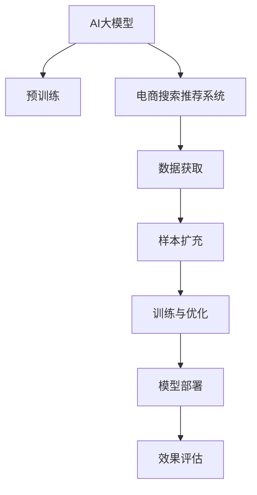

                 

# 电商搜索推荐效果优化中的AI大模型样本扩充技术应用项目管理实践与优化方案

> 关键词：电商搜索、推荐系统、AI大模型、样本扩充技术、项目管理、优化方案

## 1. 背景介绍

在现代社会，电商平台已经成为人们日常生活中不可或缺的一部分。为了提升用户体验，电商平台纷纷引入智能推荐系统，通过分析用户行为数据，向用户推荐感兴趣的商品。然而，推荐系统的性能直接影响到用户的购物体验和电商平台的销售额，因此如何优化推荐效果成为了一项重要研究课题。

近年来，AI大模型技术在自然语言处理、计算机视觉等领域取得了显著进展，并开始被广泛应用于推荐系统。AI大模型可以处理海量数据，通过自监督学习获得丰富的知识，从而提升推荐系统的效果。但是，AI大模型的训练需要大量的标注数据，而标注数据获取成本高且耗时，限制了其在电商推荐系统中的应用。为了解决这一问题，样本扩充技术应运而生，其通过数据增强、合成数据、迁移学习等方法，从少量标注数据中提取更多的信息，提升推荐系统的效果。本文将详细介绍AI大模型在电商推荐系统中的应用，以及样本扩充技术在其中的重要作用。

## 2. 核心概念与联系

### 2.1 核心概念概述

为了更好地理解AI大模型在电商搜索推荐系统中的应用，首先需要明确一些核心概念：

- **AI大模型**：指基于深度学习框架（如TensorFlow、PyTorch）构建的大规模神经网络模型，通常具有数十亿甚至百亿级别的参数。通过在大规模无标注数据上进行预训练，获得丰富的知识表示。

- **电商搜索推荐系统**：指在电商平台上，通过分析用户搜索历史、浏览行为、点击记录等数据，向用户推荐感兴趣的商品的系统。推荐的商品可以是商品名称、图片、价格等。

- **样本扩充技术**：指在有限的标注数据基础上，通过数据增强、合成数据、迁移学习等手段，扩充训练数据集，提升模型性能的技术。

这些概念之间的逻辑关系可以通过以下Mermaid流程图来展示：



这个流程图展示了AI大模型在电商搜索推荐系统中的应用流程：首先通过预训练获得知识表示，然后通过数据获取和样本扩充技术扩充数据集，最后训练优化模型并进行部署评估。

## 3. 核心算法原理 & 具体操作步骤

### 3.1 算法原理概述

AI大模型在电商搜索推荐系统中的应用，主要基于自监督学习原理。具体步骤如下：

1. **数据获取**：从电商平台收集用户搜索历史、浏览行为、点击记录等数据，作为训练样本。

2. **预训练**：使用AI大模型在无标注数据上进行自监督学习，学习通用的知识表示。

3. **样本扩充**：通过数据增强、合成数据、迁移学习等技术，扩充训练数据集。

4. **训练与优化**：在扩充后的训练数据集上，使用AI大模型进行微调，优化推荐系统的效果。

5. **模型部署**：将优化后的模型部署到电商平台上，实时推荐商品给用户。

6. **效果评估**：定期评估推荐系统的效果，进行模型优化和改进。

### 3.2 算法步骤详解

#### 3.2.1 数据获取

电商推荐系统中的数据通常分为用户数据和商品数据。用户数据包括用户的搜索历史、浏览记录、点击行为等，商品数据包括商品名称、图片、价格、描述等。数据的获取方式包括：

- **日志数据**：通过电商平台的用户行为日志，收集用户的搜索、浏览、点击等数据。
- **公开数据集**：使用公开的电商数据集，如Amazon的 datasets、淘宝的商品数据集等。
- **合作伙伴**：与电商平台合作，获取用户和商品数据。

#### 3.2.2 预训练

AI大模型的预训练过程通常包括以下步骤：

- **数据准备**：准备大规模无标注数据，如维基百科、新闻、百科全书等。
- **模型选择**：选择适合的AI大模型，如BERT、GPT-3、DALL-E等。
- **训练过程**：使用大规模无标注数据，进行自监督学习，获得通用的知识表示。
- **验证与优化**：在验证集上评估模型性能，优化模型参数。

#### 3.2.3 样本扩充

样本扩充技术可以通过以下方式实现：

- **数据增强**：对原始数据进行增强，如旋转、裁剪、加噪声等，生成更多的训练样本。
- **合成数据**：使用生成对抗网络（GAN）等技术，生成与真实数据相似的合成数据。
- **迁移学习**：将预训练模型在某个领域进行微调，然后将微调后的模型应用于电商推荐系统。

#### 3.2.4 训练与优化

AI大模型在电商推荐系统中的训练与优化过程包括以下步骤：

- **模型选择**：选择适合的AI大模型，如BERT、GPT-3等。
- **数据预处理**：对用户和商品数据进行清洗、归一化等预处理。
- **模型训练**：在扩充后的训练数据集上，使用AI大模型进行微调，优化推荐系统的效果。
- **超参数调整**：调整学习率、批大小、正则化参数等超参数，进行模型优化。

#### 3.2.5 模型部署

模型部署过程包括以下步骤：

- **模型选择**：选择适合的AI大模型，如BERT、GPT-3等。
- **模型压缩**：对模型进行压缩，减小模型大小，提高推理速度。
- **模型部署**：将优化后的模型部署到电商平台上，实时推荐商品给用户。

#### 3.2.6 效果评估

模型部署后，需要对推荐系统的效果进行评估，包括：

- **准确率**：评估推荐的商品与用户实际购买商品的匹配度。
- **召回率**：评估推荐系统覆盖用户兴趣的广度。
- **用户满意度**：通过用户反馈，评估推荐系统的实际效果。

### 3.3 算法优缺点

AI大模型在电商搜索推荐系统中的应用，具有以下优点：

- **性能优越**：AI大模型可以处理大规模数据，学习丰富的知识表示，提升推荐系统的准确率和召回率。
- **灵活性高**：AI大模型可以根据用户的行为数据，实时调整推荐策略，提升用户体验。
- **可扩展性**：AI大模型可以应用于多个电商平台，具有广泛的适用性。

同时，也存在以下缺点：

- **计算资源消耗大**：AI大模型的训练需要大量的计算资源和存储资源，成本较高。
- **数据隐私风险**：电商平台需要收集大量的用户数据，可能涉及用户隐私问题。
- **过拟合风险**：如果训练数据不足，AI大模型可能出现过拟合现象，导致推荐系统效果下降。

### 3.4 算法应用领域

AI大模型在电商搜索推荐系统中的应用，可以广泛应用于以下领域：

- **个性化推荐**：根据用户的历史行为数据，向用户推荐个性化的商品。
- **商品分类**：对商品进行分类，提升推荐的准确性。
- **广告推荐**：向用户推荐感兴趣的广告，提升广告点击率。
- **情感分析**：分析用户对商品的情感倾向，提升推荐系统的效果。

## 4. 数学模型和公式 & 详细讲解 & 举例说明

### 4.1 数学模型构建

AI大模型在电商搜索推荐系统中的应用，主要基于监督学习和自监督学习的原理。具体数学模型如下：

- **监督学习模型**：假设电商平台上存在$N$个用户，每个用户对应$m$个行为数据，即$D=\{(x_1,y_1),(x_2,y_2),...(x_N,y_N)\}$，其中$x_i$为用户行为数据，$y_i$为用户对商品的评分。使用监督学习模型，学习用户行为与商品评分之间的关系，即$P(y_i|x_i;\theta)$。

- **自监督学习模型**：使用大规模无标注数据$D_{unlabel}$，通过自监督学习任务，如掩码语言模型、图片生成等，学习通用的知识表示，即$P(x_i|D_{unlabel};\theta)$。

### 4.2 公式推导过程

#### 4.2.1 监督学习模型

假设监督学习模型为线性回归模型，则模型的损失函数为：

$$
\mathcal{L}(\theta) = \frac{1}{N}\sum_{i=1}^N (y_i - \hat{y}_i)^2
$$

其中，$\hat{y}_i$为模型对用户行为数据的预测值。

模型的训练目标是最小化损失函数，即：

$$
\theta^* = \mathop{\arg\min}_{\theta} \mathcal{L}(\theta)
$$

#### 4.2.2 自监督学习模型

假设自监督学习任务为掩码语言模型，则模型的损失函数为：

$$
\mathcal{L}_{mask}(\theta) = -\sum_{i=1}^N \sum_{j=1}^m p(y_j|x_i;\theta) \log p(x_i;D_{unlabel},\theta)
$$

其中，$x_i$为用户行为数据，$y_j$为掩码位置的标签，$p(y_j|x_i;\theta)$为模型对掩码位置的预测概率，$p(x_i;D_{unlabel},\theta)$为模型对用户行为数据的预测概率。

模型的训练目标是最小化损失函数，即：

$$
\theta^* = \mathop{\arg\min}_{\theta} \mathcal{L}_{mask}(\theta)
$$

### 4.3 案例分析与讲解

以Amazon推荐系统为例，分析AI大模型在其中的应用：

1. **数据获取**：Amazon平台每天产生大量用户行为数据，包括搜索历史、浏览记录、点击行为等。

2. **预训练**：使用AI大模型BERT在维基百科等无标注数据上进行自监督学习，学习通用的知识表示。

3. **样本扩充**：对原始数据进行增强，如旋转、裁剪、加噪声等，生成更多的训练样本。同时，使用GAN技术生成与真实数据相似的合成数据。

4. **训练与优化**：在扩充后的训练数据集上，使用AI大模型BERT进行微调，优化推荐系统的效果。同时，调整学习率、批大小、正则化参数等超参数，进行模型优化。

5. **模型部署**：将优化后的模型部署到Amazon平台上，实时推荐商品给用户。

6. **效果评估**：定期评估推荐系统的效果，使用准确率、召回率、用户满意度等指标进行评估，进行模型优化和改进。

## 5. 项目实践：代码实例和详细解释说明

### 5.1 开发环境搭建

在进行AI大模型在电商推荐系统中的应用实践前，我们需要准备好开发环境。以下是使用Python进行TensorFlow开发的环境配置流程：

1. 安装Anaconda：从官网下载并安装Anaconda，用于创建独立的Python环境。

2. 创建并激活虚拟环境：
```bash
conda create -n tf-env python=3.8 
conda activate tf-env
```

3. 安装TensorFlow：根据CUDA版本，从官网获取对应的安装命令。例如：
```bash
conda install tensorflow -c pytorch -c conda-forge
```

4. 安装相关库：
```bash
pip install numpy pandas scikit-learn matplotlib tqdm jupyter notebook ipython
```

完成上述步骤后，即可在`tf-env`环境中开始项目实践。

### 5.2 源代码详细实现

下面我们以BERT模型在Amazon推荐系统中的应用为例，给出TensorFlow代码实现。

首先，定义BERT模型：

```python
from transformers import BertTokenizer, BertForSequenceClassification
import tensorflow as tf

tokenizer = BertTokenizer.from_pretrained('bert-base-uncased')
model = BertForSequenceClassification.from_pretrained('bert-base-uncased', num_labels=1)

@tf.function
def predict(user_input):
    inputs = tokenizer(user_input, return_tensors='tf')
    with tf.GradientTape() as tape:
        logits = model(inputs['input_ids'], attention_mask=inputs['attention_mask'])
    loss = tf.keras.losses.MeanSquaredError()(y_true=labels, y_pred=logits)
    return loss
```

然后，定义训练函数：

```python
def train_epoch(user_input, labels, optimizer, learning_rate):
    optimizer.learning_rate.assign(learning_rate)
    with tf.GradientTape() as tape:
        loss = predict(user_input)
    gradients = tape.gradient(loss, model.trainable_variables)
    optimizer.apply_gradients(zip(gradients, model.trainable_variables))
    return loss
```

接着，定义训练循环：

```python
for epoch in range(num_epochs):
    total_loss = 0
    for user_input, labels in train_dataset:
        loss = train_epoch(user_input, labels, optimizer, learning_rate)
        total_loss += loss.numpy()
    print(f"Epoch {epoch+1}, training loss: {total_loss/len(train_dataset)}")
```

最后，在测试集上评估模型：

```python
def evaluate(user_input, labels):
    predictions = predict(user_input)
    accuracy = tf.keras.metrics.Accuracy()(labels, predictions)
    return accuracy

for user_input, labels in test_dataset:
    accuracy = evaluate(user_input, labels)
    print(f"Accuracy: {accuracy.numpy()}")
```

以上就是使用TensorFlow对BERT进行Amazon推荐系统微调的完整代码实现。可以看到，TensorFlow提供了丰富的API和工具，可以方便地进行模型的训练和评估。

### 5.3 代码解读与分析

让我们再详细解读一下关键代码的实现细节：

**BertTokenizer类**：
- `__init__`方法：初始化分词器，选择预训练模型。
- `from_pretrained`方法：从预训练模型中加载分词器。

**BertForSequenceClassification类**：
- `__init__`方法：初始化分类模型，指定输出标签数。
- `from_pretrained`方法：从预训练模型中加载分类模型。

**predict函数**：
- 对输入数据进行分词和编码。
- 使用模型对编码后的输入进行预测，计算损失函数。
- 返回损失函数值。

**train_epoch函数**：
- 设置学习率。
- 对模型进行前向传播，计算损失函数。
- 反向传播计算梯度。
- 使用优化器更新模型参数。

**训练循环**：
- 对每个epoch，循环遍历训练集。
- 计算每个batch的损失函数，累加总损失。
- 输出每个epoch的平均损失函数值。

**evaluate函数**：
- 对输入数据进行预测，计算准确率。
- 返回准确率值。

可以看到，TensorFlow的代码实现相对简洁高效，可以轻松地进行模型训练和评估。

## 6. 实际应用场景

### 6.1 智能推荐系统

智能推荐系统是AI大模型在电商推荐系统中的应用最为广泛的领域之一。智能推荐系统可以实时分析用户行为数据，向用户推荐感兴趣的商品，提升用户购物体验和电商平台销售额。

### 6.2 广告推荐系统

广告推荐系统可以向用户推荐感兴趣的广告，提升广告点击率和转化率。通过AI大模型对用户行为数据的分析，可以实现精准的广告投放，降低广告投放成本。

### 6.3 商品分类系统

商品分类系统可以自动对商品进行分类，提升推荐的准确性。通过AI大模型对商品图片、描述等数据的分析，可以自动识别商品类别，方便电商平台的商品管理。

## 7. 工具和资源推荐

### 7.1 学习资源推荐

为了帮助开发者系统掌握AI大模型在电商推荐系统中的应用，这里推荐一些优质的学习资源：

1. 《TensorFlow官方文档》：TensorFlow官方文档，包含丰富的API文档和示例代码，适合初学者和中级开发者学习。

2. 《Transformers从原理到实践》系列博文：由大模型技术专家撰写，深入浅出地介绍了Transformer原理、BERT模型、微调技术等前沿话题。

3. 《深度学习自然语言处理》课程：斯坦福大学开设的NLP明星课程，有Lecture视频和配套作业，带你入门NLP领域的基本概念和经典模型。

4. 《Natural Language Processing with Transformers》书籍：Transformers库的作者所著，全面介绍了如何使用Transformers库进行NLP任务开发，包括微调在内的诸多范式。

5. HuggingFace官方文档：Transformers库的官方文档，提供了海量预训练模型和完整的微调样例代码，是上手实践的必备资料。

通过对这些资源的学习实践，相信你一定能够快速掌握AI大模型在电商推荐系统中的应用，并用于解决实际的电商推荐问题。

### 7.2 开发工具推荐

高效的开发离不开优秀的工具支持。以下是几款用于AI大模型在电商推荐系统中的应用开发的常用工具：

1. TensorFlow：由Google主导开发的开源深度学习框架，生产部署方便，适合大规模工程应用。

2. PyTorch：基于Python的开源深度学习框架，灵活动态的计算图，适合快速迭代研究。

3. HuggingFace Transformers库：提供了丰富的预训练模型和微调方法，是进行NLP任务开发的利器。

4. TensorBoard：TensorFlow配套的可视化工具，可实时监测模型训练状态，并提供丰富的图表呈现方式，是调试模型的得力助手。

5. Weights & Biases：模型训练的实验跟踪工具，可以记录和可视化模型训练过程中的各项指标，方便对比和调优。

合理利用这些工具，可以显著提升AI大模型在电商推荐系统中的开发效率，加快创新迭代的步伐。

### 7.3 相关论文推荐

AI大模型和电商推荐系统的研究源于学界的持续研究。以下是几篇奠基性的相关论文，推荐阅读：

1. Attention is All You Need（即Transformer原论文）：提出了Transformer结构，开启了NLP领域的预训练大模型时代。

2. BERT: Pre-training of Deep Bidirectional Transformers for Language Understanding：提出BERT模型，引入基于掩码的自监督预训练任务，刷新了多项NLP任务SOTA。

3. Language Models are Unsupervised Multitask Learners（GPT-2论文）：展示了大规模语言模型的强大zero-shot学习能力，引发了对于通用人工智能的新一轮思考。

4. Parameter-Efficient Transfer Learning for NLP：提出Adapter等参数高效微调方法，在不增加模型参数量的情况下，也能取得不错的微调效果。

5. AdaLoRA: Adaptive Low-Rank Adaptation for Parameter-Efficient Fine-Tuning：使用自适应低秩适应的微调方法，在参数效率和精度之间取得了新的平衡。

这些论文代表了大模型在电商推荐系统中的应用的发展脉络。通过学习这些前沿成果，可以帮助研究者把握学科前进方向，激发更多的创新灵感。

## 8. 总结：未来发展趋势与挑战

### 8.1 总结

本文对AI大模型在电商推荐系统中的应用进行了全面系统的介绍。首先阐述了AI大模型和电商推荐系统的研究背景和意义，明确了AI大模型在电商推荐系统中的应用范式。其次，从原理到实践，详细讲解了AI大模型在电商推荐系统中的应用过程，包括数据获取、预训练、样本扩充、训练与优化、模型部署、效果评估等环节。同时，本文还广泛探讨了AI大模型在电商推荐系统中的应用场景，展示了AI大模型的巨大潜力。

通过本文的系统梳理，可以看到，AI大模型在电商推荐系统中的应用，能够处理海量数据，提升推荐系统的效果，具有广泛的应用前景。未来，伴随AI大模型和推荐系统技术的不断进步，相信电商推荐系统必将迎来更加智能化、普适化应用，为电商行业的数字化转型升级提供新的技术路径。

### 8.2 未来发展趋势

展望未来，AI大模型在电商推荐系统中的应用将呈现以下几个发展趋势：

1. **计算资源更加丰富**：随着算力成本的下降和硬件设备的不断更新，AI大模型的训练和推理速度将显著提升，处理大规模数据的效率将大幅提高。

2. **数据质量更加精细**：电商平台将更加重视用户数据的收集和处理，通过数据清洗、标注等手段，提升数据质量，降低数据噪音，提升推荐系统的效果。

3. **推荐系统更加个性化**：通过AI大模型对用户行为数据的深入分析，推荐系统将更加个性化，提升用户购物体验。

4. **推荐系统更加多样化**：电商平台将引入更多类型的推荐系统，如基于内容的推荐、基于社交的推荐等，提升推荐系统的多样性。

5. **推荐系统更加智能**：AI大模型将结合自然语言处理、计算机视觉等技术，提升推荐系统的智能化水平，支持更加复杂的推荐任务。

以上趋势凸显了AI大模型在电商推荐系统中的应用前景。这些方向的探索发展，必将进一步提升电商推荐系统的性能和应用范围，为电商行业的数字化转型升级提供新的技术路径。

### 8.3 面临的挑战

尽管AI大模型在电商推荐系统中的应用已经取得了显著成效，但在迈向更加智能化、普适化应用的过程中，它仍面临着诸多挑战：

1. **数据隐私问题**：电商平台需要收集大量的用户数据，可能涉及用户隐私问题。如何保护用户数据隐私，是电商平台面临的重要挑战。

2. **模型复杂度问题**：AI大模型参数量庞大，模型复杂度较高，推理速度较慢，对硬件设备要求较高。如何简化模型结构，提高推理速度，优化资源占用，将是重要的优化方向。

3. **过拟合问题**：AI大模型面临过拟合的风险，特别是在训练数据不足的情况下。如何降低过拟合风险，提升模型泛化能力，仍是一个重要问题。

4. **公平性和透明性问题**：AI大模型的决策过程缺乏可解释性，可能存在不公平、透明性不足的问题。如何提升模型透明度，增强用户信任，是电商平台面临的重要课题。

5. **安全性问题**：AI大模型可能被恶意利用，进行虚假广告推荐、欺诈行为等。如何保障模型安全性，防止恶意攻击，是电商平台的重要任务。

6. **数据动态变化问题**：电商平台需要不断更新数据，以保证推荐系统的效果。如何动态更新数据，适应数据变化，是电商平台面临的重要问题。

正视AI大模型在电商推荐系统中的应用面临的这些挑战，积极应对并寻求突破，将是大模型技术走向成熟的必由之路。相信随着学界和产业界的共同努力，这些挑战终将一一被克服，AI大模型在电商推荐系统中的应用必将在构建人机协同的智能时代中扮演越来越重要的角色。

### 8.4 未来突破

面对AI大模型在电商推荐系统中的应用所面临的种种挑战，未来的研究需要在以下几个方面寻求新的突破：

1. **优化数据收集和处理**：通过数据增强、数据清洗、标注等手段，提升数据质量，降低数据噪音，提升推荐系统的效果。

2. **优化模型结构**：通过模型压缩、稀疏化存储等手段，简化模型结构，提高推理速度，优化资源占用。

3. **优化推荐算法**：通过引入自然语言处理、计算机视觉等技术，提升推荐系统的智能化水平，支持更加复杂的推荐任务。

4. **提升模型透明性和可解释性**：通过引入因果分析方法、对比学习等手段，提升模型透明度，增强用户信任。

5. **提升模型安全性**：通过引入安全性约束、审计机制等手段，保障模型安全性，防止恶意攻击。

6. **优化数据动态更新**：通过增量学习、在线学习等手段，动态更新数据，适应数据变化，提升推荐系统效果。

这些研究方向的探索，必将引领AI大模型在电商推荐系统中的应用迈向更高的台阶，为电商行业的数字化转型升级提供新的技术路径。面向未来，AI大模型在电商推荐系统中的应用需要与其他人工智能技术进行更深入的融合，如知识表示、因果推理、强化学习等，多路径协同发力，共同推动自然语言理解和智能交互系统的进步。只有勇于创新、敢于突破，才能不断拓展语言模型的边界，让智能技术更好地造福人类社会。

## 9. 附录：常见问题与解答

**Q1：如何优化电商推荐系统的推荐效果？**

A: 电商推荐系统的推荐效果可以通过以下方式进行优化：

1. **数据优化**：通过数据增强、数据清洗、标注等手段，提升数据质量，降低数据噪音，提升推荐系统的效果。

2. **模型优化**：通过模型压缩、稀疏化存储等手段，简化模型结构，提高推理速度，优化资源占用。

3. **算法优化**：通过引入自然语言处理、计算机视觉等技术，提升推荐系统的智能化水平，支持更加复杂的推荐任务。

4. **评估优化**：通过引入多种评估指标，如准确率、召回率、用户满意度等，全面评估推荐系统的效果，进行模型优化和改进。

5. **用户体验优化**：通过提升推荐系统的个性化、多样性和智能化水平，提升用户购物体验。

**Q2：AI大模型在电商推荐系统中面临哪些挑战？**

A: AI大模型在电商推荐系统中面临以下挑战：

1. **数据隐私问题**：电商平台需要收集大量的用户数据，可能涉及用户隐私问题。如何保护用户数据隐私，是电商平台面临的重要挑战。

2. **模型复杂度问题**：AI大模型参数量庞大，模型复杂度较高，推理速度较慢，对硬件设备要求较高。如何简化模型结构，提高推理速度，优化资源占用，将是重要的优化方向。

3. **过拟合问题**：AI大模型面临过拟合的风险，特别是在训练数据不足的情况下。如何降低过拟合风险，提升模型泛化能力，仍是一个重要问题。

4. **公平性和透明性问题**：AI大模型的决策过程缺乏可解释性，可能存在不公平、透明性不足的问题。如何提升模型透明度，增强用户信任，是电商平台面临的重要课题。

5. **安全性问题**：AI大模型可能被恶意利用，进行虚假广告推荐、欺诈行为等。如何保障模型安全性，防止恶意攻击，是电商平台的重要任务。

6. **数据动态变化问题**：电商平台需要不断更新数据，以保证推荐系统的效果。如何动态更新数据，适应数据变化，是电商平台面临的重要问题。

**Q3：如何选择适合电商推荐系统的AI大模型？**

A: 选择适合电商推荐系统的AI大模型，需要考虑以下因素：

1. **数据规模**：AI大模型的参数量越大，其学习能力和表现能力越强，但训练和推理资源消耗也越高。需要根据数据规模选择合适的模型。

2. **任务类型**：不同任务类型需要不同类型的AI大模型。例如，推荐系统通常选择BERT等序列模型，而图像推荐系统通常选择DALL-E等生成模型。

3. **性能要求**：根据推荐系统的性能要求，选择合适的AI大模型。例如，需要高准确率、高召回率的任务，需要选择BERT等模型。

4. **资源限制**：考虑硬件设备的资源限制，选择适合硬件设备的AI大模型。例如，需要高性能设备的推荐系统，可以选择GPU等硬件设备支持的模型。

5. **可解释性要求**：根据推荐系统对模型透明性和可解释性的要求，选择适合的AI大模型。例如，需要透明性和可解释性的推荐系统，可以选择LSTM等可解释性较高的模型。

**Q4：如何进行电商推荐系统的数据扩充？**

A: 电商推荐系统的数据扩充可以通过以下方式实现：

1. **数据增强**：对原始数据进行增强，如旋转、裁剪、加噪声等，生成更多的训练样本。

2. **合成数据**：使用生成对抗网络（GAN）等技术，生成与真实数据相似的合成数据。

3. **迁移学习**：将预训练模型在某个领域进行微调，然后将微调后的模型应用于电商推荐系统。

4. **知识图谱**：通过引入知识图谱，增强推荐系统的知识表示能力，提升推荐系统的效果。

5. **多模态数据融合**：将图像、语音、视频等模态数据与文本数据融合，提升推荐系统的多模态分析能力。

通过这些方法，可以最大化地利用有限的数据资源，提升推荐系统的效果。

**Q5：如何进行电商推荐系统的模型训练？**

A: 电商推荐系统的模型训练包括以下步骤：

1. **数据预处理**：对用户和商品数据进行清洗、归一化等预处理。

2. **模型选择**：选择适合的AI大模型，如BERT、GPT-3等。

3. **数据扩充**：通过数据增强、合成数据、迁移学习等技术，扩充训练数据集。

4. **模型训练**：在扩充后的训练数据集上，使用AI大模型进行微调，优化推荐系统的效果。

5. **超参数调整**：调整学习率、批大小、正则化参数等超参数，进行模型优化。

6. **模型评估**：定期评估推荐系统的效果，进行模型优化和改进。

通过这些步骤，可以实现电商推荐系统的模型训练和优化。

---

作者：禅与计算机程序设计艺术 / Zen and the Art of Computer Programming

