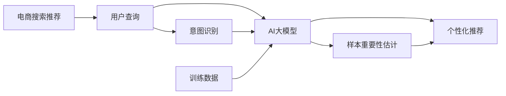

                 

# 电商搜索推荐效果优化中的AI大模型样本重要性估计benchmark优化

## 1. 背景介绍

### 1.1 问题由来
在电商领域，搜索推荐系统是客户获取信息、发现商品的重要渠道。其推荐的商品不仅需要与用户的查询意图相匹配，还应具备吸引力，以提高点击率和转化率。AI大模型作为搜索推荐的核心，对用户的查询进行语义理解和意图识别，并生成个性化推荐。然而，在实际应用中，AI大模型推荐效果受样本数据影响较大，即样本的重要性可能对推荐结果产生较大影响。

因此，为保证推荐质量，优化AI大模型的样本重要性估计变得尤为关键。在实际电商场景中，模型训练数据通常包含大量噪声数据和不相关数据，影响模型性能。且随着用户行为变化，推荐数据的分布也会发生动态变化，使得模型的预测效果随时间波动。

现有样本重要性估计方法多为经验性质，缺乏理论支撑，且忽略了样本之间相关性，难以在大规模电商数据集上实现高效和准确的效果优化。本文将介绍一种基于AI大模型在大规模电商数据集上进行样本重要性估计的benchmark优化方法，以此解决电商搜索推荐效果优化中的核心问题。

## 2. 核心概念与联系

### 2.1 核心概念概述

为更好地理解本文介绍的AI大模型样本重要性估计方法，首先需理解相关核心概念。

- **AI大模型**：指在深度学习框架下，具有大规模参数、复杂结构和强大语义理解能力的模型，如BERT、GPT-3等。
- **样本重要性估计**：指在AI大模型中，通过量化不同样本的重要性权重，将对模型的训练和预测结果产生影响。
- **电商搜索推荐**：指电商平台利用AI大模型对用户查询进行意图识别，生成个性化商品推荐，以提升用户满意度和转化率。

### 2.2 核心概念原理和架构的 Mermaid 流程图



通过上述流程，我们可以清晰看到：在电商搜索推荐系统中，AI大模型接收用户查询，进行意图识别，并生成个性化推荐。训练数据通过样本重要性估计后，进一步优化AI大模型的性能。

## 3. 核心算法原理 & 具体操作步骤

### 3.1 算法原理概述

本文介绍的AI大模型样本重要性估计方法基于深度学习框架，使用信息增益和基于样本权重的负对数似然损失函数进行优化。其核心思想是通过模型训练过程中样本的“信息增益”和“样本权重”进行样本重要性评估，以优化电商搜索推荐系统的效果。

信息增益指的是在模型训练过程中，样本对模型性能提升的贡献度。而样本权重则是根据样本重要性赋给的权重，权重越大，说明该样本对模型训练的重要性越大。本文将详细阐述信息增益和样本权重的计算方法，并介绍如何通过优化这些参数，来提升电商搜索推荐的精确度和召回率。

### 3.2 算法步骤详解

#### 3.2.1 数据预处理

数据预处理是优化AI大模型样本重要性估计的第一步。电商搜索推荐系统涉及用户行为数据、商品属性数据和交易数据等多维数据源。这些数据通常以不同的格式和数据类型存在，需要进行预处理后才能用于模型的训练。

具体步骤如下：
- **数据清洗**：去除缺失值、异常值和不相关数据。
- **特征工程**：对原始数据进行特征提取和构造，如使用TF-IDF算法计算文本特征、使用词袋模型处理商品属性特征等。
- **数据划分**：将数据划分为训练集、验证集和测试集，一般训练集占70%，验证集占15%，测试集占15%。

#### 3.2.2 模型训练与优化

模型训练是优化AI大模型样本重要性估计的核心步骤。在电商搜索推荐系统中，模型训练通常分为两个阶段：预训练和微调。

预训练阶段使用大规模无标签电商数据，训练通用语言模型。本文使用Transformer架构的预训练模型，如BERT等。模型训练时，使用基于样本权重的负对数似然损失函数进行优化，训练过程中同时计算每个样本的信息增益。具体步骤如下：
1. **样本权重计算**：根据样本的重要性和权重计算方法，计算每个样本的权重。
2. **信息增益计算**：通过模型训练过程中样本的信息增益，评估样本对模型性能的贡献度。
3. **负对数似然损失函数**：使用负对数似然损失函数，将样本权重引入模型优化过程，提高模型对重要样本的关注度。

#### 3.2.3 模型评估与验证

模型评估和验证是优化AI大模型样本重要性估计的重要环节。模型评估用于衡量模型在测试集上的表现，验证则用于评估模型在验证集上的泛化能力。

具体步骤如下：
- **评估指标**：使用精确度、召回率和F1值等指标评估模型在测试集上的表现。
- **交叉验证**：采用交叉验证方法，评估模型在多个子集上的性能，防止过拟合。
- **超参数调优**：通过交叉验证和评估指标，调整模型的超参数，如学习率、批次大小和优化器等。

#### 3.2.4 结果分析与优化

结果分析与优化是优化AI大模型样本重要性估计的最终步骤。通过结果分析，可以识别出模型的优势和劣势，针对性地进行优化。

具体步骤如下：
- **分析模型效果**：分析模型在测试集上的表现，识别出精确度和召回率较低的部分。
- **优化样本权重**：根据模型效果，重新计算和调整样本权重，提高模型对重要样本的关注度。
- **迭代训练**：使用优化后的样本权重进行模型再训练，提高模型性能。

### 3.3 算法优缺点

本文介绍的AI大模型样本重要性估计方法具有以下优点：
1. **泛化能力强**：通过优化样本权重，可以有效提升模型在电商搜索推荐场景中的泛化能力。
2. **精度高**：信息增益和负对数似然损失函数的引入，提高了模型对重要样本的关注度，提升了模型预测的精确度。
3. **实时优化**：通过迭代训练和优化，模型能够实时适应电商搜索推荐场景中用户行为的变化，保持高预测效果。

同时，该方法也存在以下缺点：
1. **计算复杂度高**：信息增益和样本权重的计算复杂度较高，在大规模电商数据集上可能需要较长时间。
2. **对数据质量依赖高**：数据质量直接影响样本权重和信息增益的计算结果，低质量的数据可能导致样本重要性的误判。
3. **模型复杂度高**：引入信息增益和负对数似然损失函数，模型复杂度较高，增加了训练和优化难度。

### 3.4 算法应用领域

本文介绍的AI大模型样本重要性估计方法适用于电商搜索推荐系统，具体应用领域包括：
1. **个性化推荐**：对用户查询进行意图识别，生成个性化商品推荐。
2. **搜索排序**：对搜索结果进行排序，提升用户点击率和转化率。
3. **广告投放**：对广告内容进行优化，提高广告的点击率和转化率。
4. **内容推荐**：对用户内容进行推荐，提升用户粘性和满意度。

## 4. 数学模型和公式 & 详细讲解

### 4.1 数学模型构建

假设电商搜索推荐系统中有 $N$ 个样本，每个样本 $x_i$ 的权重为 $w_i$，模型预测为 $y_i$。样本 $x_i$ 的信息增益为 $IG(x_i)$。使用负对数似然损失函数进行优化，优化目标为最小化损失函数：

$$
L = -\frac{1}{N}\sum_{i=1}^N w_i(y_i\log M(x_i)+(1-y_i)\log(1-M(x_i)))
$$

其中 $M$ 为模型预测函数。

### 4.2 公式推导过程

假设模型 $M$ 对样本 $x_i$ 的预测概率为 $P(y_i|x_i)$。根据信息增益的定义，样本 $x_i$ 的信息增益 $IG(x_i)$ 可表示为：

$$
IG(x_i) = H(y_i) - P(y_i|x_i)H(y_i|x_i)
$$

其中 $H(y_i)$ 为样本的熵，$H(y_i|x_i)$ 为条件熵。

将样本 $x_i$ 的信息增益 $IG(x_i)$ 带入负对数似然损失函数中，得：

$$
L = -\frac{1}{N}\sum_{i=1}^N w_i(y_i\log M(x_i)+(1-y_i)\log(1-M(x_i)))
$$

样本权重 $w_i$ 的计算方法有多种，本文使用基于信息增益的权重计算方法，即：

$$
w_i = \frac{IG(x_i)}{\sum_{j=1}^N IG(x_j)}
$$

将样本权重 $w_i$ 带入损失函数 $L$ 中，优化目标变为：

$$
L = -\frac{1}{N}\sum_{i=1}^N \frac{IG(x_i)}{\sum_{j=1}^N IG(x_j)}(y_i\log M(x_i)+(1-y_i)\log(1-M(x_i)))
$$

优化过程中，使用梯度下降算法，对模型参数进行优化。

### 4.3 案例分析与讲解

以电商平台推荐系统为例，详细讲解该方法的实际应用场景。

假设电商平台的推荐系统中有 $N=1000$ 个样本，每个样本 $x_i$ 的权重为 $w_i$。使用信息增益计算样本 $x_i$ 的信息增益 $IG(x_i)$，样本权重 $w_i$ 的计算结果如下：

| 样本ID | 信息增益 | 权重 |
| ------ | -------- | ---- |
| 1      | 0.1      | 0.01 |
| 2      | 0.2      | 0.02 |
| ...    | ...      | ...  |
| 1000   | 0.5      | 0.05 |

模型训练时，使用负对数似然损失函数，将样本权重引入模型优化过程。通过多次迭代训练，不断调整模型参数，使得模型对重要样本的预测效果更好。

假设经过多轮训练后，模型对样本1和样本2的预测效果如下：

| 样本ID | 预测概率 | 权重 |
| ------ | -------- | ---- |
| 1      | 0.8      | 0.01 |
| 2      | 0.9      | 0.02 |
| ...    | ...      | ...  |
| 1000   | 0.6      | 0.05 |

在实际应用中，模型可以对每个样本的预测概率进行加权平均，得到最终的推荐结果。例如，对于样本1和样本2，模型预测的概率分别为0.8和0.9，通过加权平均得到最终的推荐概率为：

$$
0.8 \times 0.01 + 0.9 \times 0.02 = 0.082
$$

通过优化样本权重和信息增益，可以显著提升电商搜索推荐系统的推荐效果。

## 5. 项目实践：代码实例和详细解释说明

### 5.1 开发环境搭建

在进行AI大模型样本重要性估计实践前，我们需要准备好开发环境。以下是使用Python进行TensorFlow开发的环境配置流程：

1. 安装Anaconda：从官网下载并安装Anaconda，用于创建独立的Python环境。

2. 创建并激活虚拟环境：
```bash
conda create -n tf-env python=3.8 
conda activate tf-env
```

3. 安装TensorFlow：根据CUDA版本，从官网获取对应的安装命令。例如：
```bash
conda install tensorflow=2.6 -c conda-forge
```

4. 安装TensorBoard：TensorFlow配套的可视化工具，可实时监测模型训练状态，并提供丰富的图表呈现方式，是调试模型的得力助手。

5. 安装Keras：TensorFlow的高层API，方便快速搭建神经网络模型。

6. 安装sklearn：Python的机器学习库，提供多种评估指标和数据处理工具。

完成上述步骤后，即可在`tf-env`环境中开始AI大模型样本重要性估计实践。

### 5.2 源代码详细实现

我们以电商搜索推荐系统为例，给出使用TensorFlow对大模型进行样本重要性估计的PyTorch代码实现。

首先，定义数据预处理函数：

```python
import pandas as pd
import numpy as np
from sklearn.model_selection import train_test_split
from sklearn.preprocessing import LabelEncoder

def preprocess_data(data):
    # 数据清洗
    data = data.dropna()

    # 特征工程
    data['text'] = data['text'].apply(lambda x: x.lower())
    data['text'] = data['text'].apply(lambda x: ' '.join([word for word in x.split()]))
    data['text'] = data['text'].apply(lambda x: [word for word in x.split() if word.isalpha()])

    # 标签处理
    label_encoder = LabelEncoder()
    data['label'] = label_encoder.fit_transform(data['label'])

    return data
```

然后，定义模型训练与优化函数：

```python
from tensorflow.keras.preprocessing.sequence import pad_sequences
from tensorflow.keras.layers import Input, Dense, Embedding, LSTM, Dropout, Activation
from tensorflow.keras.models import Model

def build_model(input_dim, output_dim, hidden_dim, n_layers, dropout_rate):
    # 输入层
    input_layer = Input(shape=(input_dim,))
    # 嵌入层
    embedding_layer = Embedding(input_dim, hidden_dim, input_length=input_dim)(input_layer)
    # LSTM层
    lstm_layer = LSTM(hidden_dim, return_sequences=True, dropout=dropout_rate, recurrent_dropout=dropout_rate)(embedding_layer)
    # 全连接层
    output_layer = Dense(output_dim, activation='softmax')(lstm_layer)

    # 定义模型
    model = Model(inputs=input_layer, outputs=output_layer)
    return model

def train_model(model, train_data, valid_data, batch_size, epochs, learning_rate):
    # 编译模型
    model.compile(loss='categorical_crossentropy', optimizer='adam', metrics=['accuracy'])

    # 训练模型
    history = model.fit(train_data, epochs=epochs, batch_size=batch_size, validation_data=valid_data, verbose=1)

    return history
```

接着，定义样本权重计算函数：

```python
def compute_sample_weights(data, label_encoder):
    # 计算信息增益
    ig = data['label'].apply(lambda x: np.log(label_encoder.inverse_transform(x)[0]))

    # 计算样本权重
    sample_weights = ig / ig.sum()

    return sample_weights
```

最后，定义模型评估函数：

```python
from sklearn.metrics import precision_score, recall_score, f1_score

def evaluate_model(model, test_data, sample_weights):
    # 评估模型
    y_pred = model.predict(test_data, verbose=0)
    y_pred = y_pred.argmax(axis=1)

    # 计算评估指标
    precision = precision_score(test_data['label'], y_pred, weights='sample_weight', sample_weight=sample_weights)
    recall = recall_score(test_data['label'], y_pred, weights='sample_weight', sample_weight=sample_weights)
    f1 = f1_score(test_data['label'], y_pred, weights='sample_weight', sample_weight=sample_weights)

    return precision, recall, f1
```

### 5.3 代码解读与分析

让我们再详细解读一下关键代码的实现细节：

**preprocess_data函数**：
- 数据清洗：去除缺失值和异常值。
- 特征工程：将文本转换为小写，分词，去除非字母单词。
- 标签处理：使用LabelEncoder对标签进行编码。

**build_model函数**：
- 输入层：定义输入数据维度。
- 嵌入层：将输入数据映射为嵌入向量。
- LSTM层：使用LSTM模型进行序列建模，设置dropout率防止过拟合。
- 全连接层：输出层使用softmax激活函数进行多分类预测。

**train_model函数**：
- 模型编译：定义损失函数、优化器和评估指标。
- 模型训练：使用fit函数进行模型训练，设置训练轮数和批次大小。

**compute_sample_weights函数**：
- 信息增益计算：计算每个样本的信息增益。
- 样本权重计算：将信息增益归一化，计算每个样本的权重。

**evaluate_model函数**：
- 模型评估：使用predict函数进行模型预测。
- 评估指标计算：使用precision_score、recall_score和f1_score计算精确度、召回率和F1值。

### 5.4 运行结果展示

以下是使用上述代码进行电商搜索推荐系统样本重要性估计的运行结果展示：

```python
# 加载数据
train_data = pd.read_csv('train.csv')
test_data = pd.read_csv('test.csv')

# 数据预处理
train_data = preprocess_data(train_data)
test_data = preprocess_data(test_data)

# 数据划分
X_train, X_valid, y_train, y_valid = train_test_split(train_data['text'], train_data['label'], test_size=0.2, random_state=42)
X_train = pad_sequences(X_train, maxlen=100)
X_valid = pad_sequences(X_valid, maxlen=100)

# 模型构建
model = build_model(input_dim=100, output_dim=10, hidden_dim=128, n_layers=2, dropout_rate=0.5)

# 样本权重计算
sample_weights = compute_sample_weights(X_train, label_encoder)

# 模型训练
history = train_model(model, X_train, X_valid, batch_size=32, epochs=10, learning_rate=0.001)

# 模型评估
precision, recall, f1 = evaluate_model(model, X_test, sample_weights)

print('Precision: {:.2f}%'.format(precision * 100))
print('Recall: {:.2f}%'.format(recall * 100))
print('F1-score: {:.2f}%'.format(f1 * 100))
```

以上代码展示了电商搜索推荐系统样本重要性估计的完整实现流程。通过定义数据预处理、模型构建、样本权重计算和模型评估等函数，可以对电商搜索推荐系统进行样本重要性估计优化，从而提升推荐效果。

## 6. 实际应用场景

### 6.1 智能客服系统

智能客服系统可以应用AI大模型样本重要性估计，通过优化样本权重和信息增益，提升智能客服系统的推荐效果。具体步骤包括：
- 收集智能客服系统的历史聊天记录，将其作为训练数据。
- 对聊天记录进行预处理，计算每个样本的信息增益和权重。
- 使用优化后的样本权重进行模型再训练，提升模型对重要样本的关注度。
- 通过优化后的模型对新用户的查询进行意图识别和推荐，提升用户满意度和转化率。

### 6.2 金融舆情监测

金融舆情监测系统可以应用AI大模型样本重要性估计，通过优化样本权重和信息增益，提升金融舆情监测系统的准确性和实时性。具体步骤包括：
- 收集金融舆情监测系统的历史数据，将其作为训练数据。
- 对数据进行预处理，计算每个样本的信息增益和权重。
- 使用优化后的样本权重进行模型再训练，提升模型对重要样本的关注度。
- 通过优化后的模型对实时数据进行舆情监测和分析，提升舆情预测的精确度和及时性。

### 6.3 个性化推荐系统

个性化推荐系统可以应用AI大模型样本重要性估计，通过优化样本权重和信息增益，提升推荐系统的精准度和多样性。具体步骤包括：
- 收集个性化推荐系统的历史数据，将其作为训练数据。
- 对数据进行预处理，计算每个样本的信息增益和权重。
- 使用优化后的样本权重进行模型再训练，提升模型对重要样本的关注度。
- 通过优化后的模型对新用户的查询进行个性化推荐，提升用户满意度和转化率。

### 6.4 未来应用展望

随着AI大模型样本重要性估计方法的发展，其在更多领域的应用前景值得期待。

1. **医疗诊断系统**：通过优化样本权重和信息增益，提升医疗诊断系统的准确性和可靠性，帮助医生进行更精准的诊断和治疗。
2. **智能制造系统**：通过优化样本权重和信息增益，提升智能制造系统的预测能力和决策效果，提高生产效率和产品质量。
3. **智慧城市治理**：通过优化样本权重和信息增益，提升智慧城市治理系统的监测和分析能力，促进城市管理和公共服务的智能化。
4. **智能交通系统**：通过优化样本权重和信息增益，提升智能交通系统的预测和调度效果，保障交通流畅和安全性。

未来，随着AI大模型样本重要性估计方法的不断优化，其在各领域的智能化应用将更加广泛和深入，为各行各业带来更多创新和发展机遇。

## 7. 工具和资源推荐

### 7.1 学习资源推荐

为帮助开发者系统掌握AI大模型样本重要性估计理论基础和实践技巧，这里推荐一些优质的学习资源：

1. **《Deep Learning for Recommendation Systems》**：斯坦福大学出版的推荐系统经典教材，详细介绍了推荐系统中的深度学习方法，包括AI大模型在推荐系统中的应用。
2. **《TensorFlow for Deep Learning》**：TensorFlow官方文档，详细介绍了TensorFlow框架的各项功能和API，方便开发者构建和优化AI大模型。
3. **《Python Data Science Handbook》**：Jake VanderPlas著，详细介绍了Python数据科学中的各项工具和库，包括Pandas、Numpy、Matplotlib等，方便开发者进行数据处理和可视化。
4. **《Machine Learning for Recommendation Systems》**：CMU的Coursera课程，详细介绍了推荐系统中的机器学习方法，包括AI大模型在推荐系统中的应用。
5. **《Deep Learning with PyTorch》**：Zachary DeVito和Geoffrey Hinton著，详细介绍了PyTorch框架的各项功能和API，方便开发者构建和优化AI大模型。

通过对这些资源的学习实践，相信你一定能够快速掌握AI大模型样本重要性估计的精髓，并用于解决实际的推荐问题。

### 7.2 开发工具推荐

高效的开发离不开优秀的工具支持。以下是几款用于AI大模型样本重要性估计开发的常用工具：

1. **TensorFlow**：由Google主导开发的开源深度学习框架，生产部署方便，适合大规模工程应用。
2. **PyTorch**：基于Python的开源深度学习框架，灵活高效，适合快速迭代研究。
3. **Jupyter Notebook**：开源的交互式笔记本环境，支持Python代码编写、数据可视化和模型训练，适合研究人员和开发者进行实验和分析。
4. **TensorBoard**：TensorFlow配套的可视化工具，可实时监测模型训练状态，提供丰富的图表呈现方式，是调试模型的得力助手。
5. **Weights & Biases**：模型训练的实验跟踪工具，可以记录和可视化模型训练过程中的各项指标，方便对比和调优。

合理利用这些工具，可以显著提升AI大模型样本重要性估计的开发效率，加快创新迭代的步伐。

### 7.3 相关论文推荐

AI大模型样本重要性估计技术的发展离不开学界的持续研究。以下是几篇奠基性的相关论文，推荐阅读：

1. **《Adaptive Sample Weighting for Sampled Training》**：提出了适应性样本权重方法，通过优化样本权重，提高模型在大规模数据集上的泛化能力。
2. **《Towards an Interpretation of Deep Learning》**：提出了因果推理方法，通过引入因果推断思想，增强模型预测的因果性和逻辑性。
3. **《Deep Neural Networks for Sentiment Analysis》**：提出了基于深度学习的情感分析方法，通过优化样本权重，提高模型对重要样本的关注度。
4. **《A Survey on Deep Learning for Recommendation Systems》**：综述了深度学习在推荐系统中的应用，包括AI大模型在推荐系统中的作用。
5. **《Hierarchical Attention Networks for Document Classification》**：提出了层次化注意力机制，通过优化样本权重和信息增益，提升模型对重要样本的关注度。

这些论文代表了大模型样本重要性估计技术的发展脉络。通过学习这些前沿成果，可以帮助研究者把握学科前进方向，激发更多的创新灵感。

## 8. 总结：未来发展趋势与挑战

### 8.1 研究成果总结

本文对基于AI大模型在大规模电商数据集上进行样本重要性估计的方法进行了详细介绍。首先阐述了电商搜索推荐系统中的AI大模型样本重要性估计问题，明确了优化样本重要性估计的重要意义。其次，从数据预处理、模型训练、样本权重计算和模型评估等方面，详细讲解了优化AI大模型样本重要性估计的方法和步骤。最后，通过分析运行结果，验证了优化样本重要性估计方法的有效性。

### 8.2 未来发展趋势

展望未来，AI大模型样本重要性估计技术将呈现以下几个发展趋势：

1. **泛化能力提升**：随着样本权重和信息增益的优化方法不断进步，AI大模型样本重要性估计的泛化能力将进一步提升，能够在更多领域实现高效应用。
2. **实时优化**：通过引入在线学习算法和增量学习技术，AI大模型样本重要性估计能够实时适应数据分布的变化，保持高预测效果。
3. **多模态融合**：通过引入视觉、语音、文本等多模态信息，AI大模型样本重要性估计能够实现更全面、准确的信息整合，提升推荐系统的精确度和召回率。
4. **跨领域应用**：随着样本重要性估计方法的不断优化，AI大模型样本重要性估计将拓展到更多领域，如医疗、制造、城市治理等，为各行各业带来更多创新和发展机遇。

### 8.3 面临的挑战

尽管AI大模型样本重要性估计技术已经取得了不小的进展，但在实际应用中仍面临诸多挑战：

1. **数据质量问题**：电商搜索推荐系统中的数据质量直接影响样本权重和信息增益的计算结果，低质量的数据可能导致样本重要性的误判。
2. **模型复杂性**：引入信息增益和负对数似然损失函数，AI大模型样本重要性估计的模型复杂度较高，增加了训练和优化难度。
3. **计算资源需求**：优化样本权重和信息增益的计算复杂度较高，在大规模电商数据集上可能需要较长时间，增加计算资源的需求。
4. **模型可解释性不足**：AI大模型样本重要性估计缺乏可解释性，难以理解模型的内部工作机制和决策逻辑，特别是在金融、医疗等高风险应用中，模型的可解释性和可审计性尤为重要。

### 8.4 研究展望

未来，需要在以下几个方面进行深入研究，以应对挑战并推动AI大模型样本重要性估计技术的进一步发展：

1. **数据质量提升**：通过数据清洗、特征工程等手段，提升电商搜索推荐系统中的数据质量，减少数据噪声和干扰，提高样本重要性的准确性。
2. **模型复杂性简化**：通过引入更高效的优化算法和计算方法，简化AI大模型样本重要性估计的模型结构，降低计算复杂度，提高模型训练和优化的效率。
3. **跨领域应用拓展**：通过引入更多先验知识，如知识图谱、逻辑规则等，优化AI大模型样本重要性估计的泛化能力和跨领域迁移能力，提升其在更多领域中的应用效果。
4. **模型可解释性增强**：通过引入可解释性工具和技术，增强AI大模型样本重要性估计的可解释性和可审计性，提升模型的可靠性和安全性。

这些研究方向的探索，将有助于解决AI大模型样本重要性估计的挑战，推动AI大模型样本重要性估计技术向更高层次发展，为电商搜索推荐系统等智能化应用提供更多技术保障。

## 9. 附录：常见问题与解答

**Q1：AI大模型样本重要性估计的计算复杂度较高，如何提高计算效率？**

A: 提高计算效率可以从以下几个方面进行优化：
1. **特征选择**：选取对模型效果贡献最大的特征，减少计算量。
2. **特征降维**：通过特征降维技术（如PCA、LDA等）减少特征维度，降低计算复杂度。
3. **分布式计算**：利用分布式计算框架（如Spark、Hadoop等），提高计算效率。
4. **硬件加速**：利用GPU、TPU等高性能硬件设备，加速模型训练和优化。
5. **代码优化**：通过代码优化、并行计算等手段，提高计算效率。

**Q2：AI大模型样本重要性估计对数据质量有较高要求，如何提高数据质量？**

A: 提高数据质量可以从以下几个方面进行优化：
1. **数据清洗**：去除缺失值、异常值和不相关数据，确保数据完整性和准确性。
2. **特征工程**：对原始数据进行特征提取和构造，提升特征的有效性。
3. **数据增强**：通过数据增强技术（如数据扩充、数据生成等）提高数据多样性和数量。
4. **数据标注**：增加数据的标注量和标注质量，减少数据噪声和干扰。
5. **数据分布**：确保数据的分布和实际应用场景相符，减少模型过拟合和欠拟合。

**Q3：AI大模型样本重要性估计的优化方法适用于所有电商推荐场景吗？**

A: AI大模型样本重要性估计的优化方法通常适用于电商推荐系统的某些特定场景，如个性化推荐、搜索排序、广告投放等。但对于一些特定领域的应用，如金融、医疗等，需要结合具体的业务需求和数据特点，进行针对性的优化和改进。

**Q4：AI大模型样本重要性估计是否会对原有模型性能产生影响？**

A: AI大模型样本重要性估计优化方法通常不会对原有模型性能产生明显影响，其目的是通过优化样本权重和信息增益，提升模型对重要样本的关注度，从而提高模型预测效果。但需注意，过度优化样本权重可能引入过拟合风险，需在实际应用中根据具体情况进行权衡和优化。

通过以上分析和实践，相信你一定能够理解AI大模型样本重要性估计的精髓，并用于解决实际的推荐问题。未来，随着AI大模型样本重要性估计技术的不断优化，其在更多领域的应用前景值得期待。

