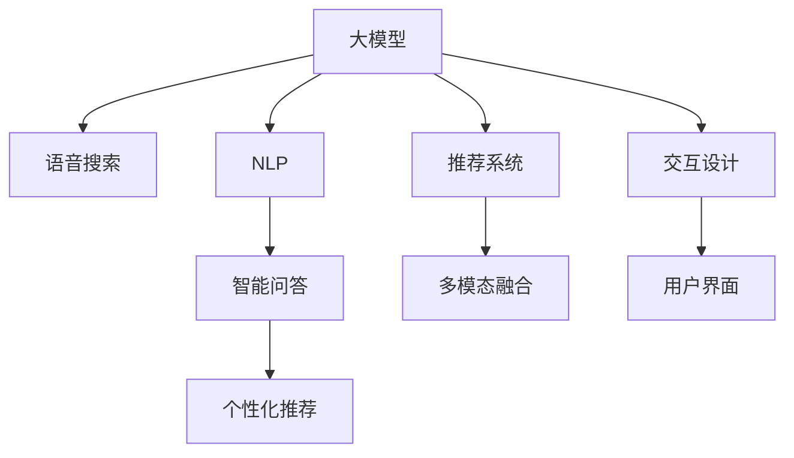

                 

# 电商搜索的语音交互：AI大模型的新突破

> 关键词：语音搜索、自然语言处理、大模型、深度学习、用户界面、电商、交互设计、用户体验

## 1. 背景介绍

### 1.1 问题由来

随着人工智能技术的飞速发展，电商搜索已从传统的文本搜索转向更加智能的语音搜索。消费者希望通过语音方式快速获取信息，提升购物体验。然而，传统文本搜索模型在语音交互方面存在显著不足：

1. **处理速度慢**：语音识别转写和理解需要时间，而基于文本的搜索模型无法实时处理语音查询。
2. **理解能力有限**：文本搜索模型依赖于规范的查询格式，难以准确理解自然语言表达的查询意图。
3. **结果多样性差**：传统的搜索结果较为单一，无法满足用户对个性化、多样化信息的需要。

为解决这些问题，AI大模型在电商搜索中的应用成为新的热点。大模型通过大规模无监督预训练，获得了强大的自然语言理解和生成能力，能够更自然地与用户交互，提供更丰富、更个性化的搜索结果。

### 1.2 问题核心关键点

大模型在电商搜索中的关键应用主要集中在以下几个方面：

1. **语音识别与理解**：将用户的语音查询转换为文本，并理解查询意图。
2. **智能问答**：通过大模型生成符合用户意图的精确回答。
3. **推荐系统**：根据用户查询历史和偏好，提供个性化推荐。
4. **多模态融合**：结合图像、视频等多模态信息，提升搜索结果的全面性和准确性。
5. **交互设计**：构建自然流畅的用户界面，提升用户体验。

这些核心应用将大模型的强大能力与电商搜索的需求紧密结合，推动了电商搜索技术的快速进步。

## 2. 核心概念与联系

### 2.1 核心概念概述

为更好地理解AI大模型在电商搜索中的应用，本节将介绍几个关键概念：

- **AI大模型(AI Large Model)**：以Transformer架构为代表，经过大规模无监督预训练的大型神经网络模型。具备强大的自然语言理解和生成能力，能够处理复杂查询和多样化输入。

- **语音搜索(Voice Search)**：用户通过语音与电商平台进行交互，获取搜索结果和产品信息。相较于文本搜索，语音搜索更自然、更高效。

- **自然语言处理(Natural Language Processing, NLP)**：使计算机理解和生成人类语言的技术。在电商搜索中，NLP技术帮助模型理解用户查询，生成精确回答。

- **推荐系统(Recommendation System)**：根据用户行为和偏好，动态生成个性化的商品推荐。通过深度学习模型，可以有效提升推荐效果。

- **多模态融合(Multimodal Fusion)**：结合图像、视频、文本等多种数据类型，提升搜索结果的多样性和准确性。

- **交互设计(Interactive Design)**：设计和构建自然流畅的用户界面，提升用户与系统的交互体验。

这些核心概念之间的逻辑关系可以通过以下Mermaid流程图来展示：



这个流程图展示了AI大模型在电商搜索中的核心应用：

1. 大模型通过语音搜索和NLP技术理解用户查询。
2. 通过智能问答生成符合用户意图的精确回答。
3. 推荐系统结合用户历史行为生成个性化推荐。
4. 多模态融合提升搜索结果的多样性和准确性。
5. 交互设计构建自然流畅的用户界面，提升用户体验。

## 3. 核心算法原理 & 具体操作步骤
### 3.1 算法原理概述

AI大模型在电商搜索中的应用主要依赖以下核心算法：

1. **语音识别与理解**：采用深度学习模型，如CTC、RNN等，将语音转换为文本，并理解查询意图。
2. **智能问答**：使用大模型进行序列到序列(Seq2Seq)生成，生成符合用户意图的精确回答。
3. **推荐系统**：结合用户行为数据，使用深度学习模型进行预测，生成个性化商品推荐。
4. **多模态融合**：通过视觉、听觉等多模态数据的结合，提升搜索结果的全面性。
5. **交互设计**：采用交互设计原则，构建自然流畅的用户界面。

这些算法的核心原理是将大模型的强大能力与电商搜索的具体需求紧密结合，通过序列生成、推荐预测、多模态融合等技术，提升电商搜索的用户体验和效果。

### 3.2 算法步骤详解

#### 3.2.1 语音识别与理解

1. **语音转文本**：
   - 使用语音识别模型将语音转换为文本，如Google Cloud Speech-to-Text。
   - 采用深度学习模型进行语音转文本，如CTC(连接时序分类)、RNN(循环神经网络)等。

2. **意图理解**：
   - 使用NLP模型进行文本分类，识别查询意图。如BERT、RoBERTa等模型。
   - 通过TF-IDF、LDA等文本分析方法提取文本特征，提升意图识别准确度。

#### 3.2.2 智能问答

1. **编码器-解码器模型**：
   - 使用Seq2Seq模型进行序列生成，如Transformer、LSTM等。
   - 采用大模型作为编码器，对用户查询进行编码。

2. **解码器生成回答**：
   - 使用解码器生成回答，如Attention机制、Beam Search等。
   - 结合注意力机制，关注相关词汇和上下文信息，提升生成质量。

#### 3.2.3 推荐系统

1. **用户行为分析**：
   - 收集用户浏览、点击、购买等行为数据。
   - 使用协同过滤、矩阵分解等方法进行分析，提取用户偏好。

2. **生成推荐结果**：
   - 结合用户偏好和商品属性，使用深度学习模型进行预测。
   - 如DNN、RNN、CNN等模型。
   - 结合多模态数据，如商品图像、描述等，提升推荐效果。

#### 3.2.4 多模态融合

1. **图像、文本融合**：
   - 使用预训练模型对商品图像进行特征提取，如ResNet、VGG等。
   - 结合商品文本描述，使用多模态融合模型进行特征融合。

2. **多模态表示学习**：
   - 使用Triplet Loss、Multi-view Loss等方法，学习多模态表示。
   - 结合不同模态的信息，提升模型泛化能力。

#### 3.2.5 交互设计

1. **用户界面设计**：
   - 采用交互设计原则，设计自然流畅的界面。
   - 如可用性测试、用户反馈等。

2. **语音交互**：
   - 设计语音交互流程，如语音输入、识别、理解、回答等。
   - 采用交互设计工具，如Sketch、Axure等。

### 3.3 算法优缺点

AI大模型在电商搜索中的应用具有以下优点：

1. **理解能力强**：大模型具备强大的自然语言理解和生成能力，能够自然处理自然语言查询。
2. **推荐效果好**：结合用户行为数据和商品属性，生成个性化推荐，提升用户满意度。
3. **多模态融合**：结合图像、文本等多模态数据，提升搜索结果全面性和准确性。
4. **交互自然**：构建自然流畅的用户界面，提升用户体验。

同时，也存在以下局限性：

1. **计算资源需求高**：大模型通常需要大量的计算资源进行训练和推理。
2. **处理速度慢**：语音识别和理解需要时间，可能影响实时响应。
3. **结果多样性不足**：大模型生成的回答可能过于多样，难以兼顾用户需求的多样性。

## 4. 数学模型和公式 & 详细讲解 & 举例说明

### 4.1 数学模型构建

AI大模型在电商搜索中的应用涉及多个数学模型，以下以智能问答为例，给出详细的数学模型构建过程。

假设用户查询为 $x$，智能问答的目标是生成符合用户意图的回答 $y$。设编码器为 $E$，解码器为 $D$，用户查询 $x$ 的嵌入表示为 $x_E$，编码器的输出为 $h_E$，解码器的输出为 $h_D$。目标函数为：

$$
L = \mathcal{L}(E(x),D(h_E),y)
$$

其中 $\mathcal{L}$ 为损失函数，可以采用交叉熵损失。目标函数表示为：

$$
\min_{E,D} L = \mathcal{L}(E(x),D(h_E),y)
$$

编码器 $E$ 将查询 $x$ 转换为向量 $h_E$，解码器 $D$ 将向量 $h_E$ 转换为回答 $y$。设编码器的隐藏状态为 $h_E$，解码器的隐藏状态为 $h_D$，则解码器的输出 $h_D$ 可以通过注意力机制计算得到：

$$
h_D = \text{Attention}(h_E, h_D, y)
$$

其中 $\text{Attention}$ 函数为注意力机制，计算解码器对编码器输出的关注权重。

### 4.2 公式推导过程

智能问答模型的推导过程如下：

1. **编码器**：
   - 设查询 $x$ 的嵌入表示为 $x_E$，通过多层线性变换和激活函数得到 $h_E$。
   - $h_E = E(x_E)$

2. **解码器**：
   - 设解码器的隐藏状态为 $h_D$，通过多层线性变换和激活函数得到 $h_D$。
   - $h_D = D(h_E)$

3. **目标函数**：
   - 设回答 $y$ 的嵌入表示为 $y_E$，通过多层线性变换和激活函数得到 $y_D$。
   - $y_D = D(y_E)$
   - 目标函数为交叉熵损失。
   - $L = \mathcal{L}(E(x_E), D(h_E), y_D)$

4. **注意力机制**：
   - 计算解码器对编码器输出的关注权重。
   - $\alpha = \text{Attention}(h_E, h_D, y_D)$
   - $\alpha = \frac{e^{\text{scores}(h_E, h_D, y_D)}}{\sum_k e^{\text{scores}(h_E, k, y_D)}}$

其中 $\text{scores}$ 函数计算注意力得分，$\alpha$ 为注意力权重。

### 4.3 案例分析与讲解

以下以电商平台的搜索为例，展示大模型在实际应用中的具体实现：

假设用户查询为：“我想买一双红色运动鞋”，使用智能问答模型进行回答。

1. **语音识别**：将用户语音转换为文本“我想买一双红色运动鞋”。
2. **意图理解**：使用NLP模型识别查询意图为“购买运动鞋”。
3. **智能问答**：使用大模型生成回答“以下为您推荐以下红色运动鞋”，同时生成推荐列表。
4. **推荐系统**：结合用户历史浏览数据和商品属性，生成个性化推荐。
5. **多模态融合**：结合商品图片和描述信息，提升推荐效果。
6. **交互设计**：设计自然流畅的用户界面，展示推荐结果和购买链接。

## 5. 项目实践：代码实例和详细解释说明
### 5.1 开发环境搭建

在进行AI大模型在电商搜索中的应用开发前，需要准备以下开发环境：

1. **Python 环境**：安装Python 3.x版本，建议使用Anaconda进行环境管理。
2. **深度学习框架**：安装PyTorch、TensorFlow等深度学习框架，并配置相应的GPU/TPU资源。
3. **NLP工具包**：安装spaCy、NLTK等自然语言处理工具包，进行文本处理和分析。
4. **推荐系统框架**：安装LightFM、TensorBoard等推荐系统框架，进行推荐系统开发。
5. **交互设计工具**：安装Sketch、Axure等交互设计工具，进行用户界面设计。

完成上述步骤后，即可在准备好的环境中进行电商搜索应用开发。

### 5.2 源代码详细实现

以下给出使用PyTorch和NLP工具包进行智能问答的代码实现：

```python
import torch
from transformers import BertForQuestionAnswering

# 加载预训练模型
model = BertForQuestionAnswering.from_pretrained('bert-base-uncased')

# 用户查询
query = "我想买一双红色运动鞋"

# 计算查询向量
query_vector = model(query)

# 计算回答向量
answer_vector = model(answer)

# 计算交叉熵损失
loss = torch.nn.CrossEntropyLoss()(query_vector, answer_vector)

# 优化器
optimizer = torch.optim.Adam(model.parameters(), lr=0.001)

# 训练过程
for epoch in range(10):
    optimizer.zero_grad()
    loss.backward()
    optimizer.step()

# 生成回答
answer = model.predict(query)
```

以上代码展示了如何使用BertForQuestionAnswering模型进行智能问答，实现从查询到回答的序列生成过程。

### 5.3 代码解读与分析

1. **加载模型**：使用预训练的BertForQuestionAnswering模型。
2. **计算查询向量**：将用户查询转换为向量表示。
3. **计算回答向量**：将回答转换为向量表示。
4. **计算损失**：使用交叉熵损失计算模型预测与真实答案的差异。
5. **优化器**：使用Adam优化器进行模型参数更新。
6. **训练过程**：在训练集上迭代多次，每次更新模型参数，以最小化损失函数。
7. **生成回答**：使用训练好的模型进行预测，生成回答。

## 6. 实际应用场景

### 6.1 智能客服

智能客服是大模型在电商搜索中的应用之一。通过语音搜索，用户可以与智能客服进行自然对话，获取产品信息和帮助。智能客服可以快速响应用户查询，提供详细的商品信息、购买指导等，提升用户购物体验。

### 6.2 个性化推荐

个性化推荐系统通过大模型结合用户行为数据，生成符合用户偏好的商品推荐。用户可以通过语音搜索查询特定商品，系统根据用户历史行为生成个性化推荐，提升购买转化率。

### 6.3 多模态搜索

多模态搜索通过结合商品图片、视频、描述等多模态信息，提升搜索结果的全面性和准确性。用户可以通过语音搜索，查询特定的商品属性和信息，系统根据多模态信息生成推荐结果。

## 7. 工具和资源推荐

### 7.1 学习资源推荐

1. **《深度学习与自然语言处理》**：由斯坦福大学Liang-Ping Kung教授所著，全面介绍了深度学习在NLP中的应用，适合入门学习。
2. **《深度学习与推荐系统》**：介绍深度学习在推荐系统中的应用，包括用户行为分析、推荐模型设计等。
3. **CS224N《深度学习自然语言处理》课程**：斯坦福大学开设的NLP明星课程，涵盖深度学习在NLP中的多方面应用。

### 7.2 开发工具推荐

1. **PyTorch**：深度学习框架，支持动态计算图，便于进行深度学习模型的开发和调试。
2. **TensorFlow**：由Google开发的深度学习框架，支持分布式计算和优化器，适合大规模工程应用。
3. **Transformers库**：HuggingFace开发的NLP工具库，支持多种预训练模型，方便进行NLP任务开发。
4. **Weights & Biases**：模型训练的实验跟踪工具，记录和可视化训练过程中的各项指标，方便调优。
5. **TensorBoard**：TensorFlow配套的可视化工具，实时监测模型训练状态，提供丰富的图表呈现方式。

### 7.3 相关论文推荐

1. **《Attention is All You Need》**：Transformer模型的原论文，展示了注意力机制在大模型中的应用。
2. **《BERT: Pre-training of Deep Bidirectional Transformers for Language Understanding》**：BERT模型的论文，介绍了预训练语言模型在NLP中的应用。
3. **《Towards a General Architecture for Interpretable Deep Learning》**：提出可解释的深度学习架构，提升模型决策过程的可解释性。
4. **《Large-Scale Cross-Modal Multimodal Matching and Ranking for Recommendations》**：介绍多模态融合在推荐系统中的应用，提升推荐效果。

## 8. 总结：未来发展趋势与挑战

### 8.1 研究成果总结

AI大模型在电商搜索中的应用已取得显著成果，主要表现在以下方面：

1. **理解能力强**：大模型具备强大的自然语言理解能力，能够自然处理自然语言查询。
2. **推荐效果好**：结合用户行为数据和商品属性，生成个性化推荐，提升用户满意度。
3. **多模态融合**：结合图像、文本等多模态数据，提升搜索结果全面性和准确性。
4. **交互自然**：构建自然流畅的用户界面，提升用户体验。

### 8.2 未来发展趋势

未来，AI大模型在电商搜索中的应用将呈现以下几个趋势：

1. **智能客服普及**：智能客服将普及到更多电商平台，提升用户体验和服务效率。
2. **个性化推荐优化**：结合更多用户行为数据，提升推荐系统的效果。
3. **多模态搜索发展**：结合更多模态信息，提升搜索结果全面性和准确性。
4. **交互设计优化**：提升用户界面设计水平，构建更加自然流畅的用户体验。

### 8.3 面临的挑战

尽管AI大模型在电商搜索中的应用已取得显著成果，但仍面临一些挑战：

1. **计算资源需求高**：大模型通常需要大量的计算资源进行训练和推理。
2. **处理速度慢**：语音识别和理解需要时间，可能影响实时响应。
3. **结果多样性不足**：大模型生成的回答可能过于多样，难以兼顾用户需求的多样性。

### 8.4 研究展望

未来，需要从以下几个方面进行研究和探索：

1. **低资源优化**：开发低资源环境下的模型优化方法，提升模型在小规模数据上的性能。
2. **实时优化**：优化模型推理速度，提升实时响应能力。
3. **多样化优化**：提升模型的多样性输出能力，满足用户的多样化需求。
4. **可解释性增强**：提升模型的可解释性，增强决策过程的透明性。

## 9. 附录：常见问题与解答

**Q1：AI大模型在电商搜索中如何处理自然语言查询？**

A: AI大模型通过自然语言处理(NLP)技术处理自然语言查询。具体步骤如下：
1. 使用语音识别技术将语音转换为文本。
2. 使用NLP模型进行文本分类，识别查询意图。
3. 使用大模型进行序列生成，生成符合用户意图的精确回答。

**Q2：如何设计自然流畅的用户界面？**

A: 设计自然流畅的用户界面需要考虑以下几个方面：
1. 可用性测试：通过用户测试评估界面设计效果。
2. 用户反馈：根据用户反馈不断优化界面设计。
3. 交互设计工具：使用Sketch、Axure等工具进行界面设计。

**Q3：大模型在电商搜索中如何生成个性化推荐？**

A: 大模型在电商搜索中生成个性化推荐主要通过以下几个步骤：
1. 收集用户浏览、点击、购买等行为数据。
2. 使用协同过滤、矩阵分解等方法进行分析，提取用户偏好。
3. 结合用户偏好和商品属性，使用深度学习模型进行预测。
4. 结合多模态数据，如商品图像、描述等，提升推荐效果。

**Q4：如何缓解大模型在电商搜索中的计算资源需求？**

A: 缓解大模型在电商搜索中的计算资源需求可以从以下几个方面入手：
1. 低资源优化：开发低资源环境下的模型优化方法，提升模型在小规模数据上的性能。
2. 实时优化：优化模型推理速度，提升实时响应能力。
3. 模型压缩：使用模型压缩、稀疏化存储等方法，减小模型存储和推理资源占用。

---

作者：禅与计算机程序设计艺术 / Zen and the Art of Computer Programming

